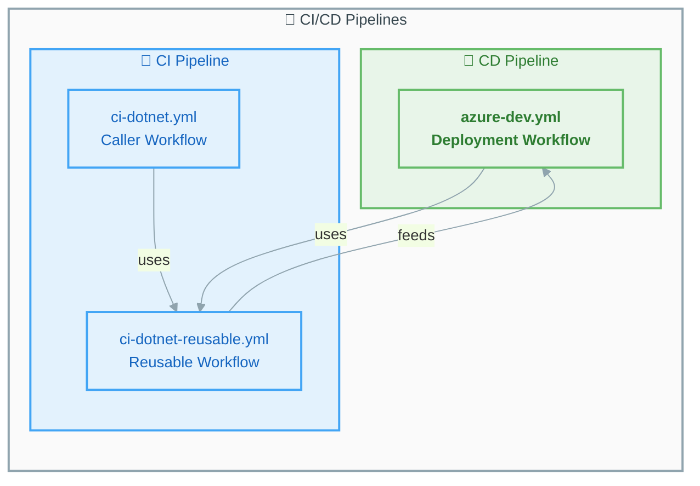

# 📚 GitHub Actions Workflow Documentation


This directory contains comprehensive documentation for all GitHub Actions workflows in this repository.

---

## 📑 Table of Contents

- [📋 Workflow Index](#-workflow-index)
- [🔄 Pipeline Overview](#-pipeline-overview)
- [🎯 Quick Reference](#-quick-reference)
  - [Trigger Summary](#trigger-summary)
  - [Platform Support](#platform-support)
- [📊 Jobs Overview](#-jobs-overview)
  - [CI Pipeline Jobs](#ci-pipeline-jobs)
  - [CD Pipeline Jobs](#cd-pipeline-jobs)
- [🔐 Security Features](#-security-features)
- [📦 Artifacts Generated](#-artifacts-generated)
- [🔗 External Dependencies](#-external-dependencies)
- [🚀 Quick Start](#-quick-start)
- [📚 Additional Resources](#-additional-resources)

---

## 📋 Workflow Index

| Workflow | File | Type | Description |
|----------|------|------|-------------|
| [🔨 CI - .NET Build and Test](ci-dotnet.md) | `ci-dotnet.yml` | Caller | Orchestrates CI pipeline via reusable workflow |
| [🔄 CI - .NET Reusable](ci-dotnet-reusable.md) | `ci-dotnet-reusable.yml` | Reusable | Cross-platform build, test, analyze, CodeQL |
| [🚀 CD - Azure Deployment](azure-dev.md) | `azure-dev.yml` | CD | Azure infrastructure provisioning and deployment |

> [!TIP]
> Start with the **CI - .NET Build and Test** workflow for understanding the CI process, then explore the **CD - Azure Deployment** for deployment details.

[⬆️ Back to Top](#-github-actions-workflow-documentation)

---

## 🔄 Pipeline Overview

The diagram below illustrates how the CI/CD pipelines interact with each other:



[⬆️ Back to Top](#-github-actions-workflow-documentation)

---

## 🎯 Quick Reference

### Trigger Summary

| Workflow | Push | Pull Request | Manual | Scheduled |
|----------|:----:|:------------:|:------:|:---------:|
| 🔨 CI - .NET | ✅ | ✅ | ✅ | ❌ |
| 🚀 CD - Azure | ✅ | ❌ | ✅ | ❌ |

### Platform Support

| Workflow | 🐧 Ubuntu | 🪟 Windows | 🍎 macOS |
|----------|:---------:|:----------:|:--------:|
| CI - .NET (Build) | ✅ | ✅ | ✅ |
| CI - .NET (Test) | ✅ | ✅ | ✅ |
| CI - .NET (Analyze) | ✅ | ❌ | ❌ |
| CI - .NET (CodeQL) | ✅ | ❌ | ❌ |
| CD - Azure | ✅ | ❌ | ❌ |

> [!NOTE]
> Analysis and CodeQL jobs run only on Ubuntu to optimize runner costs while maintaining security coverage.

[⬆️ Back to Top](#-github-actions-workflow-documentation)

---

## 📊 Jobs Overview

### CI Pipeline Jobs

| Job | Description | Platforms | Timeout |
|-----|-------------|-----------|---------|
| 🔨 Build | Compile .NET solution | Ubuntu, Windows, macOS | 15 min |
| 🧪 Test | Run tests with coverage | Ubuntu, Windows, macOS | 30 min |
| 🔍 Analyze | Code formatting check | Ubuntu | 15 min |
| 🛡️ CodeQL | Security scanning | Ubuntu | 45 min |
| 📊 Summary | Aggregate results | Ubuntu | 5 min |

### CD Pipeline Jobs

| Job | Description | Platform | Timeout |
|-----|-------------|----------|---------|
| 🔄 CI | Reusable CI workflow | Cross-platform | Via reusable |
| 🚀 Deploy Dev | Azure deployment | Ubuntu | 30 min |
| 📊 Summary | Pipeline status | Ubuntu | 5 min |
| ❌ On-Failure | Error reporting | Ubuntu | 5 min |

[⬆️ Back to Top](#-github-actions-workflow-documentation)

---

## 🔐 Security Features

| Feature | CI | CD | Description |
|---------|:--:|:--:|-------------|
| SHA-Pinned Actions | ✅ | ✅ | Supply chain security |
| CodeQL Scanning | ✅ | ✅ (via CI) | Vulnerability detection |
| OIDC Authentication | ❌ | ✅ | Secure Azure auth |
| Least-Privilege Permissions | ✅ | ✅ | Minimal access rights |
| No Long-Lived Secrets | ✅ | ✅ | Enhanced security |

> [!IMPORTANT]
> All workflows use **SHA-pinned actions** to prevent supply chain attacks. Never update action versions without verifying the commit SHA.

[⬆️ Back to Top](#-github-actions-workflow-documentation)

---

## 📦 Artifacts Generated

### CI Artifacts

| Artifact | Format | Retention | Purpose |
|----------|--------|-----------|---------|
| `build-artifacts-{os}` | Compiled binaries | 30 days | Build outputs |
| `test-results-{os}` | .trx files | 30 days | Test reports |
| `code-coverage-{os}` | Cobertura XML | 30 days | Coverage metrics |
| `codeql-sarif-results` | SARIF | 30 days | Security findings |

[⬆️ Back to Top](#-github-actions-workflow-documentation)

---

## 🔗 External Dependencies

### Actions Used

| Action | Version | Used By | Purpose |
|--------|---------|---------|---------|
| `actions/checkout` | v6.0.2 | CI, CD | Repository checkout |
| `actions/setup-dotnet` | v5.1.0 | CI, CD | .NET SDK setup |
| `actions/upload-artifact` | v6.0.0 | CI | Artifact storage |
| `dorny/test-reporter` | v2.5.0 | CI | Test reporting |
| `github/codeql-action/*` | v3.28.0 | CI | Security scanning |
| `Azure/setup-azd` | v2.2.1 | CD | Azure Developer CLI |
| `azure/login` | v2.4.0 | CD | Azure authentication |

[⬆️ Back to Top](#-github-actions-workflow-documentation)

---

## 🚀 Quick Start

### Run CI Manually

```bash
gh workflow run ci-dotnet.yml
```

### Run CD Manually

```bash
gh workflow run azure-dev.yml
```

### Run CD Skipping CI

```bash
gh workflow run azure-dev.yml -f skip-ci=true
```

> [!WARNING]
> Use `skip-ci=true` with caution. Skipping CI checks may deploy untested code to your environments.

[⬆️ Back to Top](#-github-actions-workflow-documentation)

---

## 📚 Additional Resources

### External Documentation

| Resource | Description |
|----------|-------------|
| [GitHub Actions Documentation](https://docs.github.com/en/actions) | Official GitHub Actions docs |
| [GitHub Reusable Workflows](https://docs.github.com/en/actions/using-workflows/reusing-workflows) | Guide to reusable workflows |
| [Azure Developer CLI](https://learn.microsoft.com/en-us/azure/developer/azure-developer-cli/) | azd documentation |
| [CodeQL Documentation](https://docs.github.com/en/code-security/code-scanning/introduction-to-code-scanning/about-code-scanning-with-codeql) | Security scanning guide |
| [Azure OIDC Setup](https://learn.microsoft.com/en-us/azure/developer/github/connect-from-azure) | Federated credentials guide |

### Related Workflow Files

| File | Description |
|------|-------------|
| [azure-dev.yml](../azure-dev.yml) | CD workflow definition |
| [ci-dotnet.yml](../ci-dotnet.yml) | CI caller workflow |
| [ci-dotnet-reusable.yml](../ci-dotnet-reusable.yml) | Reusable CI workflow |

[⬆️ Back to Top](#-github-actions-workflow-documentation)

---

<div align="center">

**📖 Workflow Documentation**

[🔨 CI Workflow](ci-dotnet.md) • [🔄 Reusable CI](ci-dotnet-reusable.md) • [🚀 CD Workflow](azure-dev.md)

---

*Last updated: January 27, 2026*

</div>
