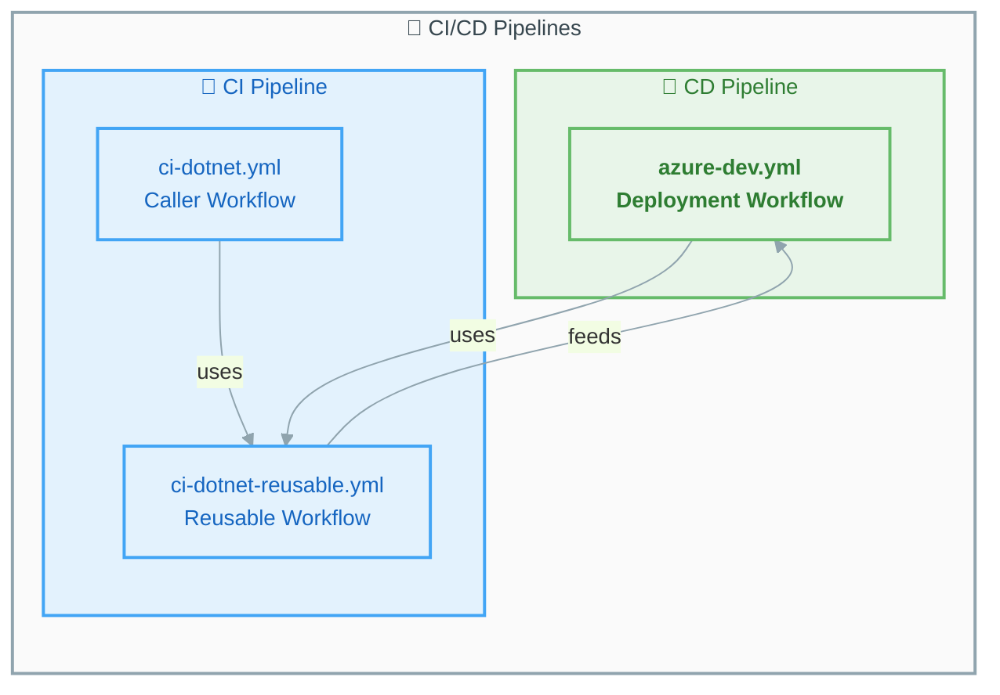

# GitHub Actions Workflow Documentation


This directory contains comprehensive documentation for all GitHub Actions workflows in this repository.

---

## 📋 Workflow Index

| Workflow | File | Type | Description |
|----------|------|------|-------------|
| [CI - .NET Build and Test](ci-dotnet.md) | `ci-dotnet.yml` | Caller | Orchestrates CI pipeline via reusable workflow |
| [CI - .NET Reusable](ci-dotnet-reusable.md) | `ci-dotnet-reusable.yml` | Reusable | Cross-platform build, test, analyze, CodeQL |
| [CD - Azure Deployment](azure-dev.md) | `azure-dev.yml` | CD | Azure infrastructure provisioning and deployment |

---

## 🔄 Pipeline Overview



---

## 🎯 Quick Reference

### Trigger Summary

| Workflow | Push | Pull Request | Manual | Scheduled |
|----------|:----:|:------------:|:------:|:---------:|
| CI - .NET | ✅ | ✅ | ✅ | ❌ |
| CD - Azure | ✅ | ❌ | ✅ | ❌ |

### Platform Support

| Workflow | 🐧 Ubuntu | 🪟 Windows | 🍎 macOS |
|----------|:---------:|:----------:|:--------:|
| CI - .NET (Build) | ✅ | ✅ | ✅ |
| CI - .NET (Test) | ✅ | ✅ | ✅ |
| CI - .NET (Analyze) | ✅ | ❌ | ❌ |
| CI - .NET (CodeQL) | ✅ | ❌ | ❌ |
| CD - Azure | ✅ | ❌ | ❌ |

---

## 📊 Jobs Overview

### CI Pipeline Jobs

| Job | Description | Platforms | Timeout |
|-----|-------------|-----------|---------|
| 🔨 Build | Compile .NET solution | Ubuntu, Windows, macOS | 15 min |
| 🧪 Test | Run tests with coverage | Ubuntu, Windows, macOS | 30 min |
| 🔍 Analyze | Code formatting check | Ubuntu | 15 min |
| 🛡️ CodeQL | Security scanning | Ubuntu | 45 min |
| 📊 Summary | Aggregate results | Ubuntu | 5 min |

### CD Pipeline Jobs

| Job | Description | Platform | Timeout |
|-----|-------------|----------|---------|
| 🔄 CI | Reusable CI workflow | Cross-platform | Via reusable |
| 🚀 Deploy Dev | Azure deployment | Ubuntu | 30 min |
| 📊 Summary | Pipeline status | Ubuntu | 5 min |
| ❌ On-Failure | Error reporting | Ubuntu | 5 min |

---

## 🔐 Security Features

| Feature | CI | CD |
|---------|:--:|:--:|
| SHA-Pinned Actions | ✅ | ✅ |
| CodeQL Scanning | ✅ | ✅ (via CI) |
| OIDC Authentication | ❌ | ✅ |
| Least-Privilege Permissions | ✅ | ✅ |
| No Long-Lived Secrets | ✅ | ✅ |

---

## 📦 Artifacts Generated

### CI Artifacts

| Artifact | Format | Retention |
|----------|--------|-----------|
| `build-artifacts-{os}` | Compiled binaries | 30 days |
| `test-results-{os}` | .trx files | 30 days |
| `code-coverage-{os}` | Cobertura XML | 30 days |
| `codeql-sarif-results` | SARIF | 30 days |

---

## 🔗 External Dependencies

### Actions Used

| Action | Version | Used By |
|--------|---------|---------|
| `actions/checkout` | v6.0.2 | CI, CD |
| `actions/setup-dotnet` | v5.1.0 | CI, CD |
| `actions/upload-artifact` | v6.0.0 | CI |
| `dorny/test-reporter` | v2.5.0 | CI |
| `github/codeql-action/*` | v3.28.0 | CI |
| `Azure/setup-azd` | v2.2.1 | CD |
| `azure/login` | v2.4.0 | CD |

---

## 🚀 Quick Start

### Run CI Manually

```bash
gh workflow run ci-dotnet.yml
```

### Run CD Manually

```bash
gh workflow run azure-dev.yml
```

### Run CD Skipping CI

```bash
gh workflow run azure-dev.yml -f skip-ci=true
```

---

## 📚 Additional Resources

- [GitHub Actions Documentation](https://docs.github.com/en/actions)
- [GitHub Reusable Workflows](https://docs.github.com/en/actions/using-workflows/reusing-workflows)
- [Azure Developer CLI](https://learn.microsoft.com/en-us/azure/developer/azure-developer-cli/)
- [CodeQL Documentation](https://docs.github.com/en/code-security/code-scanning/introduction-to-code-scanning/about-code-scanning-with-codeql)
- [Azure OIDC Setup](https://learn.microsoft.com/en-us/azure/developer/github/connect-from-azure)
