# 🚀 CD - Azure Deployment Workflow

<div align="center">


**[📚 Documentation Index](README.md)** • **[🔨 CI Workflow](ci-dotnet.md)** • **[🔄 Reusable CI](ci-dotnet-reusable.md)**

</div>

---

## 📑 Table of Contents

- [📋 Overview](#-overview)
- [📊 Workflow Diagram](#-workflow-diagram)
- [🔄 Pipeline Flow Diagram](#-pipeline-flow-diagram)
- [⚡ Trigger Events](#-trigger-events)
- [📝 Jobs Breakdown](#-jobs-breakdown)
  - [🔄 CI Job](#-ci-job)
  - [🚀 Deploy Dev Job](#-deploy-dev-job)
  - [📊 Summary Job](#-summary-job)
  - [❌ On-Failure Job](#-on-failure-job)
- [🔐 Permissions](#-permissions)
- [🌍 Environment Variables](#-environment-variables)
- [🔑 Secrets and Variables](#-secrets-and-variables)
- [📤 Outputs](#-outputs)
- [⚙️ Concurrency](#️-concurrency)
- [🔗 External Actions Used](#-external-actions-used)
- [📦 Dependencies](#-dependencies)
- [🛡️ Security Features](#️-security-features)
- [🔄 Retry Logic](#-retry-logic)
- [💡 Usage Examples](#-usage-examples)
- [📚 Related Documentation](#-related-documentation)

---

## 📋 Overview

| Property | Value |
|----------|-------|
| **Workflow Name** | `CD - Azure Deployment` |
| **File** | [azure-dev.yml](../azure-dev.yml) |
| **Purpose** | Provision Azure infrastructure and deploy .NET application using Azure Developer CLI (azd) |
| **Authentication** | OpenID Connect (OIDC) with federated credentials |

This workflow implements a complete CI/CD pipeline with:

- **Integrated CI** via reusable workflow (can be skipped)
- **OIDC authentication** (no stored secrets)
- **Infrastructure provisioning** via Azure Developer CLI
- **SQL Managed Identity** configuration with go-sqlcmd
- **Application deployment** with retry logic
- **Comprehensive summaries** and rollback instructions

> [!IMPORTANT]
> This workflow uses **OIDC federated credentials** for authentication. No long-lived secrets are stored in GitHub.

[⬆️ Back to Top](#-cd---azure-deployment-workflow)

---

## 📊 Workflow Diagram

```mermaid
%%{init: {'theme': 'base', 'themeVariables': {'fontSize': '14px', 'primaryColor': '#E3F2FD', 'lineColor': '#90A4AE', 'textColor': '#37474F', 'clusterBkg': '#FAFAFA'}}}%%
flowchart TB
    subgraph wf["🔄 Workflow: CD - Azure Deployment"]
        direction TB
        style wf fill:#FAFAFA,stroke:#90A4AE,stroke-width:2px,color:#37474F
        
        subgraph triggers["⚡ Stage: Triggers"]
            direction LR
            style triggers fill:#E8F5E9,stroke:#66BB6A,stroke-width:2px,color:#2E7D32
            subgraph events["Events"]
                direction LR
                style events fill:#FFFFFF,stroke:#A5D6A7,stroke-width:1px,color:#2E7D32
                push(["🔔 push: docs987678"]):::node-trigger
                manual(["🔔 workflow_dispatch"]):::node-trigger
            end
        end
        
        subgraph ci-stage["🔨 Stage: CI Pipeline"]
            direction TB
            style ci-stage fill:#E3F2FD,stroke:#42A5F5,stroke-width:2px,color:#1565C0
            subgraph ci-group["🔄 Reusable CI Workflow"]
                direction TB
                style ci-group fill:#FFFFFF,stroke:#90CAF9,stroke-width:1px,color:#1565C0
                ci-call[["🔄 CI Pipeline<br/>ci-dotnet-reusable.yml"]]:::node-build
                skip-note["⏭️ Can be skipped via skip-ci input"]:::node-setup
            end
        end
        
        subgraph deploy-stage["🚀 Stage: Deploy Dev"]
            direction TB
            style deploy-stage fill:#FFF3E0,stroke:#FFA726,stroke-width:2px,color:#E65100
            
            subgraph setup-group["⚙️ Setup Phase"]
                direction LR
                style setup-group fill:#FFFFFF,stroke:#FFCC80,stroke-width:1px,color:#E65100
                checkout["📥 Checkout"]:::node-setup
                prereqs["📦 Install Prerequisites<br/>go-sqlcmd, jq, dos2unix"]:::node-setup
                azd-install["🔧 Install azd CLI"]:::node-setup
                dotnet-setup["🔧 Setup .NET SDK"]:::node-setup
            end
            
            subgraph auth-group["🔐 Authentication Phase"]
                direction LR
                style auth-group fill:#FFFFFF,stroke:#90CAF9,stroke-width:1px,color:#1565C0
                azd-login["🔐 azd auth login<br/>OIDC"]:::node-security
                az-login["🔑 az CLI login<br/>OIDC"]:::node-security
            end
            
            subgraph provision-group["🏗️ Provision Phase"]
                direction TB
                style provision-group fill:#FFFFFF,stroke:#90CAF9,stroke-width:1px,color:#1565C0
                provision["🏗️ azd provision<br/>Bicep Infrastructure"]:::node-build
            end
            
            subgraph sql-group["🗄️ SQL Configuration Phase"]
                direction TB
                style sql-group fill:#FFFFFF,stroke:#CE93D8,stroke-width:1px,color:#7B1FA2
                refresh-pre["🔐 Refresh Credentials<br/>Pre-SQL"]:::node-security
                sql-config["🔑 Create SQL User<br/>Managed Identity"]:::node-lint
            end
            
            subgraph deploy-app-group["🚀 Deploy Phase"]
                direction TB
                style deploy-app-group fill:#FFFFFF,stroke:#A5D6A7,stroke-width:1px,color:#2E7D32
                refresh-post["🔐 Refresh Credentials<br/>Post-SQL"]:::node-security
                deploy-app["🚀 azd deploy<br/>Application"]:::node-production
                deploy-summary["📊 Deploy Summary"]:::node-setup
            end
        end
        
        subgraph reporting-stage["📊 Stage: Reporting"]
            direction LR
            style reporting-stage fill:#ECEFF1,stroke:#90A4AE,stroke-width:2px,color:#546E7A
            subgraph reports["Reports"]
                direction LR
                style reports fill:#FFFFFF,stroke:#B0BEC5,stroke-width:1px,color:#546E7A
                summary["📊 Summary<br/>Pipeline Results"]:::node-setup
                on-failure["❌ Handle Failure<br/>Error Report"]:::node-error
            end
        end
    end
    
    %% Trigger connections
    push & manual -->|"triggers"| ci-call
    
    %% CI to Deploy
    ci-call -->|"needs: ci<br/>if: success or skipped"| checkout
    
    %% Setup flow
    checkout --> prereqs --> azd-install --> dotnet-setup
    
    %% Auth flow
    dotnet-setup --> azd-login --> az-login
    
    %% Provision flow
    az-login --> provision
    
    %% SQL flow
    provision --> refresh-pre --> sql-config
    
    %% Deploy flow
    sql-config --> refresh-post --> deploy-app --> deploy-summary
    
    %% Reporting
    deploy-summary --> summary
    ci-call --> summary
    
    %% Failure handler
    ci-call -.->|"if: failure()"| on-failure
    deploy-app -.->|"if: failure()"| on-failure
    
    %% Node Class Definitions
    classDef node-trigger fill:#E8F5E9,stroke:#66BB6A,stroke-width:2px,color:#2E7D32,font-weight:bold
    classDef node-build fill:#E3F2FD,stroke:#42A5F5,stroke-width:2px,color:#1565C0
    classDef node-lint fill:#EDE7F6,stroke:#9575CD,stroke-width:2px,color:#512DA8
    classDef node-security fill:#E3F2FD,stroke:#42A5F5,stroke-width:2px,color:#1565C0
    classDef node-setup fill:#ECEFF1,stroke:#90A4AE,stroke-width:2px,color:#546E7A
    classDef node-error fill:#FFEBEE,stroke:#EF5350,stroke-width:2px,color:#C62828
    classDef node-production fill:#E8F5E9,stroke:#66BB6A,stroke-width:2px,color:#2E7D32,font-weight:bold
```



[⬆️ Back to Top](#-cd---azure-deployment-workflow)

---

## 🔄 Pipeline Flow Diagram

```mermaid
%%{init: {'theme': 'base', 'themeVariables': {'fontSize': '14px', 'primaryColor': '#E3F2FD', 'lineColor': '#90A4AE', 'textColor': '#37474F', 'clusterBkg': '#FAFAFA'}}}%%
flowchart LR
    subgraph pipeline["🔄 CD Pipeline Flow"]
        direction LR
        style pipeline fill:#FAFAFA,stroke:#90A4AE,stroke-width:2px,color:#37474F
        
        ci["🔨 CI"]:::node-build
        deploy["🚀 Deploy Dev"]:::node-production
        summary["📊 Summary"]:::node-setup
        failure["❌ On Failure"]:::node-error
    end
    
    ci -->|"success/skipped"| deploy
    deploy --> summary
    ci & deploy -.->|"if: failure()"| failure
    
    classDef node-build fill:#E3F2FD,stroke:#42A5F5,stroke-width:2px,color:#1565C0
    classDef node-production fill:#E8F5E9,stroke:#66BB6A,stroke-width:2px,color:#2E7D32,font-weight:bold
    classDef node-setup fill:#ECEFF1,stroke:#90A4AE,stroke-width:2px,color:#546E7A
    classDef node-error fill:#FFEBEE,stroke:#EF5350,stroke-width:2px,color:#C62828
```



[⬆️ Back to Top](#-cd---azure-deployment-workflow)

---

## ⚡ Trigger Events

| Trigger | Branches | Path Filters |
|---------|----------|--------------|
| **push** | `docs987678` | `src/**`, `app.*/**`, `infra/**`, `azure.yaml`, `.github/workflows/azure-dev.yml` |
| **workflow_dispatch** | Any | N/A (manual) |

### Manual Trigger Inputs

| Input | Type | Default | Description |
|-------|------|---------|-------------|
| `skip-ci` | boolean | `false` | Skip CI checks (use with caution) |

---

## Jobs Breakdown

### 🔄 CI Job

| Property | Value |
|----------|-------|
| **Name** | `🔄 CI` |
| **Type** | Reusable workflow call |
| **Condition** | `${{ github.event.inputs.skip-ci != 'true' }}` |

Calls `ci-dotnet-reusable.yml` with:

- Configuration: `Release`
- .NET Version: `10.0.x`
- Solution: `app.sln`
- Code Analysis: Enabled
- Fail on Format Issues: Disabled

---

### 🚀 Deploy Dev Job

| Property | Value |
|----------|-------|
| **Name** | `🚀 Deploy Dev` |
| **Runs On** | `ubuntu-latest` |
| **Timeout** | 30 minutes |
| **Needs** | `ci` |
| **Condition** | `always() && (needs.ci.result == 'success' \|\| needs.ci.result == 'skipped')` |
| **Environment** | `dev` |

#### Deployment Phases

| Phase | Description | Steps |
|-------|-------------|-------|
| **1. Setup** | Install prerequisites | Checkout, go-sqlcmd, azd CLI, .NET SDK |
| **2. Auth** | OIDC authentication | azd auth login, az CLI login |
| **3. Provision** | Infrastructure | azd provision (Bicep templates) |
| **4a. Re-auth** | Token refresh | Refresh credentials before SQL |
| **4b. SQL Config** | Database setup | Create managed identity user |
| **5. Re-auth** | Token refresh | Refresh credentials after SQL |
| **6. Deploy** | Application | azd deploy |
| **7. Summary** | Report | Generate deployment summary |

#### Steps Detail

| Step | Description |
|------|-------------|
| 📥 Checkout | Clone repository |
| 📦 Install Prerequisites | Install jq, dos2unix, go-sqlcmd |
| 🔧 Install azd CLI | Install Azure Developer CLI (latest) |
| 🔧 Setup .NET SDK | Install .NET 10.0.x |
| 🔐 azd auth login | OIDC authentication with GitHub federated credentials |
| 🔑 az CLI login | Azure CLI OIDC authentication |
| 🏗️ Provision Infrastructure | Run azd provision (Bicep) with retry logic |
| 🔐 Refresh Credentials (Pre-SQL) | Refresh OIDC tokens before SQL operations |
| 🔑 Create SQL User | Create managed identity user with go-sqlcmd |
| 🔐 Refresh Credentials (Post-SQL) | Refresh OIDC tokens after SQL operations |
| 🚀 Deploy Application | Run azd deploy with retry logic |
| 📊 Generate Summary | Create deployment summary report |

---

### 📊 Summary Job

| Property | Value |
|----------|-------|
| **Name** | `📊 Summary` |
| **Runs On** | `ubuntu-latest` |
| **Timeout** | 5 minutes |
| **Needs** | `ci`, `deploy-dev` |
| **Condition** | `always()` |

Generates comprehensive workflow summary with pipeline status.

---

### ❌ On-Failure Job

| Property | Value |
|----------|-------|
| **Name** | `❌ Handle Failure` |
| **Runs On** | `ubuntu-latest` |
| **Timeout** | 5 minutes |
| **Needs** | `ci`, `deploy-dev` |
| **Condition** | `failure()` |

Reports failure with job statuses and next steps.

---

## Permissions

| Permission | Level | Purpose |
|------------|-------|---------|
| `id-token` | `write` | Required for OIDC authentication with Azure |
| `contents` | `read` | Read repository contents for checkout |
| `checks` | `write` | Create check runs for test results |
| `pull-requests` | `write` | Post comments on pull requests |
| `security-events` | `write` | Upload CodeQL SARIF results |

---

## Environment Variables

### Workflow-Level

| Variable | Value | Description |
|----------|-------|-------------|
| `DOTNET_VERSION` | `10.0.x` | .NET SDK version |
| `DOTNET_SKIP_FIRST_TIME_EXPERIENCE` | `true` | Skip .NET welcome |
| `DOTNET_NOLOGO` | `true` | Suppress logo |
| `DOTNET_CLI_TELEMETRY_OPTOUT` | `true` | Opt out of telemetry |

### Deploy Job Environment

| Variable | Source | Default | Description |
|----------|--------|---------|-------------|
| `AZURE_CLIENT_ID` | `vars.AZURE_CLIENT_ID` | Required | Service Principal Client ID |
| `AZURE_TENANT_ID` | `vars.AZURE_TENANT_ID` | Required | Azure AD Tenant ID |
| `AZURE_SUBSCRIPTION_ID` | `vars.AZURE_SUBSCRIPTION_ID` | Required | Target Azure Subscription |
| `AZURE_ENV_NAME` | `vars.AZURE_ENV_NAME` | `dev` | Azure environment name |
| `AZURE_LOCATION` | `vars.AZURE_LOCATION` | `eastus2` | Azure region |
| `DEPLOYER_PRINCIPAL_TYPE` | `vars.DEPLOYER_PRINCIPAL_TYPE` | `ServicePrincipal` | Principal type |
| `DEPLOY_HEALTH_MODEL` | `vars.DEPLOY_HEALTH_MODEL` | Optional | Health model flag |

---

## Secrets and Variables

### Required Repository Variables

| Variable | Description |
|----------|-------------|
| `AZURE_CLIENT_ID` | Service Principal/App Registration Client ID |
| `AZURE_TENANT_ID` | Azure AD Tenant ID |
| `AZURE_SUBSCRIPTION_ID` | Target Azure Subscription ID |

### Optional Repository Variables

| Variable | Default | Description |
|----------|---------|-------------|
| `AZURE_ENV_NAME` | `dev` | Azure environment name |
| `AZURE_LOCATION` | `eastus2` | Azure region |
| `DEPLOYER_PRINCIPAL_TYPE` | `ServicePrincipal` | Principal type for deployment |
| `DEPLOY_HEALTH_MODEL` | N/A | Health model configuration |

---

## Outputs

### Deploy Job Outputs

| Output | Description |
|--------|-------------|
| `webapp-url` | URL of deployed web application |
| `resource-group` | Azure resource group name |

---

## Concurrency

```yaml
concurrency:
  group: deploy-dev-${{ github.ref }}
  cancel-in-progress: false
```

- Prevents simultaneous deployments to the same environment
- Does **not** cancel in-progress deployments

---

## External Actions Used

| Action | Version | Purpose |
|--------|---------|---------|
| `actions/checkout` | `v6.0.2` (SHA pinned) | Repository checkout |
| `Azure/setup-azd` | `v2.2.1` (SHA pinned) | Azure Developer CLI setup |
| `actions/setup-dotnet` | `v5.1.0` (SHA pinned) | .NET SDK setup |
| `azure/login` | `v2.4.0` (SHA pinned) | Azure CLI OIDC login |

---

## Dependencies

### Reusable Workflows Called

| Workflow | Purpose |
|----------|---------|
| [ci-dotnet-reusable.yml](ci-dotnet-reusable.md) | CI pipeline (build, test, analyze, CodeQL) |

### Prerequisites

1. **Azure Federated Credentials** - OIDC configured in Azure Entra ID
2. **GitHub Environment** - `dev` environment (with optional protection rules)
3. **go-sqlcmd** - Installed automatically for SQL Managed Identity configuration

---

## Security Features

| Feature | Description |
|---------|-------------|
| **OIDC Authentication** | No long-lived secrets stored |
| **Federated Credentials** | GitHub-to-Azure trust relationship |
| **Least-Privilege** | Minimal required permissions |
| **Token Refresh** | Re-authentication before sensitive operations |
| **CodeQL Scanning** | Security vulnerability detection (via CI) |
| **SHA-Pinned Actions** | Supply chain security |

---

## Retry Logic

### Infrastructure Provisioning

```yaml
MAX_RETRIES=3
RETRY_DELAY=30  # seconds, doubles on each retry
```

### SQL Operations

```yaml
MAX_RETRIES=3
RETRY_DELAY=15  # seconds, doubles on each retry
```

### Application Deployment

```yaml
MAX_RETRIES=3
RETRY_DELAY=30  # seconds, doubles on each retry
```

---

## Usage Examples

### Automatic Trigger

Push to the configured branch with changes in monitored paths:

```bash
git push origin docs987678
```

### Manual Trigger via GitHub UI

1. Navigate to **Actions** → **CD - Azure Deployment**
2. Click **Run workflow**
3. Select branch
4. Optionally check **Skip CI checks**
5. Click **Run workflow**

### Manual Trigger via GitHub CLI

```bash
# Full pipeline (with CI)
gh workflow run azure-dev.yml

# Skip CI checks
gh workflow run azure-dev.yml -f skip-ci=true
```

### Rollback Instructions

If deployment fails, you can rollback using:

```bash
# Option 1: Re-run with previous commit
gh workflow run azure-dev.yml --ref <previous-commit-sha>

# Option 2: Use Azure Developer CLI locally
git checkout <previous-commit-sha>
azd deploy --no-prompt
```

---

## Related Documentation

- [CI - .NET Build and Test](ci-dotnet.md) - CI workflow documentation
- [CI - .NET Reusable Workflow](ci-dotnet-reusable.md) - Reusable CI workflow
- [Azure OIDC Setup](https://learn.microsoft.com/en-us/azure/developer/github/connect-from-azure) - Azure federated credentials
- [Azure Developer CLI](https://learn.microsoft.com/en-us/azure/developer/azure-developer-cli/) - azd documentation
- [go-sqlcmd](https://github.com/microsoft/go-sqlcmd) - SQL command-line tool
