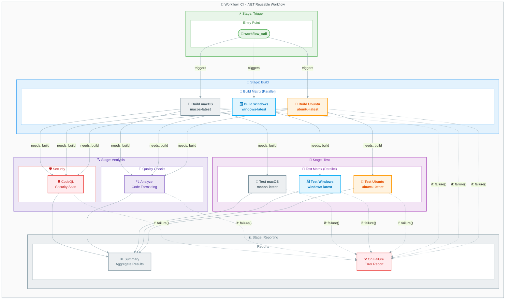

# 🔄 CI - .NET Reusable Workflow

<div align="center">


**[📚 Documentation Index](README.md)** • **[🔨 CI Caller](ci-dotnet.md)** • **[🚀 CD Workflow](azure-dev.md)**

</div>

---

## 📑 Table of Contents

- [📋 Overview](#-overview)
- [📊 Workflow Diagram](#-workflow-diagram)
- [⚡ Trigger Events](#-trigger-events)
- [📥 Input Parameters](#-input-parameters)
- [📤 Output Parameters](#-output-parameters)
- [📝 Jobs Breakdown](#-jobs-breakdown)
  - [🔨 Build Job](#-build-job-cross-platform-matrix)
  - [🧪 Test Job](#-test-job-cross-platform-matrix)
  - [🔍 Analyze Job](#-analyze-job-optional)
  - [🛡️ CodeQL Job](#️-codeql-job-always-runs)
  - [📊 Summary Job](#-summary-job)
  - [❌ On-Failure Job](#-on-failure-job)
- [🔐 Permissions](#-permissions)
- [📦 Artifacts Generated](#-artifacts-generated)
- [🔗 External Actions Used](#-external-actions-used)
- [🌍 Environment Variables](#-environment-variables)
- [💡 Usage Examples](#-usage-examples)
- [📚 Related Documentation](#-related-documentation)

---

## 📋 Overview

| Property | Value |
|----------|-------|
| **Workflow Name** | `CI - .NET Reusable Workflow` |
| **File** | [ci-dotnet-reusable.yml](../ci-dotnet-reusable.yml) |
| **Purpose** | Comprehensive reusable CI workflow for .NET solutions |
| **Type** | Reusable workflow (`workflow_call`) |

This reusable workflow provides a complete CI pipeline that performs:

- **Cross-platform builds** on Ubuntu, Windows, and macOS
- **Cross-platform testing** with code coverage (Cobertura format)
- **Code formatting analysis** (.editorconfig compliance)
- **CodeQL security scanning** (always enabled)

> [!TIP]
> This is a **reusable workflow** - call it from other workflows using `uses: ./.github/workflows/ci-dotnet-reusable.yml`.

[⬆️ Back to Top](#-ci---net-reusable-workflow)

---

## 📊 Workflow Diagram



[⬆️ Back to Top](#-ci---net-reusable-workflow)

---

## ⚡ Trigger Events

| Trigger | Description |
|---------|-------------|
| **workflow_call** | Called by other workflows as a reusable workflow |

[⬆️ Back to Top](#-ci---net-reusable-workflow)

---

## 📥 Input Parameters

| Input | Type | Required | Default | Description |
|-------|------|----------|---------|-------------|
| `configuration` | `string` | No | `Release` | Build configuration (`Release`/`Debug`) |
| `dotnet-version` | `string` | No | `10.0.x` | .NET SDK version to use |
| `solution-file` | `string` | No | `app.sln` | Path to the solution file |
| `test-results-artifact-name` | `string` | No | `test-results` | Name for test results artifact |
| `build-artifacts-name` | `string` | No | `build-artifacts` | Name for build artifacts |
| `coverage-artifact-name` | `string` | No | `code-coverage` | Name for code coverage artifact |
| `artifact-retention-days` | `number` | No | `30` | Days to retain artifacts |
| `runs-on` | `string` | No | `ubuntu-latest` | Runner for analyze/summary jobs |
| `enable-code-analysis` | `boolean` | No | `true` | Enable code formatting analysis |
| `fail-on-format-issues` | `boolean` | No | `true` | Fail workflow on formatting issues |

> [!NOTE]
> All inputs have sensible defaults. You can call this workflow without any inputs for a standard CI pipeline.

[⬆️ Back to Top](#-ci---net-reusable-workflow)

---

## 📤 Output Parameters

| Output | Description |
|--------|-------------|
| `build-version` | The generated build version |
| `build-result` | Build job result |
| `test-result` | Test job result |
| `analyze-result` | Analysis job result |
| `codeql-result` | CodeQL security scan result |

[⬆️ Back to Top](#-ci---net-reusable-workflow)

---

## 📝 Jobs Breakdown

### 🔨 Build Job (Cross-Platform Matrix)

| Property | Value |
|----------|-------|
| **Name** | `🔨 Build (${{ matrix.os }})` |
| **Runs On** | `ubuntu-latest`, `windows-latest`, `macos-latest` |
| **Timeout** | 15 minutes |
| **Strategy** | `fail-fast: false` |

#### Steps

| Step | Action | Description |
|------|--------|-------------|
| 📥 Checkout | `actions/checkout@v6.0.2` | Checkout repository with full history |
| 🔧 Setup .NET | `actions/setup-dotnet@v5.1.0` | Install .NET SDK |
| ☁️ Update workloads | `dotnet workload update` | Update .NET workloads |
| 🏷️ Generate version | Shell | Generate version `1.0.${{ github.run_number }}` |
| 📥 Restore | `dotnet restore` | Restore NuGet dependencies |
| 🔨 Build | `dotnet build` | Compile solution |
| 📤 Upload artifacts | `actions/upload-artifact@v6.0.0` | Upload build artifacts per OS |
| 📊 Summary | Shell | Generate build summary |

[⬆️ Back to Top](#-ci---net-reusable-workflow)

---

### 🧪 Test Job (Cross-Platform Matrix)

| Property | Value |
|----------|-------|
| **Name** | `🧪 Test (${{ matrix.os }})` |
| **Runs On** | `ubuntu-latest`, `windows-latest`, `macos-latest` |
| **Timeout** | 30 minutes |
| **Needs** | `build` |
| **Strategy** | `fail-fast: false` |

#### Steps

| Step | Action | Description |
|------|--------|-------------|
| 📥 Checkout | `actions/checkout@v6.0.2` | Checkout repository |
| 🔧 Setup .NET | `actions/setup-dotnet@v5.1.0` | Install .NET SDK |
| ☁️ Update workloads | `dotnet workload update` | Update .NET workloads |
| 📥 Restore | `dotnet restore` | Restore NuGet dependencies |
| 🔨 Build | `dotnet build` | Build for testing |
| 🧪 Run tests | `dotnet test` | Execute tests with coverage |
| 📋 Publish results | `dorny/test-reporter@v2.5.0` | Publish test results to GitHub |
| 📤 Upload test results | `actions/upload-artifact@v6.0.0` | Upload .trx files per OS |
| 📤 Upload coverage | `actions/upload-artifact@v6.0.0` | Upload Cobertura XML per OS |
| 📊 Summary | Shell | Generate test summary |

[⬆️ Back to Top](#-ci---net-reusable-workflow)

---

### 🔍 Analyze Job (Optional)

| Property | Value |
|----------|-------|
| **Name** | `🔍 Analyze` |
| **Runs On** | `${{ inputs.runs-on }}` (default: `ubuntu-latest`) |
| **Timeout** | 15 minutes |
| **Needs** | `build` |
| **Condition** | `${{ inputs.enable-code-analysis }}` |

#### Steps

| Step | Action | Description |
|------|--------|-------------|
| 📥 Checkout | `actions/checkout@v6.0.2` | Checkout repository |
| 🔧 Setup .NET | `actions/setup-dotnet@v5.1.0` | Install .NET SDK |
| ☁️ Update workloads | `dotnet workload update` | Update .NET workloads |
| 📥 Restore | `dotnet restore` | Restore NuGet dependencies |
| 🎨 Verify formatting | `dotnet format --verify-no-changes` | Check .editorconfig compliance |
| 📊 Summary | Shell | Generate analysis summary |
| ❌ Fail on issues | Shell | Fail if formatting issues found |

> [!TIP]
> Use `.editorconfig` files to define your code style rules. The analyze job verifies compliance automatically.

[⬆️ Back to Top](#-ci---net-reusable-workflow)

---

### 🛡️ CodeQL Job (Always Runs)

| Property | Value |
|----------|-------|
| **Name** | `🛡️ CodeQL Security Scan` |
| **Runs On** | `${{ inputs.runs-on }}` (default: `ubuntu-latest`) |
| **Timeout** | 45 minutes |
| **Needs** | `build` |

#### Steps

| Step | Action | Description |
|------|--------|-------------|
| 📥 Checkout | `actions/checkout@v6.0.2` | Checkout with full history |
| 🔧 Setup .NET | `actions/setup-dotnet@v5.1.0` | Install .NET SDK |
| 🛡️ Initialize CodeQL | `github/codeql-action/init@v3.28.0` | Initialize CodeQL for C# |
| 🔨 Autobuild | `github/codeql-action/autobuild@v3.28.0` | Automatic build for CodeQL |
| 🛡️ Analyze | `github/codeql-action/analyze@v3.28.0` | Perform security analysis |
| 📤 Upload SARIF | `actions/upload-artifact@v6.0.0` | Upload SARIF results |
| 📊 Summary | Shell | Generate CodeQL summary |

#### CodeQL Configuration

| Setting | Value |
|---------|-------|
| **Language** | `csharp` |
| **Query Suites** | `security-extended`, `security-and-quality` |
| **Paths Ignored** | `**/tests/**`, `**/test/**`, `**/*.test.cs`, `**/*.Tests.cs` |

> [!IMPORTANT]
> CodeQL is **always enabled** and cannot be disabled. Security scanning is mandatory for all builds.

[⬆️ Back to Top](#-ci---net-reusable-workflow)

---

### 📊 Summary Job

| Property | Value |
|----------|-------|
| **Name** | `📊 Summary` |
| **Runs On** | `${{ inputs.runs-on }}` (default: `ubuntu-latest`) |
| **Timeout** | 5 minutes |
| **Needs** | `build`, `test`, `analyze`, `codeql` |
| **Condition** | `always()` |

Aggregates results from all jobs into a comprehensive summary report.

[⬆️ Back to Top](#-ci---net-reusable-workflow)

---

### ❌ On-Failure Job

| Property | Value |
|----------|-------|
| **Name** | `❌ Failed` |
| **Runs On** | `${{ inputs.runs-on }}` (default: `ubuntu-latest`) |
| **Timeout** | 5 minutes |
| **Needs** | `build`, `test`, `analyze`, `codeql` |
| **Condition** | `failure()` |

Reports detailed failure information when any job fails.

[⬆️ Back to Top](#-ci---net-reusable-workflow)

---

## 🔐 Permissions

| Permission | Level | Purpose |
|------------|-------|---------|
| `contents` | `read` | Read repository contents for checkout |
| `checks` | `write` | Create check runs for test results |
| `pull-requests` | `write` | Post comments on pull requests |
| `security-events` | `write` | Upload CodeQL SARIF results to Security tab |

[⬆️ Back to Top](#-ci---net-reusable-workflow)

---

## 📦 Artifacts Generated

| Artifact | Description | Retention |
|----------|-------------|-----------|
| `build-artifacts-ubuntu-latest` | Compiled binaries (Ubuntu) | 30 days |
| `build-artifacts-windows-latest` | Compiled binaries (Windows) | 30 days |
| `build-artifacts-macos-latest` | Compiled binaries (macOS) | 30 days |
| `test-results-ubuntu-latest` | Test results .trx (Ubuntu) | 30 days |
| `test-results-windows-latest` | Test results .trx (Windows) | 30 days |
| `test-results-macos-latest` | Test results .trx (macOS) | 30 days |
| `code-coverage-ubuntu-latest` | Cobertura XML (Ubuntu) | 30 days |
| `code-coverage-windows-latest` | Cobertura XML (Windows) | 30 days |
| `code-coverage-macos-latest` | Cobertura XML (macOS) | 30 days |
| `codeql-sarif-results` | Security scan SARIF | 30 days |

> [!NOTE]
> Artifacts are generated per-OS for build outputs and test results, enabling cross-platform debugging.

[⬆️ Back to Top](#-ci---net-reusable-workflow)

---

## 🔗 External Actions Used

| Action | Version | Purpose |
|--------|---------|---------|
| `actions/checkout` | `v6.0.2` (SHA pinned) | Repository checkout |
| `actions/setup-dotnet` | `v5.1.0` (SHA pinned) | .NET SDK setup |
| `actions/upload-artifact` | `v6.0.0` (SHA pinned) | Artifact upload |
| `dorny/test-reporter` | `v2.5.0` (SHA pinned) | Test result publishing |
| `github/codeql-action/init` | `v3.28.0` (SHA pinned) | CodeQL initialization |
| `github/codeql-action/autobuild` | `v3.28.0` (SHA pinned) | CodeQL autobuild |
| `github/codeql-action/analyze` | `v3.28.0` (SHA pinned) | CodeQL analysis |

> [!IMPORTANT]
> All actions are **SHA-pinned** for supply chain security. Update versions carefully after verifying commit SHAs.

[⬆️ Back to Top](#-ci---net-reusable-workflow)

---

## 🌍 Environment Variables

| Variable | Value | Description |
|----------|-------|-------------|
| `DOTNET_SKIP_FIRST_TIME_EXPERIENCE` | `true` | Skip .NET welcome message |
| `DOTNET_NOLOGO` | `true` | Suppress .NET logo |
| `DOTNET_CLI_TELEMETRY_OPTOUT` | `true` | Opt out of telemetry |

---

## Usage Examples

### Basic Usage

```yaml
jobs:
  ci:
    uses: ./.github/workflows/ci-dotnet-reusable.yml
    secrets: inherit
```

### With Custom Configuration

```yaml
jobs:
  ci:
    uses: ./.github/workflows/ci-dotnet-reusable.yml
    with:
      configuration: 'Release'
      dotnet-version: '10.0.x'
      solution-file: 'app.sln'
      enable-code-analysis: true
      fail-on-format-issues: true
      artifact-retention-days: 14
    secrets: inherit
```

### Debug Build Without Code Analysis

```yaml
jobs:
  ci:
    uses: ./.github/workflows/ci-dotnet-reusable.yml
    with:
      configuration: 'Debug'
      enable-code-analysis: false
    secrets: inherit
```

---

## Related Documentation

- [CI - .NET Build and Test](ci-dotnet.md) - Caller workflow documentation
- [CD - Azure Deployment](azure-dev.md) - Deployment workflow documentation
- [GitHub Reusable Workflows](https://docs.github.com/en/actions/using-workflows/reusing-workflows)
- [CodeQL Documentation](https://docs.github.com/en/code-security/code-scanning/introduction-to-code-scanning/about-code-scanning-with-codeql)
