# CI - .NET Build and Test Workflow


## Overview

| Property | Value |
|----------|-------|
| **Workflow Name** | `CI - .NET Build and Test` |
| **File** | [ci-dotnet.yml](../ci-dotnet.yml) |
| **Purpose** | Orchestrates CI pipeline by calling the reusable workflow |
| **Type** | Caller workflow (uses reusable workflow) |

This workflow serves as the entry point for continuous integration, handling triggers and path filters while delegating the actual CI work to the reusable workflow (`ci-dotnet-reusable.yml`).

---

## Workflow Diagram

```mermaid
%%{init: {'theme': 'base', 'themeVariables': {'fontSize': '14px', 'primaryColor': '#E3F2FD', 'lineColor': '#90A4AE', 'textColor': '#37474F', 'clusterBkg': '#FAFAFA'}}}%%
flowchart TB
    subgraph wf["🔄 Workflow: CI - .NET Build and Test"]
        direction TB
        style wf fill:#FAFAFA,stroke:#90A4AE,stroke-width:2px,color:#37474F
        
        subgraph triggers["⚡ Stage: Triggers"]
            direction LR
            style triggers fill:#E8F5E9,stroke:#66BB6A,stroke-width:2px,color:#2E7D32
            subgraph events["Events"]
                direction LR
                style events fill:#FFFFFF,stroke:#A5D6A7,stroke-width:1px,color:#2E7D32
                push(["🔔 push: main, feature/**, bugfix/**"]):::node-trigger
                pr(["🔔 pull_request: main"]):::node-trigger
                manual(["🔔 workflow_dispatch"]):::node-trigger
            end
        end
        
        subgraph ci-stage["🚀 Stage: CI Pipeline"]
            direction TB
            style ci-stage fill:#E3F2FD,stroke:#42A5F5,stroke-width:2px,color:#1565C0
            subgraph reusable["📦 Reusable Workflow Call"]
                direction LR
                style reusable fill:#FFFFFF,stroke:#90CAF9,stroke-width:1px,color:#1565C0
                ci-call[["🔄 ci-dotnet-reusable.yml"]]:::node-build
            end
        end
        
        subgraph jobs-executed["🎯 Jobs Executed (via Reusable)"]
            direction TB
            style jobs-executed fill:#F3E5F5,stroke:#AB47BC,stroke-width:2px,color:#7B1FA2
            
            subgraph build-matrix["🔨 Build Matrix"]
                direction LR
                style build-matrix fill:#FFFFFF,stroke:#90CAF9,stroke-width:1px,color:#1565C0
                build-ubuntu["🐧 Ubuntu"]:::node-ubuntu
                build-windows["🪟 Windows"]:::node-windows
                build-macos["🍎 macOS"]:::node-macos
            end
            
            subgraph test-matrix["🧪 Test Matrix"]
                direction LR
                style test-matrix fill:#FFFFFF,stroke:#CE93D8,stroke-width:1px,color:#7B1FA2
                test-ubuntu["🐧 Ubuntu"]:::node-ubuntu
                test-windows["🪟 Windows"]:::node-windows
                test-macos["🍎 macOS"]:::node-macos
            end
            
            subgraph analysis["🔍 Analysis"]
                direction LR
                style analysis fill:#FFFFFF,stroke:#B39DDB,stroke-width:1px,color:#512DA8
                analyze["📝 Code Format"]:::node-lint
                codeql["🛡️ CodeQL Scan"]:::node-security
            end
            
            subgraph reporting["📊 Reporting"]
                direction LR
                style reporting fill:#FFFFFF,stroke:#90A4AE,stroke-width:1px,color:#546E7A
                summary["📊 Summary"]:::node-setup
                on-failure["❌ On Failure"]:::node-error
            end
        end
    end
    
    %% Trigger connections
    push & pr & manual -->|"triggers"| ci-call
    
    %% Reusable workflow executes jobs
    ci-call -->|"executes"| build-ubuntu & build-windows & build-macos
    
    %% Build to Test (OS-specific)
    build-ubuntu --> test-ubuntu
    build-windows --> test-windows
    build-macos --> test-macos
    
    %% Build to Analysis
    build-ubuntu & build-windows & build-macos --> analyze & codeql
    
    %% All jobs to Summary
    test-ubuntu & test-windows & test-macos --> summary
    analyze & codeql --> summary
    
    %% Failure handler
    build-ubuntu & build-windows & build-macos -.->|"if: failure()"| on-failure
    test-ubuntu & test-windows & test-macos -.->|"if: failure()"| on-failure
    
    %% Node Class Definitions
    classDef node-trigger fill:#E8F5E9,stroke:#66BB6A,stroke-width:2px,color:#2E7D32,font-weight:bold
    classDef node-build fill:#E3F2FD,stroke:#42A5F5,stroke-width:2px,color:#1565C0
    classDef node-test fill:#F3E5F5,stroke:#AB47BC,stroke-width:2px,color:#7B1FA2
    classDef node-lint fill:#EDE7F6,stroke:#9575CD,stroke-width:2px,color:#512DA8
    classDef node-security fill:#FFEBEE,stroke:#EF5350,stroke-width:2px,color:#C62828
    classDef node-setup fill:#ECEFF1,stroke:#90A4AE,stroke-width:2px,color:#546E7A
    classDef node-error fill:#FFEBEE,stroke:#EF5350,stroke-width:2px,color:#C62828
    
    %% OS-Specific Node Classes
    classDef node-ubuntu fill:#FFF3E0,stroke:#FF9800,stroke-width:2px,color:#E65100,font-weight:bold
    classDef node-windows fill:#E1F5FE,stroke:#03A9F4,stroke-width:2px,color:#0277BD,font-weight:bold
    classDef node-macos fill:#ECEFF1,stroke:#78909C,stroke-width:2px,color:#455A64,font-weight:bold
```



---

## Trigger Events

| Trigger | Branches | Path Filters |
|---------|----------|--------------|
| **push** | `main`, `feature/**`, `bugfix/**`, `hotfix/**`, `release/**`, `chore/**`, `docs/**`, `refactor/**`, `test/**` | `src/**`, `app.*/**`, `*.sln`, `global.json`, `.github/workflows/ci-*.yml` |
| **pull_request** | `main` | `src/**`, `app.*/**`, `*.sln`, `global.json`, `.github/workflows/ci-*.yml` |
| **workflow_dispatch** | Any | N/A (manual) |

### Manual Trigger Inputs

| Input | Type | Default | Description |
|-------|------|---------|-------------|
| `configuration` | choice | `Release` | Build configuration (`Release` or `Debug`) |
| `enable-code-analysis` | boolean | `true` | Enable code formatting analysis |

---

## Jobs Breakdown

This workflow calls the reusable workflow `ci-dotnet-reusable.yml`, which executes the following jobs:

| Job | Runs On | Description |
|-----|---------|-------------|
| 🔨 **Build** | `ubuntu-latest`, `windows-latest`, `macos-latest` | Cross-platform build with matrix strategy |
| 🧪 **Test** | `ubuntu-latest`, `windows-latest`, `macos-latest` | Cross-platform testing with coverage |
| 🔍 **Analyze** | `ubuntu-latest` | Code formatting verification |
| 🛡️ **CodeQL** | `ubuntu-latest` | Security vulnerability scanning |
| 📊 **Summary** | `ubuntu-latest` | Aggregates results from all jobs |
| ❌ **On-Failure** | `ubuntu-latest` | Reports failures (conditional) |

---

## Inputs Passed to Reusable Workflow

| Input | Value | Description |
|-------|-------|-------------|
| `configuration` | `${{ inputs.configuration || 'Release' }}` | Build configuration |
| `dotnet-version` | `10.0.x` | .NET SDK version |
| `solution-file` | `app.sln` | Solution file path |
| `test-results-artifact-name` | `test-results` | Test results artifact name |
| `build-artifacts-name` | `build-artifacts` | Build artifacts name |
| `coverage-artifact-name` | `code-coverage` | Coverage artifact name |
| `artifact-retention-days` | `30` | Days to retain artifacts |
| `runs-on` | `ubuntu-latest` | Runner for Analyze/CodeQL/Summary |
| `enable-code-analysis` | Dynamic | Enable code formatting analysis |
| `fail-on-format-issues` | `true` | Fail on formatting issues |

---

## Permissions

| Permission | Level | Purpose |
|------------|-------|---------|
| `contents` | `read` | Read repository contents for checkout |
| `checks` | `write` | Create check runs for test results |
| `pull-requests` | `write` | Post comments on pull requests |
| `security-events` | `write` | Upload CodeQL SARIF results |

---

## Concurrency

```yaml
concurrency:
  group: ${{ github.workflow }}-${{ github.event.pull_request.number || github.ref }}
  cancel-in-progress: true
```

- Prevents duplicate workflow runs for the same branch/PR
- Cancels in-progress runs when a new commit is pushed

---

## Dependencies

### Reusable Workflows Called

| Workflow | Purpose |
|----------|---------|
| [ci-dotnet-reusable.yml](ci-dotnet-reusable.md) | Comprehensive CI pipeline with cross-platform support |

---

## Usage Examples

### Automatic Trigger

Push to any supported branch with changes in monitored paths:

```bash
git push origin feature/my-new-feature
```

### Manual Trigger via GitHub UI

1. Navigate to **Actions** → **CI - .NET Build and Test**
2. Click **Run workflow**
3. Select branch and configuration options
4. Click **Run workflow**

### Manual Trigger via GitHub CLI

```bash
# Default configuration (Release)
gh workflow run ci-dotnet.yml

# With Debug configuration
gh workflow run ci-dotnet.yml -f configuration=Debug

# Disable code analysis
gh workflow run ci-dotnet.yml -f enable-code-analysis=false
```

---

## Related Documentation

- [CI - .NET Reusable Workflow](ci-dotnet-reusable.md) - Detailed documentation of the reusable workflow
- [CD - Azure Deployment](azure-dev.md) - Deployment workflow documentation
