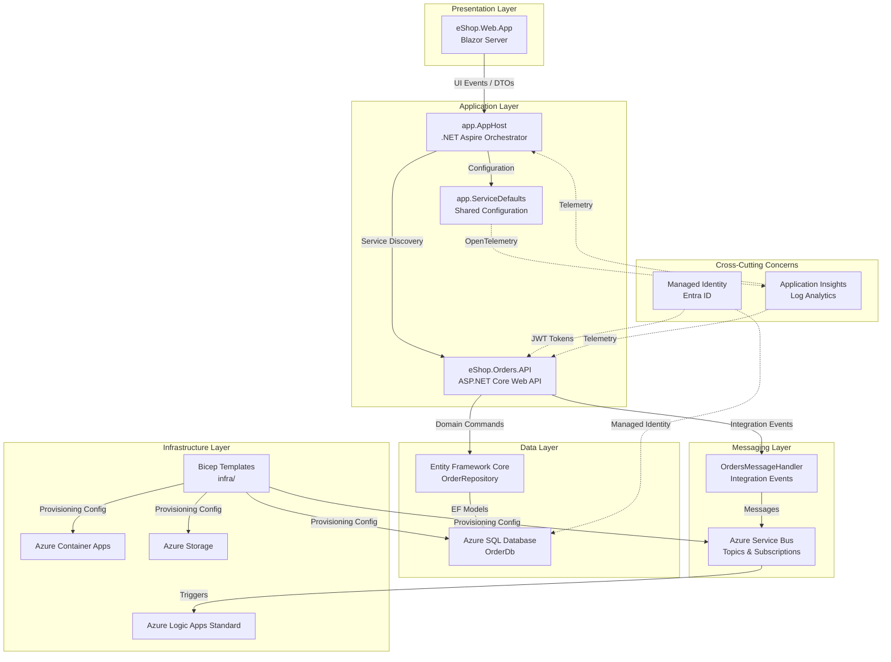
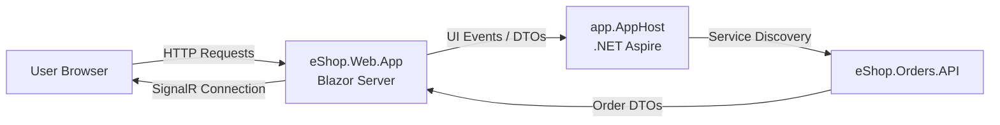
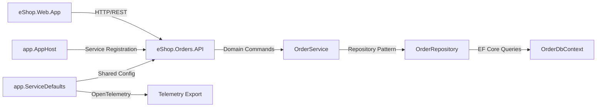
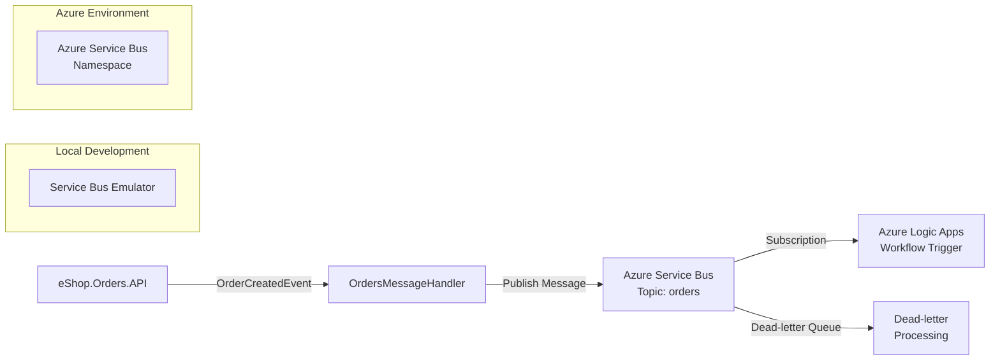
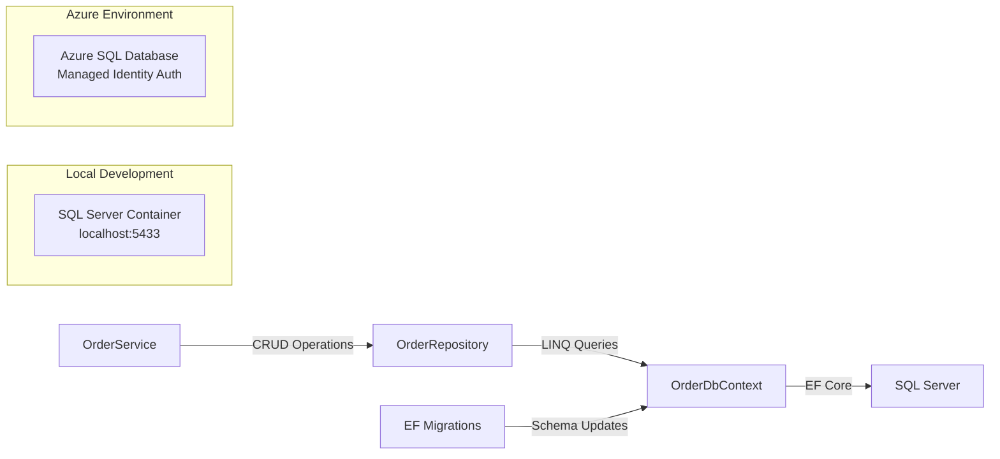
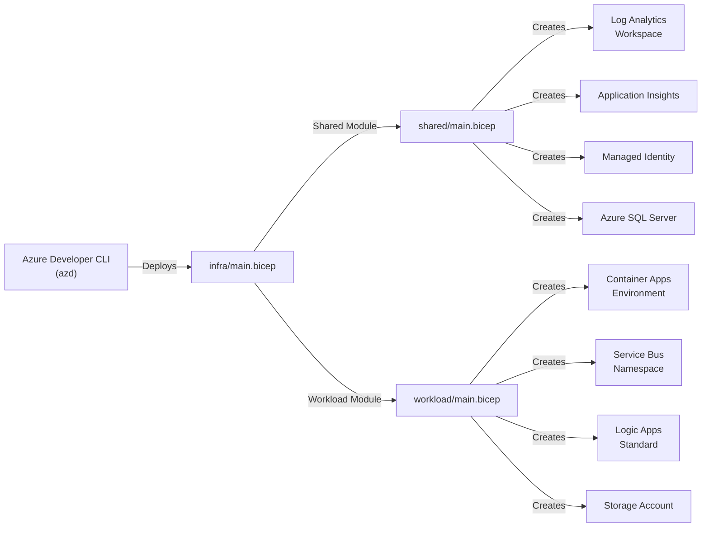
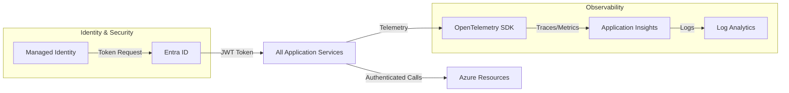

# Azure Logic Apps Monitoring Solution


## Overview

The **Azure Logic Apps Monitoring Solution** is a cloud-native reference application that demonstrates best practices for building observable, scalable, and resilient distributed systems on Azure. This solution showcases enterprise-grade patterns for monitoring Azure Logic Apps Standard workflows using Application Insights, Log Analytics, and distributed tracing with OpenTelemetry. It serves as a practical example for development teams looking to implement comprehensive observability strategies in their Azure-based applications.

Built on **.NET 10** and orchestrated with **.NET Aspire**, the solution implements a complete order management system that processes orders through a Blazor web interface, persists data to Azure SQL Database, and publishes integration events via Azure Service Bus. The architecture follows clean architecture principles with clear separation between presentation, application, messaging, data, and infrastructure layers. Each layer is designed with testability, maintainability, and operational excellence in mind.

The infrastructure is fully automated using **Azure Developer CLI (azd)** with Bicep templates, enabling developers to provision a complete environment in minutes. The solution supports both local development with containerized dependencies (SQL Server, Service Bus emulator) and full Azure deployment, providing flexibility for different development scenarios while maintaining configuration consistency across environments.

---

## Technology Stack

| Technology | Purpose |
|------------|---------|
| [.NET 10](https://learn.microsoft.com/dotnet/) | Application runtime and SDK |
| [.NET Aspire](https://learn.microsoft.com/dotnet/aspire/) | Cloud-native orchestration and service discovery |
| [Blazor Server](https://learn.microsoft.com/aspnet/core/blazor/) | Interactive web UI framework |
| [ASP.NET Core](https://learn.microsoft.com/aspnet/core/) | Web API framework |
| [Entity Framework Core](https://learn.microsoft.com/ef/core/) | Object-relational mapping |
| [Azure Container Apps](https://learn.microsoft.com/azure/container-apps/) | Serverless container hosting |
| [Azure Service Bus](https://learn.microsoft.com/azure/service-bus-messaging/) | Enterprise messaging and integration |
| [Azure SQL Database](https://learn.microsoft.com/azure/azure-sql/) | Relational database service |
| [Application Insights](https://learn.microsoft.com/azure/azure-monitor/app/app-insights-overview) | Application performance monitoring |
| [Log Analytics](https://learn.microsoft.com/azure/azure-monitor/logs/log-analytics-overview) | Centralized logging and analytics |
| [Azure Logic Apps Standard](https://learn.microsoft.com/azure/logic-apps/) | Workflow automation |
| [Bicep](https://learn.microsoft.com/azure/azure-resource-manager/bicep/) | Infrastructure as Code |
| [Azure Developer CLI (azd)](https://learn.microsoft.com/azure/developer/azure-developer-cli/) | Developer workflow automation |

---

## Prerequisites

The `hooks` directory contains comprehensive automation scripts that streamline the development lifecycle for this solution. These scripts integrate seamlessly with Azure Developer CLI (azd) to validate prerequisites, provision infrastructure, configure .NET user secrets, set up SQL Database managed identity access, and generate test data. The scripts support cross-platform execution (Windows, Linux, and macOS) with dual implementations in PowerShell and Bash, ensuring developers can focus on building features rather than managing environment setup.

For detailed installation instructions, configuration options, and troubleshooting guides, refer to the comprehensive documentation in the hooks folder:

| File Name | Description |
|-----------|-------------|
| [README.md](hooks/README.md) | Complete hooks directory overview and developer inner loop workflow |
| [VALIDATION-WORKFLOW.md](hooks/VALIDATION-WORKFLOW.md) | End-to-end deployment workflow with visual diagrams and timelines |
| [check-dev-workstation.md](hooks/check-dev-workstation.md) | Workstation prerequisite validation script documentation |
| [postprovision.md](hooks/postprovision.md) | Post-provisioning configuration and secrets management |
| [clean-secrets.md](hooks/clean-secrets.md) | .NET user secrets clearing utility documentation |
| [Generate-Orders.md](hooks/Generate-Orders.md) | Test data generation script documentation |

---

## Architecture Overview

The solution follows a layered architecture pattern with clear separation of concerns. Each layer has specific responsibilities and communicates with adjacent layers through well-defined interfaces and data contracts.



---

## Presentation Layer

### Description

The Presentation Layer provides the user interface for the order management system through a **Blazor Server** application (`eShop.Web.App`). This layer handles user interactions, renders the UI, and communicates with the Application Layer to execute business operations. The Blazor Server model enables rich, interactive experiences with real-time updates while maintaining server-side rendering capabilities for improved initial load performance.

### Data Flow



### Best Practices Applied

| Practice | Description | Reference |
|----------|-------------|-----------|
| Responsive Design | Ensure UI adapts to different screen sizes using CSS and Blazor components. | [Blazor Documentation](https://learn.microsoft.com/aspnet/core/blazor/) |
| Accessibility | Follow WCAG guidelines for inclusive design with semantic HTML. | [Blazor Fundamentals](https://learn.microsoft.com/aspnet/core/blazor/fundamentals/) |
| Secure Input Validation | Validate user input on both client and server to prevent injection attacks. | [ASP.NET Core Security](https://learn.microsoft.com/aspnet/core/security/) |
| Real-Time Communication | Use SignalR for live UI updates and server-push notifications. | [SignalR Introduction](https://learn.microsoft.com/aspnet/core/signalr/introduction) |
| Component-Based Architecture | Build reusable UI components for maintainability. | [Blazor Components](https://learn.microsoft.com/aspnet/core/blazor/components/) |

---

## Application Layer

### Description

The Application Layer consists of three core projects that orchestrate business logic and service coordination:

- **app.AppHost**: The .NET Aspire orchestrator that manages service lifecycle, dependency injection, and distributed application configuration. It provisions local development resources (SQL Server container, Service Bus emulator) and configures service discovery.

- **app.ServiceDefaults**: A shared library containing common configurations including OpenTelemetry setup, health check endpoints, resilience policies, and service defaults applied across all services.

- **eShop.Orders.API**: An ASP.NET Core Web API that exposes RESTful endpoints for order management operations. It implements the business logic for creating, updating, and querying orders.

### Data Flow



### Best Practices Applied

| Practice | Description | Reference |
|----------|-------------|-----------|
| Dependency Injection | Promotes loose coupling, testability, and service lifetime management. | [Dependency Injection](https://learn.microsoft.com/aspnet/core/fundamentals/dependency-injection) |
| Resilience Patterns | Implement retry, circuit breaker, and timeout policies using Polly. | [Retry Best Practices](https://learn.microsoft.com/azure/architecture/best-practices/retry-service-specific) |
| Observability | Enable distributed tracing and metrics with OpenTelemetry integration. | [Distributed Tracing](https://learn.microsoft.com/dotnet/core/diagnostics/distributed-tracing) |
| Health Checks | Expose liveness and readiness endpoints for container orchestration. | [Health Checks](https://learn.microsoft.com/aspnet/core/host-and-deploy/health-checks) |
| Configuration Management | Use .NET user secrets for local development and Azure Key Vault for production. | [App Secrets](https://learn.microsoft.com/aspnet/core/security/app-secrets) |

---

## Messaging Layer

### Description

The Messaging Layer implements asynchronous communication patterns using **Azure Service Bus** for reliable message delivery between services. The `OrdersMessageHandler` processes integration events, enabling decoupled communication between the Orders API and downstream consumers like Azure Logic Apps workflows. This layer supports both local development with the Service Bus emulator and production deployment with Azure Service Bus.

### Data Flow



### Best Practices Applied

| Practice | Description | Reference |
|----------|-------------|-----------|
| Enable Sessions | Ensure ordered message processing for related messages. | [Service Bus Performance](https://learn.microsoft.com/azure/service-bus-messaging/service-bus-performance-improvements) |
| Dead-letter Queues | Handle message failures gracefully with retry and poison message handling. | [Dead-letter Queues](https://learn.microsoft.com/azure/service-bus-messaging/service-bus-dead-letter-queues) |
| Managed Identity | Secure authentication to Service Bus without connection string secrets. | [Managed Identities](https://learn.microsoft.com/azure/active-directory/managed-identities-azure-resources) |
| Topic/Subscription Pattern | Enable publish-subscribe messaging for multiple consumers. | [Topics and Subscriptions](https://learn.microsoft.com/azure/service-bus-messaging/service-bus-queues-topics-subscriptions) |
| Graceful Degradation | Use NoOpOrdersMessageHandler when Service Bus is unavailable locally. | [Resilience Patterns](https://learn.microsoft.com/azure/architecture/patterns/circuit-breaker) |

---

## Data Layer

### Description

The Data Layer manages data persistence using **Azure SQL Database** with **Entity Framework Core** as the ORM. The `OrderRepository` implements the repository pattern, abstracting data access logic from the business layer. The `OrderDbContext` manages entity configurations, migrations, and database connections. In local development, Aspire automatically provisions a SQL Server container with persistent storage.

### Data Flow



### Best Practices Applied

| Practice | Description | Reference |
|----------|-------------|-----------|
| EF Core Migrations | Manage schema evolution safely with version-controlled migrations. | [EF Core Migrations](https://learn.microsoft.com/ef/core/managing-schemas/migrations) |
| Encryption | Protect data at rest with Azure SQL TDE and in transit with TLS 1.2+. | [Encryption at Rest](https://learn.microsoft.com/azure/security/fundamentals/encryption-atrest) |
| Connection Resilience | Configure automatic retry for transient failures. | [Connection Resiliency](https://learn.microsoft.com/ef/core/miscellaneous/connection-resiliency) |
| Managed Identity Authentication | Use Entra ID authentication instead of SQL credentials in production. | [Azure AD Authentication](https://learn.microsoft.com/azure/azure-sql/database/authentication-aad-overview) |
| Repository Pattern | Abstract data access for testability and maintainability. | [Repository Pattern](https://learn.microsoft.com/dotnet/architecture/microservices/microservice-ddd-cqrs-patterns/infrastructure-persistence-layer-design) |

---

## Infrastructure Layer

### Description

The Infrastructure Layer defines all Azure resources using **Bicep** templates organized in the `infra/` directory. The modular template structure separates shared infrastructure (monitoring, identity, data) from workload-specific resources (Container Apps, Logic Apps, Service Bus). Azure Developer CLI orchestrates deployments through lifecycle hooks that validate prerequisites, provision resources, and configure post-deployment settings.

### Data Flow



### Best Practices Applied

| Practice | Description | Reference |
|----------|-------------|-----------|
| Modular Templates | Improve maintainability and reusability with separate Bicep modules. | [Bicep Best Practices](https://learn.microsoft.com/azure/azure-resource-manager/bicep/best-practices) |
| RBAC | Implement least privilege access using role-based access control. | [RBAC Overview](https://learn.microsoft.com/azure/role-based-access-control/overview) |
| Diagnostic Logging | Enable diagnostic settings for all resources to Log Analytics. | [Azure Monitor](https://learn.microsoft.com/azure/azure-monitor/overview) |
| Naming Conventions | Use consistent resource naming with environment and location suffixes. | [Naming Conventions](https://learn.microsoft.com/azure/cloud-adoption-framework/ready/azure-best-practices/resource-naming) |
| Parameter Validation | Use Bicep decorators for input validation and documentation. | [Bicep Parameters](https://learn.microsoft.com/azure/azure-resource-manager/bicep/parameters) |

---

## Cross-Cutting Concerns

### Description

Cross-cutting concerns span multiple layers and include **Identity** (authentication and authorization), **Monitoring** (observability and diagnostics), and **Shared Data** (common types and validation). The solution uses Azure Managed Identity for secure, secretless authentication to Azure resources. Application Insights and Log Analytics provide comprehensive monitoring with distributed tracing, metrics, and log aggregation.

### Data Flow



### Best Practices Applied

| Practice | Description | Reference |
|----------|-------------|-----------|
| Managed Identity | Eliminate secrets with Azure-managed authentication credentials. | [Managed Identities](https://learn.microsoft.com/azure/active-directory/managed-identities-azure-resources/) |
| Distributed Tracing | Correlate requests across services using OpenTelemetry. | [OpenTelemetry .NET](https://learn.microsoft.com/dotnet/core/diagnostics/observability-with-otel) |
| Health Checks | Expose health endpoints for Kubernetes and Container Apps probes. | [Health Monitoring](https://learn.microsoft.com/aspnet/core/host-and-deploy/health-checks) |
| Centralized Logging | Aggregate logs from all services in Log Analytics workspace. | [Log Analytics](https://learn.microsoft.com/azure/azure-monitor/logs/log-analytics-overview) |
| Application Insights | Monitor application performance, failures, and user behavior. | [Application Insights](https://learn.microsoft.com/azure/azure-monitor/app/app-insights-overview) |

---

## Usage

### Local Development (Recommended for Daily Work)

Start developing locally with containerized dependencies:

```powershell
# Navigate to repository root
cd app

# Install .NET Aspire workload (first time only)
dotnet workload install aspire

# Ensure Docker Desktop is running
docker ps

# Start the application with all dependencies
cd app.AppHost
dotnet run --launch-profile https
```

Access the services:
- **Aspire Dashboard**: `https://localhost:17267`
- **Web Application**: Check Aspire Dashboard for dynamic port
- **Orders API Swagger**: Check Aspire Dashboard for dynamic port

### Azure Deployment

Deploy the complete solution to Azure:

```powershell
# Validate workstation prerequisites (optional but recommended)
.\hooks\check-dev-workstation.ps1

# Provision infrastructure and deploy application
azd up
```

The deployment process:
1. **Pre-provisioning** validates prerequisites and clears stale secrets
2. **Azure provisioning** deploys Bicep templates (5-10 minutes)
3. **Post-provisioning** configures user secrets and SQL managed identity

### Generate Test Data

After deployment, generate sample order data:

```powershell
# Generate 100 test orders
.\hooks\Generate-Orders.ps1 -OrderCount 100 -Verbose
```

---

## Project Structure

```
app/
├── app.sln                      # Solution file
├── azure.yaml                   # Azure Developer CLI configuration
├── app.AppHost/                 # .NET Aspire orchestrator
│   ├── AppHost.cs              # Service registration and configuration
│   └── appsettings.json        # Application settings
├── app.ServiceDefaults/         # Shared service configuration
│   ├── Extensions.cs           # OpenTelemetry and health check setup
│   └── CommonTypes.cs          # Shared type definitions
├── src/
│   ├── eShop.Orders.API/       # Orders Web API
│   └── eShop.Web.App/          # Blazor Server application
├── infra/                       # Bicep infrastructure templates
│   ├── main.bicep              # Entry point orchestrator
│   ├── types.bicep             # Shared type definitions
│   ├── shared/                 # Shared infrastructure modules
│   │   ├── monitoring/         # Log Analytics, App Insights
│   │   ├── identity/           # Managed Identity
│   │   └── data/               # SQL Database
│   └── workload/               # Workload-specific modules
│       ├── container-apps.bicep
│       ├── logic-app.bicep
│       └── messaging.bicep
├── hooks/                       # Azure Developer CLI lifecycle scripts
│   ├── preprovision.ps1/.sh    # Pre-deployment validation
│   ├── postprovision.ps1/.sh   # Post-deployment configuration
│   └── *.md                    # Script documentation
└── workflows/                   # CI/CD workflow definitions
```

---

## Related Documentation

### Microsoft Learn Resources

- [.NET Aspire Overview](https://learn.microsoft.com/dotnet/aspire/get-started/aspire-overview)
- [Azure Logic Apps Documentation](https://learn.microsoft.com/azure/logic-apps/)
- [Application Insights for .NET](https://learn.microsoft.com/azure/azure-monitor/app/asp-net-core)
- [Azure Service Bus Messaging](https://learn.microsoft.com/azure/service-bus-messaging/)
- [Azure Container Apps](https://learn.microsoft.com/azure/container-apps/)
- [Bicep Documentation](https://learn.microsoft.com/azure/azure-resource-manager/bicep/)
- [Azure Developer CLI](https://learn.microsoft.com/azure/developer/azure-developer-cli/)

### Repository Documentation

- [hooks/README.md](hooks/README.md) - Developer workflow documentation
- [hooks/VALIDATION-WORKFLOW.md](hooks/VALIDATION-WORKFLOW.md) - Complete deployment workflow
- [infra/](infra/) - Infrastructure as Code templates

---

## License

This project is licensed under the MIT License. See [LICENSE.md](LICENSE.md) for details.

---

**Made with ❤️ by Evilazaro | Principal Cloud Solution Architect | Microsoft**