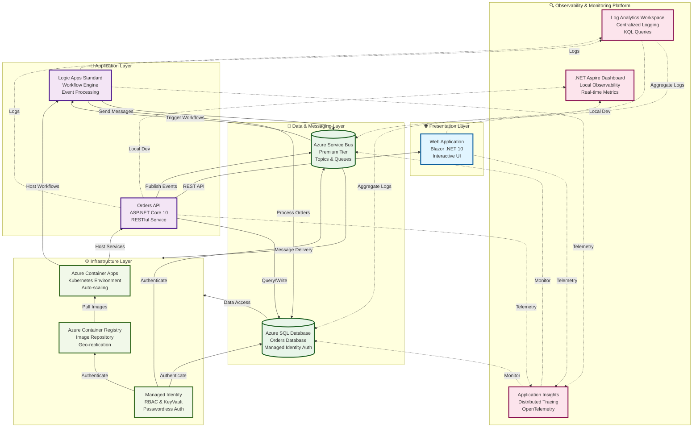
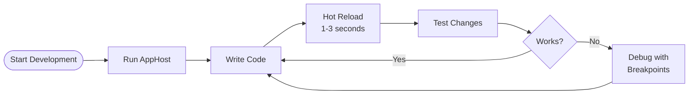

# Azure Logic Apps Monitoring Solution


> **Enterprise-grade observability and monitoring solution for Azure Logic Apps Standard**

A comprehensive, production-ready cloud-native application demonstrating best practices for observability, monitoring, and distributed tracing in Azure Logic Apps Standard workflows. Built with .NET 10, Azure Container Apps, Application Insights, and Service Bus.

---

## 📑 Table of Contents

- [Features](#-features)
- [Architecture](#-architecture)
- [Prerequisites](#-prerequisites)
- [Quick Start](#-quick-start)
- [Development Workflow](#-development-workflow)
- [Observability Best Practices](#-observability-best-practices)
- [Deployment](#-deployment)
- [Configuration](#-configuration)
- [Troubleshooting](#-troubleshooting)
- [Contributing](#-contributing)
- [License](#-license)
- [Support](#-support)

---

## ✨ Features

### Core Capabilities

- **🔍 Comprehensive Observability**: End-to-end distributed tracing with Application Insights
- **📊 Real-Time Monitoring**: Live dashboards with .NET Aspire orchestration
- **🔄 Event-Driven Architecture**: Azure Service Bus for reliable message processing
- **🚀 Cloud-Native Design**: Container-based deployment with Azure Container Apps
- **🔐 Security First**: Managed identities, Azure AD authentication, and secrets management
- **⚡ High Performance**: Logic Apps Standard with elastic scaling (up to 20 workers)
- **🌍 Multi-Region Ready**: Global distribution support with geo-replication

### Developer Experience

- **🏠 Local Development**: Complete containerized environment with Docker and .NET Aspire
- **🔄 Hot Reload**: Instant code changes without restart (.NET 10 built-in)
- **🐛 Advanced Debugging**: Full breakpoint support across distributed services
- **📈 Telemetry Integration**: OpenTelemetry traces, metrics, and logs
- **🤖 Automated Workflows**: Azure Developer CLI (azd) lifecycle hooks
- **✅ Pre-Flight Validation**: Comprehensive environment checks before deployment

---

## 🏗️ Architecture

### High-Level Overview



### Technology Stack

| Component              | Technology                    | Purpose                          |
| ---------------------- | ----------------------------- | -------------------------------- |
| **Orchestration**      | .NET Aspire 9.5+              | Local development & observability|
| **Frontend**           | Blazor (.NET 10)              | Interactive web UI               |
| **Backend API**        | ASP.NET Core 10               | RESTful order management         |
| **Workflows**          | Azure Logic Apps Standard     | Serverless workflow engine       |
| **Messaging**          | Azure Service Bus             | Reliable asynchronous messaging  |
| **Data Storage**       | Azure SQL Database            | Transactional data persistence   |
| **Observability**      | Application Insights          | Distributed tracing & telemetry  |
| **Logging**            | Log Analytics Workspace       | Centralized log aggregation      |
| **Container Platform** | Azure Container Apps          | Managed Kubernetes environment   |
| **Infrastructure**     | Bicep (IaC)                   | Declarative Azure resource mgmt  |
| **Deployment**         | Azure Developer CLI (azd)     | End-to-end deployment automation |

---

## 📋 Prerequisites

### Required Software

| Tool                          | Version    | Purpose                          | Installation                                                                     |
| ----------------------------- | ---------- | -------------------------------- | -------------------------------------------------------------------------------- |
| **.NET SDK**                  | 10.0+      | Application runtime              | [Download](https://dotnet.microsoft.com/download/dotnet/10.0)                   |
| **Azure CLI**                 | 2.60.0+    | Azure resource management        | [Install Guide](https://learn.microsoft.com/cli/azure/install-azure-cli)       |
| **Azure Developer CLI (azd)** | Latest     | Deployment orchestration         | [Install Guide](https://learn.microsoft.com/azure/developer/azure-developer-cli/install-azd) |
| **Docker Desktop**            | Latest     | Container orchestration (local)  | [Download](https://www.docker.com/products/docker-desktop)                      |
| **PowerShell**                | 7.0+       | Automation scripts (Windows)     | [Install Guide](https://learn.microsoft.com/powershell/scripting/install/installing-powershell) |
| **Bash**                      | 4.0+       | Automation scripts (Linux/macOS) | Pre-installed on most Unix systems                                              |
| **.NET Aspire Workload**      | 9.5+       | Local orchestration framework    | `dotnet workload install aspire`                                                |

### Azure Resources Required

- **Azure Subscription** with Owner or Contributor access
- **Resource Providers** (automatically registered by scripts):
  - Microsoft.Logic
  - Microsoft.Web
  - Microsoft.ServiceBus
  - Microsoft.Sql
  - Microsoft.ContainerRegistry
  - Microsoft.App
  - Microsoft.OperationalInsights
  - Microsoft.Insights

---

## 🚀 Quick Start

### Option 1: Local Development (Fastest)

Perfect for daily development work. No Azure resources required.

#### Windows (PowerShell)

```powershell
# Clone repository
git clone https://github.com/Evilazaro/Azure-LogicApps-Monitoring.git
cd Azure-LogicApps-Monitoring

# Install .NET Aspire workload
dotnet workload install aspire

# Ensure Docker Desktop is running
docker ps

# Start application with all dependencies
cd app.AppHost
dotnet run

# Access services:
# - Aspire Dashboard: https://localhost:17267
# - API: Check dashboard for dynamic ports
# - Web App: Check dashboard for dynamic ports
```

#### Linux/macOS (Bash)

```bash
# Clone repository
git clone https://github.com/Evilazaro/Azure-LogicApps-Monitoring.git
cd Azure-LogicApps-Monitoring

# Install .NET Aspire workload
dotnet workload install aspire

# Ensure Docker is running
docker ps

# Start application with all dependencies
cd app.AppHost
dotnet run

# Access services:
# - Aspire Dashboard: https://localhost:17267
# - API: Check dashboard for dynamic ports
# - Web App: Check dashboard for dynamic ports
```

**What Happens Automatically:**
- ✅ SQL Server container provisioned
- ✅ Azure Service Bus emulator started
- ✅ Database schema created
- ✅ All services configured and running
- ✅ Hot reload enabled for instant updates

---

### Option 2: Azure Deployment (Complete Cloud Environment)

Full Azure deployment with Logic Apps, Service Bus, and Application Insights.

#### Windows (PowerShell)

```powershell
# Navigate to repository root
cd Azure-LogicApps-Monitoring

# Validate workstation (optional but recommended)
.\hooks\check-dev-workstation.ps1

# Provision infrastructure (includes automatic configuration)
azd provision

# Generate test data (optional)
.\hooks\Generate-Orders.ps1 -OrderCount 100

# Deploy application
azd deploy
```

#### Linux/macOS (Bash)

```bash
# Navigate to repository root
cd Azure-LogicApps-Monitoring

# Make scripts executable
chmod +x hooks/*.sh

# Validate workstation (optional but recommended)
./hooks/check-dev-workstation.sh

# Provision infrastructure (includes automatic configuration)
azd provision

# Generate test data (optional)
./hooks/Generate-Orders.sh --order-count 100

# Deploy application
azd deploy
```

**Automated Configuration:**
- ✅ Azure resources provisioned via Bicep
- ✅ .NET user secrets configured (26+ secrets)
- ✅ SQL Database managed identity setup
- ✅ Container Registry authentication
- ✅ Application Insights connected

---

## 🔄 Development Workflow

### Developer Inner Loop (Local)



**Features:**
- **Hot Reload**: Code changes apply in 1-3 seconds
- **Breakpoint Debugging**: Full IDE debugging support
- **Live Logs**: Real-time log streaming in Aspire Dashboard
- **Distributed Tracing**: OpenTelemetry spans across services
- **Service Discovery**: Automatic service-to-service communication

### Azure Deployment Workflow


**Timeline:**
- Validation: ~20 seconds
- Provisioning: ~5-10 minutes
- Configuration: ~30 seconds
- Deployment: ~3-5 minutes
- **Total: ~8-16 minutes to production-ready environment**

For detailed workflows, see [hooks/VALIDATION-WORKFLOW.md](hooks/VALIDATION-WORKFLOW.md).

---

## 📊 Observability Best Practices

This solution implements enterprise-grade observability patterns:

### 1. Distributed Tracing

- **OpenTelemetry Integration**: Standardized telemetry collection
- **W3C Trace Context**: Cross-service correlation
- **Application Map**: Visual service dependency mapping
- **End-to-End Transactions**: Track requests across Logic Apps, API, and Service Bus

### 2. Structured Logging

- **Correlation IDs**: Track operations across distributed components
- **Log Levels**: Consistent severity classification (Information, Warning, Error)
- **Context Enrichment**: Include user ID, tenant ID, operation details
- **Centralized Storage**: Log Analytics workspace for queryable logs

### 3. Metrics & Monitoring

- **Custom Metrics**: Business-specific KPIs (order processing time, error rates)
- **System Metrics**: CPU, memory, request rates, response times
- **Proactive Alerting**: Smart detection and custom alert rules
- **Real-Time Dashboards**: .NET Aspire Dashboard (local) + Azure Portal (cloud)

### 4. Health Checks

- **Liveness Probes**: Detect container failures
- **Readiness Probes**: Determine service availability
- **Dependency Checks**: Validate SQL, Service Bus, Application Insights connectivity

### 5. Diagnostic Logging

- **Diagnostic Settings**: Route logs to Log Analytics and Storage
- **Retention Policies**: 30-day default with customizable periods
- **Query Optimization**: KQL (Kusto Query Language) for log analysis

**Best Practice Documentation:** See [Azure Cosmos DB Instructions](vscode-userdata:/c%3A/Users/evalvesd/AppData/Roaming/Code/User/prompts/azurecosmosdb.instructions.md) for related guidance on logging and diagnostics.

---

## 🚢 Deployment

### Infrastructure as Code (Bicep)

The solution uses modular Bicep templates:

```
infra/
├── main.bicep                 # Subscription-scope orchestrator
├── types.bicep                # Shared type definitions
├── shared/
│   ├── main.bicep            # Monitoring infrastructure
│   ├── data/
│   │   └── main.bicep        # Service Bus & SQL
│   └── monitoring/
│       ├── main.bicep        # Observability stack
│       ├── app-insights.bicep
│       └── log-analytics.bicep
└── workload/
    ├── main.bicep            # Workload orchestrator
    ├── identity.bicep        # Managed identity & RBAC
    ├── messaging/            # Service Bus namespace
    ├── services/             # Container Apps & ACR
    └── logic-app.bicep       # Logic Apps Standard
```

### Automated Deployment (azd)

Azure Developer CLI orchestrates the complete lifecycle:

```yaml
# azure.yaml (simplified)
hooks:
  preprovision:
    windows:
      run: ./hooks/preprovision.ps1  # Validate environment
    posix:
      run: ./hooks/preprovision.sh
  
  postprovision:
    windows:
      run: ./hooks/postprovision.ps1  # Configure secrets & SQL
    posix:
      run: ./hooks/postprovision.sh

services:
  app:
    language: dotnet
    project: ./app.AppHost/app.AppHost.csproj
    host: containerapp
```

**Lifecycle Hooks:**
1. **preprovision**: Validate tools, Azure auth, resource providers
2. **provision**: Deploy Bicep templates to Azure
3. **postprovision**: Configure .NET secrets, SQL managed identity, ACR auth
4. **deploy**: Build and push container images, deploy to Azure

For detailed hook documentation, see [hooks/README.md](hooks/README.md).

---

## ⚙️ Configuration

### Environment Variables (Azure)

The postprovision hook automatically configures these from Azure resources:

| Variable                                  | Source          | Purpose                    |
| ----------------------------------------- | --------------- | -------------------------- |
| `AZURE_SUBSCRIPTION_ID`                   | azd environment | Azure subscription GUID    |
| `AZURE_RESOURCE_GROUP`                    | azd environment | Resource group name        |
| `AZURE_LOCATION`                          | azd environment | Azure region               |
| `APPLICATIONINSIGHTS_CONNECTION_STRING`   | Bicep output    | Application Insights key   |
| `MESSAGING_SERVICEBUSHOSTNAME`            | Bicep output    | Service Bus namespace FQDN |
| `ORDERSDATABASE_SQLSERVERFQDN`            | Bicep output    | SQL Server FQDN            |
| `AZURE_CONTAINER_REGISTRY_ENDPOINT`       | Bicep output    | Container registry URL     |

### User Secrets (Local Development)

Configured automatically by postprovision script:

```bash
# List configured secrets
dotnet user-secrets list --project app.AppHost/app.AppHost.csproj

# Example secrets (26+ total):
# - Azure:SubscriptionId
# - ApplicationInsights:ConnectionString
# - ConnectionStrings:ServiceBus
# - ConnectionStrings:OrderDb
# - Azure:ManagedIdentity:ClientId
```

**Manual Secret Management:**

```powershell
# Clear all secrets
.\hooks\clean-secrets.ps1 -Force

# Reconfigure secrets (requires azd environment)
.\hooks\postprovision.ps1 -Force
```

### SQL Database Access

Managed identity configuration (automatic via postprovision):

```sql
-- Configured automatically by sql-managed-identity-config script
CREATE USER [managed-identity-name] FROM EXTERNAL PROVIDER;
ALTER ROLE db_datareader ADD MEMBER [managed-identity-name];
ALTER ROLE db_datawriter ADD MEMBER [managed-identity-name];
```

For manual SQL configuration, see [hooks/postprovision.md](hooks/postprovision.md).

---

## 🛠️ Troubleshooting

### Common Issues

#### Issue: "Docker container fails to start"

**Cause**: Docker Desktop not running or resource constraints

**Solution**:
```powershell
# Ensure Docker is running
docker ps

# Check Docker resources
docker system df

# Clean up unused resources
docker system prune -a --volumes
```

#### Issue: "Hot Reload not working"

**Cause**: .NET 10 hot reload disabled or incompatible project type

**Solution**:
```powershell
# Verify hot reload is enabled
dotnet watch run --project app.AppHost/app.AppHost.csproj

# Check project compatibility
dotnet build --no-incremental
```

#### Issue: "Azure authentication failed"

**Cause**: Azure CLI not authenticated or token expired

**Solution**:
```bash
# Re-authenticate to Azure
az login

# Verify authentication
az account show

# Set subscription
az account set --subscription <subscription-id>
```

#### Issue: "Secret configuration failed"

**Cause**: Missing environment variables or .NET SDK issue

**Solution**:
```powershell
# Verify .NET SDK
dotnet --version  # Should be 10.0+

# Re-run postprovision with verbose logging
.\hooks\postprovision.ps1 -Verbose

# Check project paths
Test-Path .\app.AppHost\app.AppHost.csproj
```

### Verbose Logging

Enable detailed diagnostics for all scripts:

```powershell
# Windows
$VerbosePreference = 'Continue'
.\hooks\check-dev-workstation.ps1 -Verbose
.\hooks\preprovision.ps1 -Verbose
.\hooks\postprovision.ps1 -Verbose
```

```bash
# Linux/macOS
./hooks/check-dev-workstation.sh --verbose
./hooks/preprovision.sh --verbose
./hooks/postprovision.sh --verbose
```

### Getting Help

For additional support:

1. **Review detailed documentation**:
   - [Developer Inner Loop Workflow](hooks/README.md)
   - [Validation Workflow](hooks/VALIDATION-WORKFLOW.md)
   - [Postprovision Guide](hooks/postprovision.md)

2. **Azure Developer CLI**: https://learn.microsoft.com/azure/developer/azure-developer-cli/

3. **Open an issue**: [GitHub Issues](https://github.com/Evilazaro/Azure-LogicApps-Monitoring/issues)

---

## 🤝 Contributing

We welcome contributions! Please follow these guidelines:

### Code of Conduct

This project adheres to the [Microsoft Open Source Code of Conduct](CODE_OF_CONDUCT.md). By participating, you are expected to uphold this code.

### How to Contribute

1. **Fork the repository**
2. **Create a feature branch**: `git checkout -b feature/your-feature-name`
3. **Make your changes** following coding standards
4. **Test your changes**:
   ```bash
   dotnet test
   dotnet build --no-restore
   ```
5. **Commit with descriptive messages**: `git commit -m "feat: add distributed tracing enhancement"`
6. **Push to your fork**: `git push origin feature/your-feature-name`
7. **Open a Pull Request** with detailed description

### Development Setup

```bash
# Clone your fork
git clone https://github.com/YOUR-USERNAME/Azure-LogicApps-Monitoring.git
cd Azure-LogicApps-Monitoring

# Add upstream remote
git remote add upstream https://github.com/Evilazaro/Azure-LogicApps-Monitoring.git

# Install dependencies
dotnet restore app.sln

# Run validation checks
.\hooks\check-dev-workstation.ps1  # Windows
./hooks/check-dev-workstation.sh   # Linux/macOS
```

### Pull Request Guidelines

- Follow existing code style and conventions
- Include tests for new features
- Update documentation for API changes
- Keep pull requests focused (one feature per PR)
- Ensure all CI/CD checks pass

For detailed contribution guidelines, see [CONTRIBUTING.md](CONTRIBUTING.md).

---

## 📄 License

This project is licensed under the **MIT License** - see the [LICENSE](LICENSE.md) file for details.

**Summary:**
- ✅ Commercial use allowed
- ✅ Modification allowed
- ✅ Distribution allowed
- ✅ Private use allowed
- ❌ No warranty provided
- ❌ No liability accepted

---

## 💬 Support

### Getting Help

- **Documentation**: [Project Wiki](https://github.com/Evilazaro/Azure-LogicApps-Monitoring/wiki)
- **Issues**: [Report Bug](https://github.com/Evilazaro/Azure-LogicApps-Monitoring/issues/new?template=bug_report.md)
- **Feature Requests**: [Request Feature](https://github.com/Evilazaro/Azure-LogicApps-Monitoring/issues/new?template=feature_request.md)
- **Discussions**: [GitHub Discussions](https://github.com/Evilazaro/Azure-LogicApps-Monitoring/discussions)

### Microsoft Resources

- [Azure Logic Apps Documentation](https://learn.microsoft.com/azure/logic-apps/)
- [Application Insights Best Practices](https://learn.microsoft.com/azure/azure-monitor/app/app-insights-overview)
- [Azure Developer CLI](https://learn.microsoft.com/azure/developer/azure-developer-cli/)
- [.NET Aspire Documentation](https://learn.microsoft.com/dotnet/aspire/)

### Community

- **Twitter/X**: [@Evilazaro](https://twitter.com/Evilazaro)
- **LinkedIn**: [Evilazaro](https://linkedin.com/in/evilazaro)
- **Blog**: [Medium Articles](https://medium.com/@evilazaro)

---

## 🙏 Acknowledgments

Special thanks to:

- **Microsoft Azure Team** for excellent cloud platform capabilities
- **.NET Team** for .NET 10 and Aspire framework
- **Azure Developer CLI Team** for deployment automation excellence
- **Open Source Community** for inspiration and contributions

---

## 📊 Project Statistics


---

**Made with ❤️ by [Evilazaro](https://github.com/Evilazaro) | Principal Cloud Solution Architect | Microsoft**

**Last Updated**: January 2025  
**Version**: 1.0.0  
**Status**: Production Ready ✅