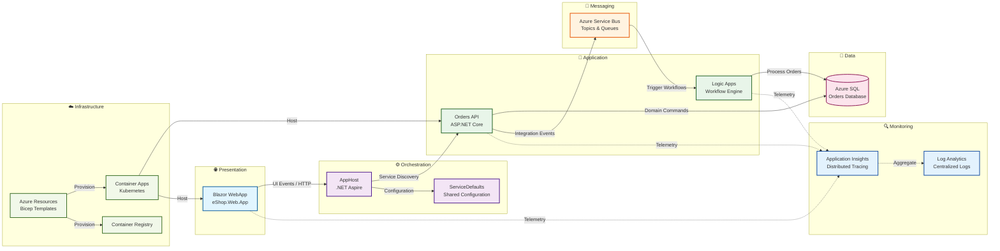

# Azure Logic Apps Monitoring Solution


---

## 📑 Table of Contents

- [Overview](#overview)
- [Technology Stack](#technology-stack)
- [Prerequisites](#prerequisites)
- [Features](#features)
- [Architecture Overview](#architecture-overview)
- [Usage](#usage)
- [License](#license)
- [Related Documentation](#related-documentation)

---

## Overview

The **Azure Logic Apps Monitoring Solution** is an enterprise-grade, cloud-native application sample that demonstrates best practices for observability, monitoring, and distributed tracing in Azure Logic Apps Standard workflows. This solution provides a comprehensive reference architecture for organizations looking to implement production-ready monitoring capabilities for event-driven, serverless applications on Azure.

Built with .NET 10 and orchestrated through .NET Aspire, this solution showcases a modern approach to distributed systems development. It integrates Azure Container Apps for container orchestration, Application Insights for end-to-end distributed tracing, and Azure Service Bus for reliable asynchronous messaging. The architecture emphasizes security through Managed Identities, eliminates credential management overhead, and implements the principle of least privilege across all Azure resources.

The repository serves both as a learning resource and a production-ready template. Developers can run the complete solution locally using .NET Aspire with containerized dependencies (SQL Server and Service Bus emulators), enabling rapid inner-loop development without Azure costs. When ready for deployment, the Azure Developer CLI (azd) automates the entire provisioning and configuration workflow, transforming a developer workstation into a fully operational Azure environment in minutes.

---

## Technology Stack

| Technology | Purpose | Documentation |
|------------|---------|---------------|
| **.NET 10** | Application runtime and development framework | [Microsoft Learn](https://learn.microsoft.com/en-us/dotnet/) |
| **.NET Aspire** | Cloud-native orchestration and local development | [Microsoft Learn](https://learn.microsoft.com/en-us/dotnet/aspire/) |
| **Azure Logic Apps Standard** | Serverless workflow engine for event processing | [Microsoft Learn](https://learn.microsoft.com/en-us/azure/logic-apps/) |
| **Azure Container Apps** | Managed Kubernetes environment for containers | [Microsoft Learn](https://learn.microsoft.com/en-us/azure/container-apps/) |
| **Application Insights** | Distributed tracing and application performance monitoring | [Microsoft Learn](https://learn.microsoft.com/en-us/azure/azure-monitor/app/app-insights-overview) |
| **Azure Service Bus** | Enterprise messaging and event-driven integration | [Microsoft Learn](https://learn.microsoft.com/en-us/azure/service-bus-messaging/) |
| **Azure Developer CLI (azd)** | End-to-end deployment automation and lifecycle management | [Microsoft Learn](https://learn.microsoft.com/en-us/azure/developer/azure-developer-cli/overview) |
| **Bicep** | Declarative Infrastructure as Code for Azure | [Microsoft Learn](https://learn.microsoft.com/en-us/azure/azure-resource-manager/bicep/) |

---

## Prerequisites

The `hooks` folder contains automation scripts that streamline the Azure Logic Apps Monitoring solution's development lifecycle. These scripts integrate seamlessly with Azure Developer CLI (azd) to validate prerequisites, provision infrastructure, configure secrets, set up SQL Database managed identity access, and generate test data. The scripts support cross-platform execution (Windows, Linux, and macOS) with dual implementations in PowerShell and Bash, executing automatically as part of the azd lifecycle hooks during `azd provision` and `azd up` commands.

*For detailed installation instructions, configuration options, and troubleshooting guides, refer to the comprehensive documentation in the hooks folder:*

| File Name | Description |
|-----------|-------------|
| [README.md](hooks/README.md) | Complete hooks directory overview and developer inner loop workflow guide |
| [VALIDATION-WORKFLOW.md](hooks/VALIDATION-WORKFLOW.md) | Complete validation workflow with visual diagrams and deployment timeline |
| [check-dev-workstation.md](hooks/check-dev-workstation.md) | Workstation validation script documentation for prerequisites verification |
| [postprovision.md](hooks/postprovision.md) | Post-provisioning configuration script for secrets and SQL managed identity |
| [clean-secrets.md](hooks/clean-secrets.md) | .NET user secrets management utility documentation |
| [Generate-Orders.md](hooks/Generate-Orders.md) | Test data generation script for sample order creation |

---

## Features

| Layer | Description | Best Practices Applied | WAF Alignment |
|-------|-------------|------------------------|---------------|
| **Presentation Layer** | Blazor Server interactive web application (`eShop.Web.App`) providing real-time order management UI with responsive design | • Responsive design & accessibility (WCAG compliance)<br>• Fluent UI Blazor components for consistent UX<br>• Client-side input validation with server-side verification<br>• [Blazor Best Practices](https://learn.microsoft.com/en-us/aspnet/core/blazor/) | **Reliability**: Graceful degradation<br>**Security**: Input sanitization<br>**Operational Excellence**: User experience consistency |
| **Application Layer** | .NET Aspire AppHost orchestration and ASP.NET Core Orders API (`eShop.Orders.API`) with RESTful endpoints | • Dependency Injection & Repository Pattern<br>• Resilience patterns: retry policies, circuit breakers, timeouts<br>• OpenTelemetry for distributed tracing and metrics<br>• [ASP.NET Core Fundamentals](https://learn.microsoft.com/en-us/aspnet/core/fundamentals/) | **Reliability**: Fault tolerance<br>**Performance Efficiency**: Optimized request handling<br>**Operational Excellence**: Observability |
| **Messaging Layer** | Azure Service Bus integration for reliable asynchronous event-driven communication between services | • Sessions and dead-letter queues for message ordering and error handling<br>• Managed Identity authentication (passwordless)<br>• Batch processing for throughput optimization<br>• [Service Bus Best Practices](https://learn.microsoft.com/en-us/azure/service-bus-messaging/) | **Reliability**: Message durability<br>**Security**: Zero-trust messaging<br>**Performance Efficiency**: Scalable throughput |
| **Infrastructure Layer** | Bicep templates for declarative Azure resource provisioning with modular, reusable components | • Modular Bicep templates with clear separation of concerns<br>• RBAC assignments with Managed Identity<br>• Diagnostic settings for comprehensive logging<br>• [Bicep Best Practices](https://learn.microsoft.com/en-us/azure/azure-resource-manager/bicep/best-practices) | **Cost Optimization**: Right-sized resources<br>**Security**: Least privilege access<br>**Operational Excellence**: Infrastructure as Code |
| **Cross-Cutting Concerns** | Data Layer (EF Core), Identity Layer (Managed Identity), Monitoring Layer (Application Insights, Log Analytics) | • **Data**: EF Core migrations, encryption at rest, parameterized queries<br>• **Identity**: OAuth 2.0, Azure AD integration, managed identities<br>• **Monitoring**: Application Insights, health checks, structured logging<br>• [Azure Security Best Practices](https://learn.microsoft.com/en-us/azure/security/fundamentals/best-practices) | **Security**: Defense in depth<br>**Reliability**: Health monitoring<br>**Operational Excellence**: Centralized observability |

---

## Architecture Overview

The solution follows a layered architecture with clear separation of concerns, enabling independent scaling and maintenance of each component.



### Data Flow Description

| Arrow | Data Type | Description |
|-------|-----------|-------------|
| WebApp → AppHost | UI Events / HTTP | User interactions and form submissions from Blazor components |
| AppHost → OrdersAPI | Service Discovery | Aspire-managed service resolution and request routing |
| OrdersAPI → SQLDatabase | Domain Commands | Entity Framework Core CRUD operations with managed identity |
| OrdersAPI → ServiceBus | Integration Events | Async order events published to topics for downstream processing |
| ServiceBus → LogicApp | Trigger Workflows | Message-triggered Logic Apps Standard workflow execution |
| *→ AppInsights | Telemetry | OpenTelemetry traces, metrics, and structured logs |

---

## Usage

### Option 1: Local Development (Fastest)

Run the complete solution locally with containerized dependencies:

```bash
# Ensure Docker Desktop is running
docker ps

# Install .NET Aspire workload (first time only)
dotnet workload install aspire

# Start the application
cd app.AppHost
dotnet run
```

Access the services:
- **Aspire Dashboard**: `https://localhost:17267`
- **Orders API & Web App**: Check dashboard for dynamic ports

### Option 2: Azure Deployment

Deploy to Azure using Azure Developer CLI:

```bash
# Validate workstation prerequisites
./hooks/check-dev-workstation.sh  # or .ps1 on Windows

# Provision infrastructure and deploy
azd up

# Generate test data (optional)
./hooks/Generate-Orders.sh --order-count 100
```

For detailed workflows and troubleshooting, see README.md.

---

## License

This project is licensed under the **MIT License** - see the LICENSE.md file for details.

---

## Related Documentation

### Project Documentation
- Developer Inner Loop Workflow
- Validation Workflow
- Infrastructure Documentation

### Azure Documentation
- [Azure Logic Apps](https://learn.microsoft.com/azure/logic-apps/)
- [Application Insights](https://learn.microsoft.com/azure/azure-monitor/app/app-insights-overview)
- [Azure Developer CLI](https://learn.microsoft.com/azure/developer/azure-developer-cli/)
- [.NET Aspire](https://learn.microsoft.com/dotnet/aspire/)
- [Azure Container Apps](https://learn.microsoft.com/azure/container-apps/)
- [Azure Service Bus](https://learn.microsoft.com/azure/service-bus-messaging/)

---

**Made with ❤️ by [Evilazaro](https://github.com/Evilazaro) | Principal Cloud Solution Architect | Microsoft**
