# Azure Logic Apps Monitoring Solution

[](https://dotnet.microsoft.com/)
[](https://azure.microsoft.com/services/logic-apps/)
[](https://learn.microsoft.com/dotnet/aspire/)
[](LICENSE.md)
[]()

## Overview

The **Azure Logic Apps Monitoring Solution** is a cloud-native reference application demonstrating enterprise-grade observability, monitoring, and distributed tracing patterns for Azure Logic Apps Standard workflows. Built on .NET 10 and orchestrated with .NET Aspire, this solution showcases how to implement comprehensive telemetry collection, real-time monitoring dashboards, and end-to-end distributed tracing across a modern microservices architecture deployed on Azure Container Apps.

This solution addresses the critical need for visibility into complex, event-driven workflows by integrating Application Insights for telemetry, Azure Service Bus for reliable messaging with Topics and Subscriptions, and Azure SQL Database for persistent storage. The architecture follows a clean layered design that separates concerns while enabling seamless communication between components through well-defined contracts and message-based integration patterns.

Designed for both learning and production scenarios, the solution includes complete Infrastructure as Code (IaC) using Bicep templates, automated deployment scripts for Azure Developer CLI (azd), and comprehensive documentation covering local development workflows, CI/CD integration, and operational best practices. Whether you're building new Logic Apps solutions or modernizing existing workflows, this reference implementation provides proven patterns for achieving operational excellence in Azure.

---

## Technology Stack

| Category | Technology |
|----------|------------|
| **Runtime** | [.NET 10](https://dotnet.microsoft.com/download/dotnet/10.0) |
| **Orchestration** | [.NET Aspire 9.5+](https://learn.microsoft.com/dotnet/aspire/get-started/aspire-overview) |
| **Web Framework** | [Blazor Server](https://learn.microsoft.com/aspnet/core/blazor/) with [Fluent UI](https://www.fluentui-blazor.net/) |
| **Workflow Engine** | [Azure Logic Apps Standard](https://learn.microsoft.com/azure/logic-apps/logic-apps-overview) |
| **Messaging** | [Azure Service Bus](https://learn.microsoft.com/azure/service-bus-messaging/service-bus-messaging-overview) (Topics &amp; Subscriptions) |
| **Database** | [Azure SQL Database](https://learn.microsoft.com/azure/azure-sql/database/sql-database-paas-overview) with [Entity Framework Core](https://learn.microsoft.com/ef/core/) |
| **Container Platform** | [Azure Container Apps](https://learn.microsoft.com/azure/container-apps/overview) |
| **Container Registry** | [Azure Container Registry](https://learn.microsoft.com/azure/container-registry/container-registry-intro) |
| **Monitoring** | [Application Insights](https://learn.microsoft.com/azure/azure-monitor/app/app-insights-overview) |
| **Logging** | [Azure Log Analytics](https://learn.microsoft.com/azure/azure-monitor/logs/log-analytics-overview) |
| **Identity** | [Microsoft Entra ID](https://learn.microsoft.com/entra/identity/) (Managed Identity) |
| **Infrastructure** | [Bicep](https://learn.microsoft.com/azure/azure-resource-manager/bicep/overview) |
| **CLI Tools** | [Azure Developer CLI (azd)](https://learn.microsoft.com/azure/developer/azure-developer-cli/) |

---

## Prerequisites

The `hooks` directory contains comprehensive automation scripts that streamline the solution's development lifecycle. These scripts integrate seamlessly with Azure Developer CLI (azd) to validate prerequisites, provision infrastructure, configure secrets, set up SQL Database managed identity access, and generate test data. Supporting both Windows (PowerShell) and Linux/macOS (Bash), the scripts ensure developers can focus on building features rather than managing environment setup, while maintaining configuration consistency across development, testing, and production environments.

For detailed installation instructions, configuration options, and troubleshooting guides, refer to the comprehensive documentation in the hooks folder:

| File Name | Description |
|-----------|-------------|
| [README.md](hooks/README.md) | Developer inner loop workflow overview, quick start guide, development modes (local vs Azure), and CI/CD integration |
| [VALIDATION-WORKFLOW.md](hooks/VALIDATION-WORKFLOW.md) | Complete deployment workflow with visual Mermaid diagrams, script dependencies, and timeline |
| [check-dev-workstation.md](hooks/check-dev-workstation.md) | Workstation prerequisite validation documentation covering PowerShell, .NET SDK, Azure CLI, Bicep, and resource providers |
| [postprovision.md](hooks/postprovision.md) | Post-provisioning configuration for .NET user secrets, SQL managed identity setup, and Azure resource integration |
| [clean-secrets.md](hooks/clean-secrets.md) | .NET user secrets clearing utility for resetting local development configuration |
| [Generate-Orders.md](hooks/Generate-Orders.md) | Test data generation script for creating realistic e-commerce orders (1-10,000 orders) |

---

## Architecture Overview

The Azure Logic Apps Monitoring Solution follows a clean layered architecture that promotes separation of concerns, testability, and maintainability. Each layer has a specific responsibility and communicates with adjacent layers through well-defined interfaces and message contracts. The **Presentation Layer** (`eShop.Web.App`) handles user interactions through a Blazor Server application with Fluent UI components, passing commands to the **Application Layer** (`app.AppHost`) which orchestrates service discovery, health checks, and cross-cutting concerns using .NET Aspire. The **Workflow Layer** (`OrdersManagementLogicApp`) executes business processes through Azure Logic Apps Standard stateful workflows that trigger integration events flowing through the **Messaging Layer** (Azure Service Bus) for reliable, asynchronous communication.

This architecture supports observability through centralized telemetry collection at every layer. Application Insights captures distributed traces that span from user clicks in the Blazor UI through API calls, Service Bus message processing, and database operations. The `app.ServiceDefaults` shared library configures OpenTelemetry exporters for traces, metrics, and logs across all services, enabling operators to trace individual requests across the entire system. The **Cross-Cutting Concerns** (Identity and Monitoring) apply horizontally across all layers, ensuring consistent authentication via Microsoft Entra ID managed identities and comprehensive logging through structured log scopes with trace correlation.

The solution's resilience and scalability stem from its cloud-native design patterns. Azure Container Apps provides elastic scaling for the API and web services with consumption-based workload profiles, while Azure Service Bus Topics and Subscriptions enable fan-out messaging patterns with dead-letter queues and configurable message TTL. The **Data Layer** (`eShop.Orders.API`) implements the repository pattern with Entity Framework Core, featuring connection resiliency with automatic retry policies. The **Infrastructure Layer** (Bicep templates) codifies all Azure resources in modular templates with diagnostic settings, enabling repeatable deployments across environments through `azd up`.

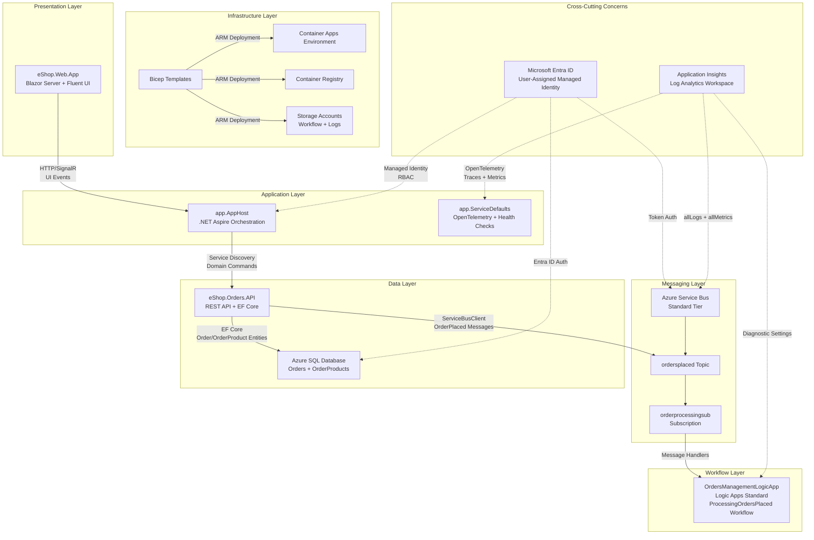

---

## Layer Details

### Presentation Layer

The Presentation Layer provides the user interface for the monitoring solution through a Blazor Server application (`eShop.Web.App`). Built with Microsoft Fluent UI components, this layer handles user interactions for viewing, creating, and managing orders. The application uses SignalR for real-time updates with optimized circuit options including 10-minute disconnected circuit retention and 5-minute client timeout intervals. The `OrdersAPIService` class implements typed HTTP client patterns with service discovery and standard resilience handlers (retry, timeout, circuit breaker) via Polly.

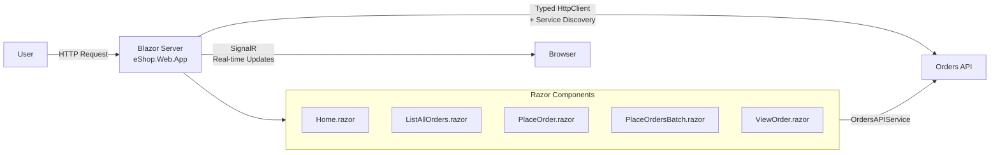

#### Monitoring Data Flow - Presentation Layer

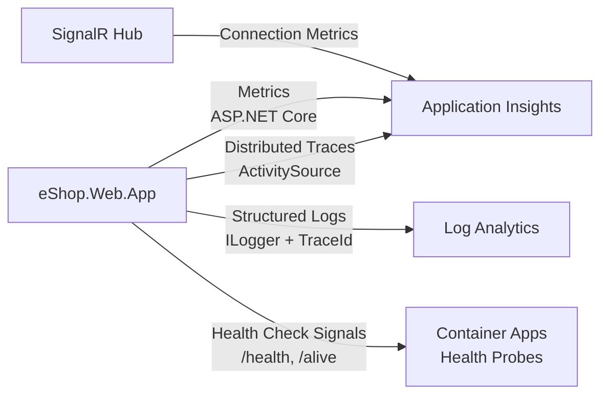

#### Best Practices Applied - Presentation Layer

| Practice | Description | Reference |
|----------|-------------|-----------|
| Blazor Server Rendering | Server-side rendering with SignalR for real-time UI updates | [Blazor hosting models](https://learn.microsoft.com/aspnet/core/blazor/hosting-models) |
| Typed HTTP Clients | `OrdersAPIService` with dependency injection and service discovery | [Typed clients](https://learn.microsoft.com/dotnet/core/extensions/httpclient-factory#typed-clients) |
| Resilience Handlers | Standard resilience with retry, timeout, circuit breaker via Polly | [HTTP resilience](https://learn.microsoft.com/dotnet/core/resilience/http-resilience) |
| Distributed Tracing | `ActivitySource` integration for end-to-end trace correlation | [Distributed tracing](https://learn.microsoft.com/dotnet/core/diagnostics/distributed-tracing) |
| Fluent UI Components | Microsoft Fluent UI Blazor component library for consistent UX | [Fluent UI Blazor](https://www.fluentui-blazor.net/) |

---

### Application Layer

The Application Layer serves as the orchestration hub for the entire solution, implemented through .NET Aspire's distributed application pattern (`app.AppHost`). This layer manages service discovery, health monitoring, configuration distribution, and dependency orchestration for both local development (using SQL Server and Service Bus emulator containers) and cloud deployment (using Azure resources). The `app.ServiceDefaults` shared library provides common configurations including OpenTelemetry setup with Azure Monitor exporters, health check endpoints (`/health` and `/alive`), and HTTP client defaults with resilience policies (600s total timeout, 60s attempt timeout, 3 retries with exponential backoff).

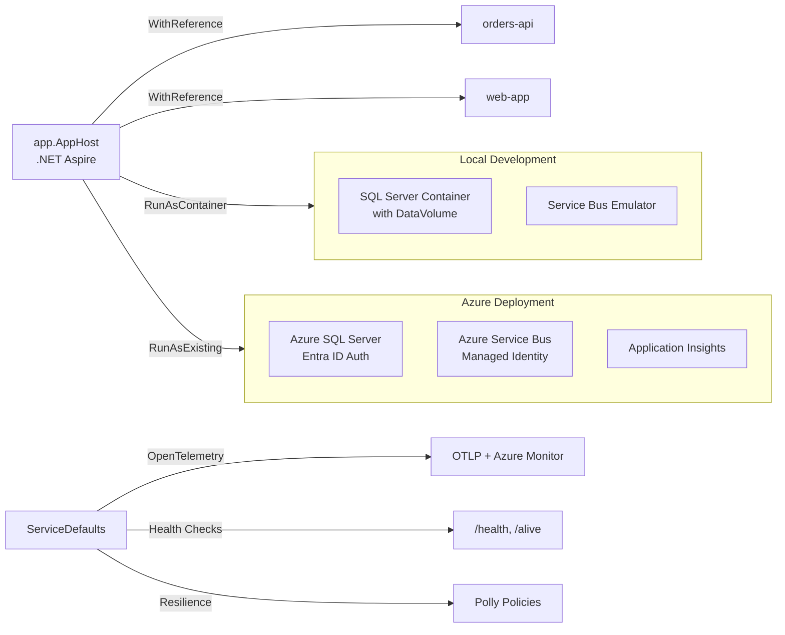

#### Monitoring Data Flow - Application Layer

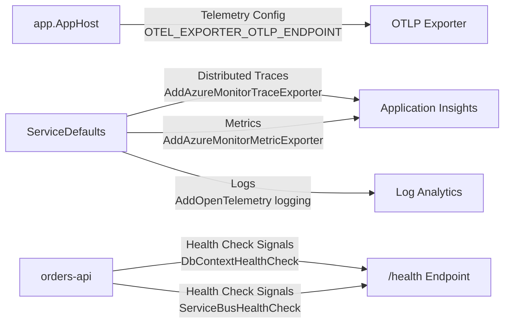

#### Best Practices Applied - Application Layer

| Practice | Description | Reference |
|----------|-------------|-----------|
| .NET Aspire Orchestration | `DistributedApplication.CreateBuilder` for service orchestration | [.NET Aspire overview](https://learn.microsoft.com/dotnet/aspire/get-started/aspire-overview) |
| Service Discovery | Automatic endpoint resolution with `AddServiceDiscovery()` | [Service discovery](https://learn.microsoft.com/dotnet/aspire/service-discovery/overview) |
| OpenTelemetry Integration | Traces, metrics, logs with Azure Monitor and OTLP exporters | [OpenTelemetry in .NET](https://learn.microsoft.com/dotnet/core/diagnostics/observability-with-otel) |
| Health Checks | Standardized liveness (`/alive`) and readiness (`/health`) probes | [Health checks](https://learn.microsoft.com/aspnet/core/host-and-deploy/health-checks) |
| Connection Resiliency | HTTP client resilience with Polly (retry, circuit breaker, timeout) | [Resilience patterns](https://learn.microsoft.com/dotnet/core/resilience/http-resilience) |

---

### Workflow Layer

The Workflow Layer implements business process automation through Azure Logic Apps Standard workflows located in the `workflows/OrdersManagement/OrdersManagementLogicApp` directory. The `ProcessingOrdersPlaced` workflow is a stateful workflow that processes order events from the Service Bus subscription. Logic Apps Standard provides a serverless execution model with the `Microsoft.Azure.Functions.ExtensionBundle.Workflows` extension bundle, enabling visual workflow design while maintaining version-controlled JSON workflow definitions. The workflows are deployed to an App Service Plan with `WorkflowStandard/WS1` SKU featuring elastic scaling up to 20 workers.

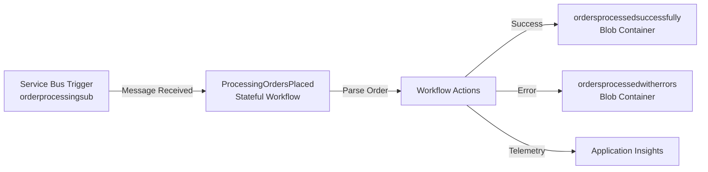

#### Monitoring Data Flow - Workflow Layer

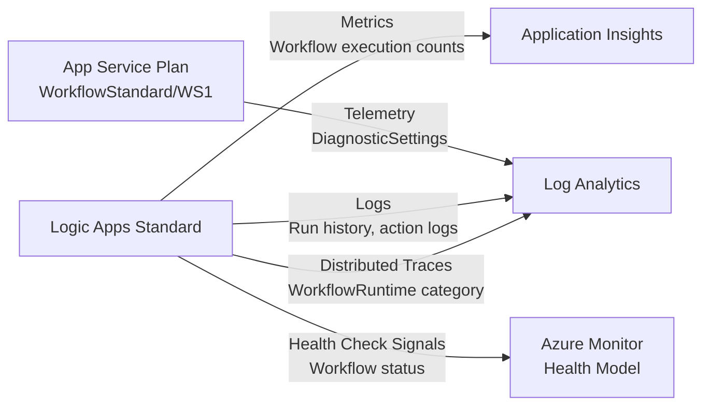

#### Best Practices Applied - Workflow Layer

| Practice | Description | Reference |
|----------|-------------|-----------|
| Logic Apps Standard | Single-tenant deployment with WorkflowStandard SKU for isolation | [Logic Apps Standard](https://learn.microsoft.com/azure/logic-apps/single-tenant-overview-compare) |
| Stateful Workflows | Durable execution with state persistence in Azure Storage | [Stateful vs stateless](https://learn.microsoft.com/azure/logic-apps/single-tenant-overview-compare#stateful-and-stateless-workflows) |
| Extension Bundles | `Microsoft.Azure.Functions.ExtensionBundle.Workflows` for connectors | [Extension bundles](https://learn.microsoft.com/azure/logic-apps/logic-apps-limits-and-config) |
| Elastic Scaling | Auto-scale with `maximumElasticWorkerCount: 20` on App Service Plan | [Logic Apps scaling](https://learn.microsoft.com/azure/logic-apps/logic-apps-pricing) |
| Diagnostic Logging | `WorkflowRuntime` logs to Log Analytics workspace | [Monitor Logic Apps](https://learn.microsoft.com/azure/logic-apps/monitor-logic-apps) |

---

### Messaging Layer

The Messaging Layer provides reliable, asynchronous communication using Azure Service Bus with Standard tier. The architecture uses the `ordersplaced` **Topic** for publish-subscribe messaging, with the `orderprocessingsub` **Subscription** configured with 10 max delivery attempts, 5-minute lock duration, 14-day message TTL, and automatic dead-lettering on expiration. The `OrdersMessageHandler` class in `eShop.Orders.API` publishes order messages with distributed tracing context (`traceparent`, `tracestate`) embedded in message application properties for end-to-end correlation.

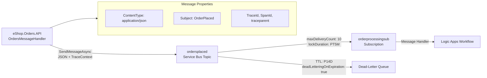

#### Monitoring Data Flow - Messaging Layer

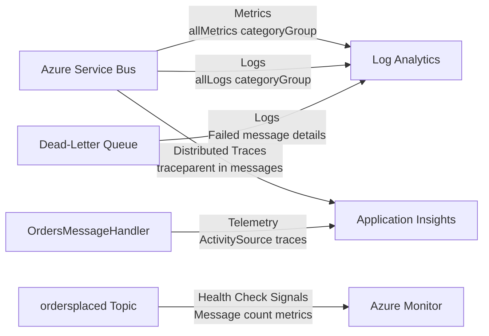

#### Azure Service Bus Resources

| Resource | Name | Configuration |
|----------|------|---------------|
| **Namespace** | `{name}sb{uniqueSuffix}` | Standard SKU, User-Assigned Managed Identity |
| **Topic** | `ordersplaced` | Publish-subscribe endpoint for order events |
| **Subscription** | `orderprocessingsub` | maxDeliveryCount: 10, lockDuration: PT5M, TTL: P14D |
| **Dead-Letter Queue** | Auto-created | Captures failed/expired messages for analysis |

#### Best Practices Applied - Messaging Layer

| Practice | Description | Reference |
|----------|-------------|-----------|
| Topics and Subscriptions | Pub-sub pattern decoupling producers from consumers | [Service Bus topics](https://learn.microsoft.com/azure/service-bus-messaging/service-bus-queues-topics-subscriptions) |
| Dead-Letter Queues | `deadLetteringOnMessageExpiration: true` for failed message capture | [Dead-letter queues](https://learn.microsoft.com/azure/service-bus-messaging/service-bus-dead-letter-queues) |
| Managed Identity Auth | `DefaultAzureCredential` with Service Bus RBAC | [Service Bus authentication](https://learn.microsoft.com/azure/service-bus-messaging/service-bus-authentication-and-authorization) |
| Distributed Tracing | `traceparent` and `tracestate` in message properties | [Distributed tracing](https://learn.microsoft.com/azure/service-bus-messaging/service-bus-end-to-end-tracing) |
| Retry Configuration | `ServiceBusRetryOptions` with exponential backoff | [Retry options](https://learn.microsoft.com/dotnet/api/azure.messaging.servicebus.servicebusretryoptions) |

---

### Data Layer

The Data Layer manages persistent storage through Azure SQL Database and Entity Framework Core in the `eShop.Orders.API` project. The `OrderDbContext` defines two entities: `OrderEntity` (Id, CustomerId, Date, DeliveryAddress, Total) and `OrderProductEntity` (Id, OrderId, ProductId, ProductDescription, Quantity, Price) with a one-to-many relationship using cascade delete. The `OrderRepository` implements the repository pattern, and `OrderService` coordinates business logic with message publishing via `IOrdersMessageHandler`. SQL Server connection resiliency is configured with 5 max retries, 30-second max delay, and 120-second command timeout.

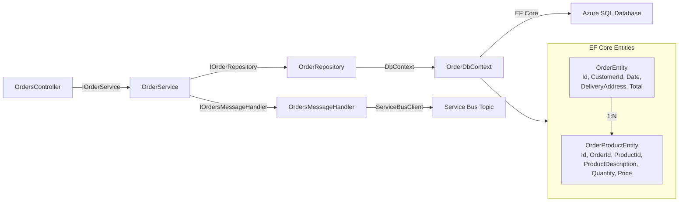

#### Monitoring Data Flow - Data Layer

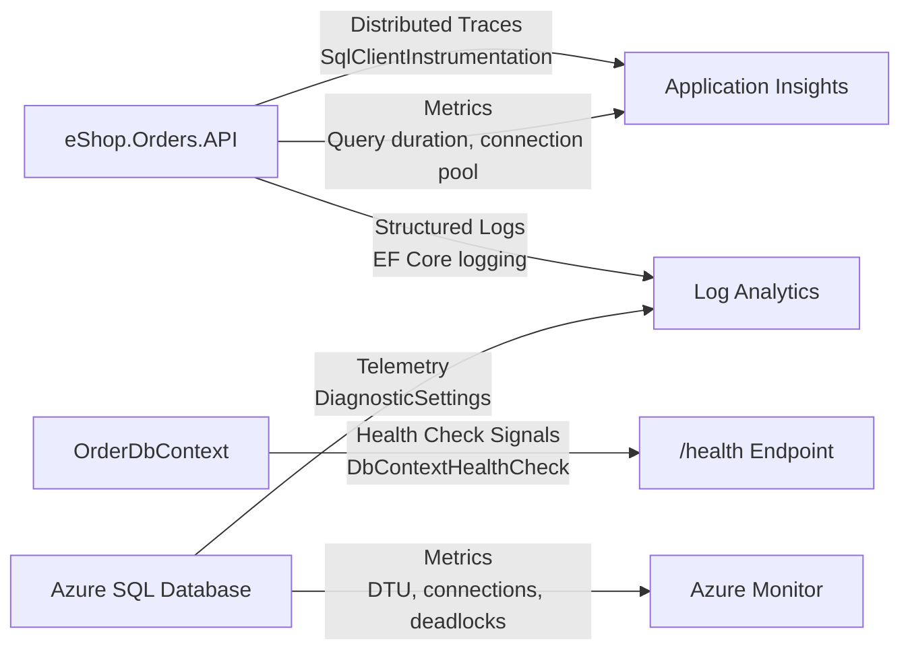

#### Best Practices Applied - Data Layer

| Practice | Description | Reference |
|----------|-------------|-----------|
| Entity Framework Core | ORM with Fluent API configuration for type-safe database operations | [EF Core overview](https://learn.microsoft.com/ef/core/) |
| Repository Pattern | `IOrderRepository` abstraction for testable data access | [Repository pattern](https://learn.microsoft.com/dotnet/architecture/microservices/microservice-ddd-cqrs-patterns/infrastructure-persistence-layer-implementation-entity-framework-core) |
| Entra ID Authentication | `azureADOnlyAuthentication: true` with managed identity | [Azure SQL with Managed Identity](https://learn.microsoft.com/azure/azure-sql/database/authentication-azure-ad-user-assigned-managed-identity) |
| Connection Resiliency | `EnableRetryOnFailure(maxRetryCount: 5, maxRetryDelay: 30s)` | [Connection resiliency](https://learn.microsoft.com/ef/core/miscellaneous/connection-resiliency) |
| SQL Client Instrumentation | `AddSqlClientInstrumentation` for distributed tracing | [SQL instrumentation](https://learn.microsoft.com/dotnet/core/diagnostics/observability-with-otel) |

---

### Deployment Layer (Infrastructure Layer)

The **Deployment Layer** provisions all Azure components required for the Azure Logic Apps Monitoring Solution. Implemented as modular Bicep Infrastructure as Code (IaC) templates under the `infra/` directory, this layer defines the complete Azure infrastructure from identity management through monitoring, data storage, messaging, container services, and workflow execution. The main orchestrator (`infra/main.bicep`) deploys at subscription scope, creating a resource group (`rg-{solution}-{env}-{location}`) and coordinating two primary module deployments: `shared/main.bicep` for foundational infrastructure (identity, monitoring, data) and `workload/main.bicep` for application-specific resources (messaging, container services, logic apps). All resources include comprehensive diagnostic settings with `allLogs` and `allMetrics` category groups sent to Log Analytics and Storage Account, enabling full observability across the entire deployment.

#### Infrastructure Dependencies and Interactions

The following diagram illustrates all Azure resources deployed by the Infrastructure Layer and their dependencies and interactions:

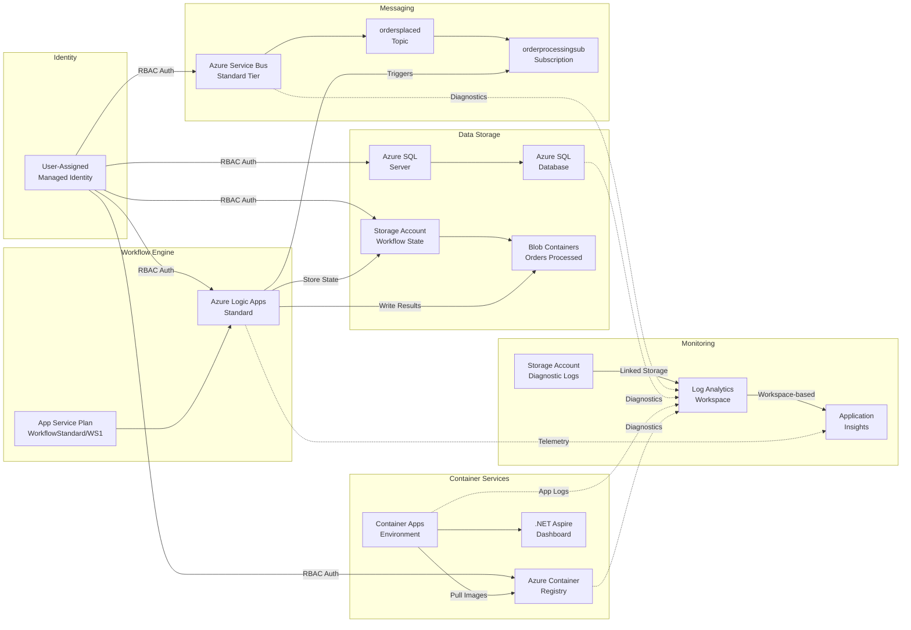

#### Azure Resources Deployed

##### Azure Logic Apps Standard

| Attribute | Details |
|-----------|---------|
| **Bicep Module** | `workload/logic-app.bicep` |
| **Role in Architecture** | Executes stateful business workflows for order processing. The `ProcessingOrdersPlaced` workflow is triggered by Service Bus messages, processes orders, and stores results in blob storage. |
| **Critical Configurations** | **SKU**: WorkflowStandard/WS1, **Elastic Scaling**: Up to 20 workers, **Extension Bundle**: `Microsoft.Azure.Functions.ExtensionBundle.Workflows [1.*, 2.0.0)`, **Runtime**: Functions v4 with dotnet worker |
| **Documentation** | [Azure Logic Apps Standard](https://learn.microsoft.com/azure/logic-apps/single-tenant-overview-compare) |

##### Azure Service Bus (Topics and Subscriptions)

| Attribute | Details |
|-----------|---------|
| **Bicep Module** | `workload/messaging/main.bicep` |
| **Role in Architecture** | Provides reliable, asynchronous message brokering for order events. The `ordersplaced` Topic enables pub-sub messaging with the `orderprocessingsub` Subscription delivering messages to Logic Apps workflows. |
| **Critical Configurations** | **SKU**: Standard tier, **Topic**: `ordersplaced`, **Subscription**: `orderprocessingsub` with `maxDeliveryCount: 10`, `lockDuration: PT5M`, `defaultMessageTimeToLive: P14D`, `deadLetteringOnMessageExpiration: true` |
| **Documentation** | [Azure Service Bus Topics and Subscriptions](https://learn.microsoft.com/azure/service-bus-messaging/service-bus-queues-topics-subscriptions) |

##### Azure SQL Database

| Attribute | Details |
|-----------|---------|
| **Bicep Module** | `shared/data/main.bicep` |
| **Role in Architecture** | Provides persistent relational storage for order data. Stores `OrderEntity` and `OrderProductEntity` tables with Entra ID-only authentication for enhanced security. |
| **Critical Configurations** | **SKU**: GeneralPurpose GP_Gen5_2 (2 vCores, 32GB), **Authentication**: `azureADOnlyAuthentication: true`, **TLS**: Minimum 1.2, **Firewall**: AllowAllWindowsAzureIps enabled |
| **Documentation** | [Azure SQL Database](https://learn.microsoft.com/azure/azure-sql/database/sql-database-paas-overview) |

##### Azure Storage Accounts

| Attribute | Details |
|-----------|---------|
| **Bicep Modules** | `shared/data/main.bicep` (Workflow Storage), `shared/monitoring/log-analytics-workspace.bicep` (Logs Storage) |
| **Role in Architecture** | **Workflow Storage**: Provides Azure Files share (`workflowstate`) for Logic App state and Blob containers (`ordersprocessedsuccessfully`, `ordersprocessedwitherrors`) for processed orders. **Logs Storage**: Stores diagnostic logs with 30-day lifecycle management. |
| **Critical Configurations** | **SKU**: Standard_LRS, **Access Tier**: Hot, **TLS**: Minimum 1.2, **Network**: Azure Services bypass enabled |
| **Documentation** | [Azure Storage](https://learn.microsoft.com/azure/storage/common/storage-introduction) |

##### Azure Container Apps

| Attribute | Details |
|-----------|---------|
| **Bicep Module** | `workload/services/main.bicep` |
| **Role in Architecture** | Hosts the containerized microservices (`eShop.Orders.API`, `eShop.Web.App`) in a managed serverless environment with automatic scaling and integrated observability. |
| **Critical Configurations** | **Workload Profile**: Consumption (serverless, scale-to-zero), **Logging**: Log Analytics integration with shared key, **Telemetry**: Application Insights connection string configured, **Component**: .NET Aspire Dashboard (`AspireDashboard`) |
| **Documentation** | [Azure Container Apps](https://learn.microsoft.com/azure/container-apps/overview) |

##### Azure Container Registry

| Attribute | Details |
|-----------|---------|
| **Bicep Module** | `workload/services/main.bicep` |
| **Role in Architecture** | Stores and manages container images for the solution's microservices. Provides secure, private registry with managed identity authentication for Container Apps image pulls. |
| **Critical Configurations** | **SKU**: Premium (geo-replication, enhanced throughput, private link support), **Identity**: User-Assigned Managed Identity |
| **Documentation** | [Azure Container Registry](https://learn.microsoft.com/azure/container-registry/container-registry-intro) |

##### Application Insights

| Attribute | Details |
|-----------|---------|
| **Bicep Module** | `shared/monitoring/app-insights.bicep` |
| **Role in Architecture** | Collects application telemetry including distributed traces, custom metrics, and performance data. Workspace-based configuration ensures all data flows to the central Log Analytics workspace. |
| **Critical Configurations** | **Type**: Workspace-based (linked to Log Analytics), **Application Type**: Web, **Network Access**: Public ingestion and query enabled |
| **Documentation** | [Application Insights](https://learn.microsoft.com/azure/azure-monitor/app/app-insights-overview) |

##### Log Analytics Workspace

| Attribute | Details |
|-----------|---------|
| **Bicep Module** | `shared/monitoring/log-analytics-workspace.bicep` |
| **Role in Architecture** | Serves as the central log aggregation and query engine for all Azure resources. Receives diagnostic logs and metrics from every deployed resource, enabling unified observability. |
| **Critical Configurations** | **Pricing Tier**: PerGB2018 (pay-as-you-go), **Retention**: 30 days with immediate purge enabled, **Linked Storage**: Alerts and Query storage accounts |
| **Documentation** | [Log Analytics Workspace](https://learn.microsoft.com/azure/azure-monitor/logs/log-analytics-workspace-overview) |

##### User-Assigned Managed Identity

| Attribute | Details |
|-----------|---------|
| **Bicep Module** | `shared/identity/main.bicep` |
| **Role in Architecture** | Provides a single, shared identity for passwordless authentication across all Azure resources. Eliminates the need for connection strings and secrets by using Azure RBAC role assignments. |
| **Critical Configurations** | **Role Assignments**: Storage Blob Data Contributor, Service Bus Data Owner/Receiver/Sender, ACR Pull/Push, SQL db_datareader/db_datawriter, Monitoring Metrics Publisher |
| **Documentation** | [User-Assigned Managed Identity](https://learn.microsoft.com/entra/identity/managed-identities-azure-resources/overview) |

##### App Service Plan (Workflow Hosting)

| Attribute | Details |
|-----------|---------|
| **Bicep Module** | `workload/logic-app.bicep` |
| **Role in Architecture** | Provides the compute infrastructure for Azure Logic Apps Standard. Elastic scaling enables automatic worker adjustment based on workflow demand. |
| **Critical Configurations** | **SKU**: WS1 (WorkflowStandard), **Capacity**: 3 initial workers, **Elastic Scale**: Enabled with max 20 workers, **Kind**: elastic |
| **Documentation** | [App Service Plan](https://learn.microsoft.com/azure/app-service/overview-hosting-plans) |

#### Bicep Module Structure

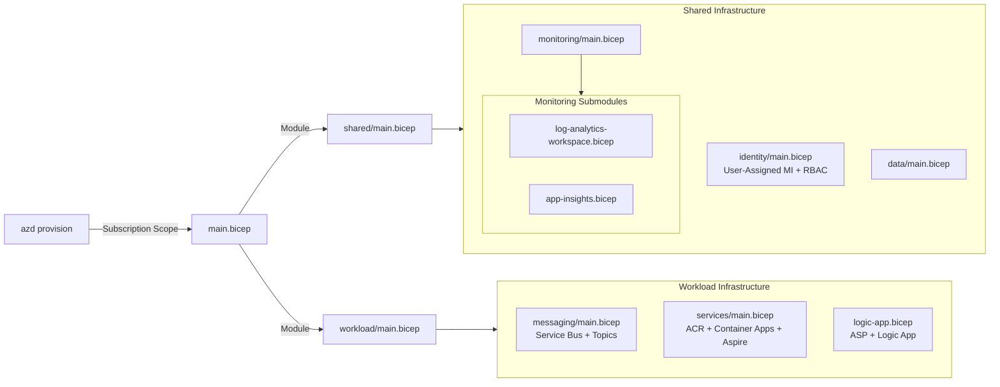

#### Monitoring Data Flow - Infrastructure Layer

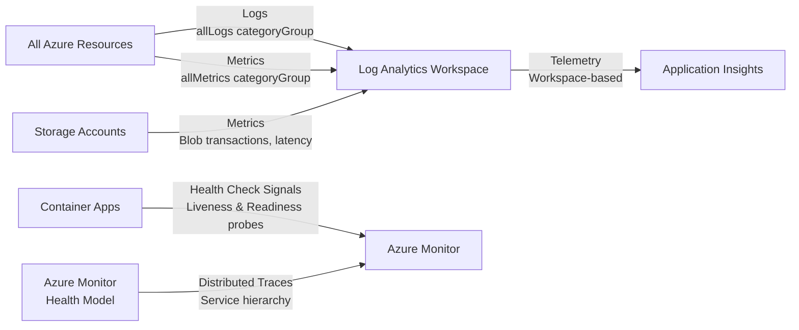

#### Best Practices Applied - Infrastructure Layer

| Practice | Description | Reference |
|----------|-------------|-----------|
| Infrastructure as Code | Modular Bicep templates with `targetScope = 'subscription'` for repeatable deployments | [Bicep overview](https://learn.microsoft.com/azure/azure-resource-manager/bicep/overview) |
| Modular Templates | Separate modules for identity, monitoring, data, messaging, services, and workflows | [Bicep modules](https://learn.microsoft.com/azure/azure-resource-manager/bicep/modules) |
| Resource Naming Convention | `{name}{type}{uniqueSuffix}` pattern with `uniqueString()` for globally unique names | [Naming conventions](https://learn.microsoft.com/azure/cloud-adoption-framework/ready/azure-best-practices/resource-naming) |
| Diagnostic Settings | All resources configured with `allLogs` and `allMetrics` to Log Analytics and Storage | [Diagnostic settings](https://learn.microsoft.com/azure/azure-monitor/essentials/diagnostic-settings) |
| Resource Tags | Governance tags: `azd-env-name`, `azd-service-name`, `Solution`, `Environment`, `CostCenter`, `Owner` | [Tagging strategy](https://learn.microsoft.com/azure/cloud-adoption-framework/ready/azure-best-practices/resource-tagging) |
| Managed Identity Authentication | User-Assigned MI with RBAC role assignments eliminating connection string secrets | [Managed identities best practices](https://learn.microsoft.com/entra/identity/managed-identities-azure-resources/managed-identity-best-practice-recommendations) |
| Parameter Validation | `@minLength`, `@maxLength`, `@allowed` decorators for input validation | [Bicep parameters](https://learn.microsoft.com/azure/azure-resource-manager/bicep/parameters) |
| Output Propagation | Outputs flow between modules for resource wiring (e.g., workspace ID to diagnostic settings) | [Bicep outputs](https://learn.microsoft.com/azure/azure-resource-manager/bicep/outputs) |

---

### Cross-Cutting Concerns

Cross-cutting concerns span all layers of the architecture, providing consistent security through **Microsoft Entra ID** with User-Assigned Managed Identity and comprehensive observability through **Application Insights** and **Log Analytics**. The `app.ServiceDefaults` library centralizes these configurations using extension methods (`AddServiceDefaults`, `ConfigureOpenTelemetry`, `AddDefaultHealthChecks`, `AddAzureServiceBusClient`, `MapDefaultEndpoints`), ensuring every service inherits the same authentication middleware, OpenTelemetry exporters (OTLP + Azure Monitor), and health check implementations.

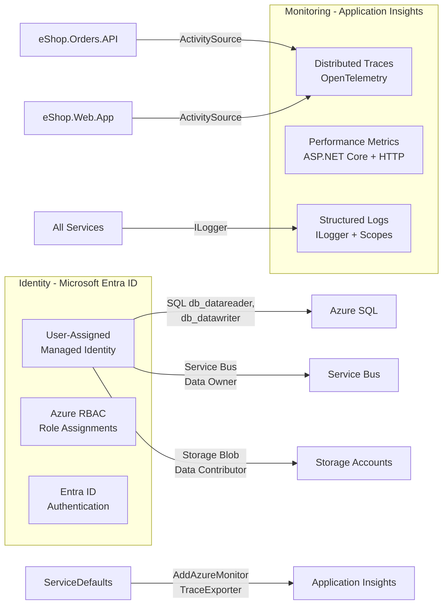
#### Monitoring Data Flow - Cross-Cutting Concerns

```mermaid
flowchart LR
    subgraph Sources["Telemetry Sources"]
        WebApp["eShop.Web.App"]
        OrdersAPI["eShop.Orders.API"]
        LogicApps["Logic Apps"]
        ServiceBus["Service Bus"]
        SQL["Azure SQL"]
    end

    subgraph Pipeline["OpenTelemetry Pipeline"]
        Traces["Distributed Traces"]
        Metrics["Metrics"]
        Logs["Structured Logs"]
    end

    subgraph Destinations["Monitoring Destinations"]
        AppInsights["Application Insights"]
        LogAnalytics["Log Analytics"]
        Storage["Storage Account"]
    end

    Sources -->|"ActivitySource<br/>ILogger"| Pipeline
    Pipeline -->|"OTLP + Azure Monitor<br/>Exporters"| Destinations
    Destinations -->|"Health Check Signals<br/>Alerts & Dashboards"| Operators["Operations Team"]
```
#### Best Practices Applied - Cross-Cutting Concerns

| Practice | Description | Reference |
|----------|-------------|-----------|
| User-Assigned Managed Identity | Single identity shared across all resources for simplified RBAC | [User-assigned identity](https://learn.microsoft.com/entra/identity/managed-identities-azure-resources/how-manage-user-assigned-managed-identities) |
| OpenTelemetry Standard | `AddOpenTelemetry` with ASP.NET Core, HTTP client, SQL client instrumentation | [OpenTelemetry .NET](https://learn.microsoft.com/azure/azure-monitor/app/opentelemetry-enable) |
| Azure Monitor Exporters | `AddAzureMonitorTraceExporter` and `AddAzureMonitorMetricExporter` | [Azure Monitor exporter](https://learn.microsoft.com/azure/azure-monitor/app/opentelemetry-configuration) |
| Structured Logging | `ILogger.BeginScope` with TraceId, SpanId, OrderId for correlation | [Logging in .NET](https://learn.microsoft.com/dotnet/core/extensions/logging) |
| Health Check Tags | `live` tag for `/alive` endpoint, `ready` tag for database/service bus checks | [Health check tags](https://learn.microsoft.com/aspnet/core/host-and-deploy/health-checks#filter-health-checks) |

---

## Usage

### Local Development

Start the application locally with .NET Aspire orchestrating containerized dependencies (SQL Server and Service Bus emulator):

```powershell
# Ensure Docker Desktop is running
docker ps

# Navigate to AppHost project
cd app.AppHost

# Run the application (starts all services + containers)
dotnet run --launch-profile https

# Access services:
#   - Aspire Dashboard: https://localhost:17267
#   - Web App: Check Dashboard for dynamically assigned port
#   - Orders API: Check Dashboard for dynamically assigned port with /swagger
```

### Azure Deployment

Deploy the complete solution to Azure using Azure Developer CLI:

```powershell
# Authenticate with Azure
azd auth login

# Provision infrastructure and deploy application
azd up

# Generate test data (optional)
./hooks/Generate-Orders.ps1 -OrderCount 100
```

### Accessing Services

| Service | Local URL | Description |
|---------|-----------|-------------|
| Aspire Dashboard | `https://localhost:17267` | Resources, logs, traces, metrics |
| Web Application | Dynamic (see Dashboard) | Blazor Server UI with Fluent UI |
| Orders API | Dynamic (see Dashboard) | RESTful API with Swagger/OpenAPI |
| Health Check | `{api-url}/health` | Readiness probe (DB + Service Bus) |
| Liveness Check | `{api-url}/alive` | Liveness probe (self-check) |

---

## License

This project is licensed under the MIT License - see the [LICENSE.md](LICENSE.md) file for details.

---

## Related Documentation

- [Azure Logic Apps Documentation](https://learn.microsoft.com/azure/logic-apps/)
- [.NET Aspire Documentation](https://learn.microsoft.com/dotnet/aspire/)
- [Azure Container Apps Documentation](https://learn.microsoft.com/azure/container-apps/)
- [Azure Service Bus Documentation](https://learn.microsoft.com/azure/service-bus-messaging/)
- [Application Insights Documentation](https://learn.microsoft.com/azure/azure-monitor/app/app-insights-overview)
- [Azure Developer CLI Documentation](https://learn.microsoft.com/azure/developer/azure-developer-cli/)
- [Bicep Documentation](https://learn.microsoft.com/azure/azure-resource-manager/bicep/)
- [Entity Framework Core Documentation](https://learn.microsoft.com/ef/core/)
- [OpenTelemetry .NET Documentation](https://learn.microsoft.com/dotnet/core/diagnostics/observability-with-otel)

---
