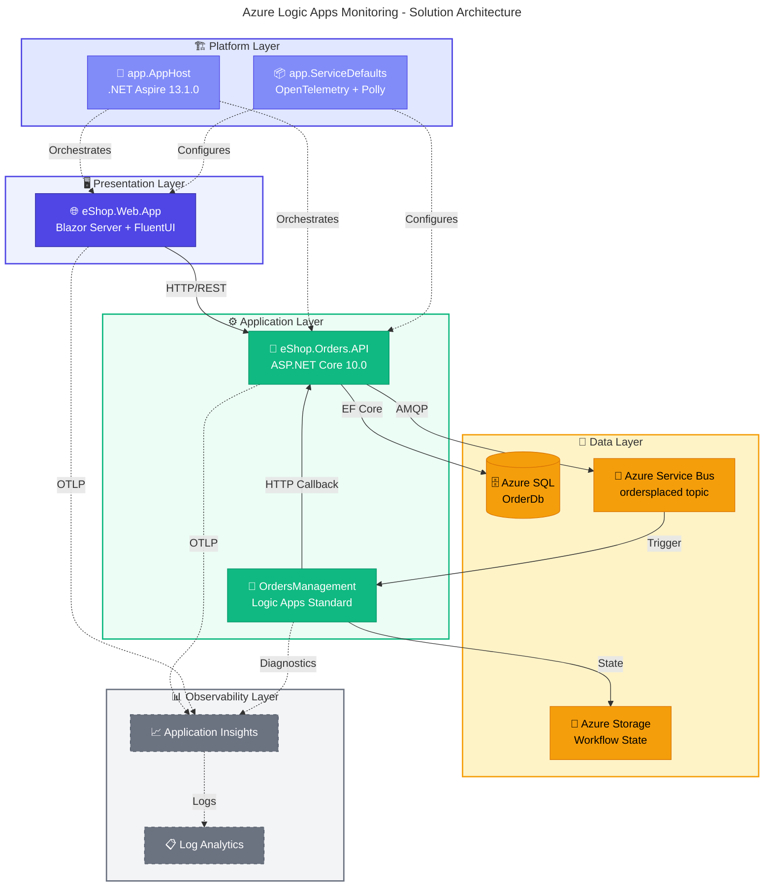

# Azure Logic Apps Monitoring Solution

[](LICENSE)
[](https://dotnet.microsoft.com/)
[](https://azure.microsoft.com/services/logic-apps/)
[](https://learn.microsoft.com/azure/developer/azure-developer-cli/)
[](https://github.com/Evilazaro/Azure-LogicApps-Monitoring/actions/workflows/azure-dev.yml)
[](https://github.com/Evilazaro/Azure-LogicApps-Monitoring/actions/workflows/ci-dotnet.yml)
[](https://learn.microsoft.com/dotnet/aspire/)
[](https://docs.microsoft.com/powershell/)
[](https://learn.microsoft.com/azure/azure-resource-manager/bicep/)

---

## 📑 Table of Contents

- [📋 Description](#-description)
- [🏗️ Architecture Overview](#️-architecture-overview)
- [✅ Prerequisites](#-prerequisites)
- [🚀 Quick Start](#-quick-start)
- [📁 Project Structure](#-project-structure)
- [📖 Documentation](#-documentation)
- [🤝 Contributing](#-contributing)
- [📄 License](#-license)

---

## 📋 Description

The **Azure Logic Apps Monitoring Solution** is a cloud-native reference architecture demonstrating enterprise-grade observability patterns for Azure Logic Apps Standard workflows. Built on **.NET Aspire 13.1.0** orchestration, this solution showcases end-to-end distributed tracing, centralized logging, and comprehensive metrics collection across a microservices-based order management system.

### ✨ Key Highlights

| Feature                        | Description                                                               |
| :----------------------------- | :------------------------------------------------------------------------ |
| **Unified Observability**      | OpenTelemetry-based instrumentation with W3C Trace Context propagation    |
| **Event-Driven Architecture**  | Azure Service Bus for reliable, asynchronous order event processing       |
| **Infrastructure as Code**     | Bicep templates with Azure Developer CLI (azd) for repeatable deployments |
| **Zero-Secret Authentication** | Managed Identity for all service-to-service communication                 |
| **Cross-Platform Scripts**     | PowerShell and Bash automation for Windows, Linux, and macOS              |

[🔝 Back to Top](#azure-logic-apps-monitoring-solution)

---

## 🏗️ Architecture Overview



| Layer             | Components                               | Purpose                              |
| :---------------- | :--------------------------------------- | :----------------------------------- |
| **Presentation**  | eShop.Web.App (Blazor Server + FluentUI) | Interactive UI with order management |
| **Application**   | eShop.Orders.API, Logic Apps Standard    | REST API + workflow automation       |
| **Platform**      | .NET Aspire AppHost + ServiceDefaults    | Orchestration, service discovery     |
| **Data**          | Azure SQL, Service Bus, Storage          | Persistence, messaging, state        |
| **Observability** | Application Insights, Log Analytics      | Tracing, metrics, alerting           |

> 📚 For detailed architecture documentation, see [Architecture Overview](docs/architecture/README.md).

[🔝 Back to Top](#azure-logic-apps-monitoring-solution)

---

## ✅ Prerequisites

| Tool                                                                                                     | Version  | Purpose                                  |
| :------------------------------------------------------------------------------------------------------- | :------- | :--------------------------------------- |
| [Azure CLI](https://learn.microsoft.com/cli/azure/install-azure-cli)                                     | ≥ 2.60.0 | Azure resource management                |
| [Azure Developer CLI (azd)](https://learn.microsoft.com/azure/developer/azure-developer-cli/install-azd) | ≥ 1.11.0 | Infrastructure provisioning & deployment |
| [.NET SDK](https://dotnet.microsoft.com/download)                                                        | 10.0     | Application runtime                      |
| [PowerShell](https://docs.microsoft.com/powershell/scripting/install/installing-powershell)              | ≥ 7.0    | Cross-platform automation                |
| [Docker](https://www.docker.com/products/docker-desktop)                                                 | Latest   | Local development                        |

[🔝 Back to Top](#azure-logic-apps-monitoring-solution)

---

## 🚀 Quick Start

### 1. Clone the Repository

```bash
git clone https://github.com/Evilazaro/Azure-LogicApps-Monitoring.git
cd Azure-LogicApps-Monitoring
```

### 2. Authenticate with Azure

```bash
azd auth login
```

### 3. Create a New Environment

```bash
azd env new <environment-name>
```

### 4. Provision and Deploy

```bash
azd up
```

> 💡 **Tip:** This single command validates prerequisites, provisions infrastructure, and deploys applications.

### Additional Commands

```bash
azd provision       # Provision infrastructure only
azd deploy          # Deploy applications only
azd down            # Delete all resources
azd env get-values  # View environment variables
```

[🔝 Back to Top](#azure-logic-apps-monitoring-solution)

---

## 📁 Project Structure

```text
📁 Azure-LogicApps-Monitoring/
├── 🎯 app.AppHost/                        # .NET Aspire orchestration (Aspire 13.1.0)
│   ├── 🟣 app.AppHost.csproj
│   ├── 🟢 AppHost.cs
│   └── 📋 appsettings.json
├── 📦 app.ServiceDefaults/                # Cross-cutting concerns (OpenTelemetry, health checks)
│   ├── 🟣 app.ServiceDefaults.csproj
│   ├── 🟢 CommonTypes.cs
│   └── 🟢 Extensions.cs
├── 📁 src/
│   ├── 📡 eShop.Orders.API/               # REST API (ASP.NET Core 10.0)
│   │   ├── 📁 Controllers/
│   │   ├── 📁 Services/
│   │   ├── 📁 Repositories/
│   │   ├── 📁 Handlers/
│   │   ├── 📁 HealthChecks/
│   │   ├── 🟣 eShop.Orders.API.csproj
│   │   └── 🟢 Program.cs
│   ├── 🌐 eShop.Web.App/                  # Frontend (Blazor Server + FluentUI)
│   │   ├── 📁 Components/
│   │   ├── 🟣 eShop.Web.App.csproj
│   │   └── 🟢 Program.cs
│   └── 🧪 tests/                          # Unit tests (MSTest + NSubstitute)
│       └── 📁 eShop.Orders.API.Tests/
├── 🏗️ infra/                              # Bicep IaC templates
│   ├── 🔷 main.bicep                      # Entry point orchestrator
│   ├── 📋 main.parameters.json
│   ├── 🔷 types.bicep
│   ├── 📁 shared/                         # Identity, monitoring, network, data
│   │   ├── 📁 identity/
│   │   ├── 📁 monitoring/
│   │   ├── 📁 network/
│   │   └── 📁 data/
│   └── 📁 workload/                       # Logic Apps, messaging, container services
│       ├── 🔷 logic-app.bicep
│       ├── 📁 messaging/
│       └── 📁 services/
├── 🔄 workflows/                          # Logic Apps Standard workflow definitions
│   └── 📁 OrdersManagement/
│       └── 📁 OrdersManagementLogicApp/
├── 🪝 hooks/                              # azd lifecycle scripts (PowerShell + Bash)
│   ├── 🔵 check-dev-workstation.ps1
│   ├── 🐚 check-dev-workstation.sh
│   ├── 🔵 preprovision.ps1
│   ├── 🐚 preprovision.sh
│   ├── 🔵 postprovision.ps1
│   └── 🐚 postprovision.sh
├── 📚 docs/                               # Comprehensive documentation
│   ├── 📁 architecture/                   # TOGAF-aligned architecture docs
│   │   └── 📁 adr/                        # Architecture Decision Records
│   ├── 📁 devops/                         # CI/CD pipeline documentation
│   └── 📁 hooks/                          # Automation scripts guide
├── 🐙 .github/
│   └── 📁 workflows/                      # GitHub Actions CI/CD pipelines
│       ├── 📄 azure-dev.yml
│       ├── 📄 ci-dotnet.yml
│       └── 📄 ci-dotnet-reusable.yml
├── 🟣 app.sln
├── 📄 azure.yaml
├── 📋 global.json
├── 📝 README.MD
└── 📜 LICENSE
```

[🔝 Back to Top](#azure-logic-apps-monitoring-solution)

---

## 📖 Documentation

Detailed documentation is organized by domain. Each section has its own README with comprehensive guides.

| Category                 | Start Here                                          | When to Read                                          |
| :----------------------- | :-------------------------------------------------- | :---------------------------------------------------- |
| **Architecture**         | [Overview](docs/architecture/README.md)             | Understanding system design, components, and patterns |
| **ADRs**                 | [Decision Log](docs/architecture/adr/README.md)     | Learning why specific technologies were chosen        |
| **DevOps**               | [CI/CD Guide](docs/devops/README.md)                | Setting up pipelines or understanding deployment flow |
| **Developer Experience** | [Scripts Guide](docs/hooks/README.md)               | Automating local setup or customizing azd hooks       |
| **Security**             | [IP Restrictions](docs/IP-SECURITY-RESTRICTIONS.md) | Configuring network security policies                 |

[🔝 Back to Top](#azure-logic-apps-monitoring-solution)

---

## 🤝 Contributing

Contributions are welcome! Please follow these steps:

1. **Fork** the repository
2. **Create** a feature branch (`git checkout -b feature/amazing-feature`)
3. **Commit** your changes (`git commit -m 'Add amazing feature'`)
4. **Push** to the branch (`git push origin feature/amazing-feature`)
5. **Open** a Pull Request

### Development Setup

```bash
# Restore and build
dotnet restore && dotnet build

# Run tests
dotnet test --collect:"XPlat Code Coverage"

# Run locally with Aspire dashboard
dotnet run --project app.AppHost

# Validate environment
./hooks/check-dev-workstation.ps1  # Windows
./hooks/check-dev-workstation.sh   # Linux/macOS
```

[🔝 Back to Top](#azure-logic-apps-monitoring-solution)

---

## 📄 License

This project is licensed under the **MIT License** — see the [LICENSE](LICENSE) file for details.

---

<div align="center">

**[Evilazaro](https://github.com/Evilazaro)** — Principal Cloud Solution Architect @ Microsoft

</div>
