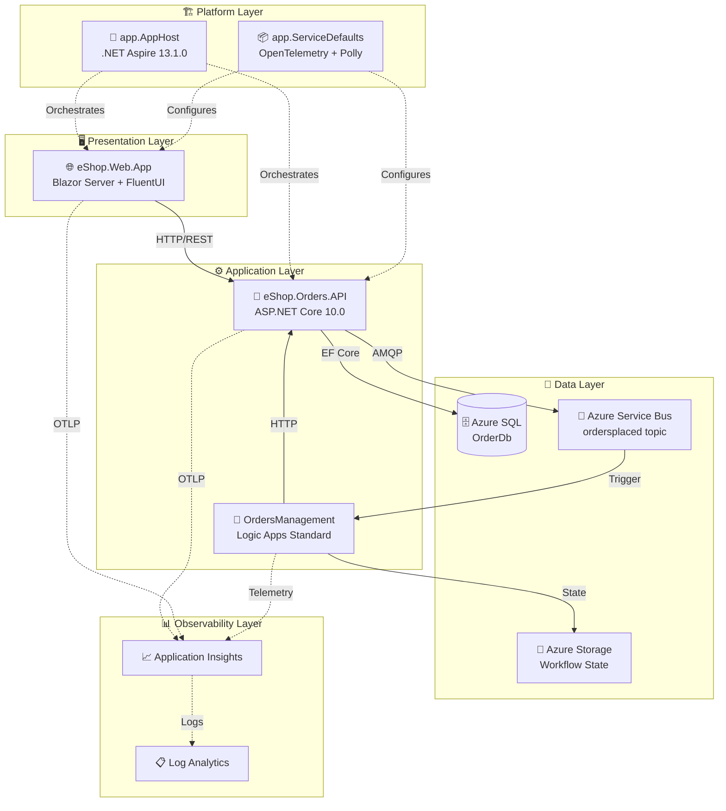

# Azure Logic Apps Monitoring Solution

[](LICENSE)
[](https://dotnet.microsoft.com/)
[](https://azure.microsoft.com/services/logic-apps/)
[](https://learn.microsoft.com/azure/developer/azure-developer-cli/)
[](https://github.com/Evilazaro/Azure-LogicApps-Monitoring/actions/workflows/azure-dev.yml)
[](https://github.com/Evilazaro/Azure-LogicApps-Monitoring/actions/workflows/ci-dotnet.yml)
[](https://learn.microsoft.com/dotnet/aspire/)
[](https://docs.microsoft.com/powershell/)
[](https://learn.microsoft.com/azure/azure-resource-manager/bicep/)

---

## 📑 Table of Contents

- [📋 Description](#-description)
- [🏗️ Architecture Overview](#️-architecture-overview)
- [✅ Prerequisites](#-prerequisites)
- [🚀 Quick Start](#-quick-start)
- [📁 Project Structure](#-project-structure)
- [⚙️ Application Components](#️-application-components)
- [☁️ Infrastructure](#️-infrastructure)
- [🔄 Logic Apps Workflows](#-logic-apps-workflows)
- [🔁 CI/CD Pipelines](#-cicd-pipelines)
- [🪝 Developer Hooks](#-developer-hooks)
- [🧪 Testing](#-testing)
- [📖 Documentation](#-documentation)
- [🤝 Contributing](#-contributing)
- [📄 License](#-license)

---

## 📋 Description

The **Azure Logic Apps Monitoring Solution** is a cloud-native reference architecture demonstrating enterprise-grade observability patterns for Azure Logic Apps Standard workflows.

Built on **.NET Aspire 13.1.0** orchestration, this solution showcases end-to-end distributed tracing, centralized logging, and comprehensive metrics collection across a microservices-based order management system.

### ✨ Key Highlights

| Feature | Description |
|:--------|:------------|
| **Unified Observability** | OpenTelemetry-based instrumentation with W3C Trace Context propagation |
| **Event-Driven Architecture** | Azure Service Bus for reliable, asynchronous order event processing |
| **Infrastructure as Code** | Bicep templates with Azure Developer CLI (azd) for repeatable deployments |
| **Zero-Secret Authentication** | Managed Identity for all service-to-service communication |
| **Cross-Platform Scripts** | PowerShell and Bash automation for Windows, Linux, and macOS |
| **Comprehensive Testing** | MSTest with code coverage and diagnostic reporting |

[🔝 Back to Top](#azure-logic-apps-monitoring-solution)

---

## 🏗️ Architecture Overview



### 📊 Layer Summary

| Layer | Components | Purpose |
|:------|:-----------|:--------|
| **Presentation** | eShop.Web.App (Blazor Server + FluentUI) | Interactive UI with order management pages |
| **Application** | eShop.Orders.API, Logic Apps Standard | REST API + automated workflow processing |
| **Platform** | .NET Aspire AppHost + ServiceDefaults | Orchestration, service discovery, resilience |
| **Data** | Azure SQL, Service Bus, Storage | Persistence, messaging, workflow state |
| **Observability** | Application Insights, Log Analytics | Distributed tracing, metrics, alerting |
| **Network** | Virtual Network with delegated subnets | Container Apps, Logic Apps, Private Endpoints |

> 📚 For detailed architecture documentation, see [Architecture Overview](docs/architecture/README.md).

[🔝 Back to Top](#azure-logic-apps-monitoring-solution)

---

## ✅ Prerequisites

### Required Tools

| Tool | Version | Purpose |
|:-----|:--------|:--------|
| [Azure CLI](https://learn.microsoft.com/cli/azure/install-azure-cli) | ≥ 2.60.0 | Azure resource management |
| [Azure Developer CLI (azd)](https://learn.microsoft.com/azure/developer/azure-developer-cli/install-azd) | ≥ 1.11.0 | Infrastructure provisioning & deployment |
| [.NET SDK](https://dotnet.microsoft.com/download) | 10.0 | Application runtime |
| [PowerShell](https://docs.microsoft.com/powershell/scripting/install/installing-powershell) | ≥ 7.0 | Cross-platform automation scripts |
| [Docker](https://www.docker.com/products/docker-desktop) | Latest | Local development & containers |

### ☁️ Azure Subscription Requirements

An active Azure subscription with permissions to create:

- Resource Groups
- Azure Container Apps Environment
- Azure SQL Database
- Azure Service Bus Namespace
- Azure Logic Apps Standard (WorkflowStandard tier)
- Azure Storage Accounts
- Application Insights & Log Analytics Workspace
- User-Assigned Managed Identity
- Virtual Network with delegated subnets

[🔝 Back to Top](#azure-logic-apps-monitoring-solution)

---

## 🚀 Quick Start

### Step 1: Clone the Repository

```bash
git clone https://github.com/Evilazaro/Azure-LogicApps-Monitoring.git
cd Azure-LogicApps-Monitoring
```

### Step 2: Authenticate with Azure

```bash
azd auth login
```

### Step 3: Create a New Environment

```bash
azd env new <environment-name>
```

### Step 4: Provision and Deploy

```bash
azd up
```

> 💡 **Tip:** This single command executes the full deployment pipeline.

#### Deployment Pipeline Stages

| Stage | Description |
|:------|:------------|
| **preprovision** | Validates prerequisites, builds solution, runs tests |
| **provision** | Deploys Bicep infrastructure (VNet, SQL, Service Bus, Logic Apps, etc.) |
| **postprovision** | Configures secrets, generates test data |
| **predeploy** | Deploys Logic Apps workflow definitions |
| **deploy** | Deploys .NET applications to Azure Container Apps |

### 📦 Additional Commands

```bash
# Provision infrastructure only
azd provision

# Deploy applications only
azd deploy

# Delete all resources
azd down

# View environment variables
azd env get-values
```

[🔝 Back to Top](#azure-logic-apps-monitoring-solution)

---

## 📁 Project Structure

```text
Azure-LogicApps-Monitoring/
├── 📁 .github/
│   └── workflows/                    # GitHub Actions CI/CD pipelines
│       ├── azure-dev.yml             # CD pipeline (azd provision + deploy)
│       ├── ci-dotnet.yml             # CI pipeline entry point
│       └── ci-dotnet-reusable.yml    # Reusable CI workflow
├── 📁 app.AppHost/                   # .NET Aspire orchestration host
│   ├── AppHost.cs                    # Service configuration & Azure resources
│   └── app.AppHost.csproj            # Aspire 13.1.0 SDK references
├── 📁 app.ServiceDefaults/           # Cross-cutting concerns
│   ├── Extensions.cs                 # OpenTelemetry, health checks, resilience
│   └── CommonTypes.cs                # Shared domain models (Order, OrderProduct)
├── 📁 src/
│   ├── eShop.Orders.API/             # REST API for order management
│   │   ├── Controllers/              # OrdersController with CRUD operations
│   │   ├── Services/                 # Business logic layer
│   │   ├── Repositories/             # Data access with EF Core
│   │   ├── Handlers/                 # Service Bus message handlers
│   │   ├── HealthChecks/             # Custom health checks (DB, ServiceBus)
│   │   └── Migrations/               # EF Core database migrations
│   ├── eShop.Web.App/                # Blazor Server frontend
│   │   └── Components/
│   │       ├── Pages/                # Razor pages (Home, PlaceOrder, etc.)
│   │       └── Services/             # OrdersAPIService HTTP client
│   └── tests/
│       └── eShop.Orders.API.Tests/   # Unit tests with MSTest + NSubstitute
├── 📁 infra/                         # Bicep infrastructure templates
│   ├── main.bicep                    # Entry point orchestrator
│   ├── main.parameters.json          # Environment parameters
│   ├── types.bicep                   # Shared type definitions
│   ├── shared/                       # Cross-cutting infrastructure
│   │   ├── identity/                 # User-assigned managed identity
│   │   ├── monitoring/               # Log Analytics + App Insights
│   │   ├── network/                  # VNet with delegated subnets
│   │   └── data/                     # Storage accounts + SQL Database
│   └── workload/                     # Application infrastructure
│       ├── logic-app.bicep           # Logic Apps Standard + App Service Plan
│       ├── messaging/                # Service Bus namespace + topics
│       └── services/                 # Container Registry + Container Apps
├── 📁 workflows/
│   └── OrdersManagement/             # Logic Apps workspace
│       └── OrdersManagementLogicApp/
│           ├── OrdersPlacedProcess/  # Service Bus trigger → Process order
│           ├── OrdersPlacedCompleteProcess/  # Cleanup workflow
│           ├── host.json             # OpenTelemetry configuration
│           └── connections.json      # Service Bus + Blob connectors
├── 📁 hooks/                         # azd lifecycle scripts (PS1 + SH)
│   ├── preprovision.*                # Prerequisites validation
│   ├── postprovision.*               # Secret configuration + test data
│   ├── deploy-workflow.*             # Logic Apps deployment
│   ├── check-dev-workstation.*       # Development environment check
│   ├── clean-secrets.*               # Secret cleanup
│   ├── Generate-Orders.*             # Test data generation
│   └── sql-managed-identity-config.* # SQL managed identity setup
├── 📁 docs/                          # Comprehensive documentation
│   ├── architecture/                 # Enterprise architecture docs
│   │   ├── 01-business-architecture.md
│   │   ├── 02-data-architecture.md
│   │   ├── 03-application-architecture.md
│   │   ├── 04-technology-architecture.md
│   │   ├── 05-observability-architecture.md
│   │   ├── 06-security-architecture.md
│   │   ├── 07-deployment-architecture.md
│   │   └── adr/                      # Architecture Decision Records
│   ├── devops/                       # CI/CD pipeline documentation
│   └── hooks/                        # Automation scripts documentation
├── azure.yaml                        # azd project configuration
├── app.sln                           # Visual Studio solution
└── global.json                       # .NET SDK configuration
```

[🔝 Back to Top](#azure-logic-apps-monitoring-solution)

---

## ⚙️ Application Components

### 📡 eShop.Orders.API

ASP.NET Core 10.0 REST API for order management.

| Feature | Implementation |
|:--------|:---------------|
| **Framework** | ASP.NET Core 10.0 with OpenAPI/Swagger |
| **Database** | Entity Framework Core with Azure SQL |
| **Messaging** | Azure Service Bus with managed identity |
| **Resilience** | Polly retry policies (5 retries, 30s max delay) |
| **Health Checks** | Custom checks for database and Service Bus |
| **Tracing** | OpenTelemetry with ActivitySource instrumentation |

#### API Endpoints

| Method | Endpoint | Description |
|:-------|:---------|:------------|
| `POST` | `/api/orders` | Place a new order |
| `GET` | `/api/orders` | List all orders |
| `GET` | `/api/orders/{id}` | Get order by ID |
| `DELETE` | `/api/orders/{id}` | Delete an order |
| `POST` | `/api/orders/process` | Process order (Logic Apps callback) |

---

### 🌐 eShop.Web.App

Blazor Server application with Microsoft FluentUI components.

| Feature | Implementation |
|:--------|:---------------|
| **Framework** | Blazor Server with interactive SSR |
| **UI Library** | Microsoft FluentUI 4.13.2 |
| **Session** | Distributed memory cache with secure cookies |
| **HTTP Client** | Typed HttpClient with service discovery |
| **SignalR** | Optimized for reliability (2min handshake, 5min timeout) |

#### Pages

| Page | Description |
|:-----|:------------|
| `Home.razor` | Dashboard |
| `PlaceOrder.razor` | Single order placement |
| `PlaceOrdersBatch.razor` | Batch order processing |
| `ListAllOrders.razor` | Order listing |
| `ViewOrder.razor` | Order details |

---

### 📦 app.ServiceDefaults

Cross-cutting concerns shared across all services.

| Feature | Implementation |
|:--------|:---------------|
| **Observability** | OpenTelemetry with Azure Monitor exporter |
| **Resilience** | HTTP client policies (retry, timeout, circuit breaker) |
| **Health Checks** | `/health` and `/alive` endpoints |
| **Service Discovery** | Automatic endpoint resolution |

[🔝 Back to Top](#azure-logic-apps-monitoring-solution)

---

## ☁️ Infrastructure

### 🧩 Bicep Modules

| Module | Resources |
|:-------|:----------|
| `shared/identity` | User-Assigned Managed Identity with RBAC roles |
| `shared/monitoring` | Log Analytics Workspace, Application Insights |
| `shared/network` | VNet (`10.0.0.0/16`), API/Data/Workflows subnets |
| `shared/data` | Storage Accounts, Azure SQL Database, Blob containers |
| `workload/messaging` | Service Bus Namespace, Topics, Subscriptions |
| `workload/services` | Container Registry, Container Apps Environment |
| `workload/logic-app` | Logic Apps Standard, App Service Plan (WS1) |

### 🌍 Environment Support

| Environment | Configuration |
|:------------|:--------------|
| `dev` | Development with verbose logging |
| `test` | Testing with isolated resources |
| `staging` | Pre-production validation |
| `prod` | Production with optimized settings |

[🔝 Back to Top](#azure-logic-apps-monitoring-solution)

---

## 🔄 Logic Apps Workflows

### OrdersPlacedProcess

Triggered by Service Bus messages on the `ordersplaced` topic.

**Workflow:**

1. Receive order message from Service Bus
2. Validate message content type (JSON)
3. Call Orders API `/api/orders/process`
4. Store result in Azure Blob Storage:
   - ✅ Success → `/ordersprocessedsuccessfully/`
   - ❌ Error → `/ordersprocessedwitherrors/`

---

### OrdersPlacedCompleteProcess

Scheduled cleanup workflow (runs every 3 seconds).

**Workflow:**

1. List blobs in `/ordersprocessedsuccessfully/`
2. For each blob, get metadata and delete

[🔝 Back to Top](#azure-logic-apps-monitoring-solution)

---

## 🔁 CI/CD Pipelines

### 🚀 azure-dev.yml (CD Pipeline)

Continuous Delivery pipeline using Azure Developer CLI.

| Trigger | Branches/Paths |
|:--------|:---------------|
| Push | `main` branch, `src/**`, `app.*/**`, `infra/**` |
| Workflow Dispatch | Manual trigger with skip-CI option |

**Features:**

- ✅ OIDC authentication (no stored secrets)
- ✅ GitHub Environment protection rules
- ✅ Deployment summaries with observability links

---

### 🔍 ci-dotnet.yml (CI Pipeline)

Continuous Integration pipeline for build validation.

| Trigger | Branches |
|:--------|:---------|
| Push | `main`, `feature/**`, `bugfix/**`, `hotfix/**`, `release/**` |
| Pull Request | Targeting `main` |

**Features:**

- ✅ Code coverage collection (Cobertura format)
- ✅ Static code analysis with `dotnet format`
- ✅ Test result publishing (TRX format)

[🔝 Back to Top](#azure-logic-apps-monitoring-solution)

---

## 🪝 Developer Hooks

Cross-platform automation scripts executed during azd lifecycle.

### Lifecycle Hooks

| Hook | Script | Purpose |
|:-----|:-------|:--------|
| **preprovision** | `preprovision.ps1` / `.sh` | Validate prerequisites, build, test |
| **postprovision** | `postprovision.ps1` / `.sh` | Configure secrets, generate test data |
| **predeploy** | `deploy-workflow.ps1` / `.sh` | Deploy Logic Apps workflows |

### Utility Scripts

| Script | Purpose |
|:-------|:--------|
| `check-dev-workstation.*` | Validate development environment |
| `clean-secrets.*` | Remove .NET user secrets |
| `Generate-Orders.*` | Generate sample order data |
| `sql-managed-identity-config.*` | Configure SQL managed identity access |
| `configure-federated-credential.*` | Set up GitHub OIDC federation |

> 📚 For detailed documentation, see [Developer Hooks Guide](docs/hooks/README.md).

[🔝 Back to Top](#azure-logic-apps-monitoring-solution)

---

## 🧪 Testing

### Unit Tests

Located in `src/tests/eShop.Orders.API.Tests/`.

| Framework | Version |
|:----------|:--------|
| MSTest | 4.0.2 |
| NSubstitute | 5.3.0 |
| EF Core InMemory | 10.0.2 |

**Test Categories:**

- `Handlers/` — Message handler tests
- `HealthChecks/` — Health check tests
- `Repositories/` — Data access tests

### Running Tests

```bash
# Run all tests
dotnet test

# Run with coverage
dotnet test --collect:"XPlat Code Coverage"

# Run with diagnostics
dotnet test --diagnostic --diagnostic-file-prefix "[log]_"
```

[🔝 Back to Top](#azure-logic-apps-monitoring-solution)

---

## 📖 Documentation

### 🏗️ Architecture Documentation

| Document | Description |
|:---------|:------------|
| [Architecture Overview](docs/architecture/README.md) | High-level architecture with Mermaid diagrams |
| [Business Architecture](docs/architecture/01-business-architecture.md) | Business context, stakeholders, value streams |
| [Data Architecture](docs/architecture/02-data-architecture.md) | Data stores, domains, telemetry mapping |
| [Application Architecture](docs/architecture/03-application-architecture.md) | Service catalog, API contracts, interactions |
| [Technology Architecture](docs/architecture/04-technology-architecture.md) | Platform services, Azure resource topology |
| [Observability Architecture](docs/architecture/05-observability-architecture.md) | Distributed tracing, metrics, alerting |
| [Security Architecture](docs/architecture/06-security-architecture.md) | Authentication, authorization, network security |
| [Deployment Architecture](docs/architecture/07-deployment-architecture.md) | IaC, CI/CD, environment management |

### 📝 Architecture Decision Records

| ADR | Decision | Status |
|:----|:---------|:-------|
| [ADR-001](docs/architecture/adr/ADR-001-aspire-orchestration.md) | .NET Aspire for Service Orchestration | ✅ Accepted |
| [ADR-002](docs/architecture/adr/ADR-002-service-bus-messaging.md) | Azure Service Bus for Async Messaging | ✅ Accepted |
| [ADR-003](docs/architecture/adr/ADR-003-observability-strategy.md) | OpenTelemetry with Azure Monitor | ✅ Accepted |

### 📚 Additional Documentation

| Document | Description |
|:---------|:------------|
| [DevOps Practices](docs/devops/README.md) | CI/CD pipeline documentation |
| [Developer Hooks](docs/hooks/README.md) | Automation scripts guide |
| [IP Security Restrictions](docs/IP-SECURITY-RESTRICTIONS.md) | Network security configuration |

[🔝 Back to Top](#azure-logic-apps-monitoring-solution)

---

## 🤝 Contributing

Contributions are welcome! Please follow these steps:

1. **Fork** the repository
2. **Create** a feature branch (`git checkout -b feature/amazing-feature`)
3. **Commit** your changes (`git commit -m 'Add amazing feature'`)
4. **Push** to the branch (`git push origin feature/amazing-feature`)
5. **Open** a Pull Request

### 💻 Development Setup

```bash
# Restore dependencies
dotnet restore

# Build the solution
dotnet build

# Run tests with coverage
dotnet test --collect:"XPlat Code Coverage"

# Run locally with Aspire dashboard
dotnet run --project app.AppHost

# Validate development environment (Windows)
./hooks/check-dev-workstation.ps1

# Validate development environment (Linux/macOS)
./hooks/check-dev-workstation.sh
```

### 📏 Code Style

- ✅ Enable nullable reference types
- ✅ Use implicit usings
- ✅ Follow .NET naming conventions
- ✅ Document public APIs with XML comments

[🔝 Back to Top](#azure-logic-apps-monitoring-solution)

---

## 📄 License

This project is licensed under the **MIT License** — see the [LICENSE](LICENSE) file for details.

---

<div align="center">

**Author:** [Evilazaro](https://github.com/Evilazaro) — Principal Cloud Solution Architect @ Microsoft

**Repository:** [Azure-LogicApps-Monitoring](https://github.com/Evilazaro/Azure-LogicApps-Monitoring)

**Version:** 1.0.0 (January 2026)

</div>
