# 🚀 Azure Logic Apps Monitoring Solution


> A cloud-native reference architecture demonstrating **enterprise-grade observability patterns** for Azure Logic Apps Standard workflows. Built on **.NET Aspire** orchestration, this solution showcases end-to-end distributed tracing, event-driven messaging, and comprehensive telemetry collection across a microservices-based order management system.

---

## 📑 Table of Contents

- [✨ Key Features](#-key-features)
- [🏗️ Architecture Overview](#️-architecture-overview)
- [📋 Prerequisites](#-prerequisites)
- [🚀 Quick Start](#-quick-start)
- [📁 Project Structure](#-project-structure)
- [📚 Documentation](#-documentation)
- [🔧 Local Development](#-local-development)
- [🤝 Contributing](#-contributing)
- [📄 License](#-license)

---

## ✨ Key Features

| Feature                        | Description                                                                     |
| ------------------------------ | ------------------------------------------------------------------------------- |
| **Unified Observability**      | OpenTelemetry-based instrumentation with W3C Trace Context propagation          |
| **Event-Driven Architecture**  | Azure Service Bus for reliable, asynchronous order event processing             |
| **Infrastructure as Code**     | Bicep templates with Azure Developer CLI (`azd`) for single-command deployments |
| **Zero-Secret Authentication** | Managed Identity for all service-to-service communication                       |
| **Cross-Platform CI/CD**       | GitHub Actions with matrix builds (Ubuntu, Windows, macOS)                      |
| **.NET Aspire Orchestration**  | Simplified local development with service discovery and health monitoring       |

---

## 🏗️ Architecture Overview

```mermaid
---
title: Azure Logic Apps Monitoring Solution Architecture
---
flowchart TB
    %% ===== USER LAYER =====
    subgraph UserLayer["👤 User Layer"]
        User["User / Browser"]
    end

    %% ===== PRESENTATION LAYER =====
    subgraph PresentationLayer["🖥️ Presentation Layer"]
        WebApp["eShop.Web.App<br/>(Blazor)"]
    end

    %% ===== APPLICATION LAYER =====
    subgraph ApplicationLayer["⚙️ Application Layer"]
        API["eShop.Orders.API<br/>(REST API)"]
    end

    %% ===== DATA LAYER =====
    subgraph DataLayer["💾 Data Layer"]
        SQL[("Azure SQL<br/>Database")]
    end

    %% ===== MESSAGING LAYER =====
    subgraph MessagingLayer["📨 Messaging Layer"]
        ServiceBus["Azure Service Bus<br/>(Topics/Queues)"]
    end

    %% ===== WORKFLOW LAYER =====
    subgraph WorkflowLayer["🔄 Workflow Layer"]
        LogicApp["Azure Logic Apps<br/>Standard"]
    end

    %% ===== OBSERVABILITY LAYER =====
    subgraph ObservabilityLayer["📊 Observability Layer"]
        AppInsights["Application Insights"]
        LogAnalytics["Log Analytics"]
    end

    %% ===== CONNECTIONS =====
    User -->|"HTTP/HTTPS"| WebApp
    WebApp -->|"REST API calls"| API
    API -->|"CRUD operations"| SQL
    API -->|"Publish events"| ServiceBus
    ServiceBus -->|"Trigger workflows"| LogicApp
    LogicApp -->|"Process orders"| SQL

    %% Observability connections (dotted)
    WebApp -.->|"Telemetry"| AppInsights
    API -.->|"Telemetry"| AppInsights
    LogicApp -.->|"Telemetry"| AppInsights
    AppInsights -.->|"Logs & Metrics"| LogAnalytics

    %% ===== STYLING DEFINITIONS =====
    classDef primary fill:#4F46E5,stroke:#3730A3,color:#FFFFFF
    classDef secondary fill:#10B981,stroke:#059669,color:#FFFFFF
    classDef datastore fill:#F59E0B,stroke:#D97706,color:#000000
    classDef external fill:#6B7280,stroke:#4B5563,color:#FFFFFF,stroke-dasharray: 5 5
    classDef user fill:#818CF8,stroke:#4F46E5,color:#FFFFFF

    %% ===== SUBGRAPH STYLING =====
    style UserLayer fill:#EEF2FF,stroke:#4F46E5,stroke-width:2px
    style PresentationLayer fill:#E0E7FF,stroke:#4F46E5,stroke-width:2px
    style ApplicationLayer fill:#ECFDF5,stroke:#10B981,stroke-width:2px
    style DataLayer fill:#FEF3C7,stroke:#F59E0B,stroke-width:2px
    style MessagingLayer fill:#FEF3C7,stroke:#F59E0B,stroke-width:2px
    style WorkflowLayer fill:#E0E7FF,stroke:#4F46E5,stroke-width:2px
    style ObservabilityLayer fill:#F3F4F6,stroke:#6B7280,stroke-width:2px

    %% ===== NODE STYLING =====
    class User user
    class WebApp,API,LogicApp primary
    class SQL,ServiceBus datastore
    class AppInsights,LogAnalytics secondary
```



### Azure Services Used

| Service                        | Purpose                                    |
| ------------------------------ | ------------------------------------------ |
| **Azure Container Apps**       | Hosts .NET Aspire services (API + Web App) |
| **Azure Logic Apps Standard**  | Order processing workflows                 |
| **Azure Service Bus**          | Asynchronous messaging between services    |
| **Azure SQL Database**         | Order data persistence                     |
| **Azure Application Insights** | Distributed tracing and metrics            |
| **Azure Log Analytics**        | Centralized logging and KQL queries        |

> 📖 **Detailed Architecture**: See [docs/architecture/README.md](docs/architecture/README.md) for complete TOGAF-aligned documentation.

---

## 📋 Prerequisites

| Tool                          | Version  | Installation                                                                           |
| ----------------------------- | -------- | -------------------------------------------------------------------------------------- |
| **.NET SDK**                  | 10.0     | [Download](https://dotnet.microsoft.com/download/dotnet/10.0)                          |
| **Azure CLI**                 | ≥ 2.60.0 | [Install](https://docs.microsoft.com/cli/azure/install-azure-cli)                      |
| **Azure Developer CLI (azd)** | ≥ 1.11.0 | [Install](https://learn.microsoft.com/azure/developer/azure-developer-cli/install-azd) |
| **Docker Desktop**            | Latest   | [Download](https://www.docker.com/products/docker-desktop)                             |
| **Git**                       | Latest   | [Download](https://git-scm.com/downloads)                                              |

### Azure Subscription Requirements

- An active Azure subscription with **Contributor** role
- Ability to create service principals for OIDC authentication (CI/CD)

---

## 🚀 Quick Start

### 1. Clone the Repository

```bash
git clone https://github.com/Evilazaro/Azure-LogicApps-Monitoring.git
cd Azure-LogicApps-Monitoring
```

### 2. Authenticate with Azure

```bash
# Login to Azure CLI
az login

# Login to Azure Developer CLI
azd auth login
```

### 3. Create a New Environment

```bash
# Create and configure environment
azd env new <your-environment-name>

# Set required variables (prompted automatically)
azd env set AZURE_LOCATION <azure-region>  # e.g., eastus2
```

### 4. Deploy to Azure

```bash
# Provision infrastructure and deploy application
azd up
```

This single command will:

1. ✅ Build and test the .NET solution
2. ✅ Provision all Azure infrastructure (Bicep)
3. ✅ Configure SQL database with Managed Identity
4. ✅ Deploy Logic App workflows
5. ✅ Deploy containerized applications

### 5. Verify Deployment

```bash
# View deployed endpoints
azd show

# Monitor logs
azd monitor --logs
```

---

## 📁 Project Structure

```text
Azure-LogicApps-Monitoring/
├── app.AppHost/              # .NET Aspire orchestration host
├── app.ServiceDefaults/      # Shared service configurations
├── src/
│   ├── eShop.Orders.API/     # Orders REST API service
│   ├── eShop.Web.App/        # Blazor frontend application
│   └── tests/                # Unit and integration tests
├── infra/                    # Bicep infrastructure modules
│   ├── main.bicep            # Entry point orchestrator
│   ├── shared/               # Cross-cutting resources (identity, monitoring)
│   └── workload/             # Application-specific resources
├── workflows/                # Logic Apps workflow definitions
│   └── OrdersManagement/     # Order processing workflows
├── hooks/                    # azd lifecycle scripts (preprovision, postprovision)
├── docs/                     # Comprehensive documentation
│   ├── architecture/         # TOGAF-aligned architecture docs
│   ├── devops/               # CI/CD pipeline documentation
│   └── hooks/                # Hook scripts documentation
├── .github/workflows/        # GitHub Actions CI/CD pipelines
├── azure.yaml                # Azure Developer CLI configuration
└── app.sln                   # .NET solution file
```

---

## 📚 Documentation

| Document                                                                         | Description                                       |
| -------------------------------------------------------------------------------- | ------------------------------------------------- |
| [Architecture Overview](docs/architecture/README.md)                             | Complete TOGAF-aligned architecture documentation |
| [Business Architecture](docs/architecture/01-business-architecture.md)           | Business context, capabilities, and value streams |
| [Data Architecture](docs/architecture/02-data-architecture.md)                   | Data stores, domains, and telemetry mapping       |
| [Application Architecture](docs/architecture/03-application-architecture.md)     | Service catalog and API contracts                 |
| [Technology Architecture](docs/architecture/04-technology-architecture.md)       | Platform services and Azure resource topology     |
| [Observability Architecture](docs/architecture/05-observability-architecture.md) | Distributed tracing, metrics, and alerting        |
| [Security Architecture](docs/architecture/06-security-architecture.md)           | Authentication, authorization, and compliance     |
| [Deployment Architecture](docs/architecture/07-deployment-architecture.md)       | CI/CD pipelines and environment management        |
| [DevOps Documentation](docs/devops/README.md)                                    | GitHub Actions workflow documentation             |
| [Hook Scripts](docs/hooks/README.md)                                             | azd lifecycle automation scripts                  |

### Architecture Decision Records (ADRs)

| ADR                                                                | Title                                 | Status   |
| ------------------------------------------------------------------ | ------------------------------------- | -------- |
| [ADR-001](docs/architecture/adr/ADR-001-aspire-orchestration.md)   | .NET Aspire for Service Orchestration | Accepted |
| [ADR-002](docs/architecture/adr/ADR-002-service-bus-messaging.md)  | Azure Service Bus for Async Messaging | Accepted |
| [ADR-003](docs/architecture/adr/ADR-003-observability-strategy.md) | OpenTelemetry with Azure Monitor      | Accepted |

---

## 🔧 Local Development

### Run with .NET Aspire

```bash
# Start all services locally with Aspire Dashboard
dotnet run --project app.AppHost/app.AppHost.csproj
```

### Access Points (Local)

| Service              | URL                       |
| -------------------- | ------------------------- |
| **Aspire Dashboard** | `https://localhost:17088` |
| **Orders API**       | `https://localhost:7001`  |
| **Web Application**  | `https://localhost:7002`  |

### Run Tests

```bash
# Run all tests with coverage
dotnet test --configuration Release --collect:"XPlat Code Coverage"
```

### Useful azd Commands

| Command              | Description                         |
| -------------------- | ----------------------------------- |
| `azd up`             | Provision infrastructure and deploy |
| `azd provision`      | Provision infrastructure only       |
| `azd deploy`         | Deploy applications only            |
| `azd down`           | Delete all Azure resources          |
| `azd monitor --logs` | Stream application logs             |
| `azd env list`       | List all environments               |

---

## 🤝 Contributing

Contributions are welcome! Please follow these steps:

1. **Fork** the repository
2. **Create** a feature branch (`git checkout -b feature/amazing-feature`)
3. **Commit** your changes (`git commit -m 'Add amazing feature'`)
4. **Push** to the branch (`git push origin feature/amazing-feature`)
5. **Open** a Pull Request

### Development Guidelines

- Follow [.NET coding conventions](https://docs.microsoft.com/dotnet/csharp/fundamentals/coding-style/coding-conventions)
- Write unit tests for new functionality
- Update documentation for significant changes
- Ensure CI pipeline passes before requesting review

---

## 📄 License

This project is licensed under the **MIT License** - see the [LICENSE](LICENSE) file for details.

---

<div align="center">

**[⬆ Back to Top](#-azure-logic-apps-monitoring-solution)**

Made with ❤️ by [Evilazaro](https://github.com/Evilazaro)

</div>
