# Azure Logic Apps Monitoring Solution

[](LICENSE)
[](https://dotnet.microsoft.com/)
[](https://azure.microsoft.com/services/logic-apps/)
[](https://learn.microsoft.com/azure/developer/azure-developer-cli/)
[](https://github.com/Evilazaro/Azure-LogicApps-Monitoring/actions/workflows/azure-dev.yml)
[](https://github.com/Evilazaro/Azure-LogicApps-Monitoring/actions/workflows/ci-dotnet.yml)
[](https://learn.microsoft.com/dotnet/aspire/)
[](https://docs.microsoft.com/powershell/)
[](https://learn.microsoft.com/azure/azure-resource-manager/bicep/)

---

## 📑 Table of Contents

- [📋 Description](#-description)
- [🏗️ Architecture Overview](#️-architecture-overview)
- [✅ Prerequisites](#-prerequisites)
- [🚀 Quick Start](#-quick-start)
- [📁 Project Structure](#-project-structure)
- [📖 Documentation](#-documentation)
- [🤝 Contributing](#-contributing)
- [📄 License](#-license)

---

## 📋 Description

The **Azure Logic Apps Monitoring Solution** is a cloud-native reference architecture demonstrating enterprise-grade observability patterns for Azure Logic Apps Standard workflows. Built on **.NET Aspire 13.1.0** orchestration, this solution showcases end-to-end distributed tracing, centralized logging, and comprehensive metrics collection across a microservices-based order management system.

### ✨ Key Highlights

| Feature | Description |
|:--------|:------------|
| **Unified Observability** | OpenTelemetry-based instrumentation with W3C Trace Context propagation |
| **Event-Driven Architecture** | Azure Service Bus for reliable, asynchronous order event processing |
| **Infrastructure as Code** | Bicep templates with Azure Developer CLI (azd) for repeatable deployments |
| **Zero-Secret Authentication** | Managed Identity for all service-to-service communication |
| **Cross-Platform Scripts** | PowerShell and Bash automation for Windows, Linux, and macOS |

[🔝 Back to Top](#azure-logic-apps-monitoring-solution)

---

## 🏗️ Architecture Overview

```mermaid
---
title: Azure Logic Apps Monitoring - Solution Architecture
---
flowchart TD
    %% ===== STYLE DEFINITIONS =====
    classDef primary fill:#4F46E5,stroke:#3730A3,color:#FFFFFF
    classDef secondary fill:#10B981,stroke:#059669,color:#FFFFFF
    classDef datastore fill:#F59E0B,stroke:#D97706,color:#000000
    classDef external fill:#6B7280,stroke:#4B5563,color:#FFFFFF,stroke-dasharray: 5 5
    classDef trigger fill:#818CF8,stroke:#4F46E5,color:#FFFFFF

    %% ===== PRESENTATION LAYER =====
    subgraph Presentation["🖥️ Presentation Layer"]
        WebApp["🌐 eShop.Web.App<br/>Blazor Server + FluentUI"]
    end
    style Presentation fill:#EEF2FF,stroke:#4F46E5,stroke-width:2px

    %% ===== APPLICATION LAYER =====
    subgraph Application["⚙️ Application Layer"]
        API["📡 eShop.Orders.API<br/>ASP.NET Core 10.0"]
        LogicApp["🔄 OrdersManagement<br/>Logic Apps Standard"]
    end
    style Application fill:#ECFDF5,stroke:#10B981,stroke-width:2px

    %% ===== PLATFORM LAYER =====
    subgraph Platform["🏗️ Platform Layer"]
        Aspire["🎯 app.AppHost<br/>.NET Aspire 13.1.0"]
        Defaults["📦 app.ServiceDefaults<br/>OpenTelemetry + Polly"]
    end
    style Platform fill:#E0E7FF,stroke:#4F46E5,stroke-width:2px

    %% ===== DATA LAYER =====
    subgraph Data["💾 Data Layer"]
        SQL[("🗄️ Azure SQL<br/>OrderDb")]
        SB["📨 Azure Service Bus<br/>ordersplaced topic"]
        Storage["📁 Azure Storage<br/>Workflow State"]
    end
    style Data fill:#FEF3C7,stroke:#F59E0B,stroke-width:2px

    %% ===== OBSERVABILITY LAYER =====
    subgraph Observability["📊 Observability Layer"]
        AI["📈 Application Insights"]
        LAW["📋 Log Analytics"]
    end
    style Observability fill:#F3F4F6,stroke:#6B7280,stroke-width:2px

    %% ===== CONNECTIONS - Primary Data Flow =====
    WebApp -->|"HTTP/REST"| API
    API -->|"EF Core"| SQL
    API -->|"AMQP"| SB
    SB -->|"Trigger"| LogicApp
    LogicApp -->|"HTTP Callback"| API
    LogicApp -->|"State"| Storage

    %% ===== CONNECTIONS - Platform Orchestration =====
    Aspire -.->|"Orchestrates"| WebApp
    Aspire -.->|"Orchestrates"| API
    Defaults -.->|"Configures"| WebApp
    Defaults -.->|"Configures"| API

    %% ===== CONNECTIONS - Telemetry =====
    API -.->|"OTLP"| AI
    WebApp -.->|"OTLP"| AI
    LogicApp -.->|"Diagnostics"| AI
    AI -.->|"Logs"| LAW

    %% ===== CLASS ASSIGNMENTS =====
    class WebApp primary
    class API,LogicApp secondary
    class Aspire,Defaults trigger
    class SQL,SB,Storage datastore
    class AI,LAW external
```



| Layer | Components | Purpose |
|:------|:-----------|:--------|
| **Presentation** | eShop.Web.App (Blazor Server + FluentUI) | Interactive UI with order management |
| **Application** | eShop.Orders.API, Logic Apps Standard | REST API + workflow automation |
| **Platform** | .NET Aspire AppHost + ServiceDefaults | Orchestration, service discovery |
| **Data** | Azure SQL, Service Bus, Storage | Persistence, messaging, state |
| **Observability** | Application Insights, Log Analytics | Tracing, metrics, alerting |

> 📚 For detailed architecture documentation, see [Architecture Overview](docs/architecture/README.md).

[🔝 Back to Top](#azure-logic-apps-monitoring-solution)

---

## ✅ Prerequisites

| Tool | Version | Purpose |
|:-----|:--------|:--------|
| [Azure CLI](https://learn.microsoft.com/cli/azure/install-azure-cli) | ≥ 2.60.0 | Azure resource management |
| [Azure Developer CLI (azd)](https://learn.microsoft.com/azure/developer/azure-developer-cli/install-azd) | ≥ 1.11.0 | Infrastructure provisioning & deployment |
| [.NET SDK](https://dotnet.microsoft.com/download) | 10.0 | Application runtime |
| [PowerShell](https://docs.microsoft.com/powershell/scripting/install/installing-powershell) | ≥ 7.0 | Cross-platform automation |
| [Docker](https://www.docker.com/products/docker-desktop) | Latest | Local development |

[🔝 Back to Top](#azure-logic-apps-monitoring-solution)

---

## 🚀 Quick Start

### 1. Clone the Repository

```bash
git clone https://github.com/Evilazaro/Azure-LogicApps-Monitoring.git
cd Azure-LogicApps-Monitoring
```

### 2. Authenticate with Azure

```bash
azd auth login
```

### 3. Create a New Environment

```bash
azd env new <environment-name>
```

### 4. Provision and Deploy

```bash
azd up
```

> 💡 **Tip:** This single command validates prerequisites, provisions infrastructure, and deploys applications.

### Additional Commands

```bash
azd provision       # Provision infrastructure only
azd deploy          # Deploy applications only
azd down            # Delete all resources
azd env get-values  # View environment variables
```

[🔝 Back to Top](#azure-logic-apps-monitoring-solution)

---

## 📁 Project Structure

```text
Azure-LogicApps-Monitoring/
├── app.AppHost/           # .NET Aspire orchestration (Aspire 13.1.0)
├── app.ServiceDefaults/   # Cross-cutting concerns (OpenTelemetry, health checks)
├── src/
│   ├── eShop.Orders.API/  # REST API (ASP.NET Core 10.0)
│   ├── eShop.Web.App/     # Frontend (Blazor Server + FluentUI)
│   └── tests/             # Unit tests (MSTest + NSubstitute)
├── infra/                 # Bicep IaC templates
│   ├── main.bicep         # Entry point orchestrator
│   ├── shared/            # Identity, monitoring, network, data
│   └── workload/          # Logic Apps, messaging, container services
├── workflows/             # Logic Apps Standard workflow definitions
├── hooks/                 # azd lifecycle scripts (PowerShell + Bash)
├── docs/                  # Comprehensive documentation
│   ├── architecture/      # TOGAF-aligned architecture docs
│   ├── devops/            # CI/CD pipeline documentation
│   └── hooks/             # Automation scripts guide
└── .github/workflows/     # GitHub Actions CI/CD pipelines
```

[🔝 Back to Top](#azure-logic-apps-monitoring-solution)

---

## 📖 Documentation

### 🏗️ Architecture Documentation

TOGAF-aligned enterprise architecture documentation covering the complete solution design. The architecture docs demonstrate enterprise-grade observability patterns for Azure Logic Apps Standard workflows, featuring OpenTelemetry instrumentation, event-driven messaging with Service Bus, and Infrastructure as Code with Bicep.

| Document | Description |
|:---------|:------------|
| [Architecture Overview](docs/architecture/README.md) | High-level architecture with diagrams |
| [Business Architecture](docs/architecture/01-business-architecture.md) | Stakeholders, capabilities, value streams |
| [Data Architecture](docs/architecture/02-data-architecture.md) | Data stores, flows, telemetry mapping |
| [Application Architecture](docs/architecture/03-application-architecture.md) | Services, APIs, integration patterns |
| [Technology Architecture](docs/architecture/04-technology-architecture.md) | Azure resources, infrastructure topology |
| [Observability Architecture](docs/architecture/05-observability-architecture.md) | Tracing, metrics, logging, alerting |
| [Security Architecture](docs/architecture/06-security-architecture.md) | Identity, secrets, network security |
| [Deployment Architecture](docs/architecture/07-deployment-architecture.md) | IaC, CI/CD, environment management |

### 📝 Architecture Decision Records

ADRs document significant architectural decisions made during the design and development of the solution. Each record captures the context, decision, consequences, and rationale for specific architectural choices following a standardized template.

| ADR | Decision |
|:----|:---------|
| [ADR-001](docs/architecture/adr/ADR-001-aspire-orchestration.md) | .NET Aspire for Service Orchestration |
| [ADR-002](docs/architecture/adr/ADR-002-service-bus-messaging.md) | Azure Service Bus for Async Messaging |
| [ADR-003](docs/architecture/adr/ADR-003-observability-strategy.md) | OpenTelemetry with Azure Monitor |

### 📚 Additional Documentation

Comprehensive guides for CI/CD pipelines with GitHub Actions and cross-platform automation scripts. The DevOps documentation covers OIDC authentication and reusable workflows, while the hooks guide details PowerShell and Bash scripts for environment validation, secret management, and test data generation.

| Document | Description |
|:---------|:------------|
| [DevOps Practices](docs/devops/README.md) | CI/CD pipeline documentation |
| [Developer Hooks](docs/hooks/README.md) | Automation scripts guide |
| [IP Security Restrictions](docs/IP-SECURITY-RESTRICTIONS.md) | Network security configuration |

[🔝 Back to Top](#azure-logic-apps-monitoring-solution)

---

## 🤝 Contributing

Contributions are welcome! Please follow these steps:

1. **Fork** the repository
2. **Create** a feature branch (`git checkout -b feature/amazing-feature`)
3. **Commit** your changes (`git commit -m 'Add amazing feature'`)
4. **Push** to the branch (`git push origin feature/amazing-feature`)
5. **Open** a Pull Request

### Development Setup

```bash
# Restore and build
dotnet restore && dotnet build

# Run tests
dotnet test --collect:"XPlat Code Coverage"

# Run locally with Aspire dashboard
dotnet run --project app.AppHost

# Validate environment
./hooks/check-dev-workstation.ps1  # Windows
./hooks/check-dev-workstation.sh   # Linux/macOS
```

[🔝 Back to Top](#azure-logic-apps-monitoring-solution)

---

## 📄 License

This project is licensed under the **MIT License** — see the [LICENSE](LICENSE) file for details.

---

<div align="center">

**[Evilazaro](https://github.com/Evilazaro)** — Principal Cloud Solution Architect @ Microsoft

</div>
