# Azure Logic Apps Monitoring Solution

[](https://dotnet.microsoft.com/)
[](https://azure.microsoft.com/services/logic-apps/)
[](https://learn.microsoft.com/dotnet/aspire/)
[](LICENSE.md)
[]()

## Overview

The **Azure Logic Apps Monitoring Solution** is a cloud-native reference application demonstrating enterprise-grade observability, monitoring, and distributed tracing patterns for Azure Logic Apps Standard workflows. Built on .NET 10 and orchestrated with .NET Aspire, this solution showcases how to implement comprehensive telemetry collection, real-time monitoring dashboards, and end-to-end distributed tracing across a modern microservices architecture deployed on Azure Container Apps.

This solution addresses the critical need for visibility into complex, event-driven workflows by integrating Application Insights for telemetry, Azure Service Bus for reliable messaging with Topics and Subscriptions, and Azure SQL Database for persistent storage. The architecture follows a clean layered design that separates concerns while enabling seamless communication between components through well-defined contracts and message-based integration patterns.

Designed for both learning and production scenarios, the solution includes complete Infrastructure as Code (IaC) using Bicep templates, automated deployment scripts for Azure Developer CLI (azd), and comprehensive documentation covering local development workflows, CI/CD integration, and operational best practices. Whether you're building new Logic Apps solutions or modernizing existing workflows, this reference implementation provides proven patterns for achieving operational excellence in Azure.

---

## Technology Stack

| Category | Technology |
|----------|------------|
| **Runtime** | [.NET 10](https://dotnet.microsoft.com/download/dotnet/10.0) |
| **Orchestration** | [.NET Aspire 9.5+](https://learn.microsoft.com/dotnet/aspire/get-started/aspire-overview) |
| **Web Framework** | [Blazor Server](https://learn.microsoft.com/aspnet/core/blazor/) |
| **Workflow Engine** | [Azure Logic Apps Standard](https://learn.microsoft.com/azure/logic-apps/logic-apps-overview) |
| **Messaging** | [Azure Service Bus](https://learn.microsoft.com/azure/service-bus-messaging/service-bus-messaging-overview) |
| **Database** | [Azure SQL Database](https://learn.microsoft.com/azure/azure-sql/database/sql-database-paas-overview) |
| **Container Platform** | [Azure Container Apps](https://learn.microsoft.com/azure/container-apps/overview) |
| **Monitoring** | [Application Insights](https://learn.microsoft.com/azure/azure-monitor/app/app-insights-overview) |
| **Logging** | [Azure Log Analytics](https://learn.microsoft.com/azure/azure-monitor/logs/log-analytics-overview) |
| **Identity** | [Microsoft Entra ID](https://learn.microsoft.com/entra/identity/) |
| **Infrastructure** | [Bicep](https://learn.microsoft.com/azure/azure-resource-manager/bicep/overview) |
| **CLI Tools** | [Azure Developer CLI (azd)](https://learn.microsoft.com/azure/developer/azure-developer-cli/) |

---

## Prerequisites

The `hooks` directory contains comprehensive automation scripts that streamline the solution's development lifecycle. These scripts integrate seamlessly with Azure Developer CLI (azd) to validate prerequisites, provision infrastructure, configure secrets, set up SQL Database managed identity access, and generate test data. Supporting both Windows (PowerShell) and Linux/macOS (Bash), the scripts ensure developers can focus on building features rather than managing environment setup, while maintaining configuration consistency across development, testing, and production environments.

For detailed installation instructions, configuration options, and troubleshooting guides, refer to the comprehensive documentation in the hooks folder:

| File Name | Description |
|-----------|-------------|
| [README.md](hooks/README.md) | Developer inner loop workflow overview, quick start guide, and CI/CD integration |
| [VALIDATION-WORKFLOW.md](hooks/VALIDATION-WORKFLOW.md) | Complete validation workflow with visual diagrams and deployment timeline |
| [check-dev-workstation.md](hooks/check-dev-workstation.md) | Workstation prerequisite validation script documentation |
| [postprovision.md](hooks/postprovision.md) | Post-provisioning configuration and secret management documentation |
| [clean-secrets.md](hooks/clean-secrets.md) | .NET user secrets clearing utility documentation |
| [Generate-Orders.md](hooks/Generate-Orders.md) | Test data generation script documentation |

---

## Architecture Overview

The Azure Logic Apps Monitoring Solution follows a clean layered architecture that promotes separation of concerns, testability, and maintainability. Each layer has a specific responsibility and communicates with adjacent layers through well-defined interfaces and message contracts. The **Presentation Layer** (Blazor WebApp) handles user interactions and renders the UI, passing commands to the **Application Layer** (.NET Aspire AppHost) which orchestrates service discovery, health checks, and cross-cutting concerns. The **Workflow Layer** (Azure Logic Apps) executes business processes and triggers integration events that flow through the **Messaging Layer** (Azure Service Bus) for reliable, asynchronous communication.

This architecture supports observability through centralized telemetry collection at every layer. Application Insights captures distributed traces that span from user clicks in the Blazor UI through Logic Apps workflow executions to Service Bus message processing and database operations. The **Cross-Cutting Concerns** (Identity and Monitoring) apply horizontally across all layers, ensuring consistent authentication via Microsoft Entra ID managed identities and comprehensive logging through the ServiceDefaults shared library. This design enables operators to trace individual requests across the entire system, identify bottlenecks, and troubleshoot issues efficiently.

The solution's resilience and scalability stem from its cloud-native design patterns. Azure Container Apps provides elastic scaling for the API and web services, while Azure Service Bus Topics and Subscriptions enable fan-out messaging patterns that decouple producers from consumers. The **Infrastructure Layer** (Bicep templates) codifies all Azure resources, enabling repeatable deployments across environments. By combining .NET Aspire's local development experience with Azure's global infrastructure, developers can iterate rapidly on their workstations before deploying to production-grade cloud services.


---

## Layer Details

### Presentation Layer

The Presentation Layer provides the user interface for the monitoring solution through a Blazor Server application (`eShop.Web.App`). This layer handles user interactions, renders real-time dashboards displaying order status and workflow execution metrics, and communicates with backend services through the Application Layer. Blazor Server enables rich, interactive experiences while maintaining server-side rendering for improved initial load times and SEO compatibility.

```mermaid
flowchart LR
    User["👤 User"] -->|"HTTP Request"| Blazor["Blazor Server<br/>eShop.Web.App"]
    Blazor -->|"SignalR"| Browser["🌐 Browser"]
    Blazor -->|"REST API Calls"| AppHost["AppHost"]
    Blazor -->|"UI Events"| Components["Razor Components"]
    Components -->|"State Updates"| Blazor
```



#### Best Practices Applied

| Practice | Description | Reference |
|----------|-------------|-----------|
| Server-Side Rendering | Blazor Server for improved initial load and SEO | [Blazor hosting models](https://learn.microsoft.com/aspnet/core/blazor/hosting-models) |
| Component-Based Architecture | Reusable Razor components for UI consistency | [Blazor components](https://learn.microsoft.com/aspnet/core/blazor/components/) |
| Real-Time Updates | SignalR integration for live dashboard updates | [SignalR overview](https://learn.microsoft.com/aspnet/core/signalr/introduction) |
| Dependency Injection | Service registration through .NET DI container | [Dependency injection in Blazor](https://learn.microsoft.com/aspnet/core/blazor/fundamentals/dependency-injection) |

---

### Application Layer

The Application Layer serves as the orchestration hub for the entire solution, implemented through .NET Aspire's AppHost pattern (`app.AppHost`). This layer manages service discovery, health monitoring, configuration distribution, and dependency orchestration for both local development (using containers) and cloud deployment (using Azure resources). The `app.ServiceDefaults` shared library provides common configurations including OpenTelemetry setup, health check endpoints, and service defaults that ensure consistency across all application components.


#### Best Practices Applied

| Practice | Description | Reference |
|----------|-------------|-----------|
| .NET Aspire Orchestration | Simplified local development with cloud parity | [.NET Aspire overview](https://learn.microsoft.com/dotnet/aspire/get-started/aspire-overview) |
| Service Discovery | Automatic endpoint resolution between services | [Service discovery in .NET Aspire](https://learn.microsoft.com/dotnet/aspire/service-discovery/overview) |
| OpenTelemetry Integration | Distributed tracing and metrics collection | [OpenTelemetry in .NET](https://learn.microsoft.com/dotnet/core/diagnostics/observability-with-otel) |
| Health Checks | Standardized liveness and readiness probes | [Health checks in ASP.NET Core](https://learn.microsoft.com/aspnet/core/host-and-deploy/health-checks) |
| Resilience Patterns | Circuit breaker and retry policies via Polly | [Build resilient HTTP apps](https://learn.microsoft.com/dotnet/core/resilience/http-resilience) |

---

### Workflow Layer

The Workflow Layer implements business process automation through Azure Logic Apps Standard workflows. These workflows handle order processing, monitoring event triggers, and integration with external systems. Logic Apps Standard provides a serverless, consumption-based execution model with built-in connectors for Azure services, enabling visual workflow design while maintaining the ability to version control workflow definitions as JSON files.


#### Best Practices Applied

| Practice | Description | Reference |
|----------|-------------|-----------|
| Standard SKU | Single-tenant deployment for isolation and performance | [Logic Apps Standard overview](https://learn.microsoft.com/azure/logic-apps/single-tenant-overview-compare) |
| Managed Connectors | Pre-built integrations for Azure services | [Logic Apps connectors](https://learn.microsoft.com/azure/connectors/introduction) |
| Workflow Versioning | JSON-based definitions for source control | [Logic Apps DevOps](https://learn.microsoft.com/azure/logic-apps/logic-apps-source-control-update) |
| Diagnostic Logging | Integrated Application Insights telemetry | [Monitor Logic Apps](https://learn.microsoft.com/azure/logic-apps/monitor-logic-apps) |
| Elastic Scaling | Automatic scale-out based on workload | [Logic Apps hosting plans](https://learn.microsoft.com/azure/logic-apps/logic-apps-pricing) |

---

### Messaging Layer

The Messaging Layer provides reliable, asynchronous communication between components using Azure Service Bus. The architecture leverages **Topics and Subscriptions** for publish-subscribe messaging patterns, enabling loose coupling between message producers (Logic Apps, APIs) and consumers (Order handlers, Notification services). This design supports multiple subscribers receiving copies of the same message, enabling scenarios like audit logging alongside business processing.


#### Azure Service Bus Resources

| Resource | Purpose |
|----------|---------|
| **Namespace** | Container for all messaging entities with Premium SKU for production |
| **Topics** | Publish-subscribe message endpoints for order and workflow events |
| **Subscriptions** | Filtered message receivers with configurable rules |
| **Queues** | Point-to-point messaging for direct command processing |

#### Best Practices Applied

| Practice | Description | Reference |
|----------|-------------|-----------|
| Topics and Subscriptions | Pub-sub pattern for decoupled messaging | [Service Bus topics](https://learn.microsoft.com/azure/service-bus-messaging/service-bus-queues-topics-subscriptions) |
| Message Sessions | Ordered, exactly-once processing for related messages | [Message sessions](https://learn.microsoft.com/azure/service-bus-messaging/message-sessions) |
| Dead-Letter Queues | Automatic capture of failed messages for analysis | [Dead-letter queues](https://learn.microsoft.com/azure/service-bus-messaging/service-bus-dead-letter-queues) |
| Managed Identity Auth | Passwordless authentication to Service Bus | [Service Bus authentication](https://learn.microsoft.com/azure/service-bus-messaging/service-bus-authentication-and-authorization) |
| Diagnostic Settings | Metrics and logs to Log Analytics | [Monitor Service Bus](https://learn.microsoft.com/azure/service-bus-messaging/monitor-service-bus) |

---

### Data Layer

The Data Layer manages persistent storage through Azure SQL Database and Entity Framework Core. The `eShop.Orders.API` service implements the repository pattern to abstract database operations, providing a clean separation between business logic and data access. Entity Framework Core migrations enable schema versioning, while Managed Identity authentication eliminates the need for connection string secrets.


#### Best Practices Applied

| Practice | Description | Reference |
|----------|-------------|-----------|
| Entity Framework Core | ORM for type-safe database operations | [EF Core overview](https://learn.microsoft.com/ef/core/) |
| Repository Pattern | Abstraction layer for data access logic | [Repository pattern](https://learn.microsoft.com/dotnet/architecture/microservices/microservice-ddd-cqrs-patterns/infrastructure-persistence-layer-implementation-entity-framework-core) |
| Managed Identity | Passwordless SQL authentication | [Azure SQL with Managed Identity](https://learn.microsoft.com/azure/azure-sql/database/authentication-azure-ad-user-assigned-managed-identity) |
| Connection Resiliency | Automatic retry for transient failures | [Connection resiliency](https://learn.microsoft.com/ef/core/miscellaneous/connection-resiliency) |
| Database Migrations | Version-controlled schema changes | [EF Core migrations](https://learn.microsoft.com/ef/core/managing-schemas/migrations/) |

---

### Infrastructure Layer

The Infrastructure Layer defines all Azure resources using Bicep templates organized in a modular structure under the `infra/` directory. The templates follow Azure's Well-Architected Framework principles, implementing resource naming conventions, tagging strategies, and diagnostic settings for comprehensive observability. The main orchestrator (`infra/main.bicep`) coordinates deployment of shared infrastructure (monitoring, identity) and workload-specific resources (messaging, container apps, logic apps).


#### Azure Resources Deployed

| Resource | Purpose | Documentation |
|----------|---------|---------------|
| **Azure Logic Apps Standard** | Workflow execution engine for business processes | [Logic Apps documentation](https://learn.microsoft.com/azure/logic-apps/) |
| **Azure Service Bus** | Enterprise messaging with Topics and Subscriptions | [Service Bus documentation](https://learn.microsoft.com/azure/service-bus-messaging/) |
| **Azure SQL Database** | Relational database for order persistence | [Azure SQL documentation](https://learn.microsoft.com/azure/azure-sql/) |
| **Azure Storage Account** | Blob storage for Logic Apps state and artifacts | [Storage documentation](https://learn.microsoft.com/azure/storage/) |
| **Azure Container Apps** | Serverless container hosting for APIs and web app | [Container Apps documentation](https://learn.microsoft.com/azure/container-apps/) |
| **Azure Container Registry** | Private registry for container images | [ACR documentation](https://learn.microsoft.com/azure/container-registry/) |
| **Application Insights** | Application performance monitoring and telemetry | [App Insights documentation](https://learn.microsoft.com/azure/azure-monitor/app/app-insights-overview) |
| **Log Analytics Workspace** | Centralized log aggregation and querying | [Log Analytics documentation](https://learn.microsoft.com/azure/azure-monitor/logs/log-analytics-overview) |
| **User-Assigned Managed Identity** | Passwordless authentication across services | [Managed Identity documentation](https://learn.microsoft.com/entra/identity/managed-identities-azure-resources/) |

#### Best Practices Applied

| Practice | Description | Reference |
|----------|-------------|-----------|
| Infrastructure as Code | Bicep templates for repeatable deployments | [Bicep overview](https://learn.microsoft.com/azure/azure-resource-manager/bicep/overview) |
| Modular Templates | Reusable modules for shared and workload resources | [Bicep modules](https://learn.microsoft.com/azure/azure-resource-manager/bicep/modules) |
| Resource Naming Convention | Consistent naming with environment suffixes | [Naming conventions](https://learn.microsoft.com/azure/cloud-adoption-framework/ready/azure-best-practices/resource-naming) |
| Diagnostic Settings | All resources configured for Log Analytics | [Diagnostic settings](https://learn.microsoft.com/azure/azure-monitor/essentials/diagnostic-settings) |
| Managed Identity | RBAC-based access instead of connection strings | [Managed Identity best practices](https://learn.microsoft.com/entra/identity/managed-identities-azure-resources/managed-identity-best-practice-recommendations) |

---

### Cross-Cutting Concerns

Cross-cutting concerns span all layers of the architecture, providing consistent security through **Microsoft Entra ID** (formerly Azure AD) and comprehensive observability through **Application Insights** and **Log Analytics**. The `app.ServiceDefaults` library centralizes these configurations, ensuring every service inherits the same authentication middleware, telemetry exporters, and health check implementations.


#### Best Practices Applied

| Practice | Description | Reference |
|----------|-------------|-----------|
| User-Assigned Managed Identity | Consistent identity across all Azure resources | [User-assigned identity](https://learn.microsoft.com/entra/identity/managed-identities-azure-resources/how-manage-user-assigned-managed-identities) |
| OpenTelemetry Standard | Vendor-neutral telemetry collection | [OpenTelemetry .NET](https://learn.microsoft.com/azure/azure-monitor/app/opentelemetry-enable) |
| Distributed Tracing | End-to-end request correlation across services | [Distributed tracing](https://learn.microsoft.com/azure/azure-monitor/app/distributed-trace-data) |
| Structured Logging | JSON-formatted logs for queryability | [Logging in .NET](https://learn.microsoft.com/dotnet/core/extensions/logging) |
| Centralized Log Analytics | Single workspace for all diagnostic data | [Log Analytics workspace](https://learn.microsoft.com/azure/azure-monitor/logs/log-analytics-workspace-overview) |

---

## Usage

### Local Development

Start the application locally with .NET Aspire orchestrating containerized dependencies:

```bash
# Navigate to AppHost project
cd app.AppHost

# Run the application (starts SQL Server and Service Bus emulator containers)
dotnet run --launch-profile https

# Access the Aspire Dashboard at https://localhost:17267
```

### Azure Deployment

Deploy the complete solution to Azure using Azure Developer CLI:

```bash
# Authenticate with Azure
azd auth login

# Provision infrastructure and deploy application
azd up

# Generate test data (optional)
./hooks/Generate-Orders.ps1 -OrderCount 100
```

### Accessing Services

| Service | Local URL | Description |
|---------|-----------|-------------|
| Aspire Dashboard | `https://localhost:17267` | Observability dashboard with traces, logs, metrics |
| Web Application | `https://localhost:5001` | Blazor Server UI |
| Orders API | `https://localhost:7001` | RESTful API with Swagger |
| API Documentation | `https://localhost:7001/swagger` | Interactive API explorer |
| Health Check | `https://localhost:7001/health` | Service health status |

---

## License

This project is licensed under the MIT License - see the [LICENSE.md](LICENSE.md) file for details.

---

## Related Documentation

- [Azure Logic Apps Documentation](https://learn.microsoft.com/azure/logic-apps/)
- [.NET Aspire Documentation](https://learn.microsoft.com/dotnet/aspire/)
- [Azure Container Apps Documentation](https://learn.microsoft.com/azure/container-apps/)
- [Azure Service Bus Documentation](https://learn.microsoft.com/azure/service-bus-messaging/)
- [Application Insights Documentation](https://learn.microsoft.com/azure/azure-monitor/app/app-insights-overview)
- [Azure Developer CLI Documentation](https://learn.microsoft.com/azure/developer/azure-developer-cli/)
- [Bicep Documentation](https://learn.microsoft.com/azure/azure-resource-manager/bicep/)

---

**Made with ❤️ by Evilazaro | Principal Cloud Solution Architect | Microsoft**