# Azure Logic Apps Monitoring Solution


> **Enterprise-grade observability and monitoring solution for Azure Logic Apps Standard with comprehensive distributed tracing, real-time monitoring, and cloud-native architecture**

A production-ready, cloud-native application demonstrating best practices for observability, monitoring, and distributed tracing in Azure Logic Apps Standard workflows. Built with .NET 10, Azure Container Apps, Application Insights, Service Bus, and .NET Aspire orchestration.

---

## 📑 Table of Contents

- Overview
- Features
- Architecture
- Project Structure
- Prerequisites
- Quick Start
  - Local Development
  - Azure Deployment
- Development Workflow
- Configuration
- Observability & Monitoring
- Infrastructure
- Deployment Automation
- Troubleshooting
- Contributing
- License
- Support

---

## 🎯 Overview

The Azure Logic Apps Monitoring Solution is a comprehensive, enterprise-ready reference architecture that demonstrates how to build, deploy, and monitor cloud-native applications on Azure using modern DevOps practices. This solution showcases the integration of Azure Logic Apps Standard with Application Insights for distributed tracing, Azure Service Bus for reliable messaging, and Azure Container Apps for scalable microservices hosting.

Built on **.NET 10** and orchestrated with **.NET Aspire 9.5+**, the solution provides a complete development experience with local containerized dependencies (SQL Server, Service Bus emulator) for rapid inner-loop development, alongside production-ready Azure deployment patterns. The architecture emphasizes observability-first design, implementing OpenTelemetry distributed tracing, structured logging, custom metrics collection, and comprehensive health checks across all components. The application demonstrates real-world patterns including event-driven architecture, managed identity authentication, and infrastructure-as-code deployment.

The solution includes automated deployment pipelines using **Azure Developer CLI (azd)** with custom lifecycle hooks for environment validation, secrets management, and SQL Database managed identity configuration. Cross-platform automation scripts (PowerShell and Bash) ensure consistent deployment across Windows, Linux, and macOS environments. With support for both local development (Docker-based) and Azure deployment (Container Apps), developers can iterate quickly while maintaining production parity.

---

## ✨ Features

### Core Capabilities

- **🔍 Comprehensive Observability**: End-to-end distributed tracing with Application Insights and OpenTelemetry
- **📊 Real-Time Monitoring**: Live dashboards with .NET Aspire orchestration and Log Analytics workspace
- **🔄 Event-Driven Architecture**: Azure Service Bus Premium tier with topics, subscriptions, and reliable message processing
- **🚀 Cloud-Native Design**: Container-based deployment with Azure Container Apps and managed Kubernetes environment
- **🔐 Security First**: Managed identities, Azure AD authentication, role-based access control (RBAC), and secrets management
- **⚡ High Performance**: Logic Apps Standard with elastic scaling (up to 20 workers) and auto-scaling policies
- **🌍 Multi-Region Ready**: Global distribution support with geo-replication for Container Registry

### Developer Experience

- **🏠 Local Development**: Complete containerized environment with Docker Desktop and .NET Aspire
- **🔄 Hot Reload**: Instant code changes without restart (.NET 10 built-in hot reload support)
- **🐛 Advanced Debugging**: Full breakpoint support across distributed services with Visual Studio 2022 / VS Code
- **📈 Telemetry Integration**: OpenTelemetry traces, metrics, logs, and activity sources
- **🤖 Automated Workflows**: Azure Developer CLI (azd) lifecycle hooks for deployment automation
- **✅ Pre-Flight Validation**: Comprehensive environment checks before deployment

---

## 🏗️ Architecture

### High-Level Architecture Diagram


### Technology Stack

| Component              | Technology                     | Purpose                           |
|------------------------|--------------------------------|-----------------------------------|
| **Orchestration**      | .NET Aspire 9.5+              | Local development & observability |
| **Frontend**           | Blazor Server (.NET 10)       | Interactive web UI with Fluent UI |
| **Backend API**        | ASP.NET Core 10               | RESTful order management          |
| **Workflows**          | Azure Logic Apps Standard     | Serverless workflow engine        |
| **Messaging**          | Azure Service Bus Premium     | Reliable asynchronous messaging   |
| **Data Storage**       | Azure SQL Database            | Transactional data persistence    |
| **Observability**      | Application Insights          | Distributed tracing & telemetry   |
| **Logging**            | Log Analytics Workspace       | Centralized log aggregation       |
| **Container Platform** | Azure Container Apps          | Managed Kubernetes environment    |
| **Container Registry** | Azure Container Registry      | Premium tier with geo-replication |
| **Infrastructure**     | Bicep (IaC)                   | Declarative Azure resource mgmt   |
| **Deployment**         | Azure Developer CLI (azd)     | End-to-end deployment automation  |

---

## 📁 Project Structure

```
Azure-LogicApps-Monitoring/
│
├── app.AppHost/                      # .NET Aspire orchestration host
│   ├── AppHost.cs                    # Service orchestration & configuration
│   ├── app.AppHost.csproj            # Project dependencies & Aspire SDK
│   ├── appsettings.json              # Application configuration
│   └── Properties/                   # Launch settings
│
├── app.ServiceDefaults/              # Shared infrastructure concerns
│   ├── CommonTypes.cs                # Common type definitions
│   ├── Extensions.cs                 # Service defaults (health, observability)
│   └── app.ServiceDefaults.csproj    # Shared dependencies
│
├── src/
│   ├── eShop.Orders.API/             # Orders RESTful API
│   │   ├── Program.cs                # API startup & configuration
│   │   ├── Data/                     # Entity Framework DbContext
│   │   ├── Handlers/                 # HTTP endpoint handlers
│   │   ├── HealthChecks/             # Custom health checks
│   │   ├── Interfaces/               # Service abstractions
│   │   ├── Models/                   # Domain models
│   │   ├── Repositories/             # Data access layer
│   │   └── Services/                 # Business logic
│   │
│   └── eShop.Web.App/                # Blazor Server web application
│       ├── Program.cs                # Web app startup
│       ├── Components/               # Blazor components
│       │   ├── Layout/               # Shared layouts
│       │   └── Pages/                # Routable pages
│       ├── Services/                 # API client services
│       └── wwwroot/                  # Static assets (CSS, JS)
│
├── infra/                            # Infrastructure as Code (Bicep)
│   ├── main.bicep                    # Subscription-scope orchestrator
│   ├── types.bicep                   # Shared type definitions
│   ├── shared/                       # Shared infrastructure modules
│   │   ├── main.bicep                # Shared resources orchestrator
│   │   ├── data/                     # Service Bus & SQL Database
│   │   │   ├── main.bicep            # Data layer orchestrator
│   │   │   ├── service-bus.bicep     # Service Bus namespace & topics
│   │   │   └── sql-database.bicep    # Azure SQL Database
│   │   └── monitoring/               # Observability stack
│   │       ├── main.bicep            # Monitoring orchestrator
│   │       ├── app-insights.bicep    # Application Insights
│   │       ├── log-analytics.bicep   # Log Analytics workspace
│   │       └── azure-monitor-health-model.bicep
│   │
│   └── workload/                     # Workload-specific infrastructure
│       ├── main.bicep                # Workload orchestrator
│       ├── identity.bicep            # Managed identity & RBAC
│       ├── messaging/                # Service Bus configuration
│       ├── services/                 # Container Apps & ACR
│       │   ├── main.bicep            # Services orchestrator
│       │   ├── container-apps.bicep  # Container Apps Environment
│       │   ├── container-registry.bicep
│       │   └── aspire-dashboard.bicep
│       └── logic-app.bicep           # Logic Apps Standard
│
├── hooks/                            # Azure Developer CLI lifecycle hooks
│   ├── check-dev-workstation.ps1     # Workstation validation (Windows)
│   ├── check-dev-workstation.sh      # Workstation validation (Linux/macOS)
│   ├── preprovision.ps1              # Pre-deployment validation (Windows)
│   ├── preprovision.sh               # Pre-deployment validation (Linux/macOS)
│   ├── postprovision.ps1             # Post-deployment configuration (Windows)
│   ├── postprovision.sh              # Post-deployment configuration (Linux/macOS)
│   ├── sql-managed-identity-config.ps1  # SQL Database managed identity setup
│   ├── sql-managed-identity-config.sh   # SQL Database managed identity setup
│   ├── clean-secrets.ps1             # User secrets management (Windows)
│   ├── clean-secrets.sh              # User secrets management (Linux/macOS)
│   ├── Generate-Orders.ps1           # Test data generation (Windows)
│   ├── Generate-Orders.sh            # Test data generation (Linux/macOS)
│   ├── README.md                     # Hooks documentation
│   ├── VALIDATION-WORKFLOW.md        # Complete validation workflow
│   ├── check-dev-workstation.md      # Workstation validation details
│   ├── postprovision.md              # Post-provisioning configuration guide
│   ├── clean-secrets.md              # Secrets management guide
│   └── Generate-Orders.md            # Test data generation guide
│
├── .azure/                           # Azure Developer CLI environment
│   └── config.json                   # azd configuration
│
├── .github/                          # GitHub configuration
│   └── workflows/                    # CI/CD workflows (TODO: Add workflow files)
│
├── .vscode/                          # Visual Studio Code configuration
│   ├── launch.json                   # Debug configurations
│   ├── settings.json                 # Workspace settings
│   └── tasks.json                    # Build tasks
│
├── azure.yaml                        # Azure Developer CLI manifest
├── app.sln                           # Visual Studio solution file
├── README.md                         # This file
├── LICENSE.md                        # MIT License
├── CODE_OF_CONDUCT.md                # Contributor Code of Conduct
├── CONTRIBUTING.md                   # Contribution guidelines
└── SECURITY.md                       # Security policy
```

### Key Folders Explained

#### **app.AppHost**
The .NET Aspire orchestration host that manages the lifecycle of all application components. This project:
- Orchestrates local development with containerized dependencies (SQL Server, Service Bus emulator)
- Configures service discovery for inter-service communication
- Manages Azure resource references for cloud deployment
- Implements health checks and observability endpoints
- Supports both local (Docker-based) and Azure (Container Apps) deployment modes
- Configures managed identity authentication for Azure resources
- Integrates with Application Insights for telemetry collection

**Key files:**
- AppHost.cs: Service orchestration logic, resource definitions, and configuration
- appsettings.json: Application-level configuration settings

#### **app.ServiceDefaults**
Shared infrastructure concerns and cross-cutting functionality used by all services. This project provides:
- Service defaults extension methods for consistent configuration
- OpenTelemetry integration for distributed tracing
- Health check configuration and custom health checks
- Structured logging with correlation IDs
- Resilience policies (retry, circuit breaker, timeout)
- HTTP client factory configuration with service discovery

**Key files:**
- Extensions.cs: Extension methods for adding service defaults
- CommonTypes.cs: Shared type definitions and constants

#### **eShop.Orders.API**
ASP.NET Core 10 RESTful API for order management. Features include:
- Entity Framework Core 10 with SQL Server provider
- Repository pattern with domain models
- Service Bus integration for event publishing
- Custom health checks (database, Service Bus, Application Insights)
- OpenTelemetry distributed tracing with activity sources
- Managed identity authentication for Azure SQL Database
- Swagger/OpenAPI documentation
- CORS configuration for web app integration

**Key files:**
- Program.cs: API startup and middleware configuration
- `Data/OrderDbContext.cs`: Entity Framework DbContext
- `Handlers/`: HTTP endpoint handlers
- `HealthChecks/`: Custom health check implementations

#### **eShop.Web.App**
Blazor Server web application with Fluent UI components. Features include:
- Interactive UI with real-time updates via SignalR
- Fluent UI design system for consistent UX
- Service-based architecture with API client services
- Application Insights integration for client-side telemetry
- Responsive design with mobile support
- Accessibility best practices (ARIA labels, keyboard navigation)

**Key files:**
- Program.cs: Web app startup and service registration
- `Components/Pages/`: Routable Blazor pages
- `Components/Layout/`: Shared layout components
- `Services/`: API client services

#### **infra/**
Bicep infrastructure-as-code templates for Azure resource deployment. The modular design includes:
- Subscription-scope orchestration with resource group management
- Shared infrastructure modules (monitoring, data, messaging)
- Workload-specific modules (identity, services, Logic Apps)
- Comprehensive RBAC assignments with managed identities
- Diagnostic settings for all resources (logs, metrics)
- Parameterized deployments with environment-specific overrides
- Type-safe resource definitions with user-defined types

**Key modules:**
- main.bicep: Subscription-scope orchestrator
- `shared/monitoring/`: Log Analytics, Application Insights, health model
- `shared/data/`: Service Bus, SQL Database
- `workload/services/`: Container Apps, Container Registry, Aspire Dashboard
- `workload/logic-app.bicep`: Logic Apps Standard with workflow configuration

#### **hooks/**
Azure Developer CLI lifecycle automation scripts for deployment and configuration. These cross-platform scripts (PowerShell and Bash) provide:
- **Workstation validation**: Check prerequisites (.NET SDK, Docker, Azure CLI, etc.)
- **Pre-provisioning validation**: Validate Azure authentication, resource providers, quotas
- **Post-provisioning configuration**: Configure .NET user secrets with Azure resource information
- **SQL managed identity setup**: Create contained database users with role assignments
- **Secrets management**: Clear and reconfigure user secrets
- **Test data generation**: Generate sample orders for testing

**Key scripts:**
- `check-dev-workstation.ps1/.sh`: Comprehensive workstation validation
- `preprovision.ps1/.sh`: Pre-deployment validation and secrets clearing
- `postprovision.ps1/.sh`: Configure 26+ secrets across 3 projects
- `sql-managed-identity-config.ps1/.sh`: SQL Database user creation
- `Generate-Orders.ps1/.sh`: Test data generation with configurable order count

**Documentation:**
- README.md: Comprehensive hooks documentation and developer inner loop workflow
- VALIDATION-WORKFLOW.md: Complete deployment workflow and validation matrix
- postprovision.md: Post-provisioning configuration guide
- check-dev-workstation.md: Workstation validation details
- clean-secrets.md: Secrets management guide
- Generate-Orders.md: Test data generation guide

---

## 📋 Prerequisites

### Required Software

| Tool                          | Version    | Purpose                          | Installation                                                                     |
|-------------------------------|------------|----------------------------------|----------------------------------------------------------------------------------|
| **.NET SDK**                  | 10.0+      | Application runtime              | [Download](https://dotnet.microsoft.com/download/dotnet/10.0)                   |
| **Azure CLI**                 | 2.60.0+    | Azure resource management        | [Install Guide](https://learn.microsoft.com/cli/azure/install-azure-cli)       |
| **Azure Developer CLI (azd)** | Latest     | Deployment orchestration         | [Install Guide](https://learn.microsoft.com/azure/developer/azure-developer-cli/install-azd) |
| **Docker Desktop**            | Latest     | Container orchestration (local)  | [Download](https://www.docker.com/products/docker-desktop)                      |
| **PowerShell**                | 7.0+       | Automation scripts (Windows)     | [Install Guide](https://learn.microsoft.com/powershell/scripting/install/installing-powershell) |
| **Bash**                      | 4.0+       | Automation scripts (Linux/macOS) | Pre-installed on most Unix systems                                              |
| **.NET Aspire Workload**      | 9.5+       | Local orchestration framework    | `dotnet workload install aspire`                                                |

**Optional Tools:**
- **Visual Studio 2022** (17.13+): Full-featured IDE with debugging support
- **Visual Studio Code** (Latest): Lightweight IDE with C# extension

### Azure Resources Required

- **Azure Subscription** with Owner or Contributor access
- **Resource Providers** (automatically registered by automation scripts):
  - `Microsoft.Logic`
  - `Microsoft.Web`
  - `Microsoft.ServiceBus`
  - `Microsoft.Sql`
  - `Microsoft.ContainerRegistry`
  - `Microsoft.App`
  - `Microsoft.OperationalInsights`
  - `Microsoft.Insights`

---

## 🚀 Quick Start

### Local Development (Fastest)

Perfect for daily development work. No Azure resources required.

#### Windows (PowerShell)

```powershell
# Clone repository
git clone https://github.com/Evilazaro/Azure-LogicApps-Monitoring.git
cd Azure-LogicApps-Monitoring

# Install .NET Aspire workload
dotnet workload install aspire

# Ensure Docker Desktop is running
docker ps

# Navigate to AppHost project
cd app.AppHost

# Start application with all dependencies
dotnet run

# Access services:
# - Aspire Dashboard: https://localhost:17267
# - Orders API: Check dashboard for dynamic ports
# - Web App: Check dashboard for dynamic ports
```

#### Linux/macOS (Bash)

```bash
# Clone repository
git clone https://github.com/Evilazaro/Azure-LogicApps-Monitoring.git
cd Azure-LogicApps-Monitoring

# Install .NET Aspire workload
dotnet workload install aspire

# Ensure Docker is running
docker ps

# Navigate to AppHost project
cd app.AppHost

# Start application with all dependencies
dotnet run

# Access services:
# - Aspire Dashboard: https://localhost:17267
# - Orders API: Check dashboard for dynamic ports
# - Web App: Check dashboard for dynamic ports
```

**What Happens Automatically:**
- ✅ SQL Server container provisioned with persistent volume
- ✅ Azure Service Bus emulator started
- ✅ Database schema created via `EnsureCreatedAsync()`
- ✅ Service Bus topic and subscription configured
- ✅ All services registered with service discovery
- ✅ Health checks configured for all dependencies
- ✅ OpenTelemetry tracing enabled

---

### Azure Deployment (Complete Cloud Environment)

Full Azure deployment with Logic Apps, Service Bus, and Application Insights.

#### Windows (PowerShell)

```powershell
# Navigate to repository root
cd Azure-LogicApps-Monitoring

# Validate workstation (optional but recommended)
.\hooks\check-dev-workstation.ps1

# Authenticate to Azure
az login

# Provision infrastructure (includes automatic configuration)
azd provision

# Generate test data (optional)
.\hooks\Generate-Orders.ps1 -OrderCount 100

# Deploy application
azd deploy
```

#### Linux/macOS (Bash)

```bash
# Navigate to repository root
cd Azure-LogicApps-Monitoring

# Make scripts executable
chmod +x hooks/*.sh

# Validate workstation (optional but recommended)
./hooks/check-dev-workstation.sh

# Authenticate to Azure
az login

# Provision infrastructure (includes automatic configuration)
azd provision

# Generate test data (optional)
./hooks/Generate-Orders.sh --order-count 100

# Deploy application
azd deploy
```

**Automated Configuration:**
- ✅ Azure resources provisioned via Bicep templates
- ✅ .NET user secrets configured (26+ secrets across 3 projects)
- ✅ SQL Database managed identity setup with role assignments
- ✅ Container Registry authentication configured
- ✅ Application Insights connected with instrumentation key

**Timeline:**
- Validation: ~20 seconds
- Provisioning: ~5-10 minutes
- Configuration: ~30 seconds
- Deployment: ~3-5 minutes
- **Total: ~8-16 minutes to production-ready environment**

---

## 🔄 Development Workflow

### Local Development Inner Loop

```mermaid
flowchart LR
    Start([Start Development]) --> Docker[Docker Running?]
    Docker -->|No| StartDocker[Start Docker Desktop]
    Docker -->|Yes| Run
    StartDocker --> Run[Run AppHost<br/>dotnet run]

    Run --> Ready([Environment Ready<br/>~30-60 seconds])

    Ready --> DevLoop

    subgraph DevLoop["🔄 INNER LOOP (10-30 seconds/iteration)"]
        direction LR
        Code[💻 Edit Code<br/>C#, Razor, JSON] --> HotReload[⚡ Hot Reload<br/>1-3 seconds]
        HotReload --> Test[🧪 Test Changes<br/>Browser/Postman]
        Test --> Logs[📊 View Logs<br/>Aspire Dashboard]
        Logs --> Review{Works?}
        Review -->|No| Code
        Review -->|Yes| Commit[✅ Commit Changes]
    end

    Commit --> End([Continue Development])
```



**Features:**
- **Hot Reload**: Code changes apply in 1-3 seconds (built-in .NET 10)
- **Breakpoint Debugging**: Full IDE debugging support across services
- **Live Logs**: Real-time log streaming in Aspire Dashboard
- **Distributed Tracing**: OpenTelemetry spans across services
- **Service Discovery**: Automatic service-to-service communication

### Azure Deployment Workflow

```mermaid
graph LR
    Start([Start]) --> Validate[1️⃣ Validate<br/>Environment]
    Validate --> Provision[2️⃣ Provision<br/>Infrastructure]
    Provision --> Configure[3️⃣ Configure<br/>Secrets & SQL]
    Configure --> Deploy[4️⃣ Deploy<br/>Application]
    Deploy --> Monitor[5️⃣ Monitor<br/>in Azure]
```



**Steps:**
1. **Validate Environment**: Check prerequisites, Azure authentication, resource providers
2. **Provision Infrastructure**: Deploy Bicep templates with modular design
3. **Configure Secrets & SQL**: Set user secrets, configure managed identity database access
4. **Deploy Application**: Build containers, push to ACR, deploy to Container Apps
5. **Monitor in Azure**: View telemetry in Application Insights, logs in Log Analytics

For detailed workflows, see VALIDATION-WORKFLOW.md.

---

## ⚙️ Configuration

### Environment Variables (Azure)

The `postprovision` script automatically configures these from Azure resources:

| Variable                                | Source          | Purpose                    |
|-----------------------------------------|-----------------|----------------------------|
| `AZURE_SUBSCRIPTION_ID`                 | azd environment | Azure subscription GUID    |
| `AZURE_RESOURCE_GROUP`                  | azd environment | Resource group name        |
| `AZURE_LOCATION`                        | azd environment | Azure region               |
| `APPLICATIONINSIGHTS_CONNECTION_STRING` | Bicep output    | Application Insights key   |
| `MESSAGING_SERVICEBUSHOSTNAME`          | Bicep output    | Service Bus namespace FQDN |
| `ORDERSDATABASE_SQLSERVERFQDN`          | Bicep output    | SQL Server FQDN            |
| `AZURE_CONTAINER_REGISTRY_ENDPOINT`     | Bicep output    | Container registry URL     |

### User Secrets (Local Development)

Configured automatically by the `postprovision` script:

```bash
# List configured secrets
dotnet user-secrets list --project app.AppHost/app.AppHost.csproj

# Example secrets (26+ total across 3 projects):
# - Azure:SubscriptionId
# - ApplicationInsights:ConnectionString
# - ConnectionStrings:ServiceBus
# - ConnectionStrings:OrderDb
# - Azure:ManagedIdentity:ClientId
```

**Manual Secret Management:**

```powershell
# Clear all secrets (Windows)
.\hooks\clean-secrets.ps1 -Force

# Reconfigure secrets (requires azd environment)
.\hooks\postprovision.ps1 -Force
```

```bash
# Clear all secrets (Linux/macOS)
./hooks/clean-secrets.sh --force

# Reconfigure secrets (requires azd environment)
./hooks/postprovision.sh --force
```

### SQL Database Managed Identity Access

The `sql-managed-identity-config` script automatically:
1. Creates a contained database user from the external provider (managed identity)
2. Assigns database roles: `db_datareader`, `db_datawriter`
3. Validates connectivity and authentication

**Requirements:**
- Azure AD admin must be configured on the SQL Server (automated by Bicep)
- Managed identity must exist (created by `infra/workload/identity.bicep`)
- `sqlcmd` utility must be installed for script execution

---

## 📊 Observability & Monitoring

This solution implements enterprise-grade observability patterns following Azure Well-Architected Framework guidance.

### 1. Distributed Tracing

- **OpenTelemetry Integration**: Standardized telemetry collection with W3C Trace Context
- **Activity Sources**: Custom activity sources in `eShop.Orders.API`
- **Application Map**: Visual service dependency mapping in Application Insights
- **End-to-End Transactions**: Track requests across Logic Apps, API, Service Bus, and Web App

### 2. Structured Logging

- **Correlation IDs**: Track operations across distributed components
- **Log Levels**: Consistent severity classification (Information, Warning, Error, Critical)
- **Context Enrichment**: Include user ID, tenant ID, operation details
- **Centralized Storage**: Log Analytics workspace with 30-day retention

### 3. Metrics & Monitoring

- **Custom Metrics**: Business-specific KPIs (order processing time, error rates)
- **System Metrics**: CPU, memory, request rates, response times
- **Proactive Alerting**: Smart detection and custom alert rules
- **Real-Time Dashboards**: .NET Aspire Dashboard (local) + Azure Portal (cloud)

### 4. Health Checks

- **Liveness Probes**: Detect container failures and trigger restarts
- **Readiness Probes**: Determine service availability for load balancing
- **Dependency Checks**: Validate SQL, Service Bus, Application Insights connectivity
- **Custom Health Checks**: Implemented in `eShop.Orders.API/HealthChecks/`

### 5. Diagnostic Logging

- **Diagnostic Settings**: Route logs to Log Analytics and Storage Accounts
- **Retention Policies**: 30-day default with customizable periods
- **Query Optimization**: KQL (Kusto Query Language) for log analysis in Log Analytics

**Key Configuration Files:**
- app-insights.bicep: Application Insights configuration
- `infra/shared/monitoring/log-analytics.bicep`: Log Analytics workspace
- azure-monitor-health-model.bicep: Service group hierarchy

---

## 🏗️ Infrastructure

### Bicep Infrastructure-as-Code

The solution uses modular Bicep templates with a subscription-scope orchestrator:

```
infra/
├── main.bicep                 # Subscription-scope orchestrator
├── types.bicep                # Shared type definitions
├── shared/
│   ├── main.bicep            # Shared infrastructure orchestrator
│   ├── data/
│   │   ├── main.bicep        # Data layer orchestrator
│   │   ├── service-bus.bicep # Service Bus namespace & topics
│   │   └── sql-database.bicep # Azure SQL Database
│   └── monitoring/
│       ├── main.bicep        # Monitoring orchestrator
│       ├── app-insights.bicep # Application Insights
│       ├── log-analytics.bicep # Log Analytics workspace
│       └── azure-monitor-health-model.bicep # Health model
└── workload/
    ├── main.bicep            # Workload orchestrator
    ├── identity.bicep        # Managed identity & RBAC
    ├── messaging/            # Service Bus configuration
    ├── services/
    │   ├── main.bicep        # Services orchestrator
    │   ├── container-apps.bicep # Container Apps Environment
    │   ├── container-registry.bicep # Azure Container Registry
    │   └── aspire-dashboard.bicep # .NET Aspire Dashboard
    └── logic-app.bicep       # Logic Apps Standard
```

**Key Features:**
- **Modular Design**: Separation of concerns with reusable modules
- **Type Safety**: User-defined types for consistent parameter validation
- **RBAC Assignments**: Automated role assignments with managed identities
- **Diagnostic Settings**: Comprehensive logging for all resources
- **Environment Isolation**: Support for dev, staging, prod environments
- **Geo-Replication**: Container Registry Premium tier with multi-region support

### Deployment Automation

The azure.yaml manifest defines the deployment workflow:

```yaml
hooks:
  preprovision:
    windows:
      run: ./hooks/preprovision.ps1  # Validate environment
    posix:
      run: ./hooks/preprovision.sh
  
  postprovision:
    windows:
      run: ./hooks/postprovision.ps1  # Configure secrets & SQL
    posix:
      run: ./hooks/postprovision.sh

services:
  app:
    language: dotnet
    project: ./app.AppHost/app.AppHost.csproj
    host: containerapp
```

**Lifecycle Stages:**
1. **preprovision**: Validate tools, Azure authentication, resource providers, quotas
2. **provision**: Deploy Bicep templates to Azure subscription
3. **postprovision**: Configure .NET user secrets, SQL managed identity, ACR authentication
4. **deploy**: Build containers, push to ACR, deploy to Container Apps

For detailed deployment documentation, see README.md.

---

## 🤖 Deployment Automation

The hooks directory contains cross-platform automation scripts for deployment and configuration:

### Available Scripts

| Script                        | PowerShell                        | Bash                             | Purpose                                        |
|-------------------------------|-----------------------------------|----------------------------------|------------------------------------------------|
| **Environment Check**         | `check-dev-workstation.ps1`       | `check-dev-workstation.sh`       | Validate workstation prerequisites             |
| **Pre-Provisioning**          | `preprovision.ps1`                | `preprovision.sh`                | Validate and prepare for deployment            |
| **Post-Provisioning**         | `postprovision.ps1`               | postprovision.sh               | Configure secrets after deployment             |
| **SQL Managed Identity**      | `sql-managed-identity-config.ps1` | `sql-managed-identity-config.sh` | Configure SQL Database managed identity access |
| **Secrets Management**        | `clean-secrets.ps1`               | clean-secrets.sh               | Clear .NET user secrets                        |
| **Test Data Generation**      | `Generate-Orders.ps1`             | `Generate-Orders.sh`             | Generate sample order data                     |

### Automation Features

- **Cross-Platform Support**: Dual implementations (PowerShell/Bash) for Windows, Linux, macOS
- **Comprehensive Validation**: Check prerequisites, Azure authentication, resource providers
- **Automatic Configuration**: Configure 26+ secrets across 3 projects automatically
- **SQL Managed Identity Setup**: Create database users with role assignments
- **Error Handling**: Comprehensive error detection with actionable guidance
- **Verbose Logging**: Detailed diagnostics for troubleshooting

### Usage Examples

#### Validate Workstation

```powershell
# Windows
.\hooks\check-dev-workstation.ps1 -Verbose

# Linux/macOS
./hooks/check-dev-workstation.sh --verbose
```

#### Manual Configuration (if needed)

```powershell
# Windows - Reconfigure secrets after infrastructure changes
.\hooks\postprovision.ps1 -Force -Verbose

# Linux/macOS - Reconfigure secrets after infrastructure changes
./hooks/postprovision.sh --force --verbose
```

#### Generate Test Data

```powershell
# Windows - Generate 100 sample orders
.\hooks\Generate-Orders.ps1 -OrderCount 100 -Verbose

# Linux/macOS - Generate 100 sample orders
./hooks/Generate-Orders.sh --order-count 100 --verbose
```

For comprehensive automation documentation, see README.md and VALIDATION-WORKFLOW.md.

---

## 🛠️ Troubleshooting

### Common Issues

#### Issue: "Docker container fails to start"

**Cause**: Docker Desktop not running or resource constraints

**Solution**:
```powershell
# Ensure Docker is running
docker ps

# Check Docker resources
docker system df

# Clean up unused resources
docker system prune -a --volumes
```

#### Issue: "Hot Reload not working"

**Cause**: .NET 10 hot reload disabled or incompatible project type

**Solution**:
```powershell
# Verify hot reload is enabled
dotnet watch run --project app.AppHost/app.AppHost.csproj

# Check project compatibility
dotnet build --no-incremental
```

#### Issue: "Azure authentication failed"

**Cause**: Azure CLI not authenticated or token expired

**Solution**:
```bash
# Re-authenticate to Azure
az login

# Verify authentication
az account show

# Set subscription
az account set --subscription <subscription-id>
```

#### Issue: "Secret configuration failed"

**Cause**: Missing environment variables or azd environment not initialized

**Solution**:
```powershell
# Windows - Reconfigure secrets with verbose logging
.\hooks\postprovision.ps1 -Force -Verbose

# Linux/macOS - Reconfigure secrets with verbose logging
./hooks/postprovision.sh --force --verbose
```

### Verbose Logging

Enable detailed diagnostics for all scripts:

```powershell
# Windows
$VerbosePreference = 'Continue'
.\hooks\check-dev-workstation.ps1 -Verbose
.\hooks\preprovision.ps1 -Verbose
.\hooks\postprovision.ps1 -Verbose
```

```bash
# Linux/macOS
./hooks/check-dev-workstation.sh --verbose
./hooks/preprovision.sh --verbose
./hooks/postprovision.sh --verbose
```

### Getting Help

For additional support:

1. **Review detailed documentation**:
   - Developer Inner Loop Workflow
   - Validation Workflow
   - Postprovision Guide

2. **Azure Developer CLI Documentation**: https://learn.microsoft.com/azure/developer/azure-developer-cli/

3. **Open an Issue**: [GitHub Issues](https://github.com/Evilazaro/Azure-LogicApps-Monitoring/issues)

---

## 🤝 Contributing

We welcome contributions! Please follow these guidelines:

### Code of Conduct

This project adheres to the Microsoft Open Source Code of Conduct. By participating, you are expected to uphold this code.

### How to Contribute

1. **Fork the repository**
2. **Create a feature branch**: `git checkout -b feature/your-feature-name`
3. **Make your changes** following coding standards
4. **Test your changes**:
   ```bash
   dotnet test
   dotnet build --no-restore
   ```
5. **Commit with descriptive messages**: `git commit -m "feat: add distributed tracing enhancement"`
6. **Push to your fork**: `git push origin feature/your-feature-name`
7. **Open a Pull Request** with detailed description

### Development Setup

```bash
# Clone your fork
git clone https://github.com/YOUR-USERNAME/Azure-LogicApps-Monitoring.git
cd Azure-LogicApps-Monitoring

# Add upstream remote
git remote add upstream https://github.com/Evilazaro/Azure-LogicApps-Monitoring.git

# Install dependencies
dotnet restore app.sln

# Run validation checks
.\hooks\check-dev-workstation.ps1  # Windows
./hooks/check-dev-workstation.sh   # Linux/macOS
```

### Pull Request Guidelines

- Follow existing code style and conventions
- Include tests for new features
- Update documentation for API changes
- Keep pull requests focused (one feature per PR)
- Ensure all CI/CD checks pass

For detailed contribution guidelines, see CONTRIBUTING.md.

---

## 📄 License

This project is licensed under the **MIT License** - see the LICENSE.md file for details.

**Summary:**
- ✅ Commercial use allowed
- ✅ Modification allowed
- ✅ Distribution allowed
- ✅ Private use allowed
- ❌ No warranty provided
- ❌ No liability accepted

---

## 💬 Support

### Getting Help

- **Documentation**: README.md, VALIDATION-WORKFLOW.md
- **Issues**: [Report Bug](https://github.com/Evilazaro/Azure-LogicApps-Monitoring/issues)
- **Discussions**: [GitHub Discussions](https://github.com/Evilazaro/Azure-LogicApps-Monitoring/discussions)

### Microsoft Resources

- [Azure Logic Apps Documentation](https://learn.microsoft.com/azure/logic-apps/)
- [Application Insights Best Practices](https://learn.microsoft.com/azure/azure-monitor/app/app-insights-overview)
- [Azure Developer CLI](https://learn.microsoft.com/azure/developer/azure-developer-cli/)
- [.NET Aspire Documentation](https://learn.microsoft.com/dotnet/aspire/)

### Community

- **LinkedIn**: [Evilazaro](https://linkedin.com/in/evilazaro)
- **GitHub**: [@Evilazaro](https://github.com/Evilazaro)

---

## 🙏 Acknowledgments

Special thanks to:

- **Microsoft Azure Team** for excellent cloud platform capabilities
- **.NET Team** for .NET 10 and Aspire framework
- **Azure Developer CLI Team** for deployment automation excellence
- **Open Source Community** for inspiration and contributions

---

## 📊 Project Statistics


---

**Made with ❤️ by [Evilazaro](https://github.com/Evilazaro) | Principal Cloud Solution Architect | Microsoft**

**Last Updated**: January 2025  
**Version**: 1.0.0  
**Status**: Production Ready ✅