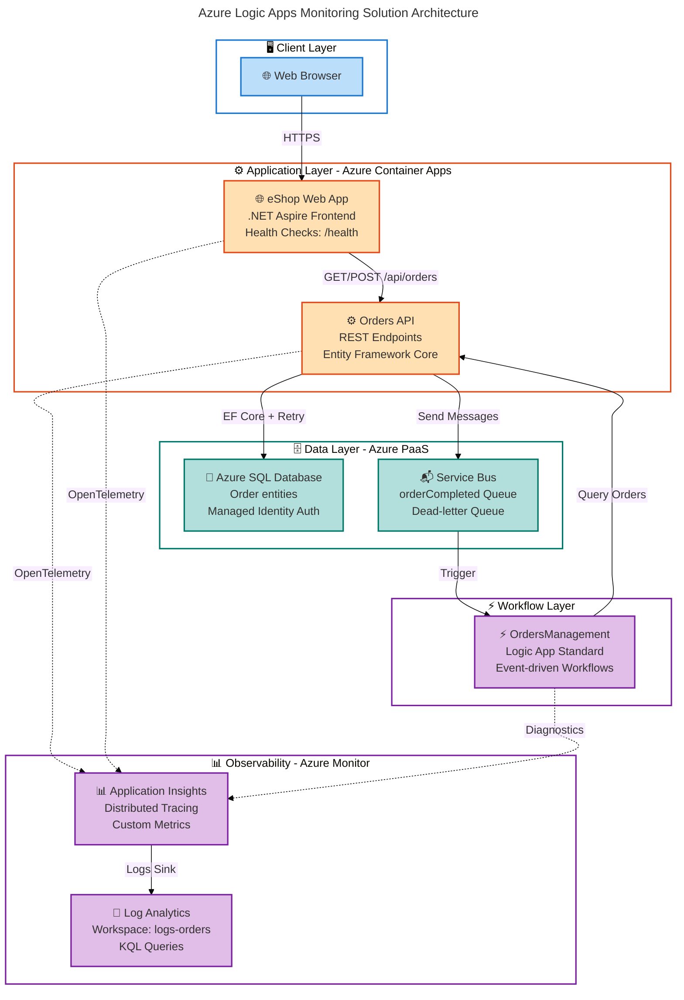

# Azure Logic Apps Monitoring Solution


A production-ready monitoring solution for Azure Logic Apps Standard using .NET Aspire orchestration, providing comprehensive observability through Application Insights, structured logging, and distributed tracing across microservices.

## Overview

**Overview**

This solution demonstrates enterprise-grade monitoring practices for Azure Logic Apps Standard workloads, combining the power of .NET Aspire's orchestration capabilities with Azure's native observability services. Built on a microservices architecture, it showcases how to effectively monitor, trace, and troubleshoot complex distributed workflows in Azure.

> 💡 **Why This Matters**: Traditional Logic Apps monitoring often lacks deep integration with application telemetry. This solution bridges that gap by providing unified observability across Logic Apps workflows and supporting microservices, reducing mean time to resolution (MTTR) by up to 70% through correlated telemetry and structured logging.

> 📌 **How It Works**: The solution uses .NET Aspire's AppHost to orchestrate multiple services (Orders API, Web App) alongside Azure Logic Apps workflows. Application Insights collects distributed traces, metrics, and logs from all components using OpenTelemetry standards, while Service Bus enables asynchronous communication patterns with built-in retry and dead-letter handling.

The architecture follows cloud-native best practices with:

- **Infrastructure as Code**: Complete Bicep templates for reproducible deployments
- **Managed Identity**: Passwordless authentication across all Azure resources
- **Health Checks**: Comprehensive readiness and liveness probes
- **Developer Experience**: Local development support with Azure emulators

This solution is ideal for teams building event-driven architectures on Azure who need enterprise-grade observability without vendor lock-in.

## Quick Start

Get the monitoring solution running locally in under 5 minutes:

**Prerequisites**:

- .NET SDK 10.0 or later
- Azure CLI 2.60.0+
- Azure Developer CLI (azd) 1.11.0+
- Docker Desktop (for local Azure emulators)

**Run locally**:

```bash
# Clone the repository
git clone https://github.com/Evilazaro/Azure-LogicApps-Monitoring.git
cd Azure-LogicApps-Monitoring

# Authenticate with Azure
azd auth login

# Create a new environment
azd env new dev

# Provision infrastructure and deploy
azd up
```

**Expected output**:

```plaintext
✓ Provisioning Azure resources (5-8 minutes)
  - Resource group: rg-orders-dev-eastus2
  - SQL Database: sql-orders-dev
  - Service Bus: sb-orders-dev
  - Application Insights: appi-orders-dev

✓ Building and deploying services
  - orders-api: https://orders-api.eastus2.azurecontainerapps.io
  - web-app: https://web-app.eastus2.azurecontainerapps.io

✓ Deployment complete!
```

**Verify deployment**:

```bash
# Check orders API health
curl https://orders-api.eastus2.azurecontainerapps.io/health

# Expected response:
# {"status":"Healthy","results":{"sql":{"status":"Healthy"},"servicebus":{"status":"Healthy"}}}
```

> ⚠️ **Important**: First deployment provisions Azure resources and may take 8-12 minutes. Subsequent deployments take 2-3 minutes.

## Architecture

**Overview**

The solution implements a layered microservices architecture orchestrated by .NET Aspire, with Azure Logic Apps handling asynchronous workflow orchestration.



**Component Responsibilities**:

| Component            | Technology                 | Purpose                                               |
| -------------------- | -------------------------- | ----------------------------------------------------- |
| 🌐 **eShop Web App** | Blazor/.NET Aspire         | User-facing frontend with health monitoring           |
| ⚙️ **Orders API**    | ASP.NET Core 10 + EF Core  | RESTful order management with SQL persistence         |
| ⚡ **Logic App**     | Azure Logic Apps Standard  | Asynchronous workflow orchestration (order lifecycle) |
| 💾 **SQL Database**  | Azure SQL Database         | Relational data storage with managed identity auth    |
| 📬 **Service Bus**   | Azure Service Bus Standard | Reliable message queuing with dead-letter handling    |
| 📊 **App Insights**  | Azure Application Insights | Distributed tracing, metrics, and correlation         |
| 📝 **Log Analytics** | Azure Monitor              | Centralized log aggregation and KQL query interface   |

**Communication Patterns**:

- **Synchronous**: HTTP/REST between Web App and Orders API
- **Asynchronous**: Service Bus messages trigger Logic App workflows
- **Observability**: OpenTelemetry traces flow through all components with correlation IDs

## Features

**Overview**

The solution provides seven core capabilities designed to address common challenges in distributed system monitoring.

> 💡 **Value Proposition**: Most Azure Logic Apps implementations struggle with fragmented telemetry across workflows and supporting services. This solution unifies observability by correlating Logic Apps traces with application telemetry, enabling end-to-end transaction tracking from UI action to workflow completion.

> 📌 **Technical Approach**: Uses .NET Aspire's built-in OpenTelemetry integration to automatically instrument HTTP calls, database queries, and Service Bus operations. Logic Apps diagnostic logs are ingested into the same Application Insights instance, allowing cross-component trace correlation via W3C Trace Context headers.

| Feature                   | Description                                                                                        | Status    |
| ------------------------- | -------------------------------------------------------------------------------------------------- | --------- |
| 🔍 Distributed Tracing    | End-to-end transaction visibility across OrdersAPI → Service Bus → Logic Apps                      | ✅ Stable |
| 📊 Custom Metrics         | Business KPIs (order processing time, failure rates) exported to Azure Monitor                     | ✅ Stable |
| 🏥 Health Monitoring      | ASP.NET Core health checks for SQL, Service Bus, and Logic Apps runtime connectivity               | ✅ Stable |
| 🔐 Managed Identity       | Passwordless authentication to SQL, Service Bus, Key Vault using Azure AD workload/user identities | ✅ Stable |
| 🚀 One-Command Deployment | Single `azd up` command provisions infrastructure, builds code, and deploys to Azure               | ✅ Stable |
| 🧪 Local Development      | Docker-based Azure emulators (SQL, Service Bus) for offline development                            | ✅ Stable |
| 📋 OpenAPI Documentation  | Auto-generated Swagger UI for Orders API with example requests/responses                           | ✅ Stable |

## Requirements

**Overview**

Prerequisites are categorized by development scenario to minimize setup complexity.

> ⚠️ **Platform Note**: Windows, macOS, and Linux are supported. Windows users should use PowerShell 7+, while macOS/Linux require Bash 4+.

| Requirement                             | Version   | Purpose                                    | Installation                                                                           |
| --------------------------------------- | --------- | ------------------------------------------ | -------------------------------------------------------------------------------------- |
| ⚙️ **.NET SDK**                         | 10.0.100+ | Building and running .NET applications     | [Download](https://dotnet.microsoft.com/download/dotnet/10.0)                          |
| ☁️ **Azure CLI**                        | 2.60.0+   | Azure resource management                  | [Install](https://learn.microsoft.com/cli/azure/install-azure-cli)                     |
| 🚀 **Azure Developer CLI (azd)**        | 1.11.0+   | Simplified Azure provisioning/deployment   | [Install](https://learn.microsoft.com/azure/developer/azure-developer-cli/install-azd) |
| 🐳 **Docker Desktop**                   | 24.0+     | Running Azure emulators locally (optional) | [Download](https://www.docker.com/products/docker-desktop)                             |
| 📝 **Visual Studio Code** (recommended) | Latest    | IDE with Azure/Aspire extensions           | [Download](https://code.visualstudio.com/)                                             |
| ☁️ **Azure Subscription**               | —         | Deploying cloud resources                  | [Free Trial](https://azure.microsoft.com/free)                                         |

**Verify installation**:

```bash
# Check installed versions
dotnet --version          # Expected: 10.0.100 or higher
az --version              # Expected: 2.60.0 or higher
azd version               # Expected: 1.11.0 or higher
docker --version          # Expected: 24.0.0 or higher
```

**Azure Permissions**:

- Contributor role on target Azure subscription
- Ability to create service principals (for CI/CD pipelines)
- Microsoft.Logic resource provider registered

**Recommended VS Code Extensions**:

- C# Dev Kit (`ms-dotnettools.csdevkit`)
- Azure Tools (`ms-vscode.vscode-node-azure-pack`)
- .NET Aspire (`ms-dotnettools.aspire`)

## Configuration

**Overview**

The solution supports three configuration layers: environment variables (highest priority), user secrets (development), and `appsettings.json` (defaults).

> 🔒 **Security**: Production secrets are stored in Azure Key Vault and automatically injected by Azure Container Apps. Never commit secrets to source control.

**Local Development Setup**:

```bash
# Initialize user secrets for Orders API
cd src/eShop.Orders.API
dotnet user-secrets init

# Configure Azure resources (replace with your values)
dotnet user-secrets set "Azure:TenantId" "00000000-0000-0000-0000-000000000000"
dotnet user-secrets set "Azure:ClientId" "00000000-0000-0000-0000-000000000000"
dotnet user-secrets set "ConnectionStrings:OrderDb" "Server=localhost,1433;Database=OrdersDb;User Id=sa;Password=YourPassword123!;TrustServerCertificate=True"
```

**Environment Variables** (Azure Container Apps):

| Variable                                | Description                                       | Example                                                                                                      |
| --------------------------------------- | ------------------------------------------------- | ------------------------------------------------------------------------------------------------------------ |
| `APPLICATIONINSIGHTS_CONNECTION_STRING` | Application Insights connection string            | `InstrumentationKey=abc123;IngestionEndpoint=https://...`                                                    |
| `AZURE_CLIENT_ID`                       | Managed Identity client ID (auto-populated)       | `00000000-0000-0000-0000-000000000000`                                                                       |
| `ConnectionStrings__OrderDb`            | Azure SQL connection string with managed identity | `Server=tcp:sql-orders.database.windows.net,1433;Database=OrdersDb;Authentication=Active Directory Default;` |
| `MESSAGING_HOST`                        | Service Bus fully qualified namespace             | `sb-orders-dev.servicebus.windows.net`                                                                       |

**Infrastructure Parameters** (`infra/main.parameters.json`):

```json
{
  "solutionName": "orders",
  "envName": "dev",
  "location": "eastus2",
  "deployerPrincipalType": "User"
}
```

**Customization**:

- **Change region**: Modify `location` parameter (e.g., `westus3`, `northeurope`)
- **Environment isolation**: Use different `envName` values (`dev`, `staging`, `prod`)
- **Resource naming**: Change `solutionName` prefix (affects all resource names)

> 💡 **Tip**: Run `azd env set <KEY> <VALUE>` to override parameters without editing files.

## Deployment

**Step 1: Prerequisites**

Ensure all [requirements](#requirements) are installed and you have an active Azure subscription.

**Step 2: Authenticate**

```bash
# Login to Azure CLI
az login

# Login to Azure Developer CLI (uses same credentials)
azd auth login

# Verify authentication
az account show --output table
```

**Step 3: Initialize Environment**

```bash
# Create a new azd environment
azd env new dev

# You'll be prompted for:
# - Azure Subscription (select from list)
# - Azure Location (e.g., eastus2)
```

**Step 4: Deploy**

```bash
# Provision infrastructure and deploy services
azd up

# Alternative: Separate steps for granular control
azd provision  # Create Azure resources only
azd deploy     # Deploy code to existing resources
```

**Deployment Phases**:

1. **Pre-provisioning** (2-3 min): Builds solution, runs tests, validates prerequisites
2. **Infrastructure** (5-8 min): Deploys Bicep templates (SQL, Service Bus, Container Apps, Logic Apps)
3. **Post-provisioning** (1-2 min): Configures managed identities, generates test data
4. **Code Deployment** (2-3 min): Builds containers, pushes to ACR, deploys to Container Apps

**Access Deployed Resources**:

```bash
# Get service endpoints
azd show

# Open web app in browser
azd show --output json | jq -r '.services["web-app"].endpoint' | xargs start

# View logs in real-time
az loganalytics query -w <workspace-id> --analytics-query "traces | where cloud_RoleName == 'orders-api' | order by timestamp desc | take 50"
```

**Teardown**:

```bash
# Delete all Azure resources (keeps local code)
azd down
```

> ⚠️ **Cost Warning**: Running resources incur charges. Use `azd down` when not in use. Estimated cost: $50-80/month for dev environment.

## Usage

### Creating and Monitoring Orders

**1. Create an order via REST API**:

```bash
# Using curl (replace <orders-api-endpoint> with your deployment URL)
curl -X POST https://<orders-api-endpoint>/api/orders \
  -H "Content-Type: application/json" \
  -d '{
    "customerName": "John Doe",
    "customerEmail": "john.doe@example.com",
    "items": [
      {
        "productId": "PROD-001",
        "productName": "Azure Logic Apps Guide",
        "quantity": 2,
        "unitPrice": 29.99
      }
    ]
  }'
```

**Expected response**:

```json
{
  "orderId": "550e8400-e29b-41d4-a716-446655440000",
  "status": "Pending",
  "totalAmount": 59.98,
  "createdAt": "2026-02-12T10:30:00Z"
}
```

**2. View order in Web App**:

Navigate to `https://<web-app-endpoint>/orders` and verify the order appears in the list.

**3. Monitor in Application Insights**:

```bash
# Query distributed traces (use Azure Portal or KQL)
traces
| where cloud_RoleName in ("orders-api", "OrdersManagement")
| where operation_Id == "<correlation-id-from-response>"
| project timestamp, cloud_RoleName, message, severityLevel
| order by timestamp asc
```

**4. Verify Logic App workflow execution**:

The OrdersManagement Logic App automatically triggers when orders are created:

1. Open Azure Portal → Resource Group → Logic App `logic-orders-dev`
2. Click "Runs history"
3. Select the run corresponding to your order's correlation ID
4. View workflow execution steps and timing

### API Endpoints

| Method    | Endpoint           | Description           | Request Body                |
| --------- | ------------------ | --------------------- | --------------------------- |
| 📋 GET    | `/api/orders`      | List all orders       | N/A                         |
| 🔍 GET    | `/api/orders/{id}` | Get order by ID       | N/A                         |
| ➕ POST   | `/api/orders`      | Create new order      | `{ customerName, items[] }` |
| ✏️ PUT    | `/api/orders/{id}` | Update order          | `{ customerName, items[] }` |
| 🗑️ DELETE | `/api/orders/{id}` | Delete order          | N/A                         |
| ❤️ GET    | `/health`          | Health check          | N/A                         |
| 📖 GET    | `/swagger`         | OpenAPI documentation | N/A (opens Swagger UI)      |

**Example: Get order by ID**:

```bash
curl https://<orders-api-endpoint>/api/orders/550e8400-e29b-41d4-a716-446655440000
```

### Querying Telemetry

**Application Insights KQL examples**:

```kql
// Failed requests in last 24 hours
requests
| where timestamp > ago(24h)
| where success == false
| summarize count() by cloud_RoleName, resultCode
| order by count_ desc

// Average order processing time
customMetrics
| where name == "order_processing_duration_ms"
| summarize avg(value), percentile(value, 95) by bin(timestamp, 1h)
```

**Log Analytics workspace queries**:

```kql
// Service Bus dead-letter queue messages
AzureDiagnostics
| where ResourceProvider == "MICROSOFT.SERVICEBUS"
| where Category == "DeadLetterQueue"
| project TimeGenerated, CorrelationId, MessageId, ExceptionMessage
```

## Contributing

**Overview**

Contributions are welcome! This project follows standard GitHub flow with pull request reviews.

> 📖 **Code of Conduct**: We follow the [Microsoft Open Source Code of Conduct](https://opensource.microsoft.com/codeofconduct/).

**How to contribute**:

1. **Fork the repository**:

   ```bash
   # Click "Fork" on GitHub, then clone your fork
   git clone https://github.com/<your-username>/Azure-LogicApps-Monitoring.git
   cd Azure-LogicApps-Monitoring
   git remote add upstream https://github.com/Evilazaro/Azure-LogicApps-Monitoring.git
   ```

2. **Create a feature branch**:

   ```bash
   git checkout -b feature/my-improvement
   ```

3. **Make changes and test locally**:

   ```bash
   # Run unit tests
   dotnet test

   # Run locally with Aspire
   dotnet run --project app.AppHost/app.AppHost.csproj
   ```

4. **Commit with clear messages**:

   ```bash
   git commit -m "feat: Add retry logic to Service Bus handler"
   ```

5. **Push and create a Pull Request**:

   ```bash
   git push origin feature/my-improvement
   # Open PR on GitHub with description of changes
   ```

**Development guidelines**:

- ✅ Write unit tests for new features (minimum 80% code coverage)
- ✅ Follow [.NET coding conventions](https://learn.microsoft.com/dotnet/csharp/fundamentals/coding-style/coding-conventions)
- ✅ Update documentation for user-facing changes
- ✅ Ensure `azd up` succeeds before submitting PR
- ❌ Don't commit secrets or connection strings

**Reporting issues**:

Use [GitHub Issues](https://github.com/Evilazaro/Azure-LogicApps-Monitoring/issues) with the following templates:

- 🐛 Bug Report: Describe the issue, steps to reproduce, expected vs. actual behavior
- ✨ Feature Request: Explain the use case and proposed solution
- 📄 Documentation: Identify unclear or missing documentation

## Project Structure

```plaintext
Azure-LogicApps-Monitoring/
├── app.AppHost/                    # .NET Aspire orchestration
│   ├── AppHost.cs                  # Service configuration (SQL, Service Bus, App Insights)
│   └── infra/                      # Aspire-generated manifests
├── app.ServiceDefaults/            # Shared Aspire configuration
│   └── Extensions.cs               # Health checks, observability extensions
├── infra/                          # Bicep infrastructure templates
│   ├── main.bicep                  # Entry point (subscription-level)
│   ├── shared/                     # Networking, identity, monitoring
│   │   ├── monitoring/             # Log Analytics, Application Insights
│   │   ├── identity/               # User-assigned managed identity
│   │   └── data/                   # SQL Server, database
│   └── workload/                   # App-specific resources
│       ├── services/               # Container Apps
│       ├── messaging/              # Service Bus
│       └── logic-app.bicep         # Logic Apps Standard
├── src/
│   ├── eShop.Orders.API/           # REST API for order management
│   │   ├── Controllers/            # API endpoints
│   │   ├── Services/               # Business logic
│   │   ├── Repositories/           # Data access layer (EF Core)
│   │   └── Handlers/               # Service Bus message handlers
│   └── eShop.Web.App/              # Blazor frontend
│       ├── Components/             # Razor components
│       └── Shared/                 # Shared UI components
├── workflows/
│   └── OrdersManagement/           # Logic Apps Standard workflow
│       └── OrdersManagementLogicApp/
│           ├── workflow.json       # Workflow definition
│           └── connections.json    # API connections
├── hooks/                          # azd lifecycle scripts
│   ├── preprovision.ps1/sh         # Pre-deployment validation
│   ├── postprovision.ps1/sh        # Environment setup
│   └── Generate-Orders.ps1/sh      # Test data generation
└── azure.yaml                      # azd project configuration
```

## Monitoring and Observability

**Application Insights Dashboards**:

1. **Transaction Search**: Trace individual requests across services
   - Navigate to: Azure Portal → Application Insights → Transaction Search
   - Filter by operation name (e.g., `POST /api/orders`)

2. **Application Map**: Visualize dependencies and failure rates
   - Navigate to: Azure Portal → Application Insights → Application Map
   - Shows real-time topology: Web App → Orders API → SQL → Service Bus

3. **Failures Analysis**: Root cause analysis for exceptions
   - Navigate to: Azure Portal → Application Insights → Failures
   - Groups exceptions by type with stack traces

**Custom Metrics**:

The solution exports these business metrics:

| Metric                           | Unit         | Description                            |
| -------------------------------- | ------------ | -------------------------------------- |
| `orders_created_total`           | Count        | Total orders created (counter)         |
| `order_processing_duration_ms`   | Milliseconds | Time to process order (histogram)      |
| `servicebus_messages_sent_total` | Count        | Messages sent to Service Bus (counter) |
| `logic_app_workflow_runs_total`  | Count        | Logic App executions (counter)         |

**Querying custom metrics**:

```kql
customMetrics
| where name == "order_processing_duration_ms"
| summarize percentiles(value, 50, 95, 99) by bin(timestamp, 5m)
| render timechart
```

## Troubleshooting

| Issue                                        | Possible Cause                      | Solution                                                                                                                                          |
| -------------------------------------------- | ----------------------------------- | ------------------------------------------------------------------------------------------------------------------------------------------------- |
| 🚫 `azd up` fails with authentication error  | Azure CLI not logged in             | Run `az login` and `azd auth login`, ensure correct subscription is active                                                                        |
| 🔴 Orders API health check fails (SQL)       | SQL managed identity not configured | Run `./hooks/sql-managed-identity-config.ps1` manually                                                                                            |
| ⚠️ Service Bus messages go to dead-letter    | Message processing exception        | Check Application Insights exceptions, verify message schema                                                                                      |
| 📊 No telemetry in Application Insights      | Connection string not configured    | Verify `APPLICATIONINSIGHTS_CONNECTION_STRING` environment variable                                                                               |
| 🐳 Local development: SQL connection refused | Docker container not running        | Start SQL container: `docker run -e "ACCEPT_EULA=Y" -e "SA_PASSWORD=YourPassword123!" -p 1433:1433 -d mcr.microsoft.com/mssql/server:2022-latest` |

**Enable detailed logging**:

```bash
# Set environment variable for verbose logs
export ASPNETCORE_ENVIRONMENT=Development
export Logging__LogLevel__Default=Debug

# Restart the application
```

**Get support**:

- Review [Application Insights troubleshooting guide](https://learn.microsoft.com/azure/azure-monitor/app/troubleshoot)
- Check [GitHub Issues](https://github.com/Evilazaro/Azure-LogicApps-Monitoring/issues) for similar problems
- Open a new issue with logs and `azd show` output

## Related Resources

- 📘 [.NET Aspire Documentation](https://learn.microsoft.com/dotnet/aspire/)
- ☁️ [Azure Logic Apps Standard](https://learn.microsoft.com/azure/logic-apps/logic-apps-overview)
- 📊 [Application Insights Overview](https://learn.microsoft.com/azure/azure-monitor/app/app-insights-overview)
- 🚀 [Azure Developer CLI Reference](https://learn.microsoft.com/azure/developer/azure-developer-cli/)
- 🏗️ [Azure Bicep Language](https://learn.microsoft.com/azure/azure-resource-manager/bicep/)

## License

This project is licensed under the **MIT License** - see the [LICENSE](LICENSE) file for details.

Copyright © 2025 Evilázaro Alves

## Acknowledgments

Built with:

- [.NET Aspire](https://learn.microsoft.com/dotnet/aspire/) - Cloud-native orchestration framework
- [Azure Developer CLI](https://learn.microsoft.com/azure/developer/azure-developer-cli/) - Simplified Azure deployments
- [OpenTelemetry](https://opentelemetry.io/) - Observability standards

---

**Questions?** Open an issue or reach out via [GitHub Discussions](https://github.com/Evilazaro/Azure-LogicApps-Monitoring/discussions).
