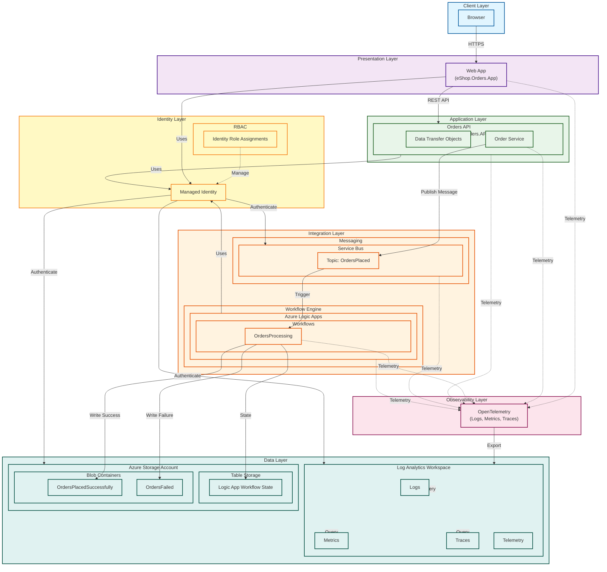

# Azure Logic Apps Monitoring Sample

[](https://opensource.org/licenses/MIT)
[](https://dotnet.microsoft.com/)
[](https://azure.microsoft.com/services/logic-apps/)
[](https://learn.microsoft.com/dotnet/aspire/)

A comprehensive sample application demonstrating enterprise-grade monitoring and observability best practices for Azure Logic Apps. This project showcases how to build a production-ready order processing system with distributed tracing, metrics collection, and comprehensive logging using .NET Aspire, Azure Logic Apps, and Azure Monitor.

## Overview

This repository provides a reference implementation for monitoring Azure Logic Apps workflows in an enterprise environment. It demonstrates a complete order processing pipeline where orders placed through a web application are processed asynchronously using Azure Logic Apps, with full observability across all components. The application leverages .NET Aspire for local development orchestration and implements OpenTelemetry standards for distributed tracing, making it easy to track requests across multiple services and identify performance bottlenecks.

Key features include:
- **End-to-end distributed tracing** across web applications, APIs, Service Bus, and Logic Apps
- **Structured logging** with Azure Monitor and Application Insights integration
- **Real-time metrics** collection for monitoring workflow execution and system health
- **Azure-native integration** using Managed Identity and RBAC for secure, credential-free authentication
- **.NET Aspire orchestration** for streamlined local development and deployment
- **Production-ready infrastructure** defined with Bicep for repeatable deployments

## Table of Contents

- Project Structure
- Architecture
- Prerequisites
- Setup Instructions
- Deployment Guide
- Monitoring & Observability
- References & Documentation
- Contributing
- Code of Conduct
- License

## Project Structure

```
.
├── .gitignore
├── app.sln                          # Solution file
├── azure.yaml                       # Azure Developer CLI configuration
├── README.md
├── LICENSE.md
├── CODE_OF_CONDUCT.md
├── CONTRIBUTING.md
├── SECURITY.md
│
├── app.AppHost/                     # .NET Aspire AppHost project
│   ├── app.AppHost.csproj
│   ├── AppHost.cs                   # Aspire orchestration configuration
│   ├── appsettings.json
│   ├── appsettings.Development.json
│   └── Properties/
│
├── app.ServiceDefaults/             # Shared service configuration
│   ├── app.ServiceDefaults.csproj
│   ├── CommonTypes.cs               # Shared types and models
│   ├── Extensions.cs                # Service defaults extensions
│   └── bin/
│
├── src/
│   ├── eShop.Orders.API/           # Orders REST API
│   │   ├── Controllers/
│   │   ├── Services/
│   │   ├── DTOs/
│   │   └── Program.cs
│   │
│   ├── eShop.Orders.App/           # Blazor Web Application
│   │   ├── Components/
│   │   ├── Services/
│   │   └── Program.cs
│   │
│   └── eShop.Orders.App.Client/    # Blazor Client Components
│       ├── Pages/
│       └── Components/
│
├── LogicAppWP/                      # Logic App Workspace Project
│   ├── ConsosoOrders/              # Order Processing Workflow
│   │   ├── workflow.json           # Workflow definition
│   │   └── connections.json        # Workflow connections
│   ├── host.json
│   └── local.settings.json
│
├── infra/                           # Infrastructure as Code (Bicep)
│   ├── main.bicep                  # Main infrastructure template
│   ├── main.parameters.json        # Parameters file
│   ├── types.bicep                 # Custom type definitions
│   │
│   ├── monitoring/                 # Monitoring resources
│   │   ├── loganalytics.bicep     # Log Analytics Workspace
│   │   └── appinsights.bicep      # Application Insights
│   │
│   └── workload/                   # Application resources
│       ├── logicapp.bicep         # Logic App deployment
│       ├── servicebus.bicep       # Service Bus namespace and topics
│       ├── storage.bicep          # Storage account for orders
│       └── managedidentity.bicep  # Managed Identity and RBAC
│
└── hooks/                          # Deployment hooks and utilities
    ├── preprovision.ps1           # Pre-deployment script
    ├── postprovision.ps1          # Post-deployment script
    ├── generate_orders.ps1        # Sample order generation
    └── orders.json                # Sample order data
```

## Architecture

The application follows a layered architecture with clear separation of concerns and comprehensive observability throughout the system.



### Architecture Flow

1. **Client Layer**: Users interact with the application through a web browser
2. **Presentation Layer**: Blazor web application provides the user interface for placing orders
3. **Application Layer**: Orders API processes requests, validates data, and publishes messages
4. **Integration Layer**: Service Bus queues messages and triggers Logic App workflows for async processing
5. **Observability Layer**: OpenTelemetry collects distributed traces, metrics, and logs from all components
6. **Data Layer**: Processed orders are stored in Azure Storage; telemetry data flows to Log Analytics
7. **Identity Layer**: Managed Identity provides secure, credential-free authentication with RBAC-based authorization

## Prerequisites

Before getting started, ensure you have the following installed:

### Required Tools
- **[.NET 8.0 SDK](https://dotnet.microsoft.com/download/dotnet/8.0)** or later
- **[Visual Studio 2022](https://visualstudio.microsoft.com/)** (17.9+) or **[Visual Studio Code](https://code.visualstudio.com/)**
  - For VS Code: Install the **C# Dev Kit** extension
- **[Azure Developer CLI (azd)](https://learn.microsoft.com/azure/developer/azure-developer-cli/install-azd)** - For deployment automation
- **[Azure CLI](https://learn.microsoft.com/cli/azure/install-azure-cli)** - For Azure resource management
- **[Docker Desktop](https://www.docker.com/products/docker-desktop/)** - For running .NET Aspire components locally
- **[PowerShell 7+](https://github.com/PowerShell/PowerShell)** - For running deployment hooks

### Azure Subscription Requirements
- An active **Azure subscription** with permissions to create resources
- Ability to create the following Azure resources:
  - Azure Logic Apps (Standard)
  - Azure Service Bus
  - Azure Storage Account
  - Azure Monitor (Log Analytics Workspace & Application Insights)
  - Managed Identity with RBAC assignments

### Recommended Extensions
For **Visual Studio Code**:
- [C# Dev Kit](https://marketplace.visualstudio.com/items?itemName=ms-dotnettools.csdevkit)
- [Azure Logic Apps (Standard)](https://marketplace.visualstudio.com/items?itemName=ms-azuretools.vscode-azurelogicapps)
- [Azure Account](https://marketplace.visualstudio.com/items?itemName=ms-vscode.azure-account)
- [Bicep](https://marketplace.visualstudio.com/items?itemName=ms-azuretools.vscode-bicep)

For **Visual Studio 2022**:
- [Azure Logic Apps Tools](https://marketplace.visualstudio.com/items?itemName=VinaySinghMSFT.AzureLogicAppsToolsForVS2022)

## Setup Instructions

### 1. Clone the Repository

```bash
git clone https://github.com/Evilazaro/Azure-LogicApps-Monitoring.git
cd Azure-LogicApps-Monitoring
```

### 2. Configure Local Development Environment

#### Install .NET Aspire Workload

```bash
dotnet workload update
dotnet workload install aspire
```

#### Verify Docker is Running

Ensure Docker Desktop is running, as .NET Aspire requires it for local container orchestration.

```bash
docker --version
```

### 3. Configure Azure Connection

Sign in to Azure:

```bash
az login
azd auth login
```

Set your default subscription (if you have multiple):

```bash
az account set --subscription <subscription-id>
```

### 4. Restore Dependencies

```bash
dotnet restore
```

### 5. Run Locally with .NET Aspire

Start the Aspire AppHost, which will orchestrate all services:

```bash
cd app.AppHost
dotnet run
```

This will:
- Launch the .NET Aspire Dashboard (typically at `http://localhost:15888`)
- Start the Orders API
- Start the Blazor Web Application
- Configure local Service Bus emulator (if available) or prompt for Azure connection

Access the applications:
- **Aspire Dashboard**: `http://localhost:15888` (view logs, traces, and metrics)
- **Orders Web App**: Check the Aspire Dashboard for the dynamically assigned port

## Deployment Guide

### Deploy to Azure using Azure Developer CLI

The easiest way to deploy this solution to Azure is using the Azure Developer CLI (azd).

#### 1. Initialize the Environment

```bash
azd init
```

When prompted:
- Enter an environment name (e.g., `dev`, `staging`, `prod`)
- Select your Azure subscription
- Choose an Azure region (e.g., `eastus`, `westeurope`)

#### 2. Provision and Deploy

```bash
azd up
```

This command will:
1. Run the `preprovision.ps1` hook to validate prerequisites
2. Provision all Azure resources defined in main.bicep
3. Deploy the Logic App workflows from `LogicAppWP`
4. Deploy the web application and API
5. Run the `postprovision.ps1` hook to configure connections
6. Display the deployed application URLs

#### 3. Verify Deployment

After deployment completes, azd will output the application URLs:

```
Service Bus Namespace: <namespace>.servicebus.windows.net
Logic App: <logicapp-name>.azurewebsites.net
Web Application: <webapp-name>.azurewebsites.net
Log Analytics Workspace: <workspace-id>
```

### Manual Deployment (Alternative)

If you prefer manual deployment:

#### 1. Deploy Infrastructure

```bash
cd infra
az deployment sub create \
  --location eastus \
  --template-file main.bicep \
  --parameters main.parameters.json
```

#### 2. Deploy Logic App

```bash
cd ../LogicAppWP
func azure functionapp publish <logic-app-name>
```

#### 3. Deploy Applications

Deploy the web app and API using your preferred method (Azure App Service, Container Apps, etc.)

### Environment Variables

The following environment variables are automatically configured during deployment:

- `AZURE_SERVICE_BUS_NAMESPACE`: Service Bus namespace connection
- `AZURE_STORAGE_ACCOUNT_NAME`: Storage account for orders
- `APPLICATIONINSIGHTS_CONNECTION_STRING`: Application Insights connection
- `AZURE_LOG_ANALYTICS_WORKSPACE_ID`: Log Analytics workspace ID

## Monitoring & Observability

This solution implements comprehensive monitoring following the [Azure Well-Architected Framework operational excellence pillars](https://learn.microsoft.com/azure/well-architected/operational-excellence/monitoring).

### .NET Aspire Dashboard (Local Development)

When running locally, the .NET Aspire Dashboard provides real-time observability:

1. **Access the Dashboard**: Navigate to `http://localhost:15888`
2. **View Traces**: See distributed traces across all services
3. **Monitor Logs**: Real-time structured logs with filtering
4. **Check Metrics**: Service health, request rates, and custom metrics
5. **Inspect Resources**: View Service Bus messages, container status

### Azure Monitor (Production)

#### Application Insights

All telemetry is automatically sent to Application Insights using OpenTelemetry:

```bash
# View in Azure Portal
az monitor app-insights component show \
  --app <app-insights-name> \
  --resource-group <resource-group>
```

**Key Features**:
- **Application Map**: Visualize dependencies between components
- **Live Metrics**: Real-time performance monitoring
- **Transaction Search**: Find specific requests and traces
- **Failures Analysis**: Identify and diagnose exceptions

#### Log Analytics Queries

Query telemetry data using KQL (Kusto Query Language):

```kusto
// View Logic App workflow executions
AzureDiagnostics
| where ResourceType == "WORKFLOWS"
| where TimeGenerated > ago(1h)
| project TimeGenerated, status_s, workflowName_s, runId_s
| order by TimeGenerated desc

// Monitor order processing success rate
traces
| where message contains "OrderProcessed"
| summarize SuccessCount=count() by bin(timestamp, 5m)
| render timechart
```

#### Monitoring Logic Apps

Enable diagnostics for detailed workflow insights:

1. Navigate to your Logic App in the Azure Portal
2. Go to **Diagnostic settings** → **Add diagnostic setting**
3. Select:
   - ✅ Workflow runtime diagnostic events
   - ✅ Workflow execution logs
4. Send to **Log Analytics workspace**

**References**:
- [Monitor Logic Apps](https://learn.microsoft.com/azure/logic-apps/monitor-logic-apps)
- [Azure Monitor .NET SDK](https://learn.microsoft.com/dotnet/api/overview/azure/monitor?view=azure-dotnet)
- [OpenTelemetry in Azure Monitor](https://learn.microsoft.com/azure/azure-monitor/app/opentelemetry-data-collection)

### Custom Metrics and Alerts

Configure alerts for critical scenarios:

```bash
# Create an alert for failed Logic App runs
az monitor metrics alert create \
  --name "LogicApp-HighFailureRate" \
  --resource-group <resource-group> \
  --scopes <logic-app-resource-id> \
  --condition "avg RunsFailed > 5" \
  --window-size 5m \
  --evaluation-frequency 1m
```

### Diagnostic Logging Best Practices

The application follows these logging guidelines:

- **Structured Logging**: All logs use structured format for easy querying
- **Correlation IDs**: Track requests across services using `traceparent` headers
- **Log Levels**: Appropriate levels (Information, Warning, Error) for filtering
- **Sensitive Data**: PII and sensitive data are never logged

## References & Documentation

### Azure Services
- [Azure Logic Apps Documentation](https://learn.microsoft.com/azure/logic-apps/)
- [Azure Service Bus Documentation](https://learn.microsoft.com/azure/service-bus-messaging/)
- [Azure Monitor Documentation](https://learn.microsoft.com/azure/azure-monitor/)
- [Managed Identity Overview](https://learn.microsoft.com/azure/active-directory/managed-identities-azure-resources/overview)

### .NET and Aspire
- [.NET Aspire Overview](https://learn.microsoft.com/dotnet/aspire/get-started/aspire-overview)
- [.NET Aspire Dashboard](https://learn.microsoft.com/dotnet/aspire/fundamentals/dashboard)
- [OpenTelemetry in .NET](https://learn.microsoft.com/dotnet/core/diagnostics/observability-with-otel)

### Monitoring & Observability
- [Azure Monitor Best Practices](https://learn.microsoft.com/azure/azure-monitor/best-practices)
- [Application Insights for .NET](https://learn.microsoft.com/azure/azure-monitor/app/asp-net-core)
- [OpenTelemetry Data Collection in Azure Monitor](https://learn.microsoft.com/azure/azure-monitor/app/opentelemetry-data-collection)
- [Azure Well-Architected Framework - Operational Excellence](https://learn.microsoft.com/azure/well-architected/operational-excellence/)

### Azure Developer CLI
- [Azure Developer CLI Documentation](https://learn.microsoft.com/azure/developer/azure-developer-cli/)
- [azd Reference](https://learn.microsoft.com/azure/developer/azure-developer-cli/reference)

## Contributing

We welcome contributions! Please see our Contributing Guide for details on:

- How to submit issues and feature requests
- Code contribution guidelines
- Development workflow
- Coding standards and best practices
- Pull request process

Before contributing, please review:
- Code of Conduct
- Security Policy

### Quick Contribution Steps

1. Fork the repository
2. Create a feature branch: `git checkout -b feature/your-feature-name`
3. Make your changes and commit: `git commit -m 'Add some feature'`
4. Push to your fork: `git push origin feature/your-feature-name`
5. Submit a Pull Request

## Code of Conduct

This project has adopted the [Microsoft Open Source Code of Conduct](https://opensource.microsoft.com/codeofconduct/). For more information, see the [Code of Conduct FAQ](https://opensource.microsoft.com/codeofconduct/faq/) or contact [opencode@microsoft.com](mailto:opencode@microsoft.com) with any additional questions or comments.

## License

This project is licensed under the MIT License - see the LICENSE.md file for details.

---

**Questions or Issues?**

- 📖 Review the documentation
- 🐛 [Open an issue](https://github.com/Evilazaro/Azure-LogicApps-Monitoring/issues)
- 💬 Start a [discussion](https://github.com/Evilazaro/Azure-LogicApps-Monitoring/discussions)

**Built with ❤️ using .NET Aspire and Azure**

Similar code found with 2 license types