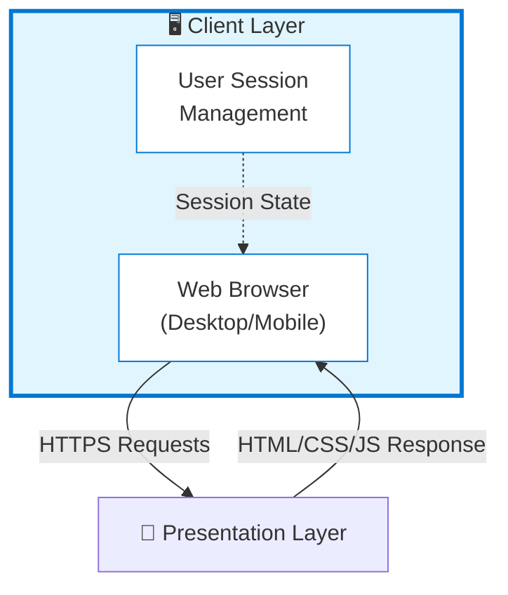
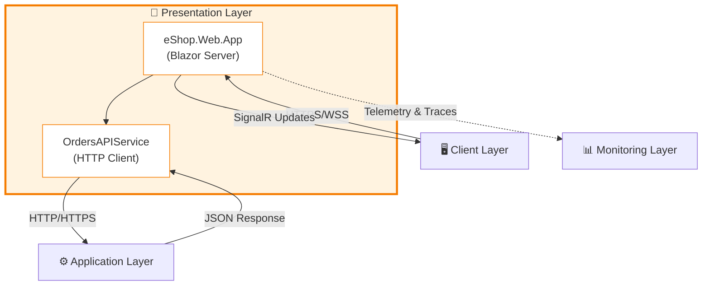
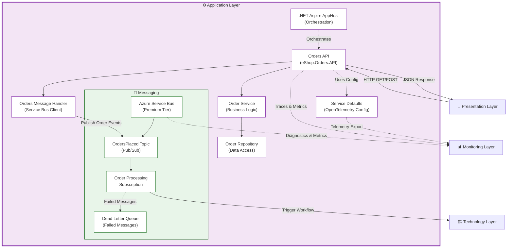
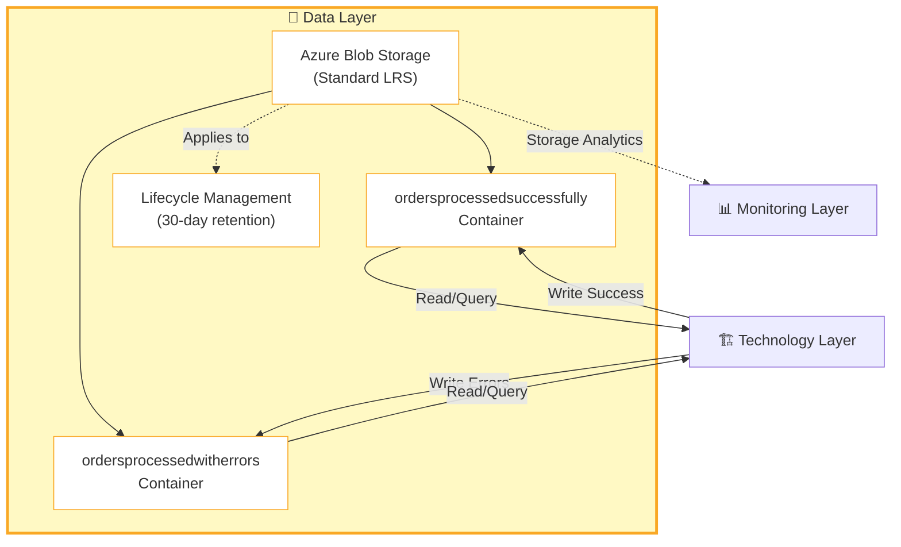
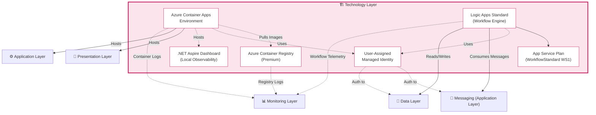
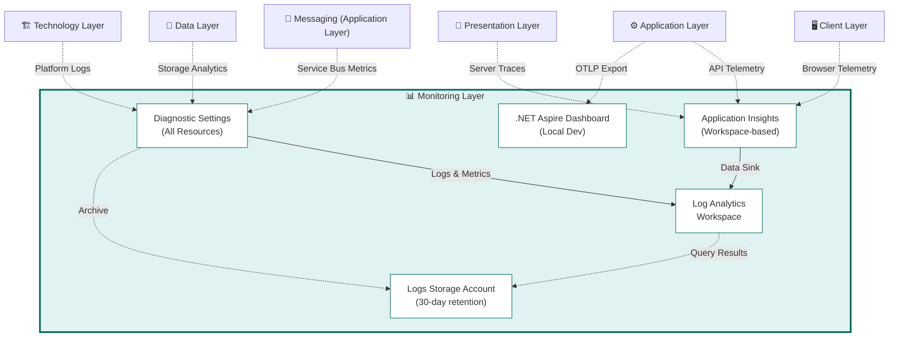

# Azure Logic Apps Monitoring Sample

[](https://opensource.org/licenses/MIT)
[](https://dotnet.microsoft.com/)
[](https://azure.microsoft.com/)
[](https://dotnet.microsoft.com/apps/aspnet/web-apps/blazor)
[](https://learn.microsoft.com/azure/logic-apps/)

## Overview

This repository demonstrates **enterprise-grade best practices for monitoring Azure Logic Apps Standard** using modern cloud-native architectures. The sample application showcases how to build observable, scalable, and resilient order processing workflows integrated with comprehensive telemetry, distributed tracing, and real-time monitoring capabilities.

The solution leverages **.NET Aspire** for local development orchestration, **Azure Container Apps** for microservices hosting, **Azure Service Bus** for reliable messaging, and **Application Insights** with **Log Analytics** for observability. It implements a complete end-to-end monitoring strategy following the Microsoft Cloud Adoption Framework and Azure Well-Architected Framework principles, making it an ideal reference architecture for production Logic Apps deployments.

Key capabilities include automated Infrastructure-as-Code provisioning via Bicep, managed identity-based authentication, elastic scaling with Container Apps, and rich diagnostic logging across all Azure resources. The project also includes PowerShell automation hooks for seamless CI/CD integration with Azure Developer CLI (azd).

---

## Table of Contents

- [Project Structure](#project-structure)
- [Architecture](#architecture)
  - [Client Layer](#client-layer)
  - [Presentation Layer](#presentation-layer)
  - [Application Layer](#application-layer)
  - [Data Layer](#data-layer)
  - [Technology Layer](#technology-layer)
  - [Monitoring Layer](#monitoring-layer)
- [Prerequisites](#prerequisites)
- [Setup Instructions](#setup-instructions)
- [Deployment Guide](#deployment-guide)
- [Monitoring & Observability](#monitoring--observability)
- [References & Documentation](#references--documentation)
- [Contributing](#contributing)
- [License](#license)

---

## Project Structure

```
.
├── .gitignore
├── app.sln
├── azure.yaml
├── BDAT.MD
├── CODE_OF_CONDUCT.md
├── CONTRIBUTING.md
├── LICENSE
├── LICENSE.md
├── README.MD
├── SECURITY.md
├── .github/
│   └── workflows/
├── .vs/
│   ├── app/
│   └── ProjectEvaluation/
├── app.AppHost/
│   ├── app.AppHost.csproj
│   ├── AppHost.cs
│   ├── appsettings.Development.json
│   ├── appsettings.json
│   ├── bin/
│   ├── obj/
│   └── Properties/
├── app.ServiceDefaults/
│   ├── app.ServiceDefaults.csproj
│   ├── CommonTypes.cs
│   ├── Extensions.cs
│   ├── bin/
│   └── obj/
├── hooks/
│   ├── generate_orders_script.py
│   ├── generate_orders.ps1
│   ├── ordersBatch.json
│   ├── postprovision.ps1
│   └── preprovision.ps1
├── infra/
│   ├── main.bicep
│   ├── main.parameters.json
│   ├── types.bicep
│   ├── monitoring/
│   │   ├── app-insights.bicep
│   │   ├── azure-monitor-health-model.bicep
│   │   ├── log-analytics-workspace.bicep
│   │   └── main.bicep
│   └── workload/
│       ├── data/
│       │   └── main.bicep
│       ├── identity/
│       │   └── main.bicep
│       ├── logic-app.bicep
│       ├── main.bicep
│       ├── messaging/
│       │   └── main.bicep
│       └── services/
│           └── main.bicep
└── src/
    ├── eShop.Orders.API/
    │   ├── eShop.Orders.API.csproj
    │   ├── Program.cs
    │   ├── Controllers/
    │   │   ├── OrdersController.cs
    │   │   └── WeatherForecastController.cs
    │   ├── Handlers/
    │   │   └── OrdersMessageHandler.cs
    │   ├── Interfaces/
    │   │   └── IOrderRepository.cs
    │   ├── Repositories/
    │   │   └── OrderRepository.cs
    │   └── Services/
    │       ├── Interfaces/
    │       │   └── IOrderService.cs
    │       └── OrderService.cs
    └── eShop.Web.App/
        ├── eShop.Web.App.csproj
        ├── Program.cs
        ├── Components/
        │   ├── App.razor
        │   ├── Layout/
        │   │   ├── MainLayout.razor
        │   │   ├── MainLayout.razor.css
        │   │   └── NavMenu.razor
        │   ├── Pages/
        │   │   ├── Error.razor
        │   │   ├── Home.razor
        │   │   ├── ListAllOrders.razor
        │   │   ├── PlaceOrder.razor
        │   │   ├── PlaceOrdersBatch.razor
        │   │   ├── ViewOrder.razor
        │   │   └── WeatherForecasts.razor
        │   ├── Routes.razor
        │   ├── Shared/
        │   │   ├── LoadingCard.razor
        │   │   └── PageHeader.razor
        │   └── Services/
        │       └── OrdersAPIService.cs
        └── wwwroot/
```

---

## Architecture

The solution follows **TOGAF BDAT Model** principles with clear separation of concerns across seven architectural layers. Each layer is presented with its own diagram showing internal components and cross-layer interactions.

### Client Layer

The Client Layer represents the end-user interface accessing the application through web browsers.



**Key Responsibilities:**
- User authentication and session management
- Rendering application UI in web browsers
- Handling user input and interactions
- Client-side validation and error handling

---

### Presentation Layer

The Presentation Layer implements the user interface using Blazor Server with Fluent UI components.



**Key Components:**
- eShop.Web.App/Program.cs - Application entry point
- MainLayout.razor - Layout component
- Home.razor - Landing page
- OrdersAPIService.cs - API client

---

### Application Layer

The Application Layer contains business logic, orchestration, API endpoints, and messaging infrastructure.



**Key Components:**
- eShop.Orders.API/Program.cs - API configuration
- AppHost.cs - Aspire orchestration
- Extensions.cs - OpenTelemetry setup
- messaging/main.bicep - Service Bus deployment
- Service Bus Premium with 16 messaging units
- Topic-based publish/subscribe pattern
- 10 max delivery attempts with 5-minute lock duration

---

### Data Layer

The Data Layer manages persistent storage for processed orders using Azure Blob Storage.



**Key Resources:**
- messaging/main.bicep - Storage deployment
- Segregated containers for success/error processing
- Hot access tier for frequent access
- TLS 1.2 minimum encryption

---

### Technology Layer

The Technology Layer provides the runtime infrastructure for hosting and executing workloads.



**Key Resources:**
- services/main.bicep - Container infrastructure
- logic-app.bicep - Logic Apps deployment
- identity/main.bicep - Managed identity
- Elastic scaling: 3-20 instances for Logic Apps

---

### Monitoring Layer

The Monitoring Layer provides comprehensive observability across all components.



**Key Resources:**
- monitoring/main.bicep - Monitoring orchestration
- app-insights.bicep - Application Insights
- log-analytics-workspace.bicep - Log Analytics
- 30-day retention with automatic log deletion

---

## Prerequisites

### Required Tools & SDKs

- [.NET SDK 10.0](https://dotnet.microsoft.com/download/dotnet/10.0) or later
- [Azure Developer CLI (azd)](https://learn.microsoft.com/azure/developer/azure-developer-cli/install-azd) v1.5.0+
- [Azure CLI](https://learn.microsoft.com/cli/azure/install-azure-cli) v2.60.0+
- [Docker Desktop](https://www.docker.com/products/docker-desktop/) or Docker Engine
- [PowerShell 7.4+](https://github.com/PowerShell/PowerShell) (cross-platform)
- [Visual Studio Code](https://code.visualstudio.com/) with extensions:
  - [C# Dev Kit](https://marketplace.visualstudio.com/items?itemName=ms-dotnettools.csdevkit)
  - [Azure Tools](https://marketplace.visualstudio.com/items?itemName=ms-vscode.vscode-node-azure-pack)
  - [Bicep](https://marketplace.visualstudio.com/items?itemName=ms-azuretools.vscode-bicep)

### Azure Subscription Requirements

- Active Azure subscription with Owner or Contributor role
- Sufficient quota for:
  - Azure Container Apps
  - Azure Service Bus Premium
  - Azure Logic Apps Standard
  - Azure Container Registry
  - Log Analytics workspace

---

## Setup Instructions

### 1. Clone the Repository

```bash
git clone https://github.com/Evilazaro/Azure-LogicApps-Monitoring.git
cd Azure-LogicApps-Monitoring
```

### 2. Initialize Azure Developer CLI

```bash
azd init
```

Select "Use code in the current directory" when prompted.

### 3. Configure Environment Variables

```bash
azd env set AZURE_LOCATION eastus2
azd env set AZURE_ENV_NAME dev
```

### 4. Authenticate to Azure

```bash
azd auth login
az login
```

### 5. Local Development Setup

The solution uses **.NET Aspire** for local orchestration:

```bash
cd app.AppHost
dotnet run
```

This starts:
- Blazor Web App (HTTPS)
- Orders API (HTTPS)
- .NET Aspire Dashboard (for local observability)

Access the Aspire Dashboard at `http://localhost:15888` for traces, metrics, and logs.

---

## Deployment Guide

### Deploy to Azure

The repository includes automated provisioning using Azure Developer CLI:

```bash
azd up
```

This command:
1. **Provisions Azure resources** via main.bicep
2. **Builds container images** for microservices
3. **Deploys to Azure Container Apps**
4. **Configures Logic Apps workflows**
5. **Sets up monitoring and diagnostic settings**

### Post-Deployment Configuration

After deployment completes, the postprovision.ps1 hook automatically:
- Configures .NET user secrets with Azure resource information
- Authenticates to Azure Container Registry
- Updates connection strings for Application Insights and Service Bus

### Manual Deployment Steps

If you prefer manual deployment:

```bash
# Provision infrastructure
azd provision

# Build and deploy applications
azd deploy

# View outputs
azd env get-values
```

### Verify Deployment

1. Check Azure Portal for resource group `rg-orders-{env}-{location}`
2. Navigate to Application Insights to view live metrics
3. Access the deployed Blazor app via Container Apps URL
4. Test order submission and verify Service Bus messages

---

## Monitoring & Observability

### Application Insights Integration

All components automatically send telemetry to Application Insights:

- **Distributed Traces**: End-to-end request tracking across services
- **Metrics**: Performance counters, custom metrics, dependency timings
- **Logs**: Structured logging from .NET applications and Logic Apps
- **Live Metrics**: Real-time monitoring dashboard

#### Access Application Insights

```bash
azd env get-value AZURE_APPLICATION_INSIGHTS_NAME
```

Navigate to **Azure Portal → Application Insights → [Your Instance]**.

### Log Analytics Workspace

Centralized logging with **30-day retention** for:
- Container Apps logs
- Service Bus diagnostic logs
- Logic Apps workflow execution history
- Container Registry audit logs

Query logs using **Kusto Query Language (KQL)**:

```kql
ContainerAppConsoleLogs_CL
| where TimeGenerated > ago(1h)
| project TimeGenerated, Log_s, ContainerAppName_s
| order by TimeGenerated desc
```

### .NET Aspire Dashboard (Local)

For local development, the Aspire Dashboard provides:
- **Traces**: OpenTelemetry distributed tracing visualization
- **Metrics**: Real-time performance metrics
- **Logs**: Aggregated application logs
- **Structured Logs**: JSON-formatted log entries

Access at `http://localhost:15888` when running locally.

### Diagnostic Settings

All Azure resources are configured with diagnostic settings via monitoring to send:
- **All Logs**: Category group `allLogs`
- **All Metrics**: Category group `allMetrics`

Data flows to both Log Analytics workspace and long-term storage accounts.

### Health Monitoring

Health checks are implemented in Extensions.cs:
- `/health` - Comprehensive health check endpoint
- `/alive` - Liveness probe endpoint

Container Apps automatically uses these for health monitoring.

---

## References & Documentation

### Azure Services Documentation

- [Azure Logic Apps Standard](https://learn.microsoft.com/azure/logic-apps/logic-apps-overview)
- [Azure Service Bus](https://learn.microsoft.com/azure/service-bus-messaging/)
- [Azure Container Apps](https://learn.microsoft.com/azure/container-apps/)
- [Application Insights](https://learn.microsoft.com/azure/azure-monitor/app/app-insights-overview)
- [.NET Aspire](https://learn.microsoft.com/dotnet/aspire/)

### Architecture & Best Practices

- [Azure Well-Architected Framework](https://learn.microsoft.com/azure/well-architected/)
- [Cloud Adoption Framework](https://learn.microsoft.com/azure/cloud-adoption-framework/)
- [TOGAF Architecture Framework](https://www.opengroup.org/togaf)
- [OpenTelemetry for .NET](https://opentelemetry.io/docs/languages/net/)

### Related Projects

- [.NET Aspire Samples](https://github.com/dotnet/aspire-samples)
- [Azure Developer CLI Templates](https://github.com/Azure/awesome-azd)

---

## Contributing

We welcome contributions! Please see CONTRIBUTING.md for guidelines on:

- Reporting issues
- Submitting pull requests
- Code style and conventions
- Development workflow

### Code of Conduct

This project follows the Microsoft Open Source Code of Conduct.

### Security

For security vulnerabilities, please see SECURITY.md for responsible disclosure procedures.

---

## License

This project is licensed under the **MIT License**. See LICENSE for full details.

---

**Maintained by**: [Evilazaro](https://github.com/Evilazaro)  
**Questions?** Open an [issue](https://github.com/Evilazaro/Azure-LogicApps-Monitoring/issues)  
**Repository**: [Azure-LogicApps-Monitoring](https://github.com/Evilazaro/Azure-LogicApps-Monitoring)