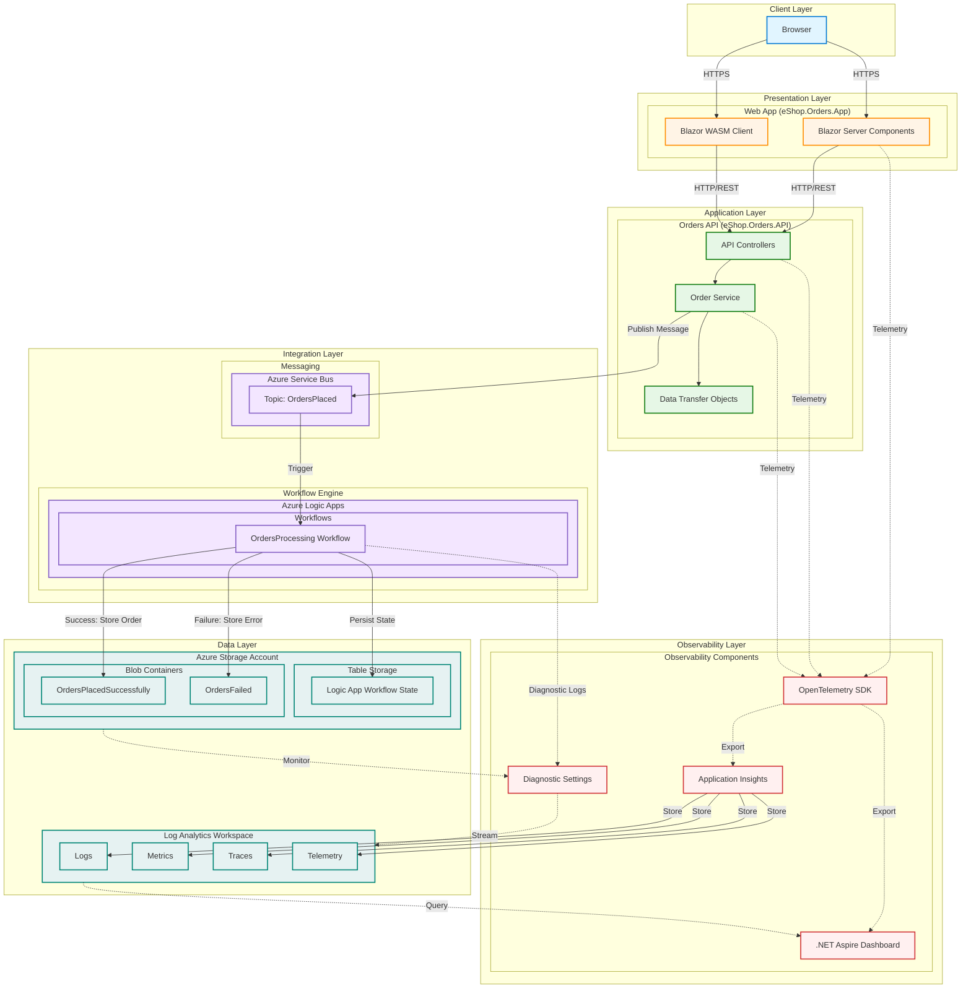

# Azure Logic Apps Monitoring Sample

[](https://opensource.org/licenses/MIT)
[](https://dotnet.microsoft.com/download)
[](https://azure.microsoft.com/services/logic-apps/)

A comprehensive sample application demonstrating enterprise-grade best practices for monitoring Azure Logic Apps using .NET Aspire, OpenTelemetry, and Azure Monitor. This repository showcases how to build observable, production-ready workflows integrated with modern .NET applications.

This sample implements an e-commerce order processing system where orders placed through a web application trigger Azure Logic App workflows. The workflows process orders asynchronously via Azure Service Bus, store results in Azure Storage, and emit detailed telemetry for comprehensive observability. The application demonstrates end-to-end distributed tracing, structured logging, and metrics collection across the entire processing pipeline.

Built following the [Azure Well-Architected Framework](https://learn.microsoft.com/azure/well-architected/operational-excellence/monitoring) for operational excellence, this sample provides practical patterns for monitoring Logic Apps in production environments using Azure Monitor, Log Analytics, and the .NET Aspire dashboard.

---

## Table of Contents

- [Project Structure](#project-structure)
- [Architecture](#architecture)
- [Prerequisites](#prerequisites)
- [Setup Instructions](#setup-instructions)
- [Deployment Guide](#deployment-guide)
- [Monitoring & Observability](#monitoring--observability)
- [References & Documentation](#references--documentation)
- [Contributing](#contributing)
- [License](#license)

---

## Project Structure

```
Azure-LogicApps-Monitoring/
├── .gitignore
├── app.sln                              # Solution file
├── azure.yaml                           # Azure Developer CLI configuration
├── README.md
├── LICENSE
├── CODE_OF_CONDUCT.md
├── CONTRIBUTING.md
├── SECURITY.md
│
├── app.AppHost/                         # .NET Aspire AppHost orchestration
│   ├── app.AppHost.csproj
│   ├── AppHost.cs                       # Application composition and resource configuration
│   ├── appsettings.json
│   ├── appsettings.Development.json
│   └── Properties/
│
├── app.ServiceDefaults/                 # .NET Aspire ServiceDefaults
│   ├── app.ServiceDefaults.csproj
│   ├── CommonTypes.cs                   # Shared types and constants
│   ├── Extensions.cs                    # Telemetry and observability extensions
│   └── bin/
│
├── src/
│   ├── eShop.Orders.API/                # Orders REST API
│   │   ├── Controllers/                 # API endpoints
│   │   ├── Services/                    # Order service implementation
│   │   ├── Models/                      # DTOs and domain models
│   │   └── Program.cs                   # API configuration with OpenTelemetry
│   │
│   ├── eShop.Orders.App/                # Blazor Web App (Server)
│   │   ├── Components/                  # Blazor components
│   │   ├── Services/                    # HTTP client services
│   │   └── Program.cs                   # App configuration
│   │
│   └── eShop.Orders.App.Client/         # Blazor Web App (Client/WASM)
│       ├── Pages/                       # Client-side pages
│       └── Program.cs
│
├── LogicAppWP/                          # Logic App Workspace
│   ├── ConsosoOrders/                   # OrdersProcessing workflow
│   │   ├── workflow.json                # Workflow definition
│   │   └── connections.json             # API connections configuration
│   ├── host.json                        # Logic App host settings
│   └── local.settings.json              # Local development settings
│
├── infra/                               # Azure Infrastructure as Code (Bicep)
│   ├── main.bicep                       # Main infrastructure template
│   ├── main.parameters.json             # Deployment parameters
│   ├── types.bicep                      # Type definitions
│   ├── monitoring/                      # Monitoring resources (Log Analytics, App Insights)
│   └── workload/                        # Workload resources (Service Bus, Storage, Logic Apps)
│
└── hooks/                               # Deployment hooks and utilities
    ├── preprovision.ps1                 # Pre-deployment script
    ├── postprovision.ps1                # Post-deployment script
    ├── generate_orders.ps1              # Test order generation
    └── orders.json                      # Sample order data
```

---

## Architecture

The following diagram illustrates the layered architecture and component interactions:



### Key Components

- **Client Layer**: Browser-based user interface
- **Presentation Layer**: Blazor web application with server and WASM components
- **Application Layer**: REST API for order management with full telemetry
- **Integration Layer**: Azure Service Bus for async messaging and Logic Apps for workflow orchestration
- **Observability Layer**: OpenTelemetry, Application Insights, and .NET Aspire Dashboard for comprehensive monitoring
- **Data Layer**: Log Analytics for centralized logging and Azure Storage for order persistence

---

## Prerequisites

Before running this sample, ensure you have the following installed:

### Required Tools
- [.NET 8.0 SDK](https://dotnet.microsoft.com/download/dotnet/8.0) or later
- [Visual Studio 2022](https://visualstudio.microsoft.com/) (17.9+) or [Visual Studio Code](https://code.visualstudio.com/)
- [Azure CLI](https://docs.microsoft.com/cli/azure/install-azure-cli) (2.50+)
- [Azure Developer CLI (azd)](https://learn.microsoft.com/azure/developer/azure-developer-cli/install-azd)
- [Azure Functions Core Tools](https://learn.microsoft.com/azure/azure-functions/functions-run-local) v4.x (for local Logic Apps development)
- [.NET Aspire workload](https://learn.microsoft.com/dotnet/aspire/fundamentals/setup-tooling) (`dotnet workload install aspire`)

### Azure Resources
- Active Azure subscription
- Permissions to create resources in your subscription
- Access to Azure Portal for monitoring

### Optional Tools
- [Postman](https://www.postman.com/) or similar tool for API testing
- [Azure Storage Explorer](https://azure.microsoft.com/features/storage-explorer/) for viewing storage contents

---

## Setup Instructions

### 1. Clone the Repository

```bash
git clone https://github.com/Evilazaro/Azure-LogicApps-Monitoring.git
cd Azure-LogicApps-Monitoring
```

### 2. Install .NET Aspire Workload

```bash
dotnet workload update
dotnet workload install aspire
```

### 3. Configure Azure CLI

```bash
az login
az account set --subscription <your-subscription-id>
```

### 4. Restore Dependencies

```bash
dotnet restore app.sln
```

### 5. Configure Local Settings

For local Logic Apps development, update `LogicAppWP/local.settings.json`:

```json
{
  "IsEncrypted": false,
  "Values": {
    "AzureWebJobsStorage": "UseDevelopmentStorage=true",
    "FUNCTIONS_WORKER_RUNTIME": "node",
    "ServiceBus__ConnectionString": "<your-local-or-dev-service-bus-connection-string>",
    "StorageAccount__ConnectionString": "<your-storage-account-connection-string>"
  }
}
```

---

## Deployment Guide

### Option 1: Deploy to Azure using Azure Developer CLI (Recommended)

```bash
# Initialize the environment
azd init

# Provision infrastructure and deploy application
azd up
```

The `azd up` command will:
1. Execute preprovision.ps1 for pre-deployment checks
2. Provision Azure resources using Bicep templates from infra
3. Deploy the .NET Aspire application
4. Deploy Logic App workflows
5. Execute postprovision.ps1 for configuration

### Option 2: Local Development with .NET Aspire

```bash
# Run the Aspire AppHost
cd app.AppHost
dotnet run
```

This will start:
- Orders API on configured port
- Orders Web App
- .NET Aspire Dashboard at `http://localhost:15888` (or configured port)
- Local Service Bus emulator (if configured)

### Option 3: Manual Azure Deployment

```bash
# Deploy infrastructure
az deployment sub create \
  --location eastus \
  --template-file infra/main.bicep \
  --parameters infra/main.parameters.json

# Deploy Logic Apps
cd LogicAppWP
func azure functionapp publish <your-logic-app-name>

# Deploy .NET applications
dotnet publish src/eShop.Orders.API -c Release
# Deploy to Azure App Service or Container Apps
```

### Testing the Deployment

Generate test orders using the provided script:

```powershell
cd hooks
.\generate_orders.ps1
```

Or use the sample data:

```bash
curl -X POST https://<your-api-url>/api/orders \
  -H "Content-Type: application/json" \
  -d @hooks/orders.json
```

---

## Monitoring & Observability

This sample demonstrates comprehensive observability following [Azure Monitor OpenTelemetry best practices](https://learn.microsoft.com/azure/azure-monitor/app/opentelemetry-data-collection).

### .NET Aspire Dashboard

Access the dashboard at `http://localhost:15888` (local) or the configured Azure endpoint:

- **Traces**: View distributed traces across API, Logic Apps, and Service Bus
- **Metrics**: Monitor request rates, latencies, and custom business metrics
- **Logs**: Structured logging with correlation IDs
- **Resources**: View all application components and their health

### Application Insights

Monitor production workloads:

1. Navigate to Azure Portal > Application Insights
2. View **Application Map** for topology visualization
3. Use **Live Metrics** for real-time monitoring
4. Query logs using **Logs (Kusto)**:

```kusto
// View Logic App workflow executions
traces
| where cloud_RoleName == "ConsosoOrders"
| where message contains "OrdersProcessing"
| project timestamp, message, severityLevel, customDimensions
| order by timestamp desc

// View API request telemetry
requests
| where name contains "orders"
| summarize count(), avg(duration) by name, resultCode
| order by count_ desc
```

### Logic Apps Monitoring

Monitor Logic App workflows following [official guidance](https://learn.microsoft.com/azure/logic-apps/monitor-logic-apps):

1. **Run History**: View execution history in Azure Portal
2. **Diagnostic Logs**: Stream to Log Analytics workspace
3. **Workflow State**: Stored in Azure Table Storage (`WorkflowState`)
4. **Custom Metrics**: Track business KPIs

### Key Metrics to Monitor

- **API Latency**: P50, P95, P99 response times
- **Logic App Success Rate**: Percentage of successful workflow executions
- **Service Bus Queue Length**: Monitor backlog
- **Storage Operations**: Blob creation rate
- **Error Rate**: 4xx and 5xx responses

### Diagnostic Settings

All resources emit logs to the shared Log Analytics workspace configured in monitoring:

- API logs (structured with OpenTelemetry)
- Logic App diagnostic logs
- Service Bus metrics and logs
- Storage Account logs

---

## References & Documentation

### Azure Services
- [Azure Logic Apps Documentation](https://learn.microsoft.com/azure/logic-apps/)
- [Monitor Logic Apps](https://learn.microsoft.com/azure/logic-apps/monitor-logic-apps)
- [Azure Service Bus](https://learn.microsoft.com/azure/service-bus-messaging/)
- [Azure Storage](https://learn.microsoft.com/azure/storage/)

### Monitoring & Observability
- [Azure Monitor Overview](https://learn.microsoft.com/azure/azure-monitor/)
- [Azure Monitor .NET SDK](https://learn.microsoft.com/dotnet/api/overview/azure/monitor?view=azure-dotnet)
- [OpenTelemetry Data Collection](https://learn.microsoft.com/azure/azure-monitor/app/opentelemetry-data-collection)
- [Azure Well-Architected Framework - Monitoring](https://learn.microsoft.com/azure/well-architected/operational-excellence/monitoring)

### .NET Aspire
- [.NET Aspire Overview](https://learn.microsoft.com/dotnet/aspire/get-started/aspire-overview)
- [.NET Aspire Dashboard](https://aspire.dev/dashboard/overview/)
- [Service Defaults](https://learn.microsoft.com/dotnet/aspire/fundamentals/service-defaults)

### Development Tools
- [Azure Developer CLI](https://learn.microsoft.com/azure/developer/azure-developer-cli/)
- [Azure Functions Core Tools](https://learn.microsoft.com/azure/azure-functions/functions-run-local)

---

## Contributing

We welcome contributions! Please see CONTRIBUTING.md for details on:

- Code of conduct
- How to submit issues
- Pull request process
- Coding standards

### Quick Start for Contributors

1. Fork the repository
2. Create a feature branch: `git checkout -b feature/your-feature`
3. Make your changes and commit: `git commit -am 'Add new feature'`
4. Push to the branch: `git push origin feature/your-feature`
5. Submit a pull request

Please ensure:
- Code follows existing patterns in Extensions.cs
- All tests pass
- Documentation is updated
- Commit messages are clear and descriptive

---

## License

This project is licensed under the MIT License - see the LICENSE file for details.

---

## Security

Please see SECURITY.md for information on reporting security vulnerabilities.

---

**Questions or Issues?**

- Open an [issue](https://github.com/Evilazaro/Azure-LogicApps-Monitoring/issues)
- Review existing [discussions](https://github.com/Evilazaro/Azure-LogicApps-Monitoring/discussions)
- Check the [Azure Logic Apps documentation](https://learn.microsoft.com/azure/logic-apps/)