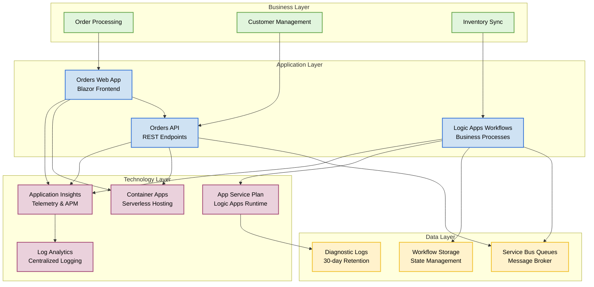
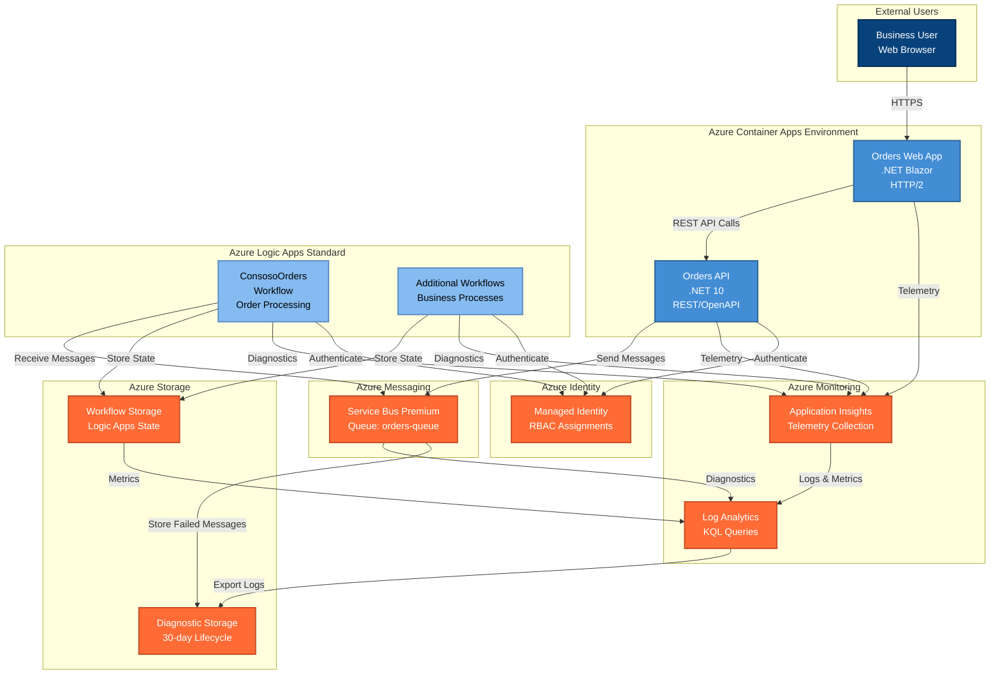
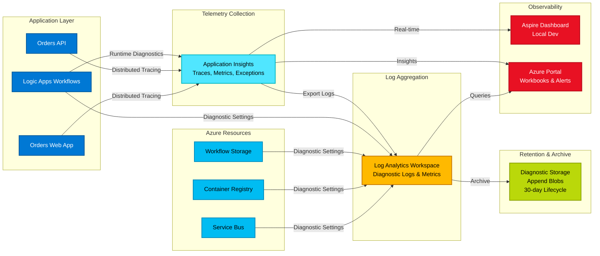

Collecting workspace information# Azure Logic Apps Monitoring Solution

## Overview

### Problem Statement

Enterprise companies deploying Azure Logic Apps Standard at scale face critical challenges when operating thousands of workflows across global deployments. Microsoft's current guidance recommends approximately 20 workflows per Logic App instance and up to 64 apps per App Service Plan. However, organizations exceeding these limits—particularly when enabling 64-bit support—experience severe memory consumption spikes, workflow instability, and cost overruns reaching approximately US$80,000 annually per environment.

This solution addresses these enterprise-scale challenges by providing a reference architecture that optimizes workflow hosting density, implements comprehensive monitoring aligned with the Azure Well-Architected Framework, and establishes proven patterns for operating long-running workflows (18–36 months) without compromising stability or incurring excessive costs.

### Key Features

| Feature | Description | Implementation Details |
|---------|-------------|------------------------|
| **Optimized Architecture** | Resource topology designed for hosting thousands of workflows efficiently | App Service Plan with elastic scaling (WS1 tier), 3-20 instances, containerized deployment via Azure Container Apps |
| **Comprehensive Monitoring** | End-to-end observability across all solution components | Application Insights workspace integration, Log Analytics workspace with 30-day retention, diagnostic settings on all resources |
| .NET Aspire Integration** | Modern application hosting and orchestration for microservices | Aspire Dashboard for local development, service defaults for telemetry, health checks, and resilience patterns |
| **Cost Optimization** | Automated lifecycle policies and right-sized resource configurations | Storage account lifecycle management (30-day retention), Premium Service Bus with capacity planning, consumption-based Container Apps |
| **Security & Compliance** | Identity-based access and role assignments following least privilege | User-assigned managed identity, Azure RBAC role assignments, TLS 1.2 minimum, diagnostic logging for audit trails |
| **Infrastructure as Code** | Complete Bicep templates for repeatable deployments | Modular Bicep structure with type safety, parameterized environments (local/dev/staging/prod), Azure Developer CLI (azd) integration |

### Solution Components

| Component | Purpose | Role in Solution |
|-----------|---------|------------------|
| **Logic Apps Standard** | Stateful workflow engine for business process automation | Hosts workflows with elastic scaling, integrates with Service Bus for reliable messaging, provides workflow runtime diagnostics |
| **.NET Aspire AppHost** | Orchestrates local development and cloud provisioning | Coordinates service dependencies, manages Azure resource references, configures telemetry connections |
| **Orders API** | RESTful API for order management operations | Exposes HTTP/2 endpoints, integrates with Service Bus queues, implements health checks and OpenAPI documentation |
| **Orders Web App** | User interface for order processing | Blazor-based frontend, consumes Orders API, integrated Application Insights telemetry |
| **Workflow Engine** | Logic Apps runtime hosted on App Service Plan | Executes business workflows, connects to storage accounts for state management, emits runtime telemetry |

### Azure Components

| Azure Service | Purpose | Role in Solution |
|---------------|---------|------------------|
|  **Application Insights** | Application performance monitoring and telemetry | Collects distributed traces, metrics, and logs from all services; provides end-to-end transaction visibility |
|  **Log Analytics Workspace** | Centralized log aggregation and querying | Stores diagnostic logs and metrics from all Azure resources; enables KQL queries for troubleshooting |
|  **Service Bus Premium** | Enterprise message broker with guaranteed delivery | Provides queues for order processing messages; supports sessions, duplicate detection, and dead-lettering |
|  **Container Registry** | Private registry for container images | Stores application container images; integrates with Container Apps for automated deployments |
|  **Container Apps Environment** | Serverless container hosting platform | Hosts Orders API and Web App with auto-scaling; provides managed infrastructure with consumption billing |
|  **Storage Accounts** | Durable storage for logs and workflow state | Separate accounts for diagnostic logs (with 30-day lifecycle) and Logic Apps runtime state |
|  **User-Assigned Managed Identity** | Identity-based authentication without credentials | Provides secure access to Service Bus, Storage, Container Registry, and monitoring services |

### Project Structure

```
Azure-LogicApps-Monitoring/
├── .azure/                                 # Azure Developer CLI configuration
│   └── config.json                        # Environment-specific settings
├── eShopOrders.AppHost/                   # .NET Aspire orchestration host
│   ├── AppHost.cs                         # Service composition and Azure resource references
│   ├── Constants.cs                       # Shared configuration constants
│   └── eShopOrders.AppHost.csproj         # Aspire AppHost project file
├── eShopOrders.ServiceDefaults/           # Shared service configuration
│   ├── Extensions.cs                      # Telemetry, health checks, resilience extensions
│   └── eShopOrders.ServiceDefaults.csproj # Service defaults project file
├── src/
│   ├── eShop.Orders.API/                  # Orders management REST API
│   │   ├── Program.cs                     # API startup and middleware configuration
│   │   ├── Controllers/                   # API endpoint controllers
│   │   └── eShop.Orders.API.csproj        # API project file
│   ├── eShop.Orders.App/                  # Blazor web application
│   │   ├── Program.cs                     # Web app startup configuration
│   │   └── eShop.Orders.App.csproj        # Web app project file
│   └── eShop.Orders.App.Client/           # Blazor client-side components
│       └── eShop.Orders.App.Client.csproj # Client project file
├── LogicAppWP/                            # Logic Apps workspace
│   ├── ConsosoOrders/                     # Workflow definitions
│   │   └── workflow.json                  # Order processing workflow definition
│   ├── host.json                          # Logic Apps host configuration
│   └── local.settings.json                # Local development settings
├── infra/                                 # Azure infrastructure as code (Bicep)
│   ├── main.bicep                         # Root deployment orchestrator
│   ├── types.bicep                        # Shared type definitions
│   ├── monitoring/                        # Monitoring infrastructure
│   │   ├── main.bicep                     # Monitoring module orchestrator
│   │   ├── log-analytics-workspace.bicep  # Log Analytics and diagnostic storage
│   │   ├── app-insights.bicep             # Application Insights workspace integration
│   │   └── azure-monitor-health-model.bicep # Service group hierarchy
│   └── workload/                          # Application workload infrastructure
│       ├── main.bicep                     # Workload module orchestrator
│       ├── identity/
│       │   └── main.bicep                 # Managed identity and RBAC assignments
│       ├── messaging/
│       │   └── main.bicep                 # Service Bus namespace, queues, workflow storage
│       ├── services/
│       │   └── main.bicep                 # Container Registry, Container Apps Environment
│       └── logic-app.bicep                # Logic Apps Standard and App Service Plan
├── azure.yaml                             # Azure Developer CLI project manifest
├── eShopOrders.sln                        # Visual Studio solution file
├── docker-compose.yml                     # Local development orchestration
└── README.md                              # Project documentation
```

---

## Target Audience

| Role Name | Role Description | Key Responsibilities & Deliverables | How This Solution Helps |
|-----------|------------------|-------------------------------------|-------------------------|
| **Solution Architect** | Defines end-to-end technical solutions aligned with business requirements | System design documentation, integration patterns, technology selection, capacity planning | Provides proven reference architecture for enterprise Logic Apps deployments with documented scalability limits and cost models |
| **Cloud Architect** | Designs Azure infrastructure topology and resource organization | Landing zone design, network architecture, resource naming conventions, subscription strategy | Offers modular Bicep templates following Azure Well-Architected Framework principles with environment-specific parameter files |
| **Network Architect** | Plans network connectivity, traffic flow, and security boundaries | Virtual network design, private endpoints, network security groups, traffic inspection | Demonstrates public network access patterns with diagnostic logging; extensible for private endpoint integration |
| **Data Architect** | Defines data storage, retention, and flow patterns | Data modeling, storage strategy, retention policies, data lineage | Implements storage accounts with lifecycle management, Log Analytics retention policies, and workflow state persistence patterns |
| **Security Architect** | Establishes identity, access control, and compliance requirements | Zero-trust design, least privilege access, encryption standards, audit logging | Implements managed identity, Azure RBAC role assignments, TLS 1.2 minimum, and comprehensive diagnostic settings for compliance |
| **DevOps/SRE Lead** | Implements CI/CD pipelines, monitoring, and operational excellence | Pipeline automation, infrastructure as code, observability dashboards, incident response | Provides Infrastructure as Code with Azure Developer CLI integration, comprehensive telemetry, and health monitoring patterns |
| **Developer** | Builds application code, APIs, and workflow definitions | API implementation, workflow logic, unit testing, local debugging | Includes .NET Aspire for local development experience with service discovery, telemetry, and Azure emulator integration |

---

## Architecture

### Solution Architecture (TOGAF BDAT Model)



### System Architecture (C4 Model - Container Level)



### Monitoring Dataflow



---

## Installation & Configuration

### Prerequisites

Before deploying this solution, ensure you have the following tools and permissions:

| Prerequisite | Version | Purpose | Installation |
|--------------|---------|---------|--------------|
| **Azure CLI** | 2.60.0+ | Azure resource management and authentication | [Install Azure CLI](https://learn.microsoft.com/cli/azure/install-azure-cli) |
| **.NET SDK** | 10.0.100+ | Build and run .NET applications and Aspire projects | [Download .NET 10](https://dotnet.microsoft.com/download/dotnet/10.0) |
| **Azure Developer CLI (azd)** | 1.9.0+ | Simplified Azure deployment workflow | [Install azd](https://learn.microsoft.com/azure/developer/azure-developer-cli/install-azd) |
| **Visual Studio Code** | Latest | Code editing and debugging | [Download VS Code](https://code.visualstudio.com/) |
| **Docker Desktop** | 4.30.0+ | Container runtime for local development | [Install Docker](https://www.docker.com/products/docker-desktop) |

**Required VS Code Extensions:**
- **Azure Tools** (ms-vscode.vscode-node-azure-pack) - Azure resource management
- **Bicep** (ms-azuretools.vscode-bicep) - Infrastructure as Code authoring
- **C# Dev Kit** (ms-dotnettools.csdevkit) - .NET development and debugging
- **.NET Aspire** (ms-dotnettools.dotnet-aspire) - Aspire project support and orchestration

### Azure RBAC Roles

The managed identity created by this solution is automatically assigned the following Azure RBAC roles for resource access:

| Role Name | Description | Documentation |
|-----------|-------------|---------------|
| **Storage Account Contributor** | Manage storage accounts, but not access to data | [Learn More](https://learn.microsoft.com/azure/role-based-access-control/built-in-roles#storage-account-contributor) |
| **Storage Blob Data Contributor** | Read, write, and delete Azure Storage containers and blobs | [Learn More](https://learn.microsoft.com/azure/role-based-access-control/built-in-roles#storage-blob-data-contributor) |
| **Monitoring Metrics Publisher** | Publish metrics to Azure Monitor | [Learn More](https://learn.microsoft.com/azure/role-based-access-control/built-in-roles#monitoring-metrics-publisher) |
| **Monitoring Contributor** | Can read all monitoring data and update monitoring settings | [Learn More](https://learn.microsoft.com/azure/role-based-access-control/built-in-roles#monitoring-contributor) |
| **Application Insights Component Contributor** | Can manage Application Insights components | [Learn More](https://learn.microsoft.com/azure/role-based-access-control/built-in-roles#application-insights-component-contributor) |
| **Application Insights Snapshot Debugger** | View and download debug snapshots collected with Application Insights | [Learn More](https://learn.microsoft.com/azure/role-based-access-control/built-in-roles#application-insights-snapshot-debugger) |
| **Azure Service Bus Data Owner** | Full access to Azure Service Bus resources | [Learn More](https://learn.microsoft.com/azure/role-based-access-control/built-in-roles#azure-service-bus-data-owner) |
| **Azure Service Bus Data Receiver** | Receive messages from Azure Service Bus queues and subscriptions | [Learn More](https://learn.microsoft.com/azure/role-based-access-control/built-in-roles#azure-service-bus-data-receiver) |
| **Azure Service Bus Data Sender** | Send messages to Azure Service Bus queues and topics | [Learn More](https://learn.microsoft.com/azure/role-based-access-control/built-in-roles#azure-service-bus-data-sender) |
| **Azure Container Registry ACR Pull** | Pull container images from Azure Container Registry | [Learn More](https://learn.microsoft.com/azure/role-based-access-control/built-in-roles#acrpull) |
| **Azure Container Registry ACR Push** | Push container images to Azure Container Registry | [Learn More](https://learn.microsoft.com/azure/role-based-access-control/built-in-roles#acrpush) |

### Deployment Steps

1. **Clone the repository:**
   ```bash
   git clone https://github.com/Evilazaro/Azure-LogicApps-Monitoring.git
   cd Azure-LogicApps-Monitoring
   ```

2. **Authenticate with Azure:**
   ```bash
   az login
   azd auth login
   ```

3. **Initialize Azure Developer CLI environment:**
   ```bash
   azd init
   ```

4. **Provision Azure resources:**
   ```bash
   azd provision
   ```
   This command deploys:
   - Resource Group
   - Log Analytics Workspace with diagnostic storage
   - Application Insights
   - User-Assigned Managed Identity with RBAC assignments
   - Service Bus Premium namespace with orders-queue
   - Container Registry
   - Container Apps Environment with Aspire Dashboard
   - Logic Apps Standard with App Service Plan (WS1, 3-20 instances)
   - Workflow storage account with blob containers

5. **Deploy application code:**
   ```bash
   azd deploy
   ```
   This command:
   - Builds container images for Orders API and Web App
   - Pushes images to Container Registry
   - Deploys containers to Container Apps Environment
   - Deploys Logic Apps workflows to the workflow engine

6. **Verify deployment:**
   ```bash
   azd show
   ```
   Note the output URLs:
   - `AZURE_CONTAINER_APPS_ENVIRONMENT_DEFAULT_DOMAIN` - Orders API endpoint
   - `AZURE_APPLICATION_INSIGHTS_CONNECTION_STRING` - Telemetry connection

---

## Usage Examples

### Monitoring Workflow Execution

**Query failed workflow runs in Log Analytics:**
```kusto
AzureDiagnostics
| where Category == "WorkflowRuntime"
| where status_s == "Failed"
| project TimeGenerated, resource_workflowName_s, resource_runId_s, status_s, error_message_s
| order by TimeGenerated desc
| take 50
```

**Analyze Service Bus queue depth:**
```kusto
AzureDiagnostics
| where ResourceProvider == "MICROSOFT.SERVICEBUS"
| where MetricName == "ActiveMessages"
| summarize avg(Total), max(Total) by bin(TimeGenerated, 5m), Resource
| render timechart
```

**Trace distributed transactions across services:**
```kusto
union requests, dependencies, exceptions
| where timestamp > ago(1h)
| where operation_Id == "<your-operation-id>"
| project timestamp, itemType, name, resultCode, duration, cloud_RoleName
| order by timestamp asc
```

**Monitor Logic Apps memory consumption:**
```kusto
AzureDiagnostics
| where ResourceProvider == "MICROSOFT.WEB"
| where Category == "AppServicePlatformLogs"
| where MetricName == "MemoryWorkingSet"
| summarize avg(Total), max(Total) by bin(TimeGenerated, 1h), Resource
| render timechart
```

**Create alert for workflow failures:**
```bicep
resource workflowFailureAlert 'Microsoft.Insights/metricAlerts@2018-03-01' = {
  name: 'workflow-failure-alert'
  location: 'global'
  properties: {
    severity: 2
    enabled: true
    scopes: [logicAppId]
    evaluationFrequency: 'PT5M'
    windowSize: 'PT15M'
    criteria: {
      allOf: [
        {
          metricName: 'RunsFailed'
          operator: 'GreaterThan'
          threshold: 5
          timeAggregation: 'Total'
        }
      ]
    }
    actions: [
      {
        actionGroupId: actionGroupId
      }
    ]
  }
}
```

---

## Additional Resources

- [Azure Logic Apps Standard Documentation](https://learn.microsoft.com/azure/logic-apps/logic-apps-overview)
- [.NET Aspire Documentation](https://learn.microsoft.com/dotnet/aspire/)
- [Azure Well-Architected Framework](https://learn.microsoft.com/azure/architecture/framework/)
- [Azure Developer CLI Documentation](https://learn.microsoft.com/azure/developer/azure-developer-cli/)
- [Azure Monitor Best Practices](https://learn.microsoft.com/azure/azure-monitor/best-practices)