# Azure Logic Apps Standard - Enterprise-Scale Monitoring & Orchestration

## Table of Contents

- [Overview](#overview)
  - [Problem Statement](#problem-statement)
  - [Key Features](#key-features)
  - [Solution Components](#solution-components)
  - [Azure Components](#azure-components)
- [Project Structure](#project-structure)
- [Architecture](#architecture)
  - [Business Architecture](#business-architecture)
    - [Business Capability Map](#business-capability-map)
    - [Value Stream Map](#value-stream-map)
  - [Data Architecture](#data-architecture)
    - [Master Data Management (MDM)](#master-data-management-mdm)
    - [Event-Driven Data Topology](#event-driven-data-topology)
    - [Monitoring Dataflow](#monitoring-dataflow)
  - [Application Architecture](#application-architecture)
    - [Microservices Architecture](#microservices-architecture)
    - [Event-Driven Architecture](#event-driven-architecture)
    - [Event State Transitions](#event-state-transitions)
  - [Technology Architecture](#technology-architecture)
    - [Cloud-Native Platform](#cloud-native-platform)
    - [Container-Based Architecture](#container-based-architecture)
    - [Serverless Architecture](#serverless-architecture)
    - [Platform Engineering](#platform-engineering)
- [Deployment](#deployment)
  - [Prerequisites](#prerequisites)
  - [Azure RBAC Roles](#azure-rbac-roles)
  - [Infrastructure Deployment](#infrastructure-deployment)
  - [Application Deployment](#application-deployment)
- [Usage Examples](#usage-examples)
  - [Order Management Operations](#order-management-operations)
  - [Workflow Monitoring Examples](#workflow-monitoring-examples)
  - [Kusto Queries for Logic Apps Monitoring](#kusto-queries-for-logic-apps-monitoring)
- [Monitoring and Observability](#monitoring-and-observability)
  - [.NET Aspire Dashboard](#net-aspire-dashboard)
  - [Application Insights Integration](#application-insights-integration)
  - [Logic Apps Workflow Monitoring Best Practices](#logic-apps-workflow-monitoring-best-practices)
- [References](#references)

---

## Overview

This solution provides a **production-ready reference architecture** for deploying and monitoring Azure Logic Apps Standard at enterprise scale. It demonstrates how to optimize workflow hosting density, implement comprehensive observability aligned with the Azure Well-Architected Framework, and operate long-running workflows (18–36 months) without compromising stability or cost-effectiveness.

The architecture leverages **.NET Aspire** for local development and orchestration, **Azure Container Apps** for hosting Logic Apps in a containerized environment, and **Azure Application Insights** with **OpenTelemetry** for end-to-end observability. The solution includes a reference implementation using an eShop Orders scenario, demonstrating real-world patterns for order processing, fulfillment, and monitoring across distributed systems.

The solution integrates **Azure Storage** for Logic Apps workflow state persistence, **Azure Service Bus** for event-driven workflow orchestration, and a **Blazor-based management interface** for operational teams to monitor and manage orders in real-time.

This implementation serves as a blueprint for organizations scaling Azure Logic Apps deployments globally, addressing common challenges around workflow density limits, memory management, cost optimization, and operational visibility. By following Microsoft's recommended guidance while providing practical patterns for exceeding baseline limits safely, this solution enables enterprises to run thousands of workflows efficiently across multiple regions.

### Problem Statement

Enterprise organizations deploying Azure Logic Apps Standard at global scale encounter significant operational and financial challenges when managing thousands of workflows. Microsoft's current guidance recommends limiting deployments to approximately **20 workflows per Logic App instance** and up to **64 apps per App Service Plan**. Organizations that exceed these thresholds—particularly when leveraging 64-bit worker processes—frequently experience memory pressure, workflow instability, performance degradation, and unpredictable scaling behavior.

These limitations become especially problematic for enterprises running **long-running workflows** that may execute for 18–36 months, such as complex approval chains, multi-stage fulfillment processes, or regulatory compliance workflows. The combination of high workflow density and extended execution times creates compounding operational risks, including increased memory consumption, state management challenges, and difficulty isolating problematic workflows. Without proper architecture patterns and monitoring, these issues cascade into **significant cost overruns**—with some organizations reporting operational costs approaching **US$80,000 annually per environment**.

Current monitoring solutions often lack the granularity needed to diagnose performance issues at the individual workflow level, making it difficult to identify bottlenecks, track resource consumption patterns, or optimize workflow placement strategies. Organizations need comprehensive observability that spans from business process metrics down to infrastructure-level telemetry, integrated with modern DevOps practices and platform engineering principles. This solution addresses these challenges by providing proven architecture patterns, monitoring strategies, and deployment practices that enable safe, cost-effective operation of Azure Logic Apps Standard at enterprise scale.

### Key Features

| Feature | Description | Implementation Details |
|---------|-------------|------------------------|
| **Optimized Workflow Hosting** | Reference architecture for maximizing workflow density while maintaining stability | Containerized Logic Apps on Azure Container Apps with resource quotas and horizontal scaling |
| **Comprehensive Observability** | End-to-end monitoring aligned with Azure Well-Architected Framework | OpenTelemetry integration via ServiceDefaults, Application Insights, custom metrics, distributed tracing |
| **Long-Running Workflow Support** | Patterns for workflows executing 18–36 months without instability | Stateful workflows with checkpoint management, durable execution tracking, Azure Storage state persistence |
| **.NET Aspire Orchestration** | Modern local development experience with service discovery and configuration | AppHost orchestration with service registration, ServiceDefaults for telemetry, integrated dashboard |
| **Event-Driven Integration** | Loosely coupled architecture using Azure Service Bus | Topic/subscription patterns, message-driven workflows, retry policies, dead-letter handling |
| **Cost Optimization** | Strategies to reduce operational expenses while scaling | Resource right-sizing, consumption-based scaling, workflow consolidation patterns |
| **Production-Ready Infrastructure** | Infrastructure-as-Code with Azure Bicep | Modular Bicep templates for Container Apps, Azure Storage, Service Bus, Application Insights |
| **API-First Design** | RESTful API for order management and workflow orchestration | ASP.NET Core Web API with Minimal APIs, OpenAPI/Swagger documentation |
| **Blazor Client Application** | Interactive UI for managing orders and monitoring workflows | Blazor WebAssembly client with server-side rendering, real-time updates |
| **Workflow State Management** | Durable state persistence for long-running workflows | Azure Storage Account with blob and table storage for Logic Apps runtime state |

### Solution Components

| Component | Description | Role in Solution |
|-----------|-------------|------------------|
| **eShopOrders.AppHost** | .NET Aspire AppHost orchestrating all services | Service discovery, configuration management, local development orchestration with telemetry aggregation |
| **eShopOrders.ServiceDefaults** | Shared telemetry and observability configuration | OpenTelemetry setup, Application Insights integration, health checks, resilience patterns via Polly |
| **eShop.Orders.API** | ASP.NET Core Web API for order management | RESTful endpoints for order CRUD operations, workflow trigger integration, business logic |
| **eShop.Orders.App** | Blazor Server application for order management | UI host for order management, server-side rendering, SignalR communication |
| **eShop.Orders.App.Client** | Blazor WebAssembly client components | Interactive UI components, client-side validation, API consumption |
| **LogicAppWP** | Azure Logic Apps Standard workspace | Workflow definitions, connectors, stateful execution, long-running process orchestration |
| **ContosoOrders Workflows** | Order processing workflows (CreateOrder, ProcessOrder, etc.) | Business process automation, event handling, Service Bus trigger integration |
| **Infrastructure (Bicep)** | Azure resource provisioning templates | Container Apps environment, Application Insights, Service Bus, Azure Storage, managed identities |

### Azure Components

| Azure Service | Description | Role in Solution |
|---------------|-------------|------------------|
| **Azure Logic Apps Standard** | Workflow orchestration service | Hosts business process workflows with stateful execution for long-running processes (18-36 months) |
| **Azure Container Apps** | Serverless container hosting platform | Runs Logic Apps and microservices in containers with auto-scaling and resource management |
| **Azure Application Insights** | Application performance monitoring service | Collects telemetry, distributed tracing, custom metrics, performance analysis via OpenTelemetry |
| **Azure Monitor** | Comprehensive monitoring and diagnostics platform | Aggregates logs and metrics, alerting, workbooks, operational insights |
| **Azure Service Bus** | Enterprise message broker service | Asynchronous messaging with topic/subscription patterns for workflow event distribution |
| **Azure Storage Account** | Scalable cloud storage service | Stores Logic Apps workflow state, blob storage for artifacts, table storage for metadata |
| **Azure Cosmos DB** | Globally distributed NoSQL database | Order data persistence with hierarchical partition keys (userId) |
| **Azure Key Vault** | Secrets and certificate management service | Stores connection strings, API keys, certificates, managed identity integration |
| **Azure Container Registry** | Private container registry | Stores Logic Apps and microservices container images with CI/CD integration |
| **Azure Managed Identity** | Azure AD identity for resources | Passwordless authentication for secure service-to-service communication |

---

## Project Structure

```
Azure-LogicApps-Monitoring/
├── .dockerignore
├── .gitignore
├── azure.yaml                        # Azure Developer CLI configuration
├── bdat.md                           # TOGAF BDAT architecture documentation
├── CODE_OF_CONDUCT.md
├── CONTRIBUTING.md
├── docker-compose.dcproj
├── docker-compose.override.yml       # Development-specific overrides
├── docker-compose.yml                # Local orchestration for services
├── eShopOrders.sln                   # Visual Studio solution file
├── generate_orders.py                # Test data generation script
├── launchSettings.json               # Launch profiles for debugging
├── LICENSE
├── LICENSE.md
├── README.md                         # This file
├── SECURITY.md
├── .github/
│   └── workflows/                    # CI/CD GitHub Actions workflows
├── .vscode/
│   ├── launch.json                   # VS Code debug configurations
│   ├── settings.json                 # Workspace settings
│   └── tasks.json                    # Build and deployment tasks
├── eShopOrders.AppHost
│   ├── Program.cs                    # Aspire AppHost entry point with service registration
│   ├── AppHost.cs                    # AppHost configuration and orchestration
│   ├── appsettings.Development.json  # Development environment configuration
│   └── eShopOrders.AppHost.csproj    # AppHost project file
├── eShopOrders.ServiceDefaults
│   ├── Extensions.cs                 # OpenTelemetry, health checks, resilience extensions
│   └── eShopOrders.ServiceDefaults.csproj
├── infra/                            # Infrastructure-as-Code (Bicep)
│   ├── main.bicep                    # Main orchestration template
│   ├── resources/
│   │   ├── containerApps.bicep       # Container Apps environment and apps
│   │   ├── monitoring.bicep          # Application Insights and Log Analytics
│   │   ├── serviceBus.bicep          # Service Bus namespace, topics, subscriptions
│   │   ├── storage.bicep             # Azure Storage Account for Logic Apps state
│   │   └── keyVault.bicep            # Key Vault for secrets management
│   └── parameters/
│       ├── dev.bicepparam            # Development environment parameters
│       └── prod.bicepparam           # Production environment parameters
├── src/
│   ├── eShop.Orders.API/
│   │   ├── Controllers/
│   │   │   └── OrdersController.cs   # RESTful API endpoints for orders
│   │   ├── Models/
│   │   │   └── Order.cs              # Order domain model
│   │   ├── Services/
│   │   │   └── OrderService.cs       # Business logic for order management
│   │   ├── Program.cs                # API application entry point with Minimal APIs
│   │   ├── appsettings.json          # API configuration
│   │   └── eShop.Orders.API.csproj
│   ├── eShop.Orders.App/
│   │   ├── Components/
│   │   │   ├── Pages/                # Blazor server pages
│   │   │   └── Layout/               # Blazor layout components
│   │   ├── Program.cs                # Blazor Server entry point
│   │   ├── appsettings.json          # Blazor app configuration
│   │   └── eShop.Orders.App.csproj
│   └── eShop.Orders.App.Client/
│       ├── Pages/                    # Blazor WebAssembly pages
│       ├── Program.cs                # Client entry point
│       └── eShop.Orders.App.Client.csproj
├── LogicAppWP/                       # Logic Apps Standard workspace
│   ├── ContosoOrders/                # Workflow folder
│   │   ├── CreateOrder/
│   │   │   └── workflow.json         # Create order workflow definition
│   │   ├── UpdateOrder/
│   │   │   └── workflow.json         # Update order workflow definition
│   │   ├── DeleteOrder/
│   │   │   └── workflow.json         # Delete order workflow definition
│   │   └── ProcessOrder/
│   │       └── workflow.json         # Process order workflow definition
│   ├── host.json                     # Logic Apps runtime configuration
│   ├── connections.json              # Connector configurations (Service Bus)
│   ├── local.settings.json           # Local development settings
│   └── Dockerfile                    # Logic Apps container image definition
└── hooks/                            # Deployment lifecycle hooks
```

---

## Architecture

### Business Architecture

#### Purpose
The Business Architecture layer defines the **capabilities, value streams, and business outcomes** that the solution enables for enterprise-scale Azure Logic Apps deployments. It focuses on how the system supports order lifecycle management, workflow orchestration at scale, and operational excellence through comprehensive monitoring and cost optimization.

#### Process (High-Level)
The business processes center around **order lifecycle management** (create, update, process, delete orders), **workflow orchestration** (design, execute, monitor thousands of workflows), **operational excellence** (performance optimization, cost management, incident response), and **integration** (API management, event processing, data synchronization). The solution enables organizations to operate workflows efficiently while maintaining visibility into business outcomes, performance metrics, and resource utilization.

#### Business Capability Map

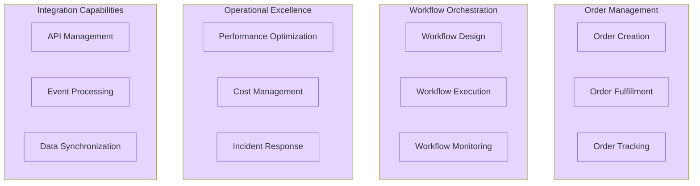

#### Value Stream Map

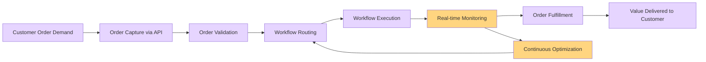

---

### Data Architecture

#### Purpose
The Data Architecture layer defines how data flows through the system, how workflow state is persisted in Azure Storage, and how monitoring and observability data is collected, processed, and analyzed to support operational excellence. This layer emphasizes event-driven data patterns with Service Bus for messaging and Azure Storage for durable workflow state management.

#### Process (High-Level)
Data flows through **ingestion** (orders via API, events via Service Bus), **processing** (workflow execution with stateful checkpoints, business logic validation), **storage** (Azure Storage for workflow state persistence, Application Insights for telemetry), and **governance** (monitoring, alerting, cost optimization). The architecture supports both workflow state data (checkpoints, execution history) and observability data (metrics, logs, distributed traces).

#### Master Data Management (MDM)

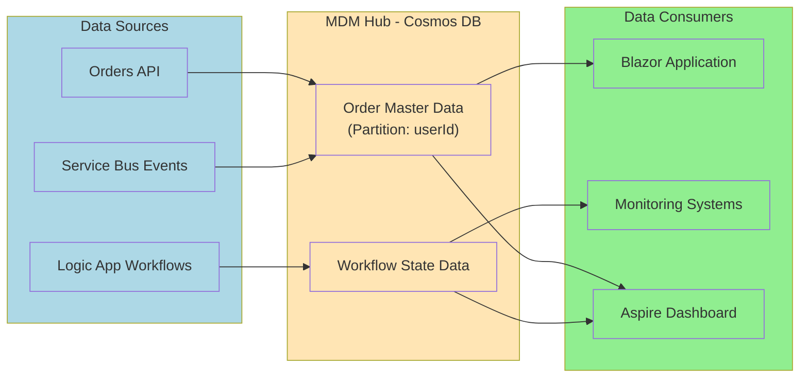

#### Event-Driven Data Topology

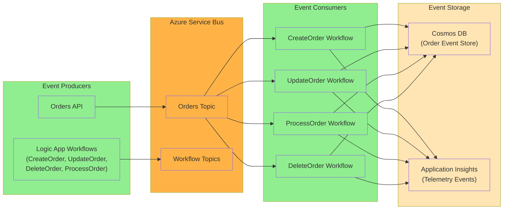

#### Monitoring Dataflow

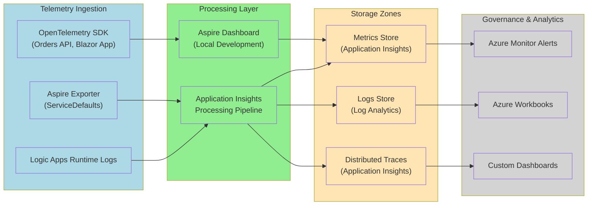

---

### Application Architecture

#### Purpose
The Application Architecture layer defines the **services, APIs, workflows, and their interactions** that implement business capabilities. It focuses on microservices patterns with .NET Aspire orchestration, event-driven architecture using Azure Service Bus, and Logic Apps workflow orchestration for long-running business processes.

#### Process (High-Level)
Applications are organized as **microservices** (Orders API with Minimal APIs, Blazor App with WebAssembly client) orchestrated through **.NET Aspire AppHost** with service discovery and configuration management. Integration occurs via **event-driven patterns** using Azure Service Bus topics and subscriptions. Logic Apps workflows consume events, execute long-running stateful processes (18-36 months), and persist state to Azure Storage. All components are instrumented with OpenTelemetry for distributed tracing and observability.

#### Microservices Architecture

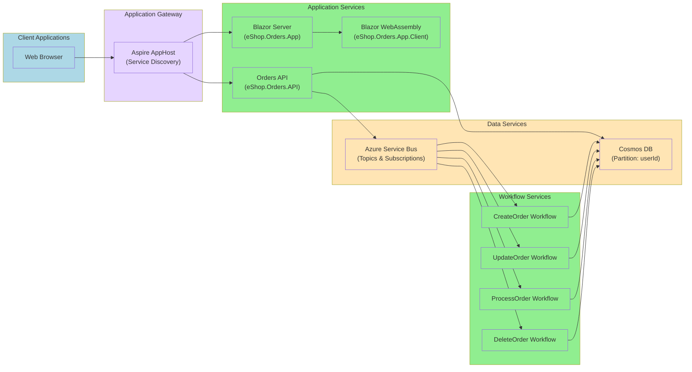

#### Event-Driven Architecture

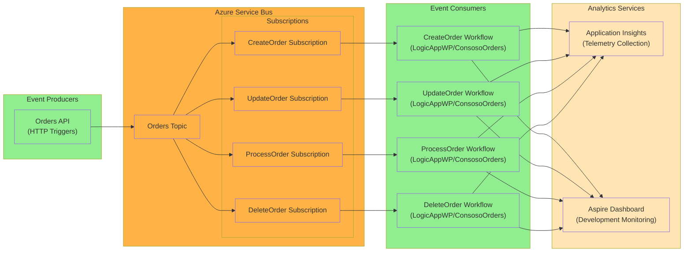

#### Event State Transitions

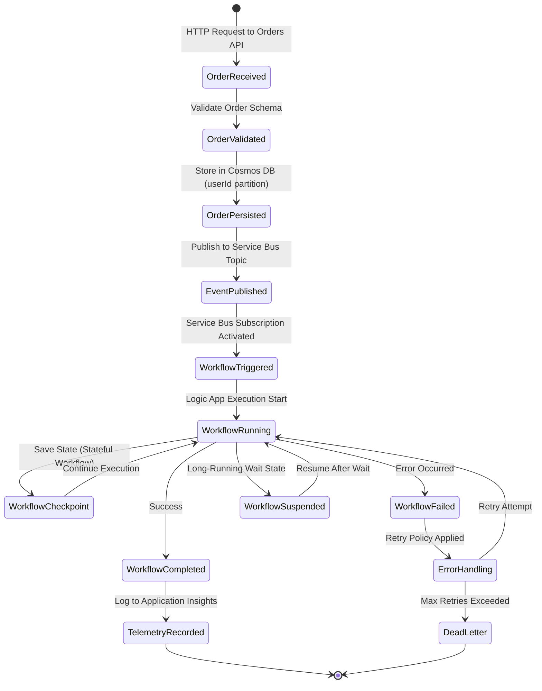

---

### Technology Architecture

#### Purpose
The Technology Architecture layer defines the **platforms, infrastructure, runtime environments, and supporting services** that host and operate the application components. It focuses on cloud-native patterns with Azure Container Apps, containerization with Docker, serverless computing with Logic Apps Standard, and platform engineering practices with .NET Aspire and Infrastructure-as-Code (Bicep).

#### Process (High-Level)
The solution runs on **Azure Container Apps** for microservices and containerized Logic Apps with automatic scaling, uses **.NET Aspire** for local orchestration, service defaults, and telemetry aggregation, leverages **Azure PaaS services** (Azure Storage for workflow state, Service Bus with topics/subscriptions, Application Insights with OpenTelemetry), and implements **platform engineering** practices with Bicep IaC, CI/CD pipelines, and golden path patterns through ServiceDefaults.

#### Cloud-Native Platform

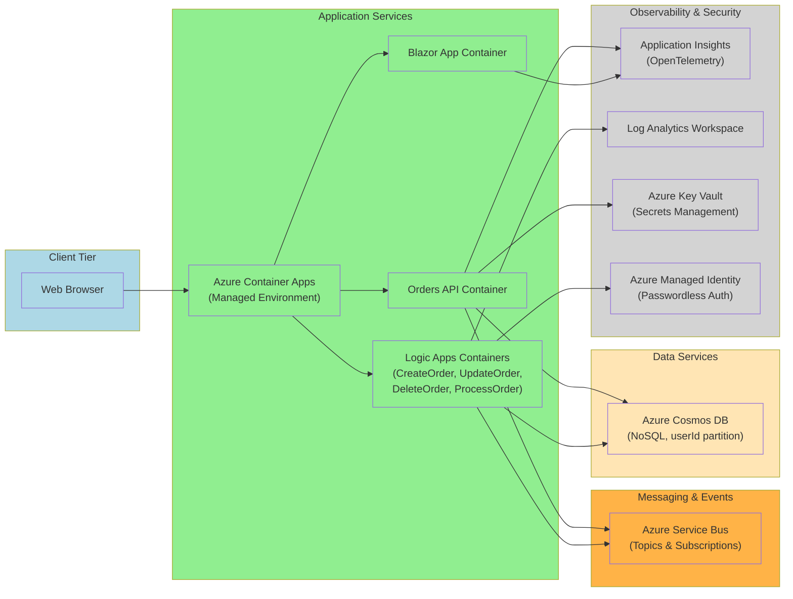

#### Container-Based Architecture

```mermaid
flowchart TB
    subgraph LoadBalancer["Load Balancer"]
        Ingress["Azure Container Apps Ingress<br/>(HTTP/HTTPS)"]
    end
    
    subgraph ContainerEnvironment["Container Apps Environment"]
        subgraph Services["Container Apps Services"]
            OrdersAPISvc["Orders API Service"]
            BlazorAppSvc["Blazor App Service"]
            LogicAppsSvc["Logic Apps Service"]
        end
        
        subgraph Workloads["Container Workloads"]
            subgraph OrdersAPIPods["Orders API Replicas"]
                OrdersAPI1["API Replica 1"]
                OrdersAPI2["API Replica 2"]
            end
            
            subgraph BlazorAppPods["Blazor App Replicas"]
                BlazorApp1["App Replica 1"]
                BlazorApp2["App Replica 2"]
            end
            
            subgraph LogicAppPods["Logic Apps Replicas"]
                LogicApp1["CreateOrder Instance"]
                LogicApp2["UpdateOrder Instance"]
                LogicApp3["ProcessOrder Instance"]
                LogicApp4["DeleteOrder Instance"]
            end
        end
    end
    
    subgraph PersistentStorage["Persistent Storage"]
        CosmosDB["Cosmos DB<br/>(userId partition)"]
    end
    
    subgraph ObservabilityPlatform["Observability"]
        AppInsights["Application Insights"]
        LogAnalytics["Log Analytics"]
        AspireDashboard["Aspire Dashboard<br/>(Development)"]
    end
    
    Ingress --> OrdersAPISvc
    Ingress --> BlazorAppSvc
    
    OrdersAPISvc --> OrdersAPI1
    OrdersAPISvc --> OrdersAPI2
    
    BlazorAppSvc --> BlazorApp1
    BlazorAppSvc --> BlazorApp2
    
    LogicAppsSvc --> LogicApp1
    LogicAppsSvc --> LogicApp2
    LogicAppsSvc --> LogicApp3
    LogicAppsSvc --> LogicApp4
    
    OrdersAPI1 --> CosmosDB
    OrdersAPI2 --> CosmosDB
    LogicApp1 --> CosmosDB
    LogicApp2 --> CosmosDB
    LogicApp3 --> CosmosDB
    LogicApp4 --> CosmosDB
    
    OrdersAPI1 --> AppInsights
    OrdersAPI2 --> AppInsights
    BlazorApp1 --> AppInsights
    BlazorApp2 --> AppInsights
    LogicApp1 --> LogAnalytics
    LogicApp2 --> LogAnalytics
    LogicApp3 --> LogAnalytics
    LogicApp4 --> LogAnalytics
    
    OrdersAPISvc --> AspireDashboard
    BlazorAppSvc --> AspireDashboard
    LogicAppsSvc --> AspireDashboard
    
    style LoadBalancer fill:#E6D5FF
    style ContainerEnvironment fill:#90EE90
    style Services fill:#90EE90
    style Workloads fill:#90EE90
    style PersistentStorage fill:#FFE5B4
    style ObservabilityPlatform fill:#D3D3D3
    style Ingress fill:#E6D5FF
    style OrdersAPISvc fill:#90EE90
    style BlazorAppSvc fill:#90EE90
    style LogicAppsSvc fill:#90EE90
    style OrdersAPIPods fill:#90EE90
    style BlazorAppPods fill:#90EE90
    style LogicAppPods fill:#90EE90
    style OrdersAPI1 fill:#90EE90
    style OrdersAPI2 fill:#90EE90
    style BlazorApp1 fill:#90EE90
    style BlazorApp2 fill:#90EE90
    style LogicApp1 fill:#90EE90
    style LogicApp2 fill:#90EE90
    style LogicApp3 fill:#90EE90
    style LogicApp4 fill:#90EE90
    style CosmosDB fill:#FFE5B4
    style AppInsights fill:#D3D3D3
    style LogAnalytics fill:#D3D3D3
    style AspireDashboard fill:#D3D3D3
```

#### Serverless Architecture

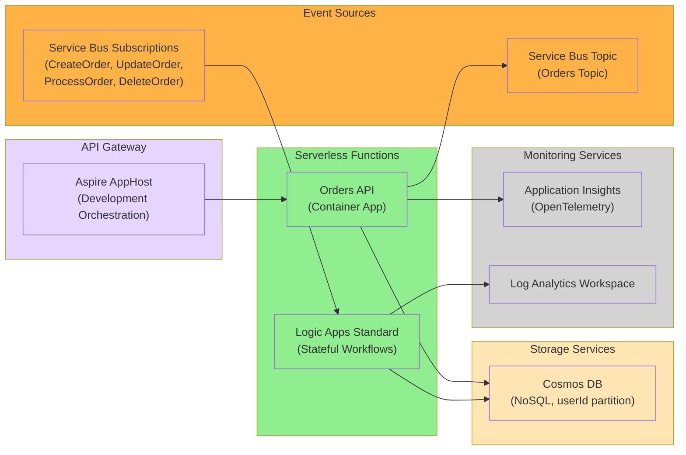

#### Platform Engineering

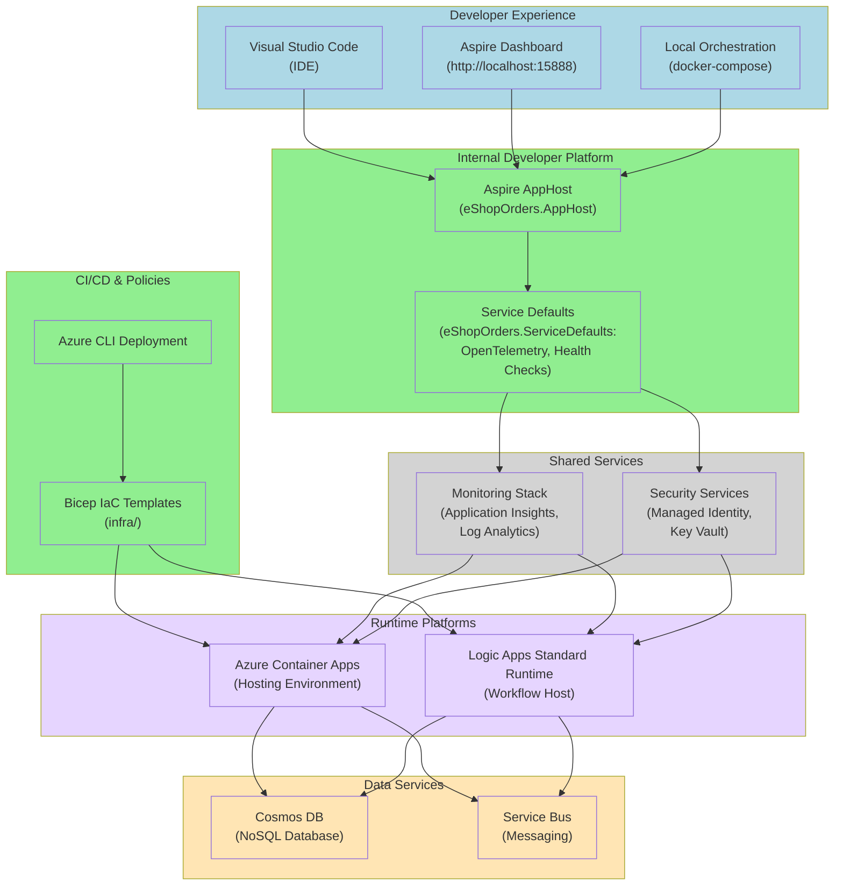

---

## Deployment

### Prerequisites

Before deploying this solution, ensure you have the following tools and access configured:

- **[.NET 10 SDK](https://dotnet.microsoft.com/download/dotnet/10.0)** or later
- **[Azure CLI](https://docs.microsoft.com/cli/azure/install-azure-cli)** version 2.50.0 or later
- **[Azure Developer CLI (azd)](https://learn.microsoft.com/azure/developer/azure-developer-cli/install-azd)** for streamlined deployment
- **[Docker Desktop](https://www.docker.com/products/docker-desktop)** for local development and containerization
- **[Visual Studio Code](https://code.visualstudio.com/)** with the following extensions:
  - [Azure Account](https://marketplace.visualstudio.com/items?itemName=ms-vscode.azure-account)
  - [Azure Resources](https://marketplace.visualstudio.com/items?itemName=ms-azuretools.vscode-azureresourcegroups)
  - [Azure Logic Apps Standard](https://marketplace.visualstudio.com/items?itemName=ms-azuretools.vscode-azurelogicapps)
  - [C# Dev Kit](https://marketplace.visualstudio.com/items?itemName=ms-dotnettools.csdevkit)
  - [Azure Storage](https://marketplace.visualstudio.com/items?itemName=ms-azuretools.vscode-azurestorage)
- **Active Azure subscription** with appropriate permissions (see RBAC roles below)
- **Azurite** (optional, for local Azure Storage emulation): [Download](https://learn.microsoft.com/azure/storage/common/storage-use-azurite)

### Azure RBAC Roles

The following Azure RBAC roles are required for deploying and operating this solution:

| Role Name | Description | Documentation Link |
|-----------|-------------|-------------------|
| **Contributor** | Required for provisioning Azure resources (Container Apps, Azure Storage, Service Bus, Application Insights) | [Azure Contributor role](https://learn.microsoft.com/azure/role-based-access-control/built-in-roles#contributor) |
| **User Access Administrator** | Required for assigning managed identities and configuring RBAC for services | [User Access Administrator role](https://learn.microsoft.com/azure/role-based-access-control/built-in-roles#user-access-administrator) |
| **Logic Apps Contributor** | Required for deploying and managing Logic Apps workflows | [Logic Apps Contributor role](https://learn.microsoft.com/azure/role-based-access-control/built-in-roles#logic-app-contributor) |
| **Azure Service Bus Data Owner** | Required for Service Bus topic and subscription management with managed identity | [Service Bus Data Owner role](https://learn.microsoft.com/azure/role-based-access-control/built-in-roles#azure-service-bus-data-owner) |
| **Storage Blob Data Contributor** | Required for Logic Apps workflow state persistence to Azure Storage | [Storage Blob Data Contributor role](https://learn.microsoft.com/azure/role-based-access-control/built-in-roles#storage-blob-data-contributor) |
| **Monitoring Metrics Publisher** | Required for publishing custom metrics to Application Insights | [Monitoring Metrics Publisher role](https://learn.microsoft.com/azure/role-based-access-control/built-in-roles#monitoring-metrics-publisher) |

### Infrastructure Deployment

Deploy the Azure infrastructure using Azure Developer CLI (`azd`) with the following steps:

1. **Initialize the Azure Developer CLI environment**:
   ```bash
   azd init
   ```
   
   This command configures the solution for your Azure subscription and sets up environment variables.

2. **Authenticate with Azure**:
   ```bash
   azd auth login
   ```

3. **Provision Azure resources**:
   ```bash
   azd provision
   ```
   
   This command will:
   - Prompt you to select an Azure subscription
   - Ask for resource group name and Azure region
   - Deploy the main.bicep infrastructure template

4. **Set environment-specific parameters** (optional):
   ```bash
   # For development environment
   azd env set ENVIRONMENT_NAME dev
   
   # For production environment
   azd env set ENVIRONMENT_NAME prod
   ```

5. **Deploy infrastructure with parameters**:
   ```bash
   azd provision --environment dev
   ```
   
   This command will:
   - Create a resource group in the specified region
   - Deploy Azure Container Apps environment with scale rules
   - Provision Application Insights and Log Analytics workspace with OpenTelemetry support
   - Create Azure Storage Account for Logic Apps workflow state (blob and table storage)
   - Deploy Azure Service Bus namespace with topics (`orders`) and subscriptions (`CreateOrder`, `UpdateOrder`, `DeleteOrder`, `ProcessOrder`)
   - Configure Azure Key Vault for connection string management
   - Set up managed identities for passwordless authentication
   - Assign RBAC roles for service-to-service communication

6. **Verify deployment**:
   ```bash
   azd show
   ```
   
   This displays the provisioned resources and their endpoints.

### Application Deployment

Deploy the application services, Logic Apps workflows, and supporting infrastructure to Azure.

1. **Build and deploy all services**:
   ```bash
   azd deploy
   ```
   
   This command will:
   - Build Docker images for:
     - Orders API (ASP.NET Core Minimal APIs)
     - Blazor App (Server + WebAssembly Client)
     - Logic Apps Standard (ContosoOrders workflows)
   - Push images to Azure Container Registry
   - Deploy containers to Azure Container Apps with:
     - Environment variables from Key Vault
     - Managed identity configuration
     - Auto-scaling rules (min 1, max 10 replicas)
   - Configure Service Bus triggers for Logic Apps workflows
   - Enable Application Insights instrumentation with OpenTelemetry

2. **Deploy individual services** (optional):
   ```bash
   # Deploy only the Orders API
   azd deploy orders-api
   
   # Deploy only the Blazor App
   azd deploy blazor-app
   
   # Deploy only Logic Apps workflows
   azd deploy logicapps
   ```

3. **Verify deployment and access endpoints**:
   ```bash
   # Get the Orders API endpoint
   azd show --output json | jq -r '.services."orders-api".endpoints[0]'
   
   # Get the Blazor App endpoint
   azd show --output json | jq -r '.services."blazor-app".endpoints[0]'
   ```
   
   Navigate to the Blazor App URL to access the user interface.

4. **Local development with .NET Aspire**:
   
   For local development with full observability:
   
   ```bash
   # Option 1: Using .NET Aspire AppHost
   cd eShopOrders.AppHost
   dotnet run
   
   # Option 2: Using Docker Compose
   docker-compose up
   ```
   
   Access the **Aspire Dashboard** at `http://localhost:15888` to:
   - View all running services with health status
   - Monitor distributed traces across services
   - View metrics and logs in real-time
   - Test Service Bus message publishing and consumption

---

## Usage Examples

### Order Management Operations

#### Creating an Order

**Using the Orders API**:

```bash
# Create a new order
curl -X POST https://<orders-api-endpoint>/api/orders \
  -H "Content-Type: application/json" \
  -d '{
    "userId": "user123",
    "items": [
      { "productId": "prod-001", "quantity": 2, "price": 29.99 }
    ],
    "totalAmount": 59.98
  }'
```

**Using the Blazor UI**:
1. Navigate to the Blazor App URL
2. Click **Create Order**
3. Fill in order details (user ID, items, quantities)
4. Click **Submit** to trigger the CreateOrder workflow

#### Updating an Order

```bash
curl -X PUT https://<orders-api-endpoint>/api/orders/{orderId} \
  -H "Content-Type: application/json" \
  -d '{
    "status": "Processing",
    "items": [
      { "productId": "prod-001", "quantity": 3, "price": 29.99 }
    ]
  }'
```

#### Processing an Order

The ProcessOrder workflow is automatically triggered via Service Bus subscription when an order status changes. Monitor execution in:
- **Aspire Dashboard**: `http://localhost:15888` (local development)
- **Azure Portal**: Navigate to Logic App → Runs history

#### Deleting an Order

```bash
curl -X DELETE https://<orders-api-endpoint>/api/orders/{orderId}
```

### Workflow Monitoring Examples

#### Monitoring Workflow Execution in Aspire Dashboard

When running locally with .NET Aspire:

1. Navigate to `http://localhost:15888`
2. Click on **Traces** to view distributed traces:
   - API request → Service Bus publish → Logic App trigger → Workflow execution
3. Click on **Metrics** to view:
   - Workflow execution count
   - Average execution duration
   - Failure rate by workflow
4. Click on **Logs** and filter by:
   - `WorkflowName == "CreateOrder"`
   - `Status == "Failed"`

#### Monitoring Workflows in Azure Portal

1. Navigate to Azure Portal → Logic Apps
2. Select your Logic App instance
3. Click **Runs history** to view:
   - All workflow executions with timestamp
   - Input/output data for each run
   - Execution duration and status
4. Click on a specific run to view:
   - Action-by-action execution details
   - Retry attempts and failures
   - Correlation ID for end-to-end tracing

### Kusto Queries for Logic Apps Monitoring

#### Query: Workflow Execution Summary (Last 24 Hours)

```kql
// Workflow execution summary with success/failure counts
AppTraces
| where TimeGenerated > ago(24h)
| where Properties.Category == "Microsoft.Azure.Workflows.Runtime"
| where Properties.WorkflowName in ("CreateOrder", "UpdateOrder", "ProcessOrder", "DeleteOrder")
| summarize 
    TotalRuns = count(),
    SuccessfulRuns = countif(Properties.Status == "Succeeded"),
    FailedRuns = countif(Properties.Status == "Failed"),
    AvgDurationMs = avg(todouble(Properties.DurationMs))
    by WorkflowName = tostring(Properties.WorkflowName)
| order by TotalRuns desc
```

#### Query: Failed Workflow Runs with Error Details

```kql
// Failed workflow runs with error messages
AppTraces
| where TimeGenerated > ago(7d)
| where Properties.Category == "Microsoft.Azure.Workflows.Runtime"
| where Properties.Status == "Failed"
| project 
    TimeGenerated,
    WorkflowName = Properties.WorkflowName,
    RunId = Properties.RunId,
    ErrorCode = Properties.ErrorCode,
    ErrorMessage = Properties.ErrorMessage,
    ActionName = Properties.ActionName
| order by TimeGenerated desc
```

#### Query: Long-Running Workflows (Execution Time > 5 minutes)

```kql
// Identify long-running workflow executions
AppTraces
| where TimeGenerated > ago(24h)
| where Properties.Category == "Microsoft.Azure.Workflows.Runtime"
| where Properties.Status == "Succeeded"
| extend DurationMinutes = todouble(Properties.DurationMs) / 60000
| where DurationMinutes > 5
| project 
    TimeGenerated,
    WorkflowName = Properties.WorkflowName,
    RunId = Properties.RunId,
    DurationMinutes,
    TriggerName = Properties.TriggerName
| order by DurationMinutes desc
```

#### Query: Workflow Trigger Performance

```kql
// Analyze workflow trigger latency (Service Bus)
AppDependencies
| where TimeGenerated > ago(24h)
| where Type == "Azure Service Bus"
| where Target contains "orders"
| summarize 
    TriggerCount = count(),
    AvgLatencyMs = avg(DurationMs),
    P95LatencyMs = percentile(DurationMs, 95),
    P99LatencyMs = percentile(DurationMs, 99)
    by OperationName
| order by TriggerCount desc
```

#### Query: Workflow Retry Analysis

```kql
// Analyze workflow retry patterns
AppTraces
| where TimeGenerated > ago(7d)
| where Properties.Category == "Microsoft.Azure.Workflows.Runtime"
| where Properties.ActionName has "Retry"
| summarize 
    RetryCount = count(),
    UniqueRuns = dcount(Properties.RunId)
    by 
    WorkflowName = tostring(Properties.WorkflowName),
    ActionName = tostring(Properties.ActionName)
| order by RetryCount desc
```

#### Query: Service Bus Dead Letter Queue Monitoring

```kql
// Monitor messages moved to dead letter queue
AppTraces
| where TimeGenerated > ago(24h)
| where Properties contains "DeadLetter"
| project 
    TimeGenerated,
    WorkflowName = Properties.WorkflowName,
    MessageId = Properties.MessageId,
    Reason = Properties.Reason,
    ErrorDescription = Properties.ErrorDescription
| order by TimeGenerated desc
```

#### Query: Distributed Trace Analysis (API → Service Bus → Workflow)

```kql
// End-to-end trace correlation across services
AppDependencies
| where TimeGenerated > ago(1h)
| where Type == "HTTP" or Type == "Azure Service Bus"
| join kind=inner (
    AppTraces
    | where Properties.Category == "Microsoft.Azure.Workflows.Runtime"
) on $left.OperationId == $right.OperationId
| project 
    TimeGenerated,
    OperationId,
    ServiceName = AppDependencies_Name,
    DependencyType = Type,
    WorkflowName = Properties.WorkflowName,
    TotalDurationMs = DurationMs
| order by TimeGenerated desc
```

---

## Monitoring and Observability

### .NET Aspire Dashboard

The [Aspire Dashboard](https://aspire.dev/dashboard/overview/) provides a comprehensive local development monitoring experience at `http://localhost:15888` with the following capabilities:

#### Key Features:
- **Service Health**: Real-time health status for all registered services (Orders API, Blazor App, Logic Apps)
- **Distributed Tracing**: End-to-end request tracing across services with correlation IDs
- **Metrics Visualization**: Custom metrics from OpenTelemetry (workflow execution counts, durations, failure rates)
- **Log Aggregation**: Centralized logs from all services with filtering and search
- **Resource Monitoring**: CPU, memory, and network usage for containerized services

#### Accessing the Dashboard:
1. Start the Aspire AppHost:
   ```bash
   cd eShopOrders.AppHost
   dotnet run
   ```
2. Navigate to `http://localhost:15888`
3. Explore:
   - **Traces**: View distributed traces across API → Service Bus → Logic Apps
   - **Metrics**: Analyze workflow execution metrics
   - **Logs**: Search logs by service, severity, or custom properties
   - **Resources**: Monitor container resource consumption

### Application Insights Integration

Application Insights is configured via Extensions.cs with OpenTelemetry instrumentation for:

#### Telemetry Collection:
- **Distributed Tracing**: Automatic trace correlation across services using W3C Trace Context
- **Custom Metrics**: Workflow-specific metrics (execution count, duration, success/failure rates)
- **Request Telemetry**: HTTP request tracking with response times and status codes
- **Dependency Telemetry**: External dependencies (Service Bus, Cosmos DB, Azure Storage)
- **Exception Telemetry**: Unhandled exceptions with stack traces and contextual information

#### Configuration:
The solution uses the [`Azure.Monitor.OpenTelemetry.AspNetCore`](https://learn.microsoft.com/dotnet/api/overview/azure/monitor?view=azure-dotnet) package for automatic instrumentation. All services inherit from `ServiceDefaults`, which configures:
- Application Insights connection string (from Azure Key Vault)
- Sampling rates for telemetry (100% for development, adaptive for production)
- Custom resource attributes (service name, version, environment)
- Health check endpoints for proactive monitoring

### Logic Apps Workflow Monitoring Best Practices

Monitor Azure Logic Apps Standard workflows using the guidance from [Monitor Logic Apps](https://learn.microsoft.com/azure/logic-apps/monitor-logic-apps).

#### Best Practice 1: Enable Diagnostic Settings

Configure diagnostic settings to route workflow runtime logs to Log Analytics:

```bash
az monitor diagnostic-settings create \
  --name logic-app-diagnostics \
  --resource /subscriptions/{subscription-id}/resourceGroups/{rg-name}/providers/Microsoft.Web/sites/{logic-app-name} \
  --workspace /subscriptions/{subscription-id}/resourceGroups/{rg-name}/providers/Microsoft.OperationalInsights/workspaces/{workspace-name} \
  --logs '[{"category":"WorkflowRuntime","enabled":true}]' \
  --metrics '[{"category":"AllMetrics","enabled":true}]'
```

#### Best Practice 2: Implement Correlation IDs

Use correlation IDs to trace requests across services and workflows:

```kql
// Trace request flow using correlation ID
AppRequests
| where TimeGenerated > ago(1h)
| where Name == "POST /api/orders"
| join kind=inner (
    AppTraces
    | where Properties.Category == "Microsoft.Azure.Workflows.Runtime"
) on $left.OperationId == $right.OperationId
| project TimeGenerated, RequestName = Name, WorkflowName = Properties.WorkflowName, OperationId
```

#### Best Practice 3: Monitor Long-Running Workflows

For workflows executing 18-36 months:
- **Checkpoint Monitoring**: Track state checkpoints to ensure workflow progress
- **Heartbeat Metrics**: Implement periodic heartbeat signals
- **State Persistence**: Verify Azure Storage connectivity for state management
- **Resource Limits**: Monitor workflow instance count and memory usage

```kql
// Monitor workflow checkpoint frequency
AppTraces
| where Properties.Category == "Microsoft.Azure.Workflows.Runtime"
| where Properties.EventName == "WorkflowCheckpoint"
| summarize CheckpointCount = count() by bin(TimeGenerated, 1h), WorkflowName = tostring(Properties.WorkflowName)
| render timechart
```

#### Best Practice 4: Set Up Proactive Alerts

Configure Azure Monitor alerts for critical workflow conditions:

```bash
# Alert for workflow failures exceeding threshold
az monitor metrics alert create \
  --name workflow-failure-alert \
  --resource-group {rg-name} \
  --scopes /subscriptions/{subscription-id}/resourceGroups/{rg-name}/providers/Microsoft.Web/sites/{logic-app-name} \
  --condition "count WorkflowRunsFailureRate > 10" \
  --window-size 5m \
  --evaluation-frequency 1m \
  --severity 2 \
  --description "Alert when workflow failure rate exceeds 10% over 5 minutes"

# Alert for long-running workflow delays
az monitor metrics alert create \
  --name workflow-duration-alert \
  --resource-group {rg-name} \
  --scopes /subscriptions/{subscription-id}/resourceGroups/{rg-name}/providers/Microsoft.Web/sites/{logic-app-name} \
  --condition "avg RunsDuration > 300000" \
  --window-size 15m \
  --evaluation-frequency 5m \
  --severity 3 \
  --description "Alert when average workflow duration exceeds 5 minutes"
```

#### Best Practice 5: Optimize Workflow Hosting Density

Follow these patterns to safely exceed the baseline ~20 workflows per Logic App instance:

- **Resource Quotas**: Set CPU and memory limits per workflow in Container Apps
- **Workflow Isolation**: Group workflows by execution pattern (short vs. long-running)
- **Scaling Strategy**: Configure horizontal scaling (1-10 replicas) based on queue depth
- **State Management**: Ensure Azure Storage has sufficient IOPS for checkpoint operations
- **Monitoring**: Track per-workflow memory consumption to identify optimization opportunities

```kql
// Monitor workflow memory consumption patterns
AppMetrics
| where TimeGenerated > ago(24h)
| where Name == "WorkflowMemoryUsageMB"
| summarize 
    AvgMemoryMB = avg(Sum),
    MaxMemoryMB = max(Sum),
    P95MemoryMB = percentile(Sum, 95)
    by WorkflowName = tostring(Properties.WorkflowName)
| order by P95MemoryMB desc
```

---

## References

### Azure Logic Apps Documentation
- [Monitor Logic Apps](https://learn.microsoft.com/azure/logic-apps/monitor-logic-apps)
- [Logic Apps Standard Overview](https://learn.microsoft.com/azure/logic-apps/single-tenant-overview-compare)
- [Create stateful or stateless workflows](https://learn.microsoft.com/azure/logic-apps/create-single-tenant-workflows-azure-portal)
- [Edit host and app settings for Logic Apps](https://learn.microsoft.com/azure/logic-apps/edit-app-settings-host-settings)
- [Manage Logic Apps in Azure Portal](https://learn.microsoft.com/azure/logic-apps/manage-logic-apps-with-azure-portal)

### Azure Monitoring & Observability
- [Azure Monitor Overview](https://learn.microsoft.com/azure/azure-monitor/overview)
- [Application Insights for .NET](https://learn.microsoft.com/dotnet/api/overview/azure/monitor?view=azure-dotnet)
- [OpenTelemetry in Azure Monitor](https://learn.microsoft.com/azure/azure-monitor/app/opentelemetry-data-collection)
- [Kusto Query Language (KQL) Reference](https://learn.microsoft.com/azure/data-explorer/kusto/query/)
- [Azure Monitor Workbooks](https://learn.microsoft.com/azure/azure-monitor/visualize/workbooks-overview)
- [Operational Excellence Monitoring](https://learn.microsoft.com/azure/well-architected/operational-excellence/monitoring)

### .NET Aspire
- [.NET Aspire Dashboard Overview](https://aspire.dev/dashboard/overview/)
- [.NET Aspire Service Defaults](https://learn.microsoft.com/dotnet/aspire/fundamentals/service-defaults)
- [.NET Aspire App Host](https://learn.microsoft.com/dotnet/aspire/fundamentals/app-host-overview)
- [.NET Aspire Telemetry](https://learn.microsoft.com/dotnet/aspire/fundamentals/telemetry)
- [Distributed tracing with .NET Aspire](https://learn.microsoft.com/dotnet/aspire/fundamentals/distributed-tracing)

### Azure Container Apps
- [Azure Container Apps Overview](https://learn.microsoft.com/azure/container-apps/overview)
- [Scaling in Azure Container Apps](https://learn.microsoft.com/azure/container-apps/scale-app)
- [Manage secrets in Azure Container Apps](https://learn.microsoft.com/azure/container-apps/manage-secrets)
- [Monitoring Azure Container Apps](https://learn.microsoft.com/azure/container-apps/observability)

### Azure Services
- [Azure Service Bus Overview](https://learn.microsoft.com/azure/service-bus-messaging/service-bus-messaging-overview)
- [Azure Cosmos DB Hierarchical Partition Keys](https://learn.microsoft.com/azure/cosmos-db/hierarchical-partition-keys)
- [Azure Storage for Logic Apps](https://learn.microsoft.com/azure/logic-apps/logic-apps-enterprise-integration-create-integration-account)
- [Azure Key Vault for developers](https://learn.microsoft.com/azure/key-vault/general/developers-guide)
- [Azure Managed Identity](https://learn.microsoft.com/azure/active-directory/managed-identities-azure-resources/overview)

### Azure Well-Architected Framework
- [Well-Architected Framework Overview](https://learn.microsoft.com/azure/well-architected/)
- [Operational Excellence Pillar](https://learn.microsoft.com/azure/well-architected/operational-excellence/)
- [Performance Efficiency Pillar](https://learn.microsoft.com/azure/well-architected/performance-efficiency/)
- [Cost Optimization Pillar](https://learn.microsoft.com/azure/well-architected/cost-optimization/)
- [Reliability Pillar](https://learn.microsoft.com/azure/well-architected/reliability/)

### Infrastructure as Code
- [Azure Bicep Documentation](https://learn.microsoft.com/azure/azure-resource-manager/bicep/)
- [Azure Developer CLI (azd)](https://learn.microsoft.com/azure/developer/azure-developer-cli/)
- [Bicep Best Practices](https://learn.microsoft.com/azure/azure-resource-manager/bicep/best-practices)

---

**Last Updated**: December 16, 2025  
**Solution Version**: 1.0  
**Maintained By**: Enterprise Architecture Team