# Azure Logic Apps Standard - Enterprise Monitoring & Observability Solution

[](https://azure.microsoft.com)
[](https://azure.microsoft.com/en-us/services/logic-apps/)
[](https://learn.microsoft.com/en-us/dotnet/aspire/)
[](https://opentelemetry.io/)

## Project Overview

This solution addresses critical challenges faced by enterprise organizations deploying Azure Logic Apps Standard at scale. When operating thousands of workflows globally, organizations encounter memory spikes, workflow instability, and significant cost overruns that can exceed **US$80,000 annually per environment**. Microsoft's current guidance recommends approximately 20 workflows per Logic App instance and up to 64 apps per App Service Plan, but enterprises exceeding these limits—particularly with 64-bit support enabled—experience degraded performance and reliability issues.

This reference architecture provides a comprehensive solution for **enterprise-scale Logic Apps deployments** that optimizes workflow hosting density while maintaining stability and cost-effectiveness. It demonstrates how to successfully run long-running workflows (18-36 months) without compromising system reliability or incurring excessive infrastructure costs. The solution leverages **Azure Monitor**, **Application Insights**, **.NET Aspire**, and **OpenTelemetry** to provide deep observability into workflow execution, resource utilization, and system health.

Built on the **Azure Well-Architected Framework**, this solution implements proven patterns for monitoring, observability, and operational excellence. It includes infrastructure-as-code (Bicep), containerized microservices, event-driven architecture with Azure Service Bus, and a complete telemetry pipeline that captures metrics, logs, and distributed traces across all system components. The architecture supports both development and production environments with seamless integration into Azure Container Apps and Logic Apps Standard.

The solution serves as a production-ready reference for platform teams building reliable, observable, and cost-effective workflow orchestration systems at enterprise scale. It demonstrates how to implement comprehensive monitoring without sacrificing performance, how to optimize resource utilization for long-running workflows, and how to achieve operational excellence through structured observability.

## Problem Statement

Enterprise organizations face three critical challenges when deploying Azure Logic Apps Standard at scale:

**Operational Complexity**: Organizations managing thousands of workflows across multiple regions struggle with visibility into workflow health, performance bottlenecks, and resource consumption patterns. Without comprehensive monitoring, identifying the root cause of failures or performance degradation becomes time-consuming and error-prone, leading to extended downtime and business impact.

**Cost Management**: Exceeding Microsoft's recommended deployment densities results in memory pressure, requiring overprovisioning of App Service Plans to maintain stability. This overprovisioning can cost organizations approximately US$80,000 annually per environment, with costs multiplying across development, staging, and production environments. Traditional monitoring approaches lack the granularity needed to optimize resource allocation and identify cost-saving opportunities.

**Reliability at Scale**: Long-running workflows (18-36 months) introduce unique challenges around state management, resource leaks, and gradual performance degradation. Without proper observability into workflow lifecycle, memory usage patterns, and dependency health, organizations experience unpredictable failures that impact business-critical processes and customer experience.

## Key Features

| Feature | Description | Implementation Details |
|---------|-------------|------------------------|
| **Comprehensive Telemetry** | End-to-end distributed tracing across all system components | OpenTelemetry integration with Azure Monitor, capturing metrics, logs, and traces from Logic Apps, APIs, and infrastructure |
| **Real-Time Observability** | Live monitoring dashboards with .NET Aspire | Aspire Dashboard provides real-time visibility into service health, dependencies, and performance metrics with drill-down capabilities |
| **Cost Optimization** | Resource utilization tracking and optimization guidance | Application Insights cost analysis, memory profiling, and workflow density recommendations based on actual telemetry |
| **Infrastructure as Code** | Fully automated deployment with Bicep | Complete Azure infrastructure provisioning including Logic Apps, Service Bus, Container Apps, and monitoring resources |
| **Event-Driven Architecture** | Scalable messaging with Azure Service Bus | Premium Service Bus namespace with managed identity authentication, supporting high-throughput order processing workflows |
| **Container-Native** | Microservices deployed to Azure Container Apps | .NET 10 containerized services with health checks, auto-scaling, and native integration with Azure Monitor |
| **Production-Ready Security** | Managed identities and role-based access control | User-assigned managed identity with least-privilege RBAC assignments across all Azure resources |
| **Developer Experience** | Local development with emulators and hot reload | Service Bus emulator, Application Insights local development, and .NET Aspire for unified development experience |
| **Long-Running Workflow Support** | Optimized for workflows executing 18-36 months | State management patterns, memory leak detection, and workflow health monitoring for extended execution periods |
| **Multi-Environment Support** | Consistent deployment across dev, staging, and prod | Environment-specific configuration management with Azure Developer CLI (azd) integration |

## Solution Components

| Component | Description | Role in Solution |
|-----------|-------------|------------------|
| **eShopOrders.AppHost** | .NET Aspire application host orchestrating all services | Manages service discovery, configuration, and telemetry aggregation across the distributed system |
| **eShopOrders.ServiceDefaults** | Shared telemetry and resilience configuration | Provides OpenTelemetry instrumentation, health checks, and HTTP resilience policies for all services |
| **eShop.Orders.API** | RESTful API for order management and Service Bus integration | Receives orders via HTTP, publishes to Service Bus, and exposes health endpoints for monitoring |
| **eShop.Orders.App** | Blazor Server web application for order visualization | User interface for viewing orders and system health with real-time updates |
| **LogicAppWP/ContosoOrders** | Logic Apps Standard workflows for order processing | Business logic workflows triggered by Service Bus messages with comprehensive telemetry |
| **Infrastructure (infra/)** | Bicep modules for Azure resource provisioning | Deploys monitoring (Log Analytics, App Insights), messaging (Service Bus), services (Container Apps), and workflows (Logic Apps) |
| **Monitoring Module** | Centralized observability infrastructure | Log Analytics workspace with 30-day retention, Application Insights for telemetry, and diagnostic settings for all resources |
| **Messaging Module** | Event-driven communication infrastructure | Service Bus Premium with order queue, workflow storage account, and managed identity authentication |
| **Services Module** | Container hosting platform | Azure Container Registry (Premium), Container Apps Environment with Aspire Dashboard integration |
| **Workflows Module** | Logic Apps Standard hosting | App Service Plan (WorkflowStandard) with elastic scaling (3-20 instances) and Application Insights integration |

## Azure Components

| Azure Service | Description | Role in Solution |
|---------------|-------------|------------------|
|  **Azure Monitor** | Unified monitoring platform for metrics and logs | Aggregates telemetry from all resources, provides querying capabilities, and powers alerting and dashboards |
|  **Application Insights** | Application Performance Management (APM) service | Collects distributed traces, exceptions, and custom telemetry from Logic Apps, APIs, and web applications |
|  **Log Analytics** | Centralized logging and analytics workspace | Stores diagnostic logs, metrics, and traces with KQL query capabilities for analysis and troubleshooting |
|  **Service Bus** | Enterprise messaging service | Premium tier with 16 messaging units, provides reliable message delivery for order processing workflows |
|  **Logic Apps Standard** | Workflow orchestration engine | Hosts business logic workflows with Application Insights integration and elastic scaling capabilities |
|  **Container Apps** | Serverless container hosting platform | Runs microservices with built-in scaling, managed identity support, and .NET Aspire dashboard integration |
|  **Container Registry** | Private container image registry | Premium tier registry for storing and distributing container images with geo-replication support |
|  **Storage Account** | Blob storage for workflow state and diagnostics | Stores Logic Apps runtime data, diagnostic logs, and processed order artifacts |
|  **Managed Identity** | Azure AD identity for resource authentication | User-assigned identity with RBAC permissions for Service Bus, Storage, and Container Registry access |
|  **App Service Plan** | Compute resources for Logic Apps Standard | WorkflowStandard SKU (WS1) with elastic scaling from 3 to 20 instances for workflow execution |

## Project Structure

```
Azure-LogicApps-Monitoring/
├── .azure/                              # Azure Developer CLI configuration
│   ├── config.json                      # azd environment configuration
│   └── dev/                             # Development environment settings
├── .github/                             # GitHub configuration
│   └── workflows/                       # CI/CD pipeline definitions
├── .vscode/                             # VS Code workspace settings
│   ├── launch.json                      # Debug configurations for Logic Apps
│   ├── settings.json                    # Logic Apps Standard extension settings
│   └── tasks.json                       # Build and run tasks
├── eShopOrders.AppHost/                 # .NET Aspire Application Host
│   ├── AppHost.cs                       # Service orchestration and configuration
│   ├── ConfigurationKeys.cs             # Centralized configuration constants
│   ├── eShopOrders.AppHost.csproj       # Project file with Aspire SDK
│   └── infra/                           # Container Apps deployment templates
│       ├── orders-api.tmpl.yaml         # API container app manifest
│       └── orders-webapp.tmpl.yaml      # Web app container app manifest
├── eShopOrders.ServiceDefaults/         # Shared service configuration
│   ├── Extensions.cs                    # OpenTelemetry, health checks, resilience
│   └── eShopOrders.ServiceDefaults.csproj
├── src/                                 # Application source code
│   ├── eShop.Orders.API/                # Orders REST API
│   │   ├── Program.cs                   # API startup with telemetry
│   │   ├── Services/                    # Business logic services
│   │   ├── Middleware/                  # HTTP middleware components
│   │   ├── Dockerfile                   # Container image definition
│   │   └── eShop.Orders.API.csproj      # Project with Azure Service Bus SDK
│   ├── eShop.Orders.App/                # Blazor Server web application
│   │   ├── Program.cs                   # Web app startup with telemetry
│   │   ├── Components/                  # Blazor components
│   │   └── eShop.Orders.App.csproj
│   └── eShop.Orders.App.Client/         # Blazor WebAssembly client
│       └── Program.cs
├── LogicAppWP/                          # Logic Apps Standard workspace
│   ├── ContosoOrders/                   # Order processing workflows
│   │   ├── workflow.json                # Workflow definition
│   │   └── connections.json             # Service Bus connection configuration
│   ├── host.json                        # Functions host configuration
│   ├── local.settings.json              # Local development settings
│   └── .funcignore                      # Files excluded from deployment
├── infra/                               # Azure infrastructure (Bicep)
│   ├── main.bicep                       # Main orchestrator (subscription scope)
│   ├── types.bicep                      # Shared type definitions
│   ├── monitoring/                      # Observability infrastructure
│   │   ├── main.bicep                   # Monitoring module orchestrator
│   │   ├── log-analytics-workspace.bicep # Log Analytics + Storage
│   │   ├── app-insights.bicep           # Application Insights
│   │   └── azure-monitor-health-model.bicep # Health model hierarchy
│   └── workload/                        # Application infrastructure
│       ├── main.bicep                   # Workload module orchestrator
│       ├── identity/                    # Managed identity + RBAC
│       │   └── main.bicep
│       ├── messaging/                   # Service Bus + Storage
│       │   ├── main.bicep
│       │   ├── service-bus.bicep
│       │   ├── storage-account.bicep
│       │   └── blob-container.bicep
│       ├── services/                    # Container infrastructure
│       │   ├── main.bicep
│       │   ├── container-registry.bicep
│       │   └── container-apps-environment.bicep
│       └── logic-app.bicep              # Logic Apps Standard + App Service Plan
├── hooks/                               # Azure Developer CLI hooks
│   └── postprovision.ps1                # Post-deployment configuration script
├── azure.yaml                           # Azure Developer CLI project definition
├── docker-compose.yml                   # Local development orchestration
├── docker-compose.override.yml          # Development overrides
├── eShopOrders.sln                      # Visual Studio solution file
├── generate_orders.py                   # Order generation utility
└── README.md                            # This file
```

---

## Architecture

This solution follows the **TOGAF Architecture Development Method (ADM)** framework, organizing the architecture into four distinct layers: Business, Data, Application, and Technology. Each layer builds upon the previous one, creating a cohesive enterprise architecture aligned with the Azure Well-Architected Framework.

---

### Business Architecture

**Purpose**: The Business Architecture layer defines the organizational capabilities, value streams, and business outcomes that the solution enables. It establishes the "why" behind the technical implementation by mapping business processes to technology investments.

**Key Capabilities**:
- **Order Management**: End-to-end order processing from creation through fulfillment
- **Workflow Orchestration**: Complex business logic execution with long-running state management
- **Operational Intelligence**: Real-time visibility into business process health and performance
- **Cost Governance**: Tracking and optimization of infrastructure spend against business value
- **Reliability Engineering**: Ensuring business continuity through proactive monitoring and alerting

#### Business Capability Map

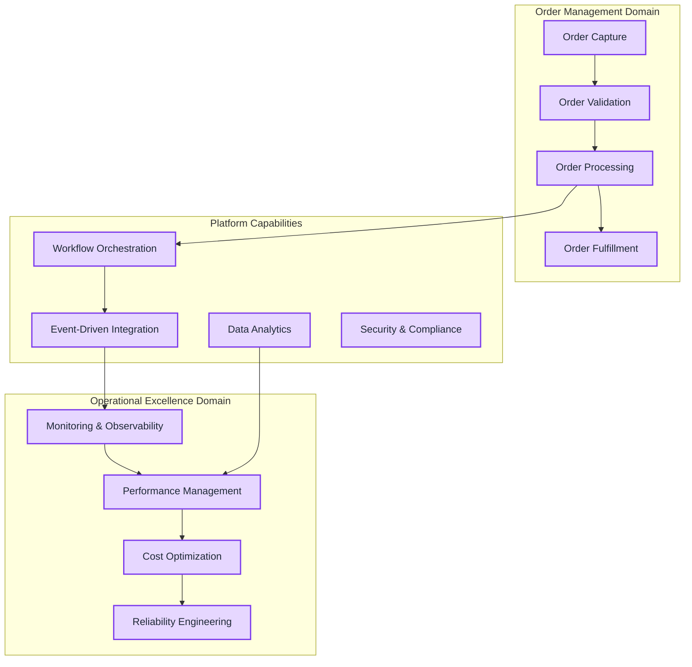

#### Value Stream Map

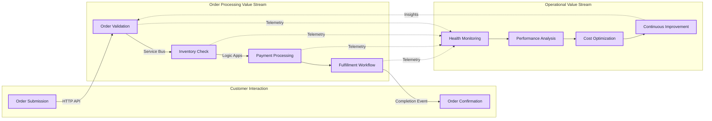

---

### Data Architecture

**Purpose**: The Data Architecture layer defines how data flows through the system, how it is stored, transformed, and accessed for operational and analytical purposes. It ensures data consistency, quality, and governance across all system components.

**Key Capabilities**:
- **Event Streaming**: Real-time order events via Azure Service Bus
- **Telemetry Pipeline**: Metrics, logs, and traces collected via OpenTelemetry
- **Analytical Storage**: Time-series data in Log Analytics for historical analysis
- **State Management**: Workflow state persistence in Azure Storage
- **Master Data**: Configuration and metadata management

#### Master Data Management (MDM)

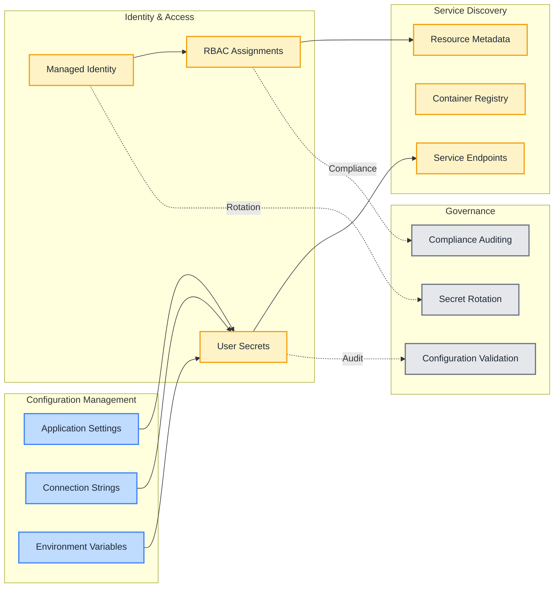

#### Event-Driven Data Topology

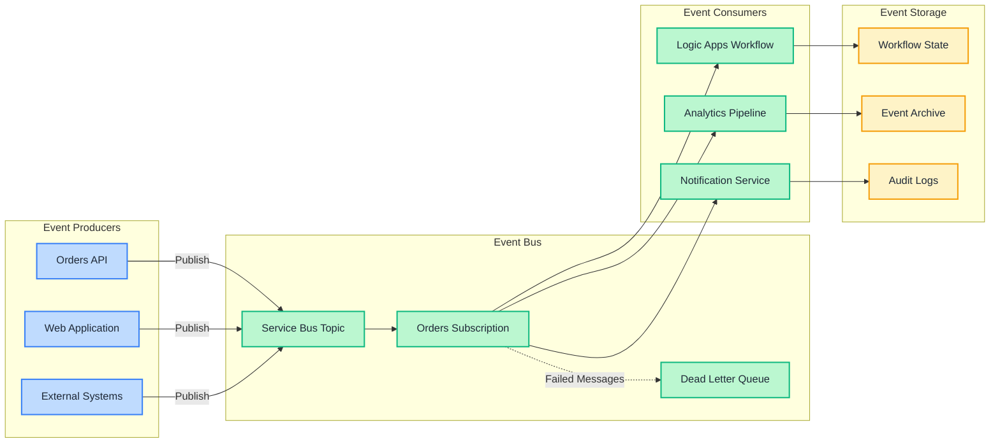

#### Monitoring Dataflow

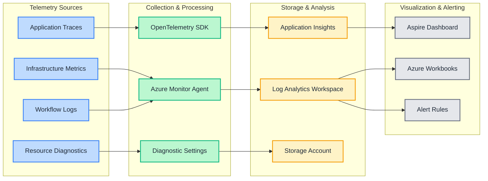

---

### Application Architecture

**Purpose**: The Application Architecture layer defines the software components, their interactions, and the patterns used to implement business capabilities. It establishes service boundaries, communication protocols, and integration patterns.

**Key Capabilities**:
- **RESTful API Services**: HTTP-based order management endpoints
- **Event-Driven Workflows**: Asynchronous order processing via Service Bus
- **Web User Interface**: Real-time order visualization with Blazor
- **Workflow Orchestration**: Complex business logic in Logic Apps Standard
- **Service Discovery**: Dynamic service resolution via .NET Aspire

#### Microservices Architecture

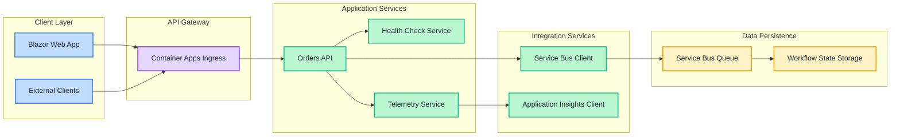

#### Event-Driven Architecture

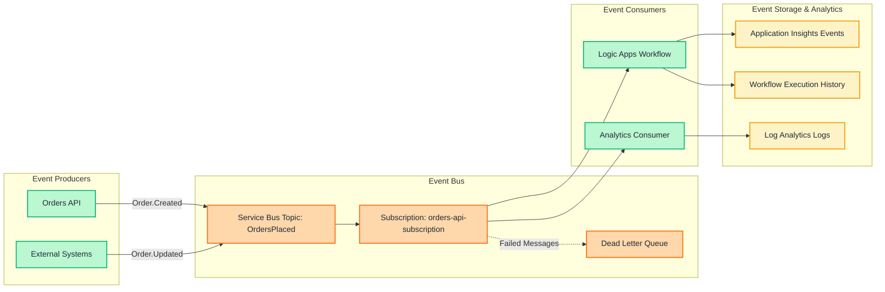

---

### Technology Architecture

**Purpose**: The Technology Architecture layer defines the runtime platforms, infrastructure services, and operational capabilities required to host and operate the application. It establishes deployment patterns, scaling strategies, and operational procedures.

**Key Capabilities**:
- **Container Orchestration**: Azure Container Apps with KEDA auto-scaling
- **Serverless Workflows**: Logic Apps Standard with elastic App Service Plan
- **Message Queuing**: Azure Service Bus Premium with managed identity
- **Observability Platform**: Application Insights + Log Analytics + OpenTelemetry
- **Infrastructure Automation**: Bicep templates with Azure Developer CLI

#### Cloud-Native Architecture

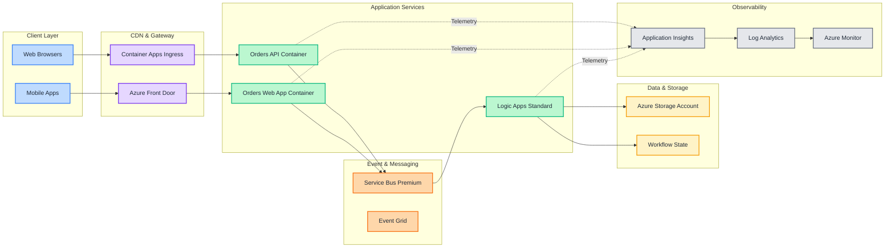

#### Container-Based Architecture

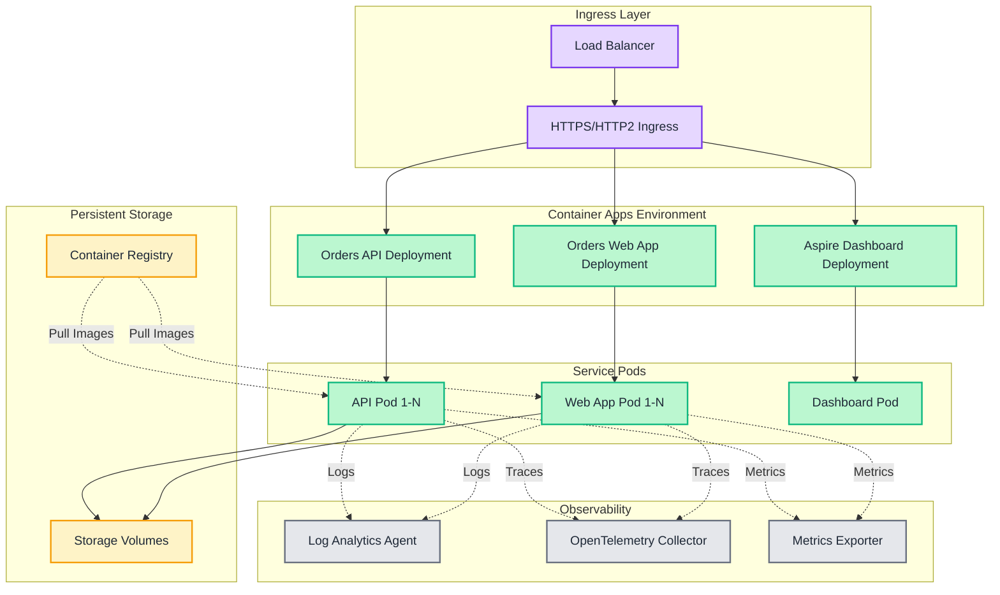

#### Serverless Architecture

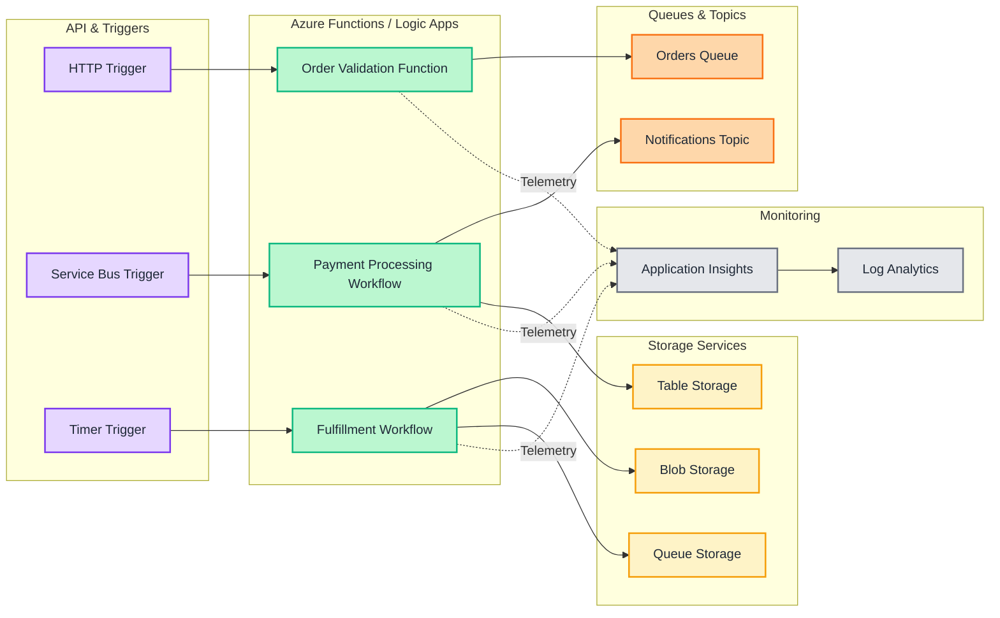

#### Platform Engineering Architecture

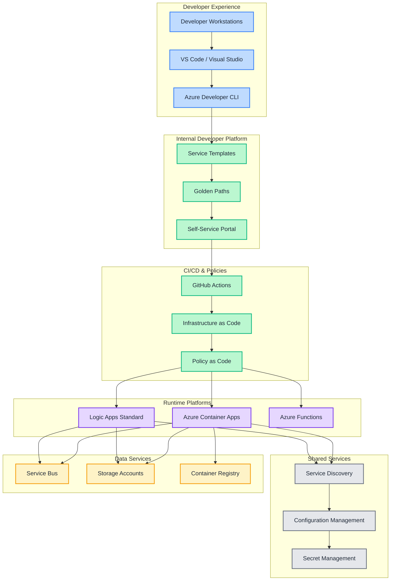

---

## Deployment Instructions

### Prerequisites

Ensure you have the following tools and permissions before deploying:

**Required Tools:**
- [Azure CLI](https://learn.microsoft.com/cli/azure/install-azure-cli) (v2.50+)
- [Azure Developer CLI (azd)](https://learn.microsoft.com/azure/developer/azure-developer-cli/install-azd) (v1.5.0+)
- [.NET SDK 10.0](https://dotnet.microsoft.com/download/dotnet/10.0) or later
- [PowerShell 7.0+](https://learn.microsoft.com/powershell/scripting/install/installing-powershell) (for post-provisioning hooks)
- [Docker Desktop](https://www.docker.com/products/docker-desktop) (for local development)
- [Visual Studio Code](https://code.visualstudio.com/) with the following extensions:
  - [Azure Logic Apps (Standard)](https://marketplace.visualstudio.com/items?itemName=ms-azuretools.vscode-logicapps)
  - [C# Dev Kit](https://marketplace.visualstudio.com/items?itemName=ms-dotnettools.csdevkit)
  - [Bicep](https://marketplace.visualstudio.com/items?itemName=ms-azuretools.vscode-bicep)

**Azure Subscription Requirements:**
- Active Azure subscription with Owner or Contributor permissions
- Sufficient quota for:
  - Container Apps Environment (1 instance)
  - App Service Plan WorkflowStandard SKU (1 instance)
  - Service Bus Premium namespace (1 instance)
  - Application Insights (1 instance)

### Azure RBAC Roles

The following Azure RBAC roles are assigned to the managed identity for least-privilege access:

| Role Name | Description | Documentation Link |
|-----------|-------------|-------------------|
| **Storage Blob Data Contributor** | Read, write, and delete access to blob containers and data | [Documentation](https://learn.microsoft.com/azure/role-based-access-control/built-in-roles#storage-blob-data-contributor) |
| **Storage Queue Data Contributor** | Read, write, and delete messages in Azure Storage queues | [Documentation](https://learn.microsoft.com/azure/role-based-access-control/built-in-roles#storage-queue-data-contributor) |
| **Storage Table Data Contributor** | Read, write, and delete access to tables and entities | [Documentation](https://learn.microsoft.com/azure/role-based-access-control/built-in-roles#storage-table-data-contributor) |
| **Azure Service Bus Data Receiver** | Receive messages from Service Bus queues and subscriptions | [Documentation](https://learn.microsoft.com/azure/role-based-access-control/built-in-roles#azure-service-bus-data-receiver) |
| **Azure Service Bus Data Sender** | Send messages to Service Bus queues and topics | [Documentation](https://learn.microsoft.com/azure/role-based-access-control/built-in-roles#azure-service-bus-data-sender) |
| **AcrPull** | Pull images from Azure Container Registry | [Documentation](https://learn.microsoft.com/azure/role-based-access-control/built-in-roles#acrpull) |
| **AcrPush** | Push images to Azure Container Registry | [Documentation](https://learn.microsoft.com/azure/role-based-access-control/built-in-roles#acrpush) |

### Infrastructure Deployment

**1. Clone the Repository**

```bash
git clone https://github.com/Evilazaro/Azure-LogicApps-Monitoring.git
cd Azure-LogicApps-Monitoring
```

**2. Initialize Azure Developer CLI**

```bash
# Initialize azd with your desired environment name
azd init

# Follow the prompts to select:
# - Environment name: dev, staging, or prod
# - Azure subscription
# - Azure region (e.g., eastus, westus2, westeurope)
```

**3. Authenticate to Azure**

```bash
# Login to Azure CLI
az login

# Set your subscription
az account set --subscription "Your-Subscription-ID"

# Login to Azure Developer CLI
azd auth login
```

**4. Provision Azure Infrastructure**

```bash
# Deploy all Azure resources using Bicep templates
azd provision

# This command will:
# - Create resource group
# - Deploy Log Analytics workspace
# - Deploy Application Insights
# - Deploy Service Bus Premium namespace
# - Deploy Azure Container Registry
# - Deploy Container Apps Environment
# - Deploy Logic Apps Standard with App Service Plan
# - Configure managed identity and RBAC assignments
# - Run post-provisioning hooks to configure user secrets
```

**Expected Output:**
```
Provisioning Azure resources...
✓ Created resource group: rg-orders-dev-eastus
✓ Deployed Log Analytics workspace: orders-dev-abc123-law
✓ Deployed Application Insights: orders-dev-abc123-ai
✓ Deployed Service Bus namespace: orders-dev-abc123-sb
✓ Deployed Container Registry: ordersdevabc123cr
✓ Deployed Container Apps Environment: orders-dev-abc123-cae
✓ Deployed Logic Apps Standard: orders-dev-abc123-la
✓ Configured managed identity: orders-dev-abc123-mi
✓ Running post-provisioning hooks...
✓ Configured .NET user secrets for AppHost project
✓ Configured .NET user secrets for API project

Provisioning complete!
```

**5. Deploy Application Code**

```bash
# Build and deploy containerized services to Azure Container Apps
azd deploy

# This command will:
# - Build .NET 10 applications
# - Create Docker images
# - Push images to Azure Container Registry
# - Deploy containers to Container Apps Environment
# - Configure environment variables and service discovery
```

**Expected Output:**
```
Deploying services...
✓ Built eShop.Orders.API container image
✓ Built eShop.Orders.App container image
✓ Pushed images to Container Registry
✓ Deployed orders-api to Container Apps
✓ Deployed orders-webapp to Container Apps
✓ Services are healthy and running

Deployment complete!

Service Endpoints:
  orders-api: https://orders-api.internal.<env-domain>
  orders-webapp: https://orders-webapp.<env-domain>
  aspire-dashboard: https://aspire-dashboard.<env-domain>
```

### Local Development Setup

**1. Configure User Secrets**

The post-provisioning hook automatically configures user secrets. To manually update them:

```bash
# Navigate to AppHost project
cd eShopOrders.AppHost

# Set Azure configuration secrets
dotnet user-secrets set "Azure:SubscriptionId" "your-subscription-id"
dotnet user-secrets set "Azure:ResourceGroup" "rg-orders-dev-eastus"
dotnet user-secrets set "Azure:ApplicationInsights:Name" "orders-dev-abc123-ai"
dotnet user-secrets set "Azure:ServiceBus:Namespace" "orders-dev-abc123-sb"
dotnet user-secrets set "Azure:ServiceBus:TopicName" "OrdersPlaced"
```

**2. Run with Docker Compose (Local Development)**

```bash
# Start all services locally with emulators
docker-compose up -d

# Services will start:
# - Orders API on http://localhost:5000
# - Orders Web App on http://localhost:5001
# - Service Bus Emulator on localhost:5672
```

**3. Run with .NET Aspire (Recommended)**

```bash
# Navigate to AppHost project
cd eShopOrders.AppHost

# Run the AppHost (includes Aspire Dashboard)
dotnet run

# Aspire Dashboard will open at: http://localhost:15888
# Access the following services:
# - orders-api: http://localhost:5000
# - orders-webapp: http://localhost:5001
```

**4. Run Logic Apps Locally**

```bash
# Navigate to Logic App workspace
cd LogicAppWP

# Update local.settings.json with your Service Bus connection string
# (Retrieved from Azure Portal or via: az servicebus namespace authorization-rule keys list)

# Start Logic App runtime
func start
```

### Verification Steps

**1. Verify Container Apps Deployment**

```bash
# List running container apps
az containerapp list --resource-group rg-orders-dev-eastus --output table

# Check health of orders-api
az containerapp show --name orders-api --resource-group rg-orders-dev-eastus --query "properties.runningStatus"

# View logs
az containerapp logs show --name orders-api --resource-group rg-orders-dev-eastus --follow
```

**2. Verify Logic Apps Deployment**

```bash
# List workflows
az logicapp workflow list --resource-group rg-orders-dev-eastus --name orders-dev-abc123-la --output table

# Check workflow status
az logicapp workflow show --resource-group rg-orders-dev-eastus --name orders-dev-abc123-la --workflow-name ContosoOrders
```

**3. Verify Service Bus Configuration**

```bash
# List topics
az servicebus topic list --namespace-name orders-dev-abc123-sb --resource-group rg-orders-dev-eastus --output table

# List subscriptions
az servicebus topic subscription list --namespace-name orders-dev-abc123-sb --topic-name OrdersPlaced --resource-group rg-orders-dev-eastus --output table
```

**4. Verify Application Insights Telemetry**

Navigate to Azure Portal → Application Insights → Live Metrics to see real-time telemetry from all services.

---

## Usage Examples

### Monitoring and Observability Guidance

#### Accessing the .NET Aspire Dashboard

The Aspire Dashboard provides a unified view of all services, dependencies, and telemetry:

**Local Development:**
```bash
# Run AppHost which includes Aspire Dashboard
cd eShopOrders.AppHost
dotnet run

# Dashboard URL: http://localhost:15888
```

**Azure Deployment:**
```bash
# Get Aspire Dashboard URL from Container Apps
az containerapp show --name aspire-dashboard --resource-group rg-orders-dev-eastus --query "properties.configuration.ingress.fqdn" -o tsv

# Access via browser: https://<dashboard-fqdn>
```

**Dashboard Features:**
- **Services View**: Real-time status of all microservices
- **Traces View**: Distributed tracing across API → Service Bus → Logic Apps
- **Metrics View**: CPU, memory, request rates, and custom metrics
- **Logs View**: Aggregated logs with filtering and correlation
- **Dependencies View**: Service topology and health checks

#### Application Insights Queries

Access Application Insights in Azure Portal or use these Kusto (KQL) queries:

**Query 1: Logic Apps Workflow Execution Metrics**

```kusto
// Average workflow execution duration by workflow name
customMetrics
| where name == "WorkflowExecutionDuration"
| summarize 
    AvgDuration = avg(value),
    P50Duration = percentile(value, 50),
    P95Duration = percentile(value, 95),
    P99Duration = percentile(value, 99),
    ExecutionCount = count()
  by WorkflowName = tostring(customDimensions["WorkflowName"])
| order by AvgDuration desc
```

**Query 2: Service Bus Message Processing Latency**

```kusto
// End-to-end message processing time (API → Service Bus → Logic Apps)
dependencies
| where type == "Azure Service Bus"
| extend 
    QueueName = tostring(customDimensions["Entity"]),
    Operation = tostring(customDimensions["Operation"])
| summarize 
    AvgLatency = avg(duration),
    P95Latency = percentile(duration, 95),
    MessageCount = count()
  by QueueName, Operation
| order by AvgLatency desc
```

**Query 3: Failed Workflow Runs with Error Details**

```kusto
// Failed Logic Apps workflow runs with exception details
traces
| where severityLevel >= 3 // Warning and above
| where customDimensions contains "WorkflowName"
| extend 
    WorkflowName = tostring(customDimensions["WorkflowName"]),
    RunId = tostring(customDimensions["RunId"]),
    ErrorMessage = tostring(customDimensions["ErrorMessage"])
| project timestamp, WorkflowName, RunId, severityLevel, message, ErrorMessage
| order by timestamp desc
| take 100
```

**Query 4: API Request Success Rate and Error Rate**

```kusto
// API success rate, error rate, and response time percentiles
requests
| where cloud_RoleName == "orders-api"
| summarize 
    TotalRequests = count(),
    SuccessRequests = countif(success == true),
    FailedRequests = countif(success == false),
    AvgDuration = avg(duration),
    P95Duration = percentile(duration, 95)
  by bin(timestamp, 5m), name
| extend SuccessRate = round(100.0 * SuccessRequests / TotalRequests, 2)
| project timestamp, name, TotalRequests, SuccessRate, FailedRequests, AvgDuration, P95Duration
| order by timestamp desc
```

**Query 5: Memory Usage Trends for Logic Apps**

```kusto
// Memory consumption trends for Logic Apps instances
performanceCounters
| where name == "% Processor Time" or name == "Available MBytes"
| where cloud_RoleName == "orders-dev-abc123-la"
| summarize 
    AvgCPU = avgif(value, name == "% Processor Time"),
    AvgMemoryMB = avgif(value, name == "Available MBytes")
  by bin(timestamp, 5m), cloud_RoleInstance
| order by timestamp desc
```

**Query 6: Service Bus Dead Letter Queue Messages**

```kusto
// Messages sent to dead letter queue with failure reasons
dependencies
| where type == "Azure Service Bus"
| where target contains "/$deadletterqueue"
| extend 
    QueueName = tostring(customDimensions["Entity"]),
    FailureReason = tostring(customDimensions["FailureReason"])
| project timestamp, QueueName, FailureReason, data
| order by timestamp desc
```

**Query 7: Distributed Trace Analysis (API → Service Bus → Logic Apps)**

```kusto
// End-to-end trace correlation across services
let orderId = "ORDER-12345"; // Replace with actual order ID
requests
| where customDimensions["OrderId"] == orderId
| project operation_Id, timestamp, name, duration
| join kind=inner (
    dependencies
    | where customDimensions["OrderId"] == orderId
    | project operation_Id, timestamp, name, target, duration
  ) on operation_Id
| project timestamp, RequestName = name, DependencyName = name1, DependencyTarget = target, TotalDuration = duration + duration1
| order by timestamp asc
```

**Query 8: Cost Analysis by Service**

```kusto
// Estimated costs based on telemetry volume by service
union requests, dependencies, traces, exceptions
| summarize 
    TelemetryCount = count(),
    EstimatedGB = round(sum(itemCount) / 1000000000.0, 2)
  by cloud_RoleName
| extend EstimatedCostUSD = round(EstimatedGB * 2.30, 2) // $2.30 per GB ingestion
| order by EstimatedCostUSD desc
```

#### Logic Apps Workflow Monitoring Best Practices

**1. Enable Diagnostic Settings**

Ensure all diagnostic logs are flowing to Log Analytics:

```bash
# Enable diagnostic settings for Logic Apps
az monitor diagnostic-settings create \
  --resource $(az logicapp show --name orders-dev-abc123-la --resource-group rg-orders-dev-eastus --query id -o tsv) \
  --name "LogicAppDiagnostics" \
  --workspace $(az monitor log-analytics workspace show --workspace-name orders-dev-abc123-law --resource-group rg-orders-dev-eastus --query id -o tsv) \
  --logs '[{"category":"WorkflowRuntime","enabled":true}]' \
  --metrics '[{"category":"AllMetrics","enabled":true}]'
```

**2. Monitor Workflow Health**

Use these KQL queries in Log Analytics:

```kusto
// Workflow run status distribution
AzureDiagnostics
| where ResourceProvider == "MICROSOFT.LOGIC"
| where Category == "WorkflowRuntime"
| summarize count() by status_s, workflowName_s
| render piechart
```

```kusto
// Failed workflow runs with detailed error messages
AzureDiagnostics
| where ResourceProvider == "MICROSOFT.LOGIC"
| where Category == "WorkflowRuntime"
| where status_s == "Failed"
| project TimeGenerated, workflowName_s, runId_s, error_message_s, error_code_s
| order by TimeGenerated desc
```

**3. Set Up Alerts**

Create alerts for critical workflow failures:

```bash
# Create alert rule for failed workflow runs
az monitor metrics alert create \
  --name "LogicAppFailures" \
  --resource-group rg-orders-dev-eastus \
  --scopes $(az logicapp show --name orders-dev-abc123-la --resource-group rg-orders-dev-eastus --query id -o tsv) \
  --condition "avg RunsFailed > 5" \
  --window-size 5m \
  --evaluation-frequency 1m \
  --description "Alert when Logic App has more than 5 failed runs in 5 minutes"
```

**4. Monitor Long-Running Workflows**

Track workflows exceeding expected duration:

```kusto
// Workflows running longer than expected threshold
AzureDiagnostics
| where ResourceProvider == "MICROSOFT.LOGIC"
| where Category == "WorkflowRuntime"
| where status_s == "Running"
| extend DurationMinutes = datetime_diff('minute', now(), TimeGenerated)
| where DurationMinutes > 60 // Alert for workflows running > 1 hour
| project TimeGenerated, workflowName_s, runId_s, DurationMinutes
| order by DurationMinutes desc
```

**5. Track Memory and CPU Utilization**

Monitor App Service Plan metrics:

```kusto
// App Service Plan resource utilization
AzureMetrics
| where ResourceProvider == "MICROSOFT.WEB"
| where ResourceId contains "orders-dev-abc123-asp"
| where MetricName in ("CpuPercentage", "MemoryPercentage")
| summarize 
    AvgCPU = avgif(Average, MetricName == "CpuPercentage"),
    AvgMemory = avgif(Average, MetricName == "MemoryPercentage")
  by bin(TimeGenerated, 5m)
| render timechart
```

---

## References

- [Azure Monitor OpenTelemetry .NET Documentation](https://learn.microsoft.com/en-us/dotnet/api/overview/azure/monitor?view=azure-dotnet)
- [Monitoring Logic Apps with Application Insights](https://learn.microsoft.com/en-us/azure/logic-apps/monitor-logic-apps)
- [.NET Aspire Dashboard Overview](https://aspire.dev/dashboard/overview/)
- [Azure Well-Architected Framework: Operational Excellence](https://learn.microsoft.com/en-us/azure/well-architected/operational-excellence/monitoring)
- [OpenTelemetry Data Collection in Application Insights](https://learn.microsoft.com/en-us/azure/azure-monitor/app/opentelemetry-data-collection)