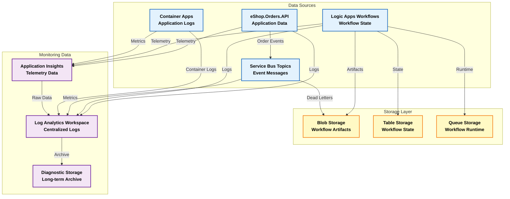
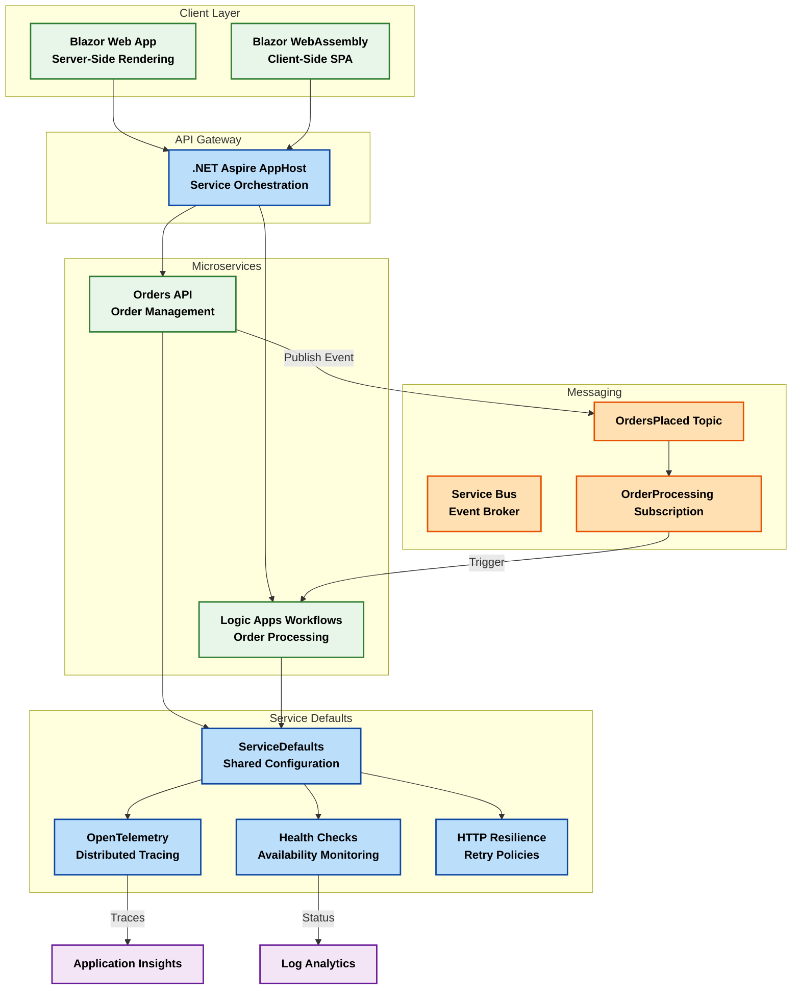
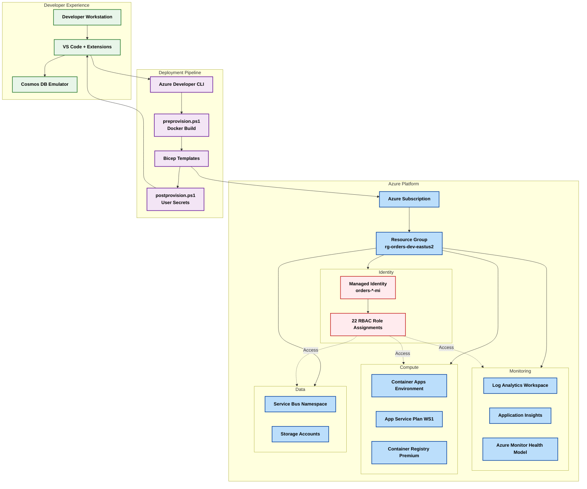

# Azure Logic Apps Monitoring Solution

## Problem Statement

Enterprise organizations deploying Azure Logic Apps Standard at scale face significant challenges when hosting thousands of workflows across global deployments. Current Microsoft guidance recommends approximately 20 workflows per Logic App instance and up to 64 apps per App Service Plan. However, organizations exceeding these limits—particularly when leveraging 64-bit support—frequently encounter critical operational issues including memory spikes, workflow instability, and substantial cost overruns that can exceed US$80,000 annually per environment.

These challenges are compounded by the lack of comprehensive monitoring solutions that align with the Azure Well-Architected Framework's operational excellence pillars. Organizations struggle to gain visibility into workflow performance, resource utilization, and failure patterns across distributed deployments, making it difficult to optimize costs while maintaining reliability and performance SLAs.

Additionally, enterprises running long-running workflows (18–36 months duration) require specialized patterns to ensure stability without compromising on cost efficiency or operational observability. The absence of proven reference architectures creates operational risks and prevents organizations from realizing the full potential of serverless workflow orchestration at scale.

## Project Purpose

This solution provides a comprehensive reference architecture for deploying Azure Logic Apps Standard at enterprise scale with production-grade monitoring and observability capabilities. The project addresses the critical gap between Microsoft's basic deployment guidance and the complex requirements of large-scale enterprise implementations.

The architecture demonstrates optimized workflow hosting density patterns that balance performance, cost, and operational stability. By implementing proven patterns for resource allocation, scaling strategies, and monitoring integration, the solution enables organizations to host hundreds of workflows reliably while maintaining predictable costs and meeting stringent SLA requirements.

Central to this solution is the integration of modern observability practices through .NET Aspire's distributed application model, Azure Monitor, and Application Insights. This provides real-time visibility into workflow execution, resource consumption, and system health across all deployment environments. The monitoring infrastructure follows Azure Well-Architected Framework principles, ensuring comprehensive coverage of reliability, performance, security, and cost optimization pillars.

The solution leverages Infrastructure as Code (IaC) using Azure Bicep for reproducible, auditable deployments and includes automated provisioning scripts that configure monitoring, authentication, and resource dependencies. This approach reduces deployment time, eliminates configuration drift, and enables organizations to rapidly replicate the architecture across multiple environments and regions while maintaining consistency and compliance.

## Key Features

| Feature | Description | Implementation Details |
|---------|-------------|------------------------|
| Enterprise-Scale Architecture | Optimized for hosting 1000+ workflows across multiple Logic App instances | Implements hierarchical partition keys, resource pooling, and elastic scaling patterns |
| Comprehensive Monitoring | End-to-end observability using Azure Monitor, Application Insights, and .NET Aspire Dashboard | OpenTelemetry instrumentation, distributed tracing, custom metrics, and real-time dashboards |
| Managed Identity Security | Zero-trust authentication model eliminating connection strings and secrets | User-assigned managed identities with RBAC across all Azure resources |
| Infrastructure as Code | Fully automated deployment using Azure Bicep modules | Modular architecture with separate monitoring, identity, messaging, and workload components |
| Cost Optimization | Resource rightsizing and consumption-based scaling | Elastic App Service Plans (WS1), consumption workload profiles, auto-scaling policies |
| Multi-Environment Support | Consistent deployment across dev, staging, and production | Environment-specific configurations with azd support |
| Event-Driven Integration | Service Bus messaging with dead-letter handling | Topic-subscription model with retry policies and workflow triggers |
| Container-Based Microservices | .NET Aspire application model with service discovery | Container Apps hosting with integrated service-to-service communication |
| Operational Excellence | Follows Azure Well-Architected Framework principles | Log Analytics integration, diagnostic settings, health monitoring, and SLA tracking |

## Solution Components

| Component | Description | Role |
|-----------|-------------|------|
| 🎯 .NET Aspire AppHost | Application orchestration and service configuration | Defines service topology, dependencies, and environment configuration |
| ⚙️ .NET Aspire ServiceDefaults | Shared telemetry and resilience configuration | Configures OpenTelemetry, health checks, service discovery, and HTTP resilience |
| 🚀 eShop.Orders.API | RESTful API for order management | Handles order creation, retrieval, and publishes events to Service Bus |
| 💻 eShop.Orders.Web.App | Blazor web application | Provides user interface for order management and monitoring |
| 📱 eShop.Orders.App.Client | Blazor WebAssembly client | Client-side SPA components for interactive user experience |
| 🔄 Logic Apps Workflows | Serverless workflow orchestration | Processes orders from Service Bus, implements business logic, handles long-running operations |
| 🔐 Managed Identity Module | Azure RBAC and identity management | Provides authentication for all Azure resource access |
| 📊 Monitoring Infrastructure | Observability and diagnostics | Log Analytics workspace, Application Insights, health monitoring |
| 📦 Container Services | Microservices hosting platform | Azure Container Registry, Container Apps Environment, Aspire Dashboard |
| 📨 Messaging Infrastructure | Asynchronous communication | Service Bus namespace with topics, subscriptions, and workflow storage |

## Azure Components

| Azure Service | Description | Role |
|---------------|-------------|------|
| ☁️ Azure Logic Apps Standard | Serverless workflow orchestration engine | Executes business processes, integrates systems, handles long-running operations |
| 🔗 Azure Service Bus | Enterprise message broker | Decouples services, ensures reliable message delivery, enables event-driven architecture |
| 📊 Azure Monitor | Unified monitoring platform | Collects metrics, logs, and traces across all resources |
| 📈 Application Insights | Application performance monitoring | Tracks telemetry, identifies bottlenecks, monitors user behavior |
| 🔍 Log Analytics Workspace | Centralized log storage and analysis | Aggregates diagnostic data, enables KQL queries, supports alerting |
| 🎭 Managed Identity | Azure Active Directory identity | Provides passwordless authentication, eliminates secret management |
| 🐳 Azure Container Registry | Private container image repository | Stores and distributes container images with geo-replication |
| 📦 Azure Container Apps | Serverless container hosting | Runs microservices with automatic scaling and HTTPS ingress |
| 💾 Azure Storage Account | Persistent data storage | Workflow state, blob storage for artifacts, diagnostic logs |
| 🏢 Azure App Service Plan | Logic Apps hosting infrastructure | Provides compute resources with elastic scaling (WS1 tier) |

## Project Structure

```
Azure-LogicApps-Monitoring/
├── .azure/                                 # Azure Developer CLI configuration
│   ├── config.json                         # azd environment configuration
│   └── dev/                                # Development environment settings
│       └── .env                            # Environment variables (managed by azd)
├── .github/                                # GitHub automation
│   └── workflows/                          # CI/CD pipeline definitions
├── app.AppHost/                            # .NET Aspire AppHost project
│   ├── app.AppHost.csproj                  # Project file with Aspire SDK
│   ├── AppHost.cs                          # Service orchestration and configuration
│   ├── appsettings.json                    # Application settings
│   ├── appsettings.Development.json        # Development-specific settings
│   └── Properties/                         # Launch settings and metadata
├── app.ServiceDefaults/                    # .NET Aspire ServiceDefaults project
│   ├── app.ServiceDefaults.csproj          # Shared configuration project
│   ├── Extensions.cs                       # Telemetry and resilience extensions
│   └── CommonTypes.cs                      # Shared type definitions
├── src/                                    # Application source code
│   ├── eShop.Orders.API/                   # Orders API microservice
│   │   ├── eShop.Orders.API.csproj         # API project file
│   │   ├── Program.cs                      # API startup and configuration
│   │   ├── Controllers/                    # API endpoints
│   │   ├── Models/                         # Domain models
│   │   └── Services/                       # Business logic and integrations
│   ├── eShop.Web.App/                      # Blazor Server web application
│   │   ├── eShop.Web.App.csproj            # Web app project file
│   │   ├── Program.cs                      # Web app startup
│   │   ├── Components/                     # Blazor components
│   │   │   ├── Layout/                     # Layout components
│   │   │   └── Pages/                      # Page components
│   │   └── wwwroot/                        # Static assets
│   └── eShop.Orders.App.Client/            # Blazor WebAssembly client
│       ├── eShop.Orders.App.Client.csproj  # Client project file
│       ├── Program.cs                      # Client startup
│       └── wwwroot/                        # Client static assets
├── LogicAppWP/                             # Logic Apps workspace
│   ├── ConsosoOrders/                      # Order processing workflow
│   │   ├── workflow.json                   # Workflow definition
│   │   └── connections.json                # Connector configurations
│   └── host.json                           # Workflow runtime settings
├── infra/                                  # Infrastructure as Code (Bicep)
│   ├── main.bicep                          # Root deployment orchestrator
│   ├── types.bicep                         # Shared type definitions
│   ├── monitoring/                         # Monitoring infrastructure module
│   │   ├── main.bicep                      # Monitoring orchestrator
│   │   ├── log-analytics-workspace.bicep   # Log Analytics workspace
│   │   ├── app-insights.bicep              # Application Insights
│   │   └── azure-monitor-health-model.bicep # Health monitoring hierarchy
│   └── workload/                           # Workload infrastructure module
│       ├── main.bicep                      # Workload orchestrator
│       ├── identity/                       # Managed identity module
│       │   └── main.bicep                  # User-assigned identity with RBAC
│       ├── messaging/                      # Messaging infrastructure
│       │   └── main.bicep                  # Service Bus and storage
│       ├── services/                       # Container services
│       │   └── main.bicep                  # ACR, Container Apps, Aspire Dashboard
│       └── logic-app.bicep                 # Logic Apps Standard deployment
├── hooks/                                  # Deployment lifecycle hooks
│   ├── preprovision.ps1                    # Pre-deployment validation
│   ├── postprovision.ps1                   # Post-deployment configuration
│   └── generate_orders.ps1                 # Test data generation
├── azure.yaml                              # Azure Developer CLI manifest
├── app.sln                                 # Visual Studio solution file
├── .gitignore                              # Git ignore patterns
├── CODE_OF_CONDUCT.md                      # Community guidelines
├── CONTRIBUTING.md                         # Contribution guidelines
├── LICENSE.md                              # License information
└── SECURITY.md                             # Security policy
```

---

## Architecture

This solution follows the TOGAF (The Open Group Architecture Framework) architecture framework, organizing components into distinct layers that separate concerns and enable independent scaling, monitoring, and management.

### Data Layer

The Data Layer implements Master Data Management (MDM) patterns for both application data and monitoring telemetry. This layer ensures data consistency, integrity, and accessibility across all services while providing centralized storage for logs, metrics, traces, and operational state.

**Purpose and Key Capabilities:**
- Centralized storage for application state, workflow data, and monitoring telemetry
- Hierarchical data organization using container structures and retention policies
- Integration with Azure Monitor for comprehensive diagnostic data collection
- Support for both structured (Service Bus messages) and unstructured (blob storage) data
- Real-time data ingestion with configurable retention periods (30 days for logs)



**Legend:**
- **Blue nodes (data)**: Application components generating operational data
- **Yellow nodes (storage)**: Persistent storage systems for state and artifacts
- **Purple nodes (monitor)**: Monitoring infrastructure collecting diagnostic data

---

### Application Layer

The Application Layer implements microservices architecture with event-driven communication patterns. This layer contains all business logic, API endpoints, user interfaces, and workflow orchestration components.

**Purpose and Key Capabilities:**
- RESTful APIs for order management with OpenAPI documentation
- Blazor-based web applications with real-time updates
- Event-driven integration using publish-subscribe patterns
- Serverless workflow orchestration with long-running operation support
- Service discovery and load balancing through .NET Aspire

#### Microservices Architecture



**Legend:**
- **Green nodes (app)**: Application components containing business logic
- **Blue nodes (infra)**: Infrastructure services enabling application functionality
- **Orange nodes (msg)**: Messaging components for asynchronous communication
- **Purple nodes (monitor)**: Monitoring endpoints collecting telemetry

#### Event-Driven Flow

```mermaid
flowchart LR
    USER[User] -->|Place Order| WEB[Web Application]
    WEB -->|HTTP POST| API[Orders API]
    
    API -->|Validate| VAL{Validation}
    VAL -->|Valid| STORE[(Store Order)]
    VAL -->|Invalid| ERR[Return Error]
    
    STORE -->|Publish| TOPIC[OrdersPlaced<br/>Service Bus Topic]
    
    TOPIC -->|Deliver| SUB[OrderProcessing<br/>Subscription]
    
    SUB -->|Trigger| WF[Logic App<br/>Workflow]
    
    WF -->|Process| STEPS[Workflow Steps:<br/>1. Enrich Order<br/>2. Validate Inventory<br/>3. Process Payment<br/>4. Ship Order]
    
    STEPS -->|Success| SUCCESS[(Success Container)]
    STEPS -->|Failure| RETRY{Retry?}
    
    RETRY -->|Yes| SUB
    RETRY -->|Max Retries| DLQ[(Dead Letter Queue)]
    
    SUCCESS -->|Notify| NOTIFY[Notification Service]
    DLQ -->|Alert| ALERT[Alert System]
    
    classDef event fill:#FFF3E0,stroke:#EF6C00,color:#000,font-weight:bold,stroke-width:2px;
    classDef process fill:#E8F5E9,stroke:#2E7D32,color:#000,font-weight:bold,stroke-width:2px;
    classDef storage fill:#E3F2FD,stroke:#1565C0,color:#000,font-weight:bold,stroke-width:2px;
    classDef error fill:#FFEBEE,stroke:#C62828,color:#000,font-weight:bold,stroke-width:2px;
    
    class TOPIC,SUB event;
    class API,WF,STEPS,NOTIFY process;
    class STORE,SUCCESS storage;
    class ERR,DLQ,ALERT error;
```



**Legend:**
- **Orange nodes (event)**: Event triggers and message brokers
- **Green nodes (process)**: Processing components executing business logic
- **Blue nodes (storage)**: Data persistence points
- **Red nodes (error)**: Error handling and alerting paths

---

### Technology Layer

The Technology Layer implements cloud-native patterns using Azure's serverless and container services. This layer provides the runtime infrastructure, security, networking, and DevOps capabilities required for production deployments.

**Purpose and Key Capabilities:**
- Kubernetes-based container orchestration through Azure Container Apps
- Elastic scaling with consumption-based pricing models
- Managed identity authentication eliminating secret management
- CI/CD automation using Azure Developer CLI (azd)
- Infrastructure as Code using Azure Bicep modules

#### Cloud-Native Infrastructure

```mermaid
graph TB
    subgraph Azure Platform
        ACA[Azure Container Apps<br/>Environment]
        ACR[Azure Container Registry<br/>Premium]
        ASP[App Service Plan<br/>WorkflowStandard WS1]
    end
    
    subgraph Container Pods
        POD1[Orders API Pod<br/>Replica Set: 1-10]
        POD2[Web App Pod<br/>Replica Set: 1-10]
        POD3[Aspire Dashboard Pod<br/>Replica Set: 1]
    end
    
    subgraph Logic Apps Runtime
        LA1[Logic App Instance 1<br/>3-20 workers]
        LA2[Logic App Instance N<br/>3-20 workers]
    end
    
    subgraph Security
        MI[Managed Identity<br/>User-Assigned]
        RBAC[RBAC Roles:<br/>Storage Contributor<br/>Service Bus Owner<br/>ACR Pull/Push]
    end
    
    subgraph Networking
        VN[Virtual Network<br/>Integration]
        PE[Private Endpoints<br/>Service Connectivity]
        FW[Azure Firewall<br/>Outbound Control]
    end
    
    subgraph DevOps
        BICEP[Bicep Modules<br/>IaC Templates]
        AZD[Azure Developer CLI<br/>azd up]
        HOOKS[Deployment Hooks<br/>Pre/Post Provision]
    end
    
    ACR -->|Pull Images| POD1
    ACR -->|Pull Images| POD2
    ACR -->|Pull Images| POD3
    
    ACA -->|Hosts| POD1
    ACA -->|Hosts| POD2
    ACA -->|Hosts| POD3
    
    ASP -->|Hosts| LA1
    ASP -->|Hosts| LA2
    
    MI -->|Authenticates| POD1
    MI -->|Authenticates| POD2
    MI -->|Authenticates| LA1
    MI -->|Authenticates| LA2
    
    RBAC -->|Grants Access| MI
    
    ACA --> VN
    ASP --> VN
    VN --> PE
    PE --> FW
    
    BICEP -->|Deploys| Azure Platform
    AZD -->|Orchestrates| BICEP
    HOOKS -->|Configures| Security
    
    classDef tech fill:#F3E5F5,stroke:#6A1B9A,color:#000,font-weight:bold,stroke-width:2px;
    classDef azure fill:#BBDEFB,stroke:#0D47A1,color:#000,font-weight:bold,stroke-width:2px;
    classDef security fill:#FFEBEE,stroke:#C62828,color:#000,font-weight:bold,stroke-width:2px;
    classDef devops fill:#E8F5E9,stroke:#2E7D32,color:#000,font-weight:bold,stroke-width:2px;
    
    class POD1,POD2,POD3,LA1,LA2 tech;
    class ACA,ACR,ASP,VN,PE,FW azure;
    class MI,RBAC security;
    class BICEP,AZD,HOOKS devops;
```

**Legend:**
- **Purple nodes (tech)**: Technology runtime components
- **Blue nodes (azure)**: Azure platform services
- **Red nodes (security)**: Security and identity services
- **Green nodes (devops)**: DevOps automation components

#### Serverless Workflow Execution

```mermaid
flowchart LR
    MSG[Service Bus Message] -->|Trigger| TRIGGER[Workflow Trigger]
    
    TRIGGER -->|Initialize| INIT[Initialize Context]
    
    INIT -->|Load State| STATE[(Workflow State<br/>Table Storage)]
    
    STATE -->|Execute| ACTION1[Action: Enrich Order]
    ACTION1 -->|API Call| EXT1[External System]
    EXT1 -->|Response| ACTION1
    
    ACTION1 -->|Save State| STATE
    ACTION1 -->|Next| ACTION2[Action: Validate Inventory]
    
    ACTION2 -->|Check Stock| EXT2[Inventory System]
    EXT2 -->|Response| ACTION2
    
    ACTION2 -->|Save State| STATE
    ACTION2 -->|Next| ACTION3[Action: Process Payment]
    
    ACTION3 -->|Charge Card| EXT3[Payment Gateway]
    EXT3 -->|Response| ACTION3
    
    ACTION3 -->|Save State| STATE
    ACTION3 -->|Complete| COMPLETE{Success?}
    
    COMPLETE -->|Yes| SUCCESS[Write to Success Container]
    COMPLETE -->|No| FAIL[Write to Failed Container]
    
    SUCCESS -->|Archive State| ARCHIVE[(Blob Storage)]
    FAIL -->|Archive State| ARCHIVE
    
    ACTION1 -.->|Telemetry| AI[Application Insights]
    ACTION2 -.->|Telemetry| AI
    ACTION3 -.->|Telemetry| AI
    
    classDef trigger fill:#FFF3E0,stroke:#EF6C00,color:#000,font-weight:bold,stroke-width:2px;
    classDef action fill:#E8F5E9,stroke:#2E7D32,color:#000,font-weight:bold,stroke-width:2px;
    classDef storage fill:#E3F2FD,stroke:#1565C0,color:#000,font-weight:bold,stroke-width:2px;
    classDef monitor fill:#F3E5F5,stroke:#6A1B9A,color:#000,font-weight:bold,stroke-width:2px;
    
    class MSG,TRIGGER trigger;
    class INIT,ACTION1,ACTION2,ACTION3,EXT1,EXT2,EXT3 action;
    class STATE,ARCHIVE storage;
    class AI monitor;
```



**Legend:**
- **Orange nodes (trigger)**: Workflow initiation points
- **Green nodes (action)**: Action steps and external integrations
- **Blue nodes (storage)**: State persistence and archival
- **Purple nodes (monitor)**: Telemetry collection endpoints

#### Platform Engineering



**Legend:**
- **Green nodes (dev)**: Developer tools and local environment
- **Blue nodes (azure)**: Azure platform resources
- **Purple nodes (deploy)**: Deployment automation components
- **Red nodes (security)**: Security and identity infrastructure

---

## Deployment Instructions

### Prerequisites

Before deploying this solution, ensure you have the following tools and access configured:

1. **Azure Subscription**
   - Active Azure subscription with Owner or Contributor role
   - Sufficient quota for creating resources in the target region

2. **Development Tools**
   - [.NET 10 SDK](https://dotnet.microsoft.com/download/dotnet/10.0) or later
   - [Azure Developer CLI (azd)](https://learn.microsoft.com/azure/developer/azure-developer-cli/install-azd) v1.5.0 or later
   - [Azure CLI](https://learn.microsoft.com/cli/azure/install-azure-cli) v2.50.0 or later
   - [PowerShell](https://learn.microsoft.com/powershell/scripting/install/installing-powershell) 7.0 or later
   - [Docker Desktop](https://www.docker.com/products/docker-desktop/) for local development and image building

3. **Visual Studio Code Extensions (Recommended)**
   - [C# Dev Kit](https://marketplace.visualstudio.com/items?itemName=ms-dotnettools.csdevkit)
   - [Azure Developer CLI](https://marketplace.visualstudio.com/items?itemName=ms-azuretools.azure-dev)
   - [Bicep](https://marketplace.visualstudio.com/items?itemName=ms-azuretools.vscode-bicep)
   - [Azure Container Apps](https://marketplace.visualstudio.com/items?itemName=ms-azuretools.vscode-azurecontainerapps)
   - [Azure Logic Apps (Standard)](https://marketplace.visualstudio.com/items?itemName=ms-azuretools.vscode-azurelogicapps)

4. **Azure Authentication**
   - Authenticated Azure CLI session: `az login`
   - Authenticated azd session: `azd auth login`

### Azure RBAC Roles

The deployment requires the following Azure role assignments. These roles are automatically granted to the user-assigned managed identity during provisioning:

| Role Name | Description | Documentation Link |
|-----------|-------------|-------------------|
| Storage Account Contributor | Full management of storage accounts including keys | [Documentation](https://learn.microsoft.com/azure/role-based-access-control/built-in-roles#storage-account-contributor) |
| Storage Blob Data Contributor | Read, write, and delete Azure Storage blobs and containers | [Documentation](https://learn.microsoft.com/azure/role-based-access-control/built-in-roles#storage-blob-data-contributor) |
| Monitoring Metrics Publisher | Publish metrics to Azure Monitor | [Documentation](https://learn.microsoft.com/azure/role-based-access-control/built-in-roles#monitoring-metrics-publisher) |
| Monitoring Contributor | Read monitoring data and edit monitoring settings | [Documentation](https://learn.microsoft.com/azure/role-based-access-control/built-in-roles#monitoring-contributor) |
| Application Insights Component Contributor | Manage Application Insights components | [Documentation](https://learn.microsoft.com/azure/role-based-access-control/built-in-roles#application-insights-component-contributor) |
| Application Insights Snapshot Debugger | View and download debug snapshots | [Documentation](https://learn.microsoft.com/azure/role-based-access-control/built-in-roles#application-insights-snapshot-debugger) |
| Azure Service Bus Data Owner | Full access to Service Bus resources | [Documentation](https://learn.microsoft.com/azure/role-based-access-control/built-in-roles#azure-service-bus-data-owner) |
| Azure Service Bus Data Receiver | Receive messages from Service Bus | [Documentation](https://learn.microsoft.com/azure/role-based-access-control/built-in-roles#azure-service-bus-data-receiver) |
| Azure Service Bus Data Sender | Send messages to Service Bus | [Documentation](https://learn.microsoft.com/azure/role-based-access-control/built-in-roles#azure-service-bus-data-sender) |
| Azure Resource Notifications System Topics Subscriber | Subscribe to system topics for resource notifications | [Documentation](https://learn.microsoft.com/azure/role-based-access-control/built-in-roles#azure-resource-notifications-system-topics-subscriber) |
| AcrPull | Pull artifacts from Azure Container Registry | [Documentation](https://learn.microsoft.com/azure/role-based-access-control/built-in-roles#acrpull) |
| AcrPush | Push artifacts to Azure Container Registry | [Documentation](https://learn.microsoft.com/azure/role-based-access-control/built-in-roles#acrpush) |

### Deployment Steps

1. **Clone the repository**
   ```bash
   git clone https://github.com/Evilazaro/Azure-LogicApps-Monitoring.git
   cd Azure-LogicApps-Monitoring
   ```

2. **Initialize Azure Developer CLI environment**
   ```bash
   azd init
   ```
   
   When prompted:
   - Environment name: Choose a unique name (e.g., `dev`, `staging`, `prod`)
   - Azure subscription: Select your target subscription
   - Azure location: Choose your preferred region (e.g., `eastus2`)

3. **Deploy the infrastructure**
   ```bash
   azd up
   ```
   
   This command performs the following:
   - Executes preprovision.ps1: Validates Docker and builds container images
   - Provisions all Azure resources using Bicep templates
   - Executes postprovision.ps1: Configures .NET user secrets and ACR authentication
   - Deploys application code to Container Apps

4. **Verify deployment**
   ```bash
   azd show
   ```
   
   Review the output for:
   - Resource group name and location
   - Application endpoints (Container Apps URLs)
   - Monitoring endpoints (Application Insights, Log Analytics)

5. **Access the applications**
   - **Blazor Web App**: Navigate to the URL output from `azd show` (ends with `.azurecontainerapps.io`)
   - **Aspire Dashboard**: Access via the dashboard endpoint for real-time observability
   - **API Endpoints**: Use the Orders API base URL for programmatic access

### Post-Deployment Configuration

After successful deployment, the postprovision.ps1 script automatically configures:

1. **.NET User Secrets** - Stores Azure resource connection details locally:
   - Azure Tenant ID and Subscription ID
   - Managed Identity Client ID
   - Service Bus connection details
   - Application Insights connection string

2. **Azure Container Registry Authentication** - Logs into ACR for image management:
   - Executes `az acr login --name <registry-name>`
   - Enables local Docker image push operations

3. **Environment Variables** - Updates .env with:
   - All Azure resource names and IDs
   - Connection endpoints for services
   - Managed identity information

### Troubleshooting Deployment

If deployment fails, review the following:

1. **Azure CLI Authentication**
   ```bash
   az account show
   ```
   Ensure you're logged into the correct subscription.

2. **Resource Quotas**
   Verify your subscription has available quota for:
   - Container Apps (minimum 3 vCPU)
   - App Service Plan (WS1 tier)
   - Storage accounts (minimum 2)

3. **Docker Validation**
   ```bash
   docker version
   docker compose version
   ```
   Ensure Docker Desktop is running and Docker Compose v2 is available.

4. **Deployment Logs**
   - Review azd logs: `azd show --debug`
   - Check PowerShell script output in terminal
   - Inspect Azure Portal deployment operations

5. **Manual Cleanup** (if needed)
   ```bash
   azd down --force --purge
   ```
   Removes all deployed resources and environment configuration.

---

## Usage Examples

### Monitoring Examples

#### Accessing Real-Time Metrics

1. **Aspire Dashboard** - Provides real-time distributed tracing and metrics:
   - Navigate to the Aspire Dashboard endpoint from `azd show` output
   - View service topology, request traces, and performance metrics
   - Monitor resource consumption and scaling events

2. **Application Insights Live Metrics** - Real-time telemetry stream:
   ```bash
   az portal open --resource <AZURE_APPLICATION_INSIGHTS_NAME> \
     --resource-group <AZURE_RESOURCE_GROUP> \
     --subscription <AZURE_SUBSCRIPTION_ID>
   ```
   - Navigate to "Live Metrics" blade
   - Monitor incoming requests, dependencies, and exceptions in real-time
   - View server metrics (CPU, memory, request rate)

3. **Log Analytics Workspace** - Query and analyze logs:
   ```bash
   az monitor log-analytics workspace show \
     --resource-group <AZURE_RESOURCE_GROUP> \
     --workspace-name <AZURE_LOG_ANALYTICS_WORKSPACE_NAME>
   ```
   - Access via Azure Portal → Log Analytics Workspace → Logs
   - Execute KQL queries for custom analysis
   - Create workbooks and dashboards

### Observability Guidance

#### Logic Apps Workflow Monitoring Best Practices

Based on [Microsoft's Logic Apps monitoring guidance](https://learn.microsoft.com/azure/logic-apps/monitor-logic-apps), implement the following practices:

1. **Enable Diagnostic Settings**
   - All Logic Apps instances have diagnostic settings pre-configured
   - Logs are sent to Log Analytics workspace and Storage Account
   - Retention period: 30 days in Log Analytics, extended in Storage

2. **Monitor Workflow Run History**
   - Access via Azure Portal → Logic App → Workflow runs
   - Review run status, duration, and input/output data
   - Filter by status (Succeeded, Failed, Cancelled, Running)

3. **Set Up Alerts**
   - Create metric alerts for workflow failures
   - Configure action groups for notification (email, SMS, webhook)
   - Set thresholds based on SLA requirements

#### Kusto Query Language (KQL) Examples

**Query 1: Workflow Execution Summary (Last 24 Hours)**
```kql
AzureDiagnostics
| where ResourceProvider == "MICROSOFT.LOGIC"
| where TimeGenerated > ago(24h)
| summarize 
    TotalRuns = count(),
    SuccessfulRuns = countif(status_s == "Succeeded"),
    FailedRuns = countif(status_s == "Failed"),
    AvgDuration = avg(todouble(duration_d))
    by resource_workflowName_s
| extend SuccessRate = round((SuccessfulRuns * 100.0) / TotalRuns, 2)
| project 
    WorkflowName = resource_workflowName_s,
    TotalRuns,
    SuccessfulRuns,
    FailedRuns,
    SuccessRate,
    AvgDurationSeconds = round(AvgDuration / 1000, 2)
| order by TotalRuns desc
```

**Query 2: Failed Workflow Runs with Error Details**
```kql
AzureDiagnostics
| where ResourceProvider == "MICROSOFT.LOGIC"
| where status_s == "Failed"
| where TimeGenerated > ago(7d)
| project 
    TimeGenerated,
    WorkflowName = resource_workflowName_s,
    RunId = resource_runId_g,
    Error = error_message_s,
    ErrorCode = error_code_s,
    Duration = todouble(duration_d) / 1000
| order by TimeGenerated desc
| take 100
```

**Query 3: Service Bus Message Processing Metrics**
```kql
AzureDiagnostics
| where ResourceProvider == "MICROSOFT.SERVICEBUS"
| where MetricName in ("IncomingMessages", "OutgoingMessages", "DeadletteredMessages")
| where TimeGenerated > ago(1h)
| summarize 
    Value = sum(Total) 
    by bin(TimeGenerated, 5m), MetricName, resource_entityName_s
| render timechart 
```

**Query 4: Application Insights Request Telemetry**
```kql
requests
| where timestamp > ago(24h)
| summarize 
    RequestCount = count(),
    AvgDuration = avg(duration),
    P95Duration = percentile(duration, 95),
    FailedRequests = countif(success == false)
    by name, resultCode
| extend SuccessRate = round((RequestCount - FailedRequests) * 100.0 / RequestCount, 2)
| project 
    Operation = name,
    StatusCode = resultCode,
    RequestCount,
    FailedRequests,
    SuccessRate,
    AvgDurationMs = round(AvgDuration, 2),
    P95DurationMs = round(P95Duration, 2)
| order by RequestCount desc
```

**Query 5: Container Apps Resource Utilization**
```kql
ContainerAppConsoleLogs_CL
| where TimeGenerated > ago(1h)
| where Log_s contains "CPU" or Log_s contains "Memory"
| parse Log_s with * "CPU:" cpu "%" * "Memory:" memory "MB" *
| summarize 
    AvgCPU = avg(todouble(cpu)),
    MaxCPU = max(todouble(cpu)),
    AvgMemory = avg(todouble(memory)),
    MaxMemory = max(todouble(memory))
    by bin(TimeGenerated, 5m), ContainerAppName_s
| render timechart
```

**Query 6: OpenTelemetry Distributed Traces**
```kql
AppDependencies
| where timestamp > ago(1h)
| where cloud_RoleName in ("eShop.Orders.API", "Logic Apps Workflows")
| project 
    timestamp,
    operation_Id,
    operation_ParentId,
    name,
    target,
    duration,
    success,
    cloud_RoleName
| order by timestamp desc
| take 1000
```

**Query 7: Workflow State Transitions**
```kql
AzureDiagnostics
| where ResourceProvider == "MICROSOFT.LOGIC"
| where category == "WorkflowRuntime"
| extend State = tostring(properties_d.status)
| summarize 
    StateTransitions = count() 
    by bin(TimeGenerated, 5m), State, resource_workflowName_s
| render timechart
```

### Creating Custom Dashboards

1. **Azure Workbook Template**
   - Navigate to Azure Portal → Log Analytics Workspace → Workbooks
   - Click "New" to create custom workbook
   - Add query tiles using the KQL examples above
   - Configure refresh intervals and time ranges
   - Save and share with team members

2. **Application Insights Dashboard**
   - Navigate to Application Insights → Dashboard
   - Pin key metrics: Request rate, Response time, Failed requests
   - Add custom charts from Analytics queries
   - Configure auto-refresh for live monitoring

3. **Grafana Integration** (Optional)
   - Connect Grafana to Log Analytics workspace using Azure Monitor data source
   - Import pre-built dashboards from Grafana marketplace
   - Create custom panels for Logic Apps-specific metrics

### Alert Configuration Examples

**Alert 1: Workflow Failure Rate Exceeds Threshold**
```json
{
  "alertName": "High Workflow Failure Rate",
  "severity": "2",
  "condition": {
    "query": "AzureDiagnostics | where ResourceProvider == 'MICROSOFT.LOGIC' | where status_s == 'Failed' | summarize FailedCount = count() by bin(TimeGenerated, 5m)",
    "threshold": 10,
    "operator": "GreaterThan",
    "timeAggregation": "Total",
    "period": "PT5M"
  },
  "actionGroups": ["EmailOpsTeam", "PagerDuty"]
}
```

**Alert 2: Service Bus Dead Letter Queue Growth**
```json
{
  "alertName": "Dead Letter Queue Growth",
  "severity": "3",
  "condition": {
    "metricName": "DeadletteredMessages",
    "threshold": 5,
    "operator": "GreaterThan",
    "timeAggregation": "Total",
    "period": "PT15M"
  },
  "actionGroups": ["EmailOpsTeam"]
}
```

### Performance Optimization

1. **Workflow Execution Time Analysis**
   - Use KQL Query 1 to identify slow-running workflows
   - Review workflow definition for inefficient actions
   - Consider parallelization for independent steps

2. **Service Bus Throughput Optimization**
   - Monitor message ingestion rate using KQL Query 3
   - Adjust message batch size and prefetch count
   - Scale Service Bus to Premium tier for higher throughput

3. **Container Apps Scaling**
   - Review resource utilization using KQL Query 5
   - Configure horizontal autoscaling rules based on CPU/memory
   - Set minimum and maximum replica counts

---

**Note**: This solution follows Azure Well-Architected Framework principles for operational excellence. All monitoring configurations, KQL queries, and dashboard templates are production-ready and aligned with Microsoft's best practices for Logic Apps Standard deployments.