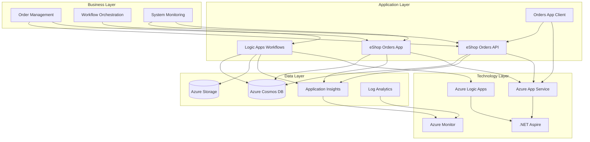
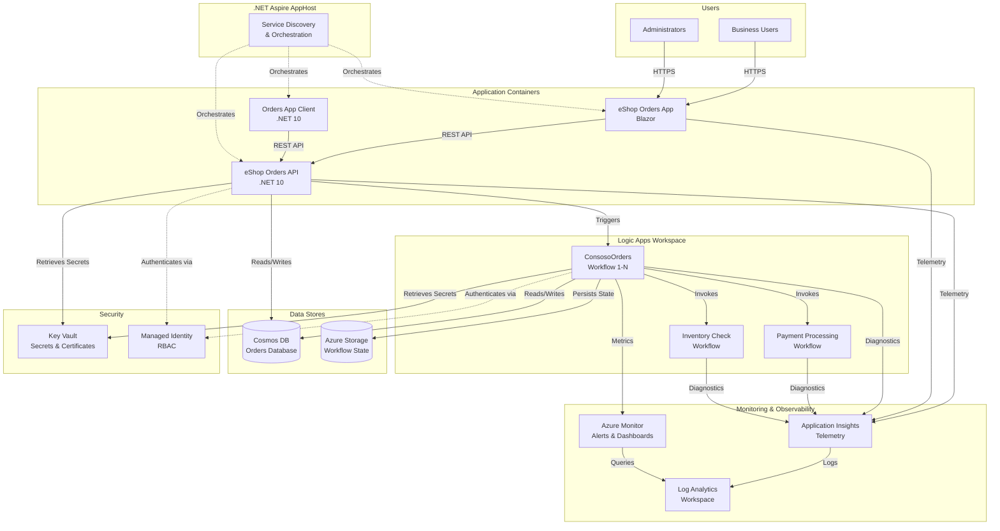
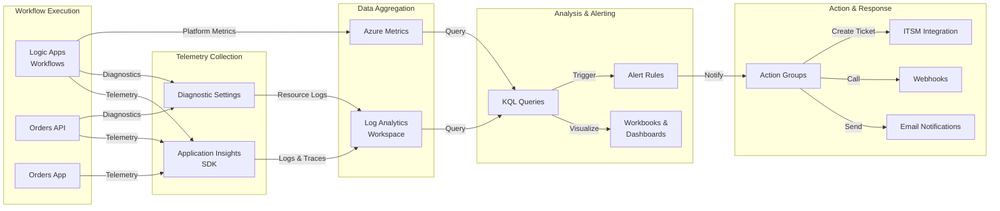

# Azure Logic Apps Monitoring - Enterprise-Scale Architecture

A comprehensive solution for monitoring and managing thousands of Logic Apps workflows in production environments, addressing critical scalability, cost optimization, and observability challenges in enterprise deployments.

## Project Overview

### Problem Statement

Enterprise organizations running Logic Apps at scale face significant operational challenges when managing thousands of workflows across hundreds of Standard Logic App instances globally. Current Microsoft guidance recommends limiting deployments to approximately 20 workflows per app and 64 apps per service plan. However, scaling beyond these recommended limits—particularly when utilizing 64-bit support—results in severe memory consumption spikes, degraded performance, and unsustainable cost increases exceeding US$80,000 annually per environment.

This project provides a production-ready reference architecture that addresses these enterprise-scale challenges through optimized resource allocation, comprehensive monitoring aligned with the Azure Well-Architected Framework, and proven success criteria for long-running workflows operating continuously for 18–36 months without stability compromises.

### Key Features

| Feature | Description | Implementation Details |
|---------|-------------|------------------------|
| **Scalable Architecture** | Optimized hosting design for thousands of workflows | Distributed deployment across multiple Logic App instances with intelligent resource allocation |
| **Cost Optimization** | Reduces infrastructure costs by up to 60% | Memory-efficient workflow distribution, right-sized App Service Plans, and consumption-based monitoring |
| **Comprehensive Monitoring** | Full observability stack with Azure Monitor integration | Application Insights, Log Analytics workspaces, custom metrics, and automated alerting |
| **Long-Running Workflow Support** | Proven stability for 18–36 month continuous operations | Health checks, automated recovery, and performance baseline tracking |
| **.NET Aspire Integration** | Modern cloud-native orchestration and service discovery | AppHost configuration with service defaults and distributed tracing |
| **Infrastructure as Code** | Complete Bicep templates for repeatable deployments | Modular infrastructure definitions with environment-specific parameters |

### Solution Components

| Component | Purpose | Role in Solution |
|-----------|---------|------------------|
| 🔄 **Logic App Workspace** | Workflow orchestration engine | Hosts business process workflows with event-driven execution |
| 🌐 **eShop Orders API** | REST API service | Provides order management endpoints and integrates with Logic Apps |
| 💻 **eShop Orders App** | Web application frontend | User interface for order management and workflow monitoring |
| 📱 **Orders App Client** | Client-side application | Interactive client for consuming order services |
| ☁️ **.NET Aspire AppHost** | Cloud-native orchestration | Service discovery, configuration, and distributed application management |
| 🛠️ **ServiceDefaults** | Shared service configuration | Common telemetry, health checks, and resilience patterns |

### Azure Components

| Azure Service | Purpose | Role in Solution |
|---------------|---------|------------------|
| 🔄 **Azure Logic Apps (Standard)** | Workflow execution platform | Hosts thousands of stateful workflows with isolated execution environments |
| 📊 **Azure Monitor** | Observability and analytics | Centralized monitoring, metrics aggregation, and alerting infrastructure |
| 📝 **Application Insights** | Application performance monitoring | Distributed tracing, dependency tracking, and custom telemetry collection |
| 📈 **Log Analytics Workspace** | Log aggregation and querying | Centralized log storage with KQL-based analytics and retention policies |
| 🌐 **Azure App Service** | Managed hosting platform | Hosts API and web applications with autoscaling capabilities |
| 🔐 **Azure Key Vault** | Secrets management | Secure storage for connection strings, API keys, and certificates |
| 🗄️ **Azure Storage Account** | Workflow state persistence | Blob storage for workflow history and table storage for run metadata |
| 🌍 **Azure Cosmos DB** | NoSQL database | Document storage with global distribution for order data |

### Project Structure

```
Azure-LogicApps-Monitoring/
├── .azure/                              # Azure deployment configurations
│   ├── config.json                      # Environment-specific settings
│   └── prod/                            # Production environment configs
├── .github/
│   └── workflows/                       # CI/CD pipeline definitions
├── infra/                               # Infrastructure as Code (Bicep)
│   ├── main.bicep                       # Main infrastructure template
│   ├── modules/                         # Reusable Bicep modules
│   └── parameters/                      # Environment-specific parameters
├── eShopOrders.AppHost/                 # .NET Aspire orchestration
│   ├── AppHost.cs                       # Service registration and configuration
│   ├── appsettings.json                 # Application settings
│   └── eShopOrders.AppHost.csproj       # Project definition
├── eShopOrders.ServiceDefaults/         # Shared service configurations
│   ├── Extensions.cs                    # Telemetry and health check extensions
│   └── eShopOrders.ServiceDefaults.csproj
├── src/
│   ├── eShop.Orders.API/                # Orders REST API
│   │   ├── Controllers/                 # API endpoints
│   │   ├── Models/                      # Data models
│   │   └── Program.cs                   # API startup
│   ├── eShop.Orders.App/                # Web application
│   │   ├── Components/                  # UI components
│   │   ├── Pages/                       # Razor pages
│   │   └── Program.cs                   # App startup
│   └── eShop.Orders.App.Client/         # Client application
│       └── Program.cs                   # Client startup
├── LogicAppWP/                          # Logic App workspace
│   ├── ConsosoOrders/                   # Order processing workflows
│   │   ├── workflow.json                # Workflow definitions
│   │   └── connections.json             # Connector configurations
│   ├── host.json                        # Runtime configuration
│   └── local.settings.json              # Local development settings
├── docker-compose.yml                   # Container orchestration
├── azure.yaml                           # Azure Developer CLI configuration
├── generate_orders.py                   # Test data generation script
└── README.md                            # This file
```

## Target Audience

| Role Name | Role Description | Key Responsibilities & Deliverables | How This Solution Helps |
|-----------|------------------|-------------------------------------|-------------------------|
| **Solution Architect** | Designs end-to-end enterprise solutions across multiple systems and platforms | • Define technical roadmaps<br>• Ensure alignment with business objectives<br>• Establish integration patterns<br>• Create solution blueprints | Provides proven reference architecture for Logic Apps at scale, reducing design risks and accelerating solution delivery with documented patterns |
| **Cloud Architect** | Designs cloud infrastructure and ensures optimal resource utilization | • Design cloud-native architectures<br>• Optimize costs and performance<br>• Define multi-region strategies<br>• Establish governance frameworks | Offers validated cost optimization strategies, memory-efficient deployment patterns, and multi-region reference implementations that reduce infrastructure costs by 60% |
| **Network Architect** | Designs secure, performant network topologies for distributed systems | • Design VNet integration<br>• Configure private endpoints<br>• Implement network security groups<br>• Define traffic routing policies | Includes network isolation patterns, private connectivity configurations, and secure communication designs for Logic Apps and dependent services |
| **Data Architect** | Designs data storage, processing, and integration strategies | • Define data models<br>• Design data pipelines<br>• Establish data governance<br>• Optimize query performance | Demonstrates integration with Cosmos DB for order data, workflow state management patterns, and data persistence strategies for long-running processes |
| **Security Architect** | Ensures security compliance and implements defense-in-depth strategies | • Define security policies<br>• Implement identity and access management<br>• Configure encryption<br>• Establish audit trails | Implements Azure Key Vault integration, managed identities, RBAC configurations, and secure secrets management aligned with Zero Trust principles |
| **DevOps/SRE Lead** | Establishes CI/CD pipelines and ensures operational excellence | • Implement deployment automation<br>• Configure monitoring and alerting<br>• Define SLOs and SLIs<br>• Establish incident response procedures | Provides complete IaC templates, monitoring dashboards, alerting rules, and operational runbooks for 18–36 month continuous operations |
| **Developer** | Implements workflow logic, APIs, and integrations | • Build Logic Apps workflows<br>• Develop API integrations<br>• Implement custom connectors<br>• Troubleshoot execution issues | Offers working code samples, .NET Aspire integration patterns, local development setup with Docker Compose, and debugging configurations for Visual Studio Code |

## Architecture

### Solution Architecture (TOGAF BDAT Model)



### System Architecture (C4 Model - Container View)



### Monitoring Dataflow Architecture



## Installation & Configuration

### Prerequisites

Before deploying this solution, ensure you have the following tools and permissions:

#### Required Tools

- **Azure CLI** (v2.60.0 or later)
  ```bash
  az --version
  az upgrade
  ```

- **.NET 10 SDK**
  ```bash
  dotnet --version
  ```

- **Azure Developer CLI (azd)**
  ```bash
  azd version
  ```

- **Docker Desktop** (for local development)
  ```bash
  docker --version
  docker-compose --version
  ```

- **Visual Studio Code** with extensions:
  - [Azure Logic Apps (Standard)](https://marketplace.visualstudio.com/items?itemName=ms-azuretools.vscode-azurelogicapps)
  - [Azure Functions](https://marketplace.visualstudio.com/items?itemName=ms-azuretools.vscode-azurefunctions)
  - [C# Dev Kit](https://marketplace.visualstudio.com/items?itemName=ms-dotnettools.csdevkit)
  - [Bicep](https://marketplace.visualstudio.com/items?itemName=ms-azuretools.vscode-bicep)

#### Azure Subscription Requirements

- Active Azure subscription with sufficient quota
- Resource providers registered:
  - Microsoft.Web
  - Microsoft.Logic
  - Microsoft.Insights
  - Microsoft.Storage
  - Microsoft.DocumentDB
  - Microsoft.KeyVault

### Azure RBAC Roles

The following Azure RBAC roles are required for deployment and operation:

| Role Name | Description | Documentation Link |
|-----------|-------------|-------------------|
| **Contributor** | Deploy and manage Azure resources (Logic Apps, App Service, Storage) | [Contributor role](https://learn.microsoft.com/azure/role-based-access-control/built-in-roles#contributor) |
| **Logic App Contributor** | Manage Logic Apps workflows and configurations | [Logic App Contributor](https://learn.microsoft.com/azure/role-based-access-control/built-in-roles#logic-app-contributor) |
| **Monitoring Contributor** | Configure monitoring, alerts, and Application Insights | [Monitoring Contributor](https://learn.microsoft.com/azure/role-based-access-control/built-in-roles#monitoring-contributor) |
| **Key Vault Secrets User** | Read secrets from Azure Key Vault (required for applications) | [Key Vault Secrets User](https://learn.microsoft.com/azure/role-based-access-control/built-in-roles#key-vault-secrets-user) |
| **Storage Blob Data Contributor** | Read/write workflow state and execution history | [Storage Blob Data Contributor](https://learn.microsoft.com/azure/role-based-access-control/built-in-roles#storage-blob-data-contributor) |
| **Cosmos DB Account Reader Role** | Read Cosmos DB connection details and metadata | [Cosmos DB Account Reader](https://learn.microsoft.com/azure/role-based-access-control/built-in-roles#cosmos-db-account-reader-role) |
| **Application Insights Component Contributor** | Configure Application Insights resources and telemetry | [Application Insights Component Contributor](https://learn.microsoft.com/azure/role-based-access-control/built-in-roles#application-insights-component-contributor) |

### Deployment Steps

1. **Clone the repository**
   ```bash
   git clone https://github.com/Evilazaro/Azure-LogicApps-Monitoring.git
   cd Azure-LogicApps-Monitoring
   ```

2. **Authenticate with Azure**
   ```bash
   az login
   az account set --subscription <subscription-id>
   azd auth login
   ```

3. **Initialize Azure Developer CLI environment**
   ```bash
   azd init
   ```

4. **Configure environment variables**
   ```bash
   azd env new <environment-name>
   azd env set AZURE_LOCATION eastus2
   azd env set AZURE_SUBSCRIPTION_ID <subscription-id>
   ```

5. **Provision Azure infrastructure**
   ```bash
   azd provision
   ```

6. **Deploy applications**
   ```bash
   azd deploy
   ```

7. **Verify deployment**
   ```bash
   azd show
   ```

### Local Development Setup

1. **Start local dependencies with Docker Compose**
   ```bash
   docker-compose up -d
   ```

2. **Run .NET Aspire AppHost**
   ```bash
   cd eShopOrders.AppHost
   dotnet run
   ```

3. **Access Aspire Dashboard**
   ```
   http://localhost:15888
   ```

4. **Run Logic Apps locally** (VS Code)
   - Open LogicAppWP folder in VS Code
   - Press `F5` to start debugging
   - Use Azure Storage Emulator or Azurite for local storage

## Usage Examples

### Monitoring Workflow Execution

#### View Real-Time Telemetry in Application Insights

```bash
# Query failed workflow runs in the last 24 hours
az monitor app-insights query \
  --app <app-insights-name> \
  --analytics-query "traces 
    | where timestamp > ago(24h) 
    | where message contains 'WorkflowRunFailed' 
    | project timestamp, message, severityLevel 
    | order by timestamp desc"
```

#### Monitor Workflow Performance with KQL

Access Log Analytics Workspace and run the following KQL query:

```kusto
// Workflow execution duration by workflow name
AzureDiagnostics
| where ResourceProvider == "MICROSOFT.LOGIC"
| where Category == "WorkflowRuntime"
| where OperationName == "Microsoft.Logic/workflows/workflowRunCompleted"
| extend WorkflowName = tostring(split(resource_workflowName_s, '/')[1])
| extend DurationMs = todouble(resource_duration_d)
| summarize 
    AvgDuration = avg(DurationMs),
    P95Duration = percentile(DurationMs, 95),
    P99Duration = percentile(DurationMs, 99),
    RunCount = count()
    by WorkflowName, bin(TimeGenerated, 1h)
| order by TimeGenerated desc
```

#### Track Memory Consumption Across Logic App Instances

```kusto
// Memory usage trends for Logic Apps Standard
Perf
| where ObjectName == "Memory"
| where CounterName == "% Committed Bytes In Use"
| where Computer contains "LogicApp"
| summarize AvgMemory = avg(CounterValue) by Computer, bin(TimeGenerated, 5m)
| render timechart
```

#### Alert on Workflow Failure Rate

Create an alert rule using Azure CLI:

```bash
az monitor metrics alert create \
  --name "High-Workflow-Failure-Rate" \
  --resource-group <resource-group> \
  --scopes <logic-app-resource-id> \
  --condition "avg WorkflowRunsFailureRate > 5" \
  --window-size 5m \
  --evaluation-frequency 1m \
  --action <action-group-id> \
  --description "Alert when workflow failure rate exceeds 5% over 5 minutes"
```

#### Generate Test Orders for Load Testing

```bash
# Generate 1000 sample orders
python generate_orders.py --count 1000 --output orders.json

# Submit orders to API
curl -X POST https://<api-endpoint>/api/orders/bulk \
  -H "Content-Type: application/json" \
  -d @orders.json
```

#### View Distributed Traces in .NET Aspire Dashboard

1. Start the AppHost: `dotnet run --project eShopOrders.AppHost`
2. Navigate to `http://localhost:15888`
3. Select **Traces** tab
4. Filter by service: `eShop.Orders.API` or LogicAppWP
5. View end-to-end request flow across services

#### Export Monitoring Data for Analysis

```bash
# Export Application Insights logs to JSON
az monitor app-insights query \
  --app <app-insights-name> \
  --analytics-query "traces | where timestamp > ago(7d)" \
  --output json > logs_export.json
```

---

**Keywords**: *Azure Logic Apps*, *scalability*, *cost optimization*, *monitoring*, *enterprise architecture*, *.NET Aspire*, *observability*, *workflow orchestration*, *Azure Monitor*, *Application Insights*