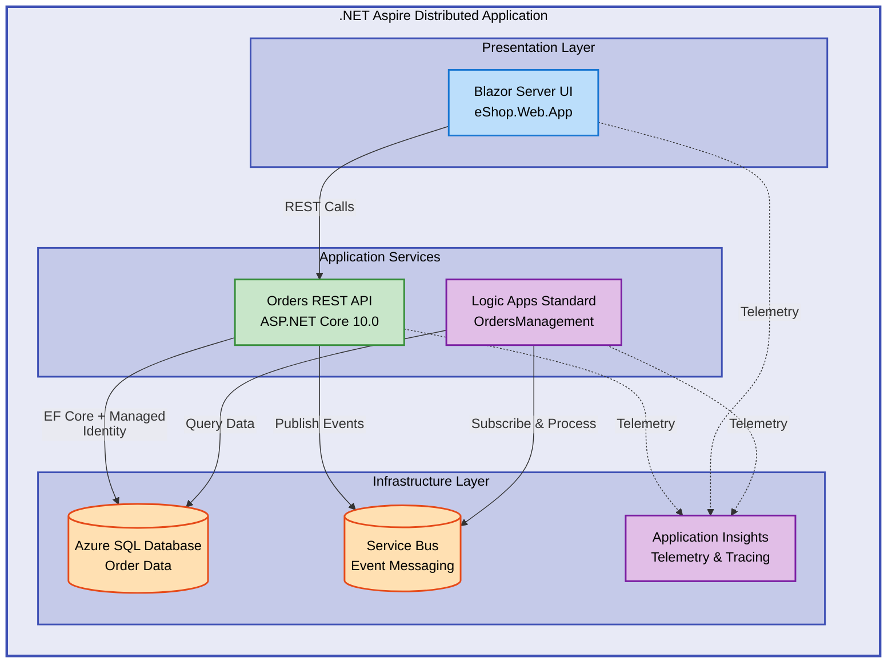

# Azure Logic Apps Monitoring Solution


Comprehensive monitoring and orchestration solution for Azure Logic Apps Standard workflows using .NET Aspire. Features distributed order management with Application Insights observability, Azure Service Bus messaging, and Azure SQL Database integration for enterprise-grade cloud-native applications.

## 📑 Table of Contents

- [Quick Start](#-quick-start)
- [Deployment](#-deployment)
- [Architecture](#-architecture)
- [Usage](#-usage)
- [Features](#-features)
- [Prerequisites](#-prerequisites)
- [Configuration](#-configuration)
- [API Documentation](#-api-documentation)
- [Development](#-development)
- [Monitoring](#-monitoring)
- [Troubleshooting](#-troubleshooting)
- [Contributing](#-contributing)
- [License](#-license)

## 🚀 Quick Start

```bash
# Clone and navigate to repository
git clone https://github.com/Evilazaro/Azure-LogicApps-Monitoring.git
cd Azure-LogicApps-Monitoring

# Run with .NET Aspire AppHost
dotnet run --project app.AppHost
```

The Aspire dashboard opens automatically at `http://localhost:15888` with real-time telemetry.

## 📦 Deployment

> ⚠️ **Prerequisites**: Ensure .NET SDK 10.0, Azure CLI 2.60.0+, and Docker are installed before proceeding.

### Local Development Setup

1. **Verify .NET SDK installation**:

```bash
dotnet --version
```

2. **Restore dependencies and build**:

```bash
dotnet restore
dotnet build
```

3. **Start the application**:

```bash
dotnet run --project app.AppHost
```

Access services at:
- Aspire Dashboard: `http://localhost:15888`
- Orders API: `http://localhost:5000/swagger`
- Web Application: `http://localhost:5001`

### Azure Deployment

1. **Authenticate with Azure**:

```bash
azd auth login
```

2. **Initialize and provision environment**:

```bash
azd env new production
azd up
```

> 💡 **Tip**: Use `azd deploy` for application-only updates after initial provisioning.

## 🏗️ Architecture



**System Components**:

- **eShop.Web.App**: Blazor Server frontend with FluentUI components for order management
- **eShop.Orders.API**: RESTful API with OpenAPI documentation and Entity Framework Core
- **OrdersManagement Logic App**: Event-driven workflows for order validation and processing
- **Azure SQL Database**: Relational data store with managed identity authentication
- **Azure Service Bus**: Asynchronous messaging backbone for event-driven architecture
- **Application Insights**: Distributed tracing with OpenTelemetry integration

## 💻 Usage

### Creating an Order via API

```bash
curl -X POST http://localhost:5000/api/orders \
  -H "Content-Type: application/json" \
  -d '{
    "customerId": "customer-789",
    "items": [
      {"productId": "prod-123", "quantity": 3, "price": 49.99}
    ]
  }'
```

**Expected Response**:

```json
{
  "orderId": "order-abc123",
  "status": "Pending",
  "totalAmount": 149.97,
  "createdAt": "2026-02-03T14:30:00Z"
}
```

### Monitoring Orders in Web UI

1. Navigate to `http://localhost:5001`
2. View real-time order status dashboard
3. Track order lifecycle events and workflow execution

## ✨ Features

- 🚀 **.NET Aspire Orchestration** - Unified local development and cloud deployment experience
- 🔒 **Managed Identity Authentication** - Passwordless Azure resource access
- 📊 **Distributed Tracing** - End-to-end observability with Application Insights and OpenTelemetry
- 🔄 **Event-Driven Architecture** - Reliable async messaging with Azure Service Bus
- 📝 **OpenAPI Documentation** - Interactive API exploration via Swagger UI
- 🏥 **Health Checks** - Built-in health monitoring endpoints for all services
- 🧪 **Comprehensive Testing** - Unit and integration test coverage across components

## 📋 Prerequisites

> ⚠️ **Important**: Verify all prerequisites are installed before beginning deployment.

- **.NET SDK**: Version 10.0 or later ([Download](https://dotnet.microsoft.com/download/dotnet/10.0))
- **Azure CLI**: Version 2.60.0 or later ([Install Guide](https://learn.microsoft.com/cli/azure/install-azure-cli))
- **Azure Developer CLI (azd)**: Version 1.11.0 or later ([Install Guide](https://learn.microsoft.com/azure/developer/azure-developer-cli/install-azd))
- **Docker Desktop**: Required for local containerized services ([Download](https://www.docker.com/products/docker-desktop))
- **Azure Subscription**: With Contributor permissions for resource provisioning
- **Visual Studio Code**: Recommended with C# Dev Kit extension ([Download](https://code.visualstudio.com/))

## ⚙️ Configuration

### Application Settings

Configure local development in `local.settings.json` within the Logic Apps project:

```json
{
  "IsEncrypted": false,
  "Values": {
    "APP_KIND": "workflowapp",
    "WORKFLOWS_TENANT_ID": "${AZURE_TENANT_ID}",
    "WORKFLOWS_SUBSCRIPTION_ID": "${AZURE_SUBSCRIPTION_ID}",
    "WORKFLOWS_RESOURCE_GROUP_NAME": "${AZURE_RESOURCE_GROUP}",
    "WORKFLOWS_LOCATION_NAME": "${AZURE_LOCATION}"
  }
}
```

### Infrastructure Configuration

Infrastructure is defined in `infra/main.bicep` using Azure Bicep. Key parameters:

- `solutionName`: Resource naming prefix (default: `orders`)
- `envName`: Environment identifier (`dev`, `test`, `staging`, `prod`)
- `location`: Azure deployment region (default: `eastus`)
- `deployHealthModel`: Enable Azure Monitor Health Model integration

### Connection Strings

Connection strings are automatically managed by .NET Aspire service discovery. Example configuration in `app.AppHost/AppHost.cs`:

```csharp
var sql = builder.AddSqlServer("sql")
    .AddDatabase("OrderDb");

var serviceBus = builder.AddAzureServiceBus("messaging");

var ordersApi = builder.AddProject<Projects.eShop_Orders_API>("orders-api")
    .WithReference(sql)
    .WithReference(serviceBus);
```

## 📖 API Documentation

The Orders API provides RESTful endpoints for comprehensive order management.

### Base URL

- **Local Development**: `http://localhost:5000`
- **Azure (Container Apps)**: `https://<container-app-url>.azurecontainerapps.io`

### Core Endpoints

| Method | Endpoint           | Description            | Authentication |
| ------ | ------------------ | ---------------------- | -------------- |
| GET    | `/api/orders`      | List all orders        | None           |
| GET    | `/api/orders/{id}` | Retrieve order by ID   | None           |
| POST   | `/api/orders`      | Create new order       | None           |
| PUT    | `/api/orders/{id}` | Update existing order  | None           |
| DELETE | `/api/orders/{id}` | Delete order           | None           |
| GET    | `/health`          | Service health status  | None           |
| GET    | `/swagger`         | OpenAPI documentation  | None           |

### Example: Retrieve Order Details

**Request**:

```bash
curl http://localhost:5000/api/orders/order-abc123
```

**Response**:

```json
{
  "orderId": "order-abc123",
  "customerId": "customer-789",
  "status": "Completed",
  "items": [
    {
      "productId": "prod-123",
      "quantity": 3,
      "price": 49.99,
      "lineTotal": 149.97
    }
  ],
  "totalAmount": 149.97,
  "createdAt": "2026-02-03T14:30:00Z",
  "updatedAt": "2026-02-03T14:45:00Z"
}
```

> 📝 **Note**: Complete API schemas and interactive testing are available at `/swagger` when the application is running.

## 🛠️ Development

### Project Structure

```plaintext
├── app.AppHost/              # .NET Aspire orchestration and service discovery
├── app.ServiceDefaults/      # Shared service configuration and telemetry
├── src/
│   ├── eShop.Orders.API/     # ASP.NET Core REST API
│   └── eShop.Web.App/        # Blazor Server frontend
├── workflows/
│   └── OrdersManagement/     # Azure Logic Apps Standard workflows
├── infra/                    # Bicep infrastructure-as-code templates
│   ├── main.bicep            # Main orchestration template
│   ├── shared/               # Shared resources (networking, identity)
│   └── workload/             # Application-specific resources
└── hooks/                    # Deployment lifecycle automation scripts
```

### Running Tests

```bash
# Execute all test projects
dotnet test

# Run tests with code coverage
dotnet test /p:CollectCoverage=true /p:CoverageReportsDirectory=./coverage

# Run specific test project
dotnet test src/tests/eShop.Orders.API.Tests
```

### Database Migrations

Entity Framework Core manages database schema:

```bash
# Create new migration
dotnet ef migrations add AddOrderStatusColumn --project src/eShop.Orders.API

# Apply pending migrations
dotnet ef database update --project src/eShop.Orders.API

# Rollback to specific migration
dotnet ef database update PreviousMigration --project src/eShop.Orders.API
```

> 💡 **Tip**: Migrations are automatically applied on application startup in development mode.

## 📊 Monitoring

### Application Insights Integration

All services send telemetry to Application Insights automatically:

- **Distributed Traces**: Visualize request flows across microservices
- **Performance Metrics**: Monitor response times, throughput, and resource utilization
- **Centralized Logs**: Unified logging from all application components
- **Live Metrics Stream**: Real-time application health and performance dashboard

Access Application Insights:

```bash
az monitor app-insights component show \
  --resource-group <resource-group> \
  --app <app-insights-name> \
  --query connectionString
```

### Health Check Endpoints

Monitor service health at dedicated endpoints:

- **Orders API**: `http://localhost:5000/health`
- **Web Application**: `http://localhost:5001/health`

**Sample Health Response**:

```json
{
  "status": "Healthy",
  "totalDuration": "00:00:00.1234567",
  "entries": {
    "OrderDb": {
      "status": "Healthy",
      "description": "SQL Server connection verified"
    },
    "ServiceBus": {
      "status": "Healthy",
      "description": "Message queue accessible"
    }
  }
}
```

## 🐛 Troubleshooting

### Database Connection Failures

**Symptom**: Application startup fails with SQL connection timeout

**Solution**: Verify SQL Server availability and connection string configuration

```bash
# Test database connectivity
dotnet ef database update --project src/eShop.Orders.API --verbose
```

### Azure Deployment Permission Errors

**Symptom**: `azd up` fails with authorization errors

**Solution**: Confirm Azure account has Contributor role on subscription

```bash
# Verify current role assignments
az role assignment list --assignee $(az account show --query user.name -o tsv)

# Request Contributor access if missing
az role assignment create \
  --assignee <your-email> \
  --role Contributor \
  --scope /subscriptions/<subscription-id>
```

### Service Bus Connection Issues

**Symptom**: Logic Apps workflows not receiving events

**Solution**: Validate Service Bus namespace and connection string configuration

```bash
# Test Service Bus connectivity
az servicebus namespace authorization-rule keys list \
  --resource-group <resource-group> \
  --namespace-name <namespace> \
  --name RootManageSharedAccessKey
```

> 💡 **Tip**: Check the Aspire dashboard at `http://localhost:15888` for detailed logs and telemetry when debugging issues.

## 🤝 Contributing

Contributions are welcome! Please follow these guidelines:

1. **Fork the repository** and create your feature branch:

```bash
git checkout -b feature/amazing-feature
```

2. **Commit your changes** with clear, descriptive messages:

```bash
git commit -m 'Add order cancellation workflow'
```

3. **Push to your branch** and open a Pull Request:

```bash
git push origin feature/amazing-feature
```

**Development Standards**:
- Ensure all tests pass: `dotnet test`
- Follow existing code style and conventions
- Add unit tests for new features
- Update documentation as needed

## 📝 License

This project is licensed under the MIT License. See the `LICENSE` file for complete details.

Copyright (c) 2025 Evilázaro Alves. Permission is granted to use, copy, modify, and distribute this software under the terms specified in the `LICENSE` file.
