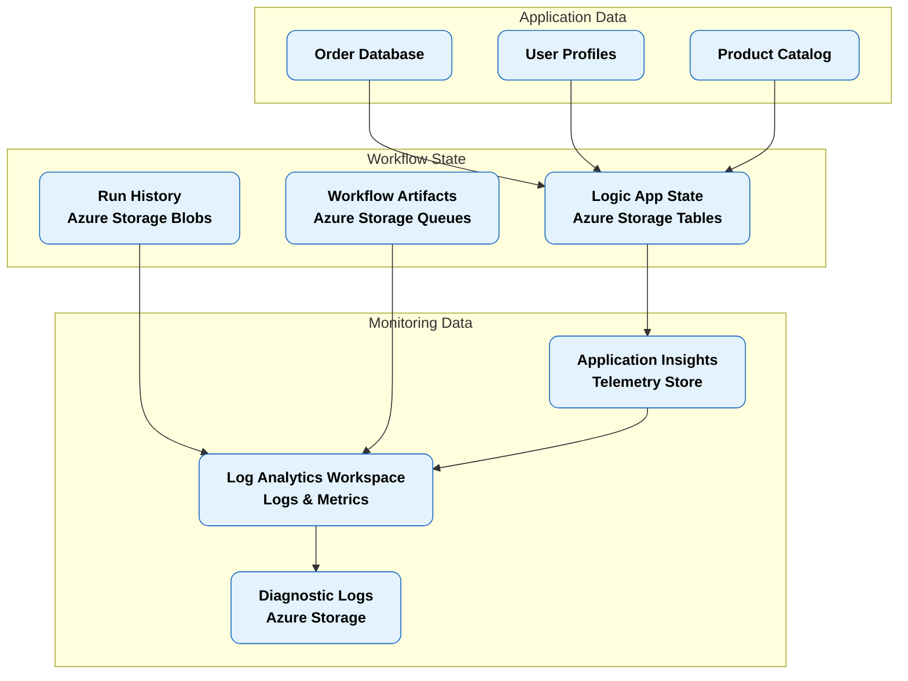
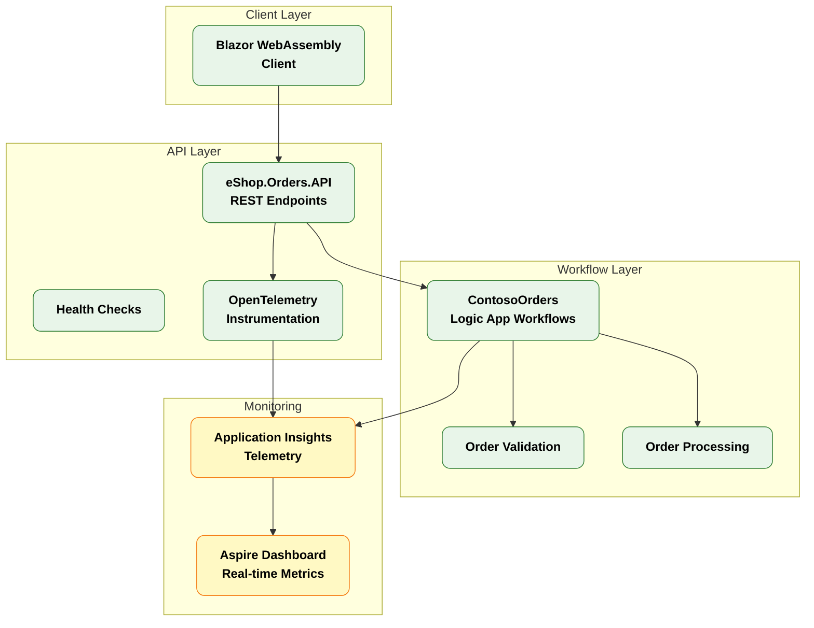
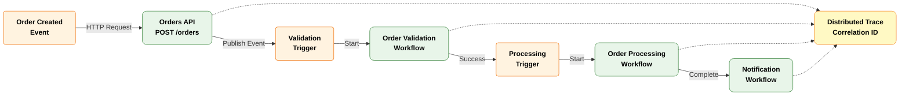
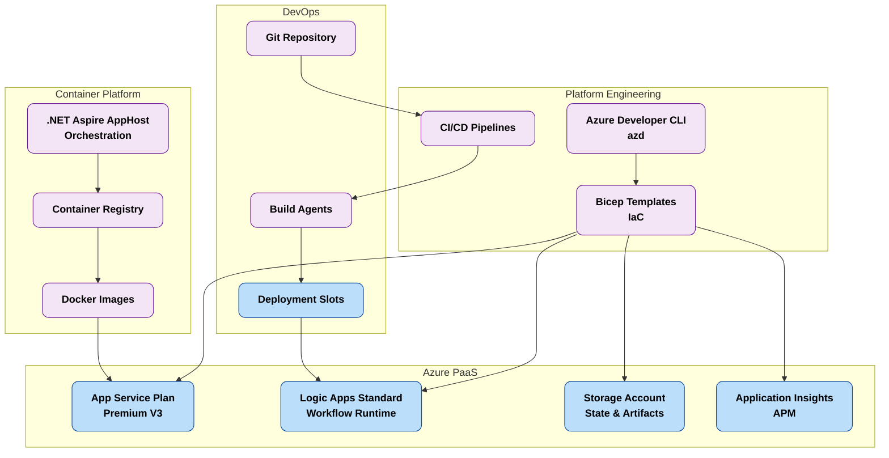
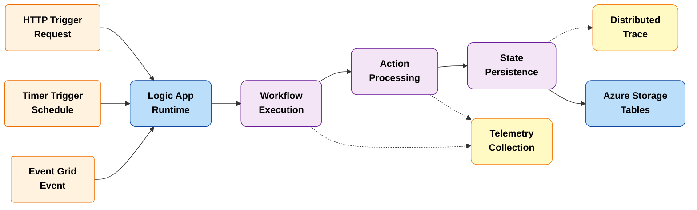
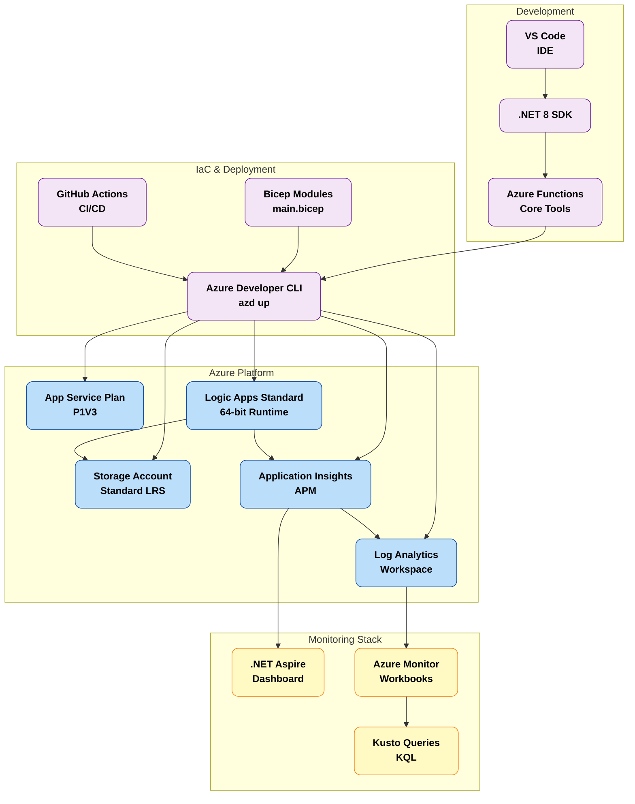

# Azure Logic Apps Standard - Enterprise Monitoring & Observability Solution

## Table of Contents

- [Problem Statement](#problem-statement)
- [Project Purpose](#project-purpose)
- [Key Features](#key-features)
- [Solution Components](#solution-components)
- [Azure Components](#azure-components)
- [Project Structure](#project-structure)
- [Architecture Layers ](#architecture-layers)
  - [Data Layer](#data-layer)
  - [Application Layer](#application-layer)
    - [Microservices Architecture](#microservices-architecture)
    - [Event-Driven Workflow](#event-driven-workflow)
  - [Technology Layer](#technology-layer)
    - [Cloud-Native Architecture](#cloud-native-architecture)
    - [Serverless Workflow Execution](#serverless-workflow-execution)
    - [Platform Engineering Architecture](#platform-engineering-architecture)
- [Deployment Instructions](#deployment-instructions)
  - [Prerequisites](#prerequisites)
  - [Azure RBAC Roles](#azure-rbac-roles)
  - [Deployment Steps](#deployment-steps)
- [Usage Examples](#usage-examples)
  - [Monitoring Examples](#monitoring-examples)
    - [Viewing Real-Time Telemetry in Aspire Dashboard](#viewing-real-time-telemetry-in-aspire-dashboard)
    - [Querying Application Insights with KQL](#querying-application-insights-with-kql)
  - [Observability Guidance](#observability-guidance)
    - [Logic Apps Workflow Monitoring Best Practices](#logic-apps-workflow-monitoring-best-practices)
    - [Kusto Query Examples for Operational Insights](#kusto-query-examples-for-operational-insights)
- [Additional Resources](#additional-resources)

## Problem Statement

Enterprise organizations deploying Azure Logic Apps Standard at scale face significant operational challenges when hosting thousands of workflows across global deployments. Current Microsoft guidance recommends approximately 20 workflows per Logic App instance and up to 64 apps per App Service Plan. However, organizations exceeding these limits—particularly when enabling 64-bit support—frequently encounter critical issues including memory spikes, workflow instability, and substantial cost overruns.

These challenges are amplified in scenarios involving long-running workflows (18–36 months duration) where maintaining stability, observability, and cost efficiency becomes increasingly difficult. Without proper monitoring and resource optimization strategies, enterprises report annual costs exceeding US$80,000 per environment, often without achieving the required reliability and performance standards.

The lack of comprehensive monitoring patterns aligned with the Azure Well-Architected Framework further complicates troubleshooting, capacity planning, and proactive incident management at enterprise scale.

## Project Purpose

This solution provides a production-ready reference architecture for deploying and monitoring Azure Logic Apps Standard at enterprise scale. It addresses the critical gap between Microsoft's baseline recommendations and real-world requirements for organizations managing thousands of workflows across multiple regions and environments.

The architecture implements proven patterns for optimizing workflow hosting density while maintaining stability and cost efficiency. By combining Azure Monitor, Application Insights, and .NET Aspire's observability capabilities, the solution delivers comprehensive monitoring that aligns with the Azure Well-Architected Framework's operational excellence pillar.

The reference implementation demonstrates how to effectively instrument Logic Apps workflows, APIs, and supporting services with OpenTelemetry-based telemetry. This enables organizations to achieve end-to-end visibility across distributed workflow executions, identify performance bottlenecks, and implement proactive monitoring strategies that prevent incidents before they impact business operations.

The solution is designed for enterprise DevOps and Platform Engineering teams who need to establish repeatable deployment patterns, monitoring standards, and operational runbooks for Logic Apps at scale. It provides working code, infrastructure templates, and observability configurations that can be adapted to organization-specific requirements while maintaining production-grade reliability.

## Key Features

| Feature | Description | Implementation Details |
|---------|-------------|------------------------|
| **Enterprise-Scale Monitoring** | Comprehensive observability for Logic Apps workflows and dependencies | OpenTelemetry instrumentation with Application Insights integration |
| **.NET Aspire Integration** | Cloud-native application development and monitoring framework | Aspire Dashboard for real-time telemetry visualization and distributed tracing |
| **Infrastructure as Code** | Declarative Azure resource provisioning | Bicep templates for Logic Apps, App Service Plans, Storage, and monitoring resources |
| **Distributed Tracing** | End-to-end transaction visibility across microservices and workflows | OpenTelemetry-based correlation across API, workflows, and data layers |
| **Cost Optimization Patterns** | Reference architecture for optimal workflow density | Proven configurations balancing performance, stability, and cost efficiency |
| **Well-Architected Alignment** | Monitoring patterns following Azure operational excellence guidance | Structured logging, metrics collection, and alerting strategies |

## Solution Components

| Component | Description | Role |
|-----------|-------------|------|
| **eShop.Orders.API** | RESTful order management API | Exposes order creation and management endpoints; integrates with Logic Apps workflows |
| **eShop.Orders.App** | Blazor web application for order management | Provides user interface for order operations; demonstrates client-side monitoring |
| **eShop.Orders.App.Client** | Blazor WebAssembly client components | Client-side application logic with telemetry integration |
| **LogicAppWP (ContosoOrders)** | Azure Logic Apps Standard workflows | Implements order processing, validation, and integration workflows |
| **Aspire AppHost** | .NET Aspire orchestration and service discovery | Manages local development environment and service registration |
| **Aspire ServiceDefaults** | Shared observability and configuration | Provides standardized telemetry, health checks, and service resilience |

## Azure Components

| Azure Service | Description | Role |
|---------------|-------------|------|
| **Azure Logic Apps Standard** | Serverless workflow orchestration platform | Hosts enterprise workflows with stateful execution and retry capabilities |
| **Azure App Service Plan** | Managed compute hosting for Logic Apps | Provides isolated compute resources with predictable performance characteristics |
| **Azure Storage Account** | Blob, Table, and Queue storage | Stores workflow state, run history, and integration artifacts |
| **Azure Application Insights** | Application performance monitoring (APM) | Collects telemetry, metrics, and distributed traces from all components |
| **Azure Monitor** | Unified monitoring and alerting platform | Aggregates metrics, logs, and traces for operational dashboards and alerts |
| **Azure Log Analytics Workspace** | Centralized log aggregation and analytics | Enables KQL queries for workflow analysis and troubleshooting |

## Project Structure

```
.
├── .azure/                              # Azure Developer CLI configuration
│   ├── config.json                      # Environment configuration
│   └── staging/                         # Staging environment artifacts
├── .dockerignore                        # Docker build exclusions
├── .gitignore                           # Git source control exclusions
├── .vscode/                             # VS Code workspace settings
│   ├── launch.json                      # Debug configurations
│   ├── settings.json                    # Workspace settings
│   └── tasks.json                       # Build and deployment tasks
├── azure.yaml                           # Azure Developer CLI project definition
├── eShopOrders.sln                      # .NET solution file
├── generate_orders.py                   # Test data generation script
├── launchSettings.json                  # Application launch profiles
├── README.md                            # This file
├── eShopOrders.AppHost/                 # .NET Aspire AppHost orchestration
│   ├── AppHost.cs                       # Service registration and orchestration
│   ├── Constants.cs                     # Shared constants
│   ├── appsettings.json                 # Application configuration
│   ├── appsettings.Development.json     # Development overrides
│   ├── eShopOrders.AppHost.csproj       # Project file
│   ├── infra/                           # Aspire-generated infrastructure
│   └── Properties/                      # Assembly properties
├── eShopOrders.ServiceDefaults/         # Aspire shared service configuration
│   ├── Extensions.cs                    # Service extension methods
│   ├── eShopOrders.ServiceDefaults.csproj
│   └── [OpenTelemetry configuration]
├── hooks/                               # Azure Developer CLI hooks
│   └── [Deployment lifecycle scripts]
├── infra/                               # Infrastructure as Code (Bicep)
│   ├── main.bicep                       # Main infrastructure template
│   └── [Resource module definitions]
└── src/                                 # Application source code
    ├── eShop.Orders.API/                # Order management API
    │   ├── Controllers/                 # API endpoints
    │   ├── Program.cs                   # Application startup
    │   └── eShop.Orders.API.csproj
    ├── eShop.Orders.App/                # Blazor Server application
    │   ├── Components/                  # Razor components
    │   ├── Program.cs                   # Application startup
    │   └── eShop.Orders.App.csproj
    └── eShop.Orders.App.Client/         # Blazor WebAssembly client
        ├── Pages/                       # Client-side pages
        └── eShop.Orders.App.Client.csproj
```

## Architecture Layers 

### Data Layer

**Overview:**  
The Data Layer implements Master Data Management (MDM) principles for both application data and monitoring telemetry. It provides persistent storage for workflow state, run history, application data, and observability artifacts. The architecture separates operational data (orders, transactions) from diagnostic data (logs, metrics, traces) to optimize query performance and retention policies.

**Purpose and Key Capabilities:**
- **Workflow State Management**: Azure Storage Tables and Blobs store Logic Apps runtime state and execution history
- **Operational Data**: Application data for order management and business transactions
- **Telemetry Aggregation**: Centralized collection of logs, metrics, and distributed traces in Log Analytics
- **Data Retention**: Configurable retention policies aligned with compliance and cost optimization requirements



**Legend:**
- 🔵 Blue rounded boxes: Data entities and storage services
- Solid arrows: Data flow and dependencies

---

### Application Layer

**Overview:**  
The Application Layer implements a microservices architecture with event-driven communication patterns. It consists of REST APIs, Blazor applications, and Logic Apps workflows that collectively deliver order management capabilities. Each component is independently deployable and instrumented with OpenTelemetry for comprehensive observability.

**Purpose and Key Capabilities:**
- **API Gateway**: RESTful order management endpoints with standardized error handling
- **Event Processing**: Asynchronous order processing through Logic Apps workflows
- **User Interface**: Blazor-based web application for order management operations
- **Service Integration**: Coordination between APIs, workflows, and external systems

#### Microservices Architecture



**Legend:**
- 🟢 Green rounded boxes: Application components
- 🟡 Yellow rounded boxes: Monitoring and observability components

#### Event-Driven Workflow



**Legend:**
- 🟠 Orange boxes: Event triggers
- 🟢 Green rounded boxes: Application components
- 🟡 Yellow rounded boxes: Monitoring components
- Solid arrows: Synchronous calls
- Dashed arrows: Telemetry flow

---

### Technology Layer

**Overview:**  
The Technology Layer implements cloud-native patterns using Azure PaaS services, containerization, and DevOps automation. It provides the runtime infrastructure, deployment pipelines, and platform engineering capabilities required for enterprise-scale Logic Apps deployments.

**Purpose and Key Capabilities:**
- **Serverless Compute**: Azure App Service Plans hosting Logic Apps with elastic scaling
- **Container Orchestration**: Containerized APIs and applications for consistent deployment
- **Infrastructure as Code**: Bicep templates for repeatable, auditable infrastructure provisioning
- **Observability Platform**: Integrated monitoring with .NET Aspire and Azure Monitor

#### Cloud-Native Architecture



**Legend:**
- 🟣 Purple rounded boxes: Platform engineering and technology components
- 🔵 Blue rounded boxes: Azure PaaS services

#### Serverless Workflow Execution



**Legend:**
- 🟠 Orange boxes: Workflow triggers
- 🟣 Purple rounded boxes: Workflow execution components
- 🔵 Blue rounded boxes: Azure services
- 🟡 Yellow rounded boxes: Monitoring components
- Dashed arrows: Telemetry flow

#### Platform Engineering Architecture



**Legend:**
- 🟣 Purple rounded boxes: Platform and development tools
- 🔵 Blue rounded boxes: Azure PaaS services
- 🟡 Yellow rounded boxes: Monitoring and observability stack

---

## Deployment Instructions

### Prerequisites

Before deploying this solution, ensure you have the following tools and access:

- **Azure Subscription**: Active subscription with Contributor or Owner permissions
- **Azure Developer CLI**: Install from [aka.ms/azd-install](https://aka.ms/azd-install)
- **.NET 8 SDK**: Install from [dotnet.microsoft.com](https://dotnet.microsoft.com/download/dotnet/8.0)
- **Visual Studio Code**: Recommended IDE with Azure and C# extensions
- **Azure Functions Core Tools**: v4.x for Logic Apps local development
- **Git**: Version control for repository management
- **Docker** (optional): For local container development
- **PowerShell 7+** or **Bash**: For running deployment scripts

### Azure RBAC Roles

The following Azure RBAC roles are required for deploying and operating this solution:

| Role Name | Description | Documentation Link |
|-----------|-------------|--------------------|
| **Contributor** | Full access to manage Azure resources (deployment and configuration) | [Contributor role](https://learn.microsoft.com/azure/role-based-access-control/built-in-roles#contributor) |
| **User Access Administrator** | Manage user access to Azure resources (required for RBAC assignments) | [User Access Administrator](https://learn.microsoft.com/azure/role-based-access-control/built-in-roles#user-access-administrator) |
| **Logic App Contributor** | Create and manage Logic Apps workflows and configurations | [Logic App Contributor](https://learn.microsoft.com/azure/role-based-access-control/built-in-roles#logic-app-contributor) |
| **Monitoring Contributor** | Configure monitoring settings and access diagnostic data | [Monitoring Contributor](https://learn.microsoft.com/azure/role-based-access-control/built-in-roles#monitoring-contributor) |
| **Storage Account Contributor** | Manage storage accounts for Logic Apps state and artifacts | [Storage Account Contributor](https://learn.microsoft.com/azure/role-based-access-control/built-in-roles#storage-account-contributor) |
| **Application Insights Component Contributor** | Configure Application Insights resources and telemetry collection | [Application Insights Contributor](https://learn.microsoft.com/azure/role-based-access-control/built-in-roles#application-insights-component-contributor) |

### Deployment Steps

1. **Clone the repository**:
   ```bash
   git clone <repository-url>
   cd Azure-LogicApps-Monitoring
   ```

2. **Authenticate with Azure**:
   ```bash
   azd auth login
   ```

3. **Initialize the environment**:
   ```bash
   azd env new <environment-name>
   ```

4. **Configure environment variables** (optional):
   Edit `.azure/<environment-name>/.env` to customize deployment settings.

5. **Provision infrastructure and deploy**:
   ```bash
   azd up
   ```

   This command will:
   - Provision all Azure resources using Bicep templates
   - Build .NET applications and Logic Apps workflows
   - Deploy applications to Azure App Service and Logic Apps
   - Configure Application Insights and monitoring

6. **Verify deployment**:
   - Navigate to the Azure Portal and locate the resource group
   - Verify all resources are provisioned successfully
   - Access the .NET Aspire Dashboard URL displayed in the deployment output

---

## Usage Examples

### Monitoring Examples

#### Viewing Real-Time Telemetry in Aspire Dashboard

The .NET Aspire Dashboard provides real-time visibility into application telemetry:

1. Locate the Aspire Dashboard URL in the deployment output or run:
   ```bash
   azd show
   ```

2. Open the dashboard in your browser

3. Navigate to the **Traces** tab to view distributed traces across APIs and workflows

4. Use the **Metrics** tab to monitor:
   - Request rates and latencies
   - Logic Apps workflow execution counts
   - HTTP dependency call durations
   - Error rates and exceptions

#### Querying Application Insights with KQL

Access Application Insights in the Azure Portal and run Kusto queries:

**Example 1: Monitor Logic Apps workflow execution duration**
```kql
customMetrics
| where name == "WorkflowRunDuration"
| summarize avg(value), percentile(value, 95), percentile(value, 99) by bin(timestamp, 5m)
| render timechart
```

**Example 2: Identify failed workflow runs**
```kql
traces
| where customDimensions.WorkflowName != ""
| where customDimensions.Status == "Failed"
| project timestamp, WorkflowName = customDimensions.WorkflowName, 
          ErrorMessage = customDimensions.Error, CorrelationId = operation_Id
| order by timestamp desc
```

**Example 3: Track end-to-end transaction flow**
```kql
union traces, requests, dependencies
| where operation_Id == "<correlation-id>"
| project timestamp, itemType, name, operation_Name, duration, resultCode
| order by timestamp asc
```

### Observability Guidance

#### Logic Apps Workflow Monitoring Best Practices

Based on [Azure Logic Apps monitoring guidance](https://learn.microsoft.com/azure/logic-apps/monitor-logic-apps), implement the following practices:

1. **Enable Diagnostic Settings**:
   - Configure diagnostic logs for all Logic Apps instances
   - Send logs to Log Analytics Workspace for long-term retention
   - Enable `WorkflowRuntime` and `FunctionAppLogs` categories

2. **Implement Structured Logging**:
   - Use consistent correlation IDs across workflows and APIs
   - Include business context in custom dimensions (order ID, customer ID)
   - Log critical checkpoints for long-running workflows

3. **Configure Alerts**:
   - Set up alerts for workflow failures with severity classification
   - Monitor workflow run duration percentiles (P95, P99)
   - Alert on throttling events or quota limits

4. **Use Run History Retention Policies**:
   - Configure appropriate retention periods (default: 90 days)
   - Export historical run data for compliance requirements
   - Archive long-term data to Azure Storage for cost optimization

#### Kusto Query Examples for Operational Insights

**Monitor workflow hosting density per App Service Plan**:
```kql
customMetrics
| where name == "ActiveWorkflows"
| summarize max(value) by AppServicePlan = cloud_RoleInstance
| join kind=inner (
    customMetrics
    | where name == "MemoryUsagePercent"
    | summarize avg(value) by cloud_RoleInstance
) on cloud_RoleInstance
| project AppServicePlan, MaxActiveWorkflows = max_value, AvgMemoryPercent = avg_value
```

**Analyze long-running workflow patterns**:
```kql
customMetrics
| where name == "WorkflowRunDuration"
| where value > 3600000 // > 1 hour
| summarize count(), avg(value), max(value) by WorkflowName = tostring(customDimensions.WorkflowName)
| order by count_ desc
```

**Detect memory pressure incidents**:
```kql
performanceCounters
| where category == "Memory"
| where counter == "% Committed Bytes In Use"
| where value > 80
| summarize count() by bin(timestamp, 5m), cloud_RoleInstance
| render timechart
```

**Track API dependency reliability**:
```kql
dependencies
| where type == "HTTP"
| summarize SuccessRate = 100.0 * countif(success == true) / count(), 
            P95Duration = percentile(duration, 95)
by name
| order by SuccessRate asc
```

---

## Additional Resources

- [Azure Logic Apps Standard documentation](https://learn.microsoft.com/azure/logic-apps/logic-apps-overview)
- [.NET Aspire overview](https://learn.microsoft.com/dotnet/aspire/get-started/aspire-overview)
- [Azure Monitor OpenTelemetry integration](https://learn.microsoft.com/azure/azure-monitor/app/opentelemetry-data-collection)
- [Azure Well-Architected Framework - Operational Excellence](https://learn.microsoft.com/azure/well-architected/operational-excellence/monitoring)