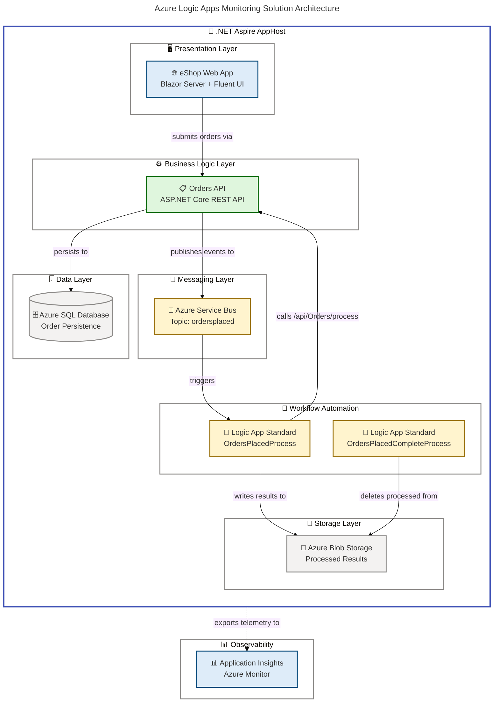

# Azure Logic Apps Monitoring Solution


An enterprise-grade distributed application for eShop order management built with .NET Aspire, integrating Azure Logic Apps Standard workflows, Azure Service Bus messaging, Azure SQL, and Blazor Server UI with comprehensive observability through OpenTelemetry and Azure Monitor.

## Overview

**Overview**

This solution demonstrates a production-ready order processing system orchestrated by .NET Aspire, where Azure Logic Apps Standard workflows automate the order lifecycle by subscribing to Service Bus topics and coordinating backend API calls with Azure Blob Storage for result persistence.

> 💡 **Why This Matters**: Organizations processing high-volume orders need reliable, observable, and automated workflows that decouple order intake from processing. This solution provides a complete reference architecture with built-in resilience patterns, distributed tracing, and infrastructure-as-code, enabling teams to deploy a fully functional order management pipeline to Azure in minutes.

> 📌 **How It Works**: The Blazor Server frontend submits orders through the REST API, which persists them to Azure SQL and publishes events to Azure Service Bus. Azure Logic Apps Standard workflows subscribe to the `ordersplaced` topic, invoke the API's processing endpoint, and write results to Azure Blob Storage. A cleanup workflow automatically removes processed blobs. .NET Aspire orchestrates all services locally with emulators and in the cloud with managed Azure resources.

## 📋 Table of Contents

- [Architecture](#-architecture)
- [Features](#-features)
- [Requirements](#-requirements)
- [Getting Started](#-getting-started)
- [Configuration](#-configuration)
- [Usage](#-usage)
- [Deployment](#-deployment)
- [Project Structure](#-project-structure)
- [Testing](#-testing)
- [Contributing](#-contributing)
- [License](#-license)

## 🏗️ Architecture

**Overview**

The solution follows an event-driven, multi-tier architecture orchestrated by .NET Aspire, with clear separation between the presentation layer (Blazor Server), the business logic layer (Orders API), the messaging layer (Azure Service Bus), and the workflow automation layer (Azure Logic Apps Standard).

> 💡 **Why This Matters**: Event-driven architecture enables independent scaling and resilient processing of orders, ensuring that temporary failures in downstream services do not block order intake or cause data loss.

> 📌 **How It Works**: .NET Aspire's `AppHost` project defines the distributed application graph, wiring service discovery, connection strings, and telemetry across all components. Locally, SQL and Service Bus emulators are used; in Azure, managed services with Entra ID authentication are provisioned through Bicep templates.



**Component Roles:**

| Component       | Role                                                                 | Technology                   |
| --------------- | -------------------------------------------------------------------- | ---------------------------- |
| 🎯 AppHost      | Orchestrates all services, wires configuration and service discovery | .NET Aspire 13.1             |
| 🌐 Web App      | Interactive order management UI with real-time updates               | Blazor Server, Fluent UI     |
| 📋 Orders API   | REST API for order CRUD, batch operations, and processing            | ASP.NET Core, EF Core        |
| 🗄️ SQL Database | Persistent order and product storage with migrations                 | Azure SQL, EF Core           |
| 📨 Service Bus  | Decoupled event publishing via `ordersplaced` topic                  | Azure Service Bus            |
| 🔄 Logic Apps   | Automated order processing and result persistence workflows          | Azure Logic Apps Standard    |
| 💾 Blob Storage | Stores processed order results for downstream consumption            | Azure Blob Storage           |
| 📊 App Insights | Distributed tracing, metrics, and log aggregation                    | Azure Monitor, OpenTelemetry |

## ✨ Features

**Overview**

The solution delivers a complete order management lifecycle with enterprise-grade observability, automated workflows, and infrastructure-as-code deployment for Azure.

> 💡 **Why This Matters**: Building distributed applications with reliable messaging, automated workflows, and full observability typically requires significant integration effort. This solution provides all of these capabilities out of the box with .NET Aspire orchestration, reducing setup time from weeks to minutes.

> 📌 **How It Works**: Each feature is implemented as a modular component wired through .NET Aspire's service discovery and dependency injection, enabling independent development, testing, and scaling of each capability.

| Feature                      | Description                                                                                                                    | Status    |
| ---------------------------- | ------------------------------------------------------------------------------------------------------------------------------ | --------- |
| 🚀 .NET Aspire Orchestration | Single `AppHost` project orchestrates all services with service discovery, health checks, and configuration management         | ✅ Stable |
| 📋 Order Management API      | Full REST API with CRUD, batch processing, pagination, and Swagger/OpenAPI documentation                                       | ✅ Stable |
| 🌐 Blazor Server UI          | Interactive frontend with Microsoft Fluent UI components for order placement, listing, and detail viewing                      | ✅ Stable |
| 📨 Event-Driven Messaging    | Service Bus topic/subscription pattern decouples order intake from processing with retry semantics                             | ✅ Stable |
| 🔄 Logic Apps Workflows      | Two stateful workflows automate order processing and cleanup via Service Bus triggers and Blob Storage                         | ✅ Stable |
| 📊 Distributed Tracing       | End-to-end OpenTelemetry instrumentation with OTLP export and Azure Monitor integration across all services                    | ✅ Stable |
| 🏥 Health Checks             | Custom health check endpoints (`/health`, `/alive`) for database connectivity and Service Bus availability                     | ✅ Stable |
| 🛡️ Resilience Patterns       | HTTP retry policies (3 retries), circuit breaker, and 600-second timeout configured via `Microsoft.Extensions.Http.Resilience` | ✅ Stable |
| 🔒 Managed Identity          | Entra ID authentication for SQL, Service Bus, and Logic App connections using user-assigned managed identity                   | ✅ Stable |
| 🏗️ Infrastructure as Code    | Complete Bicep templates for VNet, SQL, Service Bus, Container Apps, Logic App, and monitoring resources                       | ✅ Stable |
| 🧪 Local Development         | SQL container and Service Bus emulator for fully offline local development via Aspire                                          | ✅ Stable |
| 🧩 Comprehensive Testing     | MSTest-based unit and integration tests with NSubstitute mocking and code coverage reporting                                   | ✅ Stable |

## 📦 Requirements

**Overview**

The solution requires .NET 10.0 SDK and Azure Developer CLI for provisioning and deployment. Local development uses emulators for Azure services, so an Azure subscription is only required for cloud deployment.

> 💡 **Why This Matters**: Clearly defined prerequisites prevent environment-related issues during development and deployment, ensuring a smooth onboarding experience for new contributors.

> 📌 **How It Works**: The `check-dev-workstation.ps1` hook script validates all prerequisites automatically, checking SDK versions, CLI tools, and Azure configurations before provisioning begins.

| Requirement                    | Version   | Purpose                                                   |
| ------------------------------ | --------- | --------------------------------------------------------- |
| ⚙️ .NET SDK                    | 10.0.100+ | Runtime and build toolchain                               |
| 🛠️ Azure Developer CLI (`azd`) | Latest    | Infrastructure provisioning and deployment                |
| 🛠️ Azure CLI (`az`)            | 2.60.0+   | Azure resource management and authentication              |
| 📝 Visual Studio Code          | Latest    | Recommended IDE with Aspire extensions                    |
| ☁️ Azure Subscription          | Active    | Required for cloud deployment only                        |
| 🐳 Docker Desktop              | Latest    | Required for local Service Bus emulator and SQL container |
| 🛠️ Bicep CLI                   | 0.30.0+   | Infrastructure template compilation                       |
| 💻 PowerShell                  | 7.0+      | Hook scripts execution                                    |

> ⚠️ **Important**: Local development with .NET Aspire requires Docker Desktop to be running for the SQL Server container and Service Bus emulator. Cloud deployment requires an active Azure subscription with Contributor-level access.

## 🚀 Getting Started

**Overview**

Get the solution running locally in under 5 minutes using .NET Aspire's local orchestration with emulators, or deploy to Azure with a single `azd up` command.

> 💡 **Why This Matters**: A streamlined getting-started experience reduces onboarding friction and enables developers to be productive immediately, whether they are running locally or deploying to Azure.

> 📌 **How It Works**: .NET Aspire automatically provisions local SQL Server containers and Service Bus emulators when running the AppHost project, eliminating the need for external service setup during development.

### Quick Start (Local Development)

1. **Clone the repository**

   ```bash
   git clone https://github.com/Evilazaro/Azure-LogicApps-Monitoring.git
   cd Azure-LogicApps-Monitoring
   # Expected: Repository cloned successfully
   ```

2. **Validate your development environment**

   ```powershell
   ./hooks/check-dev-workstation.ps1
   # Expected: All validations passed — your workstation is ready
   ```

3. **Restore dependencies and build**

   ```bash
   dotnet restore app.sln
   dotnet build app.sln
   # Expected: Build succeeded with 0 errors
   ```

4. **Run the Aspire AppHost**

   ```bash
   dotnet run --project app.AppHost/app.AppHost.csproj
   # Expected: Aspire dashboard available at https://localhost:17267
   ```

   The Aspire dashboard opens in your browser showing all services, health checks, and distributed traces. The Orders API Swagger UI is available at the API's endpoint.

> 💡 **Tip**: Docker Desktop must be running before starting the AppHost, as Aspire provisions a SQL Server container and Service Bus emulator automatically.

### Deploy to Azure

```bash
azd auth login
azd up
# Expected: All Azure resources provisioned and application deployed to Container Apps
```

The `azd up` command runs `preprovision` hooks (environment validation and build/test), provisions infrastructure via Bicep, deploys the application to Azure Container Apps, and executes `postprovision` hooks (secrets configuration, Logic App workflow deployment).

## ⚙️ Configuration

**Overview**

The solution uses .NET Aspire's configuration system backed by `appsettings.json`, environment variables, and Azure Developer CLI environment settings. Azure service connections are managed through Aspire's resource abstractions with automatic Entra ID authentication in deployed environments.

> 💡 **Why This Matters**: Centralized configuration management through Aspire ensures consistency across local development and cloud deployment, eliminating manual connection string management and reducing configuration drift.

> 📌 **How It Works**: The `AppHost.cs` file defines all service resources and their connections. Locally, Aspire generates connection strings for emulators and containers. In Azure, managed identity is used for authentication, and `azd` injects infrastructure outputs as environment variables.

| Setting                                    | Description                                                     | Default              |
| ------------------------------------------ | --------------------------------------------------------------- | -------------------- |
| ⚙️ `Azure:AllowResourceGroupCreation`      | Controls whether `azd` creates the resource group automatically | `false`              |
| 🔗 `ConnectionStrings:OrderDb`             | SQL Server connection string (auto-configured by Aspire)        | Aspire-managed       |
| 📨 `Azure:ServiceBus:HostName`             | Service Bus namespace hostname                                  | Aspire-managed       |
| 🔗 `MESSAGING_HOST`                        | Fallback Service Bus connection string for emulator             | Aspire-managed       |
| 🔑 `AZURE_TENANT_ID`                       | Azure AD tenant ID (development only)                           | Set via `azd env`    |
| 🔑 `AZURE_CLIENT_ID`                       | Managed identity client ID (development only)                   | Set via `azd env`    |
| 📊 `APPLICATIONINSIGHTS_CONNECTION_STRING` | App Insights ingestion endpoint                                 | Provisioned by Bicep |

### Environment-Specific Configuration

```json
// appsettings.json — Production defaults
{
  "Logging": {
    "LogLevel": {
      "Default": "Information",
      "Microsoft.AspNetCore": "Warning",
      "Aspire.Hosting.Dcp": "Warning"
    }
  },
  "Azure": {
    "AllowResourceGroupCreation": false
  }
}
```

```json
// appsettings.Development.json — Development overrides
{
  "Logging": {
    "LogLevel": {
      "Default": "Information",
      "Microsoft.AspNetCore": "Warning",
      "Aspire.Hosting.Dcp": "Warning"
    }
  }
}
```

> 💡 **Tip**: Use `azd env set <KEY> <VALUE>` to configure environment-specific values. Run `azd env get-values` to view all current settings.

## 📖 Usage

**Overview**

The solution provides a Blazor Server web interface for interactive order management and a REST API with Swagger documentation for programmatic access.

### Web Interface

After starting the Aspire AppHost, navigate to the Aspire dashboard at `https://localhost:17267`. From there, access the Web App endpoint to:

- **Place Orders** — Submit individual orders with customer details, delivery address, and product line items
- **Place Batch Orders** — Submit multiple orders simultaneously for load testing and bulk operations
- **List All Orders** — Browse paginated order listings with status indicators
- **View Order Details** — Inspect individual order records including products and totals

### API Endpoints

The Orders API exposes the following REST endpoints with Swagger documentation:

```bash
# Create a new order
curl -X POST https://localhost:{port}/api/Orders \
  -H "Content-Type: application/json" \
  -d '{"customerId":"cust-001","deliveryAddress":"123 Main St","products":[{"productId":"prod-001","productDescription":"Widget","quantity":2,"price":9.99}]}'
# Expected: 201 Created with order JSON response including generated ID

# List all orders
curl https://localhost:{port}/api/Orders
# Expected: 200 OK with JSON array of orders

# Get a specific order
curl https://localhost:{port}/api/Orders/{id}
# Expected: 200 OK with order details including products

# Delete an order
curl -X DELETE https://localhost:{port}/api/Orders/{id}
# Expected: 204 No Content

# Process pending orders (called by Logic App workflow)
curl -X POST https://localhost:{port}/api/Orders/process
# Expected: 200 OK with processing results
```

## 🚢 Deployment

**Overview**

Deployment to Azure is fully automated through Azure Developer CLI (`azd`) with Bicep infrastructure-as-code templates.

### Azure Deployment Steps

1. **Authenticate with Azure**

   ```bash
   azd auth login
   # Expected: Browser opens for Azure AD authentication
   ```

2. **Initialize the environment**

   ```bash
   azd env new <environment-name>
   azd env set AZURE_LOCATION westus3
   # Expected: Environment created and location configured
   ```

3. **Provision and deploy**

   ```bash
   azd up
   # Expected: Infrastructure provisioned via Bicep, application deployed to Container Apps,
   # Logic App workflows deployed via deploy-workflow.ps1 hook
   ```

   The deployment process:
   - Runs `preprovision` hooks to validate the environment and build/test the solution
   - Creates Azure resource group, VNet, managed identity, Log Analytics, and App Insights
   - Provisions Azure SQL Database, Service Bus namespace with topic/subscription, and Blob Storage
   - Deploys Container Apps Environment, Container Registry, and application containers
   - Deploys Logic App Standard with workflow definitions
   - Runs `postprovision` hooks to configure secrets and managed identity access

4. **Generate sample data** (optional)

   ```powershell
   ./hooks/Generate-Orders.ps1
   # Expected: Sample orders created via the deployed API endpoint
   ```

### Deployed Resources

| Resource                          | Purpose                                                            |
| --------------------------------- | ------------------------------------------------------------------ |
| 📦 Resource Group                 | Central container for all resources (`rg-orders-{env}-{location}`) |
| 🔒 User-Assigned Managed Identity | Entra ID authentication for all services                           |
| 📊 Log Analytics Workspace        | Central log aggregation and querying                               |
| 📊 Application Insights           | Distributed tracing, metrics, and live monitoring                  |
| 🌐 Virtual Network                | Network isolation with dedicated subnets for API and Logic App     |
| 🗄️ Azure SQL Server + Database    | Persistent order storage with Entra ID auth                        |
| 💾 Storage Accounts               | Blob storage for processed order results                           |
| 📨 Service Bus Namespace          | Topic (`ordersplaced`) and subscription (`orderprocessingsub`)     |
| 📦 Container Registry             | Docker image repository for application containers                 |
| 📦 Container Apps Environment     | Managed Kubernetes hosting for API and Web App                     |
| 🔄 Logic App Standard             | Two stateful workflows for order processing and cleanup            |

### Cleanup

```bash
azd down --purge
# Expected: All Azure resources deleted and soft-deleted resources purged
```

## 📁 Project Structure

**Overview**

The repository follows a modular structure separating orchestration, application source code, workflow definitions, infrastructure templates, and deployment hooks.

```text
├── app.AppHost/                          # .NET Aspire orchestration host
│   ├── AppHost.cs                        # Distributed application definition
│   ├── appsettings.json                  # Production configuration
│   └── appsettings.Development.json      # Development overrides
├── app.ServiceDefaults/                  # Shared cross-cutting concerns
│   ├── Extensions.cs                     # OpenTelemetry, health checks, resilience
│   └── CommonTypes.cs                    # Shared domain models (Order, OrderProduct)
├── src/
│   ├── eShop.Orders.API/                 # REST API for order management
│   │   ├── Controllers/                  # OrdersController with CRUD + batch endpoints
│   │   ├── Services/                     # OrderService with metrics and tracing
│   │   ├── Repositories/                 # EF Core repository with pagination
│   │   ├── Handlers/                     # Service Bus message publishing
│   │   ├── data/                         # DbContext, entities, and mappers
│   │   ├── Migrations/                   # EF Core database migrations
│   │   └── HealthChecks/                 # Custom DB and Service Bus health checks
│   ├── eShop.Web.App/                    # Blazor Server frontend
│   │   ├── Components/Pages/            # Razor pages (Home, PlaceOrder, ListAllOrders, ViewOrder)
│   │   ├── Components/Services/         # Typed HTTP client for Orders API
│   │   └── Components/Layout/           # MainLayout and NavMenu with Fluent UI
│   └── tests/                            # Test projects
│       ├── app.AppHost.Tests/            # AppHost integration tests
│       ├── eShop.Orders.API.Tests/       # API unit and integration tests
│       ├── eShop.Web.App.Tests/          # Frontend component tests
│       └── app.ServiceDefaults.Tests/    # Shared library tests
├── workflows/
│   └── OrdersManagement/                 # Azure Logic Apps Standard workflows
│       └── OrdersManagementLogicApp/
│           ├── OrdersPlacedProcess/      # Service Bus trigger → API call → Blob write
│           └── OrdersPlacedCompleteProcess/  # Recurrence trigger → Blob cleanup
├── infra/                                # Bicep infrastructure-as-code
│   ├── main.bicep                        # Subscription-scoped entry point
│   ├── shared/                           # Identity, monitoring, network, data modules
│   └── workload/                         # Container Apps, Logic App, messaging modules
├── hooks/                                # azd lifecycle hook scripts
│   ├── preprovision.ps1                  # Environment validation and build/test
│   ├── postprovision.ps1                 # Secrets and managed identity configuration
│   ├── deploy-workflow.ps1               # Logic App workflow deployment
│   ├── Generate-Orders.ps1               # Sample data generation
│   └── check-dev-workstation.ps1         # Developer prerequisites validation
├── app.sln                               # Solution file (8 projects)
├── azure.yaml                            # Azure Developer CLI project definition
└── global.json                           # .NET SDK version pinning (10.0.100)
```

## 🧪 Testing

**Overview**

The solution includes four MSTest-based test projects covering unit tests, integration tests, and component tests with NSubstitute mocking, EF Core InMemory provider, and code coverage reporting.

| Test Project                   | Scope                                   | Key Techniques                        |
| ------------------------------ | --------------------------------------- | ------------------------------------- |
| 🧪 `app.AppHost.Tests`         | AppHost integration tests               | `Aspire.Hosting.Testing`              |
| 🧪 `eShop.Orders.API.Tests`    | API controllers, services, repositories | EF Core InMemory, NSubstitute         |
| 🧪 `eShop.Web.App.Tests`       | Blazor components, HTTP client service  | `MockHttpMessageHandler`, NSubstitute |
| 🧪 `app.ServiceDefaults.Tests` | Shared extensions and telemetry setup   | `WebApplicationFactory`, NSubstitute  |

```bash
# Run all tests with code coverage
dotnet test app.sln --collect:"Code Coverage" --results-directory ./TestResults
# Expected: All tests pass with TRX reports generated in ./TestResults

# Run specific test project
dotnet test src/tests/eShop.Orders.API.Tests/eShop.Orders.API.Tests.csproj
# Expected: API tests pass with 0 failures
```

## 🤝 Contributing

**Overview**

Contributions are welcome. This project follows standard GitHub workflow with pull requests, automated testing, and code review.

> 💡 **Why This Matters**: A clear contribution process ensures high code quality and helps new contributors understand expectations, reducing review cycles and onboarding time.

> 📌 **How It Works**: Contributors fork the repository, create a feature branch, implement changes with accompanying tests, and submit a pull request. The CI/CD pipeline runs `preprovision` hooks (build + test) before merging.

1. Fork the repository
2. Create a feature branch (`git checkout -b feature/my-feature`)
3. Validate your environment: `./hooks/check-dev-workstation.ps1`
4. Make your changes and add tests
5. Run the full test suite: `dotnet test app.sln`
6. Commit your changes (`git commit -m 'Add my feature'`)
7. Push to the branch (`git push origin feature/my-feature`)
8. Open a Pull Request

> ⚠️ **Important**: All pull requests must pass the complete test suite before merging. Ensure `dotnet test app.sln` runs successfully with 0 failures before submitting.

## 📄 License

This project is licensed under the **MIT License** — see the [LICENSE](LICENSE) file for details.

Copyright (c) 2025 Evilazaro Alves
