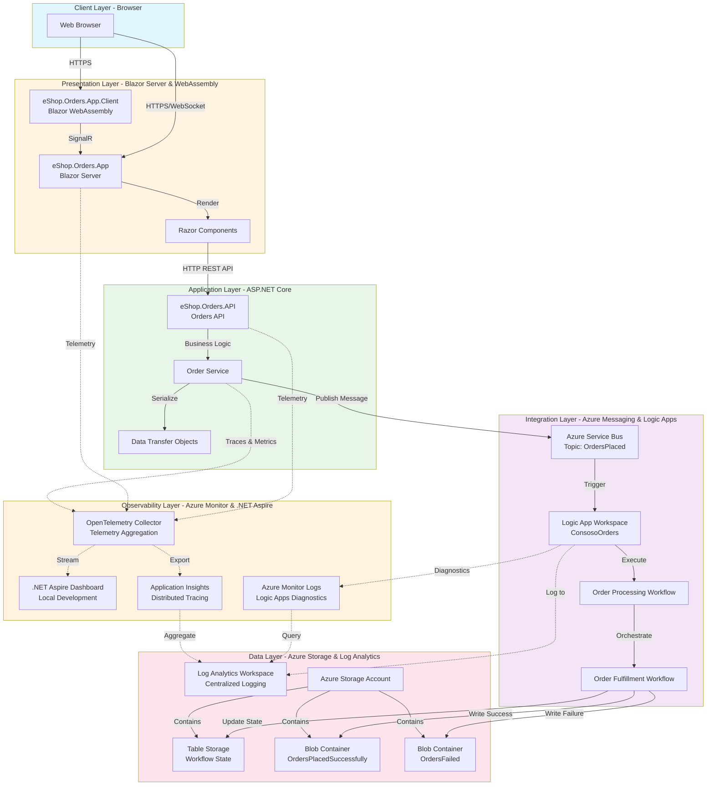

# Azure Logic Apps Monitoring with .NET Aspire

[](https://opensource.org/licenses/MIT)
[](https://dotnet.microsoft.com/download)
[](https://azure.microsoft.com)
[](https://learn.microsoft.com/dotnet/aspire)

A comprehensive sample application demonstrating enterprise-grade monitoring and observability practices for Azure Logic Apps integrated with .NET Aspire, OpenTelemetry, and Azure Monitor. This solution showcases how to build, deploy, and monitor distributed applications that combine serverless workflows with modern cloud-native architectures.

## Table of Contents

- Project Overview
- Architecture
- Key Features
- Prerequisites
- Setup Instructions
- Deployment Guide
- Monitoring & Observability
- Project Structure
- References & Documentation
- Contributing
- License

## Project Overview

This repository demonstrates how to implement comprehensive monitoring and observability for Azure Logic Apps within a distributed e-commerce order processing system. The solution leverages **.NET Aspire** for local development orchestration, **Azure Monitor** and **Application Insights** for production telemetry, and **OpenTelemetry** standards for distributed tracing across all components.

The sample implements an order processing workflow where orders are submitted through a Blazor web application, processed by a .NET API, published to Azure Service Bus, and then orchestrated through Azure Logic Apps for fulfillment. Throughout this process, telemetry data (traces, metrics, and logs) is collected and visualized, providing deep insights into system behavior, performance bottlenecks, and operational health. Orders are stored in Azure Storage with different outcomes tracked in separate containers, while workflow state is maintained in Table Storage.

This architecture follows Azure Well-Architected Framework principles for operational excellence, demonstrating real-world patterns for monitoring distributed systems that combine serverless workflows (Logic Apps) with containerized microservices (.NET applications) and event-driven messaging. It's ideal for teams looking to implement production-ready observability practices in hybrid Azure environments with a focus on Azure Cosmos DB for scalable, globally distributed data storage patterns.

## Architecture

The solution is organized into six logical layers, each with specific responsibilities and technologies:



### Layer Details

#### **Client Layer** (Browser)
- **Technology**: Modern Web Browser (Chrome, Edge, Firefox, Safari)
- **Components**:
  - Web Browser with JavaScript runtime
- **Interactions**:
  - Establishes HTTPS connections to Blazor Server app
  - Maintains WebSocket connections for real-time updates
  - Renders Blazor WebAssembly components client-side

#### **Presentation Layer** (Blazor Server & WebAssembly)
- **Technology**: ASP.NET Core Blazor (Server & WebAssembly hosting models)
- **Components**:
  - **eShop.Orders.App**: Blazor Server application hosting
  - **eShop.Orders.App.Client**: Blazor WebAssembly client components
  - **Razor Components**: Reusable UI components for order submission and status
- **Interactions**:
  - Blazor Server renders components and maintains SignalR connections
  - Blazor WebAssembly runs client-side C# code in the browser
  - SignalR hub facilitates real-time communication between client and server
  - Makes REST API calls to the Orders API for data operations

#### **Application Layer** (ASP.NET Core)
- **Technology**: ASP.NET Core 8.0 Web API
- **Components**:
  - **eShop.Orders.API**: RESTful API with endpoints for order management
  - **Order Service**: Business logic for order processing and validation
  - **Data Transfer Objects (DTOs)**: Strongly-typed contracts for API communication
- **Interactions**:
  - Receives HTTP requests from the presentation layer
  - Validates and transforms order data using DTOs
  - Executes business rules through the Order Service
  - Publishes order messages to Azure Service Bus for downstream processing
  - Emits telemetry for all operations

#### **Integration Layer** (Azure Messaging & Logic Apps)
- **Technology**: Azure Service Bus, Azure Logic Apps (Standard)
- **Components**:
  - **Azure Service Bus Topic**: `OrdersPlaced` topic for event-driven messaging
  - **Logic App Workspace**: Container for workflow definitions
  - **ConsosoOrders Workflow**: Main order processing orchestration
  - **Order Fulfillment Workflow**: Handles order completion and storage
- **Interactions**:
  - Service Bus Topic receives order messages from the API
  - Logic App subscribes to Service Bus and triggers on new messages
  - Workflows orchestrate multi-step processing with retry logic
  - Successful orders are written to `OrdersPlacedSuccessfully` blob container
  - Failed orders are written to `OrdersFailed` blob container for analysis
  - Workflow execution state is persisted in Azure Table Storage
  - Diagnostic logs are sent to Azure Monitor

#### **Observability Layer** (Azure Monitor & .NET Aspire)
- **Technology**: Azure Monitor, Application Insights, OpenTelemetry, .NET Aspire
- **Components**:
  - **.NET Aspire Dashboard**: Local development telemetry visualization
  - **Application Insights**: Production distributed tracing and APM
  - **OpenTelemetry Collector**: Standards-based telemetry aggregation
  - **Azure Monitor Logs**: Centralized log analytics and querying
- **Interactions**:
  - All .NET components emit OpenTelemetry traces, metrics, and logs
  - OpenTelemetry Collector aggregates telemetry from all sources
  - In local development, telemetry streams to Aspire Dashboard in real-time
  - In production, telemetry exports to Application Insights
  - Logic Apps emit diagnostic logs to Azure Monitor Logs
  - Cross-service correlation enables end-to-end transaction tracking
  - Custom dashboards and alerts configured in Azure Monitor

#### **Data Layer** (Azure Storage & Log Analytics)
- **Technology**: Azure Storage (Blob, Table), Azure Log Analytics
- **Components**:
  - **Log Analytics Workspace**: Centralized repository for all logs and metrics
  - **Azure Storage Account**: Durable storage for orders and workflow state
    - **Table Storage**: `WorkflowState` table for Logic App execution tracking
    - **Blob Container**: `OrdersPlacedSuccessfully` for completed orders
    - **Blob Container**: `OrdersFailed` for orders requiring manual intervention
- **Interactions**:
  - Logic Apps write order outcomes to respective blob containers
  - Workflow execution state persists in Table Storage for durability
  - Application Insights and Azure Monitor aggregate logs in Log Analytics
  - Kusto Query Language (KQL) enables powerful log analysis
  - Long-term retention and compliance through storage lifecycle policies

## Key Features

- ✅ **End-to-End Distributed Tracing**: OpenTelemetry instrumentation across .NET services, Service Bus, and Logic Apps
- ✅ **.NET Aspire Integration**: Local development dashboard with real-time telemetry visualization and resource management
- ✅ **Azure Monitor Integration**: Production-ready monitoring with Application Insights and custom dashboards
- ✅ **Logic Apps Observability**: Comprehensive workflow monitoring with run history and diagnostics
- ✅ **Event-Driven Architecture**: Azure Service Bus for reliable message delivery with dead-letter queue support
- ✅ **Infrastructure as Code**: Complete Bicep templates for reproducible Azure resource deployment
- ✅ **Service Defaults**: Reusable observability configuration shared across all services
- ✅ **Health Checks**: Built-in health monitoring with liveness and readiness probes
- ✅ **Structured Logging**: Consistent logging patterns with correlation IDs across all components
- ✅ **Metrics Collection**: Custom business and operational metrics for SLO tracking
- ✅ **Durable Storage**: Azure Storage for order persistence with success/failure segregation
- ✅ **Workflow State Management**: Table Storage for reliable Logic App state tracking

## Prerequisites

Before you begin, ensure you have the following installed:

- [.NET 8.0 SDK](https://dotnet.microsoft.com/download/dotnet/8.0) or later
- [Visual Studio 2022](https://visualstudio.microsoft.com/vs/) (17.9 or later) with ASP.NET and Azure workloads, or [Visual Studio Code](https://code.visualstudio.com/) with C# extension
- [.NET Aspire workload](https://learn.microsoft.com/dotnet/aspire/fundamentals/setup-tooling):
  ```bash
  dotnet workload update
  dotnet workload install aspire
  ```
- [Azure CLI](https://learn.microsoft.com/cli/azure/install-azure-cli) (version 2.50.0 or later)
- [Azure Developer CLI (azd)](https://learn.microsoft.com/azure/developer/azure-developer-cli/install-azd)
- [Docker Desktop](https://www.docker.com/products/docker-desktop) (for local development and containerization)
- An active [Azure subscription](https://azure.microsoft.com/free/)

### Optional Tools

- [Azure Functions Core Tools v4](https://learn.microsoft.com/azure/azure-functions/functions-run-local) (for Logic Apps local debugging)
- [Azure Storage Explorer](https://azure.microsoft.com/features/storage-explorer/) (for browsing storage accounts)
- [Visual Studio Code Azure Extensions](https://marketplace.visualstudio.com/items?itemName=ms-azuretools.vscode-cosmosdb) (for resource management)

## Setup Instructions

### 1. Clone the Repository

```bash
git clone https://github.com/Evilazaro/Azure-LogicApps-Monitoring.git
cd Azure-LogicApps-Monitoring
```

### 2. Authenticate with Azure

Login to Azure using both CLI tools:

```bash
# Azure CLI
az login
az account set --subscription <your-subscription-id>

# Azure Developer CLI
azd auth login
```

### 3. Configure Environment Variables

Initialize the Azure Developer CLI environment:

```bash
azd init
```

You'll be prompted to provide:
- **Environment Name**: A unique name for this deployment (e.g., `logicapps-monitoring-dev`)
- **Azure Subscription**: Select your target subscription
- **Azure Location**: Choose a region (e.g., `eastus2`, `westus2`)

Alternatively, create a `.azure/<environment-name>/.env` file:

```env
AZURE_ENV_NAME=logicapps-monitoring-dev
AZURE_LOCATION=eastus2
AZURE_SUBSCRIPTION_ID=<your-subscription-id>
```

### 4. Restore Dependencies

Restore all NuGet packages:

```bash
dotnet restore app.sln
```

### 5. Local Development Setup

The .NET Aspire AppHost orchestrates all services for local development:

```bash
cd app.AppHost
dotnet run
```

This command will:
- Start the .NET Aspire Dashboard at `https://localhost:17234` (or the port shown in console output)
- Launch all configured projects (API, Web App, Service Defaults)
- Configure local service discovery and telemetry collection
- Provide real-time observability through the dashboard

**Note**: For full Logic Apps integration locally, you'll need Azure Functions Core Tools and connection strings to Azure resources.

## Deployment Guide

### Option 1: Deploy to Azure using Azure Developer CLI (Recommended)

The repository includes complete infrastructure as code using Bicep templates. Deploy the entire solution with a single command:

```bash
# Provision infrastructure and deploy application code
azd up
```

This command will:
1. Provision all Azure resources defined in main.bicep:
   - Azure Service Bus namespace and `OrdersPlaced` topic
   - Logic App Workspace with workflows
   - Azure Storage Account with containers and tables
   - Application Insights and Log Analytics Workspace
   - App Service Plans and Web Apps for .NET components
2. Build all projects in the solution
3. Deploy application code to Azure App Services
4. Deploy Logic App workflows to the Logic App Workspace
5. Configure monitoring, diagnostics, and telemetry collection
6. Output deployment endpoints and resource information

### Option 2: Manual Step-by-Step Deployment

If you prefer granular control over the deployment process:

#### 1. Provision Infrastructure Only

```bash
azd provision
```

This provisions Azure resources without deploying code.

#### 2. Deploy Application Code

```bash
azd deploy
```

This builds and deploys all applications to the provisioned infrastructure.

#### 3. Verify Deployment

```bash
azd show
```

Review the deployed resources and endpoints.

### Post-Deployment Configuration

After successful deployment, perform these verification steps:

#### 1. Verify Service Bus Topic

```bash
az servicebus topic show \
  --namespace-name <servicebus-namespace> \
  --name OrdersPlaced \
  --resource-group <resource-group-name>
```

#### 2. Enable Logic App Workflows

Navigate to the Azure Portal:
1. Open your **Logic App Workspace** resource
2. Go to **Workflows** > **ConsosoOrders**
3. Click **Enable** to activate the workflow
4. Verify the workflow is listening to the Service Bus topic

#### 3. Configure Application Settings

The deployment automatically configures connection strings, but you can verify them:

```bash
az webapp config appsettings list \
  --name <api-app-name> \
  --resource-group <resource-group-name>
```

Key settings include:
- `ServiceBusConnectionString`: Connection to Service Bus namespace
- `APPLICATIONINSIGHTS_CONNECTION_STRING`: Application Insights telemetry
- `StorageAccountConnectionString`: Azure Storage for orders

#### 4. Test the Deployment

Generate test orders using the provided script:

```bash
# From the repository root
.\hooks\generate_orders.ps1 -ApiEndpoint "https://<your-api-app>.azurewebsites.net"
```

Monitor the order flow:
1. Check the **.NET Aspire Dashboard** (if running locally) or **Application Insights Live Metrics**
2. View **Logic App Workflow Runs** in Azure Portal
3. Verify orders appear in the `OrdersPlacedSuccessfully` blob container

## Monitoring & Observability

This solution implements comprehensive, multi-layered monitoring across all components, following Azure Well-Architected Framework guidelines for operational excellence.

### Local Development Monitoring

The **.NET Aspire Dashboard** provides real-time insights during local development without requiring Azure resources:

1. **Start the AppHost**:
   ```bash
   cd app.AppHost
   dotnet run
   ```

2. **Open the Aspire Dashboard**: Navigate to `https://localhost:17234` (port may vary)

3. **Explore Dashboard Features**:
   - **Resources**: View all running services, their health status, and endpoints
   - **Console Logs**: Real-time stdout/stderr from all services
   - **Structured Logs**: Filterable, searchable logs with correlation IDs
   - **Traces**: Distributed traces showing request flow across services
   - **Metrics**: Performance counters, request rates, error rates, and custom metrics

4. **Correlate Requests**: Click on a trace to see the complete request path from UI → API → Service Bus → Logic Apps

### Production Monitoring with Azure Monitor

#### Application Insights Features

Access Application Insights from the Azure Portal to leverage these capabilities:

**Live Metrics Stream**: Real-time telemetry with sub-second latency
- Navigate to **Application Insights** > **Live Metrics**
- View incoming requests, dependencies, failures, and performance counters
- Monitor server health and resource utilization

**Application Map**: Visual dependency graph
- Navigate to **Application Insights** > **Application Map**
- See service dependencies and their health
- Identify slow or failing components
- Understand system architecture at a glance

**Transaction Search**: Detailed request analysis
- Navigate to **Application Insights** > **Transaction Search**
- Search by operation name, result code, or custom properties
- View complete traces with timing breakdowns
- Access correlated logs and exceptions

**Failures & Exceptions**: Proactive issue detection
- Navigate to **Application Insights** > **Failures**
- View exception types, frequencies, and affected operations
- Access stack traces and contextual data
- Set up alerts for critical errors

#### Logic Apps Monitoring

Monitor Logic App executions and performance:

1. **Workflow Runs**:
   - Navigate to **Logic Apps** > **Workflows** > **ConsosoOrders** > **Run History**
   - View execution status (Succeeded, Failed, Running, Cancelled)
   - Inspect input/output for each action in the workflow
   - Analyze failure reasons with detailed error messages

2. **Trigger History**:
   - View Service Bus message triggers
   - See trigger timing and payload
   - Verify topic subscription configuration

3. **Diagnostic Settings**:
   - Navigate to **Logic Apps** > **Diagnostic Settings**
   - Confirm logs are flowing to Log Analytics Workspace
   - Review retention policies

#### Azure Storage Monitoring

Monitor order persistence and workflow state:

1. **Blob Containers**:
   - Use [Azure Storage Explorer](https://azure.microsoft.com/features/storage-explorer/) or Azure Portal
   - Browse `OrdersPlacedSuccessfully` for completed orders
   - Review `OrdersFailed` for orders requiring attention
   - Download order JSON for debugging

2. **Table Storage**:
   - Query the `WorkflowState` table for Logic App execution state
   - Correlate with Application Insights traces using correlation IDs

### Kusto Query Language (KQL) Queries

Use these queries in **Log Analytics Workspace** for powerful insights:

#### Order Processing Latency

```kql
requests
| where name contains "orders"
| summarize 
    avg(duration), 
    percentiles(duration, 50, 95, 99) by bin(timestamp, 5m)
| render timechart
```

#### Logic App Workflow Failures

```kql
AzureDiagnostics
| where Category == "WorkflowRuntime"
| where status_s == "Failed"
| project 
    TimeGenerated, 
    resource_workflowName_s, 
    resource_runId_s, 
    resource_actionName_s,
    error_message_s
| order by TimeGenerated desc
```

#### Service Bus Message Processing

```kql
dependencies
| where type == "Azure Service Bus"
| where target contains "OrdersPlaced"
| summarize 
    MessageCount = count(),
    AvgDuration = avg(duration),
    FailureCount = countif(success == false)
    by bin(timestamp, 5m)
| render timechart
```

#### End-to-End Transaction Tracing

```kql
dependencies
| where type == "HTTP"
| join kind=inner (requests) on operation_Id
| project 
    timestamp,
    operation_Name,
    dependency_Name,
    request_duration = duration,
    dependency_duration = duration1,
    resultCode,
    success
| order by timestamp desc
```

#### Application Insights Availability

```kql
requests
| summarize 
    TotalRequests = count(),
    SuccessfulRequests = countif(success == true),
    FailedRequests = countif(success == false),
    AvailabilityPercent = 100.0 * countif(success == true) / count()
    by bin(timestamp, 1h)
| render timechart
```

### Health Checks

All .NET services expose health endpoints configured through app.ServiceDefaults:

- **Liveness Probe**: `https://<app-url>/health/live`
  - Indicates if the application is running
  - Returns 200 OK if healthy, 503 Service Unavailable if not

- **Readiness Probe**: `https://<app-url>/health/ready`
  - Indicates if the application is ready to receive traffic
  - Checks dependencies (Service Bus, Storage, etc.)
  - Returns 200 OK if ready, 503 if dependencies are unavailable

- **Detailed Health Status**: `https://<app-url>/health`
  - Returns JSON with detailed status of each health check
  - Includes dependency status, response times, and errors
  - Example response:
    ```json
    {
      "status": "Healthy",
      "checks": [
        {
          "name": "ServiceBus",
          "status": "Healthy",
          "duration": "00:00:00.0234567"
        },
        {
          "name": "Storage",
          "status": "Healthy",
          "duration": "00:00:00.0156789"
        }
      ]
    }
    ```

### Alerts and Notifications

Configure Azure Monitor alerts for proactive monitoring:

1. Navigate to **Azure Monitor** > **Alerts** > **Create Alert Rule**
2. Recommended alerts:
   - **Logic App Workflow Failures**: Alert when workflows fail more than X times in Y minutes
   - **API Response Time**: Alert when P95 latency exceeds threshold
   - **Service Bus Dead Letter Queue**: Alert when messages enter DLQ
   - **Storage Account Throttling**: Alert on HTTP 429 responses
   - **Application Availability**: Alert when availability drops below 99.9%

### Dashboard Creation

Create custom dashboards in Azure Portal:

1. Navigate to **Azure Portal** > **Dashboard** > **Create** > **Custom**
2. Add tiles for:
   - Application Map showing service dependencies
   - Live Metrics for real-time monitoring
   - Custom KQL queries from examples above
   - Logic App run history and success rate
   - Storage account usage and performance

## Project Structure

```
Azure-LogicApps-Monitoring/
├── app.sln                          # Solution file for all projects
├── azure.yaml                       # Azure Developer CLI configuration
├── README.md                        # This file
├── LICENSE                          # MIT License
├── CONTRIBUTING.md                  # Contribution guidelines
├── CODE_OF_CONDUCT.md              # Community standards
├── SECURITY.md                      # Security policy
│
├── app.AppHost/                     # .NET Aspire AppHost (Orchestration)
│   ├── app.AppHost.csproj          # Project file
│   ├── AppHost.cs                  # Service configuration and orchestration
│   ├── appsettings.json            # Configuration settings
│   └── appsettings.Development.json # Development-specific settings
│
├── app.ServiceDefaults/             # Shared Observability Configuration
│   ├── app.ServiceDefaults.csproj  # Project file
│   ├── Extensions.cs               # OpenTelemetry, health checks, service defaults
│   └── CommonTypes.cs              # Shared DTOs and contracts
│
├── src/                             # Application Source Code
│   ├── eShop.Orders.API/           # ASP.NET Core Web API
│   │   ├── Controllers/            # API endpoints
│   │   ├── Services/               # Business logic
│   │   ├── Models/                 # Domain models and DTOs
│   │   └── Program.cs              # API startup and configuration
│   │
│   ├── eShop.Orders.App/           # Blazor Server Application
│   │   ├── Components/             # Server-side Blazor components
│   │   ├── Pages/                  # Blazor pages
│   │   └── Program.cs              # Web app startup
│   │
│   └── eShop.Orders.App.Client/    # Blazor WebAssembly Client
│       ├── Pages/                  # Client-side pages
│       └── Program.cs              # Client startup
│
├── LogicAppWP/                      # Logic App Workspace Project
│   ├── ConsosoOrders/              # Workflow Definitions
│   │   ├── workflow.json           # Logic App workflow definition
│   │   └── connections.json        # Connector configurations
│   ├── host.json                   # Logic App host configuration
│   └── local.settings.json         # Local development settings (not in repo)
│
├── infra/                           # Infrastructure as Code (Bicep)
│   ├── main.bicep                  # Main infrastructure template
│   ├── main.parameters.json        # Parameter values
│   ├── types.bicep                 # Custom Bicep types
│   ├── workload/                   # Application resource templates
│   │   ├── api.bicep               # API App Service
│   │   ├── webapp.bicep            # Web App Service
│   │   ├── servicebus.bicep        # Service Bus namespace and topics
│   │   ├── logicapp.bicep          # Logic App Workspace
│   │   └── storage.bicep           # Storage accounts
│   └── monitoring/                 # Monitoring resource templates
│       ├── appinsights.bicep       # Application Insights
│       └── loganalytics.bicep      # Log Analytics Workspace
│
└── hooks/                           # Deployment and Utility Scripts
    ├── preprovision.ps1            # Pre-deployment validation
    ├── postprovision.ps1           # Post-deployment configuration
    ├── generate_orders.ps1         # Test order generation script
    └── orders.json                 # Sample order data
```

## References & Documentation

### .NET Aspire
- [.NET Aspire Overview](https://learn.microsoft.com/dotnet/aspire/get-started/aspire-overview)
- [.NET Aspire Dashboard](https://learn.microsoft.com/dotnet/aspire/fundamentals/dashboard)
- [Building Distributed Applications with .NET Aspire](https://learn.microsoft.com/dotnet/aspire/)

### Azure Monitor & Application Insights
- [Azure Monitor Overview](https://learn.microsoft.com/azure/azure-monitor/overview)
- [Application Insights for ASP.NET Core](https://learn.microsoft.com/azure/azure-monitor/app/asp-net-core)
- [OpenTelemetry in Azure Monitor](https://learn.microsoft.com/azure/azure-monitor/app/opentelemetry-data-collection)
- [Azure Monitor .NET SDK](https://learn.microsoft.com/dotnet/api/overview/azure/monitor?view=azure-dotnet)

### Azure Logic Apps
- [Monitor Logic Apps](https://learn.microsoft.com/azure/logic-apps/monitor-logic-apps)
- [Logic Apps Standard Overview](https://learn.microsoft.com/azure/logic-apps/single-tenant-overview-compare)
- [Logic Apps Diagnostic Settings](https://learn.microsoft.com/azure/logic-apps/set-up-diagnostics-settings)
- [Azure Logic Apps Best Practices](https://learn.microsoft.com/azure/logic-apps/logic-apps-best-practices-overview)

### Azure Service Bus
- [Service Bus Messaging Overview](https://learn.microsoft.com/azure/service-bus-messaging/service-bus-messaging-overview)
- [Service Bus Topics and Subscriptions](https://learn.microsoft.com/azure/service-bus-messaging/service-bus-queues-topics-subscriptions)
- [Dead Letter Queues](https://learn.microsoft.com/azure/service-bus-messaging/service-bus-dead-letter-queues)

### Azure Storage
- [Azure Blob Storage Overview](https://learn.microsoft.com/azure/storage/blobs/storage-blobs-overview)
- [Azure Table Storage Overview](https://learn.microsoft.com/azure/storage/tables/table-storage-overview)
- [Storage Account Best Practices](https://learn.microsoft.com/azure/storage/common/storage-performance-checklist)

### Azure Well-Architected Framework
- [Operational Excellence Pillar](https://learn.microsoft.com/azure/well-architected/operational-excellence/)
- [Monitoring and Diagnostics](https://learn.microsoft.com/azure/well-architected/operational-excellence/monitoring)
- [Reliability Patterns](https://learn.microsoft.com/azure/well-architected/reliability/metrics)

### OpenTelemetry
- [OpenTelemetry .NET](https://opentelemetry.io/docs/instrumentation/net/)
- [OpenTelemetry Semantic Conventions](https://opentelemetry.io/docs/specs/semconv/)

## Contributing

We welcome contributions from the community! Whether you're fixing bugs, improving documentation, or proposing new features, your input is valuable.

### How to Contribute

1. **Fork the Repository**: Click the "Fork" button at the top right of the repository page

2. **Clone Your Fork**:
   ```bash
   git clone https://github.com/YOUR-USERNAME/Azure-LogicApps-Monitoring.git
   cd Azure-LogicApps-Monitoring
   ```

3. **Create a Feature Branch**:
   ```bash
   git checkout -b feature/your-amazing-feature
   ```

4. **Make Your Changes**: Follow the coding standards and best practices outlined below

5. **Test Your Changes**:
   ```bash
   dotnet build
   dotnet test
   cd app.AppHost && dotnet run
   ```

6. **Commit Your Changes**:
   ```bash
   git add .
   git commit -m "feat: add your amazing feature"
   ```
   Use [Conventional Commits](https://www.conventionalcommits.org/) format for commit messages

7. **Push to Your Fork**:
   ```bash
   git push origin feature/your-amazing-feature
   ```

8. **Open a Pull Request**: Navigate to the original repository and click "New Pull Request"

### Coding Standards

- Follow [C# Coding Conventions](https://learn.microsoft.com/dotnet/csharp/fundamentals/coding-style/coding-conventions)
- Ensure all code passes linting and builds without warnings
- Add XML documentation comments for public APIs
- Write unit tests for new functionality (target 80% code coverage)
- Update README.md if your changes affect usage or setup

### Pull Request Guidelines

- Provide a clear description of the problem and solution
- Reference related issues using `Fixes #123` or `Closes #456`
- Include screenshots or GIFs for UI changes
- Ensure all CI/CD checks pass before requesting review
- Be responsive to feedback and questions from maintainers

### Reporting Issues

Found a bug or have a feature request? Please [open an issue](https://github.com/Evilazaro/Azure-LogicApps-Monitoring/issues) with:
- A clear, descriptive title
- Steps to reproduce (for bugs)
- Expected vs. actual behavior
- Environment details (OS, .NET version, Azure region)
- Relevant logs or screenshots

### Code of Conduct

This project adheres to the [Microsoft Open Source Code of Conduct](https://opensource.microsoft.com/codeofconduct/). By participating, you are expected to uphold this code. Please review CODE_OF_CONDUCT.md for details.

### Security Vulnerabilities

If you discover a security vulnerability, please review SECURITY.md for responsible disclosure guidelines. **Do not open a public issue for security concerns.**

## License

This project is licensed under the **MIT License** - see the LICENSE file for full details.

```
MIT License

Copyright (c) 2024 Evilazaro

Permission is hereby granted, free of charge, to any person obtaining a copy
of this software and associated documentation files (the "Software"), to deal
in the Software without restriction, including without limitation the rights
to use, copy, modify, merge, publish, distribute, sublicense, and/or sell
copies of the Software, and to permit persons to whom the Software is
furnished to do so, subject to the following conditions:

The above copyright notice and this permission notice shall be included in all
copies or substantial portions of the Software.

THE SOFTWARE IS PROVIDED "AS IS", WITHOUT WARRANTY OF ANY KIND, EXPRESS OR
IMPLIED, INCLUDING BUT NOT LIMITED TO THE WARRANTIES OF MERCHANTABILITY,
FITNESS FOR A PARTICULAR PURPOSE AND NONINFRINGEMENT. IN NO EVENT SHALL THE
AUTHORS OR COPYRIGHT HOLDERS BE LIABLE FOR ANY CLAIM, DAMAGES OR OTHER
LIABILITY, WHETHER IN AN ACTION OF CONTRACT, TORT OR OTHERWISE, ARISING FROM,
OUT OF OR IN CONNECTION WITH THE SOFTWARE OR THE USE OR OTHER DEALINGS IN THE
SOFTWARE.
```

---

## Questions or Support?

- **Issues**: [GitHub Issues](https://github.com/Evilazaro/Azure-LogicApps-Monitoring/issues)
- **Discussions**: [GitHub Discussions](https://github.com/Evilazaro/Azure-LogicApps-Monitoring/discussions)
- **Azure Support**: [Azure Support Options](https://azure.microsoft.com/support/options/)
- **.NET Aspire Community**: [.NET Aspire GitHub](https://github.com/dotnet/aspire)

**Happy Monitoring! 📊🚀**

Similar code found with 3 license types