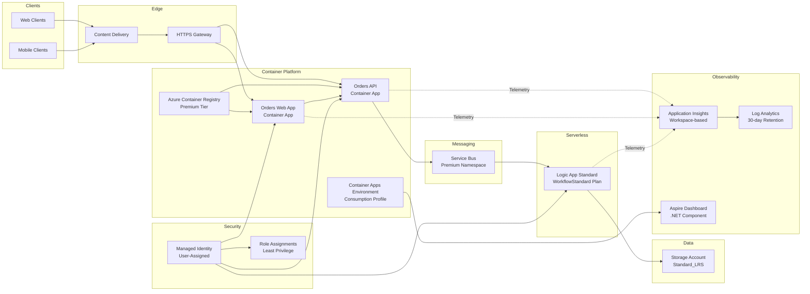

# Azure Logic Apps Standard - Enterprise Monitoring & Orchestration Solution

[](LICENSE.md)
[](https://dotnet.microsoft.com/download/dotnet/9.0)
[](https://azure.microsoft.com/services/container-apps/)
[](https://learn.microsoft.com/dotnet/aspire/)

> **Enterprise-scale reference architecture for Azure Logic Apps Standard monitoring, optimizing workflow density, cost efficiency, and operational observability.**

## Table of Contents

- Overview
- Business Challenge
- Architecture
- Key Features
- Technology Stack
- Prerequisites
- Getting Started
  - Local Development
  - Azure Deployment
- Monitoring & Observability
- Scaling Best Practices
- Project Structure
- Contributing
- Security
- License
- References

---

## Overview

Enterprise organizations deploying **Azure Logic Apps Standard** at scale face critical challenges related to workflow density, resource optimization, and operational cost management. Current deployments have demonstrated annual operational costs approaching **US$80,000 per environment**, driven by suboptimal hosting patterns, inefficient resource allocation, and inadequate monitoring infrastructure.

This solution addresses these enterprise-scale challenges through a **comprehensive monitoring and orchestration architecture** built on:
- **.NET Aspire** for cloud-native application orchestration
- **Azure Container Apps** for elastic microservices hosting
- **Azure Logic Apps Standard** for serverless workflow execution
- **OpenTelemetry** for distributed tracing and observability

The architecture implements **TOGAF principles** across Business, Data, Application, and Technology layers to deliver:
- ✅ Optimal hosting density without memory saturation
- ✅ Comprehensive distributed tracing with W3C Trace Context propagation
- ✅ Cost-effective resource utilization aligned with the [Azure Well-Architected Framework](https://learn.microsoft.com/azure/well-architected/)
- ✅ Proven patterns for long-running workflows (18-36 months) with stability guarantees

---

## Business Challenge

### Current State Challenges
Microsoft guidance recommends **~20 workflows per Logic App instance** and up to **64 apps per App Service Plan**. Organizations exceeding these limits—especially with 64-bit support—experience:

- **Memory spikes** causing workflow instability
- **Operational cost overruns** (~US$80,000 annually per environment)
- **Limited observability** across distributed workflows
- **Difficulty tracking** long-running business processes spanning 18-36 months

### Solution Benefits
This reference architecture delivers:

| Capability | Business Value |
|------------|---------------|
| **Workflow Density Optimization** | Maximize workflows per Logic App instance without triggering memory saturation |
| **Cost Optimization** | Reduce operational expenses through elastic scaling and consumption-based pricing |
| **Operational Observability** | Real-time visibility into workflow execution, resource utilization, and system health via Application Insights |
| **Developer Productivity** | Accelerate development cycles through standardized service defaults and .NET Aspire tooling |
| **Enterprise Compliance** | TOGAF-aligned architecture with comprehensive audit trails and diagnostic logging |

---

## Architecture

### Cloud-Native Architecture Diagram



### Architecture Highlights

#### **1. Microservices Layer**
- **Orders API** (eShop.Orders.API): ASP.NET Core 9.0 RESTful API with OpenAPI/Swagger documentation
- **Orders Web App** (eShop.Orders.App): Blazor Server with WebAssembly interactivity
- **Message Handler** (`src/eShop.Orders.API/Services/OrderMessageHandler.cs`): Background service for Service Bus message processing with distributed tracing

#### **2. Event-Driven Integration**
- **Azure Service Bus Premium**: 16 messaging units capacity with `orders-queue` for asynchronous order processing
- **W3C Trace Context Propagation**: Correlation across API → Service Bus → Logic App boundaries
- **Retry & Dead-Letter Policies**: Configurable retry attempts with separate error handling workflows

#### **3. Serverless Workflows**
- **Logic Apps Standard** (`LogicAppWP/ConsosoOrders`): Service Bus-triggered workflows on Azure Functions v4 runtime
- **Elastic Scaling**: 3-20 instances based on queue depth
- **Managed Identity Authentication**: Eliminates credential management for storage and Service Bus

#### **4. Observability Platform**
- **Application Insights**: Workspace-based telemetry collection (app-insights.bicep)
- **OpenTelemetry SDK**: Configured in Extensions.cs
- **.NET Aspire Dashboard**: Real-time metrics, traces, and logs during development
- **Log Analytics Workspace**: 30-day retention with lifecycle management (log-analytics-workspace.bicep)

---

## Key Features

### ✅ **Comprehensive Distributed Tracing**
- **W3C Trace Context** propagation across HTTP, Service Bus, and Logic Apps boundaries
- **Automatic instrumentation** for ASP.NET Core, HttpClient, and Service Bus
- **Custom activity sources** for business logic tracing (Extensions.cs)
- **Correlation ID middleware** for end-to-end request tracking (`src/eShop.Orders.API/Middleware/CorrelationIdMiddleware.cs`)

### ✅ **Cloud-Native Infrastructure as Code**
- **Bicep modules** for reproducible deployments (main.bicep)
- **Modular architecture**: Identity, Messaging, Services, Logic Apps, Monitoring
- **Azure Developer CLI (azd)** integration for streamlined provisioning
- **Deployment hooks** for pre/post-provisioning automation (hooks)

### ✅ **Developer Inner Loop Optimization**
- **.NET Aspire orchestration** (eShopOrders.AppHost) for local development
- **Service defaults** (eShopOrders.ServiceDefaults) for consistent telemetry, health checks, and resilience
- **Hot reload** support with Visual Studio Code and Visual Studio 2022
- **Aspire Dashboard** for real-time observability during development

### ✅ **Enterprise Security & Compliance**
- **User-Assigned Managed Identity** for all Azure resource authentication
- **Role-Based Access Control (RBAC)** with least privilege assignments (main.bicep)
- **HTTPS-only** communication with TLS 1.2 minimum
- **Diagnostic logging** for audit trails and compliance

### ✅ **Cost Optimization Patterns**
- **Consumption-based Container Apps** with auto-scaling (0-N instances)
- **Premium Service Bus** with capacity planning for 16 messaging units
- **Storage lifecycle management** (30-day log retention) (log-analytics-workspace.bicep)
- **Elastic Logic Apps scaling** (3-20 instances) based on workload

---

## Technology Stack

| Category | Technology | Version | Purpose |
|----------|-----------|---------|---------|
| **Runtime** | .NET | 9.0 | Application framework |
| **Orchestration** | .NET Aspire | Latest | Cloud-native app orchestration |
| **Observability** | OpenTelemetry | Latest | Distributed tracing & metrics |
| **Messaging** | Azure Service Bus | Premium | Asynchronous message integration |
| **Monitoring** | Application Insights | Workspace-based | Telemetry collection & analysis |
| **Hosting** | Azure Container Apps | Consumption | Elastic microservices hosting |
| **Workflows** | Logic Apps Standard | Functions v4 | Serverless business processes |
| **Storage** | Azure Storage | Standard_LRS | Workflow state & diagnostic logs |
| **IaC** | Bicep | Latest | Infrastructure as Code |
| **Container Registry** | Azure Container Registry | Premium | Docker image storage |
| **Identity** | Managed Identity | User-Assigned | Azure AD authentication |

**Complete stack reference**: See bdat.md for TOGAF BDAT architecture documentation.

---

## Prerequisites

### Required Tools
- [.NET 9.0 SDK](https://dotnet.microsoft.com/download/dotnet/9.0)
- [Azure Developer CLI (azd)](https://learn.microsoft.com/azure/developer/azure-developer-cli/install-azd)
- [Docker Desktop](https://www.docker.com/products/docker-desktop) (for local development)
- [Visual Studio Code](https://code.visualstudio.com/) or [Visual Studio 2022](https://visualstudio.microsoft.com/vs/)
- [Azure CLI](https://learn.microsoft.com/cli/azure/install-azure-cli)

### Azure Subscription Requirements
- **Subscription**: Active Azure subscription with Owner or Contributor role
- **Resource Providers**: Register the following providers:
  - `Microsoft.App` (Container Apps)
  - `Microsoft.ContainerRegistry`
  - `Microsoft.ServiceBus`
  - `Microsoft.OperationalInsights` (Log Analytics)
  - `Microsoft.Insights` (Application Insights)
  - `Microsoft.Web` (Logic Apps)
  - `Microsoft.ManagedIdentity`

### Development Environment
- **VS Code Extensions** (recommended):
  - [C# Dev Kit](https://marketplace.visualstudio.com/items?itemName=ms-dotnettools.csdevkit)
  - [.NET Aspire](https://marketplace.visualstudio.com/items?itemName=ms-dotnettools.aspire)
  - [Azure Developer CLI](https://marketplace.visualstudio.com/items?itemName=ms-azuretools.azure-dev)
  - [Bicep](https://marketplace.visualstudio.com/items?itemName=ms-azuretools.vscode-bicep)

---

## Getting Started

### Local Development

#### 1. Clone the Repository
```bash
git clone https://github.com/Evilazaro/Azure-LogicApps-Monitoring.git
cd Azure-LogicApps-Monitoring
```

#### 2. Restore Dependencies
```bash
dotnet restore
```

#### 3. Run with .NET Aspire
```bash
cd eShopOrders.AppHost
dotnet run
```

This will:
- Start the **Aspire Dashboard** at `https://localhost:15888`
- Launch the **Orders API** at `https://localhost:7001`
- Launch the **Orders Web App** at `https://localhost:7002`

**Note**: In development mode, the solution uses:
- **OTLP exporter** to send telemetry to the Aspire Dashboard
- **In-memory** alternatives for Service Bus (no Azure resources required)

#### 4. Explore the Aspire Dashboard
Navigate to `https://localhost:15888` to view:
- **Resources**: All running services and their health status
- **Traces**: Distributed traces with W3C Trace Context
- **Metrics**: Real-time metrics (requests/sec, error rates, latency)
- **Logs**: Structured logs from all services

---

### Azure Deployment

#### 1. Initialize Azure Developer CLI
```bash
azd init
```

When prompted:
- **Environment name**: `dev` (or `staging`, `prod`)
- **Azure subscription**: Select your subscription
- **Azure region**: Select a region (e.g., `eastus`, `westeurope`)

#### 2. Provision Azure Resources
```bash
azd provision
```

This will deploy:
- **Resource Group**: `rg-orders-{env}-{location}`
- **Monitoring**: Log Analytics Workspace + Application Insights
- **Identity**: User-Assigned Managed Identity with RBAC roles
- **Messaging**: Service Bus Premium namespace with `orders-queue`
- **Container Services**: Azure Container Registry + Container Apps Environment
- **Workflows**: Logic Apps Standard with App Service Plan

**Deployment time**: ~10-15 minutes

#### 3. Deploy Application Code
```bash
azd deploy
```

This will:
- Build Docker images for Orders API and Orders Web App
- Push images to Azure Container Registry
- Deploy containers to Container Apps
- Deploy Logic Apps workflows from `LogicAppWP/ConsosoOrders`

#### 4. Verify Deployment
```bash
azd show
```

Output will display:
- **Orders API Endpoint**: `https://orders-api.{defaultdomain}`
- **Orders Web App Endpoint**: `https://orders-webapp.{defaultdomain}`
- **Application Insights**: Connection string for telemetry
- **Service Bus Namespace**: Connection string for messaging

---

## Monitoring & Observability

### Application Insights Integration

The solution uses **workspace-based Application Insights** for centralized telemetry collection:

```csharp
// Configured in Extensions.cs
builder.Services.AddOpenTelemetry()
    .WithMetrics(metrics =>
    {
        metrics.AddAspNetCoreInstrumentation();
        metrics.AddHttpClientInstrumentation();
        metrics.AddRuntimeInstrumentation();
    })
    .WithTracing(tracing =>
    {
        tracing.AddAspNetCoreInstrumentation();
        tracing.AddHttpClientInstrumentation();
        tracing.AddSource("Azure.Messaging.ServiceBus");
        tracing.AddSource(Extensions.ApplicationActivitySourceName);
    })
    .UseAzureMonitor(); // Configured when APPLICATIONINSIGHTS_CONNECTION_STRING is present
```

### Viewing Telemetry in Azure Portal

#### **1. Application Map**
Navigate to: **Application Insights → Investigate → Application Map**
- Visualize dependencies between Orders API, Service Bus, and Logic Apps
- Identify performance bottlenecks and failure rates

#### **2. End-to-End Transactions**
Navigate to: **Application Insights → Investigate → Transaction Search**
- Search for requests by correlation ID (tracked via `CorrelationIdMiddleware`)
- View complete trace across API → Service Bus → Logic App

#### **3. Performance Metrics**
Navigate to: **Application Insights → Investigate → Performance**
- Analyze API endpoint latency (P50, P95, P99)
- Identify slow dependencies (Service Bus, external APIs)

#### **4. Failure Analysis**
Navigate to: **Application Insights → Investigate → Failures**
- Analyze exception rates and types
- View stack traces and diagnostic context

### Local Development with Aspire Dashboard

During local development, telemetry is sent to the **Aspire Dashboard** via OTLP:

```bash
# Access the Aspire Dashboard
https://localhost:15888
```

**Dashboard Features**:
- **Structured Logs**: View logs with filtering by severity, resource, and timestamp
- **Distributed Traces**: Visualize request flows with span durations and attributes
- **Metrics**: Real-time charts for CPU, memory, request rates, and custom metrics
- **Resources**: Health checks and configuration for all services

### Custom Tracing for Business Logic

Use the `CreateActivitySource()` helper to add custom spans:

```csharp
var activitySource = Extensions.CreateActivitySource();
using var activity = activitySource.StartActivity("ProcessOrder");
activity?.SetTag("order.id", orderId);
activity?.SetTag("order.status", "processing");
// Your business logic here
activity?.SetStatus(ActivityStatusCode.Ok);
```

### Diagnostic Logging Best Practices

The solution captures **diagnostic strings** when:
- Latency exceeds expected thresholds
- Unexpected status codes are returned (e.g., 429, 500, 503)

**Example** from `OrdersController.cs`:
```csharp
activity?.AddEvent(new ActivityEvent("OrderCreated", tags: new ActivityTagsCollection
{
    ["order.id"] = order.Id,
    ["order.customerId"] = order.CustomerId
}));
```

**References**:
- [Instrument applications with OpenTelemetry](https://learn.microsoft.com/azure/well-architected/operational-excellence/instrument-application)
- [Azure Monitor OpenTelemetry Overview](https://learn.microsoft.com/azure/azure-monitor/app/opentelemetry-overview)
- [Azure Monitor OpenTelemetry Data Collection](https://learn.microsoft.com/azure/azure-monitor/app/opentelemetry-data-collection)

---

## Scaling Best Practices

### Logic Apps Standard Workflow Density

**Microsoft Guidance**:
- **~20 workflows per Logic App instance** (Standard tier)
- **Up to 64 Logic App instances per App Service Plan**

**Solution Implementation**:
- logic-app.bicep deploys:
  - **App Service Plan**: `WorkflowStandard` WS1 SKU with elastic scaling (3-20 instances)
  - **Logic Apps Runtime**: Azure Functions v4 with managed identity authentication

**Optimization Strategies**:
1. **Vertical Scaling**: Increase App Service Plan SKU (WS1 → WS2 → WS3) for higher memory/CPU
2. **Horizontal Scaling**: Add more Logic App instances within the same App Service Plan
3. **Queue-Based Throttling**: Configure Service Bus queue max delivery count to prevent message storms
4. **Memory Monitoring**: Set up alerts for memory usage >80% (app-insights.bicep)

### Container Apps Auto-Scaling

**Consumption Profile** (main.bicep):
- **Orders API**: Scales 0-10 instances based on HTTP requests
- **Orders Web App**: Scales 0-5 instances based on HTTP requests

**Scaling Rules** (configured via Container Apps):
```bicep
properties: {
  scale: {
    minReplicas: 0  // Scale to zero when idle
    maxReplicas: 10
    rules: [
      {
        name: 'http-rule'
        http: {
          metadata: {
            concurrentRequests: '100'  // Scale at 100 concurrent requests
          }
        }
      }
    ]
  }
}
```

### Service Bus Capacity Planning

**Premium Namespace** (main.bicep):
- **Capacity**: 16 messaging units (16,000 msg/sec throughput)
- **Queue Configuration**:
  - Max delivery count: 10 (before dead-letter)
  - Lock duration: 30 seconds
  - Max queue size: 5 GB

**Monitoring Metrics**:
- **Active Messages**: Alert when queue depth >10,000
- **Dead-Letter Messages**: Alert when dead-letter count >100
- **Throttled Requests**: Alert when throttling occurs

### Cost Optimization Tips

1. **Enable Container Apps scale-to-zero**: Reduce costs during off-peak hours
2. **Use Consumption billing**: Pay only for execution time (Container Apps, Logic Apps)
3. **Implement log lifecycle policies**: Automatically delete logs after 30 days (log-analytics-workspace.bicep)
4. **Right-size App Service Plans**: Start with WS1, scale up only when memory/CPU >70%
5. **Monitor RU consumption**: Review Application Insights billing data monthly

**References**:
- [Monitor Logic Apps](https://learn.microsoft.com/azure/logic-apps/monitor-logic-apps)
- [Azure Well-Architected Framework: Monitoring](https://learn.microsoft.com/azure/well-architected/operational-excellence/monitoring)

---

## Project Structure

```
Azure-LogicApps-Monitoring/
├── .github/                          # GitHub Actions workflows (CI/CD)
├── eShopOrders.AppHost              # .NET Aspire AppHost for orchestration
│   ├── AppHost.cs                    # Service configuration and resource references
│   ├── ConfigurationKeys.cs          # Centralized configuration constants
│   └── appsettings.json              # Azure resource configuration
├── eShopOrders.ServiceDefaults      # Shared service defaults
│   └── Extensions.cs                 # OpenTelemetry, health checks, resilience
├── src/
│   ├── eShop.Orders.API/             # Orders API (ASP.NET Core 9.0)
│   │   ├── Controllers/
│   │   │   └── OrderController.cs    # RESTful endpoints with distributed tracing
│   │   ├── Middleware/
│   │   │   └── CorrelationIdMiddleware.cs  # Correlation ID propagation
│   │   ├── Services/
│   │   │   ├── OrderService.cs       # Business logic with Service Bus publishing
│   │   │   └── OrderMessageHandler.cs # Background service for message processing
│   │   ├── Dockerfile                # Container image definition
│   │   └── Program.cs                # API startup configuration
│   └── eShop.Orders.App/             # Orders Web App (Blazor)
│       ├── Components/               # Blazor components
│       ├── eShop.Orders.App.Client/  # Blazor WebAssembly client
│       ├── Dockerfile                # Container image definition
│       └── Program.cs                # Web app startup configuration
├── LogicAppWP/                       # Logic Apps Standard workspace
│   └── ConsosoOrders/                # Workflow definition
│       └── workflow.json             # Service Bus-triggered workflow
├── infra/                            # Infrastructure as Code (Bicep)
│   ├── main.bicep                    # Main deployment orchestrator
│   ├── types.bicep                   # Shared type definitions
│   ├── monitoring/                   # Monitoring infrastructure
│   │   ├── main.bicep                # Orchestrates monitoring resources
│   │   ├── log-analytics-workspace.bicep  # Log Analytics + storage
│   │   ├── app-insights.bicep        # Application Insights configuration
│   │   └── azure-monitor-health-model.bicep  # Health model hierarchy
│   └── workload/                     # Workload infrastructure
│       ├── main.bicep                # Orchestrates workload resources
│       ├── identity/                 # Managed identity + RBAC
│       ├── messaging/                # Service Bus + workflow storage
│       ├── services/                 # Container Registry + Container Apps
│       └── logic-app.bicep           # Logic Apps Standard deployment
├── hooks/                            # Azure Developer CLI hooks
│   └── postprovision.ps1             # Post-deployment automation
├── bdat.md                           # TOGAF BDAT architecture documentation
├── azure.yaml                        # Azure Developer CLI configuration
└── README.md                         # This file
```

### Key Files Reference

| File | Purpose |
|------|---------|
| AppHost.cs | Configures .NET Aspire resources (Application Insights, Service Bus) |
| Extensions.cs | OpenTelemetry configuration, health checks, resilience patterns |
| OrderController.cs | RESTful API with distributed tracing |
| `src/eShop.Orders.API/Services/OrderMessageHandler.cs` | Background service for Service Bus message processing |
| main.bicep | Main Bicep deployment orchestrator |
| app-insights.bicep | Application Insights configuration |
| logic-app.bicep | Logic Apps Standard deployment |

---

## Contributing

We welcome contributions! Please see CONTRIBUTING.md for guidelines.

### How to Contribute
1. **Fork** the repository
2. **Create a feature branch**: `git checkout -b feature/your-feature`
3. **Commit changes**: `git commit -m "Add your feature"`
4. **Push to branch**: `git push origin feature/your-feature`
5. **Open a Pull Request**

### Code of Conduct
Please read our Code of Conduct before contributing.

---

## Security

### Reporting Security Issues
**Please do not report security vulnerabilities through public GitHub issues.**

Instead, report them to the Microsoft Security Response Center (MSRC):
- **Email**: [secure@microsoft.com](mailto:secure@microsoft.com)
- **Portal**: [https://msrc.microsoft.com](https://msrc.microsoft.com)

See SECURITY.md for more details.

### Security Best Practices
- ✅ **Managed Identity**: All Azure resource authentication uses managed identities (no connection strings in code)
- ✅ **HTTPS Only**: All endpoints enforce HTTPS with TLS 1.2 minimum
- ✅ **Least Privilege RBAC**: Role assignments follow principle of least privilege (main.bicep)
- ✅ **Secrets Management**: Azure Key Vault integration for sensitive configuration (future enhancement)
- ✅ **Network Isolation**: Configure VNet integration for production environments (see main.bicep)

---

## License

This project is licensed under the **MIT License** - see the LICENSE.md file for details.

---

## References

### Microsoft Learn Documentation
- [Azure Monitor OpenTelemetry Overview](https://learn.microsoft.com/azure/azure-monitor/app/opentelemetry-overview)
- [Azure Monitor OpenTelemetry Data Collection](https://learn.microsoft.com/azure/azure-monitor/app/opentelemetry-data-collection)
- [Monitor Logic Apps](https://learn.microsoft.com/azure/logic-apps/monitor-logic-apps)
- [.NET Aspire Dashboard Overview](https://learn.microsoft.com/dotnet/aspire/fundamentals/dashboard/overview)
- [Instrument Applications (Well-Architected Framework)](https://learn.microsoft.com/azure/well-architected/operational-excellence/instrument-application)
- [Monitoring (Well-Architected Framework)](https://learn.microsoft.com/azure/well-architected/operational-excellence/monitoring)
- [Azure Monitor .NET API Reference](https://learn.microsoft.com/dotnet/api/overview/azure/monitor?view=azure-dotnet)

### Architecture Documentation
- **TOGAF BDAT Model**: See bdat.md for comprehensive Business, Data, Application, and Technology architecture documentation

### Related Repositories
- [Azure Developer CLI (azd)](https://github.com/Azure/azure-dev)
- [.NET Aspire](https://github.com/dotnet/aspire)
- [OpenTelemetry .NET](https://github.com/open-telemetry/opentelemetry-dotnet)

---

## Support

For questions or issues:
1. **Check the documentation**: Review bdat.md for architecture details
2. **Search existing issues**: [GitHub Issues](https://github.com/Evilazaro/Azure-LogicApps-Monitoring/issues)
3. **Create a new issue**: Use issue templates for bugs, features, or questions
4. **Community Discussions**: Join [GitHub Discussions](https://github.com/Evilazaro/Azure-LogicApps-Monitoring/discussions)

---

**Built with ❤️ by the Azure Platform Engineering team**