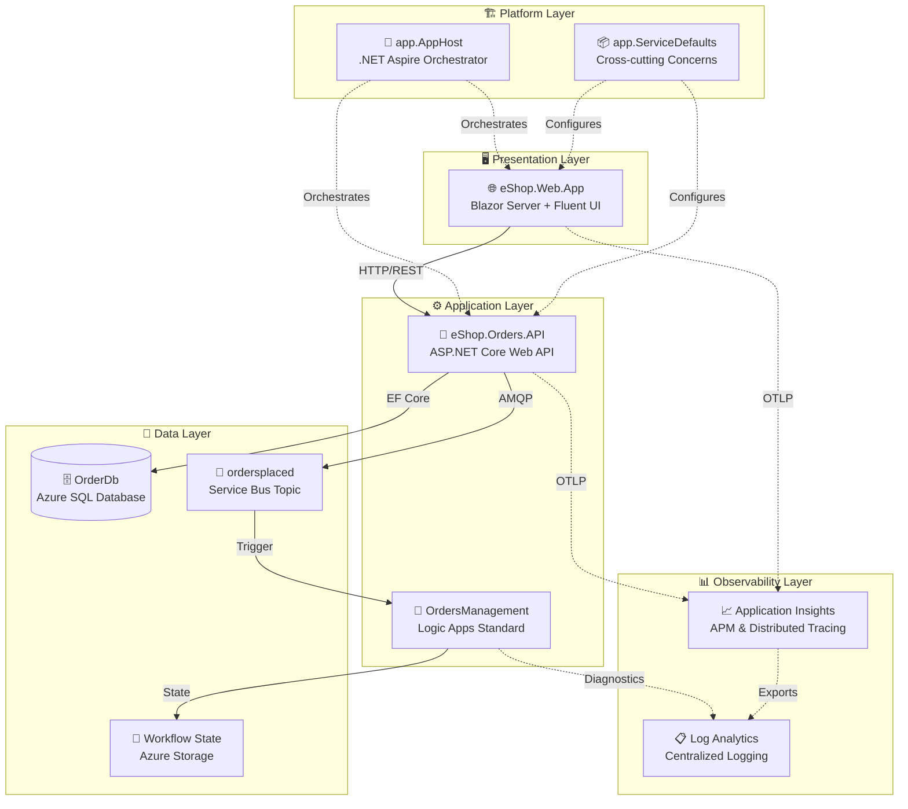

# 🔍 Azure Logic Apps Monitoring Solution

[](https://azure.microsoft.com/services/logic-apps/)
[](https://dotnet.microsoft.com/)
[](https://learn.microsoft.com/dotnet/aspire/)
[](LICENSE)
[](https://learn.microsoft.com/azure/developer/azure-developer-cli/)
[](https://opentelemetry.io/)

A cloud-native reference implementation demonstrating **enterprise-grade observability patterns** for Azure Logic Apps Standard workflows, built on .NET Aspire orchestration with end-to-end distributed tracing.

---

## 📋 Overview

The Azure Logic Apps Monitoring Solution showcases how to build observable, event-driven applications using Azure's native monitoring stack. It uses an **eShop order management system** as the business scenario, demonstrating how orders flow from a Blazor web frontend through an ASP.NET Core API, into Azure SQL Database, then published to Azure Service Bus for asynchronous processing by Logic Apps workflows.

### Why This Solution?

| Feature | Description |
|---------|-------------|
| **Reference Architecture** | Production-ready patterns for Azure Logic Apps observability |
| **End-to-End Tracing** | W3C Trace Context propagation across all service boundaries |
| **Zero Secrets** | Managed Identity authentication for all Azure services |
| **Local Development Parity** | Full-fidelity local development with .NET Aspire emulators |

---

## ✨ Key Features

- 🔭 **Full Observability Stack** - OpenTelemetry integration with Application Insights and Log Analytics
- 📨 **Event-Driven Architecture** - Azure Service Bus pub/sub with topic subscriptions
- 🔄 **Logic Apps Workflows** - Stateful workflow processing with Service Bus triggers
- 🐳 **Containerized Deployment** - Azure Container Apps with automatic scaling
- 🏗️ **Infrastructure as Code** - Modular Bicep templates with subscription-scope deployment
- 🚀 **One-Command Deployment** - Azure Developer CLI (`azd`) for streamlined provisioning
- 🔐 **Managed Identity** - Zero-secrets architecture with Entra ID authentication
- 📊 **Distributed Tracing** - Trace correlation across HTTP, SQL, and Service Bus operations

---

## 🏛️ Architecture



> 📖 **Learn more:** See [Architecture Overview](docs/architecture/README.md) for detailed component diagrams, data flows, and design decisions.

---

## 🛠️ Technology Stack

| Category | Technology | Version | Purpose |
|----------|------------|---------|---------|
| **Runtime** | .NET | 10.0 | Application framework |
| **Orchestration** | .NET Aspire | 9.5.0 | Local development orchestration |
| **Frontend** | Blazor Server | 10.0 | Interactive web UI |
| **UI Components** | Fluent UI Blazor | 4.13.2 | Modern UI component library |
| **Backend** | ASP.NET Core | 10.0 | REST API framework |
| **ORM** | Entity Framework Core | 9.0 | Data access |
| **Messaging** | Azure Service Bus | 7.20.1 | Event-driven messaging |
| **Workflows** | Logic Apps Standard | - | Event processing automation |
| **Database** | Azure SQL Database | - | Relational data persistence |
| **Hosting** | Azure Container Apps | - | Serverless container platform |
| **Observability** | OpenTelemetry | 1.14.0 | Distributed tracing & metrics |
| **Monitoring** | Application Insights | - | APM and diagnostics |
| **IaC** | Bicep | - | Infrastructure as Code |
| **CLI** | Azure Developer CLI | - | Deployment automation |

---

## 📋 Prerequisites

| Tool | Version | Installation |
|------|---------|--------------|
| **.NET SDK** | 10.0+ | `winget install Microsoft.DotNet.SDK.10` |
| **Docker Desktop** | Latest | [docker.com](https://docker.com/products/docker-desktop) |
| **Azure CLI** | 2.60.0+ | `winget install Microsoft.AzureCLI` |
| **Azure Developer CLI** | Latest | `winget install Microsoft.Azd` |
| **Visual Studio 2022** | 17.13+ | [visualstudio.com](https://visualstudio.microsoft.com) (optional) |
| **VS Code** | Latest | [code.visualstudio.com](https://code.visualstudio.com) (optional) |

### Validate Prerequisites

```powershell
# Run the validation script to check all prerequisites
./hooks/check-dev-workstation.ps1
```

---

## 🚀 Quick Start

### Option 1: Local Development with .NET Aspire

The fastest path for development—runs entirely on your local machine with containerized dependencies.

```powershell
# 1. Clone the repository
git clone https://github.com/Evilazaro/Azure-LogicApps-Monitoring.git
cd Azure-LogicApps-Monitoring

# 2. Ensure Docker Desktop is running

# 3. Run with .NET Aspire
dotnet run --project app.AppHost
```

The Aspire dashboard opens automatically at `https://localhost:17225`, providing:
- Real-time service health monitoring
- Distributed tracing visualization
- Structured logs across all services
- Container and emulator status

### Option 2: Deploy to Azure

Full cloud deployment with all Azure services provisioned automatically.

```powershell
# 1. Authenticate with Azure
azd auth login

# 2. Initialize and deploy (creates new environment)
azd up
```

The `azd up` command automatically:
1. Validates prerequisites via `preprovision` hook
2. Provisions all Azure infrastructure with Bicep
3. Configures .NET user secrets via `postprovision` hook
4. Generates test data for the application
5. Deploys the application to Azure Container Apps

> 📖 **Learn more:** See [Developer Inner Loop Workflow](docs/hooks/README.md) for detailed development workflows, hybrid modes, and troubleshooting guides.

---

## 📁 Project Structure

```
Azure-LogicApps-Monitoring/
│
├── 📁 app.AppHost/                    # .NET Aspire orchestrator
│   ├── AppHost.cs                     # Service orchestration & resource wiring
│   └── appsettings.json               # Aspire configuration
│
├── 📁 app.ServiceDefaults/            # Shared cross-cutting concerns
│   ├── Extensions.cs                  # OpenTelemetry, resilience, health checks
│   └── CommonTypes.cs                 # Shared DTOs (Order, OrderProduct)
│
├── 📁 src/
│   ├── 📁 eShop.Orders.API/           # Order management REST API
│   │   ├── Controllers/               # API endpoints
│   │   ├── Services/                  # Business logic with metrics
│   │   ├── Handlers/                  # Service Bus message publishing
│   │   ├── Repositories/              # EF Core data access
│   │   └── Migrations/                # Database migrations
│   │
│   └── 📁 eShop.Web.App/              # Blazor Server frontend
│       ├── Components/                # Razor components
│       └── wwwroot/                   # Static assets
│
├── 📁 workflows/                      # Logic Apps Standard workflows
│   └── OrdersManagement/
│       └── ProcessingOrdersPlaced/    # Order processing workflow
│
├── 📁 infra/                          # Bicep infrastructure templates
│   ├── main.bicep                     # Root deployment orchestrator
│   ├── shared/                        # Identity, monitoring, data modules
│   └── workload/                      # Messaging, services, Logic Apps
│
├── 📁 hooks/                          # azd lifecycle automation scripts
│   ├── preprovision.ps1/.sh           # Pre-deployment validation
│   ├── postprovision.ps1/.sh          # Post-deployment configuration
│   └── Generate-Orders.ps1/.sh        # Test data generation
│
├── 📁 docs/                           # Architecture documentation
│   ├── architecture/                  # TOGAF BDAT documentation
│   └── hooks/                         # Developer workflow guides
│
├── azure.yaml                         # Azure Developer CLI configuration
└── app.sln                            # .NET solution file
```

---

## ⚙️ Configuration

### Environment Variables

The application uses the following configuration hierarchy:

| Source | Purpose | Priority |
|--------|---------|----------|
| `appsettings.json` | Default configuration | Lowest |
| `appsettings.{Environment}.json` | Environment-specific | Medium |
| User Secrets | Local development secrets | High |
| Environment Variables | Runtime configuration | Highest |

### Key Configuration Settings

```json
{
  "Azure": {
    "ServiceBus": {
      "HostName": "your-namespace.servicebus.windows.net",
      "TopicName": "ordersplaced",
      "SubscriptionName": "orderprocessingsub"
    },
    "SqlServer": {
      "Name": "your-sql-server",
      "DatabaseName": "OrderDb"
    },
    "ApplicationInsights": {
      "Name": "your-appinsights"
    }
  }
}
```

> 💡 **Tip:** The `postprovision` hook automatically configures user secrets after Azure deployment, so manual configuration is typically not needed.

---

## 📡 API Reference

The Orders API exposes RESTful endpoints for order management:

| Method | Endpoint | Description |
|--------|----------|-------------|
| `POST` | `/api/orders` | Create a new order |
| `POST` | `/api/orders/batch` | Create multiple orders in batch |
| `GET` | `/api/orders` | List all orders |
| `GET` | `/api/orders/{id}` | Get order by ID |
| `DELETE` | `/api/orders/{id}` | Delete an order |

### Swagger Documentation

When running locally, access the interactive API documentation at:
- **Swagger UI:** `https://localhost:{port}/swagger`

---

## 📊 Observability

The solution implements the **Three Pillars of Observability** using OpenTelemetry with Azure Monitor as the backend.

### Instrumentation

- **Distributed Tracing** - W3C Trace Context propagation across HTTP, SQL, and Service Bus
- **Custom Metrics** - Order placement counters, processing duration histograms
- **Structured Logging** - Correlation IDs in all log entries

### Dashboards

| Environment | Dashboard | Access |
|-------------|-----------|--------|
| Local | Aspire Dashboard | `https://localhost:17225` |
| Azure | Application Insights | Azure Portal |

> 📖 **Learn more:** See [Observability Architecture](docs/architecture/05-observability-architecture.md) for detailed instrumentation patterns, metric definitions, and alerting configuration.

---

## 🔐 Security

The solution follows Azure security best practices:

- **Managed Identity** - All Azure service authentication uses User-Assigned Managed Identity
- **Zero Secrets** - No connection strings or keys in configuration
- **RBAC** - Principle of least privilege for all service permissions

> 📖 **Learn more:** See [Security Architecture](docs/architecture/06-security-architecture.md) for managed identity configuration, RBAC assignments, and Zero Trust patterns.

---

## 📚 Documentation

| Document | Description |
|----------|-------------|
| [Documentation Index](docs/README.md) | Complete documentation overview |
| [Architecture Overview](docs/architecture/README.md) | High-level architecture and service inventory |
| [Business Architecture](docs/architecture/01-business-architecture.md) | Business capabilities and value streams |
| [Data Architecture](docs/architecture/02-data-architecture.md) | Data domains, stores, and telemetry mapping |
| [Application Architecture](docs/architecture/03-application-architecture.md) | Service catalog and communication patterns |
| [Technology Architecture](docs/architecture/04-technology-architecture.md) | Azure infrastructure and Bicep modules |
| [Observability Architecture](docs/architecture/05-observability-architecture.md) | Distributed tracing, metrics, and alerting |
| [Security Architecture](docs/architecture/06-security-architecture.md) | Managed identity, RBAC, and data protection |
| [Deployment Architecture](docs/architecture/07-deployment-architecture.md) | CI/CD pipelines and environment strategy |
| [Developer Workflow](docs/hooks/README.md) | Inner loop development and azd hooks |
| [ADR Index](docs/architecture/adr/README.md) | Architecture Decision Records |

---

## 🤝 Contributing

Contributions are welcome! Please see our contributing guidelines for details on:

- Code of conduct
- Development workflow
- Pull request process
- Coding standards

---

## 📄 License

This project is licensed under the MIT License - see the [LICENSE](LICENSE) file for details.

```
MIT License

Copyright (c) 2025 Evilázaro Alves

Permission is hereby granted, free of charge, to any person obtaining a copy
of this software and associated documentation files (the "Software"), to deal
in the Software without restriction, including without limitation the rights
to use, copy, modify, merge, publish, distribute, sublicense, and/or sell
copies of the Software, and to permit persons to whom the Software is
furnished to do so, subject to the following conditions:

The above copyright notice and this permission notice shall be included in all
copies or substantial portions of the Software.
```

---

## 🙏 Acknowledgments

- [.NET Aspire](https://learn.microsoft.com/dotnet/aspire/) - Cloud-native application orchestration
- [Azure Logic Apps](https://learn.microsoft.com/azure/logic-apps/) - Workflow automation platform
- [OpenTelemetry](https://opentelemetry.io/) - Observability framework
- [Fluent UI Blazor](https://www.fluentui-blazor.net/) - UI component library
- [Azure Developer CLI](https://learn.microsoft.com/azure/developer/azure-developer-cli/) - Developer productivity tool

---

<div align="center">

**Made with ❤️ by Evilazaro | Principal Cloud Solution Architect | Microsoft**

[⬆ Back to Top](#-azure-logic-apps-monitoring-solution)

</div>
