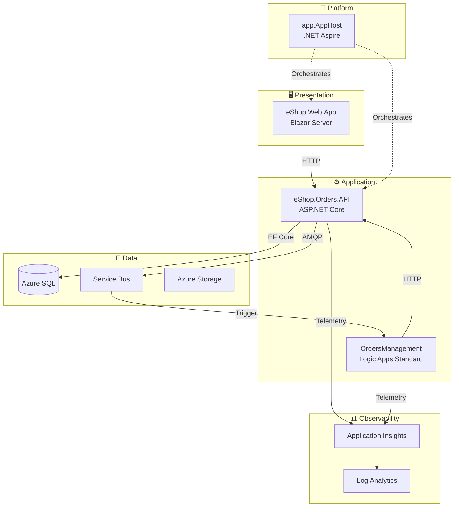

# Azure Logic Apps Monitoring Solution


A cloud-native reference architecture demonstrating enterprise-grade observability patterns for distributed applications on Azure. Built around an eShop order management scenario, this solution showcases end-to-end monitoring, distributed tracing, and event-driven automation using Azure's native services with .NET Aspire orchestration.

---

## 📑 Table of Contents

- [Architecture Overview](#-architecture-overview)
- [Prerequisites](#-prerequisites)
- [Quick Start](#-quick-start)
- [Project Structure](#-project-structure)
- [Documentation](#-documentation)
- [Contributing](#-contributing)
- [License](#-license)

---

## 🏗️ Architecture Overview



**Key Architectural Highlights:**

| Component          | Technology             | Purpose                                    |
| ------------------ | ---------------------- | ------------------------------------------ |
| **Orchestration**  | .NET Aspire 13.1.0     | Local development & Azure deployment       |
| **API**            | ASP.NET Core (.NET 10) | Order management REST API                  |
| **Frontend**       | Blazor Server          | Web application UI                         |
| **Messaging**      | Azure Service Bus      | Event-driven order processing              |
| **Workflows**      | Logic Apps Standard    | Automated order validation & routing       |
| **Observability**  | Application Insights   | Distributed tracing with W3C Trace Context |
| **Infrastructure** | Bicep                  | Infrastructure as Code                     |

> 📖 For detailed architecture documentation, see [Architecture Overview](docs/architecture/README.md)

---

## 📋 Prerequisites

| Tool                                                                                                     | Version | Purpose                       |
| -------------------------------------------------------------------------------------------------------- | ------- | ----------------------------- |
| [.NET SDK](https://dotnet.microsoft.com/download)                                                        | 10.0+   | Application runtime           |
| [Azure CLI](https://docs.microsoft.com/cli/azure/install-azure-cli)                                      | 2.60.0+ | Azure management              |
| [Azure Developer CLI (azd)](https://learn.microsoft.com/azure/developer/azure-developer-cli/install-azd) | 1.11.0+ | Deployment orchestration      |
| [Docker](https://www.docker.com/get-started)                                                             | Latest  | Local development (emulators) |
| [VS Code](https://code.visualstudio.com/)                                                                | Latest  | Recommended IDE               |

### Optional Tools

- [Azure Functions Core Tools](https://docs.microsoft.com/azure/azure-functions/functions-run-local) - For Logic Apps local development
- [SQL Server Management Studio](https://docs.microsoft.com/sql/ssms/download-sql-server-management-studio-ssms) - Database management

---

## 🚀 Quick Start

### 1. Clone the Repository

```bash
git clone https://github.com/Evilazaro/Azure-LogicApps-Monitoring.git
cd Azure-LogicApps-Monitoring
```

### 2. Authenticate with Azure

```bash
azd auth login
```

### 3. Initialize Environment

```bash
azd env new <your-environment-name>
```

### 4. Deploy to Azure

```bash
azd up
```

This single command will:

- ✅ Provision all Azure infrastructure (Bicep)
- ✅ Configure managed identities
- ✅ Deploy application containers
- ✅ Set up monitoring and observability

### Local Development

```bash
# Restore dependencies
dotnet restore

# Run with .NET Aspire (includes emulators)
dotnet run --project app.AppHost
```

> 💡 The Aspire dashboard will open automatically, providing local observability.

---

## 📁 Project Structure

```
Azure-LogicApps-Monitoring/
├── 📂 app.AppHost/              # .NET Aspire orchestration host
├── 📂 app.ServiceDefaults/      # Cross-cutting concerns (telemetry, health)
├── 📂 src/
│   ├── 📂 eShop.Orders.API/     # REST API for order management
│   ├── 📂 eShop.Web.App/        # Blazor Server frontend
│   └── 📂 tests/                # Unit and integration tests
├── 📂 workflows/
│   └── 📂 OrdersManagement/     # Logic Apps Standard workflows
├── 📂 infra/                    # Bicep infrastructure templates
│   ├── main.bicep               # Entry point
│   ├── 📂 shared/               # Shared resources (network, identity)
│   └── 📂 workload/             # Application resources
├── 📂 hooks/                    # azd lifecycle scripts
├── 📂 docs/                     # Comprehensive documentation
│   ├── 📂 architecture/         # TOGAF BDAT architecture docs
│   ├── 📂 devops/               # CI/CD documentation
│   └── 📂 hooks/                # Hook script documentation
├── 📂 .github/workflows/        # GitHub Actions CI/CD
└── azure.yaml                   # azd configuration
```

---

## 📚 Documentation

### Architecture (TOGAF BDAT Framework)

| Document                                                                         | Description                               |
| -------------------------------------------------------------------------------- | ----------------------------------------- |
| [Architecture Overview](docs/architecture/README.md)                             | Executive summary and navigation          |
| [Business Architecture](docs/architecture/01-business-architecture.md)           | Capabilities, value streams, stakeholders |
| [Data Architecture](docs/architecture/02-data-architecture.md)                   | Data stores, flows, telemetry mapping     |
| [Application Architecture](docs/architecture/03-application-architecture.md)     | Services, APIs, integration patterns      |
| [Technology Architecture](docs/architecture/04-technology-architecture.md)       | Azure platform, IaC, environments         |
| [Observability Architecture](docs/architecture/05-observability-architecture.md) | Tracing, metrics, logging, alerting       |
| [Security Architecture](docs/architecture/06-security-architecture.md)           | Identity, secrets, network security       |
| [Deployment Architecture](docs/architecture/07-deployment-architecture.md)       | CI/CD, pipelines, deployment processes    |

### Architecture Decision Records (ADRs)

| ADR                                                                | Decision                             |
| ------------------------------------------------------------------ | ------------------------------------ |
| [ADR-001](docs/architecture/adr/ADR-001-aspire-orchestration.md)   | .NET Aspire for orchestration        |
| [ADR-002](docs/architecture/adr/ADR-002-service-bus-messaging.md)  | Azure Service Bus for messaging      |
| [ADR-003](docs/architecture/adr/ADR-003-observability-strategy.md) | OpenTelemetry observability strategy |

### DevOps

| Document                                 | Description                        |
| ---------------------------------------- | ---------------------------------- |
| [DevOps Overview](docs/devops/README.md) | CI/CD architecture and workflows   |
| [CI Workflow](docs/devops/ci-dotnet.md)  | Build, test, and analysis pipeline |
| [CD Workflow](docs/devops/azure-dev.md)  | Azure deployment pipeline          |

---

## 🤝 Contributing

Contributions are welcome! Please follow these guidelines:

1. **Fork** the repository
2. **Create** a feature branch (`git checkout -b feature/amazing-feature`)
3. **Commit** your changes (`git commit -m 'Add amazing feature'`)
4. **Push** to the branch (`git push origin feature/amazing-feature`)
5. **Open** a Pull Request

### Development Guidelines

- Follow existing code style and conventions
- Add tests for new functionality
- Update documentation as needed
- Ensure CI passes before requesting review

---

## 📄 License

This project is licensed under the MIT License - see the [LICENSE](LICENSE) file for details.

---

<div align="center">

**[⬆ Back to Top](#azure-logic-apps-monitoring-solution)**

Made with ❤️ by [Evilazaro](https://github.com/Evilazaro)

</div>
