# Azure Logic Apps Standard - Enterprise-Scale Monitoring & Orchestration

## Table of Contents

- [Overview](#overview)
  - [Problem Statement](#problem-statement)
  - [Key Features](#key-features)
  - [Solution Components](#solution-components)
  - [Azure Components](#azure-components)
- [Project Structure](#project-structure)
- [Architecture](#architecture)
  - [Business Architecture](#business-architecture)
    - [Business Capability Map](#business-capability-map)
    - [Value Stream Map](#value-stream-map)
  - [Data Architecture](#data-architecture)
    - [Master Data Management (MDM)](#master-data-management-mdm)
    - [Event-Driven Data Topology](#event-driven-data-topology)
    - [Monitoring Dataflow](#monitoring-dataflow)
  - [Application Architecture](#application-architecture)
    - [Microservices Architecture](#microservices-architecture)
    - [Event-Driven Architecture](#event-driven-architecture)
    - [Event State Transitions](#event-state-transitions)
  - [Technology Architecture](#technology-architecture)
    - [Cloud-Native Platform](#cloud-native-platform)
    - [Container-Based Architecture](#container-based-architecture)
    - [Serverless Architecture](#serverless-architecture)
    - [Platform Engineering](#platform-engineering)
- [Deployment](#deployment)
  - [Prerequisites](#prerequisites)
  - [Azure RBAC Roles](#azure-rbac-roles)
  - [Infrastructure Deployment](#infrastructure-deployment)
  - [Application Deployment](#application-deployment)
- [Usage Examples](#usage-examples)
  - [Order Management Operations](#order-management-operations)
  - [Workflow Monitoring Examples](#workflow-monitoring-examples)
  - [Kusto Queries for Logic Apps Monitoring](#kusto-queries-for-logic-apps-monitoring)
- [Monitoring and Observability](#monitoring-and-observability)
  - [.NET Aspire Dashboard](#net-aspire-dashboard)
  - [Application Insights Integration](#application-insights-integration)
  - [Logic Apps Workflow Monitoring Best Practices](#logic-apps-workflow-monitoring-best-practices)
- [References](#references)

## Overview

This solution provides a **production-ready reference architecture** for deploying and monitoring Azure Logic Apps Standard at enterprise scale. It demonstrates how to optimize workflow hosting density, implement comprehensive observability aligned with the Azure Well-Architected Framework, and operate long-running workflows (18–36 months) without compromising stability or cost-effectiveness.

The architecture leverages **.NET Aspire** for local development and orchestration, **Azure Container Apps** for hosting Logic Apps in a containerized environment, and **Azure Application Insights** with **OpenTelemetry** for end-to-end observability. The solution includes a reference implementation using an eShop Orders scenario, demonstrating real-world patterns for order processing, fulfillment, and monitoring across distributed systems.

This implementation serves as a blueprint for organizations scaling Azure Logic Apps deployments globally, addressing common challenges around workflow density limits, memory management, cost optimization, and operational visibility. By following Microsoft's recommended guidance while providing practical patterns for exceeding baseline limits safely, this solution enables enterprises to run thousands of workflows efficiently across multiple regions.

The solution integrates **Azure Storage** for Logic Apps workflow state persistence, **Azure Service Bus** for event-driven workflow orchestration, and a **Blazor-based management interface** for operational teams to monitor and manage orders in real-time.

### Problem Statement

Enterprise organizations deploying Azure Logic Apps Standard at global scale encounter significant operational and financial challenges when managing thousands of workflows. Microsoft's current guidance recommends limiting deployments to approximately **20 workflows per Logic App instance** and up to **64 apps per App Service Plan**. Organizations that exceed these thresholds—particularly when leveraging 64-bit worker processes—frequently experience memory pressure, workflow instability, performance degradation, and unpredictable scaling behavior.

These limitations become especially problematic for enterprises running **long-running workflows** that may execute for 18–36 months, such as complex approval chains, multi-stage fulfillment processes, or regulatory compliance workflows. The combination of high workflow density and extended execution times creates compounding operational risks, including increased memory consumption, state management challenges, and difficulty isolating problematic workflows. Without proper architecture patterns and monitoring, these issues cascade into **significant cost overruns**—with some organizations reporting operational costs approaching **US$80,000 annually per environment**.

Current monitoring solutions often lack the granularity needed to diagnose performance issues at the individual workflow level, making it difficult to identify bottlenecks, track resource consumption patterns, or optimize workflow placement strategies. Organizations need comprehensive observability that spans from business process metrics down to infrastructure-level telemetry, integrated with modern DevOps practices and platform engineering principles. This solution addresses these challenges by providing proven architecture patterns, monitoring strategies, and deployment practices that enable safe, cost-effective operation of Azure Logic Apps Standard at enterprise scale.

### Key Features

| Feature | Description | Implementation Details |
|---------|-------------|------------------------|
| **Optimized Workflow Hosting** | Reference architecture for maximizing workflow density while maintaining stability | Containerized Logic Apps on Azure Container Apps with resource quotas and horizontal scaling |
| **Comprehensive Observability** | End-to-end monitoring aligned with Azure Well-Architected Framework | OpenTelemetry integration via ServiceDefaults, Application Insights, custom metrics, distributed tracing |
| **Long-Running Workflow Support** | Patterns for workflows executing 18–36 months without instability | Stateful workflows with checkpoint management, durable execution tracking, Azure Storage state persistence |
| **.NET Aspire Orchestration** | Modern local development experience with service discovery and configuration | AppHost orchestration with service registration, ServiceDefaults for telemetry, integrated dashboard |
| **Event-Driven Integration** | Loosely coupled architecture using Azure Service Bus | Topic/subscription patterns, message-driven workflows, retry policies, dead-letter handling |
| **Cost Optimization** | Strategies to reduce operational expenses while scaling | Resource right-sizing, consumption-based scaling, workflow consolidation patterns |
| **Production-Ready Infrastructure** | Infrastructure-as-Code with Azure Bicep | Modular Bicep templates for Container Apps, Azure Storage, Service Bus, Application Insights |
| **API-First Design** | RESTful API for order management and workflow orchestration | ASP.NET Core Web API with Minimal APIs, OpenAPI/Swagger documentation |
| **Blazor Client Application** | Interactive UI for managing orders and monitoring workflows | Blazor WebAssembly client with server-side rendering, real-time updates |
| **Workflow State Management** | Durable state persistence for long-running workflows | Azure Storage Account with blob and table storage for Logic Apps runtime state |

### Solution Components

| Component | Description | Role in Solution |
|-----------|-------------|------------------|
| **eShopOrders.AppHost** | .NET Aspire AppHost orchestrating all services | Service discovery, configuration management, local development orchestration with telemetry aggregation |
| **eShopOrders.ServiceDefaults** | Shared telemetry and observability configuration | OpenTelemetry setup, Application Insights integration, health checks, resilience patterns via Polly |
| **eShop.Orders.API** | ASP.NET Core Web API for order management | RESTful endpoints for order CRUD operations, workflow trigger integration, business logic |
| **eShop.Orders.App** | Blazor Server application for order management | UI host for order management, server-side rendering, SignalR communication |
| **eShop.Orders.App.Client** | Blazor WebAssembly client components | Interactive UI components, client-side validation, API consumption |
| **LogicAppWP** | Azure Logic Apps Standard workspace | Workflow definitions, connectors, stateful execution, long-running process orchestration |
| **ContosoOrders Workflows** | Order processing workflows (CreateOrder, ProcessOrder, etc.) | Business process automation, event handling, Service Bus trigger integration |
| **Infrastructure (Bicep)** | Azure resource provisioning templates | Container Apps environment, Application Insights, Service Bus, Azure Storage, managed identities |

### Azure Components

| Azure Service | Description | Role in Solution |
|---------------|-------------|------------------|
| **Azure Logic Apps Standard** | Workflow orchestration service | Hosts business process workflows with stateful execution for long-running processes (18-36 months) |
| **Azure Container Apps** | Serverless container hosting platform | Runs Logic Apps and microservices in containers with auto-scaling and resource management |
| **Azure Application Insights** | Application performance monitoring service | Collects telemetry, distributed tracing, custom metrics, performance analysis via OpenTelemetry |
| **Azure Monitor** | Comprehensive monitoring and diagnostics platform | Aggregates logs and metrics, alerting, workbooks, operational insights |
| **Azure Service Bus** | Enterprise message broker service | Asynchronous messaging with topic/subscription patterns for workflow event distribution |
| **Azure Storage Account** | Scalable cloud storage service | Stores Logic Apps workflow state, blob storage for artifacts, table storage for metadata |
| **Azure Key Vault** | Secrets and certificate management service | Stores connection strings, API keys, certificates, managed identity integration |
| **Azure Container Registry** | Private container registry | Stores Logic Apps and microservices container images with CI/CD integration |
| **Azure Managed Identity** | Azure AD identity for resources | Passwordless authentication for secure service-to-service communication |

## Project Structure

```
Azure-LogicApps-Monitoring/
├── .dockerignore
├── .gitignore
├── azure.yaml                        # Azure Developer CLI configuration
├── bdat.md                           # TOGAF BDAT architecture documentation
├── CODE_OF_CONDUCT.md
├── CONTRIBUTING.md
├── docker-compose.dcproj
├── docker-compose.override.yml       # Development-specific overrides
├── docker-compose.yml                # Local orchestration for services
├── eShopOrders.sln                   # Visual Studio solution file
├── generate_orders.py                # Test data generation script
├── launchSettings.json               # Launch profiles for debugging
├── LICENSE
├── LICENSE.md
├── README.md                         # This file
├── SECURITY.md
├── .github/
│   └── workflows/                    # CI/CD GitHub Actions workflows
├── .vscode/
│   ├── launch.json                   # VS Code debug configurations
│   ├── settings.json                 # Workspace settings
│   └── tasks.json                    # Build and deployment tasks
├── eShopOrders.AppHost
│   ├── Program.cs                    # Aspire AppHost entry point with service registration
│   ├── AppHost.cs                    # AppHost configuration and orchestration
│   ├── appsettings.Development.json  # Development environment configuration
│   └── eShopOrders.AppHost.csproj    # AppHost project file
├── eShopOrders.ServiceDefaults
│   ├── Extensions.cs                 # OpenTelemetry, health checks, resilience extensions
│   └── eShopOrders.ServiceDefaults.csproj
├── infra/                            # Infrastructure-as-Code (Bicep)
│   ├── main.bicep                    # Main orchestration template
│   ├── resources/
│   │   ├── containerApps.bicep       # Container Apps environment and apps
│   │   ├── monitoring.bicep          # Application Insights and Log Analytics
│   │   ├── serviceBus.bicep          # Service Bus namespace, topics, subscriptions
│   │   ├── storage.bicep             # Azure Storage Account for Logic Apps state
│   │   └── keyVault.bicep            # Key Vault for secrets management
│   └── parameters/
│       ├── dev.bicepparam            # Development environment parameters
│       └── prod.bicepparam           # Production environment parameters
├── src/
│   ├── eShop.Orders.API/
│   │   ├── Controllers/
│   │   │   └── OrdersController.cs   # RESTful API endpoints for orders
│   │   ├── Models/
│   │   │   └── Order.cs              # Order domain model
│   │   ├── Services/
│   │   │   └── OrderService.cs       # Business logic for order management
│   │   ├── Program.cs                # API application entry point with Minimal APIs
│   │   ├── appsettings.json          # API configuration
│   │   └── eShop.Orders.API.csproj
│   ├── eShop.Orders.App/
│   │   ├── Components/
│   │   │   ├── Pages/                # Blazor server pages
│   │   │   └── Layout/               # Blazor layout components
│   │   ├── Program.cs                # Blazor Server entry point
│   │   ├── appsettings.json          # Blazor app configuration
│   │   └── eShop.Orders.App.csproj
│   └── eShop.Orders.App.Client/
│       ├── Pages/                    # Blazor WebAssembly pages
│       ├── Program.cs                # Client entry point
│       └── eShop.Orders.App.Client.csproj
├── LogicAppWP/                       # Logic Apps Standard workspace
│   ├── ContosoOrders/                # Workflow folder
│   │   ├── CreateOrder/
│   │   │   └── workflow.json         # Create order workflow definition
│   │   ├── UpdateOrder/
│   │   │   └── workflow.json         # Update order workflow definition
│   │   ├── DeleteOrder/
│   │   │   └── workflow.json         # Delete order workflow definition
│   │   └── ProcessOrder/
│   │       └── workflow.json         # Process order workflow definition
│   ├── host.json                     # Logic Apps runtime configuration
│   ├── connections.json              # Connector configurations (Service Bus)
│   ├── local.settings.json           # Local development settings
│   └── Dockerfile                    # Logic Apps container image definition
└── hooks/                            # Git hooks for automation
```

## Architecture

### Business Architecture

#### Purpose
The Business Architecture layer defines the **capabilities, value streams, and business outcomes** that the solution enables for enterprise-scale Azure Logic Apps deployments. It focuses on how the system supports order lifecycle management, workflow orchestration at scale, and operational excellence through comprehensive monitoring and cost optimization.

#### Process (High-Level)
The business processes center around **order lifecycle management** (create, update, process, delete orders), **workflow orchestration** (design, execute, monitor thousands of workflows), **operational excellence** (performance optimization, cost management, incident response), and **integration** (API management, event processing, data synchronization). The solution enables organizations to operate workflows efficiently while maintaining visibility into business outcomes, performance metrics, and resource utilization.

#### Business Capability Map

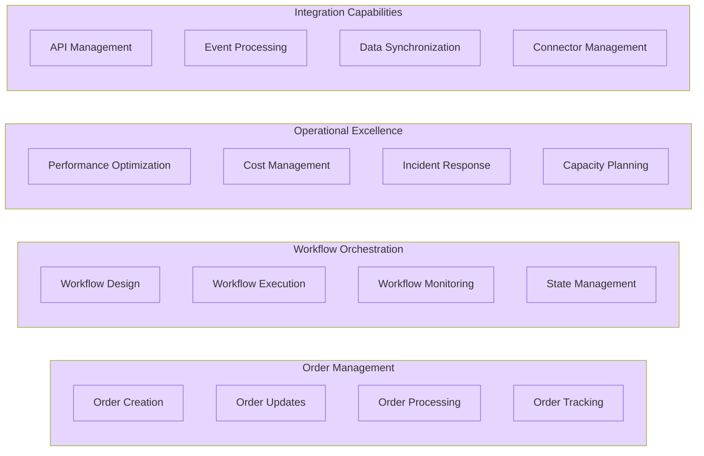

#### Value Stream Map

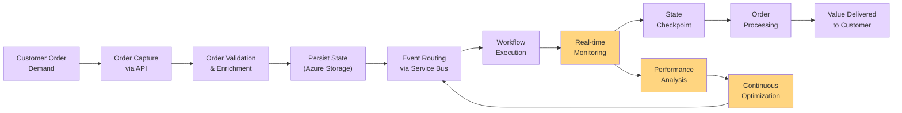

### Data Architecture

#### Purpose
The Data Architecture layer defines how data flows through the system, how workflow state is persisted in Azure Storage, and how monitoring and observability data is collected, processed, and analyzed to support operational excellence. This layer emphasizes event-driven data patterns with Service Bus for messaging and Azure Storage for durable workflow state management.

#### Process (High-Level)
Data flows through **ingestion** (orders via API, events via Service Bus), **processing** (workflow execution with stateful checkpoints, business logic validation), **storage** (Azure Storage for workflow state persistence, Application Insights for telemetry), and **governance** (monitoring, alerting, cost optimization). The architecture supports both workflow state data (checkpoints, execution history) and observability data (metrics, logs, distributed traces).

#### Master Data Management (MDM)

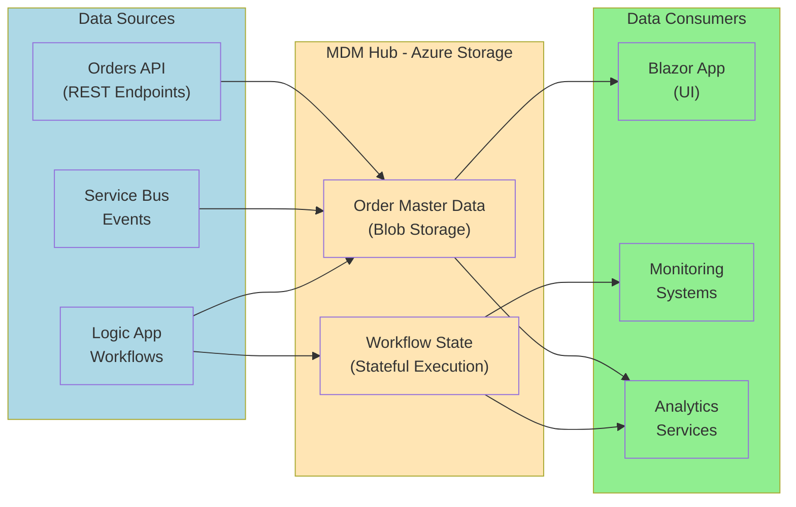

#### Event-Driven Data Topology

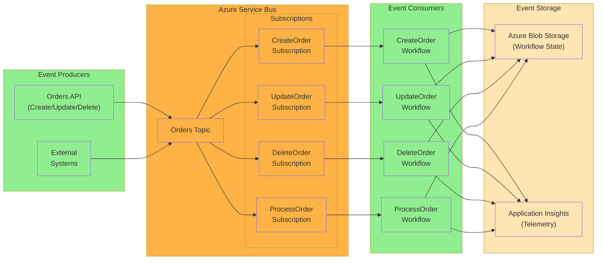

#### Monitoring Dataflow

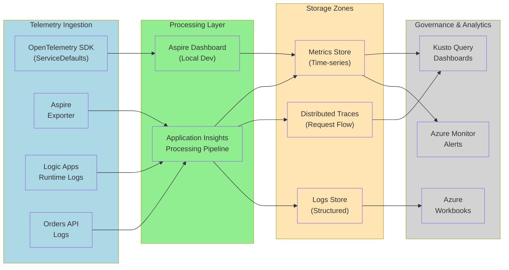

### Application Architecture

#### Purpose
The Application Architecture layer defines the **services, APIs, workflows, and their interactions** that implement business capabilities. It focuses on microservices patterns with .NET Aspire orchestration, event-driven architecture using Azure Service Bus, and Logic Apps workflow orchestration for long-running business processes.

#### Process (High-Level)
Applications are organized as **microservices** (Orders API with Minimal APIs, Blazor App with WebAssembly client) orchestrated through **.NET Aspire AppHost** with service discovery and configuration management. Integration occurs via **event-driven patterns** using Azure Service Bus topics and subscriptions. Logic Apps workflows consume events, execute long-running stateful processes (18-36 months), and persist state to Azure Storage. All components are instrumented with OpenTelemetry for distributed tracing and observability.

#### Microservices Architecture

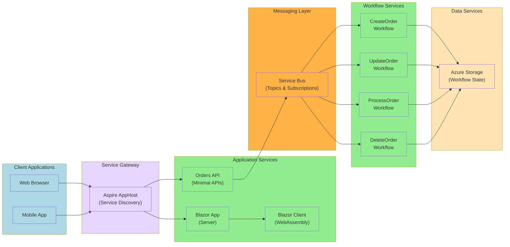

#### Event-Driven Architecture

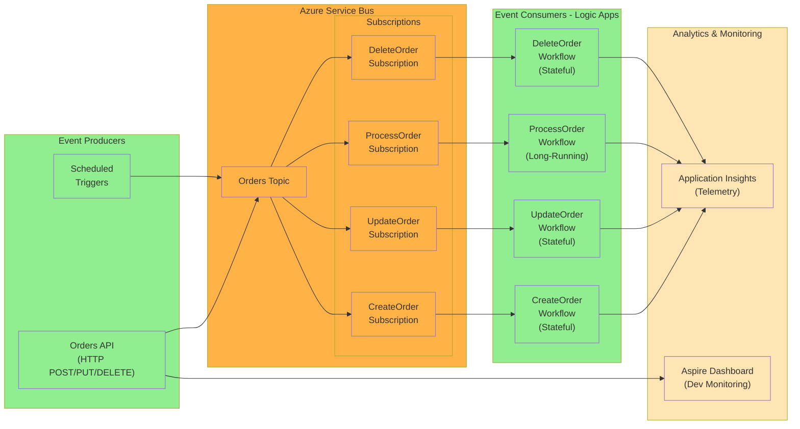

#### Event State Transitions

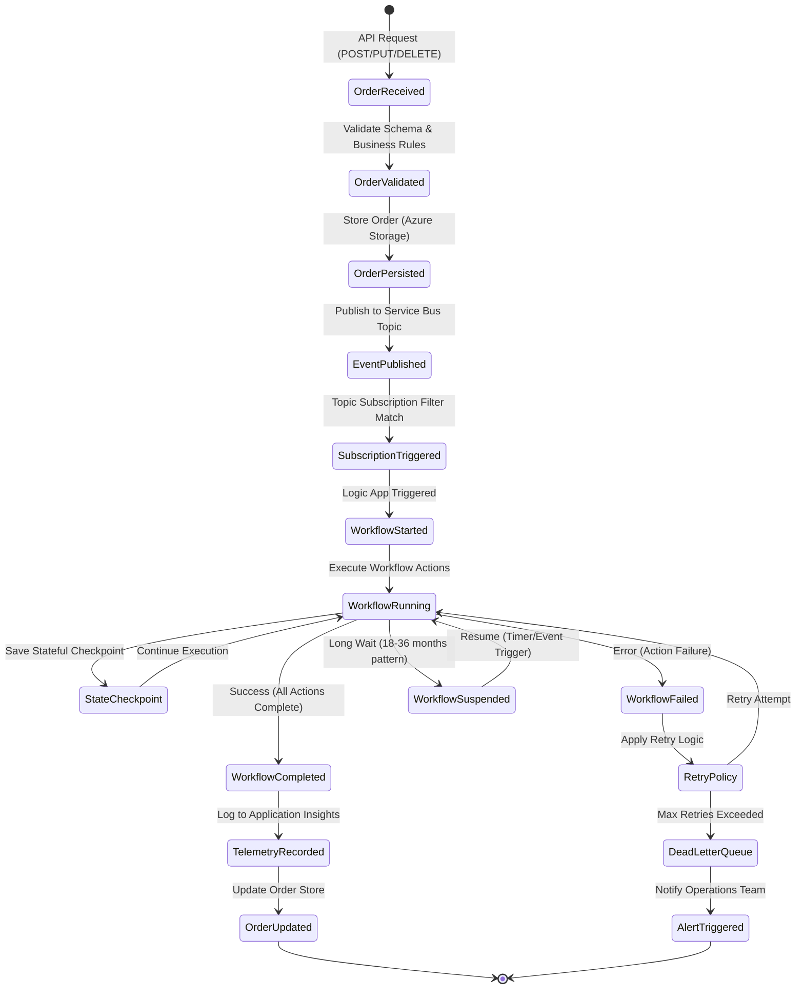

### Technology Architecture

#### Purpose
The Technology Architecture layer defines the **platforms, infrastructure, runtime environments, and supporting services** that host and operate the application components. It focuses on cloud-native patterns with Azure Container Apps, containerization with Docker, serverless computing with Logic Apps Standard, and platform engineering practices with .NET Aspire and Infrastructure-as-Code (Bicep).

#### Process (High-Level)
The solution runs on **Azure Container Apps** for microservices and containerized Logic Apps with automatic scaling, uses **.NET Aspire** for local orchestration, service defaults, and telemetry aggregation, leverages **Azure PaaS services** (Azure Storage for workflow state, Service Bus with topics/subscriptions, Application Insights with OpenTelemetry), and implements **platform engineering** practices with Bicep IaC, CI/CD pipelines, and golden path patterns through ServiceDefaults.

#### Cloud-Native Platform

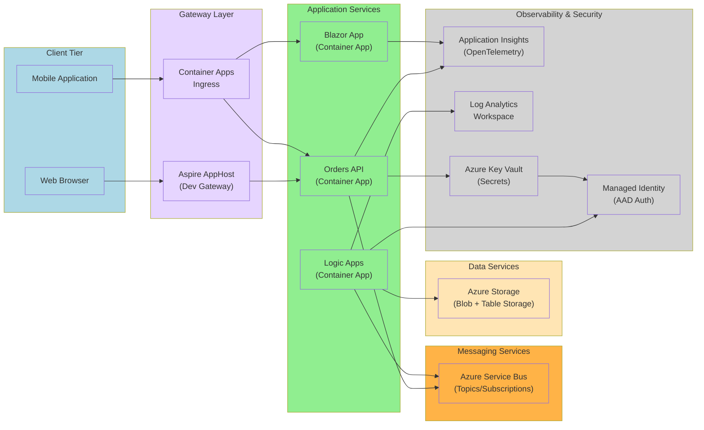

#### Container-Based Architecture

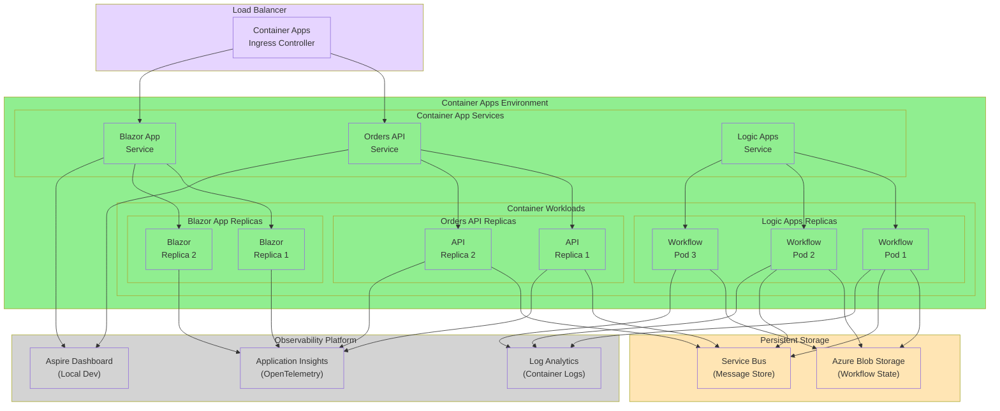

#### Serverless Architecture

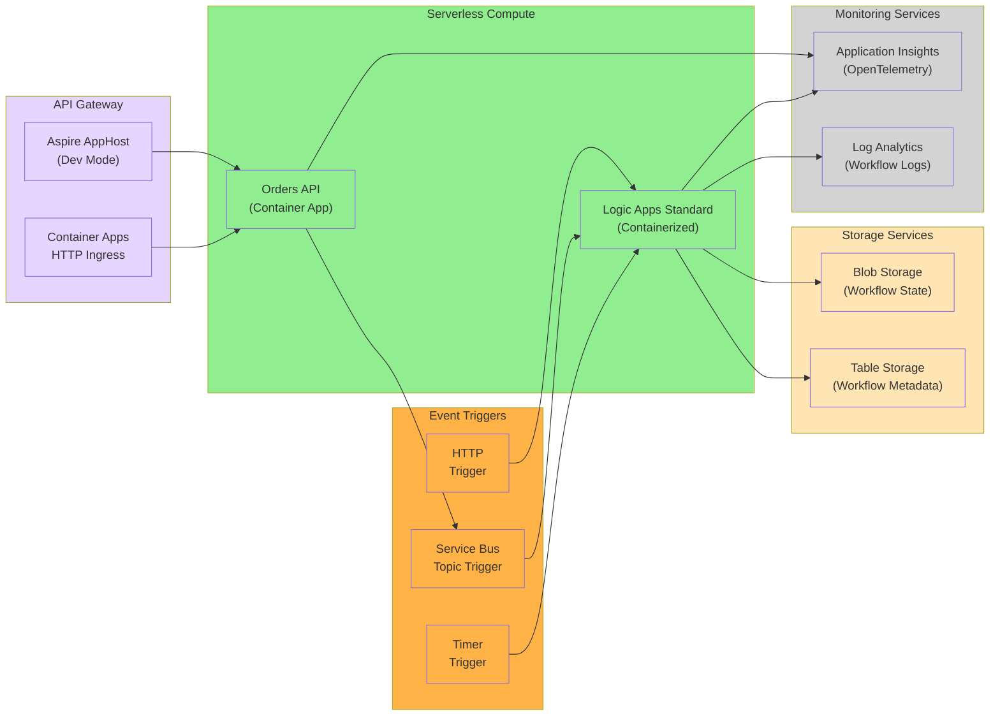

#### Platform Engineering

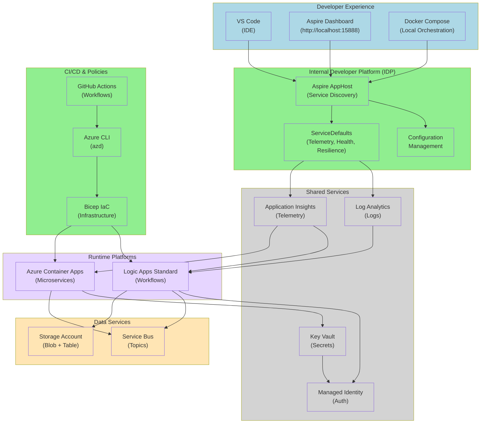

## Deployment

### Prerequisites

Before deploying this solution, ensure you have the following tools and access configured:

- **[.NET 10 SDK](https://dotnet.microsoft.com/download/dotnet/10.0)** or later
- **[Azure CLI](https://docs.microsoft.com/cli/azure/install-azure-cli)** version 2.50.0 or later
- **[Azure Developer CLI (azd)](https://learn.microsoft.com/azure/developer/azure-developer-cli/install-azd)** for streamlined deployment
- **[Docker Desktop](https://www.docker.com/products/docker-desktop)** for local development and containerization
- **[Visual Studio Code](https://code.visualstudio.com/)** with the following extensions:
  - [Azure Account](https://marketplace.visualstudio.com/items?itemName=ms-vscode.azure-account)
  - [Azure Resources](https://marketplace.visualstudio.com/items?itemName=ms-azuretools.vscode-azureresourcegroups)
  - [Azure Logic Apps Standard](https://marketplace.visualstudio.com/items?itemName=ms-azuretools.vscode-azurelogicapps)
  - [C# Dev Kit](https://marketplace.visualstudio.com/items?itemName=ms-dotnettools.csdevkit)
  - [Azure Storage](https://marketplace.visualstudio.com/items?itemName=ms-azuretools.vscode-azurestorage)
- **Active Azure subscription** with appropriate permissions (see RBAC roles below)
- **Azurite** (optional, for local Azure Storage emulation): [Download](https://learn.microsoft.com/azure/storage/common/storage-use-azurite)

### Azure RBAC Roles

The following Azure RBAC roles are required for deploying and operating this solution:

| Role Name | Description | Documentation Link |
|-----------|-------------|-------------------|
| **Contributor** | Required for provisioning Azure resources (Container Apps, Azure Storage, Service Bus, Application Insights) | [Azure Contributor role](https://learn.microsoft.com/azure/role-based-access-control/built-in-roles#contributor) |
| **User Access Administrator** | Required for assigning managed identities and configuring RBAC for services | [User Access Administrator role](https://learn.microsoft.com/azure/role-based-access-control/built-in-roles#user-access-administrator) |
| **Logic Apps Contributor** | Required for deploying and managing Logic Apps workflows | [Logic Apps Contributor role](https://learn.microsoft.com/azure/role-based-access-control/built-in-roles#logic-app-contributor) |
| **Storage Account Contributor** | Required for creating and managing Azure Storage accounts for Logic Apps state persistence | [Storage Account Contributor role](https://learn.microsoft.com/azure/role-based-access-control/built-in-roles/storage#storage-account-contributor) |
| **Azure Service Bus Data Owner** | Required for managing Service Bus topics, subscriptions, and sending/receiving messages | [Azure Service Bus Data Owner role](https://learn.microsoft.com/azure/role-based-access-control/built-in-roles/integration#azure-service-bus-data-owner) |
| **Application Insights Component Contributor** | Required for configuring Application Insights and managing telemetry | [Application Insights Component Contributor](https://learn.microsoft.com/azure/role-based-access-control/built-in-roles/monitor#application-insights-component-contributor) |
| **Key Vault Secrets Officer** | Required for managing secrets in Azure Key Vault | [Key Vault Secrets Officer role](https://learn.microsoft.com/azure/role-based-access-control/built-in-roles/security#key-vault-secrets-officer) |

**Note**: For production deployments, follow the principle of least privilege. Use custom roles if the built-in roles grant more permissions than necessary.

### Infrastructure Deployment

The solution uses **Azure Bicep** for infrastructure provisioning, orchestrated through the Azure Developer CLI (azd).

1. **Clone the repository**:
   ```bash
   git clone https://github.com/Evilazaro/Azure-LogicApps-Monitoring.git
   cd Azure-LogicApps-Monitoring
   ```

2. **Authenticate with Azure**:
   ```bash
   azd auth login
   az login
   ```

3. **Initialize the Azure Developer environment**:
   ```bash
   azd init
   ```
   
   Select or create an environment name (e.g., `dev`, `staging`, `prod`).

4. **Configure environment variables** (optional):
   
   Edit the `.azure/<environment-name>/.env` file to customize deployment parameters:
   ```bash
   AZURE_LOCATION=eastus
   AZURE_SUBSCRIPTION_ID=<your-subscription-id>
   ```

5. **Provision Azure resources**:
   ```bash
   azd provision
   ```
   
   This command will:
   - Create a resource group in the specified region
   - Deploy Azure Container Apps environment with scale rules
   - Provision Application Insights and Log Analytics workspace with OpenTelemetry support
   - Create Azure Storage Account for Logic Apps workflow state (blob and table storage)
   - Deploy Azure Service Bus namespace with topics (`orders`) and subscriptions (`CreateOrder`, `UpdateOrder`, `DeleteOrder`, `ProcessOrder`)
   - Configure Azure Key Vault for connection string management
   - Set up managed identities for passwordless authentication
   - Assign RBAC roles for service-to-service communication

6. **Verify deployment**:
   ```bash
   azd show
   ```
   
   This displays the provisioned resources and their endpoints.

### Application Deployment

Deploy the application services, Logic Apps workflows, and supporting infrastructure to Azure.

1. **Build and deploy all services**:
   ```bash
   azd deploy
   ```
   
   This command will:
   - Build Docker images for:
     - Orders API (ASP.NET Core Minimal APIs)
     - Blazor App (Server + WebAssembly Client)
     - Logic Apps Standard (ContosoOrders workflows)
   - Push images to Azure Container Registry
   - Deploy containers to Azure Container Apps with:
     - Environment variables from Key Vault
     - Managed identity configuration
     - Auto-scaling rules (min 1, max 10 replicas)
   - Configure Service Bus triggers for Logic Apps workflows
   - Enable Application Insights instrumentation with OpenTelemetry

2. **Deploy individual services** (optional):
   ```bash
   # Deploy only the Orders API
   azd deploy orders-api
   
   # Deploy only the Blazor App
   azd deploy blazor-app
   
   # Deploy only Logic Apps workflows
   azd deploy logicapps
   ```

3. **Verify deployment and access endpoints**:
   ```bash
   # Get the Orders API endpoint
   azd show --output json | jq -r '.services."orders-api".endpoints[0]'
   
   # Get the Blazor App endpoint
   azd show --output json | jq -r '.services."blazor-app".endpoints[0]'
   ```
   
   Navigate to the Blazor App URL to access the user interface.

4. **Local development with .NET Aspire**:
   
   For local development with full observability:
   
   ```bash
   # Option 1: Using .NET Aspire AppHost
   cd eShopOrders.AppHost
   dotnet run
   
   # Option 2: Using Docker Compose
   docker-compose up
   ```
   
   Access the **Aspire Dashboard** at `http://localhost:15888` to:
   - View all running services with health status
   - Monitor distributed traces across API → Service Bus → Logic Apps
   - Analyze metrics (request rates, response times, errors)
   - View structured logs with correlation IDs
   - Inspect Service Bus message flow

5. **Configure local Azurite storage emulator** (optional):
   
   For local development with Azure Storage emulation:
   
   ```bash
   # Start Azurite using Docker
   docker run -p 10000:10000 -p 10001:10001 -p 10002:10002 \
     mcr.microsoft.com/azure-storage/azurite
   ```
   
   Or install Azurite globally via npm:
   ```bash
   npm install -g azurite
   azurite --silent --location ./azurite --debug ./azurite/debug.log
   ```
   
   The Logic Apps will automatically use Azurite connection string for local development:
   ```
   UseDevelopmentStorage=true
   ```

## Usage Examples

### Order Management Operations

#### Creating an Order via REST API

```bash
# Create a new order
curl -X POST https://<your-orders-api-url>/api/orders \
  -H "Content-Type: application/json" \
  -d '{
    "userId": "user123",
    "orderNumber": "ORD-2024-001",
    "items": [
      { "productId": "PROD-001", "quantity": 2, "price": 29.99 }
    ],
    "totalAmount": 59.98,
    "status": "Pending"
  }'
```

This API call will:
1. Validate the order schema
2. Store the order (extensible to persistent storage)
3. Publish an event to the Service Bus `orders` topic
4. Trigger the `CreateOrder` Logic Apps workflow
5. Return the order ID and status

#### Updating an Order

```bash
# Update an existing order
curl -X PUT https://<your-orders-api-url>/api/orders/ORD-2024-001 \
  -H "Content-Type: application/json" \
  -d '{
    "userId": "user123",
    "status": "Processing"
  }'
```

This triggers the `UpdateOrder` workflow via Service Bus subscription.

#### Querying Orders

```bash
# Get all orders
curl -X GET https://<your-orders-api-url>/api/orders

# Get specific order
curl -X GET https://<your-orders-api-url>/api/orders/ORD-2024-001
```

### Workflow Monitoring Examples

#### Monitoring Workflow Execution in Aspire Dashboard

When running locally with .NET Aspire:

1. Navigate to `http://localhost:15888`
2. Click on **Traces** to view distributed traces:
   - API request → Service Bus publish → Logic App trigger → Workflow execution
3. Click on **Metrics** to view:
   - Workflow execution count
   - Average execution duration
   - Failure rate by workflow
4. Click on **Logs** and filter by:
   - `WorkflowName == "CreateOrder"`
   - `Status == "Failed"`

#### Monitoring Workflows in Azure Portal

1. Navigate to Azure Portal → Logic Apps
2. Select your Logic App instance
3. Click **Runs history** to view:
   - All workflow executions with timestamp
   - Input/output data for each run
   - Execution duration and status
4. Click on a specific run to view:
   - Action-by-action execution details
   - Retry attempts and failures
   - Correlation ID for end-to-end tracing

### Kusto Queries for Logic Apps Monitoring

#### Query: Workflow Execution Summary (Last 24 Hours)

```kql
// Workflow execution summary with success/failure counts
AppTraces
| where TimeGenerated > ago(24h)
| where Properties.Category == "Microsoft.Azure.Workflows.Runtime"
| where Properties.WorkflowName in ("CreateOrder", "UpdateOrder", "ProcessOrder", "DeleteOrder")
| summarize 
    TotalRuns = count(),
    SuccessfulRuns = countif(Properties.Status == "Succeeded"),
    FailedRuns = countif(Properties.Status == "Failed"),
    AvgDurationMs = avg(todouble(Properties.DurationMs))
    by WorkflowName = tostring(Properties.WorkflowName)
| order by TotalRuns desc
```

#### Query: Failed Workflow Runs with Error Details

```kql
// Failed workflow runs with error messages
AppTraces
| where TimeGenerated > ago(7d)
| where Properties.Category == "Microsoft.Azure.Workflows.Runtime"
| where Properties.Status == "Failed"
| project 
    TimeGenerated,
    WorkflowName = Properties.WorkflowName,
    RunId = Properties.RunId,
    ErrorCode = Properties.ErrorCode,
    ErrorMessage = Properties.ErrorMessage,
    ActionName = Properties.ActionName
| order by TimeGenerated desc
```

#### Query: Long-Running Workflows (Execution Time > 5 minutes)

```kql
// Identify long-running workflow executions
AppTraces
| where TimeGenerated > ago(24h)
| where Properties.Category == "Microsoft.Azure.Workflows.Runtime"
| where Properties.Status == "Succeeded"
| extend DurationMinutes = todouble(Properties.DurationMs) / 60000
| where DurationMinutes > 5
| project 
    TimeGenerated,
    WorkflowName = Properties.WorkflowName,
    RunId = Properties.RunId,
    DurationMinutes,
    TriggerName = Properties.TriggerName
| order by DurationMinutes desc
```

#### Query: Workflow Trigger Performance

```kql
// Analyze workflow trigger latency (Service Bus)
AppDependencies
| where TimeGenerated > ago(24h)
| where Type == "Azure Service Bus"
| where Target contains "orders"
| summarize 
    TriggerCount = count(),
    AvgLatencyMs = avg(DurationMs),
    P95LatencyMs = percentile(DurationMs, 95),
    P99LatencyMs = percentile(DurationMs, 99)
    by OperationName
| order by TriggerCount desc
```

#### Query: Workflow Retry Analysis

```kql
// Analyze workflow retry patterns
AppTraces
| where TimeGenerated > ago(7d)
| where Properties.Category == "Microsoft.Azure.Workflows.Runtime"
| where Properties.ActionName has "Retry"
| summarize 
    RetryCount = count(),
    UniqueRuns = dcount(Properties.RunId)
    by 
    WorkflowName = tostring(Properties.WorkflowName),
    ActionName = tostring(Properties.ActionName)
| order by RetryCount desc
```

#### Query: Service Bus Dead Letter Queue Monitoring

```kql
// Monitor messages moved to dead letter queue
AppTraces
| where TimeGenerated > ago(24h)
| where Properties contains "DeadLetter"
| project 
    TimeGenerated,
    WorkflowName = Properties.WorkflowName,
    MessageId = Properties.MessageId,
    Reason = Properties.Reason,
    ErrorDescription = Properties.ErrorDescription
| order by TimeGenerated desc
```

#### Query: Distributed Trace Analysis (API → Service Bus → Workflow)

```kql
// End-to-end trace correlation across services
AppDependencies
| where TimeGenerated > ago(1h)
| where Type == "HTTP" or Type == "Azure Service Bus"
| join kind=inner (
    AppTraces
    | where Properties.Category == "Microsoft.Azure.Workflows.Runtime"
) on $left.OperationId == $right.OperationId
| project 
    TimeGenerated,
    OperationId,
    ServiceName = AppDependencies_Name,
    DependencyType = Type,
    WorkflowName = Properties.WorkflowName,
    TotalDurationMs = DurationMs
| order by TimeGenerated desc
```

## Monitoring and Observability

### .NET Aspire Dashboard

The [.NET Aspire Dashboard](https://aspire.dev/dashboard/overview/) provides a unified local development experience for monitoring all services, viewing distributed traces, and analyzing metrics in real-time.

**Key Features**:
- **Service Discovery**: Automatically discovers all services orchestrated by the AppHost
- **Distributed Tracing**: Visualizes request flows across Orders API, Logic Apps, and Blazor App
- **Metrics Visualization**: Real-time charts for HTTP requests, Service Bus messages, and custom metrics
- **Log Aggregation**: Centralized view of structured logs from all services with correlation IDs
- **Health Checks**: Monitor service health status and readiness

**Access**: When running locally (`dotnet run` in eShopOrders.AppHost), navigate to `http://localhost:15888`.

**Local Development Workflow**:
1. Start the Aspire AppHost: `dotnet run --project eShopOrders.AppHost`
2. Open browser to `http://localhost:15888`
3. Monitor service startup and health checks
4. Send test requests to Orders API
5. View end-to-end traces in the Traces tab
6. Analyze metrics in the Metrics tab
7. Filter logs by service, severity, or correlation ID

### Application Insights Integration

The solution integrates with [Azure Application Insights](https://learn.microsoft.com/azure/azure-monitor/app/opentelemetry-data-collection) using **OpenTelemetry** for comprehensive observability in production environments.

**Telemetry Collected**:
- **Distributed Traces**: End-to-end request tracking across microservices and workflows
- **Metrics**: Performance counters, request rates, response times, custom business metrics
- **Logs**: Structured application logs with correlation IDs
- **Dependencies**: External service calls (Service Bus, Storage, HTTP requests)
- **Exceptions**: Unhandled exceptions with stack traces and context

**Configuration**: Telemetry is configured in `eShopOrders.ServiceDefaults/Extensions.cs` using the `.AddOpenTelemetry()` extension method, which automatically instruments:
- ASP.NET Core requests
- HTTP client calls
- Azure SDK operations (Service Bus, Storage)
- Custom activity sources for Logic Apps

**Custom Metrics Example**:

```csharp
// In your service code
using System.Diagnostics.Metrics;

var meter = new Meter("eShop.Orders");
var orderCounter = meter.CreateCounter<long>("orders.created");
var orderDuration = meter.CreateHistogram<double>("orders.processing.duration", "ms");

// Increment counter when order is created
orderCounter.Add(1, new KeyValuePair<string, object?>("status", "pending"));

// Record processing duration
orderDuration.Record(executionTimeMs, new KeyValuePair<string, object?>("workflow", "CreateOrder"));
```

### Logic Apps Workflow Monitoring Best Practices

Monitor Azure Logic Apps Standard workflows using the guidance from [Monitor Logic Apps](https://learn.microsoft.com/azure/logic-apps/monitor-logic-apps).

#### Best Practice 1: Enable Diagnostic Settings

Configure diagnostic settings to send workflow execution data to Log Analytics:

```bash
# Azure CLI command to enable diagnostics
az monitor diagnostic-settings create \
  --name "LogicAppDiagnostics" \
  --resource <logic-app-resource-id> \
  --workspace <log-analytics-workspace-id> \
  --logs '[{"category": "WorkflowRuntime", "enabled": true}]' \
  --metrics '[{"category": "AllMetrics", "enabled": true}]'
```

#### Best Practice 2: Implement Correlation IDs

Use correlation IDs to trace requests across API → Service Bus → Logic Apps:

```json
// When publishing to Service Bus from Orders API
{
  "applicationProperties": {
    "traceparent": "00-4bf92f3577b34da6a3ce929d0e0e4736-00f067aa0ba902b7-01",
    "correlationId": "4bf92f3577b34da6a3ce929d0e0e4736"
  }
}
```

#### Best Practice 3: Monitor Long-Running Workflows

For workflows executing 18-36 months:
- **Checkpoint Monitoring**: Track state checkpoints to ensure workflow progress
- **Heartbeat Metrics**: Implement periodic heartbeat signals
- **State Persistence**: Verify Azure Storage connectivity for state management
- **Resource Limits**: Monitor workflow instance count and memory usage

```kql
// Monitor workflow checkpoint frequency
AppTraces
| where Properties.Category == "Microsoft.Azure.Workflows.Runtime"
| where Properties.EventName == "WorkflowCheckpoint"
| summarize CheckpointCount = count() by bin(TimeGenerated, 1h), WorkflowName = tostring(Properties.WorkflowName)
| render timechart
```

#### Best Practice 4: Set Up Proactive Alerts

Configure Azure Monitor alerts for critical scenarios:

**Alert 1: Workflow Failure Rate Exceeds Threshold**
```kql
AppTraces
| where Properties.Category == "Microsoft.Azure.Workflows.Runtime"
| where Properties.Status == "Failed"
| summarize FailureCount = count() by bin(TimeGenerated, 5m)
| where FailureCount > 5
```

**Alert 2: Workflow Execution Duration Exceeds SLA**
```kql
AppTraces
| where Properties.Category == "Microsoft.Azure.Workflows.Runtime"
| where todouble(Properties.DurationMs) > 300000 // 5 minutes
| project TimeGenerated, WorkflowName = Properties.WorkflowName, DurationMs = Properties.DurationMs
```

**Alert 3: Dead Letter Queue Threshold**
```kql
AppTraces
| where Properties contains "DeadLetter"
| summarize DeadLetterCount = count() by bin(TimeGenerated, 15m)
| where DeadLetterCount > 10
```

#### Best Practice 5: Implement Application Insights Availability Tests

Create availability tests to monitor Logic Apps HTTP endpoints:

```bash
# Azure CLI command to create availability test
az monitor app-insights component create \
  --app <app-insights-name> \
  --location <region> \
  --resource-group <resource-group>

az rest --method PUT \
  --uri "https://management.azure.com/subscriptions/<subscription-id>/resourceGroups/<rg>/providers/Microsoft.Insights/webtests/<test-name>?api-version=2015-05-01" \
  --body '{
    "location": "<region>",
    "properties": {
      "SyntheticMonitorId": "<test-name>",
      "Name": "Logic App Health Check",
      "Enabled": true,
      "Frequency": 300,
      "Timeout": 120,
      "Kind": "ping",
      "Locations": [{"Id": "us-east-1"}],
      "Configuration": {
        "WebTest": "<WebTest><Items><Request Url=\"https://<logic-app-url>\" /></Items></WebTest>"
      }
    }
  }'
```

#### Best Practice 6: Monitor Resource Consumption

Track Container Apps resource utilization for Logic Apps:

```kql
// CPU and Memory usage for Logic Apps containers
ContainerAppConsoleLogs_CL
| where ContainerAppName_s contains "logicapp"
| extend ResourceUsage = parse_json(Message)
| project 
    TimeGenerated,
    ContainerName = ContainerName_s,
    CPUUsage = ResourceUsage.cpu,
    MemoryUsage = ResourceUsage.memory
| render timechart
```

#### Best Practice 7: Workflow Performance Optimization

Identify bottlenecks and optimize workflow actions:

```kql
// Action-level performance analysis
AppTraces
| where Properties.Category == "Microsoft.Azure.Workflows.Runtime"
| where Properties.EventName == "ActionCompleted"
| summarize 
    AvgDurationMs = avg(todouble(Properties.DurationMs)),
    P95DurationMs = percentile(todouble(Properties.DurationMs), 95),
    MaxDurationMs = max(todouble(Properties.DurationMs)),
    Count = count()
    by 
    WorkflowName = tostring(Properties.WorkflowName),
    ActionName = tostring(Properties.ActionName)
| where AvgDurationMs > 1000 // Actions taking > 1 second
| order by AvgDurationMs desc
```

#### Best Practice 8: Cost Monitoring and Optimization

Track execution costs and optimize resource allocation:

```kql
// Workflow execution cost estimation (based on run count and duration)
AppTraces
| where Properties.Category == "Microsoft.Azure.Workflows.Runtime"
| where Properties.Status == "Succeeded"
| summarize 
    TotalRuns = count(),
    TotalDurationMinutes = sum(todouble(Properties.DurationMs)) / 60000,
    AvgDurationMs = avg(todouble(Properties.DurationMs))
    by WorkflowName = tostring(Properties.WorkflowName)
| extend EstimatedMonthlyCost = TotalRuns * 30 * 0.000025 // Approximate cost per execution
| order by EstimatedMonthlyCost desc
```

## References

### Azure Logic Apps Standard
- [Azure Logic Apps Standard Documentation](https://learn.microsoft.com/azure/logic-apps/single-tenant-overview-compare)
- [Monitor Logic Apps](https://learn.microsoft.com/azure/logic-apps/monitor-logic-apps)
- [Logic Apps on Container Apps](https://learn.microsoft.com/azure/logic-apps/deploy-single-tenant-logic-apps-azure-container-apps)
- [Logic Apps Best Practices](https://learn.microsoft.com/azure/logic-apps/logic-apps-best-practices-and-guidance)

### Azure Monitoring & Observability
- [Azure Monitor for .NET](https://learn.microsoft.com/dotnet/api/overview/azure/monitor?view=azure-dotnet)
- [Azure Well-Architected Framework - Monitoring](https://learn.microsoft.com/azure/well-architected/operational-excellence/monitoring)
- [Application Insights with OpenTelemetry](https://learn.microsoft.com/azure/azure-monitor/app/opentelemetry-data-collection)
- [Kusto Query Language (KQL) Reference](https://learn.microsoft.com/azure/data-explorer/kusto/query/)

### .NET Aspire
- [.NET Aspire Dashboard Overview](https://aspire.dev/dashboard/overview/)
- [.NET Aspire Documentation](https://learn.microsoft.com/dotnet/aspire/)
- [.NET Aspire Service Defaults](https://learn.microsoft.com/dotnet/aspire/fundamentals/service-defaults)
- [OpenTelemetry in .NET Aspire](https://learn.microsoft.com/dotnet/aspire/fundamentals/telemetry)

### Azure Infrastructure
- [Azure Bicep Documentation](https://learn.microsoft.com/azure/azure-resource-manager/bicep/)
- [Azure Developer CLI](https://learn.microsoft.com/azure/developer/azure-developer-cli/)
- [Azure Container Apps](https://learn.microsoft.com/azure/container-apps/)
- [Azure Service Bus](https://learn.microsoft.com/azure/service-bus-messaging/)
- [Azure Storage Account](https://learn.microsoft.com/azure/storage/common/storage-account-overview)

### DevOps & CI/CD
- [GitHub Actions for Azure](https://learn.microsoft.com/azure/developer/github/github-actions)
- [Azure CLI Reference](https://learn.microsoft.com/cli/azure/)
- [Docker Documentation](https://docs.docker.com/)

### Performance & Optimization
- [Azure Logic Apps Performance Best Practices](https://learn.microsoft.com/azure/logic-apps/logic-apps-best-practices-and-guidance#performance)
- [Container Apps Scaling](https://learn.microsoft.com/azure/container-apps/scale-app)
- [Service Bus Performance Best Practices](https://learn.microsoft.com/azure/service-bus-messaging/service-bus-performance-improvements)

---

**Built with**: .NET 10, Azure Logic Apps Standard, Azure Container Apps, .NET Aspire, Azure Storage, Azure Service Bus, Application Insights, OpenTelemetry