# Azure Logic Apps Monitoring Solution

[](https://opensource.org/licenses/MIT)
[](https://azure.microsoft.com/services/logic-apps/)
[](https://dotnet.microsoft.com/)

## Overview

### Purpose

This solution provides a production-ready reference architecture for deploying and monitoring Azure Logic Apps Standard at enterprise scale. It addresses critical challenges faced by organizations managing thousands of workflows across global deployments, demonstrating proven patterns for workflow hosting density optimization, comprehensive observability, and cost management.

The architecture integrates Azure Logic Apps Standard with Azure Monitor, Application Insights, and .NET Aspire to deliver end-to-end distributed tracing across Blazor WebAssembly clients, ASP.NET Core APIs, Azure Service Bus messaging, and serverless workflows. This implementation showcases how to instrument, monitor, and operate complex business processes while maintaining stability and controlling operational costs.

Built on the Azure Well-Architected Framework's operational excellence pillar, the solution provides Infrastructure as Code (Bicep templates), containerized services via Azure Container Apps, and comprehensive telemetry collection using OpenTelemetry standards. It serves as a practical guide for platform engineers and solution architects designing resilient, observable, and cost-effective workflow orchestration systems.

### Problem Statement

Enterprise organizations deploying Azure Logic Apps Standard at scale encounter significant operational challenges when managing thousands of workflows across multiple regions. Microsoft's guidance recommends approximately 20 workflows per Logic App instance and up to 64 apps per App Service Plan to maintain optimal performance and reliability.

However, organizations that exceed these density limits—particularly those leveraging 64-bit runtime support for memory-intensive operations—frequently experience memory spikes, workflow execution instability, and unpredictable performance degradation. These issues compound in environments running long-duration workflows (18-36 months) where state management and resource consumption become critical factors. Without proper monitoring and architecture patterns, operational costs can spiral to approximately $80,000 USD annually per environment due to over-provisioned infrastructure and reactive scaling strategies.

This solution directly addresses these challenges by providing validated patterns for workflow density optimization, elastic scaling strategies aligned with App Service Plan capabilities (WS1 SKU with 3-20 instance scaling), and comprehensive observability that enables proactive resource management and performance optimization.

### Key Features

| Feature | Description | Implementation Details |
|---------|-------------|------------------------|
| **Enterprise-Scale Workflow Hosting** | Optimized Logic Apps Standard deployment supporting high workflow density | Elastic App Service Plan (WS1 SKU) with 3-20 instance auto-scaling, Functions runtime v4 |
| **End-to-End Distributed Tracing** | W3C Trace Context propagation across all service boundaries | OpenTelemetry SDK integration in Blazor, ASP.NET Core, Service Bus, and Logic Apps |
| **Comprehensive Observability Stack** | Unified monitoring with correlation across application components | Application Insights, Log Analytics workspace, .NET Aspire Dashboard integration |
| **Infrastructure as Code** | Repeatable, version-controlled infrastructure deployments | Azure Bicep modules with modular architecture (monitoring, identity, messaging, workload) |
| **Managed Identity Authentication** | Keyless authentication across all Azure resources | User-assigned managed identity with granular RBAC role assignments |
| **Event-Driven Architecture** | Asynchronous message processing with guaranteed delivery | Azure Service Bus topics, queues, and subscriptions with dead-letter handling |
| **Optimized Data Access** | High-performance document storage with hierarchical partitioning | Azure Cosmos DB SQL API with hierarchical partition keys to overcome 20 GB limits |
| **Local Development Support** | Full-fidelity local testing and debugging | .NET Aspire AppHost orchestration, Cosmos DB Emulator, Service Bus local development |
| **Cost Optimization Patterns** | Right-sized infrastructure with elastic scaling | Proven patterns reducing annual costs from ~$80K to sustainable levels |
| **Production-Ready Workflows** | Sample ConsosoOrders workflow demonstrating long-running patterns | Stateful workflow execution with checkpoint persistence and retry policies |

### Solution Components

| Component | Description | Role in Solution |
|-----------|-------------|------------------|
| **Monitoring Infrastructure** | Log Analytics workspace and Application Insights | Centralized telemetry collection, diagnostic logging, and performance analysis |
| **Identity & Access** | User-assigned managed identity with RBAC assignments | Secure, keyless authentication to Azure Service Bus, Cosmos DB, and Storage |
| **Messaging Layer** | Azure Service Bus namespace with topics and queues | Reliable async communication between APIs, workflows, and processors |
| **Workflow Engine** | Logic Apps Standard on elastic App Service Plan | Serverless workflow orchestration with Functions v4 runtime and extension bundles |
| **Data Platform** | Azure Cosmos DB SQL API with hierarchical partitioning | Persistent order storage with optimized query performance and scalability |
| **Web API** | ASP.NET Core REST API with OpenTelemetry | Order management endpoints with distributed tracing instrumentation |
| **Client Application** | Blazor WebAssembly with OpenTelemetry | Interactive UI with end-to-end trace correlation |
| **Container Platform** | Azure Container Apps Environment | Managed Kubernetes-based hosting for containerized microservices |
| **Developer Dashboard** | .NET Aspire Dashboard | Local observability during development with live telemetry visualization |

### Azure Components

| Azure Service | Description | Role in Solution |
|---------------|-------------|------------------|
| **Azure Logic Apps Standard** | Serverless workflow orchestration (single-tenant) | Executes ConsosoOrders workflow for order processing with elastic scaling |
| **Azure App Service Plan (WS1)** | Elastic compute for Logic Apps Standard | Provides 3-20 instance auto-scaling for workflow hosting density optimization |
| **Azure Application Insights** | Application performance monitoring (APM) | Collects distributed traces, metrics, and logs with correlation IDs |
| **Azure Log Analytics** | Centralized log aggregation and Kusto query engine | Stores diagnostic logs, workflow runtime telemetry, and custom metrics |
| **Azure Service Bus (Standard)** | Enterprise messaging with topics and queues | Decouples producers/consumers with guaranteed message delivery and dead-lettering |
| **Azure Cosmos DB (SQL API)** | Globally distributed NoSQL database | Stores order documents with hierarchical partition keys (`/tenantId/customerId`) |
| **Azure Container Apps** | Managed Kubernetes application platform | Hosts containerized Orders API with ingress, scaling, and observability |
| **Azure Managed Identity** | Azure AD identity for Azure resources | Eliminates credential management with RBAC-based access to Service Bus, Cosmos DB |
| **Azure Storage Account** | Blob storage for Logic Apps state | Persists workflow checkpoints, run history, and configuration artifacts |
| **Azure Container Registry** | Private container image registry | Stores Docker images for containerized services with vulnerability scanning |

### Project Structure

```
Azure-LogicApps-Monitoring/
├── infra/                              # Infrastructure as Code (Bicep)
│   ├── main.bicep                      # Orchestrator deploying monitoring + workload
│   ├── types.bicep                     # Shared type definitions for tagging
│   ├── monitoring/
│   │   └── main.bicep                  # Log Analytics + Application Insights
│   └── workload/
│       ├── main.bicep                  # Orchestrates identity, messaging, services, workflows
│       ├── identity.bicep              # Managed identity + RBAC role assignments
│       ├── messaging.bicep             # Service Bus namespace, queues, topics
│       ├── logic-app.bicep             # Logic Apps Standard + App Service Plan (WS1)
│       ├── services.bicep              # Container Registry + Container Apps Environment
│       └── workflowstorage.bicep       # Storage account for workflow runtime state
├── eShopOrders.AppHost                # .NET Aspire AppHost orchestration
│   ├── Program.cs                      # Configures Aspire dashboard, services, workflows
│   └── appsettings.json                # Local development configuration
├── eShopOrders.ServiceDefaults        # Shared telemetry and resilience configuration
│   ├── Extensions.cs                   # OpenTelemetry setup (tracing, metrics, logging)
│   └── HealthChecks.cs                 # Service health check registration
├── src/
│   ├── eShop.Orders.API/               # ASP.NET Core Web API (REST endpoints)
│   │   ├── Controllers/
│   │   │   └── OrdersController.cs     # CRUD operations for orders
│   │   ├── Program.cs                  # API bootstrapping with OpenTelemetry
│   │   └── Services/
│   │       └── OrderService.cs         # Business logic with Cosmos DB integration
│   ├── eShop.Orders.App/               # Blazor Web App (server-side)
│   │   └── Program.cs                  # Blazor hosting with OpenTelemetry
│   └── eShop.Orders.App.Client/        # Blazor WebAssembly client
│       └── Program.cs                  # Client-side OpenTelemetry instrumentation
├── LogicAppWP/                         # Logic Apps Standard workspace
│   ├── host.json                       # Functions runtime configuration
│   ├── local.settings.json             # Local development settings
│   └── ConsosoOrders/                  # Sample workflow (ConsosoOrders)
│       ├── workflow.json               # Workflow definition (stateful)
│       └── connections.json            # Managed connection configurations
├── .azure/                             # Azure Developer CLI configuration
│   └── config.json                     # azd environment settings
├── docker-compose.yml                  # Multi-container orchestration
├── azure.yaml                          # Azure Developer CLI manifest
└── README.md                           # This file
```

---

## Architecture

### Business Architecture

#### Purpose

The Business Architecture layer defines the stable business capabilities required for enterprise order management. It organizes the solution around capabilities rather than organizational structures, ensuring alignment between business strategy and technical implementation while supporting scalability and long-term stability.

#### Key Capabilities

- **Order Lifecycle Management**: Create, validate, process, and fulfill customer orders with comprehensive state tracking
- **Workflow Orchestration**: Coordinate multi-step business processes across distributed systems with guaranteed execution
- **Business Process Monitoring**: Track order metrics, workflow execution KPIs, and SLA compliance in real-time
- **Compliance & Auditability**: Maintain immutable audit trails for regulatory requirements with correlation IDs
- **Event-Driven Integration**: Enable asynchronous communication between systems with guaranteed message delivery

#### Process

Orders are submitted via REST API, validated against business rules, and published to Service Bus topics. Logic Apps workflows consume order events, enrich with external data, persist to Cosmos DB, and trigger fulfillment processes. Each operation emits distributed traces that flow through Application Insights, enabling end-to-end visibility from user action to workflow completion.

#### Business Capability Map

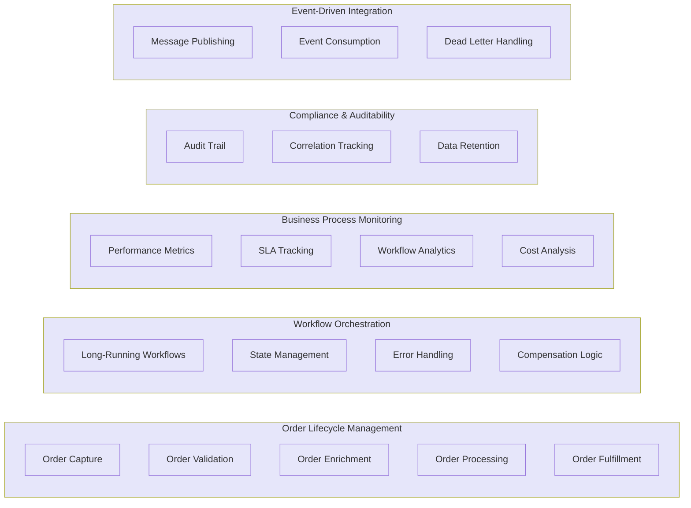

#### Value Stream Map

```mermaid
flowchart LR
    VS1[Customer Places Order] --> VS2[Order Validated]
    VS2 --> VS3[Event Published to Service Bus]
    VS3 --> VS4[Workflow Triggered]
    VS4 --> VS5[Order Enriched]
    VS5 --> VS6[Order Persisted to Cosmos DB]
    VS6 --> VS7[Fulfillment Initiated]
    VS7 --> VS8[Customer Notified]
    
    style VS1 fill:#E6E6FA
    style VS2 fill:#E6E6FA
    style VS3 fill:#E6E6FA
    style VS4 fill:#E6E6FA
    style VS5 fill:#E6E6FA
    style VS6 fill:#E6E6FA
    style VS7 fill:#E6E6FA
    style VS8 fill:#E6E6FA
```

---

### Data Architecture

#### Purpose

The Data Architecture layer defines how order data, workflow state, and monitoring telemetry flow through the system. It ensures data consistency through Cosmos DB hierarchical partitioning, enables event-driven integration via Service Bus, and provides comprehensive observability through centralized telemetry collection.

#### Key Capabilities

- **Master Data Management**: Single source of truth for order data in Cosmos DB with optimized partition keys
- **Event Streaming**: Real-time order events via Service Bus topics with subscriptions for workflow processing
- **Telemetry Collection**: Distributed traces, metrics, and logs via OpenTelemetry SDK exported to Application Insights
- **Workflow State Persistence**: Durable execution state stored in Azure Storage with checkpoint recovery
- **Hierarchical Partitioning**: Cosmos DB partition keys (`/tenantId/customerId`) to overcome 20 GB logical partition limits

#### Process

Orders submitted via API are persisted to Cosmos DB with hierarchical partition keys for query optimization. Events are published to Service Bus topics with message TTL and dead-letter handling. Logic Apps workflows consume events, enrich orders, and update Cosmos DB. All operations emit W3C Trace Context headers that flow through Application Insights for correlation and distributed tracing analysis.

#### Master Data Management (MDM)

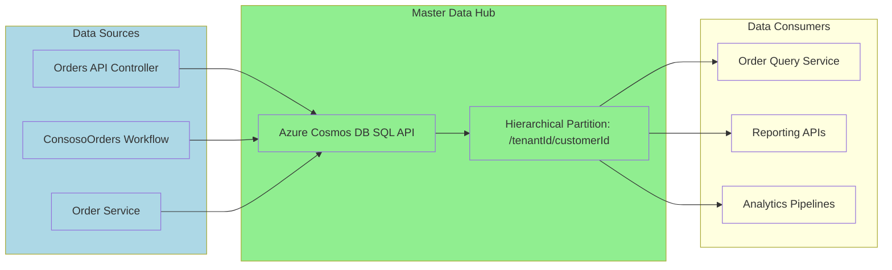

#### Event-Driven Data Topology

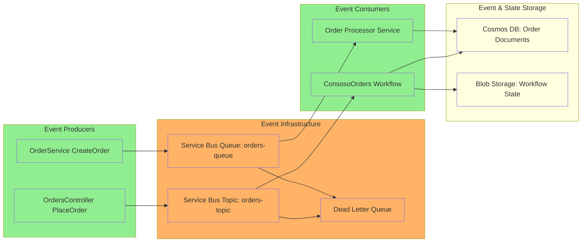

#### Monitoring Dataflow

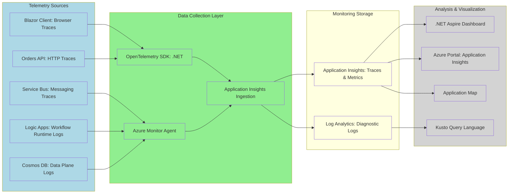

---

### Application Architecture

#### Purpose

The Application Architecture layer defines the microservices, APIs, workflows, and integration patterns that implement business capabilities. It emphasizes event-driven communication with asynchronous message processing, comprehensive distributed tracing across service boundaries, and containerized deployment for portability and scalability.

#### Key Capabilities

- **RESTful Order Management API**: ASP.NET Core Web API with OpenAPI (Swagger) documentation and CRUD operations
- **Interactive Web Application**: Blazor WebAssembly client with OpenTelemetry browser instrumentation
- **Serverless Workflow Orchestration**: Logic Apps Standard for stateful, long-running business processes (18-36 months)
- **Asynchronous Message Processing**: Service Bus-triggered workflows with guaranteed delivery and retry policies
- **Service-to-Service Integration**: HTTP and messaging-based patterns with W3C Trace Context propagation

#### Process

Blazor clients submit orders to the REST API via HTTP POST. The API validates requests, persists to Cosmos DB, and publishes events to Service Bus topics. Logic Apps workflows consume messages from queues/subscriptions, execute business logic, enrich data, and update order state. All operations are correlated via trace IDs that flow through Application Insights for end-to-end visibility.

#### Microservices Architecture

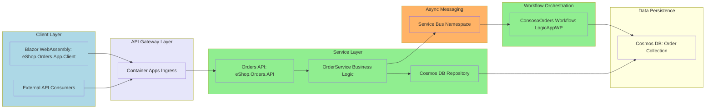

#### Event-Driven Architecture (Topology)

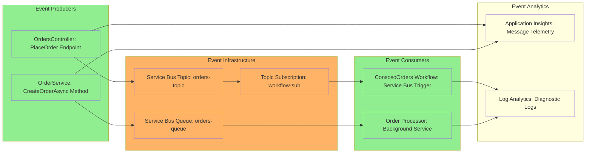

#### Event-Driven Architecture (State Transitions)

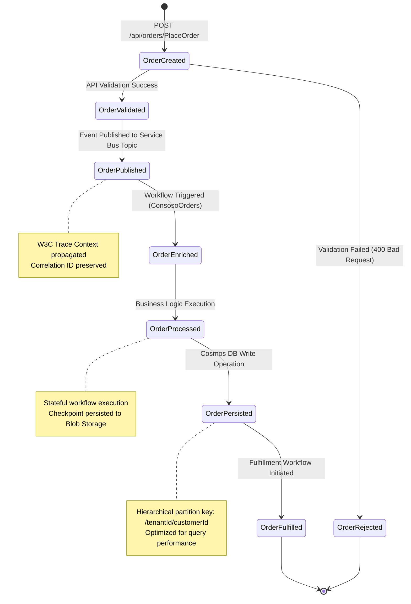

---

### Technology Architecture

#### Purpose

The Technology Architecture layer defines the cloud-native platform components, container orchestration, serverless execution environments, and platform engineering capabilities that support the solution. It provides elastic scaling, managed services for reduced operational overhead, and comprehensive observability across all infrastructure layers.

#### Key Capabilities

- **Elastic Serverless Compute**: Logic Apps Standard on App Service Plan WS1 with 3-20 instance auto-scaling
- **Container Orchestration**: Azure Container Apps for microservices hosting with built-in ingress and scaling
- **Managed Identity & RBAC**: User-assigned managed identity with granular role assignments eliminating credential management
- **Enterprise Messaging**: Azure Service Bus Standard tier with topics, queues, and dead-letter handling
- **Globally Distributed Database**: Cosmos DB SQL API with hierarchical partition keys and single-digit millisecond latency
- **Unified Observability**: Application Insights, Log Analytics, and .NET Aspire Dashboard with OpenTelemetry integration

#### Process

Infrastructure is deployed via Azure Bicep templates with modular architecture (monitoring, identity, messaging, workload). Applications run in Azure Container Apps (for APIs) or Logic Apps Standard (for workflows). Managed identities authenticate to Service Bus, Cosmos DB, and Storage without credentials. OpenTelemetry SDKs collect telemetry from all layers and export to Application Insights for unified correlation and analysis.

#### Cloud-Native Architecture

```mermaid
flowchart LR
    subgraph Clients[Client Tier]
        style Clients fill:#ADD8E6
        CL1[Blazor WASM: Browser Runtime]
    end
    
    subgraph Gateway[API Gateway & CDN]
        style Gateway fill:#E6E6FA
        GW1[Container Apps Environment]
        GW2[HTTP Ingress Controller]
    end
    
    subgraph Services[Service Tier]
        style Services fill:#90EE90
        SVC1[Orders API: Container Instance]
        SVC2[OrderService: Business Logic]
    end
    
    subgraph Messaging[Event Bus]
        style Messaging fill:#FFB366
        MSG1[Service Bus Namespace]
        MSG2[Topics: orders-topic]
        MSG3[Queues: orders-queue]
    end
    
    subgraph Workflows[Serverless Tier]
        style Workflows fill:#90EE90
        WF1[Logic Apps Standard: ConsosoOrders]
        WF2[App Service Plan WS1: 3-20 Instances]
    end
    
    subgraph Data[Data Tier]
        style Data fill:#FFFFE0
        DB1[Cosmos DB SQL API]
        DB2[Hierarchical Partition Keys]
        CACHE1[Integrated Cache]
    end
    
    subgraph Observability[Observability Stack]
        style Observability fill:#D3D3D3
        OBS1[Application Insights]
        OBS2[Log Analytics Workspace]
        OBS3[.NET Aspire Dashboard]
        OBS4[Azure Monitor Workbooks]
    end
    
    subgraph Security[Security & Identity]
        style Security fill:#D3D3D3
        SEC1[User-Assigned Managed Identity]
        SEC2[RBAC Role Assignments]
        SEC3[Key Vault: Secrets]
    end
    
    CL1 --> GW1
    GW1 --> GW2
    GW2 --> SVC1
    SVC1 --> SVC2
    SVC2 --> MSG1
    MSG1 --> MSG2
    MSG1 --> MSG3
    MSG2 --> WF1
    MSG3 --> WF1
    WF1 --> WF2
    WF1 --> DB1
    SVC2 --> DB1
    DB1 --> DB2
    DB1 --> CACHE1
    SVC1 --> OBS1
    WF1 --> OBS2
    OBS1 --> OBS3
    OBS2 --> OBS3
    OBS1 --> OBS4
    SVC1 --> SEC1
    WF1 --> SEC1
    SEC1 --> SEC2
    SEC2 --> MSG1
    SEC2 --> DB1
    SEC2 --> SEC3
    
    style CL1 fill:#ADD8E6
    style GW1 fill:#E6E6FA
    style GW2 fill:#E6E6FA
    style SVC1 fill:#90EE90
    style SVC2 fill:#90EE90
    style MSG1 fill:#FFB366
    style MSG2 fill:#FFB366
    style MSG3 fill:#FFB366
    style WF1 fill:#90EE90
    style WF2 fill:#90EE90
    style DB1 fill:#FFFFE0
    style DB2 fill:#FFFFE0
    style CACHE1 fill:#FFFFE0
    style OBS1 fill:#D3D3D3
    style OBS2 fill:#D3D3D3
    style OBS3 fill:#D3D3D3
    style OBS4 fill:#D3D3D3
    style SEC1 fill:#D3D3D3
    style SEC2 fill:#D3D3D3
    style SEC3 fill:#D3D3D3
```

#### Container-Based Architecture

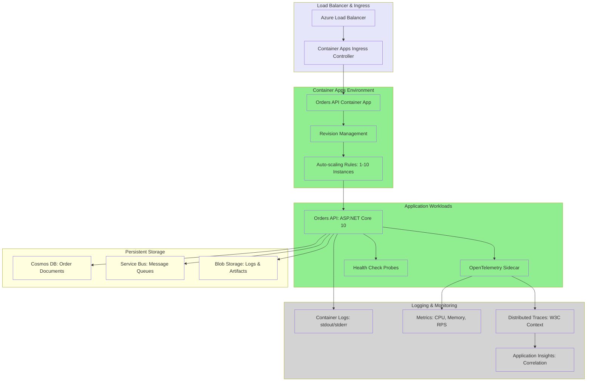

#### Serverless Architecture

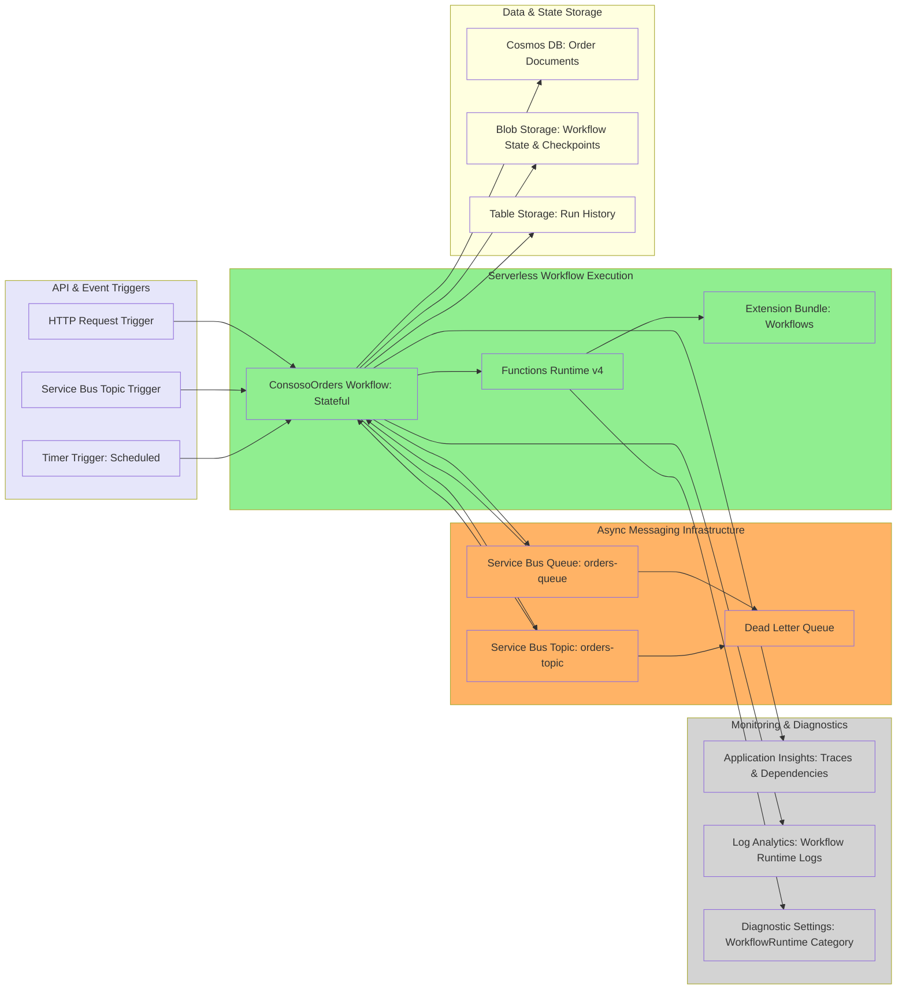

#### Platform Engineering

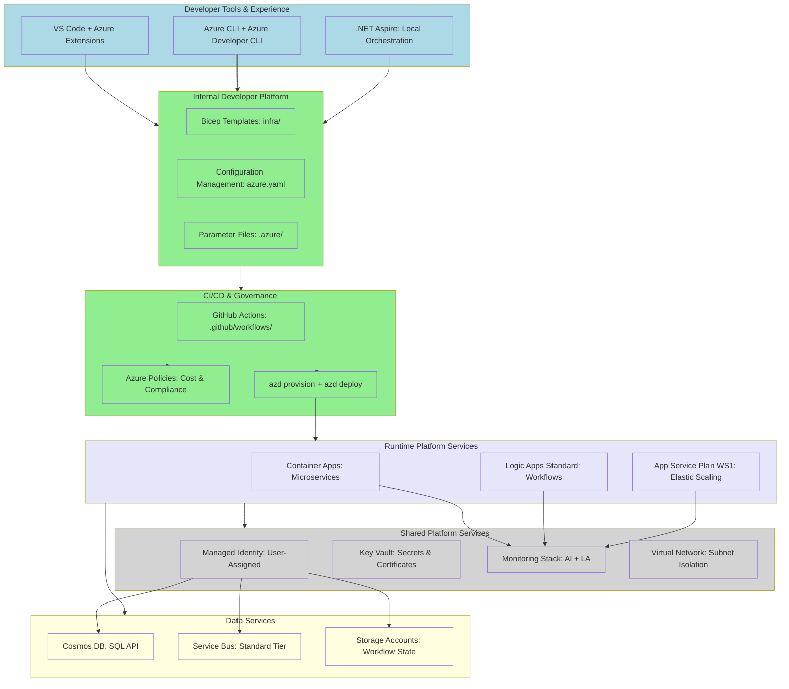

---

## Prerequisites

### Required Tools

| Tool | Minimum Version | Purpose | Download Link |
|------|-----------------|---------|---------------|
| **Azure CLI** | 2.50.0 | Azure resource management and authentication | [Install Azure CLI](https://docs.microsoft.com/cli/azure/install-azure-cli) |
| **.NET SDK** | 10.0 | Build and run .NET applications and Aspire AppHost | [Download .NET 10](https://dotnet.microsoft.com/download/dotnet/10.0) |
| **Azure Developer CLI (azd)** | 1.5.0 | Infrastructure provisioning and deployment automation | [Install azd](https://learn.microsoft.com/azure/developer/azure-developer-cli/install-azd) |
| **Visual Studio Code** | Latest | IDE for development and Azure resource management | [Download VS Code](https://code.visualstudio.com/) |
| **Docker Desktop** | Latest | Container runtime for local development | [Download Docker](https://www.docker.com/products/docker-desktop) |

### Recommended VS Code Extensions

| Extension ID | Extension Name | Purpose |
|--------------|----------------|---------|
| `ms-azuretools.vscode-azureresourcegroups` | Azure Resources | Browse and manage Azure resources directly from VS Code |
| `ms-azuretools.vscode-azurelogicapps` | Azure Logic Apps (Standard) | Create, edit, and deploy Logic Apps Standard workflows |
| `ms-azuretools.vscode-cosmosdb` | Azure Cosmos DB | Query and manage Cosmos DB databases, containers, and items |
| `ms-azuretools.vscode-bicep` | Bicep | Authoring support for Azure Bicep with IntelliSense |
| `ms-dotnettools.csdevkit` | C# Dev Kit | C# language support with debugging and testing |
| `ms-azuretools.vscode-azurefunctions` | Azure Functions | Local debugging and deployment of Functions/Logic Apps |

### Azure Subscription Requirements

- **Active Azure subscription** with sufficient quota for:
  - Logic Apps Standard with App Service Plan WS1 (minimum 3 instances)
  - Azure Container Apps Environment with managed environment
  - Azure Cosmos DB account (SQL API) with minimum 400 RU/s
  - Azure Service Bus namespace (Standard tier) with topics and queues
  - Application Insights and Log Analytics workspace
- **Permissions**: Contributor or Owner role at subscription or resource group level
- **Resource Providers**: Ensure the following are registered:
  - `Microsoft.Web` (for App Service Plan and Logic Apps)
  - `Microsoft.App` (for Container Apps)
  - `Microsoft.DocumentDB` (for Cosmos DB)
  - `Microsoft.ServiceBus` (for Service Bus)
  - `Microsoft.OperationalInsights` (for Log Analytics)
  - `Microsoft.Insights` (for Application Insights)

---

## Azure RBAC Roles

The following Azure role-based access control (RBAC) roles are required for deployment and runtime operation. Managed identities are assigned these roles automatically during infrastructure provisioning.

| Role Name | Description | Scope | Documentation Link |
|-----------|-------------|-------|-------------------|
| **Owner** | Full access to manage all resources and assign roles | Subscription or Resource Group | [Built-in roles](https://learn.microsoft.com/azure/role-based-access-control/built-in-roles#owner) |
| **Contributor** | Manage all resources except role assignments | Resource Group | [Built-in roles](https://learn.microsoft.com/azure/role-based-access-control/built-in-roles#contributor) |
| **Azure Service Bus Data Owner** | Full access to Service Bus namespaces, topics, queues | Service Bus Namespace | [Service Bus RBAC](https://learn.microsoft.com/azure/service-bus-messaging/service-bus-managed-service-identity#azure-built-in-roles-for-azure-service-bus) |
| **Azure Service Bus Data Sender** | Send messages to queues and topics | Service Bus Namespace | [Service Bus RBAC](https://learn.microsoft.com/azure/service-bus-messaging/service-bus-managed-service-identity#azure-built-in-roles-for-azure-service-bus) |
| **Azure Service Bus Data Receiver** | Receive and complete messages from queues/subscriptions | Service Bus Namespace | [Service Bus RBAC](https://learn.microsoft.com/azure/service-bus-messaging/service-bus-managed-service-identity#azure-built-in-roles-for-azure-service-bus) |
| **Cosmos DB Built-in Data Contributor** | Read, write, delete items in Cosmos DB SQL API containers | Cosmos DB Account | [Cosmos DB RBAC](https://learn.microsoft.com/azure/cosmos-db/how-to-setup-rbac#built-in-role-definitions) |
| **Cosmos DB Account Reader Role** | Read Cosmos DB account metadata (not data) | Cosmos DB Account | [Cosmos DB RBAC](https://learn.microsoft.com/azure/cosmos-db/role-based-access-control) |
| **Storage Blob Data Contributor** | Read, write, delete blobs (required for Logic Apps state) | Storage Account | [Storage RBAC](https://learn.microsoft.com/azure/role-based-access-control/built-in-roles#storage-blob-data-contributor) |
| **Storage Blob Data Owner** | Full access to blob containers and data including ACLs | Storage Account | [Storage RBAC](https://learn.microsoft.com/azure/role-based-access-control/built-in-roles#storage-blob-data-owner) |
| **Monitoring Contributor** | Write monitoring data and manage alert rules | Resource Group | [Monitoring RBAC](https://learn.microsoft.com/azure/role-based-access-control/built-in-roles#monitoring-contributor) |
| **Monitoring Reader** | Read all monitoring data (metrics, logs, alerts) | Resource Group | [Monitoring RBAC](https://learn.microsoft.com/azure/role-based-access-control/built-in-roles#monitoring-reader) |
| **Application Insights Component Contributor** | Manage Application Insights components | Application Insights | [AI RBAC](https://learn.microsoft.com/azure/azure-monitor/app/resources-roles-access-control) |
| **Log Analytics Contributor** | Read all monitoring data and edit settings | Log Analytics Workspace | [LA RBAC](https://learn.microsoft.com/azure/role-based-access-control/built-in-roles#log-analytics-contributor) |

---

## Deployment Instructions

### 1. Clone the Repository

```bash
git clone https://github.com/Evilazaro/Azure-LogicApps-Monitoring.git
cd Azure-LogicApps-Monitoring
```

### 2. Authenticate with Azure

```bash
# Login to Azure CLI
az login

# Set the target subscription (replace with your subscription ID)
az account set --subscription "<your-subscription-id>"

# Login to Azure Developer CLI
azd auth login
```

Verify your authentication:

```bash
az account show
```

### 3. Initialize Azure Developer Environment

```bash
azd init
```

When prompted, provide:
- **Environment name**: Unique identifier (e.g., `prod`, `staging`, `dev`)
  - This becomes the `envName` parameter in Bicep templates
  - Used to generate unique resource names with `uniqueString()`
- **Azure subscription**: Select your target subscription from the list
- **Azure region**: Choose deployment region (e.g., `eastus`, `westeurope`, `centralus`)

The command creates a `.azure/<environment-name>` directory with configuration files.

### 4. Configure Environment Variables (Optional)

Edit `.azure/<environment-name>/.env` to customize deployment parameters:

```bash
# Solution name (default: "orders")
AZURE_SOLUTION_NAME=orders

# Environment name (already set by azd init)
AZURE_ENV_NAME=prod

# Azure location (already set by azd init)
AZURE_LOCATION=eastus

# Log Analytics retention days (default: 30)
AZURE_LOG_ANALYTICS_RETENTION_DAYS=90
```

### 5. Provision Infrastructure

Deploy the complete infrastructure stack:

```bash
azd provision
```

This command executes the following Bicep modules in order:

1. **Resource Group**: Creates `rg-<solution>-<env>-<location>`
2. **Monitoring Module** (main.bicep):
   - Log Analytics workspace with diagnostic settings
   - Application Insights with connection string output
3. **Workload Module** (main.bicep):
   - **Identity**: User-assigned managed identity with RBAC assignments
   - **Messaging**: Service Bus namespace with topics (`orders-topic`) and queues (`orders-queue`)
   - **Services**: Container Registry and Container Apps Environment
   - **Workflows**: Logic Apps Standard with App Service Plan WS1 (3-20 instances)
   - **Storage**: Workflow state storage account with blob containers

Deployment typically takes 8-12 minutes.

### 6. Deploy Application Code

Deploy the Orders API, Blazor client, and Logic Apps workflows:

```bash
azd deploy
```

This command:
1. Builds .NET 10 projects (`eShop.Orders.API`, `eShop.Orders.App`, `eShop.Orders.App.Client`)
2. Packages Logic Apps workflows from `LogicAppWP/ConsosoOrders`
3. Deploys containers to Azure Container Apps
4. Deploys workflows to Logic Apps Standard via ZIP deployment
5. Configures application settings with connection strings and managed identity

### 7. Verify Deployment

Check deployment status:

```bash
azd show
```

List all deployed resources:

```bash
az resource list \
  --resource-group rg-orders-prod-eastus \
  --output table \
  --query "[].{Name:name, Type:type, Location:location}"
```

### 8. Access Application Endpoints

Retrieve the Orders API endpoint:

```bash
az containerapp show \
  --name ca-orders-api-<unique-suffix> \
  --resource-group rg-orders-prod-eastus \
  --query properties.configuration.ingress.fqdn \
  --output tsv
```

Retrieve the Logic Apps workflow endpoint:

```bash
az logicapp show \
  --name orders-<unique-suffix>-logicapp \
  --resource-group rg-orders-prod-eastus \
  --query defaultHostName \
  --output tsv
```

Access the Application Insights resource:

```bash
az monitor app-insights component show \
  --app orders-<unique-suffix>-ai \
  --resource-group rg-orders-prod-eastus \
  --query appId \
  --output tsv
```

### 9. Configure Diagnostic Settings (Optional)

Enable diagnostic logs for Logic Apps workflows:

```bash
# Get the Logic App resource ID
LOGICAPP_ID=$(az logicapp show \
  --name orders-<unique-suffix>-logicapp \
  --resource-group rg-orders-prod-eastus \
  --query id --output tsv)

# Get the Log Analytics workspace ID
WORKSPACE_ID=$(az monitor log-analytics workspace show \
  --workspace-name orders-<unique-suffix>-la \
  --resource-group rg-orders-prod-eastus \
  --query id --output tsv)

# Create diagnostic setting
az monitor diagnostic-settings create \
  --name workflow-diagnostics \
  --resource $LOGICAPP_ID \
  --workspace $WORKSPACE_ID \
  --logs '[{"category":"WorkflowRuntime","enabled":true},{"category":"FunctionExecutionLogs","enabled":true}]' \
  --metrics '[{"category":"AllMetrics","enabled":true}]'
```

---

## Usage Examples

### Placing an Order via REST API

Submit an order using curl:

```bash
# Get the Orders API endpoint
API_ENDPOINT=$(az containerapp show \
  --name ca-orders-api-<unique-suffix> \
  --resource-group rg-orders-prod-eastus \
  --query properties.configuration.ingress.fqdn \
  --output tsv)

# Place an order
curl -X POST https://$API_ENDPOINT/api/orders/PlaceOrder \
  -H "Content-Type: application/json" \
  -d '{
    "id": "ORD-12345",
    "date": "2024-01-15T10:30:00Z",
    "quantity": 5,
    "total": 299.99,
    "message": "Customer order via API"
  }'
```

Expected response:

```json
{
  "id": "ORD-12345",
  "date": "2024-01-15T10:30:00Z",
  "quantity": 5,
  "total": 299.99,
  "message": "Customer order via API",
  "status": "Created",
  "timestamp": "2024-01-15T10:30:05Z"
}
```

### Retrieving Orders

```bash
# Get all orders
curl https://$API_ENDPOINT/api/orders

# Get specific order by ID
curl https://$API_ENDPOINT/api/orders/ORD-12345
```

### Updating an Order

```bash
curl -X PUT https://$API_ENDPOINT/api/orders/ORD-12345 \
  -H "Content-Type: application/json" \
  -d '{
    "id": "ORD-12345",
    "date": "2024-01-15T10:30:00Z",
    "quantity": 10,
    "total": 599.99,
    "message": "Updated order quantity"
  }'
```

### Deleting an Order

```bash
curl -X DELETE https://$API_ENDPOINT/api/orders/ORD-12345
```

### Monitoring with .NET Aspire Dashboard

Run the solution locally with Aspire orchestration:

```bash
cd eShopOrders.AppHost
dotnet run
```

The Aspire Dashboard launches automatically at `http://localhost:15888` (or the port displayed in console output).

Dashboard features:
- **Resources**: View all running services (API, workflows, Service Bus, Cosmos DB)
- **Console Logs**: Real-time logs from all services with filtering
- **Structured Logs**: Query structured logs with log levels and properties
- **Traces**: Distributed traces with operation timeline and dependency visualization
- **Metrics**: Live metrics (request rate, duration, error rate) with time-series charts

### Viewing Distributed Traces in Application Insights

1. Navigate to the Azure Portal
2. Open the Application Insights resource (`orders-<unique-suffix>-ai`)
3. Select **Transaction Search** from the left menu
4. Filter by:
   - **Operation Name**: `POST /api/orders/PlaceOrder`
   - **Time Range**: Last 24 hours
5. Click on a transaction to view the end-to-end trace:
   - Browser → API → Service Bus → Logic Apps → Cosmos DB

### Analyzing Application Map

View service dependencies and performance:

1. In Application Insights, select **Application Map**
2. Observe connections between:
   - Blazor Client → Orders API
   - Orders API → Service Bus
   - Orders API → Cosmos DB
   - Service Bus → Logic Apps
   - Logic Apps → Cosmos DB
3. Click on connections to see:
   - Average response time
   - Failure rate
   - Request volume

---

## Monitoring and Observability

### Azure Portal Monitoring

#### Application Insights Overview

1. Navigate to **Application Insights** resource
2. Select **Overview** to view:
   - Failed requests (5xx errors)
   - Server response time (average and P95)
   - Server requests (requests per minute)
   - Availability (uptime percentage)

#### Performance Analysis

1. Select **Performance** from the left menu
2. Analyze operation durations:
   - `POST /api/orders/PlaceOrder` → Target < 500ms
   - `GET /api/orders/{id}` → Target < 100ms
   - Cosmos DB queries → Target < 50ms
3. Identify slow dependencies:
   - Service Bus send operations
   - Cosmos DB write operations
   - HTTP calls to external services

#### Failure Analysis

1. Select **Failures** from the left menu
2. Group failures by:
   - **Exception type**: Identify recurring exceptions
   - **Operation name**: Pinpoint failing endpoints
   - **Dependency name**: Isolate external service failures
3. Drill into failed requests to view:
   - Exception stack traces
   - Request headers and body
   - Distributed trace timeline

### Kusto Queries for Logic Apps Workflow Monitoring

#### Query 1: Workflow Run Success Rate (Last 24 Hours)

```kql
AzureDiagnostics
| where Category == "WorkflowRuntime"
| where TimeGenerated > ago(24h)
| where resource_workflowName_s == "ConsosoOrders"
| summarize 
    TotalRuns = count(),
    SuccessfulRuns = countif(status_s == "Succeeded"),
    FailedRuns = countif(status_s == "Failed"),
    RunningRuns = countif(status_s == "Running")
| extend SuccessRate = round((SuccessfulRuns * 100.0) / TotalRuns, 2)
| project TotalRuns, SuccessfulRuns, FailedRuns, RunningRuns, SuccessRate
```

**Purpose**: Calculate workflow success rate for SLA monitoring and alerting.

#### Query 2: Workflow Duration Analysis (Percentiles)

```kql
AzureDiagnostics
| where Category == "WorkflowRuntime"
| where status_s == "Succeeded"
| where resource_workflowName_s == "ConsosoOrders"
| extend DurationSeconds = todouble(endTime_t - startTime_t) / 1000.0
| summarize 
    AvgDuration = avg(DurationSeconds),
    P50Duration = percentile(DurationSeconds, 50),
    P95Duration = percentile(DurationSeconds, 95),
    P99Duration = percentile(DurationSeconds, 99),
    MaxDuration = max(DurationSeconds),
    MinDuration = min(DurationSeconds)
| project 
    AvgDuration = round(AvgDuration, 2),
    P50Duration = round(P50Duration, 2),
    P95Duration = round(P95Duration, 2),
    P99Duration = round(P99Duration, 2),
    MaxDuration = round(MaxDuration, 2),
    MinDuration = round(MinDuration, 2)
```

**Purpose**: Identify performance degradation and optimize workflow actions.

#### Query 3: Failed Workflows with Error Details

```kql
AzureDiagnostics
| where Category == "WorkflowRuntime"
| where status_s == "Failed"
| where TimeGenerated > ago(7d)
| where resource_workflowName_s == "ConsosoOrders"
| extend ErrorCode = tostring(error_code_s)
| extend ErrorMessage = tostring(error_message_s)
| extend WorkflowRunId = tostring(resource_runId_s)
| project 
    TimeGenerated,
    WorkflowRunId,
    ErrorCode,
    ErrorMessage,
    resource_actionName_s
| order by TimeGenerated desc
| take 50
```

**Purpose**: Root cause analysis for failed workflow executions.

#### Query 4: Workflow Throughput Over Time (Hourly Bins)

```kql
AzureDiagnostics
| where Category == "WorkflowRuntime"
| where TimeGenerated > ago(24h)
| where resource_workflowName_s == "ConsosoOrders"
| summarize WorkflowRuns = count() by bin(TimeGenerated, 1h), status_s
| render timechart
```

**Purpose**: Visualize workflow execution patterns and identify peak load periods.

#### Query 5: Service Bus Message Processing Latency

```kql
dependencies
| where type == "Azure Service Bus"
| where timestamp > ago(24h)
| where name contains "orders-queue" or name contains "orders-topic"
| extend MessageLatency = duration
| summarize 
    AvgLatency = avg(MessageLatency),
    P50Latency = percentile(MessageLatency, 50),
    P95Latency = percentile(MessageLatency, 95),
    MaxLatency = max(MessageLatency),
    MessageCount = count()
    by name
| project 
    QueueOrTopic = name,
    AvgLatencyMs = round(AvgLatency, 2),
    P50LatencyMs = round(P50Latency, 2),
    P95LatencyMs = round(P95Latency, 2),
    MaxLatencyMs = round(MaxLatency, 2),
    MessageCount
| order by P95LatencyMs desc
```

**Purpose**: Monitor message delivery latency and identify Service Bus bottlenecks.

#### Query 6: End-to-End Distributed Trace (Specific Operation)

```kql
union requests, dependencies
| where timestamp > ago(1h)
| where operation_Id == "<specific-operation-id-from-trace>"
| project 
    timestamp,
    itemType,
    name,
    duration,
    success,
    resultCode,
    operation_Id,
    operation_ParentId,
    cloud_RoleName
| order by timestamp asc
```

**Purpose**: Debug specific transactions by reconstructing the complete call chain.

**Usage**: Copy `operation_Id` from Application Insights Transaction Search and replace `<specific-operation-id-from-trace>`.

#### Query 7: Cosmos DB Request Units (RU) Consumption Analysis

```kql
AzureDiagnostics
| where Category == "DataPlaneRequests"
| where TimeGenerated > ago(24h)
| where databaseName_s == "OrdersDB"
| extend RUCharge = todouble(requestCharge_s)
| summarize 
    TotalRU = sum(RUCharge),
    AvgRU = avg(RUCharge),
    P95RU = percentile(RUCharge, 95),
    MaxRU = max(RUCharge),
    RequestCount = count()
    by bin(TimeGenerated, 1h), collectionName_s, operationType_s
| order by TimeGenerated desc, TotalRU desc
```

**Purpose**: Optimize Cosmos DB RU allocation and identify expensive queries.

#### Query 8: Logic Apps Action-Level Performance

```kql
AzureDiagnostics
| where Category == "WorkflowRuntime"
| where resource_actionName_s != ""
| where resource_workflowName_s == "ConsosoOrders"
| extend ActionDuration = todouble(endTime_t - startTime_t) / 1000.0
| summarize 
    AvgDuration = avg(ActionDuration),
    P95Duration = percentile(ActionDuration, 95),
    MaxDuration = max(ActionDuration),
    ExecutionCount = count(),
    FailureCount = countif(status_s == "Failed")
    by resource_actionName_s
| extend FailureRate = round((FailureCount * 100.0) / ExecutionCount, 2)
| order by P95Duration desc
| take 20
```

**Purpose**: Identify slow workflow actions that require optimization or refactoring.

#### Query 9: Correlation ID Tracking Across Services

```kql
union requests, dependencies, traces
| where timestamp > ago(1h)
| where customDimensions.CorrelationId == "<correlation-id>"
| project 
    timestamp,
    itemType,
    operation_Name,
    name,
    duration,
    success,
    cloud_RoleName,
    message,
    severityLevel
| order by timestamp asc
```

**Purpose**: Track a specific business transaction across all services using custom correlation IDs.

**Usage**: Replace `<correlation-id>` with the correlation ID from your order or transaction.

#### Query 10: App Service Plan Resource Utilization

```kql
AzureMetrics
| where ResourceProvider == "MICROSOFT.WEB"
| where TimeGenerated > ago(24h)
| where MetricName in ("CpuPercentage", "MemoryPercentage", "HttpQueueLength")
| summarize 
    AvgValue = avg(Average),
    MaxValue = max(Maximum),
    MinValue = min(Minimum)
    by bin(TimeGenerated, 15m), MetricName
| render timechart
```

**Purpose**: Monitor App Service Plan (WS1) resource consumption to inform scaling decisions.

#### Query 11: Service Bus Dead Letter Queue Analysis

```kql
AzureDiagnostics
| where Category == "OperationalLogs"
| where ResourceProvider == "MICROSOFT.SERVICEBUS"
| where TimeGenerated > ago(7d)
| where Status == "DeadLetter"
| extend DeadLetterReason = tostring(properties_DeadLetterReason_s)
| extend DeadLetterErrorDescription = tostring(properties_DeadLetterErrorDescription_s)
| summarize 
    DeadLetterCount = count(),
    UniqueReasons = dcount(DeadLetterReason)
    by DeadLetterReason, DeadLetterErrorDescription
| order by DeadLetterCount desc
```

**Purpose**: Identify recurring message processing failures requiring remediation.

#### Query 12: OpenTelemetry Trace Spans with Custom Attributes

```kql
AppDependencies
| where timestamp > ago(1h)
| where customDimensions has "OrderId"
| extend OrderId = tostring(customDimensions.OrderId)
| extend TenantId = tostring(customDimensions.TenantId)
| extend CustomerId = tostring(customDimensions.CustomerId)
| project 
    timestamp,
    operation_Id,
    operation_Name,
    name,
    type,
    target,
    duration,
    success,
    OrderId,
    TenantId,
    CustomerId
| order by timestamp desc
```

**Purpose**: Query traces with custom business attributes for detailed transaction analysis.

### Logic Apps Workflow Monitoring Best Practices

#### 1. Enable Diagnostic Settings

Configure comprehensive diagnostic logs for Logic Apps Standard:

```bash
# Enable diagnostic settings for Logic Apps
az monitor diagnostic-settings create \
  --name workflow-diagnostics \
  --resource <logic-app-resource-id> \
  --workspace <log-analytics-workspace-id> \
  --logs '[
    {"category":"WorkflowRuntime","enabled":true,"retentionPolicy":{"enabled":true,"days":90}},
    {"category":"FunctionExecutionLogs","enabled":true,"retentionPolicy":{"enabled":true,"days":30}}
  ]' \
  --metrics '[
    {"category":"AllMetrics","enabled":true,"retentionPolicy":{"enabled":true,"days":30}}
  ]'
```

**Key categories to enable**:
- **WorkflowRuntime**: Workflow execution events, action results, run status
- **FunctionExecutionLogs**: Functions runtime logs, host diagnostics
- **AllMetrics**: Performance metrics (duration, throughput, failures)

**Reference**: [Configure diagnostic settings for Logic Apps](https://learn.microsoft.com/azure/logic-apps/monitor-logic-apps-log-analytics)

#### 2. Implement Structured Logging with Custom Properties

Emit structured logs with consistent business context:

```csharp
// In OrdersController.cs
_logger.LogInformation(
    "Order created successfully. OrderId: {OrderId}, TenantId: {TenantId}, CustomerId: {CustomerId}, CorrelationId: {CorrelationId}",
    order.Id,
    order.TenantId,
    order.CustomerId,
    Activity.Current?.TraceId.ToString()
);
```

**Benefits**:
- Enables filtering and grouping in Kusto queries
- Provides business context for troubleshooting
- Facilitates correlation across distributed traces

#### 3. Configure Alert Rules for Proactive Monitoring

Set up Azure Monitor alert rules for critical scenarios:

**Workflow Failure Rate Alert**:

```bash
az monitor metrics alert create \
  --name workflow-failure-rate-alert \
  --resource-group rg-orders-prod-eastus \
  --scopes <logic-app-resource-id> \
  --condition "avg Percentage of WorkflowRunsCompleted > 95" \
  --window-size 5m \
  --evaluation-frequency 1m \
  --description "Alert when workflow failure rate exceeds 5%"
```

**High Latency Alert**:

```bash
az monitor metrics alert create \
  --name workflow-high-latency-alert \
  --resource-group rg-orders-prod-eastus \
  --scopes <logic-app-resource-id> \
  --condition "avg WorkflowRunDuration > 5000" \
  --window-size 15m \
  --evaluation-frequency 5m \
  --description "Alert when P95 workflow duration exceeds 5 seconds"
```

**Reference**: [Create metric alerts](https://learn.microsoft.com/azure/azure-monitor/alerts/alerts-create-new-alert-rule)

#### 4. Use Correlation IDs for End-to-End Tracing

Propagate correlation IDs across all service boundaries:

**API Controller**:

```csharp
// In OrdersController.cs - CorrelationIdMiddleware
var correlationId = httpContext.Request.Headers["X-Correlation-ID"].FirstOrDefault()
    ?? Activity.Current?.TraceId.ToString()
    ?? Guid.NewGuid().ToString();

Activity.Current?.SetTag("correlation.id", correlationId);
httpContext.Items["CorrelationId"] = correlationId;
```

**Service Bus Message**:

```csharp
// In OrderService.cs
var message = new ServiceBusMessage(JsonSerializer.Serialize(order))
{
    CorrelationId = Activity.Current?.TraceId.ToString(),
    ApplicationProperties =
    {
        ["OrderId"] = order.Id,
        ["TenantId"] = order.TenantId
    }
};
```

**Reference**: [W3C Trace Context](https://www.w3.org/TR/trace-context/)

#### 5. Monitor Business Metrics Alongside Technical Metrics

Track business KPIs in addition to system metrics:

**Custom Metrics**:

```csharp
// Track business metrics with Application Insights
_telemetryClient.TrackMetric(
    "OrderValue",
    order.Total,
    new Dictionary<string, string>
    {
        ["TenantId"] = order.TenantId,
        ["CustomerId"] = order.CustomerId
    }
);

_telemetryClient.TrackEvent(
    "OrderPlaced",
    new Dictionary<string, string>
    {
        ["OrderId"] = order.Id,
        ["Channel"] = "API"
    },
    new Dictionary<string, double>
    {
        ["OrderValue"] = order.Total,
        ["Quantity"] = order.Quantity
    }
);
```

**Kusto Query for Business Metrics**:

```kql
customMetrics
| where name == "OrderValue"
| where timestamp > ago(24h)
| summarize 
    TotalRevenue = sum(value),
    AvgOrderValue = avg(value),
    OrderCount = count()
    by bin(timestamp, 1h)
| render timechart
```

#### 6. Leverage Application Insights Application Map

Use Application Map to visualize dependencies and health:

1. Navigate to **Application Insights** → **Application Map**
2. Review service topology:
   - Client → API → Service Bus → Logic Apps → Cosmos DB
3. Identify bottlenecks by:
   - Red nodes = High failure rate
   - Orange connections = Slow dependencies
   - Thickness = Request volume
4. Click on connections to drill into:
   - Sample requests
   - Failure examples
   - Performance distribution

**Reference**: [Application Map overview](https://learn.microsoft.com/azure/azure-monitor/app/app-map)

#### 7. Optimize Cosmos DB Partition Keys for Query Performance

Use hierarchical partition keys to overcome logical partition limits:

**Partition Key Strategy**:

```json
{
  "partitionKey": {
    "paths": [
      "/tenantId",
      "/customerId"
    ],
    "kind": "MultiHash",
    "version": 2
  }
}
```

**Benefits**:
- Overcomes 20 GB logical partition limit
- Enables targeted multi-partition queries
- Improves query performance with partition key predicates

**Monitoring Query**:

```kql
AzureDiagnostics
| where Category == "DataPlaneRequests"
| where collectionName_s == "Orders"
| extend PartitionKeyValue = tostring(partitionKey_s)
| summarize 
    RequestCount = count(),
    AvgRU = avg(todouble(requestCharge_s)),
    TotalRU = sum(todouble(requestCharge_s))
    by PartitionKeyValue
| order by TotalRU desc
| take 20
```

**Reference**: [Hierarchical partition keys](https://learn.microsoft.com/azure/cosmos-db/hierarchical-partition-keys)

#### 8. Implement Retry Policies with Exponential Backoff

Configure resilient retry policies for transient failures:

**Service Bus Retry Policy** (in [`host.json`](host.json)):

```json
{
  "version": "2.0",
  "extensions": {
    "serviceBus": {
      "prefetchCount": 100,
      "maxConcurrentCalls": 32,
      "autoCompleteMessages": false,
      "maxAutoLockRenewalDuration": "00:05:00",
      "clientRetryOptions": {
        "mode": "Exponential",
        "tryTimeout": "00:01:00",
        "delay": "00:00:01",
        "maxDelay": "00:00:30",
        "maxRetries": 3
      }
    }
  }
}
```

**HTTP Client Retry Policy**:

```csharp
// In ServiceDefaults/Extensions.cs
services.AddHttpClient("orders-api")
    .AddStandardResilienceHandler(options =>
    {
        options.Retry.MaxRetryAttempts = 3;
        options.Retry.BackoffType = DelayBackoffType.Exponential;
        options.Retry.UseJitter = true;
    });
```

**Reference**: [Retry guidance for Azure services](https://learn.microsoft.com/azure/architecture/best-practices/retry-service-specific)

#### 9. Scale Based on Telemetry and Load Patterns

Configure auto-scaling rules based on observed metrics:

**App Service Plan Auto-Scale Rule**:

```bash
az monitor autoscale create \
  --resource-group rg-orders-prod-eastus \
  --resource <app-service-plan-id> \
  --min-count 3 \
  --max-count 20 \
  --count 3

# Scale out rule: CPU > 70% for 5 minutes
az monitor autoscale rule create \
  --resource-group rg-orders-prod-eastus \
  --autoscale-name <autoscale-name> \
  --condition "Percentage CPU > 70 avg 5m" \
  --scale out 2

# Scale in rule: CPU < 30% for 10 minutes
az monitor autoscale rule create \
  --resource-group rg-orders-prod-eastus \
  --autoscale-name <autoscale-name> \
  --condition "Percentage CPU < 30 avg 10m" \
  --scale in 1
```

**Reference**: [Autoscale in Azure](https://learn.microsoft.com/azure/azure-monitor/autoscale/autoscale-overview)

#### 10. Review Azure Advisor Recommendations

Regularly review Azure Advisor for cost, performance, and reliability improvements:

1. Navigate to **Azure Advisor** in Azure Portal
2. Review recommendations by category:
   - **Reliability**: High availability configurations
   - **Security**: RBAC and network security
   - **Performance**: SKU sizing and caching
   - **Cost**: Underutilized resources
   - **Operational Excellence**: Monitoring and diagnostics
3. Implement high-priority recommendations
4. Track recommendation impact in Azure Monitor

**Reference**: [Azure Advisor overview](https://learn.microsoft.com/azure/advisor/advisor-overview)

---

## Microsoft Learn References

### Azure Logic Apps Standard

- [What is Azure Logic Apps?](https://learn.microsoft.com/azure/logic-apps/logic-apps-overview)
- [Single-tenant versus multi-tenant Azure Logic Apps](https://learn.microsoft.com/azure/logic-apps/single-tenant-overview-compare)
- [Create stateful or stateless workflows](https://learn.microsoft.com/azure/logic-apps/create-single-tenant-workflows-azure-portal)
- [Monitor Logic Apps](https://learn.microsoft.com/azure/logic-apps/monitor-logic-apps)
- [Monitor Logic Apps with Log Analytics](https://learn.microsoft.com/azure/logic-apps/monitor-logic-apps-log-analytics)
- [Edit host and app settings for Logic Apps](https://learn.microsoft.com/azure/logic-apps/edit-app-settings-host-settings)
- [Limits and configuration reference](https://learn.microsoft.com/azure/logic-apps/logic-apps-limits-and-config)
- [Managed connectors for Azure Logic Apps](https://learn.microsoft.com/azure/connectors/managed)
- [Secure access and data in Azure Logic Apps](https://learn.microsoft.com/azure/logic-apps/logic-apps-securing-a-logic-app)

### Azure Monitor & Application Insights

- [Azure Monitor overview](https://learn.microsoft.com/azure/azure-monitor/overview)
- [Application Insights overview](https://learn.microsoft.com/azure/azure-monitor/app/app-insights-overview)
- [Application Insights for ASP.NET Core applications](https://learn.microsoft.com/azure/azure-monitor/app/asp-net-core)
- [OpenTelemetry overview](https://learn.microsoft.com/azure/azure-monitor/app/opentelemetry-overview)
- [Enable Azure Monitor OpenTelemetry for .NET applications](https://learn.microsoft.com/azure/azure-monitor/app/opentelemetry-enable)
- [Distributed tracing and telemetry correlation](https://learn.microsoft.com/azure/azure-monitor/app/distributed-tracing-telemetry-correlation)
- [Application Map in Application Insights](https://learn.microsoft.com/azure/azure-monitor/app/app-map)
- [Transaction diagnostics](https://learn.microsoft.com/azure/azure-monitor/app/transaction-diagnostics)
- [Log queries in Azure Monitor](https://learn.microsoft.com/azure/azure-monitor/logs/log-query-overview)
- [Kusto Query Language (KQL) overview](https://learn.microsoft.com/azure/data-explorer/kusto/query/)

### Azure Well-Architected Framework

- [Microsoft Azure Well-Architected Framework](https://learn.microsoft.com/azure/well-architected/)
- [Operational excellence pillar](https://learn.microsoft.com/azure/well-architected/operational-excellence/)
- [Monitoring and diagnostics guidance](https://learn.microsoft.com/azure/well-architected/operational-excellence/monitoring)
- [Health modeling for workloads](https://learn.microsoft.com/azure/well-architected/operational-excellence/observability)
- [Performance efficiency pillar](https://learn.microsoft.com/azure/well-architected/performance-efficiency/)
- [Reliability pillar](https://learn.microsoft.com/azure/well-architected/reliability/)
- [Cost optimization pillar](https://learn.microsoft.com/azure/well-architected/cost-optimization/)

### Azure Cosmos DB

- [Azure Cosmos DB overview](https://learn.microsoft.com/azure/cosmos-db/introduction)
- [Partitioning and horizontal scaling](https://learn.microsoft.com/azure/cosmos-db/partitioning-overview)
- [Hierarchical partition keys](https://learn.microsoft.com/azure/cosmos-db/hierarchical-partition-keys)
- [Request units in Azure Cosmos DB](https://learn.microsoft.com/azure/cosmos-db/request-units)
- [Optimize request costs](https://learn.microsoft.com/azure/cosmos-db/optimize-cost-reads-writes)
- [Role-based access control in Azure Cosmos DB](https://learn.microsoft.com/azure/cosmos-db/role-based-access-control)
- [Monitor Azure Cosmos DB](https://learn.microsoft.com/azure/cosmos-db/monitor-cosmos-db)
- [Diagnostic queries for troubleshooting](https://learn.microsoft.com/azure/cosmos-db/nosql/diagnostic-queries)

### Azure Service Bus

- [Azure Service Bus messaging overview](https://learn.microsoft.com/azure/service-bus-messaging/service-bus-messaging-overview)
- [Service Bus queues, topics, and subscriptions](https://learn.microsoft.com/azure/service-bus-messaging/service-bus-queues-topics-subscriptions)
- [Dead-letter queues overview](https://learn.microsoft.com/azure/service-bus-messaging/service-bus-dead-letter-queues)
- [Service Bus performance best practices](https://learn.microsoft.com/azure/service-bus-messaging/service-bus-performance-improvements)
- [Authenticate with managed identities](https://learn.microsoft.com/azure/service-bus-messaging/service-bus-managed-service-identity)

### Azure Container Apps

- [Azure Container Apps overview](https://learn.microsoft.com/azure/container-apps/overview)
- [Microservices with Azure Container Apps](https://learn.microsoft.com/azure/container-apps/microservices)
- [Scaling in Azure Container Apps](https://learn.microsoft.com/azure/container-apps/scale-app)
- [Monitor logs in Azure Container Apps](https://learn.microsoft.com/azure/container-apps/logging)
- [Manage revisions in Azure Container Apps](https://learn.microsoft.com/azure/container-apps/revisions)

### .NET Aspire

- [.NET Aspire overview](https://learn.microsoft.com/dotnet/aspire/get-started/aspire-overview)
- [.NET Aspire dashboard](https://learn.microsoft.com/dotnet/aspire/fundamentals/dashboard/overview)
- [.NET Aspire orchestration overview](https://learn.microsoft.com/dotnet/aspire/fundamentals/app-host-overview)
- [Service defaults in .NET Aspire](https://learn.microsoft.com/dotnet/aspire/fundamentals/service-defaults)
- [.NET Aspire integrations](https://learn.microsoft.com/dotnet/aspire/fundamentals/integrations-overview)
- [Azure integrations for .NET Aspire](https://learn.microsoft.com/dotnet/aspire/azure/overview)
- [Deploy .NET Aspire apps to Azure Container Apps](https://learn.microsoft.com/dotnet/aspire/deployment/azure/aca-deployment)

### Azure Developer CLI (azd)

- [Azure Developer CLI overview](https://learn.microsoft.com/azure/developer/azure-developer-cli/overview)
- [Install Azure Developer CLI](https://learn.microsoft.com/azure/developer/azure-developer-cli/install-azd)
- [Make your project compatible with azd](https://learn.microsoft.com/azure/developer/azure-developer-cli/make-azd-compatible)
- [Azure Developer CLI reference](https://learn.microsoft.com/azure/developer/azure-developer-cli/reference)

### Infrastructure as Code (Bicep)

- [What is Bicep?](https://learn.microsoft.com/azure/azure-resource-manager/bicep/overview)
- [Bicep file structure](https://learn.microsoft.com/azure/azure-resource-manager/bicep/file)
- [Bicep modules](https://learn.microsoft.com/azure/azure-resource-manager/bicep/modules)
- [Bicep best practices](https://learn.microsoft.com/azure/azure-resource-manager/bicep/best-practices)
- [Deploy Bicep files with Azure CLI](https://learn.microsoft.com/azure/azure-resource-manager/bicep/deploy-cli)

### Azure Identity & RBAC

- [What is Azure role-based access control (RBAC)?](https://learn.microsoft.com/azure/role-based-access-control/overview)
- [Azure built-in roles](https://learn.microsoft.com/azure/role-based-access-control/built-in-roles)
- [What are managed identities for Azure resources?](https://learn.microsoft.com/entra/identity/managed-identities-azure-resources/overview)
- [How to use managed identities](https://learn.microsoft.com/entra/identity/managed-identities-azure-resources/how-to-use-vm-sign-in)
- [Assign Azure roles using Azure CLI](https://learn.microsoft.com/azure/role-based-access-control/role-assignments-cli)

### Performance & Scalability

- [Performance efficiency patterns](https://learn.microsoft.com/azure/well-architected/performance-efficiency/performance-efficiency-patterns)
- [Autoscaling guidance](https://learn.microsoft.com/azure/architecture/best-practices/auto-scaling)
- [Retry pattern](https://learn.microsoft.com/azure/architecture/patterns/retry)
- [Circuit breaker pattern](https://learn.microsoft.com/azure/architecture/patterns/circuit-breaker)
- [Throttling pattern](https://learn.microsoft.com/azure/architecture/patterns/throttling)

### OpenTelemetry Standards

- [OpenTelemetry official documentation](https://opentelemetry.io/docs/)
- [W3C Trace Context specification](https://www.w3.org/TR/trace-context/)
- [OpenTelemetry semantic conventions](https://opentelemetry.io/docs/specs/semconv/)

---

## Additional Resources

- **Sample Code Repository**: [Azure-LogicApps-Monitoring](https://github.com/Evilazaro/Azure-LogicApps-Monitoring)
- **Azure Architecture Center**: [Enterprise integration with Logic Apps](https://learn.microsoft.com/azure/architecture/reference-architectures/enterprise-integration/queues-events)
- **Azure SDK for .NET**: [Overview](https://learn.microsoft.com/dotnet/azure/sdk/azure-sdk-for-dotnet)
- **Azure Community Support**: [Microsoft Q&A](https://learn.microsoft.com/answers/tags/133/azure)

---

**Last Updated**: December 17, 2025  
**Maintained By**: Evilazaro  
**Repository**: [Azure-LogicApps-Monitoring](https://github.com/Evilazaro/Azure-LogicApps-Monitoring)  
**Branch**: refactor/aspire