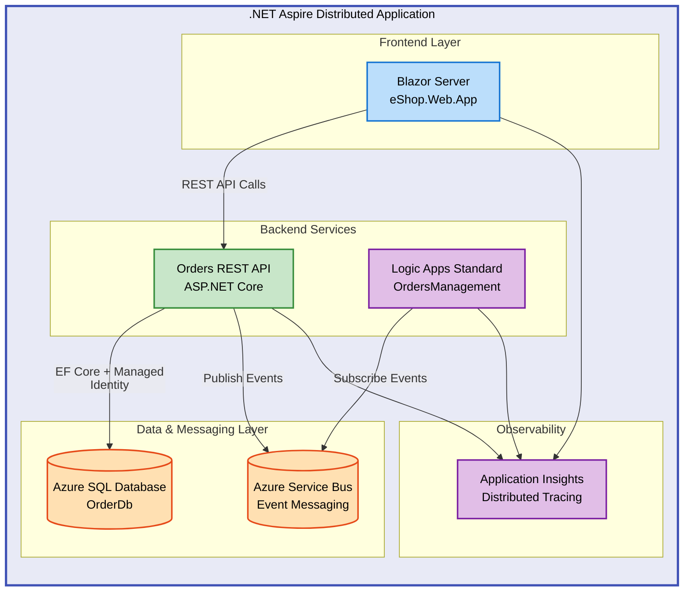

# Azure Logic Apps Monitoring Solution


A comprehensive monitoring and orchestration solution for Azure Logic Apps Standard using .NET Aspire, featuring distributed order management with Application Insights observability, Azure Service Bus messaging, and Azure SQL Database integration.

## 📑 Table of Contents

- [Quick Start](#-quick-start)
- [Architecture](#-architecture)
- [Features](#-features)
- [Prerequisites](#-prerequisites)
- [Installation](#-installation)
- [Configuration](#-configuration)
- [Usage](#-usage)
- [API Documentation](#-api-documentation)
- [Deployment](#-deployment)
- [Development](#-development)
- [Monitoring](#-monitoring)
- [Troubleshooting](#-troubleshooting)
- [Contributing](#-contributing)
- [License](#-license)

## 🚀 Quick Start

```bash
# Clone the repository
git clone https://github.com/Evilazaro/Azure-LogicApps-Monitoring.git
cd Azure-LogicApps-Monitoring

# Restore dependencies and build
dotnet restore
dotnet build

# Run with .NET Aspire AppHost
dotnet run --project app.AppHost
```

> 💡 **Tip**: The AppHost dashboard will open automatically at `http://localhost:15888` showing all service health and telemetry.

## 🏗️ Architecture



**Key Components**:

- **eShop.Web.App**: Blazor Server frontend with FluentUI for order management
- **eShop.Orders.API**: REST API with OpenAPI/Swagger documentation
- **OrdersManagement Logic App**: Event-driven workflows for order processing
- **Azure SQL Database**: Relational data store with managed identity authentication
- **Azure Service Bus**: Reliable messaging for event-driven architecture
- **Application Insights**: End-to-end distributed tracing and monitoring

## ✨ Features

- 🚀 **.NET Aspire Orchestration** - Simplified local development and cloud deployment
- 🔒 **Managed Identity** - Passwordless authentication for Azure resources
- 📊 **Distributed Tracing** - Application Insights integration with OpenTelemetry
- 🔄 **Event-Driven Architecture** - Azure Service Bus for reliable messaging
- 📝 **OpenAPI Documentation** - Swagger UI for API exploration
- 🏥 **Health Checks** - Built-in health monitoring for all services
- 🧪 **Comprehensive Testing** - Unit and integration tests for all components

## 📋 Prerequisites

> ⚠️ **Prerequisites**: Ensure all requirements are installed before proceeding with installation.

- **.NET SDK**: 10.0 or later ([Download](https://dotnet.microsoft.com/download/dotnet/10.0))
- **Azure CLI**: 2.60.0 or later ([Install](https://learn.microsoft.com/cli/azure/install-azure-cli))
- **Azure Developer CLI**: 1.11.0 or later ([Install](https://learn.microsoft.com/azure/developer/azure-developer-cli/install-azd))
- **Docker Desktop**: For local development ([Install](https://www.docker.com/products/docker-desktop))
- **Azure Subscription**: With permissions to create resources
- **Visual Studio Code**: Recommended with C# Dev Kit extension

## 📦 Installation

### Local Development Setup

1. **Clone the repository**:

```bash
git clone https://github.com/Evilazaro/Azure-LogicApps-Monitoring.git
cd Azure-LogicApps-Monitoring
```

2. **Verify .NET SDK version**:

```bash
dotnet --version
# Should output: 10.0.100 or later
```

3. **Restore NuGet packages**:

```bash
dotnet restore
```

4. **Build the solution**:

```bash
dotnet build
```

5. **Run with .NET Aspire AppHost**:

```bash
dotnet run --project app.AppHost
```

The Aspire dashboard opens automatically at `http://localhost:15888` showing service health, logs, and traces.

### Azure Deployment

1. **Authenticate with Azure**:

```bash
azd auth login
```

2. **Initialize environment**:

```bash
azd env new <environment-name>
```

3. **Provision infrastructure and deploy**:

```bash
azd up
```

> 💡 **Tip**: Use `azd up --help` to see additional deployment options like specifying location or subscription.

## ⚙️ Configuration

### Local Settings

Configure local development in [`local.settings.json`](workflows/OrdersManagement/OrdersManagementLogicApp/local.settings.json):

```json
{
  "IsEncrypted": false,
  "Values": {
    "APP_KIND": "workflowapp",
    "WORKFLOWS_TENANT_ID": "${AZURE_TENANT_ID}",
    "WORKFLOWS_SUBSCRIPTION_ID": "${AZURE_SUBSCRIPTION_ID}",
    "WORKFLOWS_RESOURCE_GROUP_NAME": "${AZURE_RESOURCE_GROUP}",
    "WORKFLOWS_LOCATION_NAME": "${AZURE_LOCATION}"
  }
}
```

### Azure Configuration

Infrastructure is defined in [`infra/main.bicep`](infra/main.bicep). Key parameters:

- `solutionName`: Base name prefix for resources (default: `orders`)
- `envName`: Environment identifier (`dev`, `test`, `staging`, `prod`)
- `location`: Azure region for deployment
- `deployHealthModel`: Enable Azure Monitor Health Model (default: `true`)

### Connection Strings

Connection strings are automatically configured via .NET Aspire service references. Example from [`AppHost.cs`](app.AppHost/AppHost.cs):

```csharp
var ordersDb = builder.AddSqlServer("sql")
    .AddDatabase("OrderDb");

var ordersApi = builder.AddProject<Projects.eShop_Orders_API>("orders-api")
    .WithReference(ordersDb); // Automatic connection string injection
```

## 💻 Usage

### Running the Application Locally

Start the application with .NET Aspire:

```bash
dotnet run --project app.AppHost
```

Services will be available at:

- **Aspire Dashboard**: `http://localhost:15888`
- **Orders API**: `http://localhost:5000/swagger`
- **Web App**: `http://localhost:5001`

### Creating an Order

```bash
curl -X POST http://localhost:5000/api/orders \
  -H "Content-Type: application/json" \
  -d '{
    "customerId": "customer-123",
    "items": [
      {"productId": "prod-001", "quantity": 2, "price": 29.99}
    ]
  }'
```

**Expected Response**:

```json
{
  "orderId": "order-456",
  "status": "Pending",
  "totalAmount": 59.98,
  "createdAt": "2026-02-03T10:30:00Z"
}
```

## 📖 API Documentation

The Orders API provides RESTful endpoints for order management with OpenAPI documentation.

### Base URL

- **Local**: `http://localhost:5000`
- **Azure**: `https://<container-app-url>`

### Endpoints

| Method | Endpoint           | Description              | Auth Required |
| ------ | ------------------ | ------------------------ | ------------- |
| GET    | `/api/orders`      | List all orders          | No            |
| GET    | `/api/orders/{id}` | Get order by ID          | No            |
| POST   | `/api/orders`      | Create new order         | No            |
| PUT    | `/api/orders/{id}` | Update existing order    | No            |
| DELETE | `/api/orders/{id}` | Delete order             | No            |
| GET    | `/health`          | Health check endpoint    | No            |
| GET    | `/swagger`         | OpenAPI documentation UI | No            |

### Example: Get Order by ID

```bash
curl http://localhost:5000/api/orders/order-456
```

**Response**:

```json
{
  "orderId": "order-456",
  "customerId": "customer-123",
  "status": "Completed",
  "items": [
    {
      "productId": "prod-001",
      "quantity": 2,
      "price": 29.99,
      "lineTotal": 59.98
    }
  ],
  "totalAmount": 59.98,
  "createdAt": "2026-02-03T10:30:00Z",
  "updatedAt": "2026-02-03T10:35:00Z"
}
```

> 📝 **Note**: Full API documentation with request/response schemas is available at `/swagger` when running the application.

## 🚀 Deployment

### Deploy to Azure with azd

```bash
# Authenticate with Azure
azd auth login

# Create new environment
azd env new production

# Set environment variables (optional)
azd env set AZURE_LOCATION eastus

# Deploy infrastructure and applications
azd up
```

### CI/CD Pipeline

The repository includes GitHub Actions workflows for automated deployment:

- **Workflow Path**: `.github/workflows/deploy.yml` (if present)
- **Trigger**: Push to `main` branch or manual dispatch
- **Steps**: Build → Test → Deploy to Azure Container Apps

> ⚠️ **Security**: Ensure GitHub secrets are configured for `AZURE_CREDENTIALS` and `AZURE_SUBSCRIPTION_ID`.

## 🛠️ Development

### Project Structure

```plaintext
├── app.AppHost/              # .NET Aspire orchestration host
├── app.ServiceDefaults/      # Shared service configuration
├── src/
│   ├── eShop.Orders.API/     # REST API service
│   └── eShop.Web.App/        # Blazor Server frontend
├── workflows/
│   └── OrdersManagement/     # Logic Apps Standard workflows
├── infra/                    # Bicep infrastructure templates
│   ├── main.bicep            # Main infrastructure definition
│   └── workload/             # Service-specific resources
└── hooks/                    # Deployment lifecycle scripts
```

### Running Tests

```bash
# Run all tests
dotnet test

# Run tests with coverage
dotnet test /p:CollectCoverage=true

# Run specific test project
dotnet test src/tests/eShop.Orders.API.Tests
```

### Database Migrations

The Orders API uses Entity Framework Core for data access:

```bash
# Create new migration
dotnet ef migrations add <MigrationName> --project src/eShop.Orders.API

# Apply migrations
dotnet ef database update --project src/eShop.Orders.API
```

> 💡 **Tip**: Migrations are automatically applied during application startup in development environments.

## 📊 Monitoring

### Application Insights

All services automatically send telemetry to Application Insights:

- **Distributed Traces**: View request flows across services
- **Metrics**: Monitor performance counters and custom metrics
- **Logs**: Centralized logging from all components
- **Live Metrics**: Real-time application health dashboard

Access Application Insights in Azure Portal:

```bash
az monitor app-insights component show \
  --resource-group <resource-group-name> \
  --app <app-insights-name>
```

### Health Checks

Health check endpoints are available at:

- **Orders API**: `http://localhost:5000/health`
- **Web App**: `http://localhost:5001/health`

**Response Example**:

```json
{
  "status": "Healthy",
  "checks": {
    "OrderDb": "Healthy",
    "ServiceBus": "Healthy"
  }
}
```

## 🐛 Troubleshooting

### Common Issues

**Issue**: Application fails to start with database connection error

**Solution**: Ensure SQL Server is running and connection string is correct:

```bash
# Verify SQL Server connection
dotnet ef database update --project src/eShop.Orders.API
```

**Issue**: Azure deployment fails with permission errors

**Solution**: Verify your Azure account has Contributor role:

```bash
az role assignment list --assignee $(az account show --query user.name -o tsv)
```

**Issue**: Service Bus connection fails locally

**Solution**: Ensure Service Bus emulator is configured or use Azure Service Bus with connection string in `local.settings.json`.

> 💡 **Tip**: Check the Aspire dashboard logs at `http://localhost:15888` for detailed error information.

## 🤝 Contributing

Contributions are welcome! Please follow these guidelines:

1. Fork the repository
2. Create a feature branch: `git checkout -b feature/your-feature`
3. Commit changes: `git commit -m 'Add your feature'`
4. Push to branch: `git push origin feature/your-feature`
5. Open a Pull Request

Please ensure all tests pass and code follows existing style conventions.

## 📝 License

This project is licensed under the MIT License. See the [`LICENSE`](LICENSE) file for details.

```plaintext
MIT License

Copyright (c) 2025 Evilázaro Alves

Permission is hereby granted, free of charge, to any person obtaining a copy
of this software and associated documentation files...
```

For the full license text, see [`LICENSE`](LICENSE).
