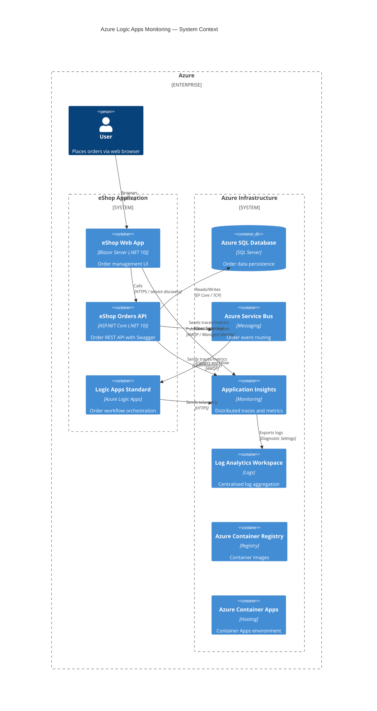

# Azure Logic Apps Monitoring Solution

[](https://github.com/Evilazaro/Azure-LogicApps-Monitoring/actions)
[](https://dotnet.microsoft.com/en-us/download/dotnet/10.0)
[](https://learn.microsoft.com/azure/logic-apps/logic-apps-overview)
[](./LICENSE)
[](https://learn.microsoft.com/azure/developer/azure-developer-cli/)

A production-ready, end-to-end monitoring solution for **Azure Logic Apps Standard** built on **.NET Aspire**. It demonstrates enterprise observability patterns — distributed tracing, structured logging, Application Insights integration, and Azure Service Bus messaging — across a microservices architecture deployed to **Azure Container Apps**.

---

## Table of Contents

- [Features](#features)
- [Architecture](#architecture)
- [Prerequisites](#prerequisites)
- [Quick Start](#quick-start)
- [Project Structure](#project-structure)
- [Services](#services)
- [Infrastructure](#infrastructure)
- [Configuration](#configuration)
- [Deployment](#deployment)
- [Contributing](#contributing)
- [License](#license)

---

## Features

**Overview**

This solution provides a complete reference implementation for monitoring Azure Logic Apps Standard workflows using native Azure observability tooling. It covers the full stack — from a Blazor frontend through a REST API, a Logic Apps workflow engine, and backing Azure services — all orchestrated with .NET Aspire.

| Feature                   | Description                                                                                     | Status    |
| ------------------------- | ----------------------------------------------------------------------------------------------- | --------- |
| .NET Aspire Orchestration | AppHost-based local/cloud orchestration with service discovery                                  | ✅ Stable |
| Orders REST API           | ASP.NET Core Web API with Swagger/OpenAPI, EF Core + Azure SQL                                  | ✅ Stable |
| Blazor Web App            | Microsoft Fluent UI frontend for order placement and monitoring                                 | ✅ Stable |
| Logic Apps Standard       | Order workflow orchestration with Service Bus trigger                                           | ✅ Stable |
| Application Insights      | Distributed tracing, dependency tracking, and custom telemetry                                  | ✅ Stable |
| Azure Service Bus         | Message-based decoupling between API and Logic Apps                                             | ✅ Stable |
| Managed Identity          | Passwordless authentication for all Azure service connections                                   | ✅ Stable |
| Infrastructure as Code    | Bicep templates for full Azure infrastructure (Container Apps, SQL, Service Bus, Log Analytics) | ✅ Stable |
| azd Integration           | One-command provision and deploy via Azure Developer CLI                                        | ✅ Stable |
| VNet Integration          | Container Apps and Logic Apps connected via private subnet                                      | ✅ Stable |

---

## Architecture



### Component Overview

```
app/
├── app.AppHost/            # .NET Aspire orchestration host
├── app.ServiceDefaults/    # Shared service configuration & common types
├── src/
│   ├── eShop.Orders.API/   # Orders REST API (ASP.NET Core)
│   └── eShop.Web.App/      # Blazor Server frontend
├── workflows/
│   └── OrdersManagement/   # Azure Logic Apps Standard workflow
└── infra/                  # Bicep IaC templates
    ├── shared/             # Identity, monitoring, networking, SQL
    └── workload/           # Container Apps, Service Bus, Logic Apps
```

---

## Prerequisites

| Tool                                                                                                     | Minimum Version | Purpose                             |
| -------------------------------------------------------------------------------------------------------- | --------------- | ----------------------------------- |
| [.NET SDK](https://dotnet.microsoft.com/download/dotnet/10.0)                                            | 10.0            | Build and run the application       |
| [Azure Developer CLI (azd)](https://learn.microsoft.com/azure/developer/azure-developer-cli/install-azd) | 1.11.0          | Provision and deploy to Azure       |
| [Azure CLI](https://learn.microsoft.com/cli/azure/install-azure-cli)                                     | 2.60.0          | Azure authentication and management |
| [Bicep CLI](https://learn.microsoft.com/azure/azure-resource-manager/bicep/install)                      | 0.30.0          | Compile Bicep templates             |
| [Docker Desktop](https://www.docker.com/products/docker-desktop/)                                        | Latest          | Local container support             |
| PowerShell                                                                                               | 7.0+            | Lifecycle hooks and scripts         |

Verify your workstation is ready:

```powershell
.\hooks\check-dev-workstation.ps1
```

---

## Quick Start

### 1. Clone the Repository

```bash
git clone https://github.com/Evilazaro/Azure-LogicApps-Monitoring.git
cd Azure-LogicApps-Monitoring
```

### 2. Authenticate with Azure

```bash
azd auth login
az login
```

### 3. Create a New Environment

```bash
azd env new <your-env-name>
```

### 4. Provision Infrastructure and Deploy

```bash
azd up
```

This single command will:

- Provision all Azure resources (Container Apps, SQL Database, Service Bus, Application Insights, Logic Apps)
- Build and push container images to Azure Container Registry
- Deploy all services to Azure Container Apps
- Configure managed identity access and .NET user secrets

### 5. Run Locally

```bash
# Start the .NET Aspire AppHost
dotnet run --project app.AppHost
```

The Aspire dashboard opens at `https://localhost:15888` with links to all running services.

---

## Project Structure

```
app/
├── app.sln                         # Solution file
├── azure.yaml                      # Azure Developer CLI configuration
├── global.json                     # .NET SDK version pinning
├── app.AppHost/
│   ├── AppHost.cs                  # Aspire orchestration & service wiring
│   └── infra/                      # Per-service ACA manifest templates
├── app.ServiceDefaults/
│   ├── Extensions.cs               # Shared AddServiceDefaults() extensions
│   └── CommonTypes.cs              # Shared domain types (Order, etc.)
├── src/
│   ├── eShop.Orders.API/           # Orders microservice
│   │   ├── Controllers/            # REST API endpoints
│   │   ├── Services/               # Business logic layer
│   │   ├── Repositories/           # Data access layer
│   │   ├── Migrations/             # EF Core database migrations
│   │   └── HealthChecks/           # Custom health check probes
│   └── eShop.Web.App/
│       └── Components/             # Blazor UI components (Fluent UI)
├── workflows/
│   └── OrdersManagement/
│       └── OrdersManagementLogicApp/  # Logic Apps Standard workflow definitions
├── infra/
│   ├── main.bicep                  # Root deployment (subscription scope)
│   ├── main.parameters.json        # Parameter file (azd environment variables)
│   ├── types.bicep                 # Shared type definitions
│   ├── shared/                     # Identity, monitoring, networking, SQL
│   └── workload/                   # Container Apps, Service Bus, Logic Apps
├── hooks/                          # azd lifecycle scripts (pre/post provision/deploy)
└── prompts/                        # AI prompt library for documentation and diagrams
```

---

## Services

### eShop Orders API

> `src/eShop.Orders.API`

An ASP.NET Core Web API that exposes order management endpoints.

| Endpoint           | Method   | Description              |
| ------------------ | -------- | ------------------------ |
| `/api/orders`      | `POST`   | Place a new order        |
| `/api/orders`      | `GET`    | List all orders          |
| `/api/orders/{id}` | `GET`    | Get order by ID          |
| `/api/orders/{id}` | `DELETE` | Delete an order          |
| `/health`          | `GET`    | Health check             |
| `/swagger`         | `GET`    | Swagger UI (development) |

**Key integrations:**

- **Azure SQL Database** via Entity Framework Core with connection resiliency and retry policies
- **Azure Service Bus** for publishing order events to Logic Apps
- **Application Insights** via OpenTelemetry with custom `ActivitySource` spans
- **Managed Identity** for passwordless Azure authentication

### eShop Web App

> `src/eShop.Web.App`

A Blazor Server interactive application built with **Microsoft Fluent UI** components.

- Calls the Orders API via a typed `HttpClient` with .NET Aspire service discovery
- Session management with secure cookies
- Distributed tracing with a custom `ActivitySource`

### Orders Management Logic App

> `workflows/OrdersManagement`

A **Logic Apps Standard** workflow triggered by Azure Service Bus messages.

- Connected to Service Bus and Blob Storage via API connections using **Managed Identity**
- Monitored via Application Insights with OpenTelemetry diagnostics
- Deployed to an App Service Plan (WorkflowStandard SKU with elastic scaling)
- VNet integrated for private connectivity

---

## Infrastructure

All infrastructure is defined as Bicep and deployed at **subscription scope** by `azd up`.

### Resources Deployed

| Resource                    | Type                                        | Purpose                            |
| --------------------------- | ------------------------------------------- | ---------------------------------- |
| Resource Group              | `Microsoft.Resources/resourceGroups`        | Container for all resources        |
| User Assigned Identity      | `Microsoft.ManagedIdentity`                 | Passwordless auth for all services |
| Log Analytics Workspace     | `Microsoft.OperationalInsights/workspaces`  | Centralised log aggregation        |
| Application Insights        | `Microsoft.Insights/components`             | Distributed tracing and metrics    |
| Azure SQL Server + Database | `Microsoft.Sql/servers`                     | Order persistence                  |
| Virtual Network + Subnets   | `Microsoft.Network/virtualNetworks`         | Private connectivity               |
| Azure Service Bus (Premium) | `Microsoft.ServiceBus/namespaces`           | Event messaging                    |
| Azure Container Registry    | `Microsoft.ContainerRegistry/registries`    | Container image repository         |
| Container Apps Environment  | `Microsoft.App/managedEnvironments`         | Hosting environment                |
| Container App — Orders API  | `Microsoft.App/containerApps`               | Orders service                     |
| Container App — Web App     | `Microsoft.App/containerApps`               | Frontend service                   |
| Logic App Standard          | `Microsoft.Web/sites` (kind: `workflowapp`) | Workflow orchestration             |
| Storage Account             | `Microsoft.Storage/storageAccounts`         | Logic Apps runtime storage         |

### Deployment Architecture

```
Subscription
└── Resource Group (rg-{solution}-{env}-{location})
    ├── shared/
    │   ├── identity/        User Assigned Managed Identity
    │   ├── monitoring/      Log Analytics, Application Insights
    │   ├── network/         VNet, subnets, private endpoints
    │   └── data/            Azure SQL Server and database
    └── workload/
        ├── messaging/       Azure Service Bus (Premium)
        ├── services/        Container Apps Environment, ACR
        └── logic-app.bicep  Logic Apps Standard + connections
```

---

## Configuration

Configuration is managed via `.NET User Secrets` (local development) and **Azure managed identity** (Azure deployment). The `postprovision.ps1` hook automatically populates user secrets after `azd up`.

### Key Configuration Keys

| Key                              | Description                          | Set By            |
| -------------------------------- | ------------------------------------ | ----------------- |
| `Azure:TenantId`                 | Azure AD tenant ID                   | User secret / azd |
| `Azure:ClientId`                 | Managed identity client ID           | User secret / azd |
| `Azure:ResourceGroup`            | Azure resource group name            | User secret / azd |
| `Azure:ServiceBus:HostName`      | Service Bus fully qualified hostname | User secret / azd |
| `Azure:ApplicationInsights:Name` | App Insights resource name           | User secret / azd |
| `ConnectionStrings:OrderDb`      | Azure SQL connection string          | User secret / azd |

### Environment Variables (azd)

| Variable                  | Description                                         |
| ------------------------- | --------------------------------------------------- |
| `AZURE_LOCATION`          | Azure region for deployment                         |
| `AZURE_ENV_NAME`          | Environment name (dev/test/staging/prod)            |
| `AZURE_SUBSCRIPTION_ID`   | Target subscription ID                              |
| `DEPLOYER_PRINCIPAL_TYPE` | `User` (interactive) or `ServicePrincipal` (CI/CD)  |
| `DEPLOY_HEALTH_MODEL`     | Deploy Azure Monitor health model (default: `true`) |

---

## Deployment

### Full Provision + Deploy

```bash
azd up
```

### Provision Infrastructure Only

```bash
azd provision
```

### Deploy Application Only (after infrastructure exists)

```bash
azd deploy
```

### Tear Down

```bash
azd down
```

### Generate Order Load (Testing)

```powershell
.\hooks\Generate-Orders.ps1
```

### Configure Federated Credentials (for GitHub Actions CI/CD)

```powershell
.\hooks\configure-federated-credential.ps1
```

---

## Contributing

**Overview**

Contributions are welcome. This project follows standard GitHub flow — fork, branch, commit, and open a pull request. Please ensure all prerequisites are installed and the workstation check passes before making changes.

1. Fork the repository
2. Create a feature branch: `git checkout -b feature/your-feature`
3. Make your changes, ensuring existing functionality is not broken
4. Verify local run: `dotnet run --project app.AppHost`
5. Commit with a descriptive message: `git commit -m "feat: describe your change"`
6. Push to your fork and open a pull request against `main`

---

## License

[MIT](./LICENSE) — Copyright © Evilazaro
