# 🔍 Azure Logic Apps Monitoring Solution

[](https://azure.microsoft.com/services/logic-apps/)
[](https://dotnet.microsoft.com/)
[](https://learn.microsoft.com/dotnet/aspire/)
[](LICENSE)
[](https://learn.microsoft.com/azure/developer/azure-developer-cli/)
[](https://opentelemetry.io/)

A cloud-native reference implementation demonstrating **enterprise-grade observability patterns** for Azure Logic Apps Standard workflows, built on .NET Aspire orchestration with end-to-end distributed tracing.

---

## 📋 Overview

The **Azure Logic Apps Monitoring Solution** is a cloud-native reference implementation demonstrating **enterprise-grade observability patterns** for Azure Logic Apps Standard workflows. Built on .NET Aspire orchestration with OpenTelemetry instrumentation, this solution provides end-to-end distributed tracing across all service boundaries—from user interactions through asynchronous workflow processing. It serves as both a learning resource and a production-ready template for teams building observable, event-driven applications on Azure.

The solution uses an **eShop order management system** as its business scenario, showcasing a realistic enterprise workflow: orders originate from a Blazor Server frontend, flow through an ASP.NET Core REST API for validation and persistence in Azure SQL Database, then publish events to Azure Service Bus topics for asynchronous processing by Logic Apps Standard workflows. Every step is instrumented with W3C Trace Context propagation, enabling correlation of user requests through the entire distributed system—critical for debugging, performance analysis, and compliance auditing.

What sets this reference apart is its **zero-secrets architecture** using Azure Managed Identity, **local development parity** with .NET Aspire emulators (no Azure subscription required for development), and **one-command deployment** via Azure Developer CLI (`azd`). The modular Bicep templates follow Infrastructure as Code best practices, while the TOGAF-aligned documentation provides architectural context for every design decision. Whether you're modernizing existing workflows or building greenfield event-driven systems, this solution provides battle-tested patterns you can adopt immediately.

### Why This Solution?

| Feature | Description |
|---------|-------------|
| **Reference Architecture** | Production-ready patterns for Azure Logic Apps observability |
| **End-to-End Tracing** | W3C Trace Context propagation across all service boundaries |
| **Zero Secrets** | Managed Identity authentication for all Azure services |
| **Local Development Parity** | Full-fidelity local development with .NET Aspire emulators |

---

## ✨ Key Features

- 🔭 **Full Observability Stack** - OpenTelemetry integration with Application Insights and Log Analytics
- 📨 **Event-Driven Architecture** - Azure Service Bus pub/sub with topic subscriptions
- 🔄 **Logic Apps Workflows** - Stateful workflow processing with Service Bus triggers
- 🐳 **Containerized Deployment** - Azure Container Apps with automatic scaling
- 🏗️ **Infrastructure as Code** - Modular Bicep templates with subscription-scope deployment
- 🚀 **One-Command Deployment** - Azure Developer CLI (`azd`) for streamlined provisioning
- 🔐 **Managed Identity** - Zero-secrets architecture with Entra ID authentication
- 📊 **Distributed Tracing** - Trace correlation across HTTP, SQL, and Service Bus operations

---

## 🏛️ Architecture



```mermaid
%%{init: {
  'theme': 'base',
  'themeVariables': {
    'fontSize': '14px',
    'fontFamily': 'Segoe UI, Arial, sans-serif',
    'primaryColor': '#e3f2fd',
    'primaryBorderColor': '#1565c0',
    'lineColor': '#546e7a',
    'textColor': '#212121'
  }
}}%%

flowchart TB
    %% =====================================================================
    %% TOP-LEVEL GROUPING: Runtime Environment
    %% Separates application runtime from supporting infrastructure
    %% =====================================================================

    subgraph Runtime["Runtime Environment"]
        direction TB

        %% =================================================================
        %% PRESENTATION LAYER - User-facing components
        %% Single entry point for all user interactions
        %% =================================================================
        subgraph Presentation["Presentation Layer"]
            direction LR
            WebApp["eShop.Web.App\nBlazor Server + Fluent UI"]
        end

        %% =================================================================
        %% APPLICATION LAYER - Business logic and workflow automation
        %% Grouped by responsibility: API Services vs Workflow Automation
        %% =================================================================
        subgraph Application["Application Layer"]
            direction TB

            subgraph APIServices["API Services"]
                direction LR
                API["eShop.Orders.API\nASP.NET Core Web API"]
            end

            subgraph WorkflowAutomation["Workflow Automation"]
                direction LR
                LogicApp["OrdersManagement\nLogic Apps Standard"]
            end
        end
    end

    %% =====================================================================
    %% TOP-LEVEL GROUPING: Supporting Infrastructure
    %% Platform services that enable the runtime environment
    %% =====================================================================

    subgraph Infrastructure["Supporting Infrastructure"]
        direction TB

        %% =================================================================
        %% PLATFORM LAYER - Orchestration and shared services
        %% Grouped by function: Orchestration vs Shared Libraries
        %% =================================================================
        subgraph Platform["Platform Layer"]
            direction TB

            subgraph Orchestration["Orchestration"]
                direction LR
                Aspire["app.AppHost\n.NET Aspire Orchestrator"]
            end

            subgraph SharedLibraries["Shared Libraries"]
                direction LR
                Defaults["app.ServiceDefaults\nCross-cutting Concerns"]
            end
        end

        %% =================================================================
        %% DATA LAYER - Persistence, messaging, and state management
        %% Grouped by data pattern: Persistence vs Messaging vs State
        %% =================================================================
        subgraph Data["Data Layer"]
            direction TB

            subgraph Persistence["Persistence"]
                direction LR
                SQL[("OrderDb\nAzure SQL Database")]
            end

            subgraph Messaging["Messaging"]
                direction LR
                ServiceBus[["ordersplaced\nService Bus Topic"]]
            end

            subgraph StateStore["State Store"]
                direction LR
                Storage[("Workflow State\nAzure Storage")]
            end
        end
    end

    %% =====================================================================
    %% TOP-LEVEL GROUPING: Observability Stack
    %% Monitoring and telemetry infrastructure
    %% =====================================================================

    subgraph ObservabilityStack["Observability Stack"]
        direction TB

        subgraph Observability["Observability Layer"]
            direction TB

            subgraph APM["Application Performance Monitoring"]
                direction LR
                AppInsights["Application Insights\nAPM & Distributed Tracing"]
            end

            subgraph Logging["Centralized Logging"]
                direction LR
                LogAnalytics["Log Analytics\nLog Aggregation & Analysis"]
            end
        end
    end

    %% =====================================================================
    %% DATA FLOW CONNECTIONS - Solid lines for primary data paths
    %% Follows the order processing flow from user to storage
    %% =====================================================================
    WebApp -->|"HTTP/REST"| API
    API -->|"EF Core"| SQL
    API -->|"AMQP Publish"| ServiceBus
    ServiceBus -->|"Trigger"| LogicApp
    LogicApp -->|"State Persistence"| Storage

    %% =====================================================================
    %% ORCHESTRATION CONNECTIONS - Dashed lines for control plane
    %% Shows how platform layer configures runtime components
    %% =====================================================================
    Aspire -.->|"Orchestrates"| WebApp
    Aspire -.->|"Orchestrates"| API
    Defaults -.->|"Configures"| WebApp
    Defaults -.->|"Configures"| API

    %% =====================================================================
    %% TELEMETRY CONNECTIONS - Dotted lines for observability data
    %% Shows telemetry flow from components to monitoring
    %% =====================================================================
    WebApp -.->|"OTLP Traces"| AppInsights
    API -.->|"OTLP Traces"| AppInsights
    LogicApp -.->|"Diagnostics"| LogAnalytics
    AppInsights -.->|"Log Export"| LogAnalytics

    %% =====================================================================
    %% NODE STYLE DEFINITIONS - WCAG AA compliant color palette
    %% Each layer has distinct color for visual hierarchy
    %% =====================================================================

    %% Presentation Layer - Blue theme (user interface focus)
    classDef presentationStyle fill:#e3f2fd,stroke:#1565c0,stroke-width:2px,color:#0d47a1

    %% Application Layer - Green theme (business logic focus)
    classDef applicationStyle fill:#e8f5e9,stroke:#2e7d32,stroke-width:2px,color:#1b5e20

    %% Platform Layer - Orange theme (infrastructure focus)
    classDef platformStyle fill:#fff3e0,stroke:#e65100,stroke-width:2px,color:#bf360c

    %% Data Layer - Purple theme (persistence focus)
    classDef dataStyle fill:#f3e5f5,stroke:#7b1fa2,stroke-width:2px,color:#4a148c

    %% Observability Layer - Pink theme (monitoring focus)
    classDef observabilityStyle fill:#fce4ec,stroke:#c2185b,stroke-width:2px,color:#880e4f

    %% =====================================================================
    %% APPLY STYLES TO NODES
    %% =====================================================================
    class WebApp presentationStyle
    class API,LogicApp applicationStyle
    class Aspire,Defaults platformStyle
    class SQL,ServiceBus,Storage dataStyle
    class AppInsights,LogAnalytics observabilityStyle

    %% =====================================================================
    %% SUBGRAPH GROUPING STYLES - Hierarchical visual containment
    %% Best Practice: Use semi-transparent fills for containers
    %% Level 1 (Top): Solid neutral borders, very light fills
    %% Level 2 (Middle): Layer-colored borders, transparent fills
    %% Level 3 (Inner): Dashed borders, minimal fills
    %% =====================================================================

    %% Top-level groupings - Neutral gray with subtle background
    style Runtime fill:#f5f5f5,stroke:#616161,stroke-width:2px,color:#424242
    style Infrastructure fill:#f5f5f5,stroke:#616161,stroke-width:2px,color:#424242
    style ObservabilityStack fill:#f5f5f5,stroke:#616161,stroke-width:2px,color:#424242

    %% Mid-level layer groupings - Match node color themes (semi-transparent)
    style Presentation fill:#e3f2fd33,stroke:#1565c0,stroke-width:2px,color:#0d47a1
    style Application fill:#e8f5e933,stroke:#2e7d32,stroke-width:2px,color:#1b5e20
    style Platform fill:#fff3e033,stroke:#e65100,stroke-width:2px,color:#bf360c
    style Data fill:#f3e5f533,stroke:#7b1fa2,stroke-width:2px,color:#4a148c
    style Observability fill:#fce4ec33,stroke:#c2185b,stroke-width:2px,color:#880e4f

    %% Inner-level functional groupings - Dashed borders, minimal fill
    style APIServices fill:#e8f5e911,stroke:#2e7d32,stroke-width:1px,stroke-dasharray:4 2,color:#1b5e20
    style WorkflowAutomation fill:#e8f5e911,stroke:#2e7d32,stroke-width:1px,stroke-dasharray:4 2,color:#1b5e20
    style Orchestration fill:#fff3e011,stroke:#e65100,stroke-width:1px,stroke-dasharray:4 2,color:#bf360c
    style SharedLibraries fill:#fff3e011,stroke:#e65100,stroke-width:1px,stroke-dasharray:4 2,color:#bf360c
    style Persistence fill:#f3e5f511,stroke:#7b1fa2,stroke-width:1px,stroke-dasharray:4 2,color:#4a148c
    style Messaging fill:#f3e5f511,stroke:#7b1fa2,stroke-width:1px,stroke-dasharray:4 2,color:#4a148c
    style StateStore fill:#f3e5f511,stroke:#7b1fa2,stroke-width:1px,stroke-dasharray:4 2,color:#4a148c
    style APM fill:#fce4ec11,stroke:#c2185b,stroke-width:1px,stroke-dasharray:4 2,color:#880e4f
    style Logging fill:#fce4ec11,stroke:#c2185b,stroke-width:1px,stroke-dasharray:4 2,color:#880e4f
```

> 📖 **Learn more:** See [Architecture Overview](docs/architecture/README.md) for detailed component diagrams, data flows, and design decisions.

---

## 🛠️ Technology Stack

| Category | Technology | Version | Purpose |
|----------|------------|---------|---------|
| **Runtime** | .NET | 10.0 | Application framework |
| **Orchestration** | .NET Aspire | 9.5.0 | Local development orchestration |
| **Frontend** | Blazor Server | 10.0 | Interactive web UI |
| **UI Components** | Fluent UI Blazor | 4.13.2 | Modern UI component library |
| **Backend** | ASP.NET Core | 10.0 | REST API framework |
| **ORM** | Entity Framework Core | 9.0 | Data access |
| **Messaging** | Azure Service Bus | 7.20.1 | Event-driven messaging |
| **Workflows** | Logic Apps Standard | - | Event processing automation |
| **Database** | Azure SQL Database | - | Relational data persistence |
| **Hosting** | Azure Container Apps | - | Serverless container platform |
| **Observability** | OpenTelemetry | 1.14.0 | Distributed tracing & metrics |
| **Monitoring** | Application Insights | - | APM and diagnostics |
| **IaC** | Bicep | - | Infrastructure as Code |
| **CLI** | Azure Developer CLI | - | Deployment automation |

---

## 📋 Prerequisites

This section lists the minimum requirements for local development and Azure deployment. The validation script automatically checks all prerequisites and can optionally install missing tools.

> 📚 **Complete Guide:** See [check-dev-workstation](docs/hooks/check-dev-workstation.md) for detailed validation output, exit codes, and CI/CD integration patterns.

### Required Tools

| Tool | Version | Purpose | Installation |
|------|---------|---------|--------------|
| **.NET SDK** | 10.0+ | Application framework | `winget install Microsoft.DotNet.SDK.10` |
| **PowerShell** | 7.0+ | Cross-platform scripting | `winget install Microsoft.PowerShell` |
| **Azure CLI** | 2.60.0+ | Azure resource management | `winget install Microsoft.AzureCLI` |
| **Azure Developer CLI** | Latest | Deployment automation | `winget install Microsoft.Azd` |
| **Bicep CLI** | 0.30.0+ | Infrastructure as Code | `az bicep install` |
| **Docker Desktop** | Latest | Local containers & emulators | [docker.com](https://docker.com/products/docker-desktop) |

### Optional Tools

| Tool | Version | Purpose | Installation |
|------|---------|---------|--------------|
| **Visual Studio 2022** | 17.13+ | Full IDE with debugging | [visualstudio.com](https://visualstudio.microsoft.com) |
| **VS Code** | Latest | Lightweight editor | [code.visualstudio.com](https://code.visualstudio.com) |

### Azure Requirements

| Requirement | Description |
|-------------|-------------|
| **Active Subscription** | Azure subscription with billing enabled |
| **Authentication** | Logged in via `az login` with appropriate permissions |
| **Resource Providers** | 8 providers auto-registered by [`preprovision`](docs/hooks/preprovision.md) |

The following Azure resource providers are required and automatically registered:

| Provider | Purpose |
|----------|---------|
| `Microsoft.App` | Container Apps hosting |
| `Microsoft.ServiceBus` | Event-driven messaging |
| `Microsoft.Storage` | Blob storage for Logic Apps |
| `Microsoft.Web` | Logic Apps Standard |
| `Microsoft.ContainerRegistry` | Container image registry |
| `Microsoft.Insights` | Application Insights telemetry |
| `Microsoft.OperationalInsights` | Log Analytics workspace |
| `Microsoft.ManagedIdentity` | Zero-secrets authentication |

> 📖 **Learn more:** See [preprovision](docs/hooks/preprovision.md) for auto-installation options, Azure authentication flows, and resource provider registration details.

### Validate Your Environment

Run the validation script before starting development:

```powershell
# Quick validation (read-only, ~3-5 seconds)
./hooks/check-dev-workstation.ps1

# Verbose mode for troubleshooting
./hooks/check-dev-workstation.ps1 -Verbose

# Auto-install missing prerequisites
./hooks/preprovision.ps1 -AutoInstall
```

**Example Output:**
```
[12:34:56] ✓ PowerShell 7.4.1 (required: 7.0+)
[12:34:57] ✓ .NET SDK 10.0.0 (required: 10.0+)
[12:34:58] ✓ Azure Developer CLI 1.5.0
[12:34:59] ✓ Azure CLI 2.62.0 (required: 2.60.0+)
[12:35:00] ✓ Bicep CLI 0.30.23 (required: 0.30.0+)
[12:35:01] ✓ Azure login verified
[12:35:02] ✓ All 8 resource providers registered

Validation completed successfully! ✓
Your workstation is ready for development.
```

> 📖 **Learn more:** See [Validation Workflow](docs/hooks/VALIDATION-WORKFLOW.md) for the complete validation sequence and troubleshooting guide.
```

---

## 🚀 Quick Start

This section provides streamlined instructions to get started quickly. For comprehensive workflows, troubleshooting, and advanced scenarios, refer to the detailed documentation.

> 📚 **Complete Guide:** See [Developer Inner Loop Workflow](docs/hooks/README.md) for development modes comparison, hybrid development, CI/CD integration, and troubleshooting.

### Option 1: Local Development with .NET Aspire

The fastest path for development—runs entirely on your local machine with containerized dependencies (~1 min setup, free).

```powershell
# 1. Clone the repository
git clone https://github.com/Evilazaro/Azure-LogicApps-Monitoring.git
cd Azure-LogicApps-Monitoring

# 2. Ensure Docker Desktop is running
docker ps

# 3. Run with .NET Aspire
dotnet run --project app.AppHost
```

The Aspire dashboard opens automatically at `https://localhost:17225`, providing:
- Real-time service health monitoring
- Distributed tracing visualization
- Structured logs across all services
- Container and emulator status

**What starts automatically:** SQL Server container, Service Bus emulator, database schema creation, topic/subscription setup, and OpenTelemetry tracing.

> 📖 **Learn more:** See [Local Development Workflow](docs/hooks/README.md#local-development-workflow-inner-loop) for hot reload, debugging tips, and container management.

### Option 2: Deploy to Azure

Full cloud deployment with all Azure services provisioned automatically (~10 min setup, pay-per-use).

```powershell
# 1. Authenticate with Azure
azd auth login

# 2. Initialize and deploy (creates new environment)
azd up
```

The `azd up` command automatically:
1. **Validates prerequisites** via [`preprovision`](docs/hooks/preprovision.md) hook
2. **Provisions infrastructure** with Bicep (Container Apps, SQL, Service Bus, App Insights)
3. **Configures secrets** via [`postprovision`](docs/hooks/postprovision.md) hook
4. **Sets up SQL access** via [`sql-managed-identity-config`](docs/hooks/sql-managed-identity-config.md)
5. **Generates test data** via [`Generate-Orders`](docs/hooks/Generate-Orders.md)
6. **Deploys application** to Azure Container Apps

> 📖 **Learn more:** See [Azure Deployment Workflow](docs/hooks/README.md#azure-deployment-workflow) for environment management, redeployment, and cleanup.

### Development Mode Comparison

| Mode | Database | Service Bus | Monitoring | Setup | Cost |
|------|----------|-------------|------------|-------|------|
| **Local** | SQL Server container | Emulator | Aspire Dashboard | ~1 min | Free |
| **Azure** | Azure SQL Database | Azure Service Bus | Application Insights | ~10 min | Pay-per-use |

> 📖 **Learn more:** See [Hybrid Development Mode](docs/hooks/README.md#hybrid-development-mode) for running local apps against Azure backend services.

### Validate Your Environment

Before starting, ensure all prerequisites are installed:

```powershell
# Run the validation script
./hooks/check-dev-workstation.ps1
```

> 📖 **Learn more:** See [check-dev-workstation](docs/hooks/check-dev-workstation.md) for detailed prerequisite requirements and auto-installation options.

---

## 📁 Project Structure

```
Azure-LogicApps-Monitoring/
│
├── � .github/                                    # GitHub configuration
│   └── workflows/                                 # GitHub Actions CI/CD workflows
│
├── 📂 .vscode/                                    # VS Code workspace settings
│
├── 📂 app.AppHost/                                # .NET Aspire Orchestrator
│   ├── AppHost.cs                                 # Service orchestration & resource wiring
│   ├── app.AppHost.csproj                         # Project file (Aspire.AppHost.Sdk 9.5.0)
│   ├── appsettings.json                           # Default configuration
│   ├── appsettings.Development.json               # Development overrides
│   └── Properties/
│       └── launchSettings.json                    # Debug launch profiles
│
├── 📂 app.ServiceDefaults/                        # Shared Cross-cutting Concerns
│   ├── Extensions.cs                              # OpenTelemetry, resilience, health checks
│   ├── CommonTypes.cs                             # Shared DTOs (Order, OrderProduct)
│   └── app.ServiceDefaults.csproj                 # Project file (.NET 10.0)
│
├── 📂 src/                                        # Application Source Code
│   │
│   ├── 📂 eShop.Orders.API/                       # Order Management REST API
│   │   ├── Program.cs                             # API entry point & DI configuration
│   │   ├── eShop.Orders.API.csproj                # Project file (ASP.NET Core 10.0)
│   │   ├── eShop.Orders.API.http                  # REST Client test file
│   │   ├── MIGRATION_GUIDE.md                     # Database migration guide
│   │   ├── Setup-Database.ps1                     # Database setup script
│   │   ├── appsettings.json                       # Default configuration
│   │   ├── appsettings.Development.json           # Development overrides
│   │   │
│   │   ├── Controllers/                           # API Endpoints
│   │   │   ├── OrdersController.cs                # Order CRUD operations
│   │   │   └── WeatherForecastController.cs       # Health check demo endpoint
│   │   │
│   │   ├── Services/                              # Business Logic Layer
│   │   │   ├── OrderService.cs                    # Order processing with metrics
│   │   │   └── OrdersWrapper.cs                   # Service wrapper utilities
│   │   │
│   │   ├── Handlers/                              # Message Publishing
│   │   │   ├── OrdersMessageHandler.cs            # Service Bus publisher
│   │   │   ├── NoOpOrdersMessageHandler.cs        # No-op for local dev
│   │   │   └── OrderMessageWithMetadata.cs        # Message envelope DTO
│   │   │
│   │   ├── Repositories/                          # Data Access Layer
│   │   │   └── OrderRepository.cs                 # EF Core repository
│   │   │
│   │   ├── Interfaces/                            # Abstractions
│   │   │   ├── IOrderService.cs                   # Service interface
│   │   │   ├── IOrderRepository.cs                # Repository interface
│   │   │   └── IOrdersMessageHandler.cs           # Message handler interface
│   │   │
│   │   ├── HealthChecks/                          # Custom Health Checks
│   │   │   ├── DbContextHealthCheck.cs            # SQL Database health
│   │   │   └── ServiceBusHealthCheck.cs           # Service Bus health
│   │   │
│   │   ├── Migrations/                            # EF Core Migrations
│   │   ├── data/                                  # Data context & entities
│   │   └── Properties/
│   │       └── launchSettings.json                # Debug launch profiles
│   │
│   └── 📂 eShop.Web.App/                          # Blazor Server Frontend
│       ├── Program.cs                             # Web app entry point
│       ├── eShop.Web.App.csproj                   # Project file (Blazor Server)
│       ├── appsettings.json                       # Default configuration
│       ├── appsettings.Development.json           # Development overrides
│       │
│       ├── Components/                            # Blazor Components
│       │   ├── App.razor                          # Root component
│       │   ├── Routes.razor                       # Routing configuration
│       │   ├── _Imports.razor                     # Global using directives
│       │   │
│       │   ├── Layout/                            # Layout Components
│       │   │   ├── MainLayout.razor               # Main page layout
│       │   │   ├── MainLayout.razor.css           # Layout styles
│       │   │   ├── NavMenu.razor                  # Navigation menu
│       │   │   └── NavMenu.razor.css              # Navigation styles
│       │   │
│       │   ├── Pages/                             # Page Components
│       │   │   ├── Home.razor                     # Home page
│       │   │   ├── ListAllOrders.razor            # Orders list view
│       │   │   ├── PlaceOrder.razor               # Single order form
│       │   │   ├── PlaceOrdersBatch.razor         # Batch order form
│       │   │   ├── ViewOrder.razor                # Order details view
│       │   │   ├── WeatherForecasts.razor         # Demo page
│       │   │   └── Error.razor                    # Error page
│       │   │
│       │   ├── Services/                          # Client Services
│       │   │   └── OrdersAPIService.cs            # HTTP client for Orders API
│       │   │
│       │   └── Shared/                            # Shared Components
│       │
│       ├── Shared/                                # Legacy shared components
│       │
│       ├── wwwroot/                               # Static Assets
│       │   ├── app.css                            # Application styles
│       │   ├── favicon.png                        # Site favicon
│       │   ├── css/                               # Additional stylesheets
│       │   └── lib/                               # Client-side libraries
│       │
│       └── Properties/
│           └── launchSettings.json                # Debug launch profiles
│
├── 📂 workflows/                                  # Logic Apps Standard Workflows
│   └── OrdersManagement/                          # Order Processing Workspace
│       ├── OrdersManagement.code-workspace        # VS Code workspace file
│       └── OrdersManagementLogicApp/              # Logic App Project
│           ├── host.json                          # Functions host configuration
│           ├── .funcignore                        # Functions ignore patterns
│           ├── .gitignore                         # Git ignore patterns
│           └── ProcessingOrdersPlaced/            # Workflow Definition
│               └── workflow.json                  # Stateful workflow (Service Bus trigger)
│
├── 📂 infra/                                      # Bicep Infrastructure as Code
│   ├── main.bicep                                 # Root deployment orchestrator
│   ├── main.parameters.json                       # Deployment parameters
│   ├── types.bicep                                # Shared type definitions
│   │
│   ├── data/                                      # Sample Data
│   │   └── ordersBatch.json                       # Generated test orders
│   │
│   ├── shared/                                    # Shared Infrastructure Modules
│   │   ├── main.bicep                             # Shared module orchestrator
│   │   ├── identity/
│   │   │   └── main.bicep                         # User-assigned managed identity
│   │   ├── monitoring/
│   │   │   ├── main.bicep                         # Monitoring orchestrator
│   │   │   ├── log-analytics-workspace.bicep      # Log Analytics workspace
│   │   │   ├── app-insights.bicep                 # Application Insights
│   │   │   └── azure-monitor-health-model.bicep   # Health model alerts
│   │   └── data/
│   │       └── main.bicep                         # SQL Database & Storage
│   │
│   └── workload/                                  # Workload Infrastructure Modules
│       ├── main.bicep                             # Workload orchestrator
│       ├── logic-app.bicep                        # Logic Apps Standard
│       ├── messaging/
│       │   └── main.bicep                         # Service Bus namespace & topics
│       └── services/
│           └── main.bicep                         # Container Apps environment
│
├── 📂 hooks/                                      # Azure Developer CLI Lifecycle Scripts
│   ├── preprovision.ps1                           # Pre-deployment validation (Windows)
│   ├── preprovision.sh                            # Pre-deployment validation (Linux/macOS)
│   ├── postprovision.ps1                          # Post-deployment config (Windows)
│   ├── postprovision.sh                           # Post-deployment config (Linux/macOS)
│   ├── check-dev-workstation.ps1                  # Prerequisite validation (Windows)
│   ├── check-dev-workstation.sh                   # Prerequisite validation (Linux/macOS)
│   ├── sql-managed-identity-config.ps1            # SQL MI setup (Windows)
│   ├── sql-managed-identity-config.sh             # SQL MI setup (Linux/macOS)
│   ├── clean-secrets.ps1                          # Secrets cleanup (Windows)
│   ├── clean-secrets.sh                           # Secrets cleanup (Linux/macOS)
│   ├── Generate-Orders.ps1                        # Test data generation (Windows)
│   ├── Generate-Orders.sh                         # Test data generation (Linux/macOS)
│   └── deploy-workflows.ps1                       # Logic Apps deployment
│
├── 📂 docs/                                       # Documentation
│   ├── README.md                                  # Documentation index
│   │
│   ├── architecture/                              # TOGAF BDAT Architecture Docs
│   │   ├── README.md                              # Architecture overview
│   │   ├── 01-business-architecture.md            # Business capabilities
│   │   ├── 02-data-architecture.md                # Data domains & flows
│   │   ├── 03-application-architecture.md         # Service catalog & APIs
│   │   ├── 04-technology-architecture.md          # Azure infrastructure
│   │   ├── 05-observability-architecture.md       # Monitoring & tracing
│   │   ├── 06-security-architecture.md            # Identity & access
│   │   ├── 07-deployment-architecture.md          # CI/CD & deployment
│   │   │
│   │   └── adr/                                   # Architecture Decision Records
│   │       ├── README.md                          # ADR index & process
│   │       ├── ADR-001-aspire-orchestration.md    # .NET Aspire decision
│   │       ├── ADR-002-service-bus-messaging.md   # Service Bus decision
│   │       └── ADR-003-observability-strategy.md  # OpenTelemetry decision
│   │
│   └── hooks/                                     # Developer Workflow Guides
│       ├── README.md                              # Inner loop workflow guide
│       ├── preprovision.md                        # Preprovision script docs
│       ├── postprovision.md                       # Postprovision script docs
│       ├── check-dev-workstation.md               # Workstation validation docs
│       ├── sql-managed-identity-config.md         # SQL MI config docs
│       ├── clean-secrets.md                       # Secrets cleanup docs
│       ├── Generate-Orders.md                     # Test data generation docs
│       └── VALIDATION-WORKFLOW.md                 # Validation workflow guide
│
├── .gitignore                                     # Git ignore patterns
├── app.sln                                        # .NET solution file
├── azure.yaml                                     # Azure Developer CLI configuration
├── CODE_OF_CONDUCT.md                             # Community guidelines
├── CONTRIBUTING.md                                # Contribution guidelines
├── LICENSE                                        # MIT License
├── LICENSE.md                                     # License details
├── README.md                                      # This file
└── SECURITY.md                                    # Security policy
```

---

## ⚙️ Configuration

The solution supports two configuration modes: **Local Development** (zero Azure dependency) and **Azure Deployment** (production-ready). Both modes use the same codebase with environment-specific configuration automatically managed by .NET Aspire and Azure Developer CLI.

> 📚 **Complete Guide:** See [Developer Inner Loop Workflow](docs/hooks/README.md) for comprehensive configuration workflows, troubleshooting, and hybrid development patterns.

### Configuration Modes Comparison

| Aspect | Local Development | Azure Deployment |
|--------|-------------------|------------------|
| **Database** | SQL Server container (sa auth) | Azure SQL (Managed Identity) |
| **Service Bus** | Emulator container | Azure Service Bus |
| **Monitoring** | Aspire Dashboard | Application Insights |
| **Secrets** | Auto-configured by Aspire | Auto-configured by [`postprovision`](docs/hooks/postprovision.md) |
| **Setup Time** | ~1 minute | ~10 minutes |
| **Cost** | Free | Pay-per-use |

> 📖 **Learn more:** See [Local vs Azure Comparison](docs/hooks/README.md#comparison-local-vs-azure-development) for detailed differences and when to use each mode.

---

### 🏠 Local Development Configuration

Local development requires **zero manual configuration**—.NET Aspire automatically provisions and configures all dependencies.

#### What Aspire Configures Automatically

| Component | Configuration | Details |
|-----------|---------------|---------|
| **SQL Server** | Container with persistent volume | `mcr.microsoft.com/mssql/server:2022-latest` |
| **Service Bus** | Emulator container | Topic: `ordersplaced`, Subscription: `orderprocessingsub` |
| **Connection Strings** | Injected via service discovery | No hardcoded URLs needed |
| **Health Checks** | Auto-registered | SQL, Service Bus, HTTP endpoints |
| **OpenTelemetry** | Pre-configured exporters | Traces → Aspire Dashboard |

#### Quick Start (Local)

```powershell
# Ensure Docker Desktop is running
docker ps

# Start all services with Aspire orchestration
dotnet run --project app.AppHost

# Access points (ports assigned dynamically - check Aspire Dashboard):
#   Aspire Dashboard: https://localhost:17225
#   Web App: https://localhost:<dynamic>
#   Orders API: https://localhost:<dynamic>
```

#### Local Development Features

| Feature | Description |
|---------|-------------|
| **Hot Reload** | C# and Razor changes apply in 1-3 seconds without restart |
| **Debugging** | Full breakpoint support in Visual Studio / VS Code |
| **Service Discovery** | Reference services by name (e.g., `orders-api`) |
| **Log Streaming** | Real-time logs in Aspire Dashboard |

> 📖 **Learn more:** See [Local Development Workflow](docs/hooks/README.md#local-development-workflow-inner-loop) for hot reload tips, debugging, and database management.

---

### ☁️ Azure Deployment Configuration

Azure deployment uses **User Secrets** populated automatically from Bicep outputs. The [`postprovision`](docs/hooks/postprovision.md) hook configures all secrets after infrastructure provisioning.

#### Configuration Hierarchy

| Source | Purpose | Priority |
|--------|---------|----------|
| `appsettings.json` | Default configuration | Lowest |
| `appsettings.{Environment}.json` | Environment-specific | Medium |
| [User Secrets](docs/hooks/postprovision.md#-configured-user-secrets) | Local development secrets | High |
| Environment Variables | Runtime/container configuration | Highest |

#### Automatic Configuration

```powershell
# Full deployment - provisions infrastructure + configures secrets
azd up

# Or reconfigure secrets after environment changes
./hooks/postprovision.ps1 -Force
```

The [`postprovision`](docs/hooks/postprovision.md) script configures **27 secrets across 3 projects**:

| Project | Secrets | Purpose |
|---------|---------|---------|
| **app.AppHost** | 23 | SQL, Service Bus, ACR, Container Apps, monitoring |
| **eShop.Orders.API** | 3 | Managed identity and telemetry |
| **eShop.Web.App** | 1 | Application Insights connection |

> 📖 **Learn more:** See [Configured User Secrets](docs/hooks/postprovision.md#-configured-user-secrets) for the complete secret key reference with sources.

#### Key Azure Settings

These settings are **automatically populated** from Bicep outputs:

```json
{
  "Azure": {
    "ServiceBus": {
      "HostName": "sb-orders-dev.servicebus.windows.net",
      "TopicName": "ordersplaced",
      "SubscriptionName": "orderprocessingsub"
    },
    "SqlServer": {
      "Fqdn": "sql-orders-dev.database.windows.net",
      "Name": "sql-orders-dev"
    },
    "SqlDatabase": {
      "Name": "OrderDb"
    }
  }
}
```

> 📖 **Learn more:** See [Technology Architecture](docs/architecture/04-technology-architecture.md#3-resource-inventory) for complete Azure resource specifications.

#### SQL Database Access (Managed Identity)

Azure deployment uses **Microsoft Entra ID authentication**—no connection strings or passwords:

| Configuration | Value | Purpose |
|---------------|-------|---------|
| **Authentication** | User-Assigned Managed Identity | Zero secrets |
| **Database Role** | `db_owner` | Required for EF Core migrations |
| **Setup Script** | [`sql-managed-identity-config`](docs/hooks/sql-managed-identity-config.md) | Creates DB user with roles |

> 📖 **Learn more:** See [SQL Managed Identity Configuration](docs/hooks/sql-managed-identity-config.md) for manual setup, troubleshooting, and role assignment details.

---

### 🔀 Hybrid Development Mode

Run local code against Azure resources for integration testing with real services:

```powershell
# 1. Provision Azure resources (one-time)
azd provision

# 2. Secrets auto-configured by postprovision hook

# 3. Start AppHost - detects Azure config and uses Azure services
dotnet run --project app.AppHost

# Result: Local debugging + Azure SQL + Azure Service Bus
```

| Benefit | Description |
|---------|-------------|
| **Fast debugging** | Hot reload with real Azure latency |
| **Managed Identity testing** | Validate Entra ID authentication flows |
| **Network policy testing** | Test firewall rules and private endpoints |
| **Production parity** | Reproduce production issues locally |

> 📖 **Learn more:** See [Hybrid Development Mode](docs/hooks/README.md#hybrid-development-mode) for configuration patterns and use cases.

---

### 🧹 Managing Secrets

#### Clean Secrets (Reset Configuration)

```powershell
# Interactive - prompts for confirmation
./hooks/clean-secrets.ps1

# Force mode - CI/CD pipelines
./hooks/clean-secrets.ps1 -Force

# Preview mode - see what would be deleted
./hooks/clean-secrets.ps1 -WhatIf
```

> 📖 **Learn more:** See [clean-secrets](docs/hooks/clean-secrets.md) for target projects, storage locations, and workflow integration.

#### Security Architecture

The configuration follows **Zero Trust** principles:

| Principle | Implementation | Documentation |
|-----------|----------------|---------------|
| **No Secrets** | Managed Identity authentication | [Security Architecture](docs/architecture/06-security-architecture.md#2-identity-architecture) |
| **Least Privilege** | RBAC role assignments | [RBAC Role Assignments](docs/architecture/06-security-architecture.md#4-rbac-role-assignments) |
| **Defense in Depth** | Multiple security layers | [Security Architecture](docs/architecture/06-security-architecture.md) |

---

## 📡 API Reference

The Orders API exposes RESTful endpoints for order management:

| Method | Endpoint | Description |
|--------|----------|-------------|
| `POST` | `/api/orders` | Create a new order |
| `POST` | `/api/orders/batch` | Create multiple orders in batch |
| `GET` | `/api/orders` | List all orders |
| `GET` | `/api/orders/{id}` | Get order by ID |
| `DELETE` | `/api/orders/{id}` | Delete an order |

### Swagger Documentation

When running locally, access the interactive API documentation at:
- **Swagger UI:** `https://localhost:{port}/swagger`

---

## 📊 Observability

The solution implements the **Three Pillars of Observability** using OpenTelemetry with Azure Monitor as the backend.

### Instrumentation

- **Distributed Tracing** - W3C Trace Context propagation across HTTP, SQL, and Service Bus
- **Custom Metrics** - Order placement counters, processing duration histograms
- **Structured Logging** - Correlation IDs in all log entries

### Dashboards

| Environment | Dashboard | Access |
|-------------|-----------|--------|
| Local | Aspire Dashboard | `https://localhost:17225` |
| Azure | Application Insights | Azure Portal |

> 📖 **Learn more:** See [Observability Architecture](docs/architecture/05-observability-architecture.md) for detailed instrumentation patterns, metric definitions, and alerting configuration.

---

## 🔐 Security

The solution follows Azure security best practices:

- **Managed Identity** - All Azure service authentication uses User-Assigned Managed Identity
- **Zero Secrets** - No connection strings or keys in configuration
- **RBAC** - Principle of least privilege for all service permissions

> 📖 **Learn more:** See [Security Architecture](docs/architecture/06-security-architecture.md) for managed identity configuration, RBAC assignments, and Zero Trust patterns.

---

## 📚 Documentation

| Document | Description |
|----------|-------------|
| [Documentation Index](docs/README.md) | Complete documentation overview |
| [Architecture Overview](docs/architecture/README.md) | High-level architecture and service inventory |
| [Business Architecture](docs/architecture/01-business-architecture.md) | Business capabilities and value streams |
| [Data Architecture](docs/architecture/02-data-architecture.md) | Data domains, stores, and telemetry mapping |
| [Application Architecture](docs/architecture/03-application-architecture.md) | Service catalog and communication patterns |
| [Technology Architecture](docs/architecture/04-technology-architecture.md) | Azure infrastructure and Bicep modules |
| [Observability Architecture](docs/architecture/05-observability-architecture.md) | Distributed tracing, metrics, and alerting |
| [Security Architecture](docs/architecture/06-security-architecture.md) | Managed identity, RBAC, and data protection |
| [Deployment Architecture](docs/architecture/07-deployment-architecture.md) | CI/CD pipelines and environment strategy |
| [Developer Workflow](docs/hooks/README.md) | Inner loop development and azd hooks |
| [ADR Index](docs/architecture/adr/README.md) | Architecture Decision Records |

---

<div align="center">

**Made with ❤️ by Evilazaro | Principal Cloud Solution Architect | Microsoft**

[⬆ Back to Top](#-azure-logic-apps-monitoring-solution)

</div>
