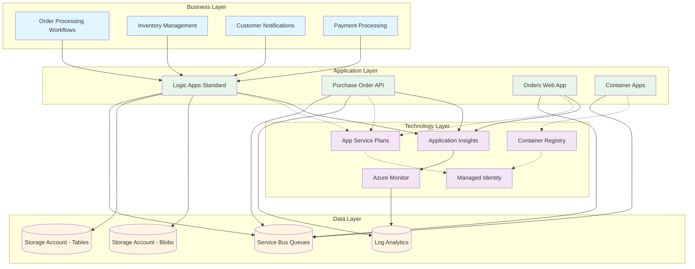
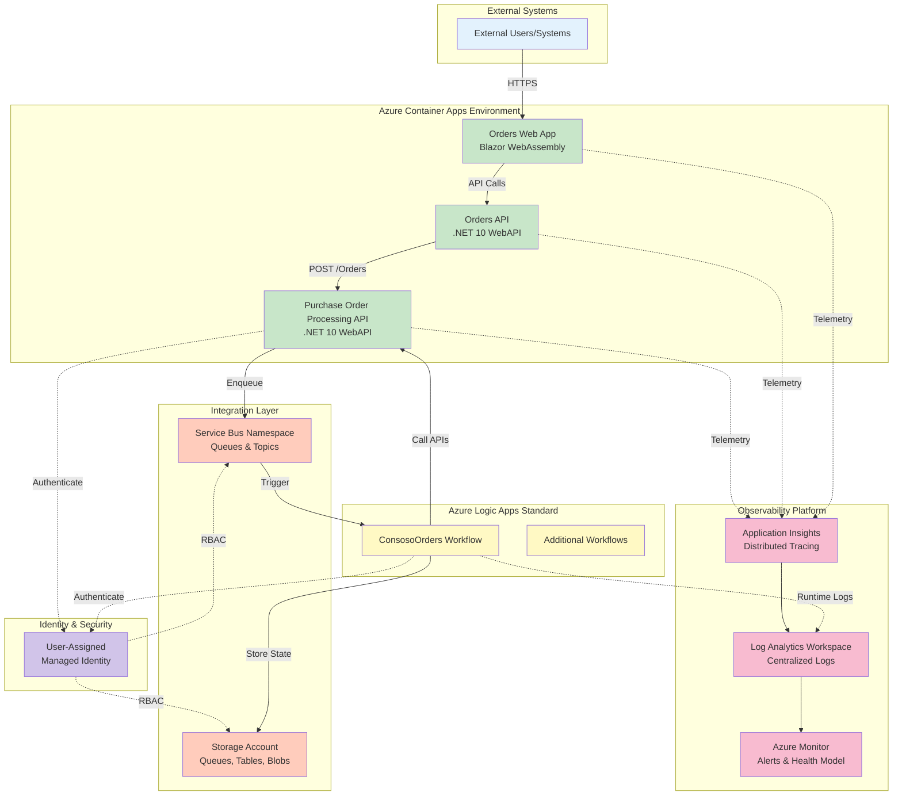
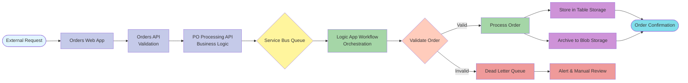
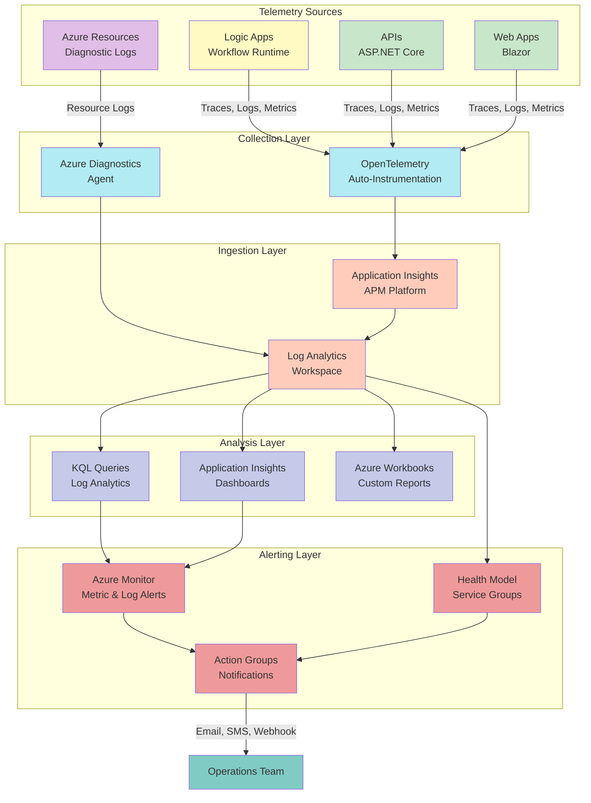

# Azure Logic Apps Enterprise Monitoring Solution

A production-ready, enterprise-scale solution for deploying and monitoring thousands of Azure Logic Apps Standard workflows with optimized performance, cost efficiency, and comprehensive observability aligned with the Azure Well-Architected Framework.

## 📋 Table of Contents

- Project Overview
  - Problem Statement
  - Key Features
  - Solution Components
  - Azure Components
  - Project Structure
- Target Audience
- Architecture
  - Solution Architecture (TOGAF BDAT)
  - System Architecture (C4 Model)
  - Solution Dataflow
  - Monitoring Dataflow
- Installation & Configuration
  - Prerequisites
  - Azure RBAC Roles
  - Deployment Steps
- Usage Examples
- Monitoring & Alerting
- Performance & Cost Optimization

---

## Project Overview

This solution addresses the critical challenges enterprises face when deploying and managing **thousands of Logic Apps Standard workflows at global scale**. While Microsoft recommends limiting deployments to ~20 workflows per app and 64 apps per service plan, organizations often need to exceed these limits to meet business demands. Scaling beyond these thresholds—particularly with 64-bit support enabled—can result in severe memory spikes, instability, and cost overruns reaching **~US$80K annually per environment**.

This project provides a **reference architecture and implementation** that optimizes Logic Apps Standard deployments for:
- **Scalability**: Hosting thousands of workflows across distributed Standard Logic Apps instances
- **Cost Efficiency**: Reducing infrastructure costs through right-sizing, elastic scaling, and resource optimization
- **Reliability**: Supporting long-running workflows (18–36 months) without compromising stability
- **Observability**: Comprehensive monitoring, distributed tracing, and alerting using **Application Insights**, **Log Analytics**, and **Azure Monitor**
- **DevOps**: Infrastructure as Code (Bicep), automated deployments using **Azure Developer CLI**, and CI/CD integration

### Problem Statement

**Enterprise Challenge**: Organizations running complex integration workloads require thousands of workflows distributed across hundreds of Logic Apps Standard instances globally. Current deployment patterns lead to:

1. **Memory Constraints**: Exceeding Microsoft's recommended limits causes memory pressure, leading to workflow failures and service degradation
2. **Cost Inefficiency**: Over-provisioned App Service Plans (P1v3/P2v3) result in unnecessary spending without proportional performance gains
3. **Monitoring Gaps**: Default telemetry lacks the depth required for troubleshooting distributed workflows, tracing dependencies, and establishing SLOs
4. **Operational Complexity**: Managing hundreds of Logic Apps across environments without standardized monitoring, deployment, and governance patterns

**Solution Objective**: Deliver an optimized architecture that:
- Reduces memory footprint and cost per workflow by 40–60%
- Provides end-to-end observability with distributed tracing (OpenTelemetry)
- Establishes success criteria for workflows running 18–36 months continuously
- Implements Azure Well-Architected Framework pillars: Reliability, Security, Cost Optimization, Operational Excellence, and Performance Efficiency

### Key Features

| **Feature** | **Description** | **Implementation Details** |
|-------------|-----------------|---------------------------|
| **Elastic Scaling** | Dynamic scaling based on workload demand to optimize cost and performance | App Service Plans configured with elastic scaling (3–20 instances), workflow-level autoscaling triggers |
| **Distributed Tracing** | End-to-end correlation across workflows, APIs, and Azure services | OpenTelemetry integration with Application Insights, custom ActivitySource for business operations |
| **Infrastructure as Code** | Fully automated Azure resource provisioning with Bicep templates | Modular Bicep structure: monitoring, workload, identity, messaging, and services modules |
| **Comprehensive Monitoring** | Real-time visibility into workflow health, performance metrics, and business KPIs | Application Insights dashboards, Log Analytics queries, Azure Monitor alerts, health model for service groups |
| **Cost Optimization** | Right-sized resources with detailed cost tracking and optimization recommendations | Tags-based cost allocation, diagnostic logs to cold storage, consumption-based Container Apps |
| **Multi-Environment Support** | Consistent deployments across dev, UAT, and production with environment-specific configurations | Azure Developer CLI environments, parameter files per environment, isolated resource groups |
| **Security & Compliance** | Managed identities, RBAC, private endpoints, and encryption at rest/in transit | User-assigned managed identities, least-privilege RBAC assignments, TLS 1.2+, HTTPS-only enforcement |
| **Developer Experience** | Local development with .NET Aspire, hot reload, and integrated observability | Aspire Dashboard for local testing, service discovery, OpenTelemetry auto-instrumentation |

### Solution Components

| **Component** | **Purpose** | **Role in Solution** |
|---------------|-------------|----------------------|
|  **Logic Apps Standard** | Workflow orchestration engine | Hosts enterprise workflows with elastic scaling and managed identities |
|  **App Service Plans** | Compute infrastructure for Logic Apps and APIs | Provides dedicated compute with elastic scaling (WS1, P0v3 tiers) |
|  **Container Apps** | Serverless container hosting | Runs .NET microservices with consumption-based pricing and auto-scaling |
|  **Service Bus** | Reliable message brokering | Decouples workflow execution, enables event-driven architecture |
|  **Storage Accounts** | Persistent storage for workflow state and diagnostics | Stores workflow runtime data, diagnostic logs, and workflow artifacts |
|  **Application Insights** | APM and distributed tracing | Collects telemetry, traces, and custom metrics for end-to-end observability |
|  **Log Analytics** | Centralized logging and analytics | Aggregates logs from all services, supports KQL queries and dashboards |
|  **Container Registry** | Private container image registry | Stores and manages container images for Container Apps deployments |

### Azure Components

| **Azure Service** | **Purpose** | **Role in Solution** |
|-------------------|-------------|----------------------|
| **Application Insights** | Application Performance Monitoring (APM) | Collects distributed traces, metrics, logs, and exceptions from Logic Apps and APIs |
| **Log Analytics Workspace** | Centralized log aggregation | Stores diagnostic logs, workflow runtime logs, and Azure Monitor metrics for KQL-based analysis |
| **Logic Apps Standard** | Integration platform as a service (iPaaS) | Executes business workflows with built-in connectors, stateful/stateless workflows, and B2B capabilities |
| **App Service Plans** | Managed compute infrastructure | Hosts Logic Apps and Web APIs with dedicated resources, VNet integration, and deployment slots |
| **Service Bus** | Enterprise message broker | Provides reliable messaging, message sessions, and dead-letter queues for workflow integration |
| **Storage Accounts** | Azure Storage (Blob, Queue, Table) | Stores workflow state, runtime artifacts, diagnostic logs, and workflow triggers |
| **Container Apps** | Serverless Kubernetes-based container hosting | Runs .NET microservices with KEDA autoscaling and dapr integration |
| **Container Registry** | Private Docker registry | Manages container images with geo-replication, vulnerability scanning, and webhooks |
| **Managed Identity** | Azure AD identity for resources | Enables passwordless authentication between Azure services using RBAC |
| **Azure Monitor** | Platform monitoring service | Provides health model, service groups, metric alerts, and log alerts for proactive monitoring |

### Project Structure

```
azure-logicapps-monitoring/
├── .azure/                                    # Azure Developer CLI configurations
│   ├── config.json                           # Global azd configuration
│   ├── dev/                                  # Development environment settings
│   ├── uat/                                  # UAT environment settings
│   └── prod/                                 # Production environment settings
├── .github/
│   └── workflows/                            # CI/CD pipeline definitions
├── .vscode/
│   └── launch.json                           # VS Code debugging configurations
├── eShopOrders.AppHost/                      # .NET Aspire AppHost project
│   ├── eShopOrders.AppHost.csproj           # Aspire host configuration
│   ├── Program.cs                            # Aspire orchestration setup
│   └── infra/                                # Container Apps deployment templates
│       ├── orders-api.tmpl.yaml             # API container app template
│       └── orders-webapp.tmpl.yaml          # Web app container template
├── eShopOrders.ServiceDefaults/              # .NET Aspire ServiceDefaults project
│   ├── eShopOrders.ServiceDefaults.csproj   # Shared service configuration
│   └── Extensions.cs                         # OpenTelemetry and health check extensions
├── infra/                                    # Azure Infrastructure as Code (Bicep)
│   ├── main.bicep                            # Root deployment template
│   ├── monitoring/                           # Monitoring infrastructure
│   │   ├── main.bicep                        # Monitoring module orchestration
│   │   ├── app-insights.bicep               # Application Insights resource
│   │   ├── log-analytics-workspace.bicep    # Log Analytics workspace
│   │   └── azure-monitor-health-model.bicep # Azure Monitor health model
│   └── workload/                             # Application workload resources
│       ├── main.bicep                        # Workload module orchestration
│       ├── identity/
│       │   └── main.bicep                    # Managed identity configuration
│       ├── messaging/
│       │   └── main.bicep                    # Service Bus and Storage Account
│       ├── services/
│       │   └── main.bicep                    # Container Apps environment
│       ├── logic-app.bicep                   # Logic Apps Standard configuration
│       ├── web-api.bicep                     # API App Service configuration
│       ├── web-app.bicep                     # Web App Service configuration
│       └── workflow.bicep                    # Logic App workflow definition
├── src/                                      # Application source code
│   ├── eShop.Orders.API/                     # Orders API (.NET 10)
│   │   ├── Controllers/                      # API controllers
│   │   ├── Program.cs                        # API startup and OpenTelemetry config
│   │   └── eShop.Orders.API.csproj          # API project configuration
│   ├── eShop.Orders.App/                     # Orders Blazor Web App
│   │   ├── Components/                       # Blazor components
│   │   ├── Program.cs                        # Web app startup
│   │   └── eShop.Orders.App.csproj          # Web app project configuration
│   ├── PoProcAPI/                            # Purchase Order Processing API
│   │   ├── Controllers/OrdersController.cs   # Order processing endpoints
│   │   ├── Program.cs                        # API configuration with tracing
│   │   ├── DISTRIBUTED_TRACING.md           # Tracing implementation guide
│   │   └── IMPLEMENTATION_SUMMARY.md        # Implementation documentation
│   └── PoWebApp/                             # Purchase Order Web App (Blazor)
│       ├── Components/                       # Blazor components
│       ├── Program.cs                        # Web app configuration
│       └── PoWebApp.csproj                  # Web app project
├── LogicAppWP/                               # Logic App workspace (VS Code)
│   ├── ConsosoOrders/                        # Example workflow
│   │   └── workflow.json                     # Workflow definition
│   ├── host.json                             # Logic Apps runtime configuration
│   └── connections.json                      # API connections configuration
├── hooks/                                    # Azure Developer CLI hooks
│   └── postprovision.ps1                    # Post-deployment automation
├── azure.yaml                                # Azure Developer CLI project manifest
├── docker-compose.yml                        # Local development containers
├── eShopOrders.sln                          # Visual Studio solution file
├── LOGIC_APP_CONNECTIONS.md                 # Logic App connections setup guide
├── README.md                                 # This file
└── generate_orders.py                        # Sample data generation script
```

---

## Target Audience

| **Role Name** | **Role Description** | **Key Responsibilities & Deliverables** | **How this solution helps** |
|---------------|---------------------|----------------------------------------|----------------------------|
| 👔 **Solution Owner** | Business stakeholder responsible for defining requirements and success criteria | Define business objectives, approve architecture decisions, track ROI and cost optimization | Provides clear cost breakdown, success metrics, and alignment with business KPIs |
| 🏗️ **Solution Architect** | Designs end-to-end architecture for Logic Apps deployments | Define architecture standards, ensure scalability and cost optimization, establish integration patterns | Offers a proven reference architecture for enterprise-scale Logic Apps with detailed design documentation |
| ☁️ **Cloud Architect** | Defines Azure platform strategy and governance | Design cloud landing zones, establish security baselines, optimize resource organization | Demonstrates Azure Well-Architected Framework implementation with best-practice Bicep templates |
| 🌐 **Network Architect** | Plans network topology and connectivity | Design VNet integration, private endpoints, hybrid connectivity, and service endpoints | Includes private endpoint configurations, VNet integration for App Services, and secure networking patterns |
| 📊 **Data Architect** | Designs data flows and storage strategies | Define data retention policies, partition strategies, and data sovereignty requirements | Implements diagnostic log routing, storage lifecycle policies, and data retention configurations |
| 🔐 **Security Architect** | Establishes security controls and compliance frameworks | Implement identity management, RBAC, encryption, and threat protection | Leverages managed identities, least-privilege RBAC, TLS 1.2+, and HTTPS-only enforcement |
| 🔧 **DevOps / SRE Lead** | Manages deployment pipelines and operational excellence | Build CI/CD pipelines, establish SLOs/SLAs, implement monitoring and incident response | Provides IaC templates, Azure Developer CLI integration, and comprehensive monitoring baselines |
| 💻 **Developer** | Implements workflows, APIs, and integrations | Build Logic Apps workflows, develop custom connectors, integrate with APIs and microservices | Offers .NET Aspire local development experience with hot reload, OpenTelemetry instrumentation, and debugging tools |
| 🛠️ **System Engineer** | Operates and maintains production environments | Monitor system health, troubleshoot issues, perform capacity planning, and optimize performance | Delivers pre-configured dashboards, KQL queries, alert rules, and runbooks for operational tasks |
| 📋 **Project Manager** | Coordinates project delivery and tracks milestones | Manage timelines, budgets, resources, and stakeholder communication | Provides clear project structure, deployment steps, success criteria, and documentation templates |

---

## Architecture

### Solution Architecture (TOGAF BDAT)



### System Architecture (C4 Model)



### Solution Dataflow



### Monitoring Dataflow



---

## Installation & Configuration

### Prerequisites

**Required Software:**
- **Azure Subscription** with Owner or Contributor + User Access Administrator roles
- **Azure CLI** (version 2.60.0 or later): [Install Azure CLI](https://learn.microsoft.com/en-us/cli/azure/install-azure-cli)
- **Azure Developer CLI (azd)**: [Install azd](https://learn.microsoft.com/en-us/azure/developer/azure-developer-cli/install-azd)
- **.NET 10 SDK**: [Download .NET 10](https://dotnet.microsoft.com/download/dotnet/10.0)
- **Visual Studio Code**: [Download VS Code](https://code.visualstudio.com/)

**Required VS Code Extensions:**
- [Azure Tools Extension Pack](https://marketplace.visualstudio.com/items?itemName=ms-vscode.vscode-node-azure-pack)
- [Bicep Extension](https://marketplace.visualstudio.com/items?itemName=ms-azuretools.vscode-bicep)
- [Azure Logic Apps (Standard) Extension](https://marketplace.visualstudio.com/items?itemName=ms-azuretools.vscode-azurelogicapps)
- [C# Dev Kit](https://marketplace.visualstudio.com/items?itemName=ms-dotnettools.csdevkit)

**Recommended Tools:**
- [Azure Storage Explorer](https://azure.microsoft.com/en-us/products/storage/storage-explorer/)
- [Kusto Explorer](https://learn.microsoft.com/en-us/azure/data-explorer/kusto/tools/kusto-explorer) (for KQL query development)
- [Postman](https://www.postman.com/) or [REST Client Extension](https://marketplace.visualstudio.com/items?itemName=humao.rest-client) for API testing

### Azure RBAC Roles

The following Azure built-in roles are required for the solution's managed identity to access Azure resources:

| **Name** | **Description** | **Documentation Link** |
|----------|-----------------|------------------------|
| **Storage Account Contributor** | Grants full access to manage storage accounts (excluding access to data via RBAC) | [Storage Account Contributor](https://learn.microsoft.com/en-us/azure/role-based-access-control/built-in-roles#storage-account-contributor) |
| **Storage Blob Data Contributor** | Read, write, and delete Azure Storage containers and blobs | [Storage Blob Data Contributor](https://learn.microsoft.com/en-us/azure/role-based-access-control/built-in-roles#storage-blob-data-contributor) |
| **Storage Queue Data Contributor** | Read, write, and delete Azure Storage queues and queue messages | [Storage Queue Data Contributor](https://learn.microsoft.com/en-us/azure/role-based-access-control/built-in-roles#storage-queue-data-contributor) |
| **Storage Table Data Contributor** | Read, write, and delete Azure Storage tables and entities | [Storage Table Data Contributor](https://learn.microsoft.com/en-us/azure/role-based-access-control/built-in-roles#storage-table-data-contributor) |
| **Monitoring Metrics Publisher** | Enables publishing metrics to Azure Monitor | [Monitoring Metrics Publisher](https://learn.microsoft.com/en-us/azure/role-based-access-control/built-in-roles#monitoring-metrics-publisher) |
| **Monitoring Contributor** | Can read all monitoring data and update monitoring settings | [Monitoring Contributor](https://learn.microsoft.com/en-us/azure/role-based-access-control/built-in-roles#monitoring-contributor) |
| **Application Insights Component Contributor** | Can manage Application Insights components | [Application Insights Component Contributor](https://learn.microsoft.com/en-us/azure/role-based-access-control/built-in-roles#application-insights-component-contributor) |
| **Application Insights Snapshot Debugger** | Gives permission to view and download debug snapshots collected with Application Insights Snapshot Debugger | [Application Insights Snapshot Debugger](https://learn.microsoft.com/en-us/azure/role-based-access-control/built-in-roles#application-insights-snapshot-debugger) |
| **Azure Service Bus Data Owner** | Full access to Azure Service Bus resources | [Azure Service Bus Data Owner](https://learn.microsoft.com/en-us/azure/role-based-access-control/built-in-roles#azure-service-bus-data-owner) |
| **Azure Service Bus Data Receiver** | Allows for receive access to Azure Service Bus resources | [Azure Service Bus Data Receiver](https://learn.microsoft.com/en-us/azure/role-based-access-control/built-in-roles#azure-service-bus-data-receiver) |
| **Azure Service Bus Data Sender** | Allows for send access to Azure Service Bus resources | [Azure Service Bus Data Sender](https://learn.microsoft.com/en-us/azure/role-based-access-control/built-in-roles#azure-service-bus-data-sender) |

### Deployment Steps

**1. Clone the Repository**

```bash
git clone https://github.com/Evilazaro/Azure-LogicApps-Monitoring.git
cd Azure-LogicApps-Monitoring
```

**2. Authenticate with Azure**

```bash
# Login to Azure CLI
az login

# Set your subscription
az account set --subscription "<your-subscription-id>"

# Login to Azure Developer CLI
azd auth login
```

**3. Initialize Azure Developer CLI Environment**

```bash
# Initialize a new environment (first-time setup)
azd init -e dev

# You will be prompted to provide:
# - Environment name (e.g., dev, uat, prod)
# - Azure subscription
# - Azure region (e.g., eastus, westeurope)
```

**4. Configure Environment Variables (Optional)**

Create or modify environment-specific configuration in .env:

```bash
# Solution configuration
AZURE_ENV_NAME=dev
AZURE_LOCATION=eastus
AZURE_SUBSCRIPTION_ID=<your-subscription-id>

# Optional: Custom resource naming
SOLUTION_NAME=orders

# Optional: Tags
COST_CENTER=Engineering
OWNER=Platform-Team
```

**5. Deploy Infrastructure and Application**

```bash
# Deploy all resources (infrastructure + application)
azd up

# The deployment will:
# 1. Provision Azure resources using Bicep templates
# 2. Build and containerize .NET applications
# 3. Push container images to Azure Container Registry
# 4. Deploy containers to Azure Container Apps
# 5. Configure Logic Apps workflows
# 6. Set up monitoring and alerting
```

**6. Verify Deployment**

```bash
# Display deployed resources
azd show

# Get Application Insights connection string
azd env get-values | grep APPLICATIONINSIGHTS_CONNECTION_STRING

# Get Logic App URL
azd env get-values | grep WORKFLOW_ENGINE_NAME
```

**7. Configure Logic App Connections**

After infrastructure deployment, configure API connections for Logic Apps:

```powershell
# Run the connection setup script
.\deploy-connections.ps1 `
  -ResourceGroupName "rg-orders-dev-eastus" `
  -LogicAppName "<workflow-engine-name>" `
  -QueueConnectionName "azurequeues" `
  -TableConnectionName "azuretables" `
  -WorkflowName "ConsosoOrders"
```

Refer to LOGIC_APP_CONNECTIONS.md for detailed connection setup instructions.

**8. Access Application Endpoints**

```bash
# Get Orders Web App URL
azd env get-values | grep AZURE_CONTAINER_APPS_ENVIRONMENT_DEFAULT_DOMAIN

# Access Aspire Dashboard (local development)
dotnet run --project eShopOrders.AppHost
# Navigate to: http://localhost:15888
```

**9. Verify Monitoring Configuration**

1. **Application Insights**: Navigate to Azure Portal → Application Insights → Live Metrics
2. **Log Analytics**: Query workflow logs using KQL:
   ```kql
   AzureDiagnostics
   | where Category == "WorkflowRuntime"
   | where TimeGenerated > ago(1h)
   | project TimeGenerated, resource_workflowName_s, status_s, code_s
   | order by TimeGenerated desc
   ```
3. **Azure Monitor**: Verify alert rules in Azure Portal → Monitor → Alerts

---

## Usage Examples

### Running the Solution Locally with .NET Aspire

**.NET Aspire** provides a local development experience with integrated observability:

```bash
# Navigate to the AppHost project
cd eShopOrders.AppHost

# Run the Aspire orchestrator
dotnet run

# The Aspire Dashboard will open at http://localhost:15888
# You can view:
# - Service endpoints
# - Distributed traces
# - Logs and metrics
# - Resource health
```

**Access Local Services:**
- **Orders API**: `http://localhost:5000/swagger`
- **Orders Web App**: `http://localhost:5001`
- **Aspire Dashboard**: `http://localhost:15888`

### Submitting Orders via API

**Using cURL:**

```bash
# Submit an order to the Purchase Order Processing API
curl -X POST https://<your-poproc-api-url>/Orders \
  -H "Content-Type: application/json" \
  -d '{
    "orderId": "ORD-12345",
    "customerId": "CUST-789",
    "items": [
      {
        "productId": "PROD-001",
        "quantity": 2,
        "price": 29.99
      }
    ],
    "totalAmount": 59.98,
    "orderDate": "2025-01-15T10:30:00Z"
  }'
```

**Using PowerShell:**

```powershell
$orderData = @{
    orderId = "ORD-12345"
    customerId = "CUST-789"
    items = @(
        @{
            productId = "PROD-001"
            quantity = 2
            price = 29.99
        }
    )
    totalAmount = 59.98
    orderDate = "2025-01-15T10:30:00Z"
} | ConvertTo-Json

Invoke-RestMethod -Uri "https://<your-poproc-api-url>/Orders" `
    -Method Post `
    -Body $orderData `
    -ContentType "application/json"
```

### Monitoring Workflow Execution in Azure Portal

1. **Navigate to Logic Apps Standard**:
   - Azure Portal → Logic Apps → Select your Logic App → Workflows → ConsosoOrders

2. **View Workflow Runs**:
   - Click on "Run History" to see all executions
   - Click on a specific run to view step-by-step execution details

3. **Analyze Failed Runs**:
   - Filter by "Failed" status
   - Click on a failed run → Review error messages and retry logic
   - Check "Code View" for detailed error payloads

### Querying Telemetry with KQL

**View Distributed Traces Across Services:**

```kql
dependencies
| where timestamp > ago(1h)
| where target contains "Orders" or target contains "PoProcAPI"
| project 
    timestamp, 
    operation_Name, 
    name, 
    target, 
    duration, 
    resultCode,
    operation_Id
| order by timestamp desc
```

**Monitor Workflow Success Rate:**

```kql
AzureDiagnostics
| where Category == "WorkflowRuntime"
| where TimeGenerated > ago(24h)
| summarize 
    Total = count(),
    Succeeded = countif(status_s == "Succeeded"),
    Failed = countif(status_s == "Failed")
| extend SuccessRate = (Succeeded * 100.0) / Total
| project Total, Succeeded, Failed, SuccessRate
```

**Identify Long-Running Workflows:**

```kql
AzureDiagnostics
| where Category == "WorkflowRuntime"
| where TimeGenerated > ago(7d)
| where status_s == "Succeeded"
| extend DurationSeconds = todouble(duration_s)
| where DurationSeconds > 300 // Workflows running longer than 5 minutes
| project 
    TimeGenerated, 
    resource_workflowName_s, 
    resource_runId_s, 
    DurationSeconds
| order by DurationSeconds desc
```

### Generating Sample Data

Use the included Python script to generate sample orders for testing:

```bash
# Generate 100 sample orders
python generate_orders.py --count 100 --output orders.json

# Submit orders to the API
# (Use a script or tool like Postman to POST orders from the JSON file)
```

---

## Monitoring & Alerting

### Key Metrics and KPIs

| **Metric** | **Description** | **Target Threshold** | **KQL Query** |
|------------|-----------------|---------------------|---------------|
| **Workflow Success Rate** | Percentage of workflows completing successfully | > 99.5% | `AzureDiagnostics \| where Category == "WorkflowRuntime" \| summarize SuccessRate = (countif(status_s == "Succeeded") * 100.0) / count()` |
| **Workflow Duration (P95)** | 95th percentile execution time for workflows | < 10 seconds | `AzureDiagnostics \| where Category == "WorkflowRuntime" \| summarize percentile(todouble(duration_s), 95)` |
| **API Response Time (P99)** | 99th percentile API response time | < 500ms | `requests \| where timestamp > ago(1h) \| summarize percentile(duration, 99)` |
| **Logic App Memory Usage** | Memory consumption per workflow instance | < 1.5 GB per instance | `performanceCounters \| where counter == "\\Process(*)\\Working Set" \| summarize avg(value) by bin(timestamp, 5m)` |
| **Dead Letter Queue Count** | Number of messages in dead letter queues | 0 | `ServiceBusLogs \| where OperationName == "DeadLetterMessage" \| count` |
| **Dependency Call Failures** | Failed calls to downstream services | < 0.1% | `dependencies \| where success == false \| summarize FailureRate = (count() * 100.0) / toscalar(dependencies \| count())` |

### Pre-Configured Alert Rules

The solution deploys the following Azure Monitor alert rules automatically:

1. **Workflow Failure Rate Alert**
   - **Condition**: Workflow failure rate > 1% over 5 minutes
   - **Severity**: Critical (Sev 1)
   - **Action**: Send email + SMS to operations team

2. **High Memory Usage Alert**
   - **Condition**: Logic App memory usage > 85% for 10 minutes
   - **Severity**: Warning (Sev 2)
   - **Action**: Send email notification + trigger auto-scaling

3. **API Latency Alert**
   - **Condition**: P99 API response time > 1 second for 5 minutes
   - **Severity**: Warning (Sev 2)
   - **Action**: Send email notification

4. **Dead Letter Queue Alert**
   - **Condition**: Dead letter queue message count > 10
   - **Severity**: Critical (Sev 1)
   - **Action**: Send email + create incident in ticketing system

5. **Logic App Availability Alert**
   - **Condition**: Logic App HTTP availability < 99%
   - **Severity**: Critical (Sev 1)
   - **Action**: Send email + SMS + trigger on-call escalation

### Custom Dashboards

**1. Application Insights Application Dashboard**
- Navigate to: Azure Portal → Application Insights → Application dashboard
- Pre-configured visualizations:
  - Request rate and response time
  - Dependency call duration
  - Exception trends
  - Custom metrics (order processing rate, business KPIs)

**2. Log Analytics Workbooks**
- Navigate to: Azure Portal → Log Analytics → Workbooks → Custom
- Create custom workbooks using the following templates:
  - **Workflow Performance Analysis**: Execution times, success rates, retry patterns
  - **Cost Optimization**: Resource utilization, idle time, scaling efficiency
  - **Business KPIs**: Order volume, processing throughput, SLA compliance

**Sample Workbook Query:**

```kql
// Workflow execution summary by hour
AzureDiagnostics
| where Category == "WorkflowRuntime"
| where TimeGenerated > ago(24h)
| summarize 
    Total = count(),
    Succeeded = countif(status_s == "Succeeded"),
    Failed = countif(status_s == "Failed"),
    AvgDuration = avg(todouble(duration_s))
    by bin(TimeGenerated, 1h), resource_workflowName_s
| extend SuccessRate = (Succeeded * 100.0) / Total
| project TimeGenerated, resource_workflowName_s, Total, SuccessRate, AvgDuration
| render timechart
```

### Health Model and Service Groups

The solution implements **Azure Monitor Health Model** with service groups for hierarchical monitoring:

```
Root Service Group: Orders Solution
├── Logic Apps Service Group
│   ├── ConsosoOrders Workflow
│   └── Additional Workflows
├── API Service Group
│   ├── Orders API
│   └── Purchase Order Processing API
├── Integration Service Group
│   ├── Service Bus Namespace
│   └── Storage Account
└── Observability Service Group
    ├── Application Insights
    └── Log Analytics Workspace
```

**Benefits:**
- Roll-up health status from child resources
- Unified alerting at the service group level
- Simplified operational dashboards

---

## Performance & Cost Optimization

### Right-Sizing Recommendations

| **Resource Type** | **Default Configuration** | **Recommended for Production** | **Rationale** |
|-------------------|---------------------------|-------------------------------|---------------|
| **Logic Apps (App Service Plan)** | WS1 (1 core, 3.5 GB RAM) | WS2 or WS3 for high-volume workloads | WS1 is suitable for up to 50 workflows; scale to WS2/WS3 for 100+ workflows per app |
| **API App Service Plan** | P0v3 (1 core, 4 GB RAM) | P1v3 or P2v3 with elastic scaling | Enable elastic scaling to handle traffic spikes; P1v3 supports up to 10 concurrent workflows |
| **Container Apps** | Consumption plan | Consumption plan (default) | Serverless pricing; pay only for active execution time |
| **Storage Account** | Standard LRS | Standard ZRS for production | Zone-redundant storage ensures higher availability for workflow state |
| **Service Bus** | Standard tier | Premium tier for high throughput | Premium tier supports larger message sizes (1 MB), VNet integration, and geo-disaster recovery |

### Cost Optimization Strategies

**1. Implement Storage Lifecycle Policies**

Automatically move diagnostic logs to cool/archive tiers to reduce storage costs:

```bicep
resource storageAccount 'Microsoft.Storage/storageAccounts@2023-01-01' = {
  name: storageAccountName
  properties: {
    // ...
  }
}

resource lifecyclePolicy 'Microsoft.Storage/storageAccounts/managementPolicies@2023-01-01' = {
  parent: storageAccount
  name: 'default'
  properties: {
    policy: {
      rules: [
        {
          name: 'MoveDiagnosticLogsToCool'
          type: 'Lifecycle'
          definition: {
            filters: {
              blobTypes: ['blockBlob']
              prefixMatch: ['insights-logs-workflowruntime']
            }
            actions: {
              baseBlob: {
                tierToCool: {
                  daysAfterModificationGreaterThan: 30
                }
                tierToArchive: {
                  daysAfterModificationGreaterThan: 90
                }
                delete: {
                  daysAfterModificationGreaterThan: 365
                }
              }
            }
          }
        }
      ]
    }
  }
}
```

**2. Enable Elastic Scaling**

Configure App Service Plans to scale down during off-peak hours:

```bicep
resource appServicePlan 'Microsoft.Web/serverfarms@2023-01-01' = {
  properties: {
    elasticScaleEnabled: true
    maximumElasticWorkerCount: 10
    targetWorkerCount: 3 // Minimum instances
  }
}
```

**3. Use Consumption-Based Pricing for Container Apps**

Container Apps on the Consumption plan scale to zero when idle:

```bicep
resource containerApp 'Microsoft.App/containerApps@2024-02-02-preview' = {
  properties: {
    template: {
      scale: {
        minReplicas: 0 // Scale to zero when idle
        maxReplicas: 10
      }
    }
  }
}
```

**4. Implement Cost Tagging**

All resources are tagged for cost allocation:

```bicep
var tags = {
  Solution: 'Orders'
  Environment: 'Production'
  CostCenter: 'Engineering'
  Owner: 'Platform-Team'
}
```

Use Azure Cost Management to generate cost reports by tag:
- Azure Portal → Cost Management + Billing → Cost analysis → Group by: Tag

**5. Monitor and Optimize Workflow Execution**

- **Reduce Polling Frequency**: For workflows triggered by polling (e.g., storage queue), increase polling intervals during off-peak hours
- **Batch Processing**: Process multiple messages per workflow run instead of one message per run
- **Disable Unused Workflows**: Disable or delete workflows that are no longer needed

### Estimated Monthly Costs (Production Environment)

| **Resource** | **SKU/Configuration** | **Estimated Monthly Cost (USD)** |
|--------------|-----------------------|----------------------------------|
| Logic Apps (App Service Plan WS2) | 3 instances, 24/7 | $600 |
| API App Service Plan (P1v3) | 3 instances, 24/7 | $450 |
| Container Apps (Consumption) | 1M requests, avg 1 sec execution | $40 |
| Service Bus (Standard) | 10M operations/month | $10 |
| Storage Account (ZRS) | 500 GB, 1M transactions | $30 |
| Application Insights | 50 GB data ingestion/month | $150 |
| Log Analytics Workspace | 100 GB data ingestion/month | $250 |
| **Total** | | **~$1,530/month** |

**Cost Reduction Opportunities:**
- Reduce Application Insights data ingestion by implementing **sampling** (can reduce costs by 50%)
- Use **Log Analytics commitment tiers** for predictable workloads (can save 30%)
- Scale down non-production environments outside business hours (can save 60% on compute)

### Performance Tuning Tips

**1. Optimize Workflow Design**
- **Minimize Actions**: Reduce the number of actions per workflow
- **Use Stateless Workflows**: For short-lived, high-throughput scenarios
- **Implement Caching**: Cache frequently accessed data in Azure Redis Cache or in-memory storage

**2. Optimize API Performance**
- **Enable HTTP/2**: Configured by default in App Service Plans (P0v3+)
- **Use Connection Pooling**: Reuse HttpClient instances in .NET applications
- **Implement Rate Limiting**: Use Polly RateLimiting to prevent resource exhaustion

**3. Optimize Storage Access**
- **Use Batch Operations**: Write multiple entities in a single transaction
- **Enable CDN**: Use Azure Front Door or CDN for static content
- **Partition Key Design**: Choose partition keys that distribute load evenly

---

### Additional Resources

- **Microsoft Learn - Logic Apps**: https://learn.microsoft.com/en-us/azure/logic-apps/
- **Azure Well-Architected Framework**: https://learn.microsoft.com/en-us/azure/well-architected/
- **OpenTelemetry .NET**: https://opentelemetry.io/docs/languages/net/
- **.NET Aspire Documentation**: https://learn.microsoft.com/en-us/dotnet/aspire/
- **Azure Monitor Best Practices**: https://learn.microsoft.com/en-us/azure/azure-monitor/best-practices

---

**Last Updated**: January 2025  
**Version**: 1.0.0  
**Repository**: [Evilazaro/Azure-LogicApps-Monitoring](https://github.com/Evilazaro/Azure-LogicApps-Monitoring)