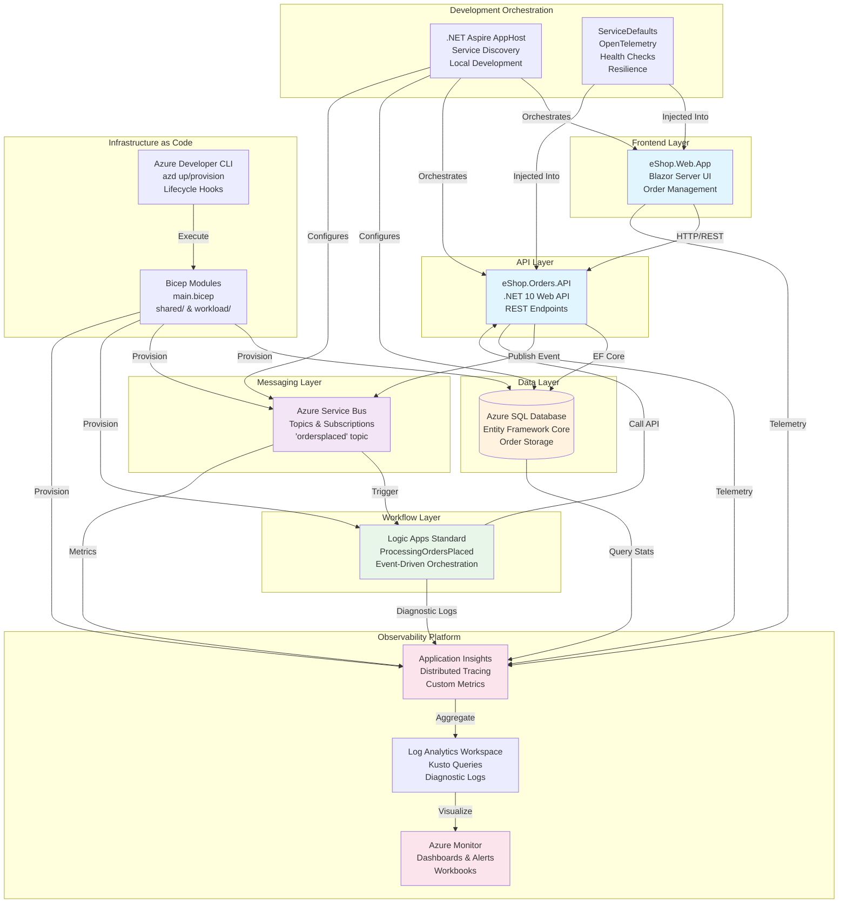
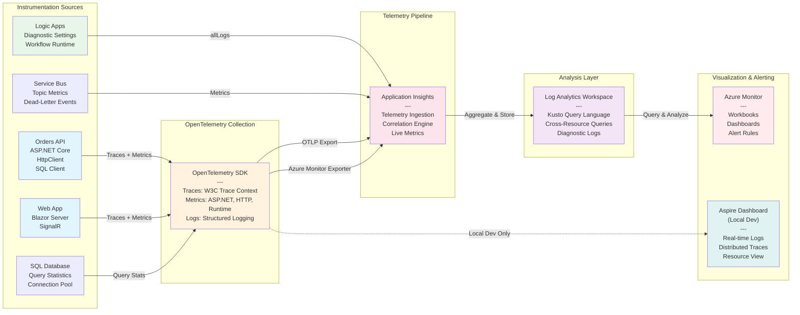

# Azure Logic Apps Monitoring Solution

[](LICENSE.md)
[](https://dotnet.microsoft.com/)
[](https://azure.microsoft.com/services/container-apps/)
[](https://learn.microsoft.com/azure/azure-resource-manager/bicep/)
[](https://learn.microsoft.com/dotnet/aspire/)

## Table of Contents

- [Overview](#overview)
- [Status](#status)
- [Quick Start](#quick-start)
- [Architecture](#architecture)
- [Features](#features)
- [Infrastructure Key Features](#infrastructure-key-features)
- [Project Structure](#project-structure)
- [Technology Stack](#technology-stack)
- [Prerequisites](#prerequisites)
- [Setup Instructions](#setup-instructions)
  - [Local Development](#local-development)
  - [Azure Deployment](#azure-deployment)
- [Observability & Monitoring](#observability--monitoring)
- [Query Examples](#query-examples)
- [Contributing](#contributing)
- [Code of Conduct](#code-of-conduct)
- [Security](#security)
- [License](#license)

## Overview

The Azure Logic Apps Monitoring Solution is an end-to-end reference implementation for building observable, cloud-native order management systems on Azure. Built with **.NET 10** and leveraging **.NET Aspire** for orchestration, this solution demonstrates enterprise-grade patterns for distributed tracing, monitoring, and event-driven architecture using Azure Logic Apps Standard, Azure Container Apps, and Azure Service Bus.

The project showcases an **eShop Orders Management** system where customers place orders through a Blazor web application, which publishes order events to Azure Service Bus. Logic Apps workflows consume these messages and orchestrate order processing, while comprehensive telemetry flows through Application Insights and Azure Monitor, providing end-to-end observability across the entire distributed system.

This solution implements the [Azure Well-Architected Framework](https://learn.microsoft.com/azure/well-architected/) across all five pillars: **Reliability** (with retry policies and health checks), **Security** (using managed identities and Entra ID authentication), **Cost Optimization** (with Azure Container Apps consumption-based pricing), **Operational Excellence** (through Infrastructure as Code and automated provisioning), and **Performance Efficiency** (via distributed tracing and performance monitoring). The infrastructure is fully defined in Bicep, provisioned via Azure Developer CLI (azd), and supports both local development with containerized dependencies and production deployment to Azure.

## Status

**This is a sample application intended for sandbox and study purposes only.**

This repository serves as a learning resource and reference architecture for building observable Logic Apps solutions on Azure. It demonstrates best practices for monitoring, tracing, and operating distributed systems, but should undergo proper security review, compliance validation, and operational hardening before any production use.

## Quick Start

For comprehensive development workflows, detailed troubleshooting guides, and inner loop best practices, refer to [hooks/README.md](hooks/README.md).

### Development Inner Loop

**Local Development (Fastest - 30-60 seconds):**

```bash
# 1. Verify prerequisites
./hooks/check-dev-workstation.sh      # Linux/macOS
.\hooks\check-dev-workstation.ps1     # Windows

# 2. Ensure Docker Desktop is running
docker ps

# 3. Start the application (launches all services + containers)
cd app.AppHost
dotnet run

# 4. Access services
# - Aspire Dashboard: https://localhost:17267
# - Web App: Check dashboard for dynamic port
# - Orders API: Check dashboard for dynamic port
```

**Azure Deployment (~10 minutes):**

```bash
# 1. Authenticate with Azure
az login

# 2. Initialize azd environment (first time only)
azd init

# 3. Provision and deploy
azd up

# The following runs automatically:
# - preprovision.sh/.ps1: Validates prerequisites
# - Bicep deployment: Provisions all Azure resources
# - postprovision.sh/.ps1: Configures secrets and SQL access
# - Generate-Orders.sh/.ps1: Creates sample test data
```

## Architecture



## Features

| Name | Description | Best Practices Applied | WAF Alignment |
|------|-------------|----------------------|---------------|
| Distributed Tracing | End-to-end W3C Trace Context correlation across Logic Apps, APIs, SQL Database, and Service Bus with OpenTelemetry instrumentation | [Application Insights Distributed Tracing](https://learn.microsoft.com/azure/azure-monitor/app/distributed-tracing), [OpenTelemetry](https://learn.microsoft.com/dotnet/core/diagnostics/observability-with-otel) | [Operational Excellence](https://learn.microsoft.com/azure/well-architected/operational-excellence/) |
| .NET Aspire Orchestration | Service discovery, health checks, and local development orchestration with automatic container lifecycle management for SQL Server and Service Bus emulator | [.NET Aspire Documentation](https://learn.microsoft.com/dotnet/aspire/), [Service Discovery](https://learn.microsoft.com/dotnet/aspire/service-discovery/overview) | [Reliability](https://learn.microsoft.com/azure/well-architected/reliability/), [Operational Excellence](https://learn.microsoft.com/azure/well-architected/operational-excellence/) |
| Service Defaults Module | Reusable configuration for OpenTelemetry (traces, metrics, logs), resilience policies (retry, timeout, circuit breaker), and health check endpoints (`/health`, `/alive`) | [ASP.NET Core Best Practices](https://learn.microsoft.com/aspnet/core/fundamentals/best-practices), [Polly Resilience](https://www.pollydocs.org/) | [Reliability](https://learn.microsoft.com/azure/well-architected/reliability/), [Operational Excellence](https://learn.microsoft.com/azure/well-architected/operational-excellence/) |
| Automated Validation | `preprovision` script validates PowerShell 7.0+, .NET SDK 10.0+, Azure CLI 2.60.0+, Bicep 0.30.0+, Azure authentication, and 8 resource provider registrations | [Azure DevOps Best Practices](https://learn.microsoft.com/azure/devops/repos/git/git-branching-guidance) | [Operational Excellence](https://learn.microsoft.com/azure/well-architected/operational-excellence/) |
| Entity Framework Core | Code-first data modeling with migrations, SQL connection resiliency, automatic retry on failure (5 attempts, 30s max delay, 120s command timeout) | [EF Core Best Practices](https://learn.microsoft.com/ef/core/miscellaneous/connection-resiliency), [EF Core with SQL Azure](https://learn.microsoft.com/azure/azure-sql/database/develop-overview) | [Reliability](https://learn.microsoft.com/azure/well-architected/reliability/) |
| Managed Identity Authentication | Passwordless authentication to Azure SQL Database, Service Bus, and Application Insights using Entra ID and DefaultAzureCredential with automatic token renewal | [Managed Identity Best Practices](https://learn.microsoft.com/entra/identity/managed-identities-azure-resources/overview), [DefaultAzureCredential](https://learn.microsoft.com/dotnet/api/azure.identity.defaultazurecredential) | [Security](https://learn.microsoft.com/azure/well-architected/security/) |
| Event-Driven Architecture | Azure Service Bus topic-based publish/subscribe with `ordersplaced` topic, subscriptions, and Logic Apps triggers for decoupled order processing | [Service Bus Messaging](https://learn.microsoft.com/azure/service-bus-messaging/service-bus-messaging-overview), [Event-Driven Architecture](https://learn.microsoft.com/azure/architecture/guide/architecture-styles/event-driven) | [Reliability](https://learn.microsoft.com/azure/well-architected/reliability/) |
| Blazor Server UI | Interactive web application with SignalR for real-time updates, FluentUI components, and typed HTTP clients with service discovery | [Blazor Server](https://learn.microsoft.com/aspnet/core/blazor/hosting-models#blazor-server), [SignalR](https://learn.microsoft.com/aspnet/core/signalr/introduction) | [Performance Efficiency](https://learn.microsoft.com/azure/well-architected/performance-efficiency/) |
| Automated Secret Management | `postprovision` script extracts Bicep outputs and configures .NET user secrets across 3 projects (26 secrets total) including connection strings, endpoints, and managed identity IDs | [.NET User Secrets](https://learn.microsoft.com/aspnet/core/security/app-secrets), [azd Hooks](https://learn.microsoft.com/azure/developer/azure-developer-cli/azd-extensibility) | [Security](https://learn.microsoft.com/azure/well-architected/security/), [Operational Excellence](https://learn.microsoft.com/azure/well-architected/operational-excellence/) |
| SQL Managed Identity Setup | Automatic database role assignments (db_datareader, db_datawriter, db_ddladmin) via `sql-managed-identity-config` script during `postprovision` | [SQL Managed Identity](https://learn.microsoft.com/azure/azure-sql/database/authentication-aad-configure) | [Security](https://learn.microsoft.com/azure/well-architected/security/) |
| Test Data Generation | `Generate-Orders` script creates realistic sample orders with configurable count, products per order, and output formats for testing and demos | [Testing Best Practices](https://learn.microsoft.com/dotnet/core/testing/) | [Operational Excellence](https://learn.microsoft.com/azure/well-architected/operational-excellence/) |

## Infrastructure Key Features

| Name | Description | Best Practices Applied | WAF Alignment |
|------|-------------|----------------------|---------------|
| Modular Bicep Architecture | Three-tier structure: `main.bicep` (orchestrator), `shared/` (monitoring, data, identity), and `workload/` (messaging, services, Logic Apps) with typed parameters and comprehensive outputs | [Bicep Best Practices](https://learn.microsoft.com/azure/azure-resource-manager/bicep/best-practices), [Bicep Modules](https://learn.microsoft.com/azure/azure-resource-manager/bicep/modules) | [Operational Excellence](https://learn.microsoft.com/azure/well-architected/operational-excellence/) |
| Azure Container Apps | Serverless container hosting with consumption-based pricing, automatic scaling (0-N instances), and integrated managed identity for passwordless authentication | [Container Apps Best Practices](https://learn.microsoft.com/azure/container-apps/plans), [Scaling](https://learn.microsoft.com/azure/container-apps/scale-app) | [Cost Optimization](https://learn.microsoft.com/azure/well-architected/cost-optimization/), [Performance Efficiency](https://learn.microsoft.com/azure/well-architected/performance-efficiency/) |
| Azure Service Bus Premium | Topic-based messaging with `ordersplaced` topic, `orderprocessingsub` subscription, dead-letter queues, and AMQP over WebSockets for firewall compatibility | [Service Bus Best Practices](https://learn.microsoft.com/azure/service-bus-messaging/service-bus-performance-improvements), [Topics and Subscriptions](https://learn.microsoft.com/azure/service-bus-messaging/service-bus-queues-topics-subscriptions) | [Reliability](https://learn.microsoft.com/azure/well-architected/reliability/) |
| Application Insights + Log Analytics | Integrated APM with distributed tracing, custom metrics (eShop.Orders.API, eShop.Web.App meters), Azure Monitor exporter, and Kusto query workspace | [Application Insights Best Practices](https://learn.microsoft.com/azure/azure-monitor/app/app-insights-overview), [Log Analytics](https://learn.microsoft.com/azure/azure-monitor/logs/log-analytics-overview) | [Operational Excellence](https://learn.microsoft.com/azure/well-architected/operational-excellence/) |
| Azure SQL Database with Entra ID | Passwordless authentication with `azureADOnlyAuthentication: true`, managed identity as database admin, automatic role assignments (db_datareader, db_datawriter, db_ddladmin) | [SQL Managed Identity](https://learn.microsoft.com/azure/azure-sql/database/authentication-aad-overview), [Entra ID Only Auth](https://learn.microsoft.com/azure/azure-sql/database/authentication-azure-ad-only-authentication) | [Security](https://learn.microsoft.com/azure/well-architected/security/) |
| Logic Apps Standard | Single-tenant Logic Apps with dedicated App Service Plan (S1), VNet integration support, 500+ connectors, and content storage in dedicated Azure Storage account | [Logic Apps Standard](https://learn.microsoft.com/azure/logic-apps/single-tenant-overview-compare), [Connectors](https://learn.microsoft.com/connectors/connector-reference/connector-reference-logicapps-connectors) | [Reliability](https://learn.microsoft.com/azure/well-architected/reliability/) |
| Managed Identity RBAC | User-assigned managed identity with role assignments: `Storage Blob Data Contributor`, `Storage Table Data Contributor`, `AcrPull`, and database-level SQL permissions | [Managed Identity RBAC](https://learn.microsoft.com/entra/identity/managed-identities-azure-resources/overview), [Azure RBAC](https://learn.microsoft.com/azure/role-based-access-control/overview) | [Security](https://learn.microsoft.com/azure/well-architected/security/) |
| Diagnostic Settings | All resources configured with `allLogs` and `allMetrics` categories streaming to Log Analytics workspace and Storage Account for compliance and troubleshooting | [Diagnostic Settings](https://learn.microsoft.com/azure/azure-monitor/essentials/diagnostic-settings), [Resource Logs](https://learn.microsoft.com/azure/azure-monitor/essentials/resource-logs) | [Operational Excellence](https://learn.microsoft.com/azure/well-architected/operational-excellence/) |
| azd Lifecycle Hooks | Pre-provisioning validation (`preprovision`), post-provisioning configuration (`postprovision`), SQL setup, and test data generation integrated into `azd up` workflow | [azd Extensibility](https://learn.microsoft.com/azure/developer/azure-developer-cli/azd-extensibility), [azd Hooks](https://learn.microsoft.com/azure/developer/azure-developer-cli/azd-extensibility#hooks) | [Operational Excellence](https://learn.microsoft.com/azure/well-architected/operational-excellence/) |
| Resource Tagging Strategy | Standardized tags across all resources: Solution, Environment, CostCenter, Owner, BusinessUnit, DeploymentDate, Repository, azd-env-name, azd-service-name | [Azure Tagging Strategy](https://learn.microsoft.com/azure/cloud-adoption-framework/ready/azure-best-practices/resource-tagging), [Cost Management](https://learn.microsoft.com/azure/cost-management-billing/costs/cost-mgt-best-practices) | [Cost Optimization](https://learn.microsoft.com/azure/well-architected/cost-optimization/) |

## Project Structure

| Folder Name | Purpose | Key Responsibilities | Best Practices Applied | Well-Architected Framework Alignment |
|-------------|---------|---------------------|----------------------|-------------------------------------|
| **app.AppHost/** | .NET Aspire orchestration host (AppHost.cs, 250 lines) | Service discovery, dual-mode configuration (local containers vs Azure resources), Application Insights integration, SQL Database and Service Bus setup with managed identity | [.NET Aspire Documentation](https://learn.microsoft.com/dotnet/aspire/), [Service Discovery](https://learn.microsoft.com/dotnet/aspire/service-discovery/overview), [Aspire Azure Resources](https://learn.microsoft.com/dotnet/aspire/azure/overview) | [Operational Excellence](https://learn.microsoft.com/azure/well-architected/operational-excellence/), [Reliability](https://learn.microsoft.com/azure/well-architected/reliability/) |
| **app.ServiceDefaults/** | Shared service configuration library (Extensions.cs, 300 lines) | OpenTelemetry configuration (traces, metrics, logs with Azure Monitor exporter), resilience policies (retry, timeout, circuit breaker with Polly), health check endpoints (`/health`, `/alive`), Azure Service Bus client factory with DefaultAzureCredential | [ASP.NET Core Configuration](https://learn.microsoft.com/aspnet/core/fundamentals/configuration/), [OpenTelemetry .NET](https://learn.microsoft.com/dotnet/core/diagnostics/observability-with-otel), [Polly Resilience](https://www.pollydocs.org/) | [Reliability](https://learn.microsoft.com/azure/well-architected/reliability/), [Operational Excellence](https://learn.microsoft.com/azure/well-architected/operational-excellence/) |
| **hooks/** | Development automation and validation scripts (7 scripts with dual PowerShell/Bash implementations) | `check-dev-workstation`: Validates prerequisites; `preprovision`: Pre-deployment checks; `postprovision`: Configures .NET user secrets (26 secrets across 3 projects); `sql-managed-identity-config`: Sets up database access; `Generate-Orders`: Creates test data; `clean-secrets`: Removes old configurations | [Git Hooks](https://git-scm.com/docs/githooks), [azd Hooks](https://learn.microsoft.com/azure/developer/azure-developer-cli/azd-extensibility), [Cross-Platform Scripts](https://learn.microsoft.com/powershell/scripting/overview) | [Security](https://learn.microsoft.com/azure/well-architected/security/), [Operational Excellence](https://learn.microsoft.com/azure/well-architected/operational-excellence/) |
| **infra/** | Infrastructure as Code with Bicep (main.bicep, shared/, workload/) | Subscription-scoped deployment orchestration, resource group creation, modular architecture: `shared/main.bicep` (identity, monitoring, data with SQL), `workload/main.bicep` (messaging, services, Logic Apps), comprehensive outputs (40+ values), diagnostic settings for all resources | [Bicep Documentation](https://learn.microsoft.com/azure/azure-resource-manager/bicep/), [Bicep Modules](https://learn.microsoft.com/azure/azure-resource-manager/bicep/modules), [IaC Best Practices](https://learn.microsoft.com/azure/azure-resource-manager/templates/best-practices) | [Operational Excellence](https://learn.microsoft.com/azure/well-architected/operational-excellence/), [Cost Optimization](https://learn.microsoft.com/azure/well-architected/cost-optimization/) |
| **src/eShop.Orders.API/** | REST API for order management (.NET 10, 216 lines in Program.cs) | CRUD operations for orders, EF Core with SQL Server (OrderDbContext, OrderEntity, OrderProductEntity), Service Bus message publishing to `ordersplaced` topic, health checks (DbContext, Service Bus), automatic database migration on startup with retry logic (10 attempts, 5s delay), OpenAPI/Swagger documentation | [ASP.NET Core Web API](https://learn.microsoft.com/aspnet/core/web-api/), [EF Core](https://learn.microsoft.com/ef/core/), [Health Checks](https://learn.microsoft.com/aspnet/core/host-and-deploy/health-checks) | [Reliability](https://learn.microsoft.com/azure/well-architected/reliability/), [Performance Efficiency](https://learn.microsoft.com/azure/well-architected/performance-efficiency/) |
| **src/eShop.Web.App/** | Blazor Server web application | Interactive order management UI with FluentUI components, SignalR for real-time updates, typed HTTP client for Orders API with service discovery, circuit options for connection resilience, responsive design | [Blazor Server](https://learn.microsoft.com/aspnet/core/blazor/hosting-models#blazor-server), [SignalR](https://learn.microsoft.com/aspnet/core/signalr/introduction), [FluentUI Blazor](https://www.fluentui-blazor.net/) | [Performance Efficiency](https://learn.microsoft.com/azure/well-architected/performance-efficiency/), [Operational Excellence](https://learn.microsoft.com/azure/well-architected/operational-excellence/) |
| **workflows/OrdersManagement/** | Logic Apps Standard workflow definitions | `OrdersManagementLogicApp/`: Logic App project with `ProcessingOrdersPlaced/workflow.json` (Stateful workflow), VS Code workspace configuration, host.json with Azure Functions Extension Bundle for Workflows | [Logic Apps Standard](https://learn.microsoft.com/azure/logic-apps/single-tenant-overview-compare), [Workflow Definition](https://learn.microsoft.com/azure/logic-apps/logic-apps-workflow-definition-language), [VS Code Extension](https://learn.microsoft.com/azure/logic-apps/create-single-tenant-workflows-visual-studio-code) | [Operational Excellence](https://learn.microsoft.com/azure/well-architected/operational-excellence/) |

## Technology Stack

| Technology | Purpose | Documentation |
|-----------|---------|---------------|
| [.NET 10](https://dotnet.microsoft.com/) | Application runtime and framework | [.NET Documentation](https://learn.microsoft.com/dotnet/) |
| [.NET Aspire](https://learn.microsoft.com/dotnet/aspire/) | Cloud-native orchestration and service discovery | [Aspire Documentation](https://learn.microsoft.com/dotnet/aspire/) |
| [Azure Container Apps](https://azure.microsoft.com/services/container-apps/) | Serverless container hosting | [Container Apps Docs](https://learn.microsoft.com/azure/container-apps/) |
| [Azure Logic Apps](https://azure.microsoft.com/services/logic-apps/) | Workflow automation and orchestration | [Logic Apps Documentation](https://learn.microsoft.com/azure/logic-apps/) |
| [Azure Service Bus](https://azure.microsoft.com/services/service-bus/) | Enterprise messaging service | [Service Bus Docs](https://learn.microsoft.com/azure/service-bus-messaging/) |
| [Application Insights](https://azure.microsoft.com/services/monitor/) | APM and telemetry collection | [App Insights Documentation](https://learn.microsoft.com/azure/azure-monitor/app/app-insights-overview) |
| [Azure Monitor](https://azure.microsoft.com/services/monitor/) | Centralized observability platform | [Azure Monitor Docs](https://learn.microsoft.com/azure/azure-monitor/) |
| [Bicep](https://learn.microsoft.com/azure/azure-resource-manager/bicep/) | Infrastructure as Code | [Bicep Documentation](https://learn.microsoft.com/azure/azure-resource-manager/bicep/) |
| [PowerShell](https://learn.microsoft.com/powershell/) | Automation scripting (Windows) | [PowerShell Docs](https://learn.microsoft.com/powershell/) |
| [Bash](https://www.gnu.org/software/bash/) | Automation scripting (Linux/macOS) | [Bash Reference](https://www.gnu.org/software/bash/manual/) |

## Prerequisites

### Local Development

| Component | Version | Purpose | Installation |
|-----------|---------|---------|-------------|
| **.NET SDK** | 10.0+ | Application runtime and compilation | [Download .NET 10](https://dotnet.microsoft.com/download/dotnet/10.0) or `winget install Microsoft.DotNet.SDK.10` |
| **PowerShell** | 7.0+ | Cross-platform automation scripting | [Install PowerShell](https://learn.microsoft.com/powershell/scripting/install/installing-powershell) |
| **Docker Desktop** | Latest | Container orchestration for SQL Server and Service Bus emulator | [Download Docker Desktop](https://www.docker.com/products/docker-desktop/) |
| **.NET Aspire Workload** | 9.5+ | Aspire orchestration and tooling | `dotnet workload install aspire` |
| **Visual Studio 2022** | 17.13+ (optional) | Full-featured IDE with Aspire support | [Download Visual Studio](https://visualstudio.microsoft.com/) |
| **VS Code** | Latest (optional) | Lightweight editor with C# Dev Kit extension | [Download VS Code](https://code.visualstudio.com/) |

### Azure Deployment

| Component | Version | Purpose | Installation |
|-----------|---------|---------|-------------|
| **Azure CLI** | 2.60.0+ | Azure resource management | [Install Azure CLI](https://learn.microsoft.com/cli/azure/install-azure-cli) |
| **Azure Developer CLI (azd)** | Latest | Infrastructure provisioning and deployment | [Install azd](https://learn.microsoft.com/azure/developer/azure-developer-cli/install-azd) |
| **Bicep CLI** | 0.30.0+ | Infrastructure as Code (installed with Azure CLI) | Included with Azure CLI or `az bicep install` |
| **Azure Subscription** | Active | Azure resource hosting | [Create Free Account](https://azure.microsoft.com/free/) |

### Required Azure Resource Providers

The `preprovision` script validates these are registered:

- `Microsoft.App` (Container Apps)
- `Microsoft.ServiceBus` (Service Bus)
- `Microsoft.Storage` (Storage Accounts)
- `Microsoft.Web` (Logic Apps & App Services)
- `Microsoft.ContainerRegistry` (Container Registry)
- `Microsoft.Insights` (Application Insights)
- `Microsoft.OperationalInsights` (Log Analytics)
- `Microsoft.ManagedIdentity` (Managed Identities)

## Setup Instructions

### Local Development

#### 1. Clone and Validate

```bash
# Clone the repository
git clone https://github.com/Evilazaro/Azure-LogicApps-Monitoring.git
cd Azure-LogicApps-Monitoring

# Validate prerequisites (completes in 3-5 seconds)
./hooks/check-dev-workstation.sh      # Linux/macOS
.\hooks\check-dev-workstation.ps1     # Windows
```

#### 2. Start Docker Desktop

```bash
# Verify Docker is running
docker ps

# If Docker is not running, start Docker Desktop application
```

#### 3. Run the Application

```bash
# Navigate to AppHost project
cd app.AppHost

# Run with .NET CLI (starts all services + containers)
dotnet run

# What happens automatically:
# ✅ SQL Server container starts with persistent volume
# ✅ Service Bus emulator container starts  
# ✅ Database schema created via EF Core migrations
# ✅ Service Bus topic 'ordersplaced' and subscription created
# ✅ OpenTelemetry tracing enabled
# ✅ Health checks registered at /health and /alive
```

#### 4. Access Services

| Service | URL | Description |
|---------|-----|-------------|
| **Aspire Dashboard** | https://localhost:17267 | Service overview, logs, traces, metrics |
| **Web App** | Check Aspire Dashboard | Dynamic port assignment |
| **Orders API** | Check Aspire Dashboard | Swagger UI at `/` endpoint |
| **Orders API OpenAPI** | Check Aspire Dashboard | OpenAPI spec at `/openapi/v1.json` |

#### 5. Development Inner Loop (10-30 seconds/iteration)

```
💻 Edit Code (C#, Razor, JSON)
   ↓
⚡ Hot Reload (1-3 seconds - automatic with .NET 10)
   ↓
🧪 Test Changes (Browser/Postman)
   ↓
📊 View Logs/Traces (Aspire Dashboard)
   ↓
✅ Works? → Continue editing
❌ Debug? → Set breakpoints in IDE
```

#### 6. Stop Development

```bash
# Press Ctrl+C in terminal
# Docker containers stop automatically
```

### Azure Deployment

#### 1. Authenticate with Azure

```bash
# Login to Azure
az login

# Set subscription (if you have multiple)
az account set --subscription "<your-subscription-id>"

# Verify authentication
az account show
```

#### 2. Initialize azd Environment (First Time Only)

```bash
# Initialize azd (creates .azure folder)
azd init

# You'll be prompted for:
# - Environment name (e.g., 'dev', 'staging')
# - Azure subscription
# - Azure region (e.g., 'eastus', 'westus2')
```

#### 3. Deploy Infrastructure and Application

```bash
# Single command for complete deployment (~10 minutes)
azd up

# What happens automatically:
# 1. preprovision hook executes:
#    ✅ Validates PowerShell 7.0+, .NET 10.0+, Azure CLI 2.60.0+
#    ✅ Validates Bicep CLI 0.30.0+, Azure authentication
#    ✅ Validates 8 Azure resource providers registered
#
# 2. Bicep deployment provisions:
#    ✅ Resource group
#    ✅ User-assigned managed identity
#    ✅ Log Analytics workspace + Application Insights
#    ✅ SQL Server + Database (Entra ID auth only)
#    ✅ Azure Service Bus with 'ordersplaced' topic
#    ✅ Container Registry + Container Apps Environment
#    ✅ Logic Apps Standard with App Service Plan
#    ✅ Storage accounts (diagnostic logs + workflow content)
#
# 3. postprovision hook executes:
#    ✅ Extracts Bicep outputs (40+ values)
#    ✅ Configures .NET user secrets (26 secrets across 3 projects)
#    ✅ Sets up SQL managed identity with database roles
#    ✅ Generates test order data
#
# 4. Application deployment:
#    ✅ Builds container images
#    ✅ Pushes to Azure Container Registry
#    ✅ Deploys to Container Apps
```

#### 4. Verify Deployment

```bash
# Get deployment outputs
azd env get-values

# Example outputs:
AZURE_RESOURCE_GROUP="rg-orders-dev-eastus"
APPLICATIONINSIGHTS_CONNECTION_STRING="InstrumentationKey=..."
MESSAGING_SERVICEBUSHOSTNAME="sb-orders-dev.servicebus.windows.net"
ORDERSAPIDATABASE_SQLSERVERFQDN="sql-orders-dev.database.windows.net"
LOGIC_APP_NAME="logic-orders-dev"

# Test Orders API endpoint
curl "$ORDERS_API_ENDPOINT/health"

# Access Application Insights in Azure Portal
az portal open --resource "$APPLICATION_INSIGHTS_NAME"
```

#### 5. Subsequent Deployments

```bash
# Re-provision infrastructure only
azd provision

# Deploy code only (faster)
azd deploy

# Full re-deployment
azd up

# Clean up all resources
azd down
```

#### 6. Manage Environments

```bash
# List environments
azd env list

# Switch environment
azd env select <environment-name>

# Create new environment
azd env new <environment-name>

# View environment variables
azd env get-values
```

## Observability & Monitoring



### Monitoring Capabilities

#### Distributed Tracing (OpenTelemetry)
- **W3C Trace Context** propagation across all services
- **Activity Sources**: `eShop.Orders.API`, `eShop.Web.App`, `Azure.Messaging.ServiceBus`
- **Automatic instrumentation**: ASP.NET Core, HttpClient, SQL Client
- **Correlation IDs**: `operation_Id` links related requests across services
- **Span enrichment**: HTTP request/response sizes, SQL command text (dev only)

#### Custom Metrics Collection
- **Application-specific meters**: 
  - `eShop.Orders.API`: Order creation count, processing duration
  - `eShop.Web.App`: UI interaction metrics
- **Runtime metrics**: GC collections, thread pool, exception count
- **HTTP metrics**: Request count, duration, status codes
- **Service Bus metrics**: Message count, dead-letter count, processing time

#### Structured Logging
- **OpenTelemetry logging**: Formatted messages, scopes, state values
- **Log levels**: Information, Warning, Error, Critical
- **Correlation**: Logs automatically linked to traces via `operation_Id`
- **Filtering**: Health check endpoints excluded from traces

#### Health Checks
- **Liveness**: `/alive` endpoint (checks application is running)
- **Readiness**: `/health` endpoint (validates dependencies)
  - `DbContextHealthCheck`: SQL Database connectivity
  - `ServiceBusHealthCheck`: Service Bus namespace availability
- **Container Apps probes**: Automatic health monitoring

#### Real-time Monitoring
- **Aspire Dashboard** (Local Development):
  - Resources tab: All services and containers with status
  - Logs tab: Real-time log streaming with filtering
  - Traces tab: Distributed tracing visualization
  - Metrics tab: Performance counters and custom metrics
  - Console tab: Container stdout/stderr

- **Application Insights Live Metrics** (Azure):
  - Request rate and failure rate
  - Dependency call duration
  - Exception telemetry
  - Server performance counters

#### Diagnostic Settings
- **All resources** configured with:
  - `allLogs` category group → Log Analytics + Storage
  - `allMetrics` category group → Log Analytics + Storage
- **Retention**: Configurable per compliance requirements
- **Use cases**: Compliance auditing, cost analysis, troubleshooting

## Query Examples

These Kusto queries demonstrate how to leverage Application Insights and Log Analytics for operational insights. Run queries in Azure Portal → Application Insights → Logs.

### Logic Apps Workflow Execution Tracking

**Purpose:** Monitor Logic Apps workflow runs, identify failures, and troubleshoot execution issues

```kusto
AzureDiagnostics
| where ResourceProvider == "MICROSOFT.WEB"
| where Category == "FunctionAppLogs"
| where ResourceType == "SITES"
| extend WorkflowName = tostring(split(_ResourceId, "/")[-1])
| where WorkflowName startswith "logic-"
| project 
    TimeGenerated,
    WorkflowName,
    Level,
    Message,
    OperationName,
    _ResourceId
| order by TimeGenerated desc
| take 100
```

- **Documentation:** [Logic Apps Standard Monitoring](https://learn.microsoft.com/azure/logic-apps/monitor-logic-apps-log-analytics)
- **Implementation:** Configured in [infra/workload/logic-app.bicep](infra/workload/logic-app.bicep) with diagnostic settings
- **Related Hook:** [postprovision](hooks/postprovision.md) configures Logic App connection strings

### API Request Performance Analysis

**Purpose:** Analyze Orders API performance, identify slow endpoints, and detect anomalies

```kusto
requests
| where cloud_RoleName == "eShop.Orders.API"
| where timestamp > ago(1h)
| where name !contains "/health" and name !contains "/alive"  // Exclude health checks
| summarize 
    RequestCount = count(),
    AvgDuration = avg(duration),
    P50Duration = percentile(duration, 50),
    P95Duration = percentile(duration, 95),
    P99Duration = percentile(duration, 99),
    FailureCount = countif(success == false)
    by name, resultCode
| extend FailureRate = round(100.0 * FailureCount / RequestCount, 2)
| where AvgDuration > 1000 or FailureRate > 5  // Highlight slow or failing endpoints
| order by P95Duration desc
```

- **Documentation:** [Application Insights Requests](https://learn.microsoft.com/azure/azure-monitor/app/asp-net-core)
- **Implementation:** Configured in [app.ServiceDefaults/Extensions.cs](app.ServiceDefaults/Extensions.cs) lines 80-120
- **Instrumentation:** ASP.NET Core automatic instrumentation with request enrichment

### Distributed Trace Correlation

**Purpose:** Follow a single order request across Web App → Orders API → SQL Database → Service Bus

```kusto
// Replace <operation_Id> with actual correlation ID from a request
let operationId = "<operation_Id>";
union requests, dependencies, traces
| where operation_Id == operationId
| extend 
    ComponentName = coalesce(cloud_RoleName, appName),
    ItemType = itemType,
    Duration = duration,
    Success = success
| project 
    timestamp,
    ComponentName,
    ItemType,
    name,
    Duration,
    Success,
    message,
    customDimensions
| order by timestamp asc
```

- **Documentation:** [Distributed Tracing](https://learn.microsoft.com/azure/azure-monitor/app/distributed-tracing), [W3C Trace Context](https://www.w3.org/TR/trace-context/)
- **Implementation:** [app.ServiceDefaults/Extensions.cs](app.ServiceDefaults/Extensions.cs) lines 80-150 (OpenTelemetry configuration)
- **Correlation:** Automatic via OpenTelemetry and W3C Trace Context propagation

### Service Bus Dead-Letter Queue Analysis

**Purpose:** Monitor dead-letter messages from the `ordersplaced` topic to identify message processing failures

```kusto
traces
| where cloud_RoleName == "eShop.Orders.API"
| where message contains "dead-letter" or message contains "DeadLetter"
| extend 
    MessageId = tostring(customDimensions.MessageId),
    DeadLetterReason = tostring(customDimensions.DeadLetterReason),
    DeadLetterErrorDescription = tostring(customDimensions.DeadLetterErrorDescription)
| project 
    timestamp,
    severityLevel,
    MessageId,
    DeadLetterReason,
    DeadLetterErrorDescription,
    message
| order by timestamp desc
| take 100
```

- **Documentation:** [Service Bus Dead-letter Queues](https://learn.microsoft.com/azure/service-bus-messaging/service-bus-dead-letter-queues)
- **Implementation:** Service Bus client configured in [app.ServiceDefaults/Extensions.cs](app.ServiceDefaults/Extensions.cs) lines 190-270
- **Infrastructure:** Provisioned in [infra/workload/messaging/main.bicep](infra/workload/messaging/main.bicep)

### SQL Database Query Performance

**Purpose:** Identify slow SQL queries from Entity Framework Core to optimize database performance

```kusto
dependencies
| where type == "SQL"
| where cloud_RoleName == "eShop.Orders.API"
| where timestamp > ago(1h)
| where duration > 1000  // Queries slower than 1 second
| extend 
    QueryCommand = tostring(customDimensions.['SQL Command']),
    Database = tostring(customDimensions.Database)
| summarize 
    ExecutionCount = count(),
    AvgDuration = avg(duration),
    MaxDuration = max(duration)
    by name, QueryCommand
| order by AvgDuration desc
| take 20
```

- **Documentation:** [SQL Client Instrumentation](https://learn.microsoft.com/dotnet/core/diagnostics/observability-with-otel)
- **Implementation:** SQL Client instrumentation in [app.ServiceDefaults/Extensions.cs](app.ServiceDefaults/Extensions.cs) lines 120-130
- **Database:** EF Core configuration in [src/eShop.Orders.API/Program.cs](src/eShop.Orders.API/Program.cs) lines 15-45

### Application Availability and Uptime

**Purpose:** Calculate availability percentage and identify downtime periods

```kusto
requests
| where cloud_RoleName in ("eShop.Orders.API", "eShop.Web.App")
| where timestamp > ago(7d)
| summarize 
    TotalRequests = count(),
    SuccessfulRequests = countif(success == true),
    FailedRequests = countif(success == false)
    by bin(timestamp, 1h), cloud_RoleName
| extend AvailabilityPercent = round(100.0 * SuccessfulRequests / TotalRequests, 2)
| project 
    timestamp,
    cloud_RoleName,
    TotalRequests,
    SuccessfulRequests,
    FailedRequests,
    AvailabilityPercent
| order by timestamp desc
```

- **Documentation:** [Availability Testing](https://learn.microsoft.com/azure/azure-monitor/app/availability-overview)
- **Implementation:** Health checks configured in [app.ServiceDefaults/Extensions.cs](app.ServiceDefaults/Extensions.cs) lines 170-180
- **Infrastructure:** Container Apps health probes reference `/health` and `/alive` endpoints

## Contributing

Contributions are welcome! Please read [CONTRIBUTING.md](CONTRIBUTING.md) for details on our code of conduct and the process for submitting pull requests.

## Code of Conduct

This project has adopted the code of conduct defined in [CODE_OF_CONDUCT.md](CODE_OF_CONDUCT.md). Please read it to understand expected behavior when interacting with this project.

## Security

For security concerns, please review [SECURITY.md](SECURITY.md) for information on reporting vulnerabilities.

## License

This project is licensed under the MIT License - see the [LICENSE.md](LICENSE.md) file for details.

---

**Note:** This is a sample/study project. For production use, ensure proper security reviews, compliance validation, and operational hardening are performed.
