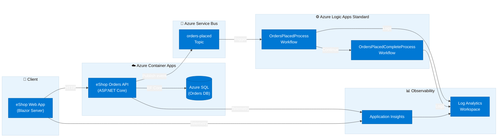

# Azure Logic Apps Monitoring Solution

[](https://dotnet.microsoft.com/)
[](https://learn.microsoft.com/dotnet/aspire/)
[](https://learn.microsoft.com/azure/logic-apps/)
[](https://learn.microsoft.com/azure/container-apps/)
[](./LICENSE)
[](https://learn.microsoft.com/azure/developer/azure-developer-cli/)

A production-ready reference implementation for monitoring Azure Logic Apps Standard workflows using .NET Aspire orchestration, Application Insights, and an end-to-end eShop Orders domain spanning a REST API, a Blazor web frontend, and event-driven Logic Apps workflows — all deployable to Azure with a single `azd up`.

## Architecture

**Overview**

The solution follows a cloud-native, event-driven architecture with three distinct layers: an API and web frontend deployed as Azure Container Apps, an event backbone built on Azure Service Bus, and Azure Logic Apps Standard workflows that react to order events. All components emit OpenTelemetry traces and metrics to Application Insights via a shared Log Analytics workspace.



**Component Roles:**

- **eShop Web App** — Blazor Server frontend for browsing and placing orders; references the Orders API via .NET Aspire service discovery
- **eShop Orders API** — ASP.NET Core REST API that persists orders to Azure SQL and publishes `orders-placed` events to Service Bus
- **Azure Service Bus** — Decoupling layer; the `orders-placed` topic triggers downstream Logic Apps workflows
- **Logic Apps Standard** — Event-driven workflows (`OrdersPlacedProcess`, `OrdersPlacedCompleteProcess`) implementing the order fulfilment pipeline
- **Application Insights + Log Analytics** — End-to-end distributed tracing and monitoring for all components
- **.NET Aspire AppHost** — Local orchestration and Azure resource provisioning via `azd`

## Features

**Overview**

This solution provides a complete blueprint for building observable, event-driven systems on Azure — from local development through to production. It demonstrates how to combine .NET Aspire, Azure Logic Apps Standard, and Azure Container Apps with enterprise-grade monitoring.

> 💡 **Why This Matters**: Reduces the time to build a production-ready, monitored Azure solution from weeks to hours by providing a fully wired, one-command deployment template.

> 📌 **How It Works**: .NET Aspire orchestrates local development resources (emulators, containers), while `azd` provisions and deploys the identical topology to Azure Container Apps and Logic Apps Standard using Infrastructure-as-Code Bicep templates.

| Feature                         | Description                                                     | Status    |
| ------------------------------- | --------------------------------------------------------------- | --------- |
| ⚙️ .NET Aspire Orchestration    | Full local development loop with emulated Service Bus and SQL   | ✅ Stable |
| 🚀 One-Command Azure Deployment | `azd up` provisions all infrastructure and deploys all services | ✅ Stable |
| 📊 End-to-End Observability     | OpenTelemetry traces across API, Web App, and Logic Apps        | ✅ Stable |
| 📨 Event-Driven Order Pipeline  | Service Bus topics trigger Logic Apps Standard workflows        | ✅ Stable |
| 🔐 Managed Identity Auth        | Zero-credential architecture; all Azure resources use UAMI      | ✅ Stable |
| 🗄️ Azure SQL with EF Core       | Orders persistence with retry-on-failure and migrations         | ✅ Stable |
| 🌐 Blazor Server Frontend       | Fluent UI–based order management UI with SignalR                | ✅ Stable |
| 🔒 VNet Integration             | Container Apps and Logic Apps isolated in dedicated subnets     | ✅ Stable |
| 🧪 Test Suites                  | Unit and integration test projects for all components           | ✅ Stable |

## Requirements

**Overview**

The solution targets .NET 10 and requires the Azure Developer CLI for cloud deployments. All local dependencies (SQL, Service Bus) are handled automatically by .NET Aspire using emulators and containers.

> ⚠️ **Note**: Docker Desktop (or an equivalent OCI runtime) is required for local development because .NET Aspire spins up the Azure Service Bus emulator and SQL Server as containers.

| Prerequisite                   | Minimum Version | Purpose                                          | Install                                                       |
| ------------------------------ | --------------- | ------------------------------------------------ | ------------------------------------------------------------- |
| 🟣 .NET SDK                    | 10.0.100        | Build and run all projects                       | [dotnet.microsoft.com](https://dotnet.microsoft.com/download) |
| 🔵 Azure Developer CLI (`azd`) | 1.11.0          | Provision and deploy to Azure                    | [aka.ms/azd](https://aka.ms/azd)                              |
| 🔵 Azure CLI                   | 2.60.0          | Azure authentication and resource management     | [aka.ms/azure-cli](https://aka.ms/azure-cli)                  |
| 🐳 Docker Desktop              | Latest          | Container runtime for local Aspire orchestration | [docker.com](https://www.docker.com/products/docker-desktop/) |
| ☁️ Azure Subscription          | —               | Target subscription for `azd up`                 | [portal.azure.com](https://portal.azure.com)                  |
| 💻 PowerShell                  | 7.0+            | Pre/post-provisioning hooks                      | Included in .NET SDK                                          |

## Quick Start

**Local development** — run the full stack with emulators in under 5 minutes:

```bash
# 1. Clone the repository
git clone https://github.com/Evilazaro/Azure-LogicApps-Monitoring.git
cd Azure-LogicApps-Monitoring

# 2. Start the .NET Aspire AppHost (launches API, Web App, Service Bus emulator, SQL)
dotnet run --project app.AppHost/app.AppHost.csproj
```

Open the **Aspire Dashboard** URL printed in the terminal to see all running services and their traces.

**Deploy to Azure** with a single command:

```bash
# 1. Authenticate with Azure
azd auth login

# 2. Create a new environment
azd env new my-env

# 3. Provision infrastructure and deploy all services (~15 minutes)
azd up
```

> 💡 **Tip**: `azd up` runs `preprovision.ps1` to validate prerequisites and `postprovision.ps1` to configure managed identity SQL access and .NET user secrets automatically.

## Deployment

**Overview**

The deployment pipeline uses the Azure Developer CLI (`azd`) backed by Bicep Infrastructure-as-Code. All resources are scoped to an Azure subscription and organized into a single resource group with a deterministic naming convention (`rg-{solution}-{env}-{location}`).

> ⚠️ **Note**: The pre-provisioning script (`hooks/preprovision.ps1`) validates all required tools and can auto-install missing prerequisites with the `-AutoInstall` flag.

### Step-by-Step Deployment

```bash
# Step 1: Validate prerequisites (optional dry run)
./hooks/preprovision.ps1 -ValidateOnly

# Step 2: Authenticate
azd auth login

# Step 3: Create environment and set location
azd env new production
azd env set AZURE_LOCATION eastus2

# Step 4: Provision infrastructure + deploy apps
azd up

# Step 5: Generate sample orders (optional smoke test)
./hooks/Generate-Orders.ps1
```

### Deployed Azure Resources

| Resource                          | Type                     | Purpose                            |
| --------------------------------- | ------------------------ | ---------------------------------- |
| 🏗️ Container Apps Environment     | Azure Container Apps     | Hosts Orders API and Web App       |
| 📦 Container Registry             | Azure Container Registry | Stores container images            |
| ⚙️ Logic App Standard             | Azure Logic Apps         | Order event workflows              |
| 📨 Service Bus Namespace          | Azure Service Bus        | Event backbone                     |
| 🗄️ Azure SQL Database             | Azure SQL                | Orders persistence                 |
| 📊 Application Insights           | Azure Monitor            | Distributed tracing                |
| 📋 Log Analytics Workspace        | Azure Monitor            | Centralized logs and metrics       |
| 🔐 User-Assigned Managed Identity | Azure Identity           | Zero-credential authentication     |
| 🌐 Virtual Network                | Azure Networking         | Subnet isolation for all workloads |

### Infrastructure Environments

```bash
# Supported environment names (defined in Bicep @allowed)
dev | test | staging | prod
```

## Configuration

**Overview**

Configuration is layered: `appsettings.json` provides defaults, `appsettings.Development.json` overrides for local development, and Azure Key Vault / .NET User Secrets are populated automatically by `postprovision.ps1` after `azd` provisioning.

> 📌 **How It Works**: The `postprovision.ps1` hook reads `azd` environment output variables (e.g., `AZURE_SERVICE_BUS_NAMESPACE`, `APPLICATIONINSIGHTS_CONNECTION_STRING`) and writes them into .NET User Secrets for each project, so no manual configuration is needed after `azd up`.

### Key Configuration Values

| Key                                     | Project    | Description                        | Source                    |
| --------------------------------------- | ---------- | ---------------------------------- | ------------------------- |
| `ConnectionStrings:OrderDb`             | Orders API | Azure SQL connection string        | `azd` env output / Aspire |
| `Azure:ServiceBus:HostName`             | Orders API | Service Bus FQDN                   | `azd` env output          |
| `APPLICATIONINSIGHTS_CONNECTION_STRING` | All        | Application Insights telemetry     | `azd` env output          |
| `Azure:TenantId`                        | AppHost    | Tenant for local dev Azure auth    | User Secrets              |
| `Azure:ClientId`                        | AppHost    | Client ID for local dev Azure auth | User Secrets              |

### AppHost Local Secrets Example

```json
{
  "Azure:TenantId": "<your-tenant-id>",
  "Azure:ClientId": "<your-client-id>",
  "Azure:ResourceGroup": "<your-resource-group>"
}
```

Set with `dotnet user-secrets set` in the `app.AppHost/` directory:

```bash
dotnet user-secrets set "Azure:TenantId" "<your-tenant-id>" --project app.AppHost/app.AppHost.csproj
dotnet user-secrets set "Azure:ClientId" "<your-client-id>" --project app.AppHost/app.AppHost.csproj
```

### HTTP Client Resilience (Orders API)

The Orders API ships with preconfigured resilience via .NET Aspire service defaults — configurable in `appsettings.json`:

```json
{
  "HttpClient": {
    "OrdersAPIService": {
      "Timeout": "00:02:00",
      "Resilience": {
        "AttemptTimeout": "00:00:30",
        "TotalRequestTimeout": "00:01:30",
        "Retry": { "MaxRetryAttempts": 2 }
      }
    }
  }
}
```

## Usage

**Overview**

Once deployed (or running locally), there are three primary interaction surfaces: the Blazor Web UI, the Orders REST API, and the Logic Apps workflows triggered automatically by Service Bus events.

### Place an Order via the REST API

```bash
curl -X POST https://<orders-api-url>/api/orders \
  -H "Content-Type: application/json" \
  -d '{
    "id": "order-001",
    "customerId": "customer-123",
    "total": 99.99,
    "products": [
      { "sku": "PROD-001", "quantity": 2, "price": 49.99 }
    ]
  }'
```

Expected response (`201 Created`):

```json
{
  "id": "order-001",
  "customerId": "customer-123",
  "status": "Placed",
  "total": 99.99,
  "products": [...]
}
```

### Retrieve Orders

```bash
# Get all orders
curl https://<orders-api-url>/api/orders

# Get a specific order
curl https://<orders-api-url>/api/orders/order-001
```

### Generate Bulk Orders (Load Test)

```bash
# Generate sample orders to trigger the Logic Apps pipeline
./hooks/Generate-Orders.ps1
```

### OpenAPI / Swagger UI

The Orders API exposes Swagger UI at `/swagger` in development mode. In Azure, the OpenAPI spec is available at `/openapi/v1.json`.

### Monitor Workflows

After orders are placed, the Logic Apps workflows (`OrdersPlacedProcess` → `OrdersPlacedCompleteProcess`) are triggered via Service Bus. Monitor execution in:

- **Azure Portal** → Logic App → Workflow runs
- **Application Insights** → Transaction search (search by `order.id`)
- **Log Analytics** → Query `AppDependencies` and `AppRequests` tables

## Contributing

**Overview**

Contributions are welcome! This project follows standard GitHub flow with feature branches, pull requests, and automated CI validation.

> 📌 **How It Works**: Fork the repository, create a feature branch from `main`, implement your changes, and open a pull request. The CI pipeline validates builds, tests, and infrastructure linting automatically.

### Development Workflow

```bash
# Fork and clone
git clone https://github.com/<your-fork>/Azure-LogicApps-Monitoring.git
cd Azure-LogicApps-Monitoring

# Create a feature branch
git checkout -b feature/my-improvement

# Build the solution
dotnet build app.sln

# Run tests
dotnet test app.sln

# Validate infrastructure (requires Bicep CLI)
az bicep build --file infra/main.bicep

# Push and open a PR
git push origin feature/my-improvement
```

### Project Structure

| Path                             | Description                                                 |
| -------------------------------- | ----------------------------------------------------------- |
| 📁 `app.AppHost/`                | .NET Aspire orchestration host                              |
| 📁 `app.ServiceDefaults/`        | Shared service configuration (OpenTelemetry, health checks) |
| 📁 `src/eShop.Orders.API/`       | ASP.NET Core Orders REST API                                |
| 📁 `src/eShop.Web.App/`          | Blazor Server web frontend                                  |
| 📁 `src/tests/`                  | Unit and integration test projects                          |
| 📁 `workflows/OrdersManagement/` | Azure Logic Apps Standard workflow definitions              |
| 📁 `infra/`                      | Bicep Infrastructure-as-Code templates                      |
| 📁 `hooks/`                      | `azd` pre/post-provisioning PowerShell scripts              |
| 📁 `prompts/`                    | AI prompt templates for documentation and diagramming       |

## License

This project is licensed under the **MIT License** — see the [LICENSE](./LICENSE) file for details.

---

> 💡 **Resources**: [Azure Logic Apps Standard Docs](https://learn.microsoft.com/azure/logic-apps/logic-apps-overview) · [.NET Aspire Docs](https://learn.microsoft.com/dotnet/aspire/) · [Azure Developer CLI Docs](https://learn.microsoft.com/azure/developer/azure-developer-cli/) · [Azure Container Apps Docs](https://learn.microsoft.com/azure/container-apps/)
