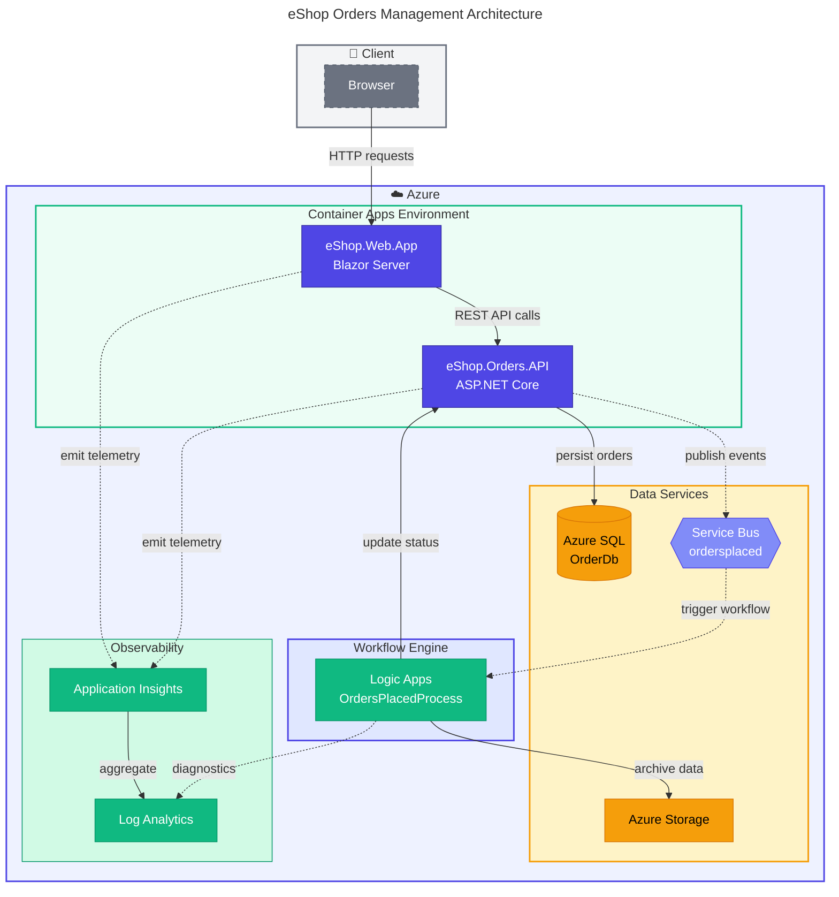

# Azure Logic Apps Monitoring Solution

[](https://dotnet.microsoft.com/)
[](https://learn.microsoft.com/dotnet/aspire/)
[](https://azure.microsoft.com/)
[](https://learn.microsoft.com/azure/developer/azure-developer-cli/)
[](LICENSE)
[](https://github.com/Evilazaro/Azure-LogicApps-Monitoring/actions)

A cloud-native distributed application for **eShop Order Management** built on Microsoft Azure, demonstrating enterprise-grade patterns for monitoring, observability, and event-driven architecture using Azure Logic Apps Standard.

---

## Table of Contents

- [Overview](#-overview)
- [Architecture](#%EF%B8%8F-architecture)
- [Quick Start](#-quick-start)
- [Project Structure](#-project-structure)
- [Technology Stack](#-technology-stack)
- [Projects](#-projects)
- [Testing](#-testing)
- [Deployment](#-deployment)
- [Documentation](#-documentation)
- [Security](#-security)
- [Contributing](#-contributing)
- [License](#-license)
- [Resources](#-resources)

---

## 📋 Overview

The eShop Orders Management solution implements a modern distributed architecture using .NET Aspire for service orchestration. The system features a Blazor Server frontend, ASP.NET Core Web API backend, and Azure Logic Apps workflows for asynchronous order processing—all with comprehensive monitoring and observability.

### Solution Summary

| Component         | Technology                           | Purpose                                     |
| :---------------- | :----------------------------------- | :------------------------------------------ |
| **Frontend**      | Blazor Server + Fluent UI            | Interactive web application                 |
| **Backend**       | ASP.NET Core Web API                 | RESTful order management services           |
| **Orchestration** | .NET Aspire 13.1.0                   | Service orchestration and local development |
| **Workflow**      | Azure Logic Apps Standard            | Asynchronous order processing               |
| **Database**      | Azure SQL Database                   | Order data persistence                      |
| **Messaging**     | Azure Service Bus                    | Event-driven pub/sub messaging              |
| **Containers**    | Azure Container Apps                 | Managed Kubernetes hosting                  |
| **Observability** | Application Insights + Log Analytics | Distributed tracing and monitoring          |

---

## 🏗️ Architecture



---

## 🚀 Quick Start

### Prerequisites

| Requirement             | Version  | Purpose                        |
| :---------------------- | :------- | :----------------------------- |
| .NET SDK                | 10.0     | Application runtime            |
| Azure CLI               | ≥ 2.60.0 | Azure resource management      |
| Azure Developer CLI     | ≥ 1.11.0 | Simplified deployment workflow |
| Docker Desktop          | Latest   | Local container development    |
| Visual Studio / VS Code | Latest   | Development IDE                |

### Option 1: Deploy to Azure (Recommended)

> 📋 **Prerequisites**: Ensure you have Azure CLI and Azure Developer CLI installed before proceeding.

```powershell
# Clone the repository
git clone https://github.com/Evilazaro/Azure-LogicApps-Monitoring.git
cd Azure-LogicApps-Monitoring

# Authenticate with Azure
azd auth login

# Create a new environment and deploy
azd env new dev
azd up
```

> ✅ **Success**: After deployment completes, the Azure Portal URL and application endpoints are displayed in the terminal.

### Option 2: Run Locally with .NET Aspire

```powershell
# Clone the repository
git clone https://github.com/Evilazaro/Azure-LogicApps-Monitoring.git
cd Azure-LogicApps-Monitoring

# Restore dependencies
dotnet restore

# Run the Aspire AppHost (launches all services)
dotnet run --project app.AppHost
```

The Aspire Dashboard will open automatically, providing access to:

- **eShop.Web.App**: Blazor frontend at `https://localhost:xxxx`
- **eShop.Orders.API**: REST API at `https://localhost:xxxx`
- **Distributed Tracing**: Real-time telemetry visualization

---

## 📁 Project Structure

```text
Azure-LogicApps-Monitoring/
├── .github/                      # GitHub Actions workflows and configuration
│   ├── workflows/                # CI/CD pipeline definitions
│   │   ├── azure-dev.yml         # Azure deployment workflow
│   │   ├── ci-dotnet.yml         # .NET CI workflow
│   │   └── ci-dotnet-reusable.yml# Reusable CI workflow
│   └── dependabot.yml            # Automated dependency updates
├── .vscode/                      # VS Code workspace settings
├── app.AppHost/                  # .NET Aspire orchestrator
│   ├── AppHost.cs                # Service orchestration configuration
│   └── infra/                    # Container deployment templates
├── app.ServiceDefaults/          # Shared service configuration
│   ├── CommonTypes.cs            # Shared domain types (Order, OrderProduct)
│   └── Extensions.cs             # OpenTelemetry, health checks, resilience
├── docs/                         # Technical documentation
│   └── architecture/             # TOGAF-aligned architecture docs
├── hooks/                        # Azure Developer CLI lifecycle hooks
├── infra/                        # Bicep infrastructure templates
│   ├── main.bicep                # Root deployment template
│   ├── shared/                   # Shared infrastructure (identity, network)
│   └── workload/                 # Application workload resources
├── src/                          # Application source code
│   ├── eShop.Orders.API/         # Backend REST API
│   ├── eShop.Web.App/            # Frontend Blazor application
│   └── tests/                    # Unit and integration tests
├── workflows/                    # Azure Logic Apps workflow definitions
│   └── OrdersManagement/         # Order processing workflows
├── app.sln                       # Visual Studio solution file
├── azure.yaml                    # Azure Developer CLI configuration
├── global.json                   # .NET SDK version configuration
└── LICENSE                       # MIT License
```

---

## 🔧 Technology Stack

| Layer              | Technology                        | Version |
| :----------------- | :-------------------------------- | :------ |
| **Runtime**        | .NET                              | 10.0    |
| **Orchestration**  | .NET Aspire                       | 13.1.0  |
| **Web Framework**  | ASP.NET Core                      | 10.0    |
| **UI Framework**   | Blazor Server + Fluent UI         | 4.13.2  |
| **ORM**            | Entity Framework Core             | 10.0.2  |
| **Database**       | Azure SQL                         | —       |
| **Messaging**      | Azure Service Bus                 | 7.20.1  |
| **Telemetry**      | OpenTelemetry + Azure Monitor     | 1.15.0  |
| **Authentication** | Azure Identity (Managed Identity) | 1.17.1  |
| **Workflow**       | Azure Logic Apps Standard         | —       |
| **Containers**     | Azure Container Apps              | —       |
| **Infrastructure** | Bicep                             | —       |

---

## 📦 Projects

### Application Projects

| Project               | Type             | Description                                           |
| :-------------------- | :--------------- | :---------------------------------------------------- |
| `app.AppHost`         | Aspire Host      | .NET Aspire orchestrator for service configuration    |
| `app.ServiceDefaults` | Class Library    | Shared cross-cutting concerns (telemetry, resilience) |
| `eShop.Orders.API`    | ASP.NET Core API | RESTful API for order management                      |
| `eShop.Web.App`       | Blazor Server    | Interactive web frontend                              |

### Test Projects

| Project                     | Framework | Coverage                         |
| :-------------------------- | :-------- | :------------------------------- |
| `app.AppHost.Tests`         | MSTest    | AppHost configuration and wiring |
| `app.ServiceDefaults.Tests` | MSTest    | Service defaults and extensions  |
| `eShop.Orders.API.Tests`    | MSTest    | API controllers, services, repos |
| `eShop.Web.App.Tests`       | MSTest    | Blazor components and services   |

---

## 🧪 Testing

Run the test suite to verify application functionality:

```powershell
# Run all tests
dotnet test

# Run tests with coverage
dotnet test --collect:"XPlat Code Coverage"

# Run specific test project
dotnet test src/tests/eShop.Orders.API.Tests
```

> 💡 **Tip**: Use `dotnet test --verbosity detailed` for more comprehensive test output.

---

## 🚢 Deployment

### Azure Developer CLI Commands

| Command                  | Description                             |
| :----------------------- | :-------------------------------------- |
| `azd up`                 | Provision infrastructure and deploy app |
| `azd provision`          | Provision Azure infrastructure only     |
| `azd deploy`             | Deploy application code only            |
| `azd down`               | Delete all Azure resources              |
| `azd env list`           | List all environments                   |
| `azd monitor --overview` | Open Application Insights dashboard     |

### CI/CD Pipelines

| Workflow        | Trigger                       | Purpose                    |
| :-------------- | :---------------------------- | :------------------------- |
| `ci-dotnet.yml` | Push/PR to main               | Build, test, code analysis |
| `azure-dev.yml` | Push to main, manual dispatch | Full Azure deployment      |

### Infrastructure Provisioning

The `infra/` folder contains modular Bicep templates:

```text
infra/
├── main.bicep                    # Entry point
├── shared/                       # Shared resources
│   ├── identity/                 # Managed Identity + RBAC
│   ├── monitoring/               # Log Analytics, App Insights
│   ├── network/                  # VNet, Subnets
│   └── data/                     # Storage, SQL
└── workload/                     # Application resources
    ├── messaging/                # Service Bus
    ├── services/                 # Container Apps, ACR
    └── logic-app.bicep           # Logic Apps Standard
```

---

## 📖 Documentation

| Document                                                                  | Description                          |
| :------------------------------------------------------------------------ | :----------------------------------- |
| [Documentation Index](docs/README.md)                                     | Entry point for all documentation    |
| [Architecture Overview](docs/architecture/README.md)                      | TOGAF-aligned architecture framework |
| [Application Architecture](docs/architecture/application-architecture.md) | Services, interfaces, components     |
| [Data Architecture](docs/architecture/data-architecture.md)               | Data entities, flows, security       |
| [Infrastructure README](infra/README.md)                                  | Bicep templates and deployment guide |

---

## 🔐 Security

| Feature                | Implementation                              |
| :--------------------- | :------------------------------------------ |
| **Authentication**     | Azure Entra ID with Managed Identity        |
| **Secrets**            | No hardcoded secrets; uses Managed Identity |
| **Network**            | Private Endpoints for Storage and SQL       |
| **Encryption**         | TLS 1.2 minimum on all resources            |
| **RBAC**               | Least-privilege role assignments            |
| **Dependency Updates** | Dependabot automated security patches       |
| **Code Scanning**      | CodeQL security vulnerability scanning      |

---

## 🤝 Contributing

1. Fork the repository
2. Create a feature branch: `git checkout -b feature/amazing-feature`
3. Commit your changes: `git commit -m 'Add amazing feature'`
4. Push to the branch: `git push origin feature/amazing-feature`
5. Open a Pull Request

### Development Guidelines

- Follow the existing code style and conventions
- Write unit tests for new functionality
- Update documentation for significant changes
- Ensure CI passes before requesting review

---

## 📄 License

This project is licensed under the MIT License - see the [LICENSE](LICENSE) file for details.

---

## 🔗 Resources

| Resource                                                                                | Description                  |
| :-------------------------------------------------------------------------------------- | :--------------------------- |
| [.NET Aspire Documentation](https://learn.microsoft.com/dotnet/aspire/)                 | .NET Aspire overview         |
| [Azure Developer CLI](https://learn.microsoft.com/azure/developer/azure-developer-cli/) | azd documentation            |
| [Azure Logic Apps](https://learn.microsoft.com/azure/logic-apps/)                       | Logic Apps documentation     |
| [Azure Container Apps](https://learn.microsoft.com/azure/container-apps/)               | Container Apps documentation |
| [Bicep Documentation](https://learn.microsoft.com/azure/azure-resource-manager/bicep/)  | Infrastructure as Code       |

---

**Author**: [Evilazaro](https://github.com/Evilazaro)  
**Repository**: [Azure-LogicApps-Monitoring](https://github.com/Evilazaro/Azure-LogicApps-Monitoring)  
**Last Updated**: 2026-01-28
