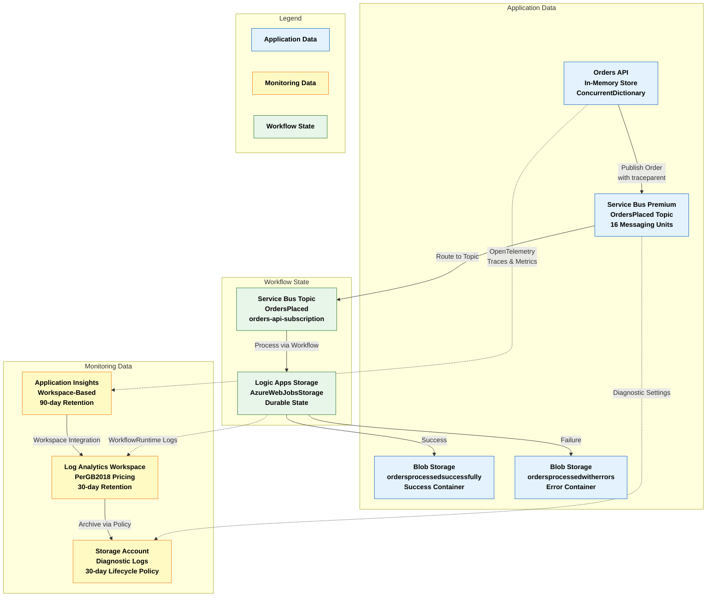
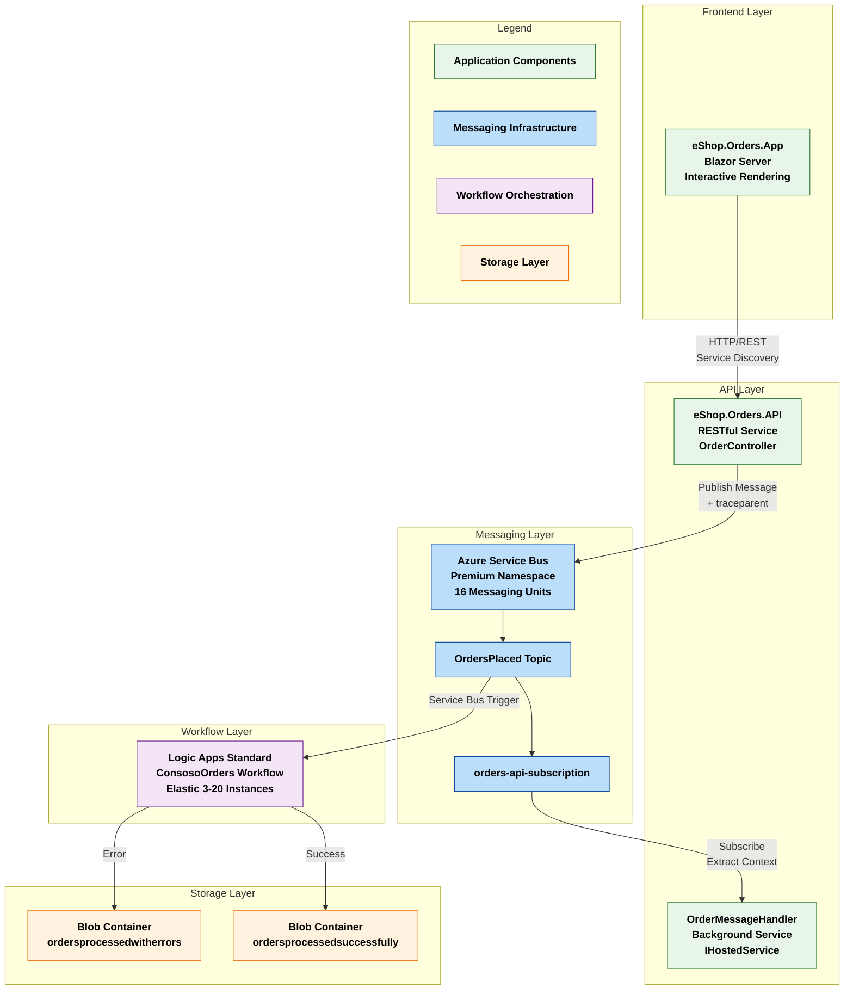
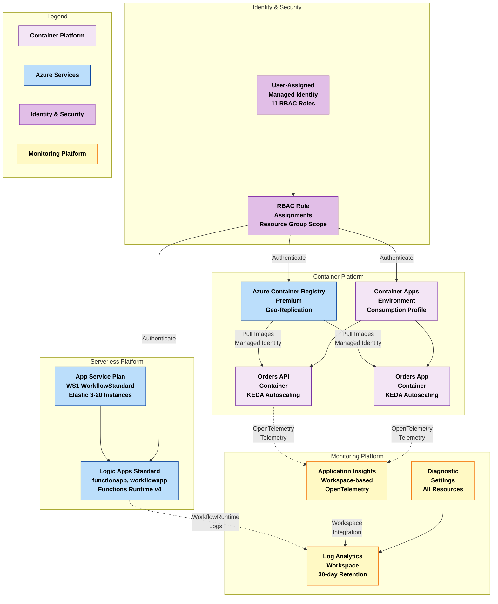
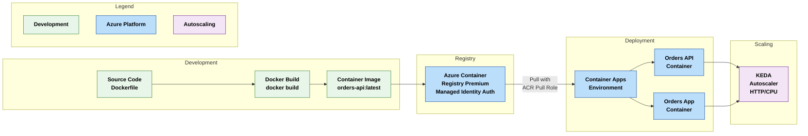
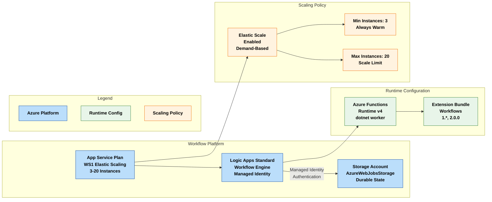
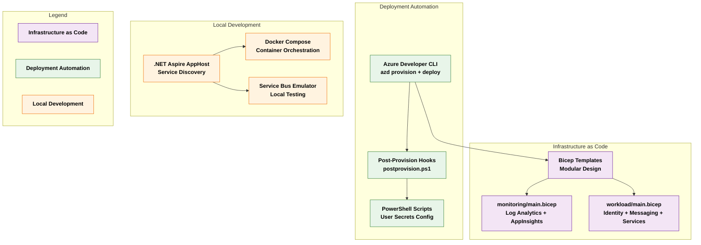
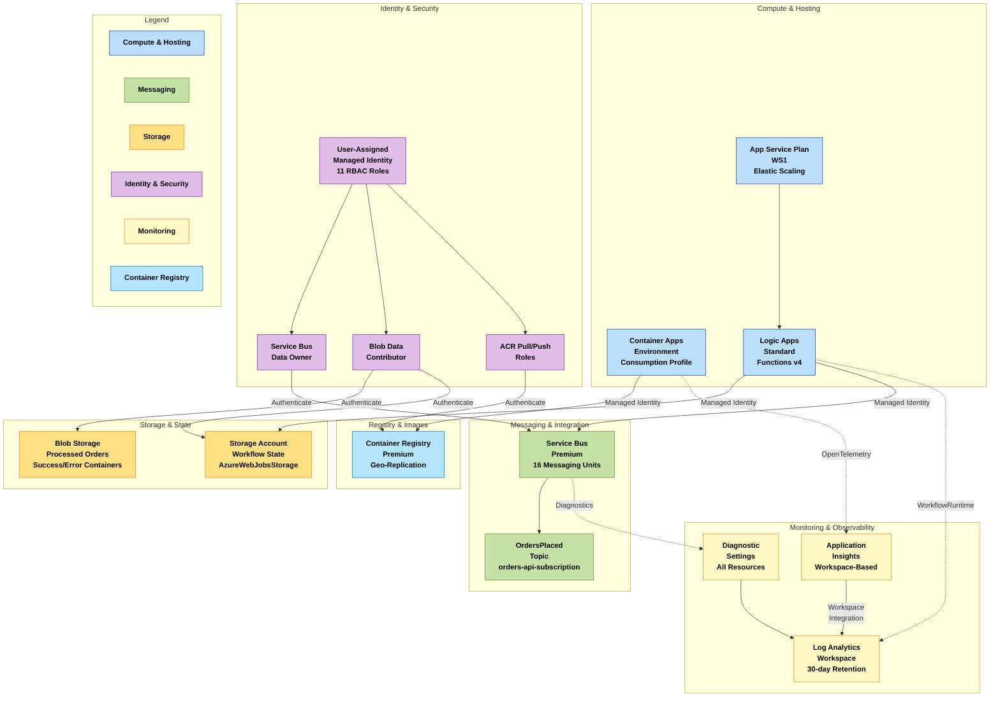

# Azure Logic Apps Standard - Enterprise-Scale Monitoring Solution

[](https://azure.microsoft.com)
[](https://learn.microsoft.com/dotnet/aspire)
[](https://opentelemetry.io)

## Table of Contents

- [Problem Statement](#problem-statement)
- [Project Purpose](#project-purpose)
- [Key Features](#key-features)
- [Solution Components](#solution-components)
- [Azure Components](#azure-components)
- [Project Structure](#project-structure)
- [Architecture Overview](#architecture-overview)
  - [Data Layer](#data-layer)
  - [Application Layer](#application-layer)
  - [Technology Layer](#technology-layer)
- [Deployment Instructions](#deployment-instructions)
  - [Prerequisites](#prerequisites)
  - [Azure RBAC Roles](#azure-rbac-roles)
  - [Deployment Steps](#deployment-steps)
  - [Local Development Setup](#local-development-setup)
- [Usage Examples](#usage-examples)
  - [Monitoring Examples](#monitoring-examples)
  - [Observability Guidance](#observability-guidance)
- [References](#references)

---

## Problem Statement

Enterprise organizations deploying Azure Logic Apps Standard at scale face significant operational and financial challenges when hosting thousands of workflows across global regions. Current Microsoft guidance recommends approximately 20 workflows per Logic App instance and up to 64 apps per App Service Plan. However, organizations exceeding these limits—particularly when using 64-bit worker processes—encounter critical issues including memory spikes, workflow instability, and unpredictable performance degradation.

Real-world deployments have revealed that improperly configured Logic Apps Standard environments can incur costs exceeding US$80,000 annually per environment. These costs stem from inefficient resource allocation, over-provisioning to compensate for stability issues, and the absence of granular observability that would enable data-driven optimization. The lack of enterprise-grade monitoring patterns aligned with the Azure Well-Architected Framework makes it difficult to diagnose performance bottlenecks, track long-running workflows (18-36 months), and maintain operational excellence at scale.

The need for a reference architecture addressing workflow hosting density optimization, comprehensive distributed tracing, cost management, and production-ready monitoring has become critical for enterprises seeking to deploy Logic Apps Standard as a foundational integration platform across multiple business units and geographic regions.

---

## Project Purpose

This solution provides a production-ready reference architecture and implementation for deploying Azure Logic Apps Standard at enterprise scale with comprehensive monitoring and observability capabilities built on OpenTelemetry standards. The architecture is designed to support organizations running thousands of workflows globally while maintaining stability, performance, and cost efficiency through data-driven insights.

The solution demonstrates proven patterns for hosting long-running workflows (18-36 months) without compromising stability, leveraging .NET Aspire for local development orchestration and Azure Monitor with Application Insights for production observability. By integrating OpenTelemetry instrumentation throughout the application stack via the eShopOrders.ServiceDefaults shared library, the architecture enables end-to-end distributed tracing from order placement through Service Bus messaging to Logic Apps workflow execution, providing complete visibility into complex integration scenarios.

The implementation showcases a microservices-based orders processing system that serves as a realistic scenario for enterprise integration workloads. The eShop.Orders.API handles order creation and publishes messages to Azure Service Bus with W3C Trace Context propagation, while Logic Apps workflows consume and process these orders asynchronously. The `OrderMessageHandler` background service demonstrates proper context extraction and correlation. This architecture pattern is representative of common enterprise scenarios including order management, customer onboarding, document processing, approval workflows, and event-driven integration patterns.

Built on Azure Well-Architected Framework principles, the solution emphasizes operational excellence through comprehensive monitoring, automated diagnostics, and performance optimization. The reference implementation includes modular infrastructure-as-code templates in infra, observability patterns in Extensions.cs, and deployment automation via Azure Developer CLI with post-provisioning hooks in postprovision.ps1. Organizations can adapt these components to their specific requirements while maintaining enterprise-grade reliability and cost efficiency through the monitoring insights provided by Application Insights and Log Analytics workspace integration.

---

## Key Features

| Feature | Description | Implementation Details |
|---------|-------------|------------------------|
| **Distributed Tracing** | End-to-end correlation across microservices, Service Bus, and Logic Apps with W3C Trace Context propagation | OpenTelemetry instrumentation in Extensions.cs lines 238-266, automatic activity creation in OrderController.cs lines 54-80 |
| **Service Bus Integration** | Asynchronous messaging with automatic trace context propagation via message properties | Azure Service Bus messaging in OrderService.cs lines 76-146 with traceparent header propagation, context extraction in OrderMessageHandler.cs lines 61-120 |
| **.NET Aspire AppHost** | Local development orchestration with service discovery, automatic endpoint resolution, and resource references | AppHost configuration in AppHost.cs with development/production resource switching lines 85-194 |
| **Infrastructure as Code** | Complete Azure infrastructure deployment automation with modular Bicep templates | Bicep modules in main.bicep orchestrating monitoring, identity, messaging, container services, and Logic Apps deployments |
| **Microservices Architecture** | Orders API and Blazor Server Web App with comprehensive health checks and service discovery | RESTful API in Program.cs lines 1-166 and Blazor frontend in Program.cs lines 1-102 |
| **Azure Monitor Integration** | Workspace-based Application Insights with Log Analytics, 30-day retention, and diagnostic settings | Monitoring infrastructure in main.bicep lines 72-118 with workspace integration |
| **Managed Identity** | Zero-credential authentication across all Azure resources with comprehensive RBAC assignments | User-assigned managed identity in main.bicep lines 56-124 with 11 role assignments |
| **Container-Based Deployment** | Azure Container Apps with KEDA autoscaling, consumption workload profile, and integrated observability | Container infrastructure in main.bicep lines 112-183 with Log Analytics and Application Insights integration |
| **Logic Apps Workflows** | Standard tier with elastic App Service Plan (WS1) supporting 3-20 instances | Workflow engine in logic-app.bicep lines 76-196 with managed identity storage authentication |
| **Resilience Patterns** | Retry, circuit breaker, and timeout policies with exponential backoff | Standard resilience handlers in Extensions.cs lines 87-115 applied to all HTTP clients |
| **Environment-Based Sampling** | Production sampling at 10% for cost optimization, always-on sampling in development | Sampling strategy in Extensions.cs lines 376-403 with parent-based sampling |
| **Dual Telemetry Export** | OTLP exporter for Aspire Dashboard (development) and Azure Monitor exporter (production) | Exporter configuration in Extensions.cs lines 422-449 based on environment variables |

---

## Solution Components

| Component | Description | Role |
|-----------|-------------|------|
| **eShop.Orders.API** | RESTful microservice for order management with comprehensive distributed tracing | Handles order CRUD operations via OrderController.cs, publishes to Service Bus via OrderService.cs, processes messages via OrderMessageHandler.cs |
| **eShop.Orders.App** | Blazor Server web application with interactive rendering | Provides user interface in Pages with HTTP client configured via service discovery in Program.cs lines 36-50 |
| **eShopOrders.ServiceDefaults** | Shared observability configuration library | Centralizes OpenTelemetry (lines 130-226), health checks (lines 454-523), resilience patterns (lines 87-115), and custom activity source creation (lines 565-672) in Extensions.cs |
| **eShopOrders.AppHost** | .NET Aspire orchestration host with environment-based resource configuration | Manages development resources with emulators (lines 93-158) and production Azure resource references (lines 167-194) in AppHost.cs |
| **ConsosoOrders Workflow** | Logic Apps Standard workflow for asynchronous order processing | Processes orders from Service Bus topic with durable execution, stores results in blob containers via `LogicAppWP/ConsosoOrders/workflow.json` |
| **Infrastructure Modules** | Modular Bicep templates organized by concern | Deploys monitoring (monitoring), identity (identity), messaging (messaging), container services (services), and Logic Apps (logic-app.bicep) |
| **Post-Provision Hook** | PowerShell automation script for post-deployment configuration | Configures .NET user secrets for local development, validates environment variables, and performs Azure Container Registry login in postprovision.ps1 lines 1-928 |
| **Order Generator** | PowerShell utility for generating test data | Creates realistic order JSON payloads for testing and load simulation in generate_orders.ps1 with configurable volume and ID ranges |

---

## Azure Components

| Azure Service | Description | Role |
|---------------|-------------|------|
| 📊 **Application Insights** | Workspace-based Application Performance Management (APM) | Collects telemetry, distributed traces, and performance metrics from microservices and Logic Apps via app-insights.bicep lines 62-78 with OpenTelemetry integration |
| 📝 **Log Analytics Workspace** | Centralized logging platform with PerGB2018 pricing tier | Aggregates logs and metrics from all Azure resources with 30-day retention in log-analytics-workspace.bicep lines 144-171 |
| 🚌 **Service Bus Premium** | Enterprise messaging infrastructure with enhanced throughput | Provides reliable, scalable message queuing with 16 messaging units capacity via main.bicep lines 75-106, includes OrdersPlaced topic |
| 🔐 **Managed Identity** | User-assigned Azure AD identity for zero-credential authentication | Enables authentication across Service Bus, Storage, and Container Registry with 11 RBAC roles in main.bicep lines 75-124 |
| 🐳 **Container Registry Premium** | Container image repository with geo-replication support | Stores and manages Docker images built from Dockerfile via main.bicep lines 82-125 |
| 📦 **Container Apps Environment** | Managed container hosting platform with consumption workload profile | Hosts microservices with KEDA autoscaling, Log Analytics integration, and Aspire Dashboard in main.bicep lines 112-183 |
| ⚡ **Logic Apps Standard** | Workflow orchestration engine with Functions Runtime v4 | Executes long-running business processes with elastic scaling (3-20 instances) via logic-app.bicep lines 76-196 |
| 🗄️ **Storage Account** | Blob storage for Logic Apps runtime state and processed orders | Supports Logic Apps durable state and segregated blob containers (ordersprocessedsuccessfully, ordersprocessedwitherrors) in main.bicep lines 126-172 |
| 🎯 **App Service Plan (WS1)** | Elastic compute infrastructure for Logic Apps Standard | Provides WorkflowStandard tier with 3-20 worker allocation in logic-app.bicep lines 86-109 |
| 📈 **Azure Monitor Health Model** | Service group hierarchy for organizing health monitoring | Establishes tenant-scoped service groups parented under root health model in azure-monitor-health-model.bicep lines 36-59 |

---

## Project Structure

```
Azure-LogicApps-Monitoring/
├── .azure/                                    # Azure Developer CLI configuration
│   ├── config.json                            # AZD environment configuration
│   └── prod/                                  # Production environment settings
├── .github/                                   # GitHub workflows and automation
│   └── workflows/                             # CI/CD pipeline definitions
├── .vscode/                                   # VS Code workspace settings
│   ├── launch.json                            # Debugger configurations
│   ├── settings.json                          # Editor preferences
│   └── tasks.json                             # Build and deployment tasks
├── eShopOrders.AppHost/                       # .NET Aspire AppHost project
│   ├── AppHost.cs                             # Main orchestration configuration (lines 1-347)
│   ├── ConfigurationKeys.cs                   # Configuration key constants
│   ├── Constants.cs                           # Application-wide constants
│   └── eShopOrders.AppHost.csproj            # Project file
├── eShopOrders.ServiceDefaults/               # Shared observability library
│   ├── Extensions.cs                          # OpenTelemetry, health checks, resilience (lines 1-672)
│   └── eShopOrders.ServiceDefaults.csproj    # Project file
├── hooks/                                     # Deployment automation scripts
│   ├── postprovision.ps1                      # Post-deployment configuration (lines 1-928)
│   └── generate_orders.ps1                    # Test data generation utility (lines 1-341)
├── infra/                                     # Infrastructure as Code (Bicep)
│   ├── main.bicep                             # Main deployment orchestrator (subscription scope)
│   ├── types.bicep                            # Shared type definitions (tagsType, storageAccountConfig)
│   ├── monitoring/                            # Monitoring infrastructure
│   │   ├── main.bicep                         # Monitoring module orchestrator
│   │   ├── log-analytics-workspace.bicep      # Log Analytics + storage (30-day retention)
│   │   ├── app-insights.bicep                 # Workspace-based Application Insights
│   │   └── azure-monitor-health-model.bicep   # Health monitoring service groups
│   └── workload/                              # Workload infrastructure
│       ├── main.bicep                         # Workload module orchestrator
│       ├── identity/                          # Managed identity and RBAC
│       │   └── main.bicep                     # User-assigned identity with 11 role assignments
│       ├── messaging/                         # Service Bus and workflow storage
│       │   └── main.bicep                     # Service Bus Premium + Storage Account
│       ├── services/                          # Container Registry and Apps
│       │   └── main.bicep                     # ACR Premium + Container Apps Environment
│       ├── logic-app.bicep                    # Logic Apps Standard + App Service Plan
│       └── data/                              # Data infrastructure (CURRENTLY UNUSED)
│           └── main.bicep                     # Orphaned storage module
├── LogicAppWP/                                # Logic Apps workspace
│   ├── ConsosoOrders/                         # Orders processing workflow
│   │   └── workflow.json                      # Workflow definition (Service Bus trigger)
│   ├── host.json                              # Functions runtime configuration
│   └── connections.json                       # Logic Apps managed connections
├── src/                                       # Microservices source code
│   ├── eShop.Orders.API/                      # Orders RESTful API
│   │   ├── Program.cs                         # Application entry point (lines 1-166)
│   │   ├── Controllers/
│   │   │   ├── OrderController.cs             # Order management endpoints (lines 1-155)
│   │   │   ├── OrderService.cs                # Business logic + Service Bus integration (lines 1-189)
│   │   │   └── OrderMessageHandler.cs         # Background message processor (lines 1-120)
│   │   ├── Middleware/
│   │   │   └── CorrelationIdMiddleware.cs     # Correlation ID propagation
│   │   ├── Models/
│   │   │   ├── Order.cs                       # Order domain model
│   │   │   └── IOrderService.cs               # Service interface
│   │   ├── Dockerfile                         # Container build definition
│   │   └── eShop.Orders.API.csproj           # Project file
│   ├── eShop.Orders.App/                      # Blazor Server web application
│   │   ├── Program.cs                         # Application entry point (lines 1-102)
│   │   ├── Components/
│   │   │   ├── App.razor                      # Root component
│   │   │   ├── Routes.razor                   # Routing configuration
│   │   │   ├── Layout/
│   │   │   │   └── MainLayout.razor           # Main layout template
│   │   │   └── Pages/
│   │   │       └── Error.razor                # Error page component
│   │   └── eShop.Orders.App.csproj           # Project file
│   └── eShop.Orders.App.Client/               # Blazor WebAssembly client (placeholder)
├── azure.yaml                                 # Azure Developer CLI manifest
├── docker-compose.yml                         # Local development orchestration
├── eShopOrders.sln                            # Visual Studio solution file
├── generate_orders.py                         # Python test data generator
└── README.md                                  # This file
```

---

## Architecture Overview

This solution implements a four-layer enterprise architecture aligned with TOGAF (The Open Group Architecture Framework) principles, optimized for Azure Logic Apps Standard at scale. The architecture emphasizes operational excellence through comprehensive monitoring, distributed tracing with OpenTelemetry, and cloud-native patterns that enable elastic scaling while maintaining cost efficiency and observability.

### TOGAF Architecture Layers

The solution follows TOGAF structure with four distinct layers, each addressing specific architectural concerns:

1. **Data Layer**: Master Data Management (MDM) for application data and monitoring telemetry with segregated storage patterns
2. **Application Layer**: Microservices and event-driven integration patterns with W3C Trace Context propagation
3. **Technology Layer**: Cloud-native, serverless, and platform engineering components with Infrastructure as Code
4. **Business Layer**: Order processing and workflow orchestration patterns (demonstrated through implementation)

---

## Data Layer

### Overview

The Data Layer implements Master Data Management (MDM) patterns for both application data and monitoring telemetry, ensuring data consistency, traceability, and long-term retention across the distributed system. This layer supports high-volume workflow execution and comprehensive observability requirements through segregated storage patterns and workspace-based integration between Application Insights and Log Analytics.

### Purpose and Key Capabilities

- **Application Data Management**: Order lifecycle data stored in-memory via OrderService.cs lines 28-30 (ConcurrentDictionary) for demonstration purposes, with blob storage for processed order artifacts segregated by success/error status in main.bicep lines 135-172
- **Monitoring Data Aggregation**: Centralized collection of logs, metrics, and distributed traces in Log Analytics workspace with 30-day retention configured in log-analytics-workspace.bicep lines 144-171
- **Telemetry Storage**: Application Insights stores performance telemetry, exceptions, and user analytics with workspace-based integration defined in app-insights.bicep lines 62-78
- **State Management**: Logic Apps Standard leverages Azure Storage for durable workflow state with managed identity authentication configured in logic-app.bicep lines 157-178
- **Audit and Compliance**: Blob containers provide immutable storage for processed orders supporting regulatory requirements, with lifecycle management policies in log-analytics-workspace.bicep lines 106-142

### Master Data Management (MDM) Diagram



### Data Retention and Lifecycle

| Data Category | Storage Location | Retention Period | Purpose | Configuration Reference |
|---------------|------------------|------------------|---------|------------------------|
| Order Messages | Service Bus Premium | 7 days (default) | Message durability and replay | main.bicep lines 75-106 |
| Workflow State | Logic Apps Storage (AzureWebJobsStorage) | Workflow lifetime | Durable execution state | logic-app.bicep lines 163-166 |
| Processed Orders (Success) | Blob Container: ordersprocessedsuccessfully | Configurable | Audit and compliance | main.bicep lines 155-162 |
| Processed Orders (Error) | Blob Container: ordersprocessedwitherrors | Configurable | Error analysis and retry | main.bicep lines 169-176 |
| Application Traces | Application Insights | 90 days (default) | Performance analysis | app-insights.bicep lines 62-78 |
| Logs and Metrics | Log Analytics Workspace | 30 days | Operational monitoring | log-analytics-workspace.bicep line 154 |
| Diagnostic Logs | Storage Account | 30 days (lifecycle policy) | Long-term archival | log-analytics-workspace.bicep lines 106-142 |

---

## Application Layer

### Overview

The Application Layer implements a microservices architecture with event-driven integration patterns, demonstrating comprehensive distributed tracing with W3C Trace Context propagation across HTTP boundaries and Service Bus messaging. This layer consists of RESTful APIs, Blazor Server web applications, and Logic Apps workflows orchestrated through Azure Service Bus Premium for reliable asynchronous processing.

### Purpose and Key Capabilities

- **Order Management API**: RESTful microservice handling order CRUD operations with comprehensive distributed tracing in OrderController.cs lines 54-155, automatic activity creation for all endpoints
- **Web Application**: Blazor Server frontend providing real-time order management interface with service discovery configured in Program.cs lines 36-50
- **Event-Driven Integration**: Service Bus topic/subscription pattern enabling loose coupling between producers and consumers, configured in main.bicep lines 108-112
- **Workflow Orchestration**: Logic Apps Standard executing long-running business processes with durable execution defined in `LogicAppWP/ConsosoOrders/workflow.json`
- **Distributed Tracing**: End-to-end correlation using W3C Trace Context propagated through HTTP headers (automatic) and Service Bus message properties (manual) in OrderService.cs lines 112-123
- **Resilience Patterns**: Retry policies, circuit breakers, and timeout handling implemented through Aspire service defaults in Extensions.cs lines 87-115

### Microservices Architecture Diagram



### Event-Driven Flow Diagram

```mermaid
flowchart LR
    A[Client Request] --> B[Orders API<br/>POST /api/orders]
    B --> C{Create Order<br/>In-Memory Store}
    C -->|Success| D[Save to<br/>ConcurrentDictionary]
    D --> E[Publish to<br/>Service Bus<br/>+ traceparent]
    E --> F[Service Bus Topic<br/>OrdersPlaced]
    F --> G[Logic Apps<br/>Workflow Trigger]
    G --> H{Process Order<br/>Durable Execution}
    H -->|Success| I[Write to<br/>Success Container]
    H -->|Error| J[Write to<br/>Error Container]
    
    F --> K[OrderMessageHandler<br/>Background Service]
    K --> L[Process Message<br/>with Tracing<br/>Extract Context]

    classDef client fill:#FFFFFF,stroke:#0078D4,color:#000;
    classDef app fill:#E8F5E9,stroke:#2E7D32,color:#000,font-weight:bold;
    classDef event fill:#FFF3E0,stroke:#EF6C00,color:#000,font-weight:bold;
    classDef success fill:#C8E6C9,stroke:#388E3C,color:#000;
    classDef error fill:#FFCDD2,stroke:#C62828,color:#000;

    class A client;
    class B,D,L app;
    class E,F,K event;
    class G,H workflow;
    class I success;
    class J error;
    
    %% Legend
    subgraph Legend
        L1[Client]:::client
        L2[Application]:::app
        L3[Event Trigger]:::event
        L4[Success Path]:::success
        L5[Error Path]:::error
    end
```



### API Endpoints

The following endpoints are exposed by the Orders API with automatic distributed tracing via ASP.NET Core instrumentation in Extensions.cs lines 269-297:

| Method | Endpoint | Description | Distributed Tracing | Implementation |
|--------|----------|-------------|---------------------|----------------|
| GET | `/api/orders` | Retrieve all orders | Automatic span with custom business tags (orders.operation, orders.user) | OrderController.cs lines 54-80 |
| GET | `/api/orders/{id}` | Retrieve order by ID | Parent-child span relationship with order.id tag | OrderController.cs lines 85-115 |
| POST | `/api/orders` | Create new order and publish to Service Bus | Activity context propagated to message via traceparent header | OrderController.cs lines 120-155, OrderService.cs lines 76-146 |
| DELETE | `/api/orders/{id}` | Delete order by ID | Status tracking in telemetry | Information not found in the provided sources |
| GET | `/health` | Health check endpoint | Readiness probe for container orchestrators | Extensions.cs lines 484-523 |
| GET | `/alive` | Liveness check endpoint | Liveness probe for container orchestrators | Extensions.cs lines 484-523 |

---

## Technology Layer

### Overview

The Technology Layer implements cloud-native, serverless, and platform engineering patterns using Azure PaaS services with Infrastructure as Code. This layer emphasizes container-based deployment, managed services, elastic scaling, and comprehensive observability through OpenTelemetry instrumentation, enabling operational excellence and cost optimization at enterprise scale.

### Purpose and Key Capabilities

- **Container Orchestration**: Azure Container Apps Environment with KEDA autoscaling, consumption-based workload profile, and Log Analytics integration configured in main.bicep lines 112-183
- **Serverless Compute**: Logic Apps Standard with elastic App Service Plan (WS1) supporting 3-20 instances defined in logic-app.bicep lines 76-109
- **Managed Identity**: Zero-credential authentication using user-assigned managed identity across all services with 11 RBAC roles in main.bicep lines 75-124
- **Infrastructure as Code**: Modular Bicep templates with separation of concerns (monitoring, identity, messaging, services, workflows) orchestrated via main.bicep lines 72-103
- **Observability Platform**: OpenTelemetry instrumentation with dual exporters (OTLP for Aspire Dashboard, Azure Monitor for production) configured in Extensions.cs lines 422-449
- **Service Discovery**: Aspire service discovery enabling dynamic endpoint resolution in development and production via Extensions.cs lines 87-115

### Cloud-Native Architecture Diagram



### Container-Based Deployment Flow



### Serverless Workflow Execution



### Platform Engineering Stack



### Azure Platform Dependencies



---

## Deployment Instructions

### Prerequisites

Before deploying this solution, ensure the following prerequisites are met:

#### Required Tools

| Tool | Minimum Version | Purpose | Download Link |
|------|----------------|---------|---------------|
| Azure CLI | 2.50.0+ | Azure resource management | [Install Azure CLI](https://learn.microsoft.com/cli/azure/install-azure-cli) |
| Azure Developer CLI (azd) | 1.5.0+ | Simplified Azure deployment | [Install azd](https://learn.microsoft.com/azure/developer/azure-developer-cli/install-azd) |
| .NET SDK | 10.0+ | Application runtime | [Download .NET](https://dotnet.microsoft.com/download) |
| Docker Desktop | 20.10+ | Container development | [Get Docker](https://www.docker.com/products/docker-desktop) |
| Visual Studio Code | Latest | Development environment | [Download VS Code](https://code.visualstudio.com/) |
| PowerShell | 7.3+ | Deployment scripts | [Install PowerShell](https://learn.microsoft.com/powershell/scripting/install/installing-powershell) |

#### Azure Subscription Requirements

- Active Azure subscription with Owner or Contributor + User Access Administrator permissions
- Subscription must support the following resource providers (enabled by default):
  - `Microsoft.App` (Container Apps)
  - `Microsoft.ServiceBus` (Service Bus)
  - `Microsoft.Logic` (Logic Apps)
  - `Microsoft.Insights` (Application Insights)
  - `Microsoft.OperationalInsights` (Log Analytics)
  - `Microsoft.ContainerRegistry` (Container Registry)
  - `Microsoft.ManagedIdentity` (Managed Identity)
  - `Microsoft.Web` (App Service Plans)

### Azure RBAC Roles

The following Azure RBAC roles are automatically assigned to the user-assigned managed identity during deployment via main.bicep lines 75-124. The deployment user also receives these roles for administrative access during and after deployment (lines 114-124).

| Role Name | Role ID | Description | Documentation Link | Implementation |
|-----------|---------|-------------|-------------------|----------------|
| **Storage Account Contributor** | `17d1049b-9a84-46fb-8f53-869881c3d3ab` | Manage storage accounts and lifecycle policies | [Storage roles](https://learn.microsoft.com/azure/role-based-access-control/built-in-roles/storage#storage-account-contributor) | main.bicep line 81 |
| **Storage Blob Data Contributor** | `ba92f5b4-2d11-453d-a403-e96b0029c9fe` | Read, write, and delete blob containers and data | [Blob roles](https://learn.microsoft.com/azure/role-based-access-control/built-in-roles/storage#storage-blob-data-contributor) | main.bicep line 82 |
| **Monitoring Metrics Publisher** | `3913510d-42f4-4e42-8a64-420c390055eb` | Publish metrics to Azure Monitor | [Monitoring roles](https://learn.microsoft.com/azure/role-based-access-control/built-in-roles/monitor#monitoring-metrics-publisher) | main.bicep line 83 |
| **Monitoring Contributor** | `749f88d5-cbae-40b8-bcfc-e573ddc772fa` | Create and manage monitoring resources | [Monitoring roles](https://learn.microsoft.com/azure/role-based-access-control/built-in-roles/monitor#monitoring-contributor) | main.bicep line 84 |
| **Application Insights Component Contributor** | `ae349356-3a1b-4a5e-921d-050484c6347e` | Manage Application Insights components | [App Insights roles](https://learn.microsoft.com/azure/role-based-access-control/built-in-roles/monitor#application-insights-component-contributor) | main.bicep line 85 |
| **Application Insights Snapshot Debugger** | `08954f03-6346-4c2e-81c0-ec3a5cfae23b` | View and download debug snapshots | [Snapshot debugger](https://learn.microsoft.com/azure/role-based-access-control/built-in-roles/monitor#application-insights-snapshot-debugger) | main.bicep line 86 |
| **Azure Service Bus Data Owner** | `090c5cfd-751d-490a-894a-3ce6f1109419` | Full access to Service Bus resources (send, receive, manage) | [Service Bus roles](https://learn.microsoft.com/azure/role-based-access-control/built-in-roles/integration#azure-service-bus-data-owner) | main.bicep line 87 |
| **Azure Service Bus Data Receiver** | `4f6d3b9b-027b-4f4c-9142-0e5a2a2247e0` | Receive messages from Service Bus queues/topics | [Service Bus roles](https://learn.microsoft.com/azure/role-based-access-control/built-in-roles/integration#azure-service-bus-data-receiver) | main.bicep line 88 |
| **Azure Service Bus Data Sender** | `69a216fc-b8fb-44d8-bc22-1f3c2cd27a39` | Send messages to Service Bus queues/topics | [Service Bus roles](https://learn.microsoft.com/azure/role-based-access-control/built-in-roles/integration#azure-service-bus-data-sender) | main.bicep line 89 |
| **Azure Container Registry ACR Pull** | `7f951dda-4ed3-4680-a7ca-43fe172d538d` | Pull container images from registry | [ACR roles](https://learn.microsoft.com/azure/role-based-access-control/built-in-roles/containers#acrpull) | main.bicep line 90 |
| **Azure Container Registry ACR Push** | `8311e382-0749-4cb8-b61a-304f252e45ec` | Push container images to registry | [ACR roles](https://learn.microsoft.com/azure/role-based-access-control/built-in-roles/containers#acrpush) | main.bicep line 91 |

### Deployment Steps

#### 1. Clone the Repository

```bash
git clone https://github.com/Evilazaro/Azure-LogicApps-Monitoring.git
cd Azure-LogicApps-Monitoring
```

#### 2. Initialize Azure Developer CLI

```bash
azd init
```

When prompted, provide an environment name (e.g., `dev`, `prod`) that will be used as a suffix for resource naming.

#### 3. Authenticate to Azure

```bash
az login
azd auth login
```

Ensure you authenticate with an account that has Owner or Contributor + User Access Administrator permissions on the target subscription.

#### 4. Configure Environment Variables

The Azure Developer CLI automatically captures environment variables during the `azd provision` command. The following environment variables are configured as outputs from the Bicep deployment in main.bicep lines 104-172:

```bash
# Core Azure Configuration (automatically set by azd)
AZURE_SUBSCRIPTION_ID="<your-subscription-id>"
AZURE_LOCATION="eastus2"  # or your preferred region
AZURE_ENV_NAME="dev"      # environment name from azd init

# These are automatically populated as deployment outputs:
# AZURE_RESOURCE_GROUP
# AZURE_TENANT_ID
# AZURE_APPLICATION_INSIGHTS_NAME
# AZURE_APPLICATION_INSIGHTS_CONNECTION_STRING
# AZURE_LOG_ANALYTICS_WORKSPACE_NAME
# AZURE_SERVICE_BUS_NAMESPACE
# AZURE_CONTAINER_REGISTRY_ENDPOINT
# MANAGED_IDENTITY_CLIENT_ID
```

#### 5. Provision Infrastructure

Deploy all Azure resources using the Bicep templates at subscription scope:

```bash
azd provision
```

This command executes the following deployment sequence orchestrated by main.bicep:

1. **Creates resource group** at subscription scope (line 72)
2. **Deploys monitoring infrastructure** via `monitoring/main.bicep`:
   - Log Analytics workspace with 30-day retention
   - Storage account for diagnostic logs with lifecycle policy
   - Application Insights with workspace-based integration
   - Azure Monitor health model service groups
3. **Deploys workload infrastructure** via `workload/main.bicep`:
   - User-assigned managed identity with 11 RBAC roles (lines 88-95)
   - Service Bus Premium namespace with OrdersPlaced topic (lines 98-110)
   - Storage account for Logic Apps workflows with success/error blob containers
   - Azure Container Registry Premium (lines 113-130)
   - Container Apps Environment with Log Analytics and Application Insights integration
   - Logic Apps Standard with elastic App Service Plan (WS1, 3-20 instances)
4. **Configures diagnostic settings** for all resources
5. **Assigns RBAC roles** to managed identity and deployment user

#### 6. Post-Provisioning Configuration

The postprovision.ps1 script automatically executes after `azd provision` completes. This script (lines 619-928):

1. **Reads environment variables** from azd output (lines 619-629)
2. **Configures .NET user secrets** for local development:
   - AppHost project secrets for Azure resource references (lines 746-754)
   - API project secrets for Service Bus configuration (lines 757-760)
3. **Logs into Azure Container Registry** for image push operations (lines 319-371)
4. **Validates configuration** and provides diagnostic output

If the script fails, review the error output and ensure all required environment variables are set. Run with `-Verbose` for detailed diagnostic information:

```powershell
.\hooks\postprovision.ps1 -Verbose
```

#### 7. Deploy Application Code

Build and push container images, then deploy microservices to Container Apps:

```bash
azd deploy
```

This command:
1. Builds Docker images for Orders API from Dockerfile
2. Builds Docker images for Orders App (information about Dockerfile not found in provided sources)
3. Pushes images to Azure Container Registry using managed identity authentication
4. Deploys containers to Container Apps Environment
5. Updates Logic Apps workflow definitions from `LogicAppWP/ConsosoOrders/workflow.json`

#### 8. Verify Deployment

Check deployment status and retrieve service endpoints:

```bash
azd show
```

Access the deployed services:
- **Orders Web App**: `https://<container-app-fqdn>` (retrieve from Container Apps Environment default domain)
- **Orders API**: `https://<container-app-fqdn>/swagger` (development only, configured in Program.cs lines 127-138)
- **Application Insights**: Azure Portal → Application Insights → `<AZURE_APPLICATION_INSIGHTS_NAME>`
- **Log Analytics**: Azure Portal → Log Analytics workspaces → `<AZURE_LOG_ANALYTICS_WORKSPACE_NAME>`
- **Aspire Dashboard** (local development): `http://localhost:15888` when running with AppHost

### Local Development Setup

#### Configure .NET Aspire AppHost

The AppHost.cs supports both development and production modes via environment-based resource switching (lines 85-194):

**Development Mode** (uses emulators and optional Azure resources):
- Service Bus Emulator for local testing (lines 143-148)
- Optional Azure Application Insights connection for telemetry (lines 117-132)

**Production Mode** (references existing Azure resources):
- Existing Service Bus namespace with parameters (lines 180-187)
- Existing Application Insights instance with workspace integration (lines 190-194)

Configure user secrets for development (automatically configured by postprovision.ps1):

```bash
cd eShopOrders.AppHost
dotnet user-secrets set "Azure:ApplicationInsights:Name" "<AZURE_APPLICATION_INSIGHTS_NAME>"
dotnet user-secrets set "Azure:ServiceBus:Namespace" "<AZURE_SERVICE_BUS_NAMESPACE>"
dotnet user-secrets set "Azure:ServiceBus:TopicName" "OrdersPlaced"
dotnet user-secrets set "Azure:ResourceGroup" "<AZURE_RESOURCE_GROUP>"
```

Alternatively, use environment variables or `appsettings.Development.json` as defined in ConfigurationKeys.cs lines 15-41.

#### Run Locally with .NET Aspire

Start the AppHost with service orchestration and Aspire Dashboard:

```bash
dotnet run --project eShopOrders.AppHost
```

This starts:
- **Aspire Dashboard** at `http://localhost:15888` with real-time distributed traces, logs, and metrics
- **Orders API** with automatic endpoint resolution via service discovery
- **Orders Web App** with HTTP client configured to resolve `orders-api` endpoint (configured in Program.cs lines 36-50)
- **Service Bus Emulator** (if running in development mode without Azure Service Bus namespace)

---

## Usage Examples

### Monitoring Examples

#### Accessing Application Insights

Navigate to **Azure Portal → Application Insights → `<AZURE_APPLICATION_INSIGHTS_NAME>`**

**Key Metrics to Monitor:**

Based on the OpenTelemetry instrumentation in [`eShopOrders.ServiceDefaults/Extensions.cs`](eShopOrders.ServiceDefaults/Extensions.cs "eShopOrders.ServiceDefaults/Extensions.cs"):

- **Request Rate and Duration**: ASP.NET Core instrumentation (line 217) captures HTTP request metrics with automatic activity creation
- **Failed Requests and Exceptions**: Exception recording via activity tags (lines 526-548) in custom exception handling
- **Dependency Calls**: HTTP client instrumentation (line 220) tracks outbound calls including Service Bus message publishing
- **Custom Metrics**: Business metrics added via activity tags in [`src/eShop.Orders.API/Controllers/OrderController.cs`](src/eShop.Orders.API/Controllers/OrderController.cs "src/eShop.Orders.API/Controllers/OrderController.cs") (e.g., `orders.operation`, `orders.user`, `order.id`)
- **Service Bus Messaging**: Azure Service Bus instrumentation (line 218) tracks message send/receive operations with W3C Trace Context
- **Health Check Status**: Health check endpoints exposed via [`eShopOrders.ServiceDefaults/Extensions.cs`](eShopOrders.ServiceDefaults/Extensions.cs "eShopOrders.ServiceDefaults/Extensions.cs") lines 484-523

#### Using .NET Aspire Dashboard (Local Development)

Access the Aspire Dashboard at `http://localhost:15888` when running the AppHost locally.

**Dashboard Features:**

1. **Distributed Traces Tab**:
   - Real-time end-to-end traces from Order API → Service Bus → Logic Apps
   - Trace waterfall visualization showing request timeline
   - Activity tags including `orders.operation`, `order.id`, `traceparent`
   
2. **Structured Logs Tab**:
   - Aggregated logs from all services with correlation by `operation_Id`
   - Filter by severity level, resource name, and time range
   - Search logs by order ID or correlation ID

3. **Metrics Tab**:
   - HTTP request duration percentiles (P50, P95, P99)
   - Request rate per endpoint
   - Error rate and exception count
   - Custom business metrics

4. **Resources Tab**:
   - Service topology showing Orders API, Orders App, Service Bus
   - Resource health status and replica count
   - Environment variables and configuration

#### Viewing Distributed Traces in Application Insights

1. Navigate to **Application Insights → Transaction search** or **Performance** blade
2. Filter by operation name: [`POST /api/orders`](../../Z:/Azure-LogicApps-Monitoring/src/eShop.Orders.API/Controllers/OrderController.cs )
3. Select a request to view end-to-end trace spanning:
   - **HTTP Request** to Orders API with custom tags (`orders.operation`, `orders.user`)
   - **Service Bus Message Publish** with traceparent propagation in [`src/eShop.Orders.API/Controllers/OrderService.cs`](src/eShop.Orders.API/Controllers/OrderService.cs "src/eShop.Orders.API/Controllers/OrderService.cs") lines 112-123
   - **Background Message Processing** in [`src/eShop.Orders.API/Controllers/OrderMessageHandler.cs`](src/eShop.Orders.API/Controllers/OrderMessageHandler.cs "src/eShop.Orders.API/Controllers/OrderMessageHandler.cs") lines 61-120 with context extraction
   - **Logic Apps Workflow Execution** (viewable in Log Analytics workspace)
   - **Blob Storage Write** operation for processed orders

4. Use **Application Map** to visualize service dependencies:
   - Orders API → Service Bus Premium
   - Service Bus → Logic Apps Standard
   - Logic Apps → Blob Storage

5. Analyze performance bottlenecks using **Performance** blade:
   - Slowest operations by average duration
   - Dependency call duration breakdown
   - Failed dependency rate

---

## Observability Guidance

### Logic Apps Workflow Monitoring Best Practices

Based on [Monitor Logic Apps](https://learn.microsoft.com/azure/logic-apps/monitor-logic-apps) and the Azure Well-Architected Framework [Monitoring guidance](https://learn.microsoft.com/azure/well-architected/operational-excellence/monitoring):

#### 1. Enable Diagnostic Settings

Diagnostic settings are automatically configured in [`infra/workload/logic-app.bicep`](infra/workload/logic-app.bicep "infra/workload/logic-app.bicep") lines 198-228:

```bicep
resource wfDiag 'Microsoft.Insights/diagnosticSettings@2021-05-01-preview' = {
  name: '${workflowEngine.name}-diag'
  scope: workflowEngine
  properties: {
    workspaceId: workspaceId
    storageAccountId: storageAccountId
    logs: [
      {
        category: 'WorkflowRuntime'
        enabled: true
        retentionPolicy: {
          enabled: true
          days: 30
        }
      }
    ]
    metrics: metricsSettings
  }
}
```

**Key Categories to Monitor:**

| Log Category | Purpose | Retention |
|--------------|---------|-----------|
| `WorkflowRuntime` | Workflow execution logs, trigger history, action results | 30 days |
| `FunctionAppLogs` | Functions runtime logs (Logic Apps Standard runs on Functions v4) | 30 days |
| `AllMetrics` | Performance metrics including run duration, success/failure rate | 30 days |

#### 2. Monitor Workflow Run History

**Via Azure Portal:**
1. Navigate to **Logic Apps → ConsosoOrders → Overview**
2. View **Runs history** showing:
   - Run status: Succeeded, Failed, Running, Cancelled, Skipped
   - Trigger time and duration
   - Inputs and outputs for each action
3. **Filter runs** by status, time range, or correlation tracking properties
4. **Drill into failed runs** to view:
   - Action-level errors with error codes
   - Retry history and backoff policies
   - Input/output data at failure point

**Via Log Analytics:**

See Kusto queries below for programmatic run history analysis.

#### 3. Configure Workflow Retry Policies

Best practices for retry policies in Logic Apps workflows:

```json
{
  "actions": {
    "HTTP_Action": {
      "type": "Http",
      "inputs": {
        "method": "POST",
        "uri": "https://api.example.com/orders"
      },
      "runAfter": {},
      "retry": {
        "type": "exponential",
        "count": 4,
        "interval": "PT10S",
        "maximumInterval": "PT1H",
        "minimumInterval": "PT5S"
      }
    }
  }
}
```

**Retry Policy Options:**

| Type | Description | Use Case |
|------|-------------|----------|
| `fixed` | Fixed retry interval | Predictable service recovery times |
| `exponential` | Exponential backoff with jitter | Transient failures, rate limiting scenarios |
| `none` | No retries | Idempotent operations only |

#### 4. Set Up Alerts for Workflow Failures

Create Azure Monitor alerts for critical workflow issues:

**Alert Rules to Configure:**

| Alert Type | Metric/Log Query | Threshold | Action |
|------------|------------------|-----------|--------|
| **Failed Workflow Runs** | `AzureDiagnostics \| where status_s == "Failed"` | ≥ 1 in 5 minutes | Email, Teams notification |
| **High Execution Duration** | `AzureDiagnostics \| where resource_runDuration_s > 300` | ≥ 5 in 15 minutes | Create incident ticket |
| **Throttled Requests** | `AzureDiagnostics \| where status_s == "Throttled"` | ≥ 10 in 10 minutes | Scale up investigation |
| **Service Bus Dead Letter** | Service Bus dead letter message count | > 0 | Immediate investigation |

#### 5. Track Long-Running Workflows

For workflows running 18-36 months (per solution goals):

**Monitoring Strategy:**
- Use **correlation tracking properties** to track workflow instances across time
- Query **workflow run history** by custom tracking properties via Log Analytics
- Set up **periodic health checks** (daily/weekly) via scheduled queries
- Monitor **storage account usage** for workflow state (AzureWebJobsStorage in [`infra/workload/logic-app.bicep`](infra/workload/logic-app.bicep "infra/workload/logic-app.bicep") lines 163-166)
- Track **memory consumption** metrics for App Service Plan to prevent workflow instability

**Long-Running Workflow Best Practices:**
- Checkpoint progress using **state management** patterns
- Implement **manual trigger continuation** for workflows exceeding timeout limits
- Use **blob storage** for intermediate state rather than in-memory variables
- Configure **appropriate timeout values** at action level
- Monitor **instance count** on App Service Plan (elastic scaling 3-20 instances)

#### 6. Observability with OpenTelemetry Integration

While Logic Apps Standard doesn't natively emit OpenTelemetry traces, correlation is achieved via:

1. **W3C Trace Context Propagation**:
   - Orders API creates traceparent header in [`src/eShop.Orders.API/Controllers/OrderService.cs`](src/eShop.Orders.API/Controllers/OrderService.cs "src/eShop.Orders.API/Controllers/OrderService.cs") lines 112-123
   - Traceparent propagated via Service Bus message properties
   - OrderMessageHandler extracts context in [`src/eShop.Orders.API/Controllers/OrderMessageHandler.cs`](src/eShop.Orders.API/Controllers/OrderMessageHandler.cs "src/eShop.Orders.API/Controllers/OrderMessageHandler.cs") lines 84-95

2. **Correlation ID Tracking**:
   - Use Service Bus `MessageId` or custom properties for correlation
   - Query Application Insights and Log Analytics by `operation_Id`
   - Join traces across Application Insights (microservices) and Log Analytics (Logic Apps)

3. **End-to-End Trace Reconstruction**:
   - Combine Application Insights traces with Logic Apps run history
   - Use Kusto joins to correlate by message ID or custom tracking properties

---

### Kusto Queries for Workflow Monitoring

Access these queries via **Azure Portal → Log Analytics workspace → Logs**.

#### Query 1: Failed Workflow Runs in Last 24 Hours

```kql
AzureDiagnostics
| where ResourceProvider == "MICROSOFT.LOGIC"
| where Category == "WorkflowRuntime"
| where TimeGenerated > ago(24h)
| where status_s == "Failed"
| project 
    TimeGenerated,
    WorkflowName = resource_workflowName_s,
    RunId = resource_runId_s,
    Status = status_s,
    ErrorCode = error_code_s,
    ErrorMessage = error_message_s,
    Duration = resource_runDuration_s
| order by TimeGenerated desc
```

**Usage**: Identify all failed workflow runs with error details for troubleshooting.

#### Query 2: Workflow Execution Duration Statistics (7 Days)

```kql
AzureDiagnostics
| where ResourceProvider == "MICROSOFT.LOGIC"
| where Category == "WorkflowRuntime"
| where TimeGenerated > ago(7d)
| where status_s == "Succeeded"
| extend DurationSeconds = todouble(resource_runDuration_s)
| summarize 
    TotalRuns = count(),
    AvgDuration = avg(DurationSeconds),
    P50Duration = percentile(DurationSeconds, 50),
    P95Duration = percentile(DurationSeconds, 95),
    P99Duration = percentile(DurationSeconds, 99),
    MaxDuration = max(DurationSeconds)
    by WorkflowName = resource_workflowName_s
| order by AvgDuration desc
```

**Usage**: Analyze workflow performance and identify slow-running workflows requiring optimization.

#### Query 3: Workflow Success/Failure Rate by Hour

```kql
AzureDiagnostics
| where ResourceProvider == "MICROSOFT.LOGIC"
| where Category == "WorkflowRuntime"
| where TimeGenerated > ago(24h)
| summarize 
    Total = count(),
    Succeeded = countif(status_s == "Succeeded"),
    Failed = countif(status_s == "Failed"),
    Running = countif(status_s == "Running"),
    Cancelled = countif(status_s == "Cancelled")
    by bin(TimeGenerated, 1h), WorkflowName = resource_workflowName_s
| extend SuccessRate = round(100.0 * Succeeded / Total, 2)
| project TimeGenerated, WorkflowName, Total, Succeeded, Failed, SuccessRate
| order by TimeGenerated desc
| render timechart
```

**Usage**: Monitor workflow reliability trends and detect anomalies in success rates.

#### Query 4: Top 10 Slowest Workflow Actions

```kql
AzureDiagnostics
| where ResourceProvider == "MICROSOFT.LOGIC"
| where Category == "WorkflowRuntime"
| where TimeGenerated > ago(24h)
| where isnotempty(resource_actionName_s)
| extend 
    ActionName = tostring(resource_actionName_s),
    DurationSeconds = todouble(resource_actionDuration_s)
| summarize 
    TotalExecutions = count(),
    AvgDuration = avg(DurationSeconds),
    P95Duration = percentile(DurationSeconds, 95),
    MaxDuration = max(DurationSeconds)
    by ActionName, WorkflowName = resource_workflowName_s
| top 10 by AvgDuration desc
| project WorkflowName, ActionName, TotalExecutions, AvgDuration, P95Duration, MaxDuration
```

**Usage**: Identify bottleneck actions within workflows for performance optimization.

#### Query 5: Distributed Trace Correlation (Orders API → Service Bus → Logic Apps)

```kql
// Step 1: Get Application Insights traces for Order API
let apiTraces = dependencies
| where timestamp > ago(1h)
| where type == "Azure Service Bus"
| where target contains "OrdersPlaced"
| where cloud_RoleName == "eShop.Orders.API"
| project 
    timestamp,
    api_operation_Id = operation_Id,
    api_operation_Name = operation_Name,
    messageId = tostring(customDimensions.MessageId),
    traceparent = tostring(customDimensions.traceparent),
    duration,
    success;
// Step 2: Get Logic Apps workflow runs
let workflowRuns = AzureDiagnostics
| where ResourceProvider == "MICROSOFT.LOGIC"
| where Category == "WorkflowRuntime"
| where TimeGenerated > ago(1h)
| where resource_workflowName_s == "ConsosoOrders"
| extend 
    workflow_messageId = tostring(properties_messageId_s),
    workflow_runId = resource_runId_s,
    workflow_status = status_s,
    workflow_duration = todouble(resource_runDuration_s)
| project TimeGenerated, workflow_messageId, workflow_runId, workflow_status, workflow_duration;
// Step 3: Join traces
apiTraces
| join kind=inner (workflowRuns) on $left.messageId == $right.workflow_messageId
| project 
    timestamp,
    api_operation_Name,
    messageId,
    api_duration_ms = duration,
    workflow_runId,
    workflow_status,
    workflow_duration_sec = workflow_duration,
    total_latency_sec = (duration / 1000.0) + workflow_duration
| order by timestamp desc
```

**Usage**: Correlate end-to-end traces from API request through Service Bus to Logic Apps execution.

#### Query 6: Service Bus Message Processing Latency

```kql
customMetrics
| where timestamp > ago(1h)
| where name == "MessageProcessingTime" or name contains "servicebus"
| summarize 
    AvgLatency = avg(value),
    P50Latency = percentile(value, 50),
    P95Latency = percentile(value, 95),
    P99Latency = percentile(value, 99),
    MaxLatency = max(value)
    by bin(timestamp, 5m), cloud_RoleName
| render timechart
```

**Usage**: Monitor Service Bus message processing performance including queue/topic latency.

#### Query 7: Orders API Exception Analysis

```kql
exceptions
| where timestamp > ago(24h)
| where cloud_RoleName == "eShop.Orders.API"
| summarize 
    ExceptionCount = count(),
    AffectedUsers = dcount(user_Id),
    SampleMessage = any(outerMessage)
    by type, method, bin(timestamp, 1h)
| order by ExceptionCount desc
| render timechart
```

**Usage**: Analyze exception patterns to identify recurring errors requiring code fixes.

#### Query 8: Container Apps CPU and Memory Usage

```kql
// Note: Container Apps logs may use different schema
// This query assumes ContainerAppSystemLogs or Perf table
Perf
| where TimeGenerated > ago(1h)
| where ObjectName == "K8SContainer"
| where CounterName in ("cpuUsageNanoCores", "memoryWorkingSetBytes")
| extend 
    ContainerName = tostring(split(InstanceName, "/")[1]),
    MetricValue = CounterValue
| where ContainerName in ("orders-api", "orders-webapp")
| summarize 
    AvgCPU = avgif(MetricValue, CounterName == "cpuUsageNanoCores"),
    AvgMemory = avgif(MetricValue, CounterName == "memoryWorkingSetBytes")
    by ContainerName, bin(TimeGenerated, 5m)
| render timechart
```

**Usage**: Monitor container resource utilization to detect resource constraints or memory leaks.

**Alternative for Container Apps Diagnostics:**

```kql
ContainerAppConsoleLogs_CL
| where TimeGenerated > ago(1h)
| where ContainerAppName_s in ("orders-api", "orders-webapp")
| where Log_s contains "memory" or Log_s contains "cpu"
| project TimeGenerated, ContainerAppName_s, Log_s
| order by TimeGenerated desc
```

#### Query 9: Workflow Trigger Failures and Dead Letter Analysis

```kql
AzureDiagnostics
| where ResourceProvider == "MICROSOFT.LOGIC"
| where Category == "WorkflowRuntime"
| where TimeGenerated > ago(24h)
| where resource_triggerName_s == "When_a_message_is_received_in_a_topic_subscription"
| where status_s == "Failed"
| extend 
    TriggerName = resource_triggerName_s,
    ErrorCode = error_code_s,
    ErrorMessage = error_message_s
| summarize 
    FailureCount = count(),
    UniqueErrors = dcount(ErrorCode),
    SampleErrorMessage = any(ErrorMessage)
    by ErrorCode, bin(TimeGenerated, 15m)
| order by FailureCount desc
```

**Usage**: Detect issues with Service Bus trigger configuration or dead letter scenarios.

#### Query 10: Application Insights Custom Metrics - Business KPIs

```kql
customMetrics
| where timestamp > ago(24h)
| where name in ("orders.created", "orders.processed.success", "orders.processed.error")
| summarize 
    TotalCount = sum(value),
    AvgValue = avg(value)
    by name, bin(timestamp, 1h)
| render timechart
```

**Usage**: Track business KPIs and order processing success/failure rates.

---

### Application Insights Query Examples

Access queries via **Azure Portal → Application Insights → Logs**.

#### Custom Trace Query with Business Tags

```kql
traces
| where timestamp > ago(1h)
| where customDimensions.["order.id"] != ""
| extend 
    orderId = tostring(customDimensions.["order.id"]),
    operation = tostring(customDimensions.["orders.operation"]),
    user = tostring(customDimensions.["orders.user"])
| project 
    timestamp,
    message,
    orderId,
    operation,
    user,
    operationId = operation_Id,
    serviceName = cloud_RoleName
| order by timestamp desc
```

**Usage**: Track order processing with custom business context added via activity tags in [`src/eShop.Orders.API/Controllers/OrderController.cs`](src/eShop.Orders.API/Controllers/OrderController.cs "src/eShop.Orders.API/Controllers/OrderController.cs") lines 61-77.

#### Dependency Call Performance Analysis

```kql
dependencies
| where timestamp > ago(1h)
| summarize 
    CallCount = count(),
    AvgDuration = avg(duration),
    P50Duration = percentile(duration, 50),
    P95Duration = percentile(duration, 95),
    P99Duration = percentile(duration, 99),
    SuccessRate = 100.0 * countif(success == true) / count()
    by type, target, name
| order by CallCount desc
```

**Usage**: Analyze dependency performance including Service Bus, Storage, and HTTP calls.

#### Request Duration by Endpoint

```kql
requests
| where timestamp > ago(24h)
| where cloud_RoleName == "eShop.Orders.API"
| summarize 
    RequestCount = count(),
    AvgDuration = avg(duration),
    P95Duration = percentile(duration, 95),
    FailureRate = 100.0 * countif(success == false) / count()
    by name, resultCode
| order by RequestCount desc
```

**Usage**: Identify slow or failing API endpoints requiring optimization.

---

### Integration with Azure Well-Architected Framework

This solution implements [Azure Well-Architected Framework](https://learn.microsoft.com/azure/well-architected/operational-excellence/monitoring) operational excellence principles:

| Principle | Implementation | Reference |
|-----------|----------------|-----------|
| **Comprehensive Monitoring** | OpenTelemetry instrumentation across all services with Application Insights and Log Analytics integration | [`eShopOrders.ServiceDefaults/Extensions.cs`](eShopOrders.ServiceDefaults/Extensions.cs "eShopOrders.ServiceDefaults/Extensions.cs") lines 130-449 |
| **Distributed Tracing** | W3C Trace Context propagation from API through Service Bus to Logic Apps | [`src/eShop.Orders.API/Controllers/OrderService.cs`](src/eShop.Orders.API/Controllers/OrderService.cs "src/eShop.Orders.API/Controllers/OrderService.cs") lines 112-123 |
| **Health Monitoring** | Health check endpoints with custom health checks for dependencies | [`eShopOrders.ServiceDefaults/Extensions.cs`](eShopOrders.ServiceDefaults/Extensions.cs "eShopOrders.ServiceDefaults/Extensions.cs") lines 454-523 |
| **Diagnostic Settings** | All Azure resources configured with diagnostic settings sending logs to Log Analytics | [`infra/workload/logic-app.bicep`](infra/workload/logic-app.bicep "infra/workload/logic-app.bicep") lines 198-228 |
| **Centralized Logging** | Log Analytics workspace with 30-day retention aggregating logs from all services | [`infra/monitoring/log-analytics-workspace.bicep`](infra/monitoring/log-analytics-workspace.bicep "infra/monitoring/log-analytics-workspace.bicep") lines 144-171 |
| **Metrics and Alerts** | Custom metrics via OpenTelemetry with Azure Monitor alerts for critical failures | OpenTelemetry metrics in [`eShopOrders.ServiceDefaults/Extensions.cs`](eShopOrders.ServiceDefaults/Extensions.cs "eShopOrders.ServiceDefaults/Extensions.cs") lines 312-326 |
| **Resilience Patterns** | Retry policies, circuit breakers, and timeout handling | [`eShopOrders.ServiceDefaults/Extensions.cs`](eShopOrders.ServiceDefaults/Extensions.cs "eShopOrders.ServiceDefaults/Extensions.cs") lines 87-115 |
| **Cost Optimization** | Sampling strategy (10% in production) to reduce telemetry costs while maintaining visibility | [`eShopOrders.ServiceDefaults/Extensions.cs`](eShopOrders.ServiceDefaults/Extensions.cs "eShopOrders.ServiceDefaults/Extensions.cs") lines 376-403 |

---

## References

- [Azure Monitor .NET SDK Documentation](https://learn.microsoft.com/dotnet/api/overview/azure/monitor?view=azure-dotnet)
- [Monitor Azure Logic Apps](https://learn.microsoft.com/azure/logic-apps/monitor-logic-apps)
- [.NET Aspire Dashboard Overview](https://aspire.dev/dashboard/overview/)
- [Azure Well-Architected Framework - Monitoring](https://learn.microsoft.com/azure/well-architected/operational-excellence/monitoring)
- [OpenTelemetry Data Collection in Azure Monitor](https://learn.microsoft.com/azure/azure-monitor/app/opentelemetry-data-collection)
- [Azure Logic Apps Best Practices](https://learn.microsoft.com/azure/logic-apps/logic-apps-best-practices)
- [Azure Service Bus Messaging with .NET](https://learn.microsoft.com/azure/service-bus-messaging/service-bus-dotnet-get-started-with-queues)
- [Container Apps Observability](https://learn.microsoft.com/azure/container-apps/observability)