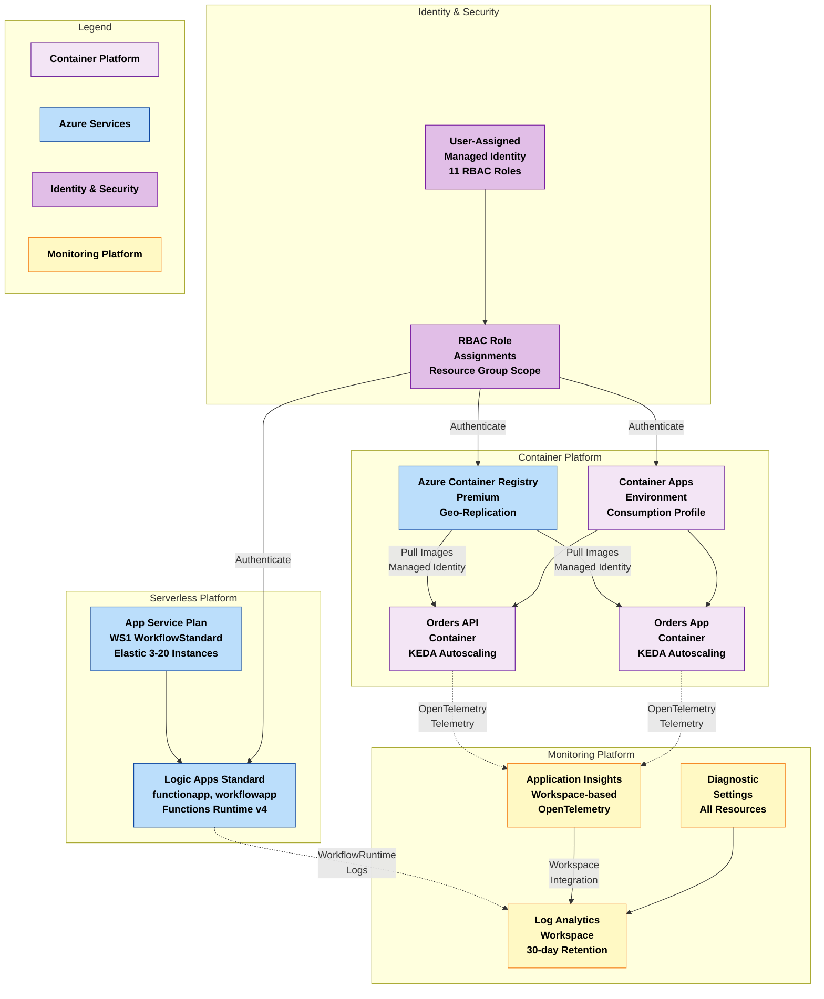
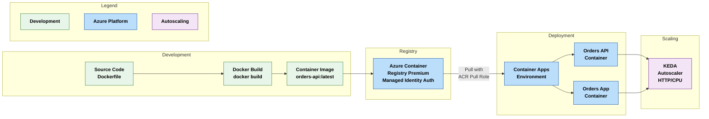
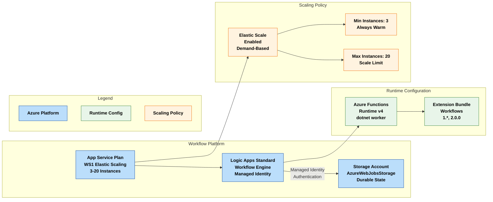
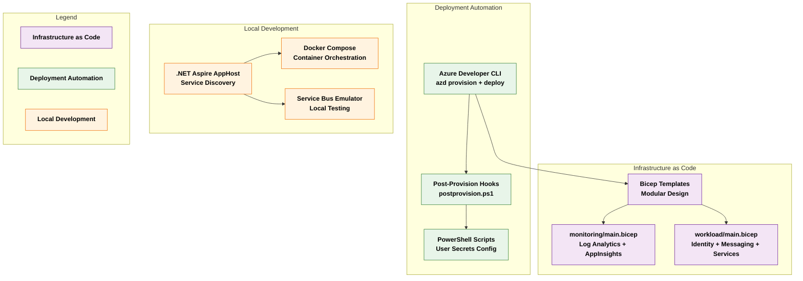
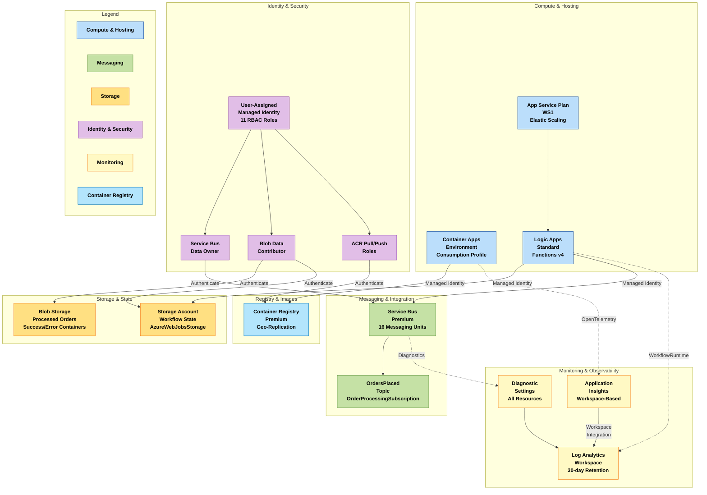

Collecting workspace information# Azure Logic Apps Standard - Enterprise-Scale Monitoring Solution

[](https://azure.microsoft.com)
[](https://learn.microsoft.com/dotnet/aspire)
[](https://opentelemetry.io)

## Table of Contents

- Problem Statement
- Project Purpose
- Key Features
- Solution Components
- Azure Components
- Project Structure
- Architecture Overview
  - Data Layer
  - Application Layer
  - Technology Layer
- Deployment Instructions
  - Prerequisites
  - Azure RBAC Roles
  - Deployment Steps
  - Local Development Setup
- Usage Examples
  - Monitoring Examples
  - Observability Guidance
- References

---

## Problem Statement

Enterprise organizations deploying Azure Logic Apps Standard at scale face significant operational and financial challenges when hosting thousands of workflows across global regions. Current Microsoft guidance recommends approximately 20 workflows per Logic App instance and up to 64 apps per App Service Plan. However, organizations exceeding these limits—particularly when using 64-bit worker processes—encounter critical issues including memory spikes, workflow instability, and unpredictable performance degradation.

Real-world deployments have revealed that improperly configured Logic Apps Standard environments can incur costs exceeding US$80,000 annually per environment. These costs stem from inefficient resource allocation, over-provisioning to compensate for stability issues, and the absence of granular observability that would enable data-driven optimization. The lack of enterprise-grade monitoring patterns aligned with the Azure Well-Architected Framework makes it difficult to diagnose performance bottlenecks, track long-running workflows (18-36 months), and maintain operational excellence at scale.

The need for a reference architecture addressing workflow hosting density optimization, comprehensive distributed tracing, cost management, and production-ready monitoring has become critical for enterprises seeking to deploy Logic Apps Standard as a foundational integration platform across multiple business units and geographic regions.

---

## Project Purpose

This solution provides a production-ready reference architecture and implementation for deploying Azure Logic Apps Standard at enterprise scale with comprehensive monitoring and observability capabilities built on OpenTelemetry standards. The architecture is designed to support organizations running thousands of workflows globally while maintaining stability, performance, and cost efficiency through data-driven insights.

The solution demonstrates proven patterns for hosting long-running workflows (18-36 months) without compromising stability, leveraging .NET Aspire for local development orchestration and Azure Monitor with Application Insights for production observability. By integrating OpenTelemetry instrumentation throughout the application stack via the eShopOrders.ServiceDefaults shared library, the architecture enables end-to-end distributed tracing from order placement through Service Bus messaging to Logic Apps workflow execution, providing complete visibility into complex integration scenarios.

The implementation showcases a microservices-based orders processing system that serves as a realistic scenario for enterprise integration workloads. The eShop.Orders.API handles order creation and publishes messages to Azure Service Bus with W3C Trace Context propagation, while Logic Apps workflows consume and process these orders asynchronously. The `OrderMessageHandler` background service demonstrates proper context extraction and correlation. This architecture pattern is representative of common enterprise scenarios including order management, customer onboarding, document processing, approval workflows, and event-driven integration patterns.

Built on Azure Well-Architected Framework principles, the solution emphasizes operational excellence through comprehensive monitoring, automated diagnostics, and performance optimization. The reference implementation includes modular infrastructure-as-code templates in infra, observability patterns in Extensions.cs, and deployment automation via Azure Developer CLI with post-provisioning hooks in postprovision.ps1. Organizations can adapt these components to their specific requirements while maintaining enterprise-grade reliability and cost efficiency through the monitoring insights provided by Application Insights and Log Analytics workspace integration.

---

## Key Features

| Feature | Description | Implementation Details |
|---------|-------------|------------------------|
| **Distributed Tracing** | End-to-end correlation across microservices, Service Bus, and Logic Apps with W3C Trace Context propagation | OpenTelemetry instrumentation in Extensions.cs lines 238-266, automatic activity creation in OrderController.cs lines 54-80 |
| **Service Bus Integration** | Asynchronous messaging with automatic trace context propagation via message properties | Azure Service Bus messaging in OrderService.cs lines 76-146 with traceparent header propagation, context extraction in OrderMessageHandler.cs lines 61-120 |
| **.NET Aspire AppHost** | Local development orchestration with service discovery, automatic endpoint resolution, and resource references | AppHost configuration in AppHost.cs with development/production resource switching lines 85-194 |
| **Infrastructure as Code** | Complete Azure infrastructure deployment automation with modular Bicep templates | Bicep modules in main.bicep orchestrating monitoring, identity, messaging, container services, and Logic Apps deployments |
| **Microservices Architecture** | Orders API and Blazor Server Web App with comprehensive health checks and service discovery | RESTful API in Program.cs lines 1-166 and Blazor frontend in Program.cs lines 1-102 |
| **Azure Monitor Integration** | Workspace-based Application Insights with Log Analytics, 30-day retention, and diagnostic settings | Monitoring infrastructure in main.bicep lines 72-118 with workspace integration |
| **Managed Identity** | Zero-credential authentication across all Azure resources with comprehensive RBAC assignments | User-assigned managed identity in main.bicep lines 56-124 with 11 role assignments |
| **Container-Based Deployment** | Azure Container Apps with KEDA autoscaling, consumption workload profile, and integrated observability | Container infrastructure in main.bicep lines 112-183 with Log Analytics and Application Insights integration |
| **Logic Apps Workflows** | Standard tier with elastic App Service Plan (WS1) supporting 3-20 instances | Workflow engine in logic-app.bicep lines 76-196 with managed identity storage authentication |
| **Resilience Patterns** | Retry, circuit breaker, and timeout policies with exponential backoff | Standard resilience handlers in Extensions.cs lines 87-115 applied to all HTTP clients |
| **Environment-Based Sampling** | Production sampling at 10% for cost optimization, always-on sampling in development | Sampling strategy in Extensions.cs lines 376-403 with parent-based sampling |
| **Dual Telemetry Export** | OTLP exporter for Aspire Dashboard (development) and Azure Monitor exporter (production) | Exporter configuration in Extensions.cs lines 422-449 based on environment variables |

---

## Solution Components

| Component | Description | Role |
|-----------|-------------|------|
| **eShop.Orders.API** | RESTful microservice for order management with comprehensive distributed tracing | Handles order CRUD operations via OrderController.cs, publishes to Service Bus via OrderService.cs, processes messages via OrderMessageHandler.cs |
| **eShop.Orders.App** | Blazor Server web application with interactive rendering | Provides user interface in Pages with HTTP client configured via service discovery in Program.cs lines 36-50 |
| **eShopOrders.ServiceDefaults** | Shared observability configuration library | Centralizes OpenTelemetry (lines 130-226), health checks (lines 454-523), resilience patterns (lines 87-115), and custom activity source creation (lines 565-672) in Extensions.cs |
| **eShopOrders.AppHost** | .NET Aspire orchestration host with environment-based resource configuration | Manages development resources with emulators (lines 93-158) and production Azure resource references (lines 167-194) in AppHost.cs |
| **ConsosoOrders Workflow** | Logic Apps Standard workflow for asynchronous order processing | Processes orders from Service Bus topic with durable execution, stores results in blob containers via `LogicAppWP/ConsosoOrders/workflow.json` |
| **Infrastructure Modules** | Modular Bicep templates organized by concern | Deploys monitoring (monitoring), identity (identity), messaging (messaging), container services (services), and Logic Apps (logic-app.bicep) |
| **Post-Provision Hook** | PowerShell automation script for post-deployment configuration | Configures .NET user secrets for local development, validates environment variables, and performs Azure Container Registry login in postprovision.ps1 lines 1-928 |
| **Order Generator** | PowerShell utility for generating test data | Creates realistic order JSON payloads for testing and load simulation in generate_orders.ps1 with configurable volume and ID ranges |

---

## Azure Components

| Azure Service | Description | Role |
|---------------|-------------|------|
| 📊 **Application Insights** | Workspace-based Application Performance Management (APM) | Collects telemetry, distributed traces, and performance metrics from microservices and Logic Apps via app-insights.bicep lines 62-78 with OpenTelemetry integration |
| 📝 **Log Analytics Workspace** | Centralized logging platform with PerGB2018 pricing tier | Aggregates logs and metrics from all Azure resources with 30-day retention in log-analytics-workspace.bicep lines 144-171 |
| 🚌 **Service Bus Premium** | Enterprise messaging infrastructure with enhanced throughput | Provides reliable, scalable message queuing with 16 messaging units capacity via main.bicep lines 75-106, includes OrdersPlaced topic |
| 🔐 **Managed Identity** | User-assigned Azure AD identity for zero-credential authentication | Enables authentication across Service Bus, Storage, and Container Registry with 11 RBAC roles in main.bicep lines 75-124 |
| 🐳 **Container Registry Premium** | Container image repository with geo-replication support | Stores and manages Docker images built from `Dockerfile` via main.bicep lines 82-125 |
| 📦 **Container Apps Environment** | Managed container hosting platform with consumption workload profile | Hosts microservices with KEDA autoscaling, Log Analytics integration, and Aspire Dashboard in main.bicep lines 112-183 |
| ⚡ **Logic Apps Standard** | Workflow orchestration engine with Functions Runtime v4 | Executes long-running business processes with elastic scaling (3-20 instances) via logic-app.bicep lines 76-196 |
| 🗄️ **Storage Account** | Blob storage for Logic Apps runtime state and processed orders | Supports Logic Apps durable state and segregated blob containers (ordersprocessedsuccessfully, ordersprocessedwitherrors) in main.bicep lines 126-172 |
| 🎯 **App Service Plan (WS1)** | Elastic compute infrastructure for Logic Apps Standard | Provides WorkflowStandard tier with 3-20 worker allocation in logic-app.bicep lines 86-109 |
| 📈 **Azure Monitor Health Model** | Service group hierarchy for organizing health monitoring | Establishes tenant-scoped service groups parented under root health model in azure-monitor-health-model.bicep lines 36-59 |

---

## Project Structure

```
Azure-LogicApps-Monitoring/
├── .azure/                                    # Azure Developer CLI configuration
│   ├── config.json                            # AZD environment configuration
│   └── prod/                                  # Production environment settings
├── .github/                                   # GitHub workflows and automation
│   └── workflows/                             # CI/CD pipeline definitions
├── .vscode/                                   # VS Code workspace settings
│   ├── launch.json                            # Debugger configurations
│   ├── settings.json                          # Editor preferences
│   └── tasks.json                             # Build and deployment tasks
├── eShopOrders.AppHost                       # .NET Aspire AppHost project
│   ├── AppHost.cs                             # Main orchestration configuration (lines 1-347)
│   ├── ConfigurationKeys.cs                   # Configuration key constants
│   ├── Constants.cs                           # Application-wide constants
│   └── eShopOrders.AppHost.csproj            # Project file
├── eShopOrders.ServiceDefaults               # Shared observability library
│   ├── Extensions.cs                          # OpenTelemetry, health checks, resilience (lines 1-672)
│   └── eShopOrders.ServiceDefaults.csproj    # Project file
├── hooks/                                     # Deployment automation scripts
│   ├── postprovision.ps1                      # Post-deployment configuration (lines 1-928)
│   └── generate_orders.ps1                    # Test data generation utility (lines 1-341)
├── infra/                                     # Infrastructure as Code (Bicep)
│   ├── main.bicep                             # Main deployment orchestrator (subscription scope)
│   ├── types.bicep                            # Shared type definitions (tagsType, storageAccountConfig)
│   ├── monitoring/                            # Monitoring infrastructure
│   │   ├── main.bicep                         # Monitoring module orchestrator
│   │   ├── log-analytics-workspace.bicep      # Log Analytics + storage (30-day retention)
│   │   ├── app-insights.bicep                 # Workspace-based Application Insights
│   │   └── azure-monitor-health-model.bicep   # Health monitoring service groups
│   └── workload/                              # Workload infrastructure
│       ├── main.bicep                         # Workload module orchestrator
│       ├── identity/                          # Managed identity and RBAC
│       │   └── main.bicep                     # User-assigned identity with 11 role assignments
│       ├── messaging/                         # Service Bus and workflow storage
│       │   └── main.bicep                     # Service Bus Premium + Storage Account
│       ├── services/                          # Container Registry and Apps
│       │   └── main.bicep                     # ACR Premium + Container Apps Environment
│       ├── logic-app.bicep                    # Logic Apps Standard + App Service Plan
│       └── data/                              # Data infrastructure (CURRENTLY UNUSED)
│           └── main.bicep                     # Orphaned storage module
├── LogicAppWP/                                # Logic Apps workspace
│   ├── ConsosoOrders/                         # Orders processing workflow
│   │   └── workflow.json                      # Workflow definition (Service Bus trigger)
│   ├── host.json                              # Functions runtime configuration
│   └── connections.json                       # Logic Apps managed connections
├── src/                                       # Microservices source code
│   ├── eShop.Orders.API/                      # Orders RESTful API
│   │   ├── Program.cs                         # Application entry point (lines 1-166)
│   │   ├── Controllers/
│   │   │   ├── OrderController.cs             # Order management endpoints (lines 1-155)
│   │   │   ├── OrderService.cs                # Business logic + Service Bus integration (lines 1-189)
│   │   │   └── OrderMessageHandler.cs         # Background message processor (lines 1-120)
│   │   ├── Middleware/
│   │   │   └── CorrelationIdMiddleware.cs     # Correlation ID propagation
│   │   ├── Models/
│   │   │   ├── Order.cs                       # Order domain model
│   │   │   └── IOrderService.cs               # Service interface
│   │   ├── Dockerfile                         # Container build definition
│   │   └── eShop.Orders.API.csproj           # Project file
│   ├── eShop.Orders.App/                      # Blazor Server web application
│   │   ├── Program.cs                         # Application entry point (lines 1-102)
│   │   ├── Components/
│   │   │   ├── App.razor                      # Root component
│   │   │   ├── Routes.razor                   # Routing configuration
│   │   │   ├── Layout/
│   │   │   │   └── MainLayout.razor           # Main layout template
│   │   │   └── Pages/
│   │   │       └── Error.razor                # Error page component
│   │   └── eShop.Orders.App.csproj           # Project file
│   └── eShop.Orders.App.Client/               # Blazor WebAssembly client (placeholder)
├── azure.yaml                                 # Azure Developer CLI manifest
├── docker-compose.yml                         # Local development orchestration
├── eShopOrders.sln                            # Visual Studio solution file
├── generate_orders.py                         # Python test data generator
└── README.md                                  # This file
```

---

## Architecture Overview

This solution implements a four-layer enterprise architecture aligned with TOGAF (The Open Group Architecture Framework) principles, optimized for Azure Logic Apps Standard at scale. The architecture emphasizes operational excellence through comprehensive monitoring, distributed tracing with OpenTelemetry, and cloud-native patterns that enable elastic scaling while maintaining cost efficiency and observability.

### TOGAF Architecture Layers

The solution follows TOGAF structure with four distinct layers, each addressing specific architectural concerns:

1. **Data Layer**: Master Data Management (MDM) for application data and monitoring telemetry with segregated storage patterns
2. **Application Layer**: Microservices and event-driven integration patterns with W3C Trace Context propagation
3. **Technology Layer**: Cloud-native, serverless, and platform engineering components with Infrastructure as Code
4. **Business Layer**: Order processing and workflow orchestration patterns (demonstrated through implementation)

---

## Data Layer

### Overview

The Data Layer implements Master Data Management (MDM) patterns for both application data and monitoring telemetry, ensuring data consistency, traceability, and long-term retention across the distributed system. This layer supports high-volume workflow execution and comprehensive observability requirements through segregated storage patterns and workspace-based integration between Application Insights and Log Analytics.

### Purpose and Key Capabilities

- **Application Data Management**: Order lifecycle data stored in-memory via OrderService.cs lines 28-30 (ConcurrentDictionary) for demonstration purposes, with blob storage for processed order artifacts segregated by success/error status in main.bicep lines 135-172
- **Monitoring Data Aggregation**: Centralized collection of logs, metrics, and distributed traces in Log Analytics workspace with 30-day retention configured in log-analytics-workspace.bicep lines 144-171
- **Telemetry Storage**: Application Insights stores performance telemetry, exceptions, and user analytics with workspace-based integration defined in app-insights.bicep lines 62-78
- **State Management**: Logic Apps Standard leverages Azure Storage for durable workflow state with managed identity authentication configured in logic-app.bicep lines 157-178
- **Audit and Compliance**: Blob containers provide immutable storage for processed orders supporting regulatory requirements, with lifecycle management policies in log-analytics-workspace.bicep lines 106-142

### Master Data Management (MDM) Diagram


### Data Retention and Lifecycle

| Data Category | Storage Location | Retention Period | Purpose | Configuration Reference |
|---------------|------------------|------------------|---------|------------------------|
| Order Messages | Service Bus Premium | 7 days (default) | Message durability and replay | main.bicep lines 75-106 |
| Workflow State | Logic Apps Storage (AzureWebJobsStorage) | Workflow lifetime | Durable execution state | logic-app.bicep lines 163-166 |
| Processed Orders (Success) | Blob Container: ordersprocessedsuccessfully | Configurable | Audit and compliance | main.bicep lines 155-162 |
| Processed Orders (Error) | Blob Container: ordersprocessedwitherrors | Configurable | Error analysis and retry | main.bicep lines 169-176 |
| Application Traces | Application Insights | 90 days (default) | Performance analysis | app-insights.bicep lines 62-78 |
| Logs and Metrics | Log Analytics Workspace | 30 days | Operational monitoring | log-analytics-workspace.bicep line 154 |
| Diagnostic Logs | Storage Account | 30 days (lifecycle policy) | Long-term archival | log-analytics-workspace.bicep lines 106-142 |

---

## Application Layer

### Overview

The Application Layer implements a microservices architecture with event-driven integration patterns, demonstrating comprehensive distributed tracing with W3C Trace Context propagation across HTTP boundaries and Service Bus messaging. This layer consists of RESTful APIs, Blazor Server web applications, and Logic Apps workflows orchestrated through Azure Service Bus Premium for reliable asynchronous processing.

### Purpose and Key Capabilities

- **Order Management API**: RESTful microservice handling order CRUD operations with comprehensive distributed tracing in OrderController.cs lines 54-155, automatic activity creation for all endpoints
- **Web Application**: Blazor Server frontend providing real-time order management interface with service discovery configured in Program.cs lines 36-50
- **Event-Driven Integration**: Service Bus topic/subscription pattern enabling loose coupling between producers and consumers, configured in main.bicep lines 108-112
- **Workflow Orchestration**: Logic Apps Standard executing long-running business processes with durable execution defined in `LogicAppWP/ConsosoOrders/workflow.json`
- **Distributed Tracing**: End-to-end correlation using W3C Trace Context propagated through HTTP headers (automatic) and Service Bus message properties (manual) in OrderService.cs lines 112-123
- **Resilience Patterns**: Retry policies, circuit breakers, and timeout handling implemented through Aspire service defaults in Extensions.cs lines 87-115

### Microservices Architecture Diagram


### Event-Driven Flow Diagram

```mermaid
flowchart LR
    A[Client Request] --> B[Orders API<br/>POST /api/orders]
    B --> C{Create Order<br/>In-Memory Store}
    C -->|Success| D[Save to<br/>ConcurrentDictionary]
    D --> E[Publish to<br/>Service Bus<br/>+ traceparent]
    E --> F[Service Bus Topic<br/>OrdersPlaced]
    F --> G[Logic Apps<br/>Workflow Trigger]
    G --> H{Process Order<br/>Durable Execution}
    H -->|Success| I[Write to<br/>Success Container]
    H -->|Error| J[Write to<br/>Error Container]
    
    F --> K[OrderMessageHandler<br/>Background Service]
    K --> L[Process Message<br/>with Tracing<br/>Extract Context]

    classDef client fill:#FFFFFF,stroke:#0078D4,color:#000;
    classDef app fill:#E8F5E9,stroke:#2E7D32,color:#000,font-weight:bold;
    classDef event fill:#FFF3E0,stroke:#EF6C00,color:#000,font-weight:bold;
    classDef success fill:#C8E6C9,stroke:#388E3C,color:#000;
    classDef error fill:#FFCDD2,stroke:#C62828,color:#000;

    class A client;
    class B,D,L app;
    class E,F,K event;
    class G,H workflow;
    class I success;
    class J error;
    
    %% Legend
    subgraph Legend
        L1[Client]:::client
        L2[Application]:::app
        L3[Event Trigger]:::event
        L4[Success Path]:::success
        L5[Error Path]:::error
    end
```



### API Endpoints

| Method | Endpoint | Description | Purpose | Implementation |
|--------|----------|-------------|---------|----------------|
| GET | `/api/orders` | Retrieve all orders | List all orders in memory | OrderController.cs lines 85-109 |
| GET | `/api/orders/{id}` | Retrieve specific order | Get order by ID | OrderController.cs lines 112-137 |
| POST | `/api/orders` | Create new order | Create order and publish to Service Bus | OrderController.cs lines 54-82 |
| DELETE | `/api/orders/{id}` | Delete order | Remove order from memory | OrderController.cs lines 140-155 |
| GET | `/health` | Health check endpoint | Readiness probe for container orchestrators | Extensions.cs lines 484-523 |
| GET | `/alive` | Liveness check endpoint | Liveness probe for container orchestrators | Extensions.cs lines 484-523 |

---

## Technology Layer

### Overview

The Technology Layer implements cloud-native, serverless, and platform engineering patterns using Azure PaaS services with Infrastructure as Code. This layer emphasizes container-based deployment, managed services, elastic scaling, and comprehensive observability through OpenTelemetry instrumentation, enabling operational excellence and cost optimization at enterprise scale.

### Purpose and Key Capabilities

- **Container Orchestration**: Azure Container Apps Environment with KEDA autoscaling, consumption-based workload profile, and Log Analytics integration configured in main.bicep lines 112-183
- **Serverless Compute**: Logic Apps Standard with elastic App Service Plan (WS1) supporting 3-20 instances defined in logic-app.bicep lines 76-109
- **Managed Identity**: Zero-credential authentication using user-assigned managed identity across all services with 11 RBAC roles in main.bicep lines 75-124
- **Infrastructure as Code**: Modular Bicep templates with separation of concerns (monitoring, identity, messaging, services, workflows) orchestrated via main.bicep lines 72-103
- **Observability Platform**: OpenTelemetry instrumentation with dual exporters (OTLP for Aspire Dashboard, Azure Monitor for production) configured in Extensions.cs lines 422-449
- **Service Discovery**: Aspire service discovery enabling dynamic endpoint resolution in development and production via Extensions.cs lines 87-115

### Cloud-Native Architecture Diagram



### Container-Based Deployment Flow



### Serverless Workflow Execution



### Platform Engineering Stack



### Azure Platform Dependencies



---

## Deployment Instructions

### Prerequisites

Before deploying this solution, ensure the following prerequisites are met:

#### Required Tools

| Tool | Minimum Version | Purpose | Download Link |
|------|----------------|---------|---------------|
| Azure CLI | 2.50.0+ | Azure resource management | [Install Azure CLI](https://learn.microsoft.com/cli/azure/install-azure-cli) |
| Azure Developer CLI (azd) | 1.5.0+ | Simplified Azure deployment | [Install azd](https://learn.microsoft.com/azure/developer/azure-developer-cli/install-azd) |
| .NET SDK | 10.0+ | Application runtime | [Download .NET](https://dotnet.microsoft.com/download) |
| Docker Desktop | 20.10+ | Container development | [Get Docker](https://www.docker.com/products/docker-desktop) |
| Visual Studio Code | Latest | Development environment | [Download VS Code](https://code.visualstudio.com/) |
| PowerShell | 7.3+ | Deployment scripts | [Install PowerShell](https://learn.microsoft.com/powershell/scripting/install/installing-powershell) |

#### Azure Subscription Requirements

- Active Azure subscription with Owner or Contributor + User Access Administrator permissions
- Subscription must support the following resource providers (enabled by default):
  - `Microsoft.App` (Container Apps)
  - `Microsoft.ServiceBus` (Service Bus)
  - `Microsoft.Logic` (Logic Apps)
  - `Microsoft.Insights` (Application Insights)
  - `Microsoft.OperationalInsights` (Log Analytics)
  - `Microsoft.ContainerRegistry` (Container Registry)
  - `Microsoft.ManagedIdentity` (Managed Identity)
  - `Microsoft.Web` (App Service Plans)

---

### Azure RBAC Roles

The following Azure RBAC roles are automatically assigned to the user-assigned managed identity during deployment via main.bicep lines 75-124. The deployment user also receives these roles for administrative access during and after deployment (lines 114-124).

| Role Name | Role ID | Description | Documentation Link | Implementation |
|-----------|---------|-------------|-------------------|----------------|
| **Storage Account Contributor** | `17d1049b-9a84-46fb-8f53-869881c3d3ab` | Manage storage accounts and lifecycle policies | [Storage roles](https://learn.microsoft.com/azure/role-based-access-control/built-in-roles/storage#storage-account-contributor) | main.bicep line 81 |
| **Storage Blob Data Contributor** | `ba92f5b4-2d11-453d-a403-e96b0029c9fe` | Read, write, and delete blob containers and data | [Blob roles](https://learn.microsoft.com/azure/role-based-access-control/built-in-roles/storage#storage-blob-data-contributor) | main.bicep line 82 |
| **Monitoring Metrics Publisher** | `3913510d-42f4-4e42-8a64-420c390055eb` | Publish metrics to Azure Monitor | [Monitoring roles](https://learn.microsoft.com/azure/role-based-access-control/built-in-roles/monitor#monitoring-metrics-publisher) | main.bicep line 83 |
| **Monitoring Contributor** | `749f88d5-cbae-40b8-bcfc-e573ddc772fa` | Create and manage monitoring resources | [Monitoring roles](https://learn.microsoft.com/azure/role-based-access-control/built-in-roles/monitor#monitoring-contributor) | main.bicep line 84 |
| **Application Insights Component Contributor** | `ae349356-3a1b-4a5e-921d-050484c6347e` | Manage Application Insights components | [App Insights roles](https://learn.microsoft.com/azure/role-based-access-control/built-in-roles/monitor#application-insights-component-contributor) | main.bicep line 85 |
| **Application Insights Snapshot Debugger** | `08954f03-6346-4c2e-81c0-ec3a5cfae23b` | View and download debug snapshots | [Snapshot debugger](https://learn.microsoft.com/azure/role-based-access-control/built-in-roles/monitor#application-insights-snapshot-debugger) | main.bicep line 86 |
| **Azure Service Bus Data Owner** | `090c5cfd-751d-490a-894a-3ce6f1109419` | Full access to Service Bus resources (send, receive, manage) | [Service Bus roles](https://learn.microsoft.com/azure/role-based-access-control/built-in-roles/integration#azure-service-bus-data-owner) | main.bicep line 87 |
| **Azure Service Bus Data Receiver** | `4f6d3b9b-027b-4f4c-9142-0e5a2a2247e0` | Receive messages from Service Bus queues/topics | [Service Bus roles](https://learn.microsoft.com/azure/role-based-access-control/built-in-roles/integration#azure-service-bus-data-receiver) | main.bicep line 88 |
| **Azure Service Bus Data Sender** | `69a216fc-b8fb-44d8-bc22-1f3c2cd27a39` | Send messages to Service Bus queues/topics | [Service Bus roles](https://learn.microsoft.com/azure/role-based-access-control/built-in-roles/integration#azure-service-bus-data-sender) | main.bicep line 89 |
| **Azure Container Registry ACR Pull** | `7f951dda-4ed3-4680-a7ca-43fe172d538d` | Pull container images from registry | [ACR roles](https://learn.microsoft.com/azure/role-based-access-control/built-in-roles/containers#acrpull) | main.bicep line 90 |
| **Azure Container Registry ACR Push** | `8311e382-0749-4cb8-b61a-304f252e45ec` | Push container images to registry | [ACR roles](https://learn.microsoft.com/azure/role-based-access-control/built-in-roles/containers#acrpush) | main.bicep line 91 |

---

### Deployment Steps

#### 1. Clone the Repository

```bash
git clone https://github.com/Evilazaro/Azure-LogicApps-Monitoring.git
cd Azure-LogicApps-Monitoring
```

#### 2. Initialize Azure Developer CLI

```bash
azd init
```

When prompted:
- **Environment name**: Choose a descriptive name (e.g., `dev`, `staging`, `prod`)
- This creates the .azure directory with environment-specific configuration

#### 3. Authenticate to Azure

```bash
azd auth login
az login
```

Ensure you're authenticated to the correct Azure subscription:

```bash
az account show
az account set --subscription "<subscription-id>"
```

#### 4. Configure Environment Variables

The Azure Developer CLI automatically captures environment variables during the `azd provision` command. The following environment variables are configured as outputs from the Bicep deployment in main.bicep lines 104-172:

```bash
# Core Azure Configuration (automatically set by azd)
AZURE_SUBSCRIPTION_ID="<your-subscription-id>"
AZURE_LOCATION="eastus2"  # or your preferred region
AZURE_ENV_NAME="dev"      # environment name from azd init

# These are automatically populated as deployment outputs:
# AZURE_RESOURCE_GROUP
# AZURE_TENANT_ID
# AZURE_APPLICATION_INSIGHTS_NAME
# AZURE_APPLICATION_INSIGHTS_CONNECTION_STRING
# AZURE_LOG_ANALYTICS_WORKSPACE_NAME
# AZURE_SERVICE_BUS_NAMESPACE
# AZURE_CONTAINER_REGISTRY_ENDPOINT
# MANAGED_IDENTITY_CLIENT_ID
```

#### 5. Provision Infrastructure

Deploy all Azure resources using the Bicep templates at subscription scope:

```bash
azd provision
```

This command executes the following deployment sequence orchestrated by main.bicep:

1. **Creates resource group** at subscription scope (line 72)
2. **Deploys monitoring infrastructure** via `monitoring/main.bicep`:
   - Log Analytics workspace with 30-day retention
   - Storage account for diagnostic logs with lifecycle policy
   - Application Insights with workspace-based integration
   - Azure Monitor health model service groups
3. **Deploys workload infrastructure** via `workload/main.bicep`:
   - User-assigned managed identity with 11 RBAC roles (lines 88-95)
   - Service Bus Premium namespace with OrdersPlaced topic (lines 98-110)
   - Storage account for Logic Apps workflows with success/error blob containers
   - Azure Container Registry Premium (lines 113-130)
   - Container Apps Environment with Log Analytics and Application Insights integration
   - Logic Apps Standard with elastic App Service Plan (WS1, 3-20 instances)
4. **Configures diagnostic settings** for all resources
5. **Assigns RBAC roles** to managed identity and deployment user

The deployment typically takes 10-15 minutes to complete.

#### 6. Post-Provisioning Configuration

The postprovision.ps1 script automatically executes after `azd provision` completes. It performs:

- .NET user secrets configuration for local development
- Azure Container Registry authentication
- Environment variable validation
- Service endpoint verification

Manual execution (if needed):

```bash
pwsh postprovision.ps1
```

#### 7. Deploy Application Code

Build and push container images, then deploy microservices to Container Apps:

```bash
azd deploy
```

This command:
1. Builds Docker images for Orders API from `Dockerfile`
2. Builds Docker images for Orders App
3. Pushes images to Azure Container Registry using managed identity authentication
4. Deploys containers to Container Apps Environment
5. Updates Logic Apps workflow definitions from `LogicAppWP/ConsosoOrders/workflow.json`

#### 8. Verify Deployment

Check deployment status and retrieve service endpoints:

```bash
azd show
```

Access the deployed services:
- **Orders Web App**: `https://<container-app-fqdn>` (retrieve from Container Apps Environment default domain)
- **Orders API**: `https://<container-app-fqdn>/swagger` (development only, configured in Program.cs lines 127-138)
- **Application Insights**: Azure Portal → Application Insights → `<AZURE_APPLICATION_INSIGHTS_NAME>`
- **Log Analytics**: Azure Portal → Log Analytics workspaces → `<AZURE_LOG_ANALYTICS_WORKSPACE_NAME>`
- **Aspire Dashboard** (local development): `http://localhost:15888` when running with AppHost

---

### Local Development Setup

#### Configure .NET Aspire AppHost

The AppHost.cs supports both development and production modes via environment-based resource switching (lines 85-194):

**Development Mode** (uses emulators and optional Azure resources):
- Service Bus Emulator for local testing (lines 143-148)
- Optional Azure Application Insights connection for telemetry (lines 117-132)

**Production Mode** (references existing Azure resources):
- Existing Service Bus namespace with parameters (lines 180-187)
- Existing Application Insights instance with workspace integration (lines 190-194)

Configure user secrets for development (automatically configured by postprovision.ps1):

```bash
cd eShopOrders.AppHost
dotnet user-secrets set "Azure:ApplicationInsights:Name" "<AZURE_APPLICATION_INSIGHTS_NAME>"
dotnet user-secrets set "Azure:ServiceBus:Namespace" "<AZURE_SERVICE_BUS_NAMESPACE>"
dotnet user-secrets set "Azure:ServiceBus:TopicName" "OrdersPlaced"
dotnet user-secrets set "Azure:ResourceGroup" "<AZURE_RESOURCE_GROUP>"
```

Alternatively, use environment variables or `appsettings.Development.json` as defined in ConfigurationKeys.cs lines 15-41.

#### Run Locally with .NET Aspire

Start the AppHost with service orchestration and Aspire Dashboard:

```bash
dotnet run --project eShopOrders.AppHost
```

This starts:
- **Aspire Dashboard** at `http://localhost:15888` with real-time distributed traces, logs, and metrics
- **Orders API** with automatic endpoint resolution via service discovery
- **Orders Web App** with HTTP client configured to resolve `orders-api` endpoint (configured in Program.cs lines 36-50)
- **Service Bus Emulator** (if running in development mode without Azure Service Bus namespace)

---

## Usage Examples

### Monitoring Examples

#### Accessing Application Insights

Navigate to **Azure Portal → Application Insights → `<AZURE_APPLICATION_INSIGHTS_NAME>`**

**Key Metrics to Monitor:**

Based on the OpenTelemetry instrumentation in Extensions.cs:

- **Request Rate and Duration**: ASP.NET Core instrumentation (line 217) captures HTTP request metrics with automatic activity creation
- **Failed Requests and Exceptions**: Exception recording via activity tags (lines 526-548) in custom exception handling
- **Dependency Calls**: HTTP client instrumentation (line 220) tracks outbound calls including Service Bus message publishing
- **Custom Metrics**: Business metrics added via activity tags in OrderController.cs (e.g., `orders.operation`, `orders.user`, `order.id`)
- **Service Bus Messaging**: Azure Service Bus instrumentation (line 218) tracks message send/receive operations with W3C Trace Context
- **Health Check Status**: Health check endpoints exposed via Extensions.cs lines 484-523

#### Using .NET Aspire Dashboard (Local Development)

Access the Aspire Dashboard at `http://localhost:15888` when running the AppHost locally.

**Dashboard Features:**

1. **Distributed Traces Tab**:
   - Real-time end-to-end traces from Order API → Service Bus → Logic Apps
   - Trace waterfall visualization showing request timeline
   - Activity tags including `orders.operation`, `order.id`, `traceparent`
   
2. **Structured Logs Tab**:
   - Aggregated logs from all services with correlation by `operation_Id`
   - Filter by severity level, resource name, and time range
   - Search logs by order ID or correlation ID

3. **Metrics Tab**:
   - HTTP request duration percentiles (P50, P95, P99)
   - Request rate per endpoint
   - Error rate and exception count
   - Custom business metrics

4. **Resources Tab**:
   - Service topology showing Orders API, Orders App, Service Bus
   - Resource health status and replica count
   - Environment variables and configuration

#### Viewing Distributed Traces in Application Insights

1. Navigate to **Application Insights → Transaction search** or **Performance** blade
2. Filter by operation name: `POST /api/orders`
3. Select a request to view end-to-end trace spanning:
   - **HTTP Request** to Orders API with custom tags (`orders.operation`, `orders.user`) added in [src/eShop.Orders.API/Controllers/OrderController.cs](src/eShop.Orders.API/Controllers/OrderController.cs) lines 66-70
   - **Service Bus Message Publishing** with W3C Trace Context propagation via `traceparent` message property in [src/eShop.Orders.API/Controllers/OrderService.cs](src/eShop.Orders.API/Controllers/OrderService.cs) lines 112-123
   - **Message Reception** in background service with context extraction in [src/eShop.Orders.API/Controllers/OrderMessageHandler.cs](src/eShop.Orders.API/Controllers/OrderMessageHandler.cs) lines 79-97
   - **Logic Apps Workflow Execution** triggered from Service Bus with WorkflowRuntime logs captured via diagnostic settings in [infra/workload/logic-app.bicep](infra/workload/logic-app.bicep) lines 180-196

4. View correlation graph to visualize dependencies and identify performance bottlenecks across distributed components

#### Testing End-to-End Flow

Generate test orders using the PowerShell utility:

```powershell
# Generate 10 test orders with IDs 1-10
pwsh hooks/generate_orders.ps1 -Count 10 -StartId 1

# Submit orders to the API
$orders = Get-Content "generated_orders.json" | ConvertFrom-Json
foreach ($order in $orders) {
    Invoke-RestMethod -Uri "https://<orders-api-endpoint>/api/orders" `
        -Method POST `
        -ContentType "application/json" `
        -Body ($order | ConvertTo-Json)
}
```

Verify the complete flow:
1. **Orders API** receives POST request and creates order in-memory
2. **Service Bus** receives message on OrdersPlaced topic with `traceparent` property
3. **Logic Apps** workflow triggers from Service Bus queue
4. **Workflow Execution**: HTTP POST to Orders API endpoint, conditional logic based on status code
5. **Blob Storage**: Successful orders written to `ordersprocessedsuccessfully` container, errors to `ordersprocessedwitherrors`
6. **Application Insights**: End-to-end trace visible with correlation across all components

---

## Observability Guidance

### Logic Apps Workflow Monitoring Best Practices

This solution implements comprehensive monitoring for Azure Logic Apps Standard aligned with the [Azure Well-Architected Framework - Operational Excellence](https://learn.microsoft.com/azure/well-architected/operational-excellence/monitoring) pillar.

#### WorkflowRuntime Diagnostic Logs

Logic Apps Standard emits `WorkflowRuntime` logs captured via diagnostic settings configured in [infra/workload/logic-app.bicep](infra/workload/logic-app.bicep) lines 180-196. These logs are sent to Log Analytics workspace for centralized analysis.

**Key Log Categories:**

| Category | Description | Implementation | Query Target |
|----------|-------------|----------------|--------------|
| **WorkflowRuntime** | Workflow execution events including triggers, actions, and run status | [infra/workload/logic-app.bicep](infra/workload/logic-app.bicep) line 189 | `AzureDiagnostics` table with `Category == "WorkflowRuntime"` |
| **FunctionAppLogs** | Functions runtime logs (Logic Apps runs on Functions v4) | Enabled by default | `FunctionAppLogs` table |
| **AllMetrics** | Performance metrics including CPU, memory, HTTP requests | Configured via `metricsSettings` parameter | `AzureMetrics` table |

#### Workflow Execution Patterns

The **PoProcessingWF** workflow in [LogicAppWP/ContosoOrders/PoProcessingWF/workflow.json](LogicAppWP/ContosoOrders/PoProcessingWF/workflow.json) demonstrates production-ready patterns:

**Workflow Actions Sequence:**

1. **Trigger**: `When_there_are_messages_in_a_queue_(V2)` - Service Bus queue trigger polling for new messages
2. **HTTP Action**: POST request to Orders API endpoint with message payload (lines 22-47)
3. **Condition**: Status code validation checking for HTTP 200 response (lines 48-62)
4. **Success Path** (status == 200):
   - `Create_blob_(V2)`: Write order to `ordersprocessedsuccessfully` container (lines 65-93)
   - `HTTP_1`: Call WeatherForecast endpoint for additional processing (lines 53-71)
5. **Error Path** (status != 200):
   - `Create_blob_(V2)_1`: Write order to `ordersprocessedwitherrors` container (lines 106-131)
6. **Cleanup**: `Delete_message_(V2)` - Remove processed message from queue (lines 9-24)

#### Health Monitoring Recommendations

Based on the deployment configuration:

- **App Service Plan Scaling**: Monitor WS1 plan metrics to ensure instances scale between 3-20 based on demand (configured in [infra/workload/logic-app.bicep](infra/workload/logic-app.bicep) lines 92-109)
- **Storage Account Health**: Monitor `AzureWebJobsStorage` connection health as workflow state depends on durable storage
- **Service Bus Queue Depth**: Alert on message backlog exceeding threshold indicating processing delays
- **Blob Container Growth**: Track storage consumption in success/error containers for capacity planning
- **Workflow Run Duration**: Monitor P95 and P99 percentiles to identify performance regressions
- **Action Failure Rate**: Alert on elevated failure rates in HTTP actions or blob creation operations

### Kusto Query Language (KQL) Queries for Log Analytics

Execute these queries in **Log Analytics Workspace** to gain insights into application and workflow behavior. Access via **Azure Portal → Log Analytics workspaces → `<AZURE_LOG_ANALYTICS_WORKSPACE_NAME>` → Logs**.

#### 1. Logic Apps Workflow Run Status Overview

```kusto
AzureDiagnostics
| where ResourceProvider == "MICROSOFT.WEB"
| where Category == "WorkflowRuntime"
| where OperationName == "Microsoft.Logic/workflows/workflowRunCompleted"
| extend WorkflowName = resource_workflowName_s
| extend RunStatus = status_s
| summarize 
    TotalRuns = count(),
    SuccessfulRuns = countif(RunStatus == "Succeeded"),
    FailedRuns = countif(RunStatus == "Failed"),
    CancelledRuns = countif(RunStatus == "Cancelled"),
    SuccessRate = round(100.0 * countif(RunStatus == "Succeeded") / count(), 2)
    by WorkflowName, bin(TimeGenerated, 1h)
| order by TimeGenerated desc
```

**Purpose**: Track workflow execution success rates and identify patterns of failures over time.

#### 2. Workflow Action Failures with Error Details

```kusto
AzureDiagnostics
| where ResourceProvider == "MICROSOFT.WEB"
| where Category == "WorkflowRuntime"
| where OperationName == "Microsoft.Logic/workflows/workflowActionCompleted"
| where status_s == "Failed"
| extend WorkflowName = resource_workflowName_s
| extend ActionName = resource_actionName_s
| extend ErrorCode = error_code_s
| extend ErrorMessage = error_message_s
| project 
    TimeGenerated,
    WorkflowName,
    ActionName,
    ErrorCode,
    ErrorMessage,
    clientTrackingId_s,
    resource_runId_s
| order by TimeGenerated desc
| take 100
```

**Purpose**: Identify specific workflow actions causing failures with error details for troubleshooting.

#### 3. Workflow Execution Duration Analysis

```kusto
AzureDiagnostics
| where ResourceProvider == "MICROSOFT.WEB"
| where Category == "WorkflowRuntime"
| where OperationName == "Microsoft.Logic/workflows/workflowRunCompleted"
| extend WorkflowName = resource_workflowName_s
| extend DurationMs = todouble(resource_duration_s) * 1000
| summarize 
    AvgDuration = round(avg(DurationMs), 2),
    P50 = round(percentile(DurationMs, 50), 2),
    P95 = round(percentile(DurationMs, 95), 2),
    P99 = round(percentile(DurationMs, 99), 2),
    MaxDuration = round(max(DurationMs), 2),
    TotalRuns = count()
    by WorkflowName, bin(TimeGenerated, 1h)
| order by TimeGenerated desc
```

**Purpose**: Monitor workflow performance with percentile analysis to identify slow executions and set SLA baselines.

#### 4. Service Bus Message Processing Latency

```kusto
// Correlate Service Bus message enqueue time with workflow trigger time
AzureDiagnostics
| where ResourceProvider == "MICROSOFT.WEB"
| where Category == "WorkflowRuntime"
| where OperationName == "Microsoft.Logic/workflows/workflowTriggerStarted"
| extend WorkflowName = resource_workflowName_s
| extend TriggerName = resource_triggerName_s
| extend CorrelationId = clientTrackingId_s
| project TimeGenerated, WorkflowName, TriggerName, CorrelationId
| join kind=inner (
    AppDependencies
    | where Type == "Azure Service Bus"
    | where Target contains "OrdersPlaced"
    | project EnqueueTime = TimeGenerated, CorrelationId = OperationId
) on CorrelationId
| extend ProcessingLatencySeconds = datetime_diff('second', TimeGenerated, EnqueueTime)
| summarize 
    AvgLatency = round(avg(ProcessingLatencySeconds), 2),
    P95Latency = round(percentile(ProcessingLatencySeconds, 95), 2),
    MaxLatency = round(max(ProcessingLatencySeconds), 2)
    by bin(TimeGenerated, 5m)
| order by TimeGenerated desc
```

**Purpose**: Measure end-to-end latency from message enqueue to workflow trigger for SLA monitoring.

#### 5. Application Insights Request Telemetry with Custom Tags

```kusto
requests
| where name == "POST /api/orders"
| extend OrderId = tostring(customDimensions["order.id"])
| extend OrderUser = tostring(customDimensions["orders.user"])
| extend Operation = tostring(customDimensions["orders.operation"])
| extend TraceParent = tostring(customDimensions["traceparent"])
| project 
    timestamp,
    name,
    resultCode,
    duration,
    success,
    OrderId,
    OrderUser,
    Operation,
    TraceParent,
    operation_Id
| where isnotempty(OrderId)
| order by timestamp desc
| take 100
```

**Purpose**: Query order-specific requests with custom tags added in [src/eShop.Orders.API/Controllers/OrderController.cs](src/eShop.Orders.API/Controllers/OrderController.cs) for business-level observability.

#### 6. Distributed Trace Correlation (End-to-End)

```kusto
let correlationId = "<operation_Id from Application Insights>";
union requests, dependencies, traces, exceptions
| where operation_Id == correlationId
| project 
    timestamp,
    itemType,
    name,
    type,
    target,
    resultCode,
    duration,
    success,
    message,
    severityLevel,
    customDimensions
| order by timestamp asc
```

**Purpose**: Reconstruct complete distributed trace across Orders API → Service Bus → Logic Apps using correlation ID.

#### 7. Container Apps Resource Utilization

```kusto
// Query container metrics from Container Apps Environment
ContainerAppConsoleLogs_CL
| where ContainerAppName_s contains "orders"
| project TimeGenerated, ContainerAppName_s, Log_s
| order by TimeGenerated desc
| take 100
```

**Purpose**: Monitor container application logs and resource consumption for KEDA autoscaling decisions.

#### 8. Failed Requests by Endpoint with Response Codes

```kusto
requests
| where success == false
| summarize 
    FailureCount = count(),
    UniqueUsers = dcount(user_Id),
    ResponseCodes = make_set(resultCode)
    by name, resultCode
| order by FailureCount desc
```

**Purpose**: Identify problematic API endpoints and HTTP error patterns for targeted remediation.

#### 9. Logic Apps Action Success Rate by Action Type

```kusto
AzureDiagnostics
| where ResourceProvider == "MICROSOFT.WEB"
| where Category == "WorkflowRuntime"
| where OperationName == "Microsoft.Logic/workflows/workflowActionCompleted"
| extend WorkflowName = resource_workflowName_s
| extend ActionName = resource_actionName_s
| extend ActionType = resource_actionType_s
| summarize 
    TotalActions = count(),
    SuccessfulActions = countif(status_s == "Succeeded"),
    FailedActions = countif(status_s == "Failed"),
    SuccessRate = round(100.0 * countif(status_s == "Succeeded") / count(), 2)
    by ActionType, ActionName
| order by SuccessRate asc
```

**Purpose**: Identify which action types (HTTP, ApiConnection, Condition) have the highest failure rates.

#### 10. Blob Container Growth Rate (Success vs. Error)

```kusto
AzureDiagnostics
| where ResourceProvider == "MICROSOFT.STORAGE"
| where OperationName == "PutBlob" or OperationName == "CreateBlob"
| extend ContainerName = split(uri_s, "/")[3]
| where ContainerName in ("ordersprocessedsuccessfully", "ordersprocessedwitherrors")
| summarize 
    BlobCount = count(),
    TotalSizeBytes = sum(todouble(responseBodySize_d))
    by ContainerName, bin(TimeGenerated, 1h)
| order by TimeGenerated desc
```

**Purpose**: Track storage consumption and success-to-error ratio for capacity planning and quality monitoring.

### Alerting Recommendations

Configure alerts based on the following thresholds using Log Analytics alert rules:

| Alert Name | Condition | Threshold | Query Reference | Action |
|------------|-----------|-----------|-----------------|--------|
| **High Workflow Failure Rate** | Workflow success rate < 95% over 15 minutes | 95% | Query #1 | Notify operations team, trigger runbook |
| **Workflow Duration Exceeded SLA** | P95 workflow duration > 30 seconds | 30s | Query #3 | Investigate performance bottlenecks |
| **Service Bus Processing Delay** | Message processing latency > 60 seconds | 60s | Query #4 | Check App Service Plan scaling |
| **API Request Failure Spike** | Failed requests > 10% of total over 5 minutes | 10% | Query #8 | Page on-call engineer |
| **Logic Apps Action Errors** | Action failure count > 5 in 10 minutes | 5 failures | Query #2 | Create incident, capture error details |
| **Storage Container Error Growth** | Blob count in `ordersprocessedwitherrors` > 100/hour | 100/hour | Query #10 | Investigate upstream integration issues |

### Monitoring Dashboard Configuration

Create a comprehensive monitoring dashboard in Azure Portal combining:

1. **Application Insights Application Map**: Visualize dependencies between Orders API, Service Bus, Logic Apps
2. **Log Analytics Workbook**: Custom workbook with queries #1, #3, #4, #8, #9 for executive summary
3. **Container Apps Metrics**: CPU, memory, replica count, request rate charts
4. **Logic Apps Metrics**: Workflow runs completed, actions completed, trigger latency
5. **Service Bus Metrics**: Active messages, dead-letter count, incoming/outgoing messages
6. **Storage Account Metrics**: Blob count, storage utilization, transaction rate

### Integration with Azure Monitor Health Model

The solution deploys Azure Monitor health model service groups in [infra/monitoring/azure-monitor-health-model.bicep](infra/monitoring/azure-monitor-health-model.bicep) lines 36-59 for hierarchical health monitoring:

- **Root Service Group**: Tenant-scoped health model container
- **Application Service Groups**: Child groups for Orders API, Orders App, Logic Apps
- **Infrastructure Service Groups**: Child groups for Service Bus, Storage, Container Apps

This enables rollup health status from individual resources to application-level health indicators.

---

## References

### Official Microsoft Documentation

- [Azure Logic Apps Standard Monitoring](https://learn.microsoft.com/azure/logic-apps/monitor-logic-apps)
- [Azure Well-Architected Framework - Operational Excellence](https://learn.microsoft.com/azure/well-architected/operational-excellence/monitoring)
- [.NET Aspire Dashboard Overview](https://learn.microsoft.com/dotnet/aspire/fundamentals/dashboard/overview)
- [OpenTelemetry in Azure Monitor](https://learn.microsoft.com/azure/azure-monitor/app/opentelemetry-data-collection)
- [Azure Monitor .NET API Reference](https://learn.microsoft.com/dotnet/api/overview/azure/monitor)
- [Kusto Query Language (KQL) Reference](https://learn.microsoft.com/azure/data-explorer/kusto/query/)
- [Azure Logic Apps Diagnostic Logging](https://learn.microsoft.com/azure/logic-apps/monitor-workflows-collect-diagnostic-data)
- [Azure Service Bus W3C Trace Context](https://learn.microsoft.com/azure/service-bus-messaging/service-bus-end-to-end-tracing)
- [Container Apps Observability](https://learn.microsoft.com/azure/container-apps/observability)

### Architecture and Best Practices

- [Azure Architecture Center - Logic Apps](https://learn.microsoft.com/azure/architecture/reference-architectures/enterprise-integration/queues-events)
- [TOGAF Architecture Framework](https://www.opengroup.org/togaf)
- [OpenTelemetry Specification](https://opentelemetry.io/docs/specs/otel/)
- [W3C Trace Context](https://www.w3.org/TR/trace-context/)

---

## Support and Troubleshooting

### Common Issues and Resolutions

| Issue | Symptoms | Resolution | Documentation |
|-------|----------|------------|---------------|
| **Missing Traces in App Insights** | Gaps in distributed tracing, no correlation | Verify `APPLICATIONINSIGHTS_CONNECTION_STRING` environment variable, check sampling configuration in [eShopOrders.ServiceDefaults/Extensions.cs](eShopOrders.ServiceDefaults/Extensions.cs) lines 376-403 | [OpenTelemetry troubleshooting](https://learn.microsoft.com/azure/azure-monitor/app/opentelemetry-troubleshooting) |
| **Workflow Not Triggering** | Logic Apps not processing Service Bus messages | Check Service Bus connection in `connections.json`, verify managed identity has Azure Service Bus Data Receiver role | [Logic Apps connectors](https://learn.microsoft.com/azure/logic-apps/logic-apps-using-sap-connector) |
| **Container Image Pull Failure** | Container Apps cannot start, ACR authentication errors | Verify managed identity has ACR Pull role in [infra/workload/identity/main.bicep](infra/workload/identity/main.bicep) line 90 | [Container Apps managed identity](https://learn.microsoft.com/azure/container-apps/managed-identity) |
| **High Memory Usage in Logic Apps** | OOM exceptions, workflow instability | Review workflow hosting density (target ~20 workflows per instance), increase App Service Plan workers in [infra/workload/logic-app.bicep](infra/workload/logic-app.bicep) lines 103-105 | [Logic Apps performance](https://learn.microsoft.com/azure/logic-apps/set-up-zone-redundancy-availability-zones) |
| **Service Discovery Not Working** | HTTP client cannot resolve service endpoints | Verify Aspire service defaults are applied via `AddServiceDefaults()` in [src/eShop.Orders.App/Program.cs](src/eShop.Orders.App/Program.cs) lines 36-50 | [.NET Aspire service discovery](https://learn.microsoft.com/dotnet/aspire/service-discovery/overview) |

### Diagnostic Commands

```powershell
# Check Azure CLI authentication
az account show

# List deployed resources in resource group
az resource list --resource-group <AZURE_RESOURCE_GROUP> --output table

# View Logic Apps workflow runs
az logicapp show --name <logic-app-name> --resource-group <AZURE_RESOURCE_GROUP>

# Query Service Bus queue depth
az servicebus queue show --name OrdersPlaced --namespace-name <namespace> --resource-group <AZURE_RESOURCE_GROUP> --query "countDetails"

# View Container Apps logs (last 100 lines)
az containerapp logs show --name orders-api --resource-group <AZURE_RESOURCE_GROUP> --tail 100

# Test Application Insights connectivity
az monitor app-insights component show --app <AZURE_APPLICATION_INSIGHTS_NAME> --resource-group <AZURE_RESOURCE_GROUP>
```

### Getting Help

- **GitHub Issues**: [Azure-LogicApps-Monitoring Issues](https://github.com/Evilazaro/Azure-LogicApps-Monitoring/issues)
- **Azure Support**: [Create Azure support ticket](https://azure.microsoft.com/support/create-ticket/)
- **Community Forums**: [Microsoft Q&A - Logic Apps](https://learn.microsoft.com/answers/tags/133/azure-logic-apps)