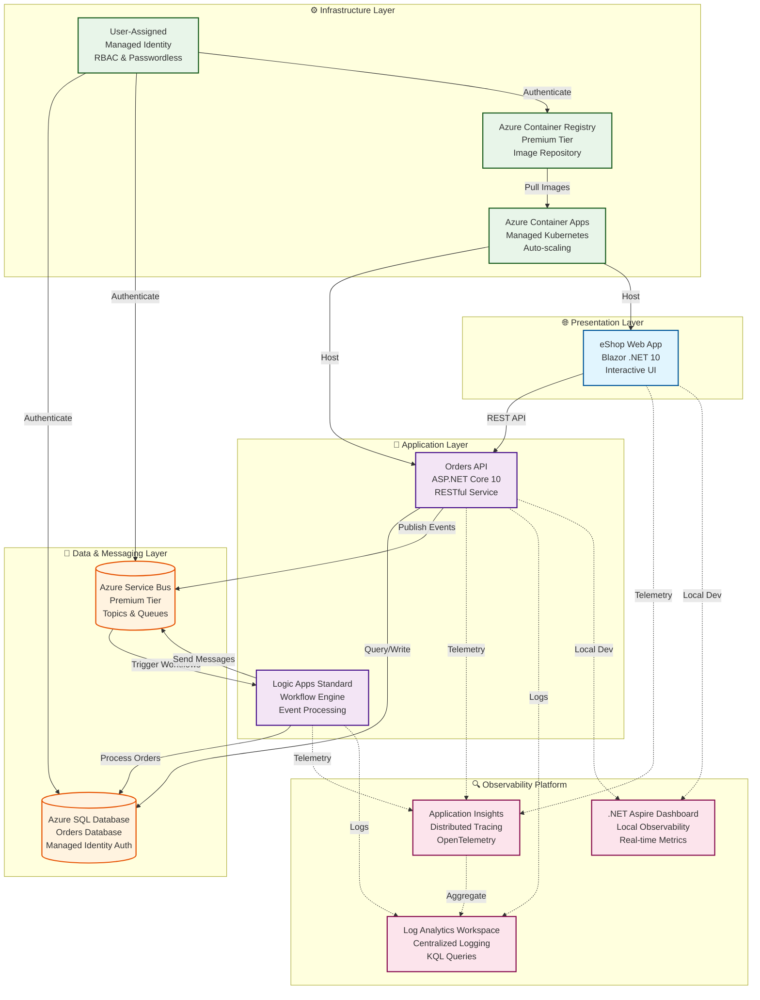

# Azure Logic Apps Monitoring Solution


---

## 📑 Table of Contents

- [Overview](#overview)
- [Technology Stack](#technology-stack)
- [Features](#features)
- [Architecture Overview](#architecture-overview)
- [Prerequisites](#prerequisites)
- [Installation and Setup](#installation-and-setup)
- [Usage](#usage)
- [Documentation](#documentation)
- [License](#license)

---

## Overview

The **Azure Logic Apps Monitoring Solution** is a comprehensive, production-ready cloud-native application sample that demonstrates enterprise-grade best practices for observability, monitoring, and distributed tracing in Azure Logic Apps Standard workflows. This solution showcases how to build resilient, scalable, and observable distributed systems using modern Azure services and .NET technologies, serving as both a learning resource and a foundation for production implementations.

Built on .NET 10 and orchestrated with .NET Aspire, this solution implements an eShop order management system that processes orders through Azure Logic Apps workflows, persists data to Azure SQL Database, and communicates asynchronously via Azure Service Bus. The architecture emphasizes security through managed identities, operational excellence through comprehensive automation scripts, and cost optimization through serverless and consumption-based services.

The solution supports two development modes: a **local development workflow** using containerized dependencies (SQL Server, Service Bus emulator) for rapid inner-loop development, and a **full Azure deployment** for integration testing and production scenarios. Azure Developer CLI (azd) lifecycle hooks automate environment validation, secret management, SQL managed identity configuration, and test data generation—ensuring developers can focus on building features rather than managing infrastructure setup.

---

## Technology Stack

| Technology | Description | Documentation |
|------------|-------------|---------------|
| **.NET 10** | Cross-platform runtime for building cloud-native applications | [Microsoft Learn](https://learn.microsoft.com/en-us/dotnet/) |
| **.NET Aspire** | Cloud-ready stack for building observable, production-ready distributed applications | [Microsoft Learn](https://learn.microsoft.com/en-us/dotnet/aspire/) |
| **Azure Logic Apps Standard** | Serverless workflow engine for event-driven order processing | [Microsoft Learn](https://learn.microsoft.com/en-us/azure/logic-apps/) |
| **Azure Container Apps** | Managed Kubernetes environment for hosting containerized microservices | [Microsoft Learn](https://learn.microsoft.com/en-us/azure/container-apps/) |
| **Application Insights** | Application performance monitoring and distributed tracing | [Microsoft Learn](https://learn.microsoft.com/en-us/azure/azure-monitor/app/app-insights-overview) |
| **Azure Service Bus** | Enterprise messaging service for reliable asynchronous communication | [Microsoft Learn](https://learn.microsoft.com/en-us/azure/service-bus-messaging/) |
| **Azure Developer CLI (azd)** | Command-line tool for end-to-end Azure deployment automation | [Microsoft Learn](https://learn.microsoft.com/en-us/azure/developer/azure-developer-cli/overview) |
| **Bicep** | Domain-specific language for declarative Azure infrastructure deployment | [Microsoft Learn](https://learn.microsoft.com/en-us/azure/azure-resource-manager/bicep/) |

---

## Features

| Name | Description | Best Practices Applied | WAF Alignment |
|------|-------------|------------------------|---------------|
| **Distributed Tracing** | End-to-end request correlation across Logic Apps, APIs, and Service Bus using OpenTelemetry and W3C Trace Context | [.NET Diagnostics](https://learn.microsoft.com/en-us/dotnet/core/diagnostics/) | [Operational Excellence](https://learn.microsoft.com/en-us/azure/architecture/framework/operational-excellence/overview) |
| **Centralized Logging** | Log Analytics workspace with 30-day retention, KQL queries, and diagnostic settings for all resources | [Azure Well-Architected Framework](https://learn.microsoft.com/en-us/azure/architecture/framework/) | [Operational Excellence](https://learn.microsoft.com/en-us/azure/architecture/framework/operational-excellence/overview) |
| **Application Insights Integration** | Workspace-based Application Insights for telemetry collection, smart detection, and application map visualization | [.NET Diagnostics](https://learn.microsoft.com/en-us/dotnet/core/diagnostics/) | [Reliability](https://learn.microsoft.com/en-us/azure/architecture/framework/reliability/overview) |
| **Managed Identity Authentication** | Passwordless authentication to Azure SQL, Service Bus, and Container Registry using user-assigned managed identities | [Azure Well-Architected Framework](https://learn.microsoft.com/en-us/azure/architecture/framework/) | [Security](https://learn.microsoft.com/en-us/azure/architecture/framework/security/overview) |
| **Infrastructure as Code** | Modular Bicep templates with subscription-scope deployment, shared type definitions, and comprehensive outputs | [Bicep Documentation](https://learn.microsoft.com/en-us/azure/azure-resource-manager/bicep/) | [Operational Excellence](https://learn.microsoft.com/en-us/azure/architecture/framework/operational-excellence/overview) |
| **Azure Developer CLI Integration** | Automated lifecycle hooks for pre/post-provisioning validation, secret configuration, and SQL managed identity setup | [Azure Developer CLI](https://learn.microsoft.com/en-us/azure/developer/azure-developer-cli/overview) | [Operational Excellence](https://learn.microsoft.com/en-us/azure/architecture/framework/operational-excellence/overview) |
| **.NET Aspire Orchestration** | Local development orchestration with containerized SQL Server, Service Bus emulator, and real-time dashboard | [.NET Diagnostics](https://learn.microsoft.com/en-us/dotnet/core/diagnostics/) | [Performance Efficiency](https://learn.microsoft.com/en-us/azure/architecture/framework/performance-efficiency/overview) |
| **Logic Apps Standard Workflows** | Serverless workflow engine with elastic scaling (up to 20 workers), event-driven processing, and Service Bus integration | [Azure Well-Architected Framework](https://learn.microsoft.com/en-us/azure/architecture/framework/) | [Performance Efficiency](https://learn.microsoft.com/en-us/azure/architecture/framework/performance-efficiency/overview) |
| **Event-Driven Architecture** | Azure Service Bus Premium tier with topics, queues, and reliable message delivery for asynchronous order processing | [Azure Well-Architected Framework](https://learn.microsoft.com/en-us/azure/architecture/framework/) | [Reliability](https://learn.microsoft.com/en-us/azure/architecture/framework/reliability/overview) |
| **Container-Based Deployment** | Azure Container Apps with managed Kubernetes environment, auto-scaling, and Premium Azure Container Registry | [Azure Well-Architected Framework](https://learn.microsoft.com/en-us/azure/architecture/framework/) | [Cost Optimization](https://learn.microsoft.com/en-us/azure/architecture/framework/cost/overview) |
| **Health Checks & Resilience** | Liveness and readiness probes, dependency health checks, and configurable retry policies with exponential backoff | [.NET Diagnostics](https://learn.microsoft.com/en-us/dotnet/core/diagnostics/) | [Reliability](https://learn.microsoft.com/en-us/azure/architecture/framework/reliability/overview) |
| **Cross-Platform Automation** | Dual PowerShell and Bash implementations for all automation scripts with consistent behavior across Windows, Linux, and macOS | [Azure Developer CLI](https://learn.microsoft.com/en-us/azure/developer/azure-developer-cli/overview) | [Operational Excellence](https://learn.microsoft.com/en-us/azure/architecture/framework/operational-excellence/overview) |

---

## Architecture Overview



---

## Prerequisites

The [hooks](hooks/) folder contains automation scripts that streamline the Azure Logic Apps Monitoring solution's development lifecycle. These scripts integrate seamlessly with Azure Developer CLI (azd) to validate prerequisites, provision infrastructure, configure secrets, set up SQL Database managed identity access, and generate test data. The scripts support cross-platform execution (Windows, Linux, and macOS) with dual implementations in PowerShell and Bash, executing automatically as part of the azd lifecycle hooks during `azd provision` and `azd up` commands.

For detailed installation instructions, configuration options, and troubleshooting guides, refer to the comprehensive documentation in the **hooks** folder:

| File Name | Description |
|-----------|-------------|
| [README.md](hooks/README.md) | Complete developer inner loop workflow guide and quick start instructions |
| [VALIDATION-WORKFLOW.md](hooks/VALIDATION-WORKFLOW.md) | Pre-provisioning validation workflow and deployment matrix |
| [check-dev-workstation.md](hooks/check-dev-workstation.md) | Workstation prerequisite validation script documentation |
| [postprovision.md](hooks/postprovision.md) | Post-provisioning configuration and secrets management documentation |
| [clean-secrets.md](hooks/clean-secrets.md) | .NET user secrets cleanup utility documentation |
| [Generate-Orders.md](hooks/Generate-Orders.md) | Test data generation script documentation |

---

## Installation and Setup

This solution provides comprehensive automation scripts for environment validation, infrastructure provisioning, and configuration. The scripts support both Windows (PowerShell) and Linux/macOS (Bash) environments.

For complete installation instructions, configuration options, and step-by-step setup guides, refer to the documentation in the **hooks** folder:

- **[hooks/README.md](hooks/README.md)** - Complete developer inner loop workflow and quick start guide
- **[hooks/VALIDATION-WORKFLOW.md](hooks/VALIDATION-WORKFLOW.md)** - Complete deployment workflow and validation matrix

---

## Usage

### Quick Start: Local Development

```bash
# Clone repository
git clone https://github.com/Evilazaro/Azure-LogicApps-Monitoring.git
cd Azure-LogicApps-Monitoring

# Install .NET Aspire workload (first time only)
dotnet workload install aspire

# Ensure Docker Desktop is running
docker ps

# Start application with all dependencies
cd app.AppHost
dotnet run
```

**Access Services:**
- **Aspire Dashboard**: `https://localhost:17267`
- **Web App**: Check dashboard for dynamic port
- **Orders API**: Check dashboard for dynamic port
- **API Swagger UI**: `{Orders API URL}/swagger`

### Quick Start: Azure Deployment

```bash
# Validate workstation (optional but recommended)
./hooks/check-dev-workstation.sh  # or .ps1 on Windows

# Provision infrastructure and configure secrets
azd provision

# Generate test data (optional)
./hooks/Generate-Orders.sh --order-count 100

# Deploy application
azd deploy
```

### Development Modes

| Mode | Database | Service Bus | Monitoring | Setup Time | Cost |
|------|----------|-------------|------------|------------|------|
| **Local Development** | SQL Server container | Service Bus emulator | Aspire Dashboard | ~1 min | Free |
| **Azure Deployment** | Azure SQL Database | Azure Service Bus | Application Insights | ~10 min | Pay-per-use |

---

## Documentation

### Project Documentation

| Document | Description |
|----------|-------------|
| README.md | Developer inner loop workflow and quick start guide |
| VALIDATION-WORKFLOW.md | Complete deployment workflow and validation matrix |
| postprovision.md | Post-provisioning configuration details |

### Microsoft Learn Resources

| Resource | Description |
|----------|-------------|
| [Azure Logic Apps Documentation](https://learn.microsoft.com/azure/logic-apps/) | Official Logic Apps documentation |
| [Application Insights Best Practices](https://learn.microsoft.com/azure/azure-monitor/app/app-insights-overview) | Monitoring and observability guidance |
| [Azure Developer CLI](https://learn.microsoft.com/azure/developer/azure-developer-cli/) | Deployment automation documentation |
| [.NET Aspire Documentation](https://learn.microsoft.com/dotnet/aspire/) | Cloud-ready stack for .NET |
| [Bicep Documentation](https://learn.microsoft.com/azure/azure-resource-manager/bicep/) | Infrastructure as Code with Bicep |
| [Azure Well-Architected Framework](https://learn.microsoft.com/azure/architecture/framework/) | Architecture best practices |

---

## License

This project is licensed under the **MIT License** - see the LICENSE.md file for details.

---

<p align="center">
  <strong>Made with ❤️ by <a href="https://github.com/Evilazaro">Evilazaro</a> | Principal Cloud Solution Architect | Microsoft</strong>
</p>
