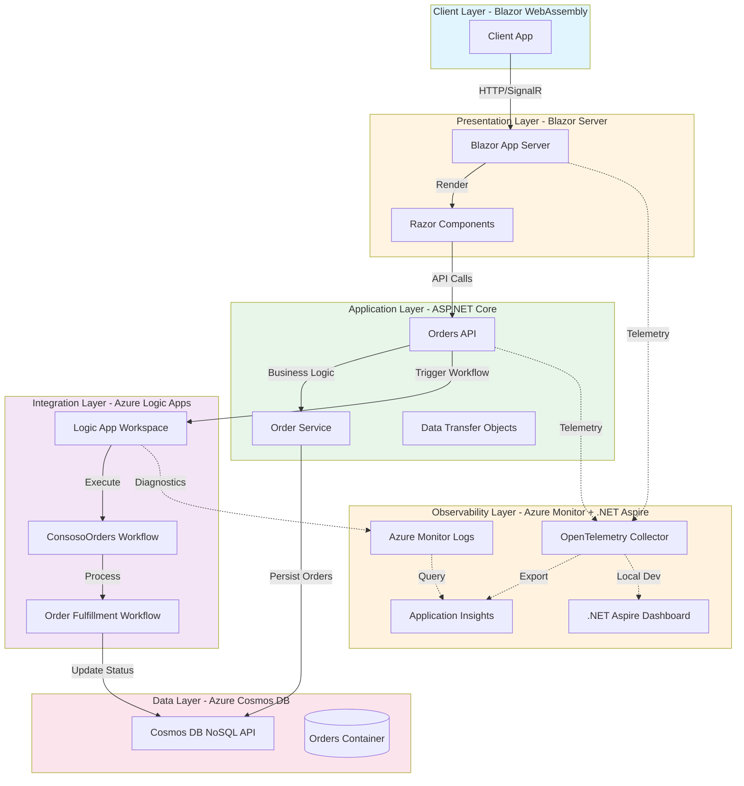

# Azure Logic Apps Monitoring with .NET Aspire

[](https://opensource.org/licenses/MIT)
[](https://dotnet.microsoft.com/download)
[](https://azure.microsoft.com)

A comprehensive sample application demonstrating enterprise-grade monitoring and observability practices for Azure Logic Apps using .NET Aspire, OpenTelemetry, and Azure Monitor. This solution showcases how to build, deploy, and monitor distributed applications that integrate Logic App workflows with modern cloud-native architectures.

## Table of Contents

- [Project Overview](#project-overview)
- [Architecture](#architecture)
- [Key Features](#key-features)
- [Prerequisites](#prerequisites)
- [Setup Instructions](#setup-instructions)
- [Deployment Guide](#deployment-guide)
- [Monitoring & Observability](#monitoring--observability)
- [Project Structure](#project-structure)
- [References & Documentation](#references--documentation)
- [Contributing](#contributing)
- [License](#license)

## Project Overview

This repository demonstrates how to implement comprehensive monitoring and observability for Azure Logic Apps within a distributed e-commerce order processing system. The solution leverages **.NET Aspire** for local development orchestration, **Azure Monitor** and **Application Insights** for production telemetry, and **OpenTelemetry** standards for distributed tracing.

The sample implements an order processing workflow where orders are submitted through a Blazor web application, processed by a .NET API, and then orchestrated through Azure Logic Apps for fulfillment. Throughout this process, telemetry data (traces, metrics, and logs) is collected and visualized, providing deep insights into system behavior, performance bottlenecks, and operational health.

This architecture follows Azure Well-Architected Framework principles for operational excellence, demonstrating real-world patterns for monitoring distributed systems that combine serverless workflows (Logic Apps) with containerized microservices (.NET applications). It's ideal for teams looking to implement production-ready observability practices in hybrid Azure environments.

## Architecture

The solution is organized into six logical layers, each with specific responsibilities and technologies:



### Layer Details

#### **Client Layer** (Blazor WebAssembly)
- **Technology**: Blazor WebAssembly
- **Components**:
  - Interactive client-side UI components
  - Order submission forms
  - Real-time status updates via SignalR

#### **Presentation Layer** (Blazor Server)
- **Technology**: ASP.NET Core Blazor Server
- **Components**:
  - Server-side rendered Razor components
  - Session management
  - Real-time UI updates

#### **Application Layer** (ASP.NET Core)
- **Technology**: ASP.NET Core Web API
- **Components**:
  - RESTful API endpoints for order management
  - Order processing business logic
  - Data validation and transformation
  - Integration with Logic Apps

#### **Integration Layer** (Azure Logic Apps)
- **Technology**: Azure Logic Apps (Standard)
- **Components**:
  - Logic App Workspace project
  - ConsosoOrders workflow for order orchestration
  - Order fulfillment and notification workflows
  - Integration with external systems

#### **Observability Layer** (Azure Monitor + .NET Aspire)
- **Technology**: Azure Monitor, Application Insights, OpenTelemetry, .NET Aspire
- **Components**:
  - .NET Aspire Dashboard for local development monitoring
  - OpenTelemetry instrumentation for distributed tracing
  - Application Insights for production telemetry
  - Azure Monitor Logs for Logic Apps diagnostics
  - Custom metrics and health checks

#### **Data Layer** (Azure Cosmos DB)
- **Technology**: Azure Cosmos DB NoSQL API
- **Components**:
  - Orders container with partition key optimization
  - JSON document storage
  - Global distribution capabilities
  - Low-latency reads and writes

## Key Features

- ✅ **End-to-End Distributed Tracing**: OpenTelemetry instrumentation across .NET services and Logic Apps
- ✅ **.NET Aspire Integration**: Local development dashboard with real-time telemetry visualization
- ✅ **Azure Monitor Integration**: Production-ready monitoring with Application Insights
- ✅ **Logic Apps Observability**: Comprehensive workflow monitoring and diagnostics
- ✅ **Infrastructure as Code**: Complete Bicep templates for Azure resource deployment
- ✅ **Service Defaults**: Reusable observability configuration across services
- ✅ **Health Checks**: Built-in health monitoring for all components
- ✅ **Structured Logging**: Consistent logging patterns with correlation IDs
- ✅ **Metrics Collection**: Custom business and operational metrics

## Prerequisites

Before you begin, ensure you have the following installed:

- [.NET 8.0 SDK](https://dotnet.microsoft.com/download/dotnet/8.0) or later
- [Visual Studio 2022](https://visualstudio.microsoft.com/vs/) (17.9 or later) or [Visual Studio Code](https://code.visualstudio.com/)
- [.NET Aspire workload](https://learn.microsoft.com/dotnet/aspire/fundamentals/setup-tooling):
  ```bash
  dotnet workload install aspire
  ```
- [Azure CLI](https://learn.microsoft.com/cli/azure/install-azure-cli) (version 2.50.0 or later)
- [Azure Developer CLI (azd)](https://learn.microsoft.com/azure/developer/azure-developer-cli/install-azd)
- [Docker Desktop](https://www.docker.com/products/docker-desktop) (for local development)
- An active [Azure subscription](https://azure.microsoft.com/free/)

### Optional Tools

- [Azure Functions Core Tools](https://learn.microsoft.com/azure/azure-functions/functions-run-local) (for Logic Apps local development)
- [Azure Cosmos DB Emulator](https://learn.microsoft.com/azure/cosmos-db/emulator) (for local Cosmos DB development)

## Setup Instructions

### 1. Clone the Repository

```bash
git clone https://github.com/Evilazaro/Azure-LogicApps-Monitoring.git
cd Azure-LogicApps-Monitoring
```

### 2. Configure Azure Resources

Login to Azure:

```bash
az login
azd auth login
```

### 3. Set Environment Variables

Create a `.env` file in the root directory or configure the following in your environment:

```bash
AZURE_SUBSCRIPTION_ID=<your-subscription-id>
AZURE_LOCATION=eastus2
AZURE_ENV_NAME=logicapps-monitoring-dev
```

### 4. Restore Dependencies

```bash
dotnet restore app.sln
```

### 5. Local Development Setup

The .NET Aspire AppHost will automatically configure local dependencies. To run the application locally:

```bash
cd app.AppHost
dotnet run
```

This will start:
- The .NET Aspire Dashboard at `https://localhost:17234`
- All configured services with local telemetry collection

## Deployment Guide

### Deploy to Azure using Azure Developer CLI

The repository includes complete infrastructure as code using Bicep templates. Deploy the entire solution with:

```bash
# Initialize the environment (first time only)
azd init

# Provision infrastructure and deploy application
azd up
```

This command will:
1. Provision all Azure resources (Logic Apps, Cosmos DB, Application Insights, etc.)
2. Build and deploy the .NET applications
3. Configure monitoring and telemetry collection
4. Deploy Logic App workflows

### Manual Deployment Steps

If you prefer to deploy step-by-step:

#### 1. Provision Infrastructure

```bash
azd provision
```

#### 2. Deploy Application Code

```bash
azd deploy
```

#### 3. Verify Deployment

```bash
azd show
```

### Post-Deployment Configuration

After deployment, configure the Logic App workflows:

1. Navigate to the Azure Portal
2. Open your Logic App Workspace resource
3. Navigate to **Workflows** > **ConsosoOrders**
4. Enable the workflow
5. Copy the workflow callback URL for testing

Update the API configuration with the Logic App endpoint:

```bash
# Update application settings
az webapp config appsettings set \
  --name <api-app-name> \
  --resource-group <resource-group-name> \
  --settings LogicAppCallbackUrl="<workflow-callback-url>"
```

## Monitoring & Observability

This solution implements comprehensive monitoring across all components:

### Local Development Monitoring

The **.NET Aspire Dashboard** provides real-time insights during local development:

1. Start the AppHost: `dotnet run --project app.AppHost`
2. Open the Aspire Dashboard at `https://localhost:17234`
3. View:
   - **Traces**: Distributed traces across all services
   - **Metrics**: Performance counters and custom metrics
   - **Logs**: Structured logs with correlation IDs
   - **Resources**: Health status of all services

### Production Monitoring with Azure Monitor

The solution integrates with Azure Monitor and Application Insights:

#### Application Insights Features

- **Distributed Tracing**: End-to-end transaction tracking from UI to Logic Apps
- **Application Map**: Visual representation of service dependencies
- **Live Metrics**: Real-time performance monitoring
- **Failures**: Exception tracking and analysis
- **Performance**: Response time and throughput metrics

#### Logic Apps Monitoring

Navigate to **Logic Apps** > **Workflow runs** in Azure Portal to:

- View execution history and status
- Inspect input/output for each action
- Analyze failure reasons and retry attempts
- Access diagnostic logs in Azure Monitor Logs

#### Key Queries

Use these Kusto queries in Application Insights:

**Order Processing Latency:**
```kql
requests
| where name contains "orders"
| summarize avg(duration), percentiles(duration, 50, 95, 99) by bin(timestamp, 5m)
```

**Logic App Workflow Failures:**
```kql
AzureDiagnostics
| where Category == "WorkflowRuntime"
| where status_s == "Failed"
| project TimeGenerated, resource_workflowName_s, resource_runId_s, error_message_s
```

**Cross-Service Correlation:**
```kql
dependencies
| where type == "HTTP"
| join kind=inner (requests) on operation_Id
| project timestamp, operation_Name, dependency_Name, duration, resultCode
```

### Health Checks

The application exposes health endpoints:

- **Liveness**: `https://<app-url>/health/live`
- **Readiness**: `https://<app-url>/health/ready`
- **Detailed**: `https://<app-url>/health` (includes dependency health)

## Project Structure

```
.
├── app.AppHost/                    # .NET Aspire AppHost orchestration
│   ├── AppHost.cs                  # Service configuration and dependencies
│   └── appsettings.json            # Local development settings
├── app.ServiceDefaults/            # Shared observability configuration
│   ├── Extensions.cs               # OpenTelemetry and health check setup
│   └── CommonTypes.cs              # Shared DTOs and models
├── src/
│   ├── eShop.Orders.API/          # ASP.NET Core Web API
│   ├── eShop.Orders.App/          # Blazor Server application
│   └── eShop.Orders.App.Client/   # Blazor WebAssembly client
├── LogicAppWP/                     # Logic App Workspace project
│   ├── ConsosoOrders/             # Order processing workflows
│   └── host.json                   # Logic App configuration
├── infra/                          # Azure infrastructure (Bicep)
│   ├── main.bicep                  # Main infrastructure template
│   ├── workload/                   # Application resources
│   └── monitoring/                 # Monitoring resources
├── hooks/                          # Deployment scripts
│   ├── postprovision.ps1          # Post-deployment configuration
│   └── generate_orders.ps1        # Test data generation
└── azure.yaml                      # Azure Developer CLI configuration
```

## References & Documentation

### .NET Aspire
- [.NET Aspire Overview](https://learn.microsoft.com/dotnet/aspire/get-started/aspire-overview)
- [.NET Aspire Dashboard](https://learn.microsoft.com/dotnet/aspire/fundamentals/dashboard)

### Azure Monitor & Application Insights
- [Azure Monitor Overview](https://learn.microsoft.com/azure/azure-monitor/overview)
- [Application Insights for .NET](https://learn.microsoft.com/azure/azure-monitor/app/asp-net-core)
- [OpenTelemetry in Azure Monitor](https://learn.microsoft.com/azure/azure-monitor/app/opentelemetry-data-collection)

### Azure Logic Apps
- [Monitor Logic Apps](https://learn.microsoft.com/azure/logic-apps/monitor-logic-apps)
- [Logic Apps Diagnostic Settings](https://learn.microsoft.com/azure/logic-apps/set-up-diagnostics-settings)

### Azure Cosmos DB
- [Cosmos DB Best Practices](https://learn.microsoft.com/azure/cosmos-db/nosql/best-practice-dotnet)
- [Partition Key Strategies](https://learn.microsoft.com/azure/cosmos-db/partitioning-overview)

### Azure Well-Architected Framework
- [Operational Excellence](https://learn.microsoft.com/azure/well-architected/operational-excellence/monitoring)
- [Reliability Patterns](https://learn.microsoft.com/azure/well-architected/reliability/metrics)

## Contributing

We welcome contributions! Please see our Contributing Guide for details on:

- Code of Conduct
- Development setup
- Pull request process
- Coding standards

To contribute:

1. Fork the repository
2. Create a feature branch: `git checkout -b feature/amazing-feature`
3. Commit your changes: `git commit -m 'Add amazing feature'`
4. Push to the branch: `git push origin feature/amazing-feature`
5. Open a Pull Request

Please review our Code of Conduct before contributing.

## License

This project is licensed under the MIT License - see the LICENSE file for details.

---

**Questions or Issues?** Please open an issue in this repository.

**Azure Support:** For Azure-specific questions, visit [Azure Support](https://azure.microsoft.com/support/options/).