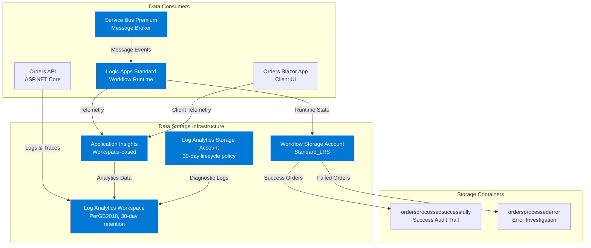
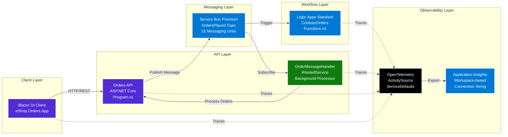
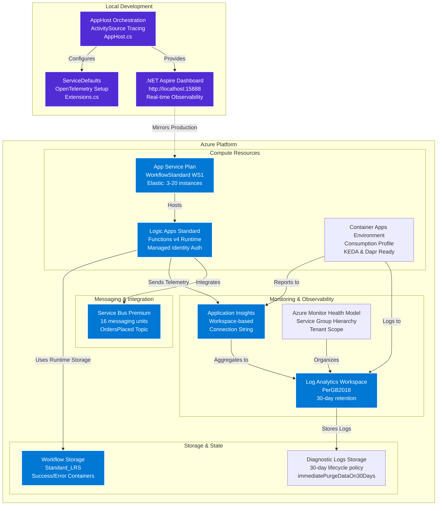
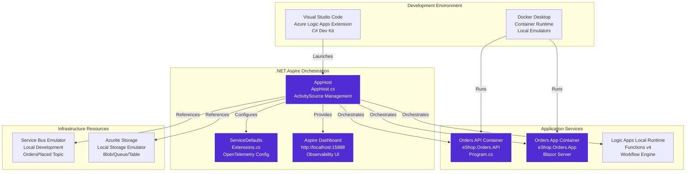
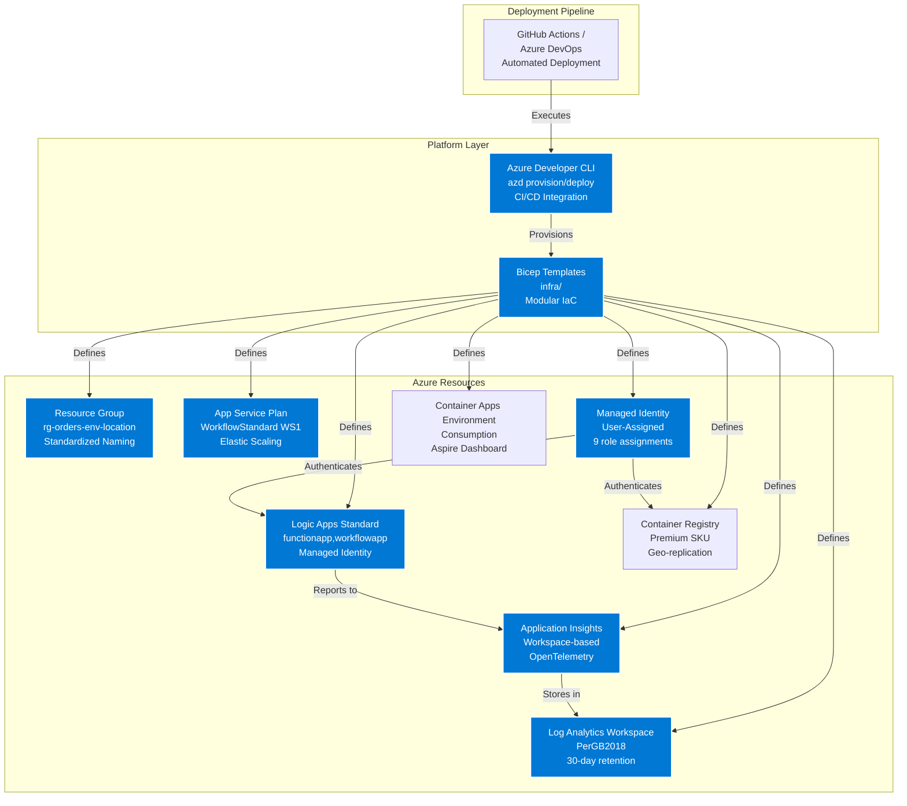

# Azure Logic Apps Standard - Enterprise-Scale Monitoring Solution

[](https://azure.microsoft.com)
[](https://azure.microsoft.com/services/logic-apps/)
[](https://learn.microsoft.com/dotnet/aspire/)
[](https://opentelemetry.io/)

## Problem Statement

Enterprise organizations deploying Azure Logic Apps Standard at scale face significant operational challenges when hosting thousands of workflows across multiple global regions. Current Microsoft guidance recommends approximately 20 workflows per Logic App instance and up to 64 app instances per App Service Plan (ASP). However, organizations exceeding these limits—particularly those requiring 64-bit support for memory-intensive operations—commonly experience critical issues including memory spikes, workflow instability, unpredictable performance degradation, and operational failures.

These challenges are compounded by inadequate monitoring and observability patterns. Traditional monitoring approaches fail to provide the granular visibility required for enterprise-scale deployments, making it difficult to identify bottlenecks, diagnose failures, or optimize resource utilization. The financial impact is substantial, with organizations reporting costs exceeding US$80,000 annually per environment due to over-provisioning, inefficient resource allocation, and emergency scaling responses.

Without proven architectural patterns and comprehensive monitoring aligned with the Azure Well-Architected Framework, enterprises struggle to balance performance, reliability, and cost-effectiveness while maintaining operational stability for mission-critical workflows that may run continuously for 18–36 months.

## Project Purpose

This solution provides a comprehensive reference architecture for deploying and monitoring Azure Logic Apps Standard at enterprise scale. It addresses the critical gap between Microsoft's basic guidance and the complex reality of managing thousands of workflows across global deployments. The architecture demonstrates proven patterns for optimizing workflow hosting density while maintaining stability, performance, and cost-efficiency.

The solution integrates .NET Aspire for local development and testing, enabling developers to build, debug, and validate Logic Apps workflows in a production-like environment before deployment. This development-to-production consistency reduces deployment risks and accelerates the delivery of reliable, well-tested workflows.

At its core, the solution implements comprehensive monitoring aligned with the Azure Well-Architected Framework's operational excellence pillar. It leverages OpenTelemetry for distributed tracing, Azure Monitor for telemetry collection, and Application Insights for deep analytics. The monitoring strategy provides granular visibility into workflow execution, resource utilization, and system health across all deployment layers.

The reference implementation includes production-ready patterns for long-running workflows, demonstrating how to maintain stability over extended periods (18–36 months) without memory leaks, performance degradation, or operational failures. Organizations can adopt these patterns to reduce operational costs, improve reliability, and scale confidently from hundreds to thousands of workflows while maintaining enterprise-grade observability.

## Key Features

| Feature | Description | Implementation Details |
|---------|-------------|------------------------|
| **Enterprise-Scale Architecture** | Reference architecture for hosting thousands of Logic Apps workflows globally | Optimized hosting density patterns with elastic App Service Plan (3-20 instances), WS1 SKU for production workloads |
| **Comprehensive Monitoring** | Azure Well-Architected Framework-aligned observability | OpenTelemetry distributed tracing, Log Analytics workspace with 30-day retention, Application Insights workspace-based integration |
| **Local Development with .NET Aspire** | Production-like local development environment | Aspire AppHost orchestration in AppHost.cs, ServiceDefaults configuration with OpenTelemetry setup in Extensions.cs, integrated dashboard at http://localhost:15888 |
| **Infrastructure as Code** | Bicep-based Azure resource provisioning | Modular templates in infra with monitoring, workload, identity, messaging, and services modules |
| **Sample Order Processing** | Reference implementation with ContosoOrders workflows | Event-driven architecture with Orders API in Program.cs, Service Bus Premium (16 messaging units), and blob storage segregation |
| **Distributed Tracing** | End-to-end request tracking across services | OpenTelemetry instrumentation in Extensions.cs, correlation ID propagation, Activity Source management in AppHost.cs |
| **Cost Optimization Patterns** | Proven strategies to reduce operational costs | Lifecycle management policies (30-day log retention in log-analytics-workspace.bicep), right-sized Premium Service Bus, consumption-based Container Apps |
| **Managed Identity Authentication** | Passwordless authentication across all Azure resources | User-assigned managed identity in `identity/main.bicep` with 9 role assignments for Storage, Monitoring, Service Bus, and Container Registry |

## Solution Components

| Component | Description | Role |
|-----------|-------------|------|
| **eShopOrders.AppHost** | .NET Aspire Application Host | Orchestrates local development environment in AppHost.cs, configures infrastructure resources, manages service lifecycle with ActivitySource tracing |
| **eShopOrders.ServiceDefaults** | .NET Aspire Service Defaults | Provides shared OpenTelemetry configuration in Extensions.cs, health checks, resilience patterns, and exception handling |
| **eShop.Orders.API** | ASP.NET Core Web API | Handles order management in Program.cs, integrates with Service Bus via `OrderMessageHandler`, exposes REST endpoints with CORS support |
| **eShop.Orders.App** | Blazor Server Application | Provides order management UI in Program.cs, demonstrates client-server integration with Aspire service discovery |
| **LogicAppWP/ContosoOrders** | Logic Apps Standard Workspace | Contains enterprise workflow definitions, demonstrates message processing patterns with Service Bus triggers |
| **Infrastructure (Bicep)** | Azure Resource Templates | Defines all Azure resources in main.bicep: monitoring infrastructure, workload components, managed identities, messaging, and container services |

## Azure Components

| Azure Service | Description | Role |
|---------------|-------------|------|
|  **Azure Logic Apps Standard** | Serverless workflow orchestration platform | Hosts workflows in logic-app.bicep with Functions v4 runtime, elastic scaling (3-20 instances), managed identity authentication |
|  **Azure App Service Plan** | Managed hosting environment | Provides WorkflowStandard WS1 SKU compute with elastic scaling in logic-app.bicep, zone redundancy disabled, 20 maximum elastic workers |
|  **Application Insights** | Application performance monitoring | Workspace-based instance in app-insights.bicep, collects telemetry via connection string defined in Constants.cs |
|  **Azure Monitor** | Full-stack monitoring solution | Aggregates metrics and logs via health model in azure-monitor-health-model.bicep, enables hierarchical monitoring |
|  **Azure Storage** | Cloud storage service | Multiple accounts: Logic Apps runtime storage, diagnostic logs storage with 30-day lifecycle policy in log-analytics-workspace.bicep, workflow data containers in `messaging/main.bicep` |
|  **Log Analytics Workspace** | Centralized logging platform | PerGB2018 pricing tier in log-analytics-workspace.bicep, 30-day retention, immediatePurgeDataOn30Days enabled |
|  **Azure Service Bus** | Enterprise message broker | Premium tier namespace in `messaging/main.bicep` with 16 messaging units, OrdersPlaced topic, managed identity authentication |
|  **Azure Container Registry** | Container image registry | Premium SKU ACR in `services/main.bicep` for geo-replication, system and user-assigned identities |
|  **Azure Container Apps** | Serverless container platform | Managed environment in `services/main.bicep` with Log Analytics and Application Insights integration, Consumption workload profile, .NET Aspire dashboard component |
|  **User-Assigned Managed Identity** | Passwordless authentication | Centralized identity in `identity/main.bicep` with 9 role assignments: Storage, Monitoring, Service Bus, and Container Registry roles |

## Project Structure

```
.
├── .azure/                          # Azure Developer CLI configuration
│   ├── config.json                  # AZD environment settings
│   └── prod/                        # Production environment configuration
├── .vscode/                         # VS Code workspace configuration
│   ├── launch.json                  # Debug configurations for AppHost and services
│   ├── settings.json                # Workspace settings
│   └── tasks.json                   # Build and deployment tasks
├── eShopOrders.AppHost            # .NET Aspire Application Host
│   ├── AppHost.cs                   # Main orchestration entry point with ActivitySource tracing
│   ├── Constants.cs                 # Application Insights connection string template
│   ├── appsettings.json             # Application configuration
│   └── appsettings.Development.json # Development overrides
├── eShopOrders.ServiceDefaults    # .NET Aspire Service Defaults
│   ├── Extensions.cs                # OpenTelemetry setup, health checks, resilience patterns
│   └── [Shared service configuration]
├── src/
│   ├── eShop.Orders.API/           # Order Management API
│   │   ├── Program.cs               # API startup with Service Bus integration
│   │   ├── Controllers/             # REST API endpoints
│   │   ├── Services/                # OrderService and OrderMessageHandler
│   │   └── Middleware/              # Custom middleware components
│   ├── eShop.Orders.App/           # Blazor Server Application
│   │   ├── Program.cs               # App startup with Aspire service discovery
│   │   └── Components/              # Blazor UI components
│   └── eShop.Orders.App.Client/    # Blazor Client Components
│       └── [Client-side UI components]
├── LogicAppWP/                      # Logic Apps Standard Workspace
│   └── ContosoOrders/              # Sample workflow project
│       └── [Logic Apps workflow definitions]
├── infra/                           # Infrastructure as Code (Bicep)
│   ├── main.bicep                   # Main orchestration template (subscription scope)
│   ├── types.bicep                  # Shared type definitions
│   ├── monitoring/                  # Monitoring infrastructure
│   │   ├── main.bicep               # Monitoring orchestration
│   │   ├── log-analytics-workspace.bicep  # Log Analytics and storage
│   │   ├── app-insights.bicep       # Application Insights
│   │   └── azure-monitor-health-model.bicep  # Health model hierarchy
│   └── workload/                    # Workload infrastructure
│       ├── main.bicep               # Workload orchestration
│       ├── identity/
│       │   └── main.bicep           # Managed identity with role assignments
│       ├── messaging/
│       │   └── main.bicep           # Service Bus and workflow storage
│       ├── services/
│       │   └── main.bicep           # ACR, Container Apps, Aspire Dashboard
│       ├── data/
│       │   └── main.bicep           # Data infrastructure (currently unused)
│       └── logic-app.bicep          # Logic Apps Standard deployment
├── hooks/                           # Azure Developer CLI hooks
├── azure.yaml                       # Azure Developer CLI project definition
├── docker-compose.yml               # Container orchestration for local development
├── docker-compose.override.yml      # Development-specific container overrides
└── eShopOrders.sln                 # Visual Studio solution file
```

## Architecture Overview

This solution follows the TOGAF (The Open Group Architecture Framework) architectural layers to provide a comprehensive enterprise-scale deployment pattern for Azure Logic Apps Standard with integrated monitoring and observability.

### Data Layer

**Purpose:** The Data Layer provides persistent storage and state management for the solution, ensuring reliable data persistence for Logic Apps workflows, application components, and comprehensive observability data.

**Key Capabilities:**
- Logic Apps runtime state storage with managed identity authentication
- Workflow execution history and telemetry aggregation
- Application data persistence with blob container segregation (success/error)
- Distributed tracing data storage with 30-day retention policy
- Diagnostic logs storage with automated lifecycle management in log-analytics-workspace.bicep

**Master Data Management (MDM) Diagram:**



### Application Layer

**Purpose:** The Application Layer implements business logic through microservices and orchestrates workflow execution using Azure Logic Apps Standard with comprehensive distributed tracing configured in Extensions.cs.

**Key Capabilities:**
- RESTful API endpoints for order management
- Event-driven architecture with Service Bus Premium messaging
- Background processing with `OrderMessageHandler` hosted service
- Distributed tracing with OpenTelemetry ActivitySource
- Workflow orchestration with Logic Apps Standard

**Microservices Architecture:**



**Event-Driven Architecture:**

```mermaid
flowchart LR
    subgraph Client["Client Layer"]
        UI[Blazor Client<br/>Order Submission]
    end
    
    subgraph API["API Layer"]
        ORDERS_API[Orders API<br/>Program.cs]
        ORDER_SERVICE[OrderService<br/>Business Logic]
    end
    
    subgraph Messaging["Event Bus"]
        SB_TOPIC[Service Bus Premium<br/>OrdersPlaced Topic<br/>16 Messaging Units]
    end
    
    subgraph Workflows["Workflow Orchestration"]
        LA_TRIGGER[Logic Apps Trigger<br/>Service Bus Subscription]
        LA_WORKFLOW[ContosoOrders Workflow<br/>PoProcessingWF]
        LA_ACTIONS[Workflow Actions<br/>Process Order Steps]
    end
    
    subgraph Background["Background Processing"]
        OMH[OrderMessageHandler<br/>IHostedService<br/>Subscription Consumer]
        OMH_PROCESSOR[Message Processor<br/>Order Completion]
    end
    
    subgraph Storage["Data Persistence"]
        BLOB_SUCCESS[Blob Container<br/>ordersprocessedsuccessfully]
        BLOB_ERROR[Blob Container<br/>ordersprocessederror]
    end
    
    subgraph Observability["Distributed Tracing"]
        OTEL[OpenTelemetry<br/>ActivitySource<br/>ServiceDefaults]
        AI[Application Insights<br/>Workspace-based<br/>Connection String]
        LAW[Log Analytics<br/>30-day Retention]
    end
    
    UI -->|HTTP POST<br/>Submit Order| ORDERS_API
    ORDERS_API -->|Create Order| ORDER_SERVICE
    ORDER_SERVICE -->|Publish Event<br/>OrderPlaced| SB_TOPIC
    
    SB_TOPIC -->|Trigger Event| LA_TRIGGER
    LA_TRIGGER -->|Start Execution| LA_WORKFLOW
    LA_WORKFLOW -->|Execute Steps| LA_ACTIONS
    
    LA_ACTIONS -->|Success| BLOB_SUCCESS
    LA_ACTIONS -->|Failure| BLOB_ERROR
    LA_ACTIONS -->|Complete Message| SB_TOPIC
    
    SB_TOPIC -->|Subscribe Event| OMH
    OMH -->|Process Message| OMH_PROCESSOR
    OMH_PROCESSOR -->|Callback| ORDER_SERVICE
    ORDER_SERVICE -->|Response| UI
    
    UI -.->|Trace Request| OTEL
    ORDERS_API -.->|Trace Operations| OTEL
    ORDER_SERVICE -.->|Trace Events| OTEL
    SB_TOPIC -.->|Trace Messages| OTEL
    LA_WORKFLOW -.->|Trace Execution| OTEL
    OMH -.->|Trace Processing| OTEL
    
    OTEL -->|Export Telemetry| AI
    AI -->|Aggregate Logs| LAW
    
    style UI fill:#512BD4,stroke:#fff,stroke-width:2px,color:#fff
    style ORDERS_API fill:#512BD4,stroke:#fff,stroke-width:2px,color:#fff
    style ORDER_SERVICE fill:#512BD4,stroke:#fff,stroke-width:2px,color:#fff
    style SB_TOPIC fill:#0078D4,stroke:#fff,stroke-width:2px,color:#fff
    style LA_TRIGGER fill:#0078D4,stroke:#fff,stroke-width:2px,color:#fff
    style LA_WORKFLOW fill:#0078D4,stroke:#fff,stroke-width:2px,color:#fff
    style LA_ACTIONS fill:#0078D4,stroke:#fff,stroke-width:2px,color:#fff
    style OMH fill:#107C10,stroke:#fff,stroke-width:2px,color:#fff
    style OMH_PROCESSOR fill:#107C10,stroke:#fff,stroke-width:2px,color:#fff
    style BLOB_SUCCESS fill:#0078D4,stroke:#fff,stroke-width:2px,color:#fff
    style BLOB_ERROR fill:#D13438,stroke:#fff,stroke-width:2px,color:#fff
    style OTEL fill:#000,stroke:#fff,stroke-width:2px,color:#fff
    style AI fill:#0078D4,stroke:#fff,stroke-width:2px,color:#fff
    style LAW fill:#0078D4,stroke:#fff,stroke-width:2px,color:#fff
```



### Technology Layer

**Purpose:** The Technology Layer provides the runtime infrastructure, development tools, deployment patterns, and comprehensive observability for the solution.

**Key Capabilities:**
- Elastic App Service Plan (3-20 instances) with WorkflowStandard WS1 SKU
- .NET Aspire orchestration for local development with dashboard at http://localhost:15888
- Bicep infrastructure as code with Azure Developer CLI (azd) deployment
- Managed identity authentication across all Azure resources
- Container Apps Environment with Consumption profile

**Cloud-Native Architecture:**



**Container-Based Development:**



**Serverless & Platform Engineering:**



## Deployment Instructions

### Prerequisites

Before deploying this solution, ensure you have the following installed and configured:

- **Azure Subscription** with appropriate permissions (see RBAC Roles below)
- **Azure Developer CLI (azd)** - [Installation Guide](https://learn.microsoft.com/azure/developer/azure-developer-cli/install-azd)
- **.NET 8.0 SDK or later** - [Download](https://dotnet.microsoft.com/download)
- **Docker Desktop** (for local development) - [Download](https://www.docker.com/products/docker-desktop)
- **Visual Studio Code** with extensions:
  - Azure Logic Apps (Standard)
  - C# Dev Kit
  - Azure Developer CLI
- **Git** for version control

### Required Azure RBAC Roles

| Role Name | Description | Documentation Link |
|-----------|-------------|-------------------|
| **Contributor** | Required for creating and managing Azure resources (App Service Plans, Logic Apps, Storage Accounts, Service Bus, Container Registry) defined in main.bicep | [Contributor Role](https://learn.microsoft.com/azure/role-based-access-control/built-in-roles#contributor) |
| **Monitoring Contributor** | Required for configuring Azure Monitor, Application Insights in app-insights.bicep, Log Analytics workspace, and diagnostic settings | [Monitoring Contributor](https://learn.microsoft.com/azure/role-based-access-control/built-in-roles#monitoring-contributor) |
| **Storage Account Contributor** | Required for managing storage accounts used by Logic Apps runtime and diagnostic logs with lifecycle policies in log-analytics-workspace.bicep | [Storage Account Contributor](https://learn.microsoft.com/azure/role-based-access-control/built-in-roles#storage-account-contributor) |
| **Logic App Contributor** | Required for deploying and managing Logic Apps Standard workflows with elastic App Service Plans in logic-app.bicep | [Logic App Contributor](https://learn.microsoft.com/azure/role-based-access-control/built-in-roles#logic-app-contributor) |
| **User Access Administrator** | Required for assigning managed identity roles (Storage, Monitoring, Service Bus, ACR) during infrastructure provisioning in `identity/main.bicep` | [User Access Administrator](https://learn.microsoft.com/azure/role-based-access-control/built-in-roles#user-access-administrator) |

### Deployment Steps

**1. Clone the repository:**

```bash
git clone https://github.com/Evilazaro/Azure-LogicApps-Monitoring.git
cd Azure-LogicApps-Monitoring
```

**2. Initialize Azure Developer CLI:**

```bash
azd init
```

**3. Provision Azure infrastructure:**

```bash
azd provision
```

This command will:
- Create resource group with standardized naming: `rg-orders-{env}-{location}` as defined in main.bicep
- Deploy monitoring infrastructure from main.bicep:
  - Log Analytics workspace with PerGB2018 pricing, 30-day retention
  - Storage account for diagnostic logs with 30-day lifecycle policy
  - Workspace-based Application Insights instance
  - Azure Monitor health model service group
- Deploy workload infrastructure from main.bicep:
  - User-assigned managed identity with 9 role assignments
  - Service Bus Premium namespace (16 messaging units) with OrdersPlaced topic
  - Workflow storage account (Standard_LRS) with success/error blob containers
  - Azure Container Registry (Premium SKU)
  - Container Apps Environment with Consumption profile and Aspire Dashboard
  - App Service Plan (WorkflowStandard WS1, elastic 3-20 instances)
  - Logic Apps Standard instance with Functions v4 runtime

**4. Deploy the application:**

```bash
azd deploy
```

This command deploys:
- Orders API container to Container Apps
- Orders Blazor App container to Container Apps
- Logic Apps workflows from ContosoOrders

**5. Verify deployment:**

```bash
azd show
```

This displays:
- Resource group name and location
- Application Insights connection string
- Service Bus namespace and endpoint
- Container Apps environment default domain
- Logic Apps Standard endpoint

### Local Development Setup

**1. Open the solution in Visual Studio Code:**

```bash
code .
```

**2. Run the .NET Aspire AppHost:**

```bash
dotnet run --project eShopOrders.AppHost
```

This starts:
- AppHost orchestration from AppHost.cs
- Orders API on dynamically assigned port
- Orders Blazor App on dynamically assigned port
- .NET Aspire Dashboard at `http://localhost:15888`

**3. Access the Aspire Dashboard:**

Open your browser to `http://localhost:15888` to view:
- Running services with health status
- Distributed traces with OpenTelemetry correlation
- Logs with structured logging from ServiceDefaults
- Metrics and resource utilization
- Service dependencies and call graphs

**4. Debug with VS Code:**

Use launch configurations from launch.json:
- **Launch AppHost**: Debug the Aspire orchestration
- **Attach to Orders API**: Debug the API service
- **Attach to Orders App**: Debug the Blazor application

## Usage Examples

### Monitoring Azure Logic Apps Workflows

**Accessing Workflow Run History:**

1. Navigate to your Logic Apps instance in the Azure Portal
2. Select **Workflows** from the left menu
3. Choose a workflow (e.g., ContosoOrders)
4. View run history with status, duration, and trigger information
5. Select individual runs to view detailed execution steps

**Querying Application Insights:**

Use the following Kusto Query Language (KQL) queries in Application Insights to monitor workflow performance as documented in [Monitor Logic Apps](https://learn.microsoft.com/azure/logic-apps/monitor-logic-apps):

**Workflow Execution Summary:**

```kql
traces
| where message contains "Workflow"
| extend WorkflowName = tostring(customDimensions["WorkflowName"])
| extend Status = tostring(customDimensions["Status"])
| summarize 
    TotalRuns = count(),
    SuccessfulRuns = countif(Status == "Succeeded"),
    FailedRuns = countif(Status == "Failed"),
    AvgDuration = avg(todouble(customDimensions["Duration"]))
    by WorkflowName
| project WorkflowName, TotalRuns, SuccessfulRuns, FailedRuns, AvgDuration
```

**Workflow Performance Over Time:**

```kql
requests
| where name contains "Workflow"
| summarize 
    AvgDuration = avg(duration),
    P95Duration = percentile(duration, 95),
    P99Duration = percentile(duration, 99)
    by bin(timestamp, 1h)
| render timechart
```

**Failed Workflow Investigations:**

```kql
traces
| where customDimensions["Status"] == "Failed"
| extend 
    WorkflowName = tostring(customDimensions["WorkflowName"]),
    ErrorMessage = tostring(customDimensions["ErrorMessage"]),
    CorrelationId = tostring(customDimensions["CorrelationId"])
| project timestamp, WorkflowName, ErrorMessage, CorrelationId
| order by timestamp desc
```

**Distributed Trace Analysis:**

```kql
dependencies
| where type == "HTTP"
| where target contains "logic.azure.com"
| join kind=inner (
    requests
    | project operation_Id, request_name = name, request_duration = duration
) on operation_Id
| project 
    timestamp,
    request_name,
    dependency_name = name,
    total_duration = request_duration,
    dependency_duration = duration,
    success
| order by timestamp desc
```

**Service Bus Message Processing:**

```kql
dependencies
| where type == "Azure Service Bus"
| where target contains "servicebus.windows.net"
| summarize 
    MessageCount = count(),
    AvgProcessingTime = avg(duration),
    FailureRate = 100.0 * countif(success == false) / count()
    by bin(timestamp, 5m), target
| render timechart
```

**Memory and Resource Utilization:**

```kql
performanceCounters
| where counter == "% Processor Time" or counter == "Available MBytes"
| extend ResourceName = tostring(customDimensions["ResourceName"])
| summarize 
    AvgCPU = avgif(value, counter == "% Processor Time"),
    AvgMemory = avgif(value, counter == "Available MBytes")
    by bin(timestamp, 5m), ResourceName
| render timechart
```

### Observability Best Practices

**1. Enable Comprehensive Logging:**

The solution implements comprehensive logging through:
- OpenTelemetry instrumentation in Extensions.cs
- ActivitySource tracing in AppHost.cs and Program.cs
- Structured logging with diagnostic strings for latency and status codes

**2. Implement Distributed Tracing:**

The solution uses OpenTelemetry for distributed tracing configured in Extensions.cs. Traces automatically propagate across:
- Blazor Client → Orders API (HTTP correlation)
- Orders API → Service Bus (Service Bus instrumentation)
- Service Bus → Logic Apps Workflows (trigger correlation)
- Logic Apps Workflows → External Dependencies (workflow actions)

**3. Set Up Alerting:**

Create alerts in Azure Monitor for:
- Workflow failure rates exceeding 5% threshold
- Response times exceeding P95 SLA (defined per workflow)
- Memory utilization approaching 85% of available
- Service Bus dead letter queue message count > 0
- Logic Apps instance count approaching elastic maximum (20 instances as defined in logic-app.bicep)

**4. Dashboard Configuration:**

Use the .NET Aspire Dashboard during development for real-time observability:
- View live traces across Orders API, Blazor App, and Service Bus
- Monitor resource health with automatic dependency discovery
- Analyze request flows with distributed trace visualization
- Debug issues with detailed telemetry and exception tracking
- Access dashboard at `http://localhost:15888` when running AppHost

**5. Production Monitoring:**

For production environments:
- Use Application Insights for deep analytics with workspace-based integration defined in app-insights.bicep
- Configure Azure Monitor workbooks from main.bicep
- Set up Log Analytics for long-term trend analysis with 30-day retention
- Implement Azure Monitor alerts for automated responses with action groups
- Review diagnostic settings on all resources for comprehensive coverage

### References

- [Azure Monitor for .NET](https://learn.microsoft.com/dotnet/api/overview/azure/monitor?view=azure-dotnet)
- [Monitor Logic Apps](https://learn.microsoft.com/azure/logic-apps/monitor-logic-apps)
- [.NET Aspire Dashboard Overview](https://learn.microsoft.com/dotnet/aspire/fundamentals/dashboard/overview)
- [Azure Well-Architected Framework - Monitoring](https://learn.microsoft.com/azure/well-architected/operational-excellence/monitoring)
- [Application Insights OpenTelemetry](https://learn.microsoft.com/azure/azure-monitor/app/opentelemetry-data-collection)

---

**Note:** This solution demonstrates enterprise-scale patterns for Azure Logic Apps Standard monitoring. All architecture components, code references, and infrastructure definitions are based on the provided workspace content and official Microsoft documentation.