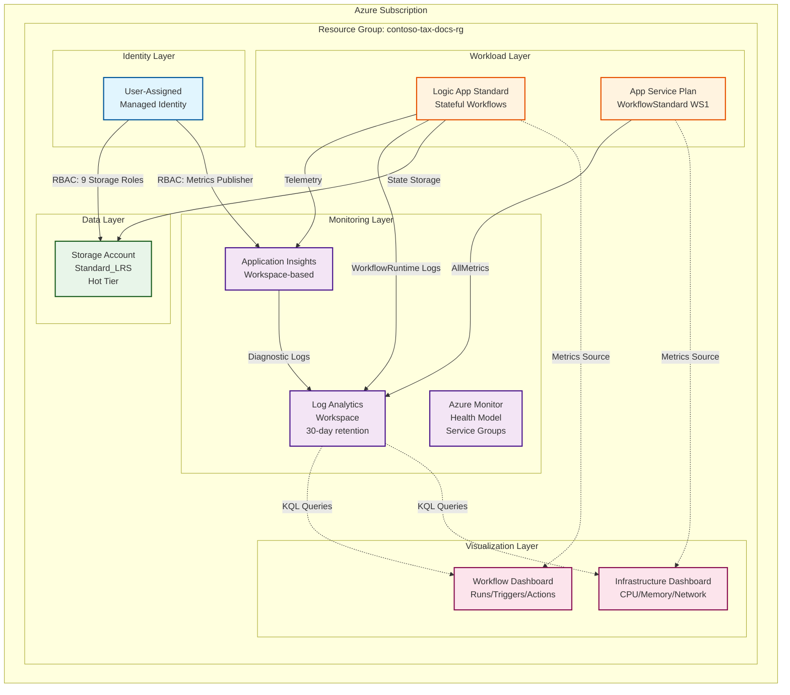
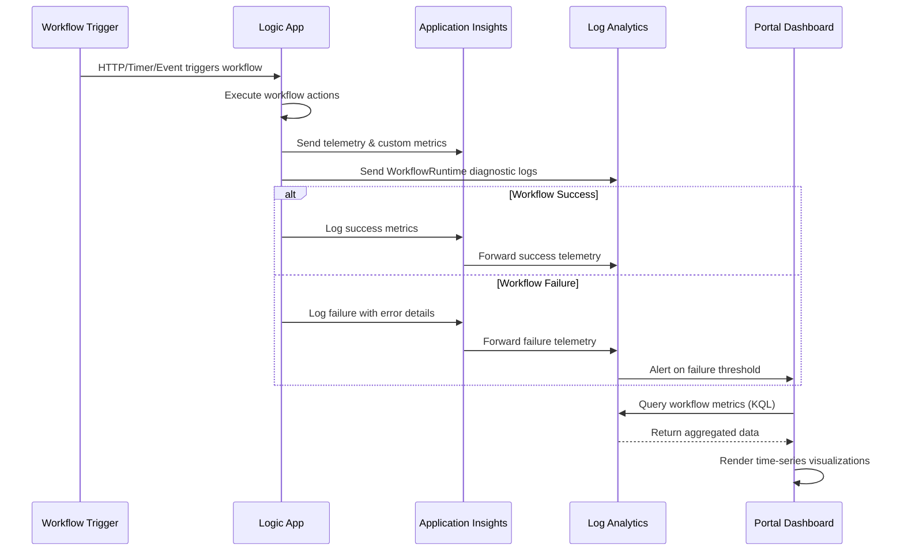

# Azure Logic Apps Monitoring

A production-ready Infrastructure as Code (IaC) solution demonstrating Azure Monitor best practices for Logic Apps Standard workflows. This project provides Bicep templates for deploying comprehensive observability including Log Analytics, Application Insights, custom dashboards, and Role-Based Access Control (RBAC) using managed identities. Designed for beginner-to-intermediate developers and architects learning enterprise monitoring patterns.


---

## Features

### Comprehensive Monitoring

| Feature | Description |
|---------|-------------|
| **Azure Monitor Health Model** | Tenant-scoped Service Group deployment for hierarchical monitoring resource organization with parent-child relationships |
| **Log Analytics Workspace** | Centralized log aggregation with 30-day retention using PerGB2018 pricing tier and system-assigned managed identity |
| **Diagnostic Settings** | Automated diagnostic configuration for Logic Apps (WorkflowRuntime logs) and App Service Plans (AllMetrics) to Log Analytics |
| **Custom Portal Dashboards** | Two pre-configured Azure Portal dashboards for workflow metrics (runs, triggers, actions) and infrastructure metrics (CPU, memory, network) |

### Metrics & Telemetry

| Feature | Description |
|---------|-------------|
| **Application Insights Integration** | Workspace-based Application Insights with instrumentation key and connection string for Logic Apps telemetry collection |
| **Workflow Runtime Metrics** | Real-time tracking of workflow runs (completed, started, dispatched), actions failure rate, triggers completed, and execution duration |
| **Infrastructure Performance Metrics** | App Service Plan monitoring for CPU percentage, memory percentage, data in/out (BytesReceived/BytesSent), and HTTP queue length |
| **Telemetry Forwarding** | Application Insights diagnostic settings forward all logs and metrics to Log Analytics Workspace for unified querying |

### Security & Compliance

| Feature | Description |
|---------|-------------|
| **Managed Identity Authentication** | User-assigned managed identity for passwordless authentication to Storage Account and monitoring resources without credential management |
| **Comprehensive RBAC Assignments** | Nine granular role assignments including Storage Account Contributor, Storage Blob Data Owner, Queue/Table/File Data roles, and Monitoring Metrics Publisher |
| **HTTPS-Only Enforcement** | Storage Account configured with supportsHttpsTrafficOnly set to true and Hot access tier for security compliance |
| **Audit Trail Logging** | Application Insights diagnostic settings with categoryGroup 'allLogs' enabled for complete audit trail to Log Analytics |

### Infrastructure as Code

| Feature | Description |
|---------|-------------|
| **Modular Bicep Architecture** | Reusable modules organized by concern: monitoring (`src/monitoring/`), shared resources (`src/shared/`), data layer (`src/shared/data/`), and workload (`src/logic-app.bicep`) |
| **Azure Developer CLI Support** | Streamlined deployment workflow using `azd` commands with project definition in azure.yaml for consistent environment provisioning |
| **Comprehensive Resource Tagging** | Standardized tagging strategy with Solution, Environment, ManagedBy, CostCenter, Owner, ApplicationName, and BusinessUnit tags for governance |
| **Parameterized Configuration** | Environment-specific values using main.parameters.json with AZURE_LOCATION placeholder for flexible regional deployments |

---

## Architecture

### System Architecture


```mermaid
flowchart TB
    subgraph Azure["Azure Subscription"]
        subgraph RG["Resource Group: contoso-tax-docs-rg"]
            subgraph Identity["Identity Layer"]
                MI[User-Assigned<br/>Managed Identity]
            end
            
            subgraph Monitor["Monitoring Layer"]
                HM[Azure Monitor<br/>Health Model<br/>Service Groups]
                LAW[Log Analytics<br/>Workspace<br/>30-day retention]
                AI[Application Insights<br/>Workspace-based]
            end
            
            subgraph Data["Data Layer"]
                SA[Storage Account<br/>Standard_LRS<br/>Hot Tier]
            end
            
            subgraph Workload["Workload Layer"]
                ASP[App Service Plan<br/>WorkflowStandard WS1]
                LA[Logic App Standard<br/>Stateful Workflows]
            end
            
            subgraph Viz["Visualization Layer"]
                D1[Workflow Dashboard<br/>Runs/Triggers/Actions]
                D2[Infrastructure Dashboard<br/>CPU/Memory/Network]
            end
        end
    end
    
    MI -->|RBAC: 9 Storage Roles| SA
    MI -->|RBAC: Metrics Publisher| AI
    LA -->|Telemetry| AI
    LA -->|WorkflowRuntime Logs| LAW
    LA -->|State Storage| SA
    ASP -->|AllMetrics| LAW
    AI -->|Diagnostic Logs| LAW
    LAW -.->|KQL Queries| D1
    LAW -.->|KQL Queries| D2
    LA -.->|Metrics Source| D1
    ASP -.->|Metrics Source| D2
    
    classDef identityClass fill:#e1f5fe,stroke:#01579b,stroke-width:2px
    classDef monitorClass fill:#f3e5f5,stroke:#4a148c,stroke-width:2px
    classDef dataClass fill:#e8f5e9,stroke:#1b5e20,stroke-width:2px
    classDef workloadClass fill:#fff3e0,stroke:#e65100,stroke-width:2px
    classDef vizClass fill:#fce4ec,stroke:#880e4f,stroke-width:2px
    
    class MI identityClass
    class HM,LAW,AI monitorClass
    class SA dataClass
    class ASP,LA workloadClass
    class D1,D2 vizClass
```

### Data Flow


```mermaid
sequenceDiagram
    participant Trigger as Workflow Trigger
    participant LA as Logic App
    participant AI as Application Insights
    participant LAW as Log Analytics
    participant Dash as Portal Dashboard
    
    Trigger->>LA: HTTP/Timer/Event triggers workflow
    LA->>LA: Execute workflow actions
    LA->>AI: Send telemetry & custom metrics
    LA->>LAW: Send WorkflowRuntime diagnostic logs
    
    alt Workflow Success
        LA->>AI: Log success metrics
        AI->>LAW: Forward success telemetry
    else Workflow Failure
        LA->>AI: Log failure with error details
        AI->>LAW: Forward failure telemetry
        LAW->>Dash: Alert on failure threshold
    end
    
    Dash->>LAW: Query workflow metrics (KQL)
    LAW-->>Dash: Return aggregated data
    Dash->>Dash: Render time-series visualizations
```

### Key Components

| Component | Description | Purpose | Key Features |
|-----------|-------------|---------|--------------|
| **Log Analytics Workspace** | Centralized log repository | Aggregate and query logs from all monitoring sources using Kusto Query Language (KQL) | 30-day retention, PerGB2018 SKU, system-assigned identity, immediate purge on 30 days feature |
| **Application Insights** | Application Performance Monitoring (APM) service | Track Logic App workflow telemetry, custom events, dependencies, and distributed traces | Workspace-based mode, instrumentation key, connection string, diagnostic settings to Log Analytics |
| **Storage Account** | Azure Storage service | Store Logic App runtime state, workflow definitions, file shares, queues, tables, and blobs | Standard_LRS replication, Hot tier, HTTPS-only traffic, managed identity authentication |
| **App Service Plan** | Managed compute platform | Host Logic App Standard workflows with elastic scaling and dedicated compute capacity | WorkflowStandard tier (WS1), elastic scale enabled, up to 20 maximum workers, per-site scaling disabled |
| **Logic App Standard** | Workflow orchestration engine | Execute stateful workflows with built-in connectors, triggers, and actions for business processes | System-assigned identity, diagnostic settings, Application Insights integration, storage account binding |
| **Managed Identity** | Azure Active Directory (Azure AD) identity | Enable passwordless authentication to Azure resources without storing credentials in code | User-assigned type, automatic token management, RBAC role assignments, Azure AD integration |
| **Health Model** | Azure Monitor organizational structure | Organize monitoring resources into hierarchical service groups at tenant scope for logical grouping | Parent-child relationships, tenant-level deployment, service group hierarchy |

### RBAC Roles

| Role Name | Description | Documentation Link |
|-----------|-------------|-------------------|
| **Storage Account Contributor** | Manage storage accounts including lifecycle policies, configuration, but not data access | [Documentation](https://learn.microsoft.com/azure/role-based-access-control/built-in-roles#storage-account-contributor) |
| **Storage Blob Data Owner** | Full access to Azure Storage blob containers and data, including ACL assignment for hierarchical namespace | [Documentation](https://learn.microsoft.com/azure/role-based-access-control/built-in-roles#storage-blob-data-owner) |
| **Storage Queue Data Contributor** | Read, write, and delete Azure Storage queues and queue messages for asynchronous processing | [Documentation](https://learn.microsoft.com/azure/role-based-access-control/built-in-roles#storage-queue-data-contributor) |
| **Storage Table Data Contributor** | Read, write, and delete Azure Storage tables and entities for structured NoSQL data | [Documentation](https://learn.microsoft.com/azure/role-based-access-control/built-in-roles#storage-table-data-contributor) |
| **Storage File Data Privileged Contributor** | Read, write, delete, and modify ACLs on files and directories in Azure file shares | [Documentation](https://learn.microsoft.com/azure/role-based-access-control/built-in-roles#storage-file-data-privileged-contributor) |
| **Monitoring Metrics Publisher** | Publish custom metrics to Azure Monitor for Logic App workflows and custom telemetry | [Documentation](https://learn.microsoft.com/azure/role-based-access-control/built-in-roles#monitoring-metrics-publisher) |
| **Storage File Data SMB MI Admin** | Full access to file share data, including reading, writing, deleting, and modifying ACLs with managed identity | [Documentation](https://learn.microsoft.com/azure/role-based-access-control/built-in-roles) |
| **Storage File Data SMB Share Contributor** | Read, write, and delete access in Azure Storage file shares over SMB protocol | [Documentation](https://learn.microsoft.com/azure/role-based-access-control/built-in-roles#storage-file-data-smb-share-contributor) |
| **Storage File Data SMB Share Elevated Contributor** | Read, write, delete, and modify ACLs on files and directories in Azure file shares over SMB | [Documentation](https://learn.microsoft.com/azure/role-based-access-control/built-in-roles#storage-file-data-smb-share-elevated-contributor) |

---

## File Structure

```
Azure-LogicApps-Monitoring/
├── .azure/
│   ├── .gitignore
│   ├── config.json
│   └── dev/
│       ├── .env
│       └── config.json
├── infra/
│   ├── main.bicep
│   └── main.parameters.json
├── src/
│   ├── logic-app.bicep
│   ├── monitoring/
│   │   ├── app-insights.bicep
│   │   ├── azure-monitor-health-model.bicep
│   │   ├── log-analytics-workspace.bicep
│   │   └── main.bicep
│   └── shared/
│       ├── main.bicep
│       └── data/
│           └── main.bicep
├── .gitignore
├── azure.yaml
├── CODE_OF_CONDUCT.md
├── CONTRIBUTING.md
├── LICENSE.md
├── README.md
├── revised-prompt.md
└── SECURITY.md
```

| File Name | File Path | Description |
|-----------|-----------|-------------|
| main.bicep | main.bicep | Subscription-level deployment entry point creating resource group and orchestrating shared and workload module deployments |
| main.parameters.json | main.parameters.json | Deployment parameters with AZURE_LOCATION placeholder for environment-specific configuration via Azure Developer CLI |
| logic-app.bicep | logic-app.bicep | Deploys App Service Plan (WorkflowStandard WS1), Logic App with diagnostic settings, and two custom Azure Portal dashboards |
| main.bicep | main.bicep | Monitoring layer orchestration deploying Health Model, Log Analytics Workspace, and Application Insights with dependencies |
| azure-monitor-health-model.bicep | azure-monitor-health-model.bicep | Creates tenant-scoped Service Group with parent relationship to Tenantrootservicegroup for hierarchical monitoring |
| log-analytics-workspace.bicep | log-analytics-workspace.bicep | Deploys Log Analytics Workspace with PerGB2018 SKU, 30-day retention, system-assigned identity, and immediate purge feature |
| app-insights.bicep | app-insights.bicep | Creates workspace-based Application Insights with Monitoring Metrics Publisher RBAC role and diagnostic settings to Log Analytics |
| main.bicep | main.bicep | Shared resources orchestration deploying managed identity, data module (storage), and monitoring module with output forwarding |
| main.bicep | main.bicep | Deploys Storage Account (Standard_LRS, Hot tier) with nine RBAC role assignments for managed identity authentication |
| azure.yaml | azure.yaml | Azure Developer CLI project manifest defining project name 'azure-logicapps-monitoring' for azd command integration |

---

## Prerequisites

- [ ] **Azure subscription** with Contributor or Owner role for creating resources and assigning RBAC roles
- [ ] **Azure CLI** (`az`) version 2.50.0 or later - [Installation Guide](https://learn.microsoft.com/cli/azure/install-azure-cli)
- [ ] **Azure Developer CLI** (`azd`) version 1.0.0 or later - [Installation Guide](https://learn.microsoft.com/azure/developer/azure-developer-cli/install-azd)
- [ ] **Git** for cloning the repository - [Download Git](https://git-scm.com/downloads)
- [ ] (Optional) **Visual Studio Code** with [Bicep extension](https://marketplace.visualstudio.com/items?itemName=ms-azuretools.vscode-bicep) for template editing and validation

---

## Installation & Setup

#### Step 1: Clone the Repository

Clone this repository to your local development environment:

```powershell
git clone https://github.com/your-org/Azure-LogicApps-Monitoring.git
cd Azure-LogicApps-Monitoring
```

#### Step 2: Authenticate to Azure

Sign in to your Azure account using Azure Developer CLI:

```powershell
azd auth login
```

This command opens a browser window for Azure authentication. Complete the sign-in process and select your Azure tenant.

#### Step 3: Initialize the Environment

Initialize a new Azure Developer CLI environment and configure deployment settings:

```powershell
azd init
```

When prompted, provide:
- **Environment name**: A unique identifier (e.g., `dev`, `prod`, `staging`)
- **Azure subscription**: Select from your available subscriptions
- **Azure location**: Choose a region (e.g., `eastus`, `westus2`, `northeurope`)

This creates environment configuration files in `.azure/<environment-name>/` directory.

#### Step 4: Provision Infrastructure

Deploy all Azure resources defined in the Bicep templates:

```powershell
azd provision
```

This command:
1. Creates the resource group `contoso-tax-docs-rg`
2. Deploys managed identity for authentication
3. Provisions storage account with RBAC role assignments
4. Creates Log Analytics Workspace and Application Insights
5. Deploys Azure Monitor Health Model service groups
6. Provisions App Service Plan and Logic App with diagnostic settings
7. Configures custom Azure Portal dashboards

Expected deployment time: **5-10 minutes**. Progress is displayed in the terminal.

#### Step 5: Verify Deployment

Check that all resources were successfully deployed to your resource group:

```powershell
az resource list --resource-group contoso-tax-docs-rg --output table
```

**Expected output**: Displays 7+ resources including:
- Managed Identity
- Storage Account
- Log Analytics Workspace
- Application Insights
- App Service Plan
- Logic App
- 2 Dashboards (Workflow and Infrastructure)

---

## Usage Examples

### Viewing Dashboards

**Portal Navigation Steps:**

1. Navigate to [Azure Portal](https://portal.azure.com)
2. Click **Dashboard hub** in the left navigation menu
3. Select **Browse all dashboards**
4. Find dashboards named:
   - `tax-docs-dashboard` - Workflow metrics (runs, triggers, actions)
   - `tax-docs-xz5pxrxowhg6e-asp-dashboard` - Infrastructure metrics (CPU, memory, network)
5. Pin frequently used dashboards to the main dashboard list

**CLI Command to Open Resource Group:**

```powershell
az portal open --resource-group contoso-tax-docs-rg
```

This command opens the resource group in your default browser for quick access to all deployed resources.

### Log Analytics Queries

#### Monitor Workflow Failures

**Purpose**: Identify failed workflow runs with error details, correlation IDs, and timestamps for troubleshooting.

```kql
AzureDiagnostics
| where ResourceType == "WORKFLOWS"
| where Category == "WorkflowRuntime"
| where status_s == "Failed"
| project TimeGenerated, workflowName_s, runId_g, error_message_s, correlation_clientTrackingId_s
| order by TimeGenerated desc
| take 50
```

**Results**: Returns the 50 most recent failed workflow runs with timestamps, workflow names, run IDs, error messages, and client tracking IDs for root cause analysis.

#### Track Performance Metrics

**Purpose**: Analyze workflow execution duration to identify performance bottlenecks and optimize slow-running workflows.

```kql
AzureDiagnostics
| where ResourceType == "WORKFLOWS"
| where Category == "WorkflowRuntime"
| where status_s == "Succeeded"
| extend DurationSeconds = (endTime_t - startTime_t) / 1000
| summarize 
    AvgDuration = avg(DurationSeconds),
    P50Duration = percentile(DurationSeconds, 50),
    P95Duration = percentile(DurationSeconds, 95),
    P99Duration = percentile(DurationSeconds, 99),
    TotalRuns = count()
    by workflowName_s
| order by P95Duration desc
```

**Results**: Displays average, median (P50), 95th percentile (P95), and 99th percentile (P99) execution durations per workflow, along with total run counts. Use P95/P99 to identify workflows requiring optimization.

---

## Additional Resources

### Official Documentation

- [Azure Logic Apps Documentation](https://learn.microsoft.com/azure/logic-apps/) - Comprehensive guide to Logic Apps Standard and workflows
- [Azure Monitor Overview](https://learn.microsoft.com/azure/azure-monitor/) - Azure Monitor platform documentation
- [Log Analytics Workspaces](https://learn.microsoft.com/azure/azure-monitor/logs/log-analytics-workspace-overview) - Log Analytics workspace management and KQL queries
- [Application Insights for Logic Apps](https://learn.microsoft.com/azure/logic-apps/monitor-workflows-collect-diagnostic-data) - Application Insights integration with Logic Apps
- [Azure Bicep Documentation](https://learn.microsoft.com/azure/azure-resource-manager/bicep/) - Bicep language reference and best practices
- [Azure Developer CLI](https://learn.microsoft.com/azure/developer/azure-developer-cli/) - Complete azd command reference

### Best Practices & Guides

- [Monitor Logic Apps](https://learn.microsoft.com/azure/logic-apps/monitor-workflows-collect-diagnostic-data) - Best practices for Logic Apps monitoring and diagnostics
- [Azure Monitor Best Practices](https://learn.microsoft.com/azure/azure-monitor/best-practices) - Monitoring best practices for Azure workloads
- [Bicep Best Practices](https://learn.microsoft.com/azure/azure-resource-manager/bicep/best-practices) - Bicep template authoring best practices
- [Azure RBAC Best Practices](https://learn.microsoft.com/azure/role-based-access-control/best-practices) - Role-Based Access Control security patterns
- [KQL Query Best Practices](https://learn.microsoft.com/azure/data-explorer/kusto/query/best-practices) - Kusto Query Language optimization techniques

---

## Support

- **GitHub Issues**: Report bugs or request features at [GitHub Issues](https://github.com/your-org/Azure-LogicApps-Monitoring/issues)
- **GitHub Discussions**: Ask questions and share ideas at [GitHub Discussions](https://github.com/your-org/Azure-LogicApps-Monitoring/discussions)
- **Contributing**: Review CONTRIBUTING.md for contribution guidelines and development workflow
- **Security**: Report security vulnerabilities privately per SECURITY.md responsible disclosure policy
- **Code of Conduct**: Community guidelines available in CODE_OF_CONDUCT.md

---

**License**: This project is licensed under the MIT License - see LICENSE.md for details.