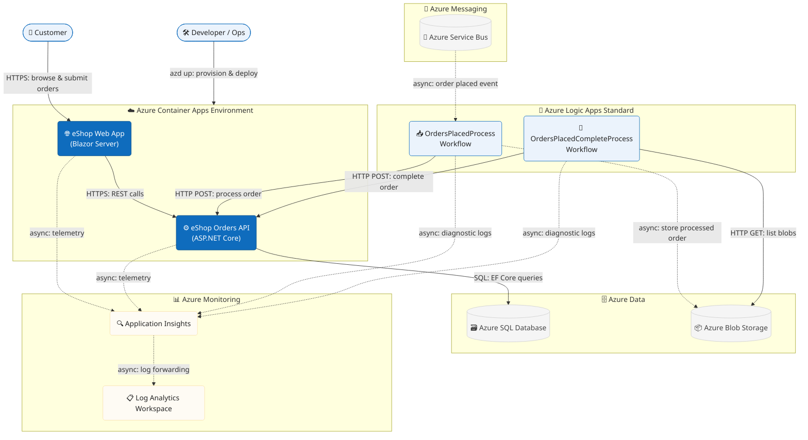

# Azure Logic Apps Monitoring

[](https://github.com/Evilazaro/Azure-LogicApps-Monitoring/actions/workflows/ci-dotnet.yml)
[](https://github.com/Evilazaro/Azure-LogicApps-Monitoring/actions/workflows/azure-dev.yml)
[](LICENSE)
[](https://dotnet.microsoft.com)
[](https://learn.microsoft.com/azure/logic-apps/)

**Azure Logic Apps Monitoring** is an end-to-end reference solution that demonstrates how to build, deploy, and monitor event-driven order-processing workflows using Azure Logic Apps Standard alongside a .NET 10 microservices backend.

The solution solves the challenge of tracking distributed order processing across multiple Azure services — Service Bus, Blob Storage, SQL Database, and Container Apps — by centralizing telemetry in Application Insights and Log Analytics, giving operators full visibility into every workflow execution and API call.

The technology stack combines **.NET Aspire** for local orchestration, **ASP.NET Core** for the Orders REST API, **Blazor Server** with Microsoft FluentUI for the frontend, **Azure Logic Apps Standard** for workflow automation, and **Bicep** for infrastructure-as-code, all deployed to Azure Container Apps and Azure Logic Apps via the Azure Developer CLI (`azd`).

## Table of Contents

- [Features](#features)
- [Architecture](#architecture)
- [Technologies Used](#technologies-used)
- [Quick Start](#quick-start)
- [Configuration](#configuration)
- [Deployment](#deployment)
- [Usage](#usage)
- [Contributing](#contributing)
- [License](#license)

## Features

- 📥 **Event-driven order intake** — the `OrdersPlacedProcess` Logic App workflow is triggered by Azure Service Bus messages and calls the Orders API to persist each new order.
- 🔁 **Automated order completion** — the `OrdersPlacedCompleteProcess` Logic App workflow polls Azure Blob Storage on a recurrence schedule and marks matching orders as complete via the Orders API.
- ⚙️ **Orders REST API** — ASP.NET Core Web API backed by Azure SQL Database with Entity Framework Core, connection resiliency, and OpenAPI / Swagger documentation.
- 🌐 **Blazor Server frontend** — Microsoft FluentUI-based web application that lets customers submit and track orders in real time.
- 📊 **Centralized observability** — Application Insights and Log Analytics collect distributed traces, structured logs, and metrics from every component.
- 🔐 **Passwordless authentication** — all Azure service connections use User Assigned Managed Identity; no secrets or connection strings are stored in application code.
- 🏗️ **Infrastructure as code** — complete Bicep templates provision the full solution (VNet, Container Apps, Logic Apps, Service Bus, SQL, Storage, Monitoring) in a single `azd up` command.
- 🧪 **Test coverage** — dedicated test projects for the AppHost, ServiceDefaults, Orders API, and Web App layers.

## Architecture

### Architecture Summary

The Azure Logic Apps Monitoring solution serves two primary actors: **customers** who submit and track orders through the Blazor Server web application, and **developers / operators** who provision and monitor the system. Customer requests flow from the web application to the Orders REST API, which persists data in Azure SQL Database. Asynchronously, Azure Service Bus delivers order-placed events to the `OrdersPlacedProcess` Logic App workflow, which calls the Orders API to process each order and writes a confirmation blob to Azure Blob Storage. A second recurrence-driven workflow, `OrdersPlacedCompleteProcess`, polls Blob Storage and finalizes completed orders via the same API. Application Insights aggregates telemetry from all components and forwards logs to a Log Analytics workspace for centralized monitoring.


```mermaid
---
config:
  primaryColor: "#0f6cbd"
  primaryTextColor: "#FFFFFF"
  primaryBorderColor: "#0f548c"
  secondaryColor: "#ebf3fc"
  secondaryTextColor: "#242424"
  secondaryBorderColor: "#0f6cbd"
  tertiaryColor: "#f5f5f5"
  tertiaryTextColor: "#424242"
  tertiaryBorderColor: "#d1d1d1"
  noteBkgColor: "#fefbf4"
  noteTextColor: "#242424"
  noteBorderColor: "#f9e2ae"
  lineColor: "#616161"
  background: "#FFFFFF"
  edgeLabelBackground: "#FFFFFF"
  clusterBkg: "#fafafa"
  clusterBorder: "#e0e0e0"
  titleColor: "#242424"
  errorBkgColor: "#fdf3f4"
  errorTextColor: "#b10e1c"
  fontFamily: "'Segoe UI', Verdana, sans-serif"
  fontSize: 16px
  align: center
  description: "High-level architecture diagram showing actors, primary flows, and major components."
---
flowchart TB

%% ── Actors ──────────────────────────────────────────────────────────────────
  User(["👤 Customer"])
  Ops(["🛠️ Developer / Ops"])

%% ── Frontend + API ──────────────────────────────────────────────────────────
  subgraph ACA["☁️ Azure Container Apps Environment"]
    WebApp("🌐 eShop Web App<br/>(Blazor Server)")
    OrdersAPI("⚙️ eShop Orders API<br/>(ASP.NET Core)")
  end

%% ── Messaging ────────────────────────────────────────────────────────────────
  subgraph Messaging["📨 Azure Messaging"]
    SB[("🚌 Azure Service Bus")]
  end

%% ── Logic Apps Workflows ─────────────────────────────────────────────────────
  subgraph Workflows["🔄 Azure Logic Apps Standard"]
    LA1("📥 OrdersPlacedProcess<br/>Workflow")
    LA2("🔁 OrdersPlacedCompleteProcess<br/>Workflow")
  end

%% ── Data ─────────────────────────────────────────────────────────────────────
  subgraph Data["🗄️ Azure Data"]
    SQL[("🗃️ Azure SQL Database")]
    Blob[("📦 Azure Blob Storage")]
  end

%% ── Observability ────────────────────────────────────────────────────────────
  subgraph Monitoring["📊 Azure Monitoring"]
    AppInsights("🔍 Application Insights")
    LogAnalytics("📋 Log Analytics Workspace")
  end

%% ── Interactions ─────────────────────────────────────────────────────────────
  User -->|"HTTPS: browse & submit orders"| WebApp
  Ops -->|"azd up: provision & deploy"| ACA

  WebApp -->|"HTTPS: REST calls"| OrdersAPI
  OrdersAPI -->|"SQL: EF Core queries"| SQL

  SB -.->|"async: order placed event"| LA1
  LA1 -->|"HTTP POST: process order"| OrdersAPI
  LA1 -.->|"async: store processed order"| Blob

  LA2 -->|"HTTP GET: list blobs"| Blob
  LA2 -->|"HTTP POST: complete order"| OrdersAPI

  WebApp -.->|"async: telemetry"| AppInsights
  OrdersAPI -.->|"async: telemetry"| AppInsights
  LA1 -.->|"async: diagnostic logs"| AppInsights
  LA2 -.->|"async: diagnostic logs"| AppInsights
  AppInsights -.->|"async: log forwarding"| LogAnalytics

%% ── Class Definitions ────────────────────────────────────────────────────────
  classDef actor fill:#ebf3fc,stroke:#0f6cbd,color:#242424
  classDef service fill:#0f6cbd,stroke:#0f548c,color:#FFFFFF
  classDef datastore fill:#f5f5f5,stroke:#d1d1d1,color:#424242
  classDef monitoring fill:#fefbf4,stroke:#f9e2ae,color:#242424
  classDef workflow fill:#ebf3fc,stroke:#0f6cbd,color:#242424

  class User,Ops actor
  class WebApp,OrdersAPI service
  class SQL,Blob,SB datastore
  class AppInsights,LogAnalytics monitoring
  class LA1,LA2 workflow
```

## Technologies Used

| Technology                     | Type                    | Purpose                                                       |
| ------------------------------ | ----------------------- | ------------------------------------------------------------- |
| .NET 10 / C#                   | Runtime / Language      | Core application runtime for all services                     |
| ASP.NET Core                   | Framework               | Orders REST API with controllers, DI, and middleware          |
| Blazor Server                  | Framework               | Interactive server-side web frontend                          |
| Microsoft FluentUI for Blazor  | UI Component Library    | Design system and component set for the Web App               |
| Entity Framework Core          | ORM                     | Data access layer for Azure SQL Database                      |
| .NET Aspire                    | Orchestration Framework | Local development service orchestration and service discovery |
| Azure Logic Apps Standard      | Workflow Engine         | Event-driven and scheduled order-processing workflows         |
| Azure Service Bus              | Messaging               | Asynchronous delivery of order-placed events to Logic Apps    |
| Azure SQL Database             | Relational Database     | Persistent storage for order data                             |
| Azure Blob Storage             | Object Storage          | Stores processed-order confirmation blobs                     |
| Azure Container Apps           | Container Platform      | Hosts the Orders API and Web App in production                |
| Azure Container Registry       | Container Registry      | Stores Docker images for Container Apps                       |
| Azure Application Insights     | APM / Telemetry         | Distributed tracing, metrics, and structured logging          |
| Azure Log Analytics            | Log Management          | Centralized log aggregation from all components               |
| Azure Virtual Network          | Networking              | Private network isolation with subnets for each tier          |
| User Assigned Managed Identity | Authentication          | Passwordless access to Azure services                         |
| Bicep                          | Infrastructure as Code  | Declarative Azure resource provisioning                       |
| Azure Developer CLI (`azd`)    | Deployment Tooling      | End-to-end provisioning and deployment automation             |
| GitHub Actions                 | CI/CD                   | Automated build, test, and deployment pipelines               |

## Quick Start

### Prerequisites

| Prerequisite                                                                                               | Minimum Version | Notes                               |
| ---------------------------------------------------------------------------------------------------------- | --------------- | ----------------------------------- |
| [.NET SDK](https://dotnet.microsoft.com/download)                                                          | 10.0            | Specified in `global.json`          |
| [Azure CLI](https://learn.microsoft.com/cli/azure/install-azure-cli)                                       | 2.60.0          | Required for authentication         |
| [Azure Developer CLI (`azd`)](https://learn.microsoft.com/azure/developer/azure-developer-cli/install-azd) | 1.11.0          | Required for provisioning           |
| [Docker Desktop](https://www.docker.com/products/docker-desktop/)                                          | Latest          | Required for local container builds |
| Azure Subscription                                                                                         | —               | Required for cloud deployment       |

### Installation

1. Clone the repository.

   ```bash
   git clone https://github.com/Evilazaro/Azure-LogicApps-Monitoring.git
   cd Azure-LogicApps-Monitoring
   ```

2. Authenticate with Azure.

   ```bash
   az login
   azd auth login
   ```

3. Create a new `azd` environment.

   ```bash
   azd env new <your-environment-name>
   ```

4. Restore .NET dependencies.

   ```bash
   dotnet restore app.sln
   ```

5. Run the solution locally using .NET Aspire.

   ```bash
   dotnet run --project app.AppHost
   ```

### Minimal Working Example

After running step 5, the .NET Aspire dashboard opens automatically. Navigate to the Orders API Swagger UI to place a test order:

```bash
# Place an order via the Orders API
curl -X POST https://localhost:<port>/api/Orders \
  -H "Content-Type: application/json" \
  -d '{
    "customerId": "customer-001",
    "productId": "product-abc",
    "quantity": 2
  }'
# Expected response: HTTP 201 Created with the created order object
```

> [!TIP]
> The .NET Aspire AppHost automatically configures service discovery so `eShop.Web.App` resolves the Orders API address without manual configuration.

## Configuration

### Environment Variables and Settings

| Option                                  | Default                  | Description                                                                                                                                 |
| --------------------------------------- | ------------------------ | ------------------------------------------------------------------------------------------------------------------------------------------- |
| `ConnectionStrings__OrderDb`            | _(required)_             | Azure SQL connection string for the Orders database. Injected by Aspire in local development; set via `azd env set` for Azure deployments.  |
| `Azure__ServiceBus__HostName`           | _(optional)_             | Fully qualified Service Bus namespace hostname (e.g., `mybus.servicebus.windows.net`). When absent, the local Service Bus emulator is used. |
| `Azure__TenantId`                       | _(optional)_             | Azure AD tenant ID for local development credential override. Not required in Azure Container Apps.                                         |
| `Azure__ClientId`                       | _(optional)_             | Managed identity client ID for local development. Not required in Azure Container Apps.                                                     |
| `APPLICATIONINSIGHTS_CONNECTION_STRING` | _(optional)_             | Application Insights connection string. Injected automatically in Azure Container Apps.                                                     |
| `services__orders-api__https__0`        | _(required for Web App)_ | Orders API base URL. Resolved automatically by Aspire service discovery.                                                                    |

### Example Override (`appsettings.Development.json`)

```json
{
  "ConnectionStrings": {
    "OrderDb": "Server=localhost,1433;Database=OrderDb;..."
  },
  "Azure": {
    "ServiceBus": {
      "HostName": "mybus.servicebus.windows.net"
    },
    "TenantId": "<your-tenant-id>",
    "ClientId": "<your-client-id>"
  }
}
```

> [!IMPORTANT]
> Never commit real credentials or connection strings to source control. Use `azd env set` for environment-specific secrets and Azure Key Vault for production workloads.

## Deployment

> [!NOTE]
> The following steps deploy the full solution to Azure, including all infrastructure resources defined in `infra/main.bicep`. Estimated provisioning time is 15–25 minutes for a new environment.

1. Authenticate with Azure and the Azure Developer CLI.

   ```bash
   az login
   azd auth login
   ```

2. Create and configure the deployment environment.

   ```bash
   azd env new production
   azd env set AZURE_LOCATION eastus
   ```

3. Run the pre-provision hook to validate the workstation.

   ```bash
   pwsh hooks/check-dev-workstation.ps1
   ```

4. Provision infrastructure and deploy all services in one step.

   ```bash
   azd up
   ```

   This command:
   - Provisions the Azure resource group, VNet, managed identity, SQL Server, Service Bus, Container Registry, Container Apps, Logic Apps, and monitoring resources via `infra/main.bicep`.
   - Builds and pushes Docker images for `eShop.Orders.API` and `eShop.Web.App`.
   - Deploys the Logic Apps workflows from `workflows/OrdersManagement/`.
   - Runs post-provision hooks to configure SQL managed identity access.

5. (Optional) Deploy only application code after infrastructure already exists.

   ```bash
   azd deploy
   ```

6. To tear down all resources, run:

   ```bash
   azd down
   ```

> [!WARNING]
> Running `azd down` permanently deletes all provisioned Azure resources and their data. Back up any important data before proceeding.

## Usage

### Submit an Order via the Web App

Open the Web App URL displayed by `azd up` in a browser. Use the order form to submit a new order. The order is saved to Azure SQL and a Service Bus message is published automatically, triggering the `OrdersPlacedProcess` Logic App workflow.

### Call the Orders API Directly

```bash
# List all orders
curl https://<orders-api-url>/api/Orders \
  -H "Accept: application/json"
# Expected output: HTTP 200 with a JSON array of order objects

# Place a new order
curl -X POST https://<orders-api-url>/api/Orders \
  -H "Content-Type: application/json" \
  -d '{
    "customerId": "customer-001",
    "productId": "product-xyz",
    "quantity": 1
  }'
# Expected output: HTTP 201 Created
# {
#   "id": "...",
#   "customerId": "customer-001",
#   "productId": "product-xyz",
#   "quantity": 1,
#   "status": "Placed"
# }
```

### Generate Sample Orders

Use the provided script to generate a batch of test orders:

```powershell
# Generate 10 sample orders against the running API
pwsh hooks/Generate-Orders.ps1 -OrdersApiUrl https://<orders-api-url> -Count 10
```

### Access the OpenAPI Documentation

Navigate to `https://<orders-api-url>/swagger` to explore the interactive API documentation.

> [!NOTE]
> Replace `<orders-api-url>` with the URL shown in the `azd up` output or in the Azure Portal under your Container App.

## Contributing

Contributions are welcome. Submit issues and pull requests through the [GitHub repository](https://github.com/Evilazaro/Azure-LogicApps-Monitoring).

**To report a bug or request a feature**, open a [GitHub Issue](https://github.com/Evilazaro/Azure-LogicApps-Monitoring/issues) and fill in the provided template.

**To submit a pull request**:

1. Fork the repository.
2. Create a feature branch: `git checkout -b feature/your-feature-name`.
3. Commit your changes with a descriptive message.
4. Push the branch and open a pull request against `main`.
5. Ensure all CI checks pass before requesting a review.

> [!NOTE]
> A `CONTRIBUTING.md` file with detailed contribution guidelines will be added to this repository. Check the [issues list](https://github.com/Evilazaro/Azure-LogicApps-Monitoring/issues) for the tracking item.

## License

This project is licensed under the **MIT License**. See the [LICENSE](LICENSE) file for full terms.
