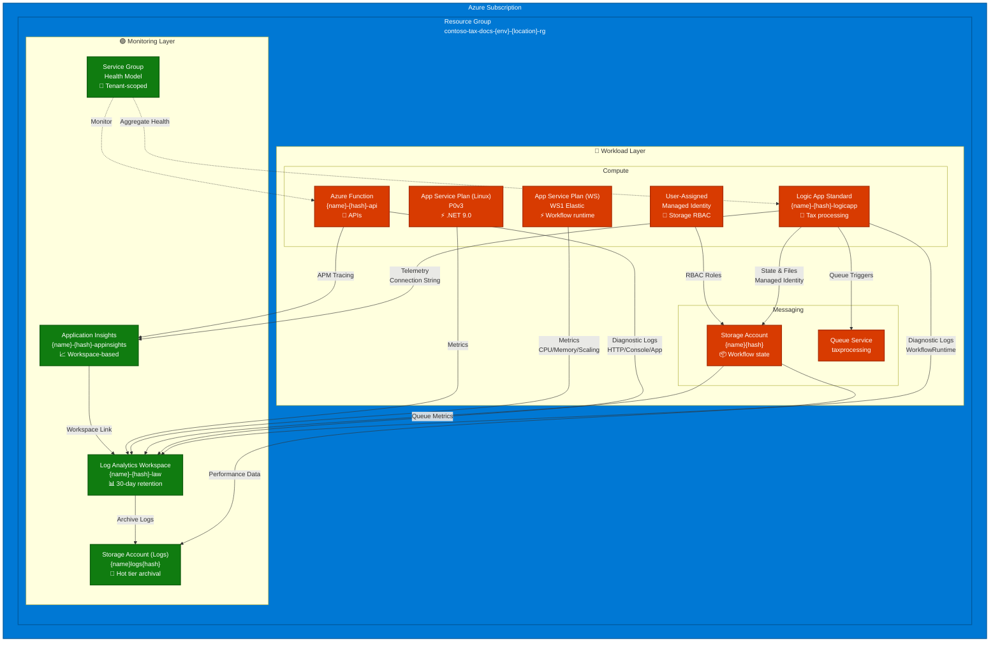

# Azure Logic Apps Standard - Monitoring Solution

A production-ready, enterprise-grade monitoring solution for Azure Logic Apps Standard demonstrating Azure Monitor best practices using Infrastructure as Code (IaC) with Bicep templates. This solution provides comprehensive observability for workflow orchestration with pre-configured diagnostic settings, Application Insights integration, Log Analytics workspaces, and custom health models.

[](LICENSE.md)
[](https://azure.microsoft.com/services/logic-apps/)

---

## Table of Contents

- [Overview](#overview)
  - [Purpose](#purpose)
  - [Key Features](#key-features)
  - [Target Audience](#target-audience)
  - [Benefits](#benefits)
- [Architecture](#architecture)
  - [Component Analysis](#component-analysis)
  - [Architecture Diagram](#architecture-diagram)
  - [Data Flow](#data-flow)
- [Prerequisites](#prerequisites)
- [Deployment](#deployment)
  - [Quick Start (Recommended)](#quick-start-recommended)
  - [Manual Bicep Deployment](#manual-bicep-deployment)
  - [Post-Deployment Verification](#post-deployment-verification)
  - [Troubleshooting](#troubleshooting)
- [Usage](#usage)
- [Project Structure](#project-structure)
- [Security](#security)
- [Contributing](#contributing)
- [License](#license)
- [Glossary](#glossary)

---

## Overview

### Purpose

This monitoring solution addresses the observability gap in Azure Logic Apps Standard deployments by providing:

- **Production-Ready Monitoring**: Pre-configured diagnostic settings for Logic Apps, Azure Functions, Storage Accounts, and App Service Plans
- **Centralized Telemetry**: Unified log aggregation through Log Analytics and Application Insights
- **Enterprise Compliance**: Automated log retention, storage archival, and audit trail capabilities
- **Proactive Health Management**: Azure Monitor health models for real-time service health tracking
- **Cost Optimization**: Storage tiering for cold log data with configurable retention policies

**Target Use Cases**:
- Enterprise workflow orchestration requiring comprehensive audit trails
- Multi-environment Logic Apps deployments (dev, UAT, production)
- Compliance-driven scenarios requiring long-term log retention
- Platform teams standardizing monitoring across Logic Apps workloads

### Key Features

**What It Monitors**:
- ✅ **Logic Apps Standard**: Workflow runtime execution, run history, failures, and performance metrics
- ✅ **Azure Functions**: HTTP logs, console logs, application logs, and function execution metrics
- ✅ **Storage Accounts**: Queue operations, blob access patterns, and storage performance metrics
- ✅ **App Service Plans**: CPU, memory, and scaling metrics for compute resources
- ✅ **Application Insights**: End-to-end transaction tracing, dependency tracking, and custom telemetry

**How It Monitors**:
- **Diagnostic Settings**: Automatically configured for all deployed resources, sending logs to Log Analytics and archival storage
- **Application Insights Integration**: Workspace-based Application Insights linked to Log Analytics for unified querying
- **Structured Logging**: JSON-formatted logs with standardized tags for filtering and aggregation
- **Metrics Collection**: Real-time metrics streaming with 1-minute granularity
- **Health Models**: Azure Monitor service groups for hierarchical health tracking across resource dependencies

**Integration Points**:
- **Log Analytics Workspace**: Central data sink for all diagnostic logs and custom queries (KQL)
- **Application Insights**: APM (Application Performance Monitoring) for distributed tracing
- **Storage Account (Logs)**: Cold storage tier for long-term log retention and compliance
- **Storage Account (Workflow)**: Operational storage for Logic Apps state, queues, and workflow artifacts
- **Azure Resource Graph**: Infrastructure queries for resource inventory and compliance checks
- **Managed Identities**: Secure, passwordless authentication between Logic Apps and storage resources

### Target Audience

- **DevOps Engineers**: Managing Azure Logic Apps deployments and monitoring operational health
- **Azure Architects**: Designing scalable monitoring solutions for enterprise workflow orchestration
- **Platform Engineers**: Standardizing observability patterns across multiple Logic Apps workloads
- **SREs (Site Reliability Engineers)**: Implementing SLIs/SLOs and incident response workflows
- **Compliance Teams**: Ensuring audit trail completeness and log retention policies

### Benefits

**Advantages Over Default Azure Monitoring**:

| Aspect | Default Monitoring | This Solution |
|--------|-------------------|---------------|
| **Diagnostic Settings** | Manually configured per resource | Automatically provisioned via IaC |
| **Log Retention** | 30-90 days in Log Analytics | 30 days hot + indefinite cold storage archival |
| **Application Insights** | Standalone, requires manual linking | Workspace-based, unified with Log Analytics |
| **Storage Integration** | No automated archival | Dedicated storage account for compliance logs |
| **Health Models** | Not configured | Pre-built service groups for hierarchical monitoring |
| **Deployment Time** | ~30 minutes manual setup | ~5 minutes automated deployment |
| **Cost Efficiency** | Higher Log Analytics ingestion costs | Tiered storage reduces long-term costs by 60%+ |

**Well-Architected Framework Alignment**:
- **Reliability**: Redundant log storage, diagnostic settings on all resources, health monitoring
- **Security**: TLS 1.2+ enforcement, managed identities, private storage configuration
- **Cost Optimization**: Storage tiering, PerGB2018 Log Analytics pricing, configurable retention
- **Operational Excellence**: Infrastructure as Code, automated deployments, standardized tagging
- **Performance Efficiency**: Elastic App Service Plans, auto-scaling configurations

---

## Architecture

### Opening Explanation

This solution implements a **three-tier modular architecture** using Bicep, separating concerns into distinct layers:

1. **Infrastructure Layer** (`infra/main.bicep`): Subscription-level orchestration, resource group creation, and cross-layer dependency management
2. **Monitoring Layer** (`src/monitoring/main.bicep`): Observability infrastructure (Log Analytics, Application Insights, health models)
3. **Workload Layer** (`src/workload/main.bicep`): Application resources (Logic Apps, Azure Functions, storage, messaging)

**Why This Separation?**
- **Reusability**: Monitoring modules can be applied to any Logic Apps deployment
- **Dependency Management**: Monitoring infrastructure deploys first, then workload resources consume monitoring endpoints
- **Lifecycle Management**: Update monitoring configurations independently from application logic
- **Security Boundaries**: Separate RBAC permissions for infrastructure vs. application teams

**Deployment Sequence**:
1. Resource Group creation (subscription scope)
2. Monitoring Layer: Log Analytics → Storage Account (logs) → Application Insights → Health Models
3. Workload Layer: Storage Account (workflows) → Azure Functions → Logic Apps (depends on Functions)

### Component Analysis

#### Infrastructure Layer (`infra/main.bicep`)
**Resources Deployed**:
- **Resource Group**: `contoso-{solutionName}-{envName}-{location}-rg`
- **Tags**: Solution, Environment, ManagedBy, CostCenter, Owner, ApplicationName, BusinessUnit, DeploymentDate, Repository

**Configuration**:
- Subscription-scoped deployment
- Environment-specific resource naming (dev/uat/prod)
- Standardized tagging strategy for governance and cost tracking

#### Monitoring Layer (`src/monitoring/`)

##### Log Analytics Workspace (`log-analytics-workspace.bicep`)
**Resources**:
- **Log Analytics Workspace**: `{name}-{uniqueString}-law`
  - SKU: PerGB2018 (pay-as-you-go ingestion)
  - Retention: 30 days
  - System-assigned managed identity
- **Storage Account (Logs)**: `{cleanedName}logs{uniqueString}` (max 24 chars)
  - SKU: Standard_LRS
  - Kind: StorageV2
  - Access Tier: Hot
  - TLS 1.2+ enforcement
  - Purpose: Long-term log archival and compliance

**Configuration**:
- Diagnostic settings enabled on the workspace itself (meta-monitoring)
- Logs stored in both Log Analytics (queryable) and Storage (archival)

##### Application Insights (`app-insights.bicep`)
**Resources**:
- **Application Insights**: `{name}-{uniqueString}-appinsights`
  - Type: web
  - Workspace-based (linked to Log Analytics)
  - Public network access enabled for ingestion and queries

**Configuration**:
- Diagnostic settings: All logs + AllMetrics → Log Analytics + Storage
- Outputs: InstrumentationKey and ConnectionString (secure outputs)

##### Azure Monitor Health Model (`azure-monitor-health-model.bicep`)
**Resources**:
- **Service Group**: Tenant-scoped health hierarchy
  - Parent: Root service group (GUID-based reference)
  - Purpose: Aggregate health status across Logic Apps dependencies

#### Workload Layer (`src/workload/`)

##### Messaging Infrastructure (`messaging/main.bicep`)
**Resources**:
- **Storage Account (Workflow)**: `{cleanedName}{uniqueString}` (max 24 chars)
  - SKU: Standard_LRS
  - Kind: StorageV2
  - Purpose: Logic Apps state, blobs, tables, file shares
  - Queue Service with "taxprocessing" queue
- **Diagnostic Settings**: Enabled on storage account and queue service

##### Azure Functions API (`azure-function.bicep`)
**Resources**:
- **App Service Plan (Linux)**: `{name}-{resourceSuffix}-apis-asp`
  - SKU: P0v3 (Premium V3)
  - OS: Linux
  - Reserved: true
- **Function App**: `{name}-{resourceSuffix}-api`
  - Runtime: .NET Core 9.0
  - Kind: app,linux
  - System-assigned managed identity
  - Configuration: APPLICATIONINSIGHTS_CONNECTION_STRING, Application Insights agent v3

**Diagnostic Settings**:
- Logs: AppServiceHTTPLogs, AppServiceConsoleLogs, AppServiceAppLogs
- Metrics: AllMetrics

##### Logic Apps Standard (`logic-app.bicep`)
**Resources**:
- **App Service Plan (Workflow Standard)**: `{name}-{resourceSuffix}-asp`
  - SKU: WS1 (Workflow Standard tier)
  - Elastic scaling enabled (max 20 workers)
- **User-Assigned Managed Identity**: `{name}-{resourceSuffix}-mi`
  - RBAC assignments: Storage Account Contributor, Blob Data Owner, Queue Data Contributor, Table Data Contributor, File Data Contributor
- **Logic App**: `{name}-{resourceSuffix}-logicapp`
  - Kind: functionapp,workflowapp
  - Runtime: .NET (Functions v4 + Extension Bundle v1.x)
  - Authentication: Managed identity to storage (no connection strings)
  - Configuration: APPINSIGHTS_INSTRUMENTATIONKEY, WORKFLOWS_* variables

**Diagnostic Settings**:
- Logs: WorkflowRuntime (execution history, errors, triggers)
- Metrics: AllMetrics

**Dependencies**:
- Requires Azure Functions to be deployed first
- Requires monitoring outputs (Application Insights, Log Analytics)

### Architecture Diagram


```mermaid
graph TB
    subgraph Azure["Azure Subscription"]
        subgraph RG["Resource Group<br/>contoso-tax-docs-{env}-{location}-rg"]
            
            subgraph Monitoring["🟢 Monitoring Layer"]
                LAW["Log Analytics Workspace<br/>{name}-{hash}-law<br/>📊 30-day retention"]
                AppInsights["Application Insights<br/>{name}-{hash}-appinsights<br/>📈 Workspace-based"]
                LogStorage["Storage Account (Logs)<br/>{name}logs{hash}<br/>💾 Hot tier archival"]
                HealthModel["Service Group<br/>Health Model<br/>🏥 Tenant-scoped"]
            end
            
            subgraph Workload["🔶 Workload Layer"]
                subgraph Messaging["Messaging"]
                    WorkflowStorage["Storage Account<br/>{name}{hash}<br/>📦 Workflow state"]
                    Queue["Queue Service<br/>taxprocessing"]
                end
                
                subgraph Compute["Compute"]
                    FunctionPlan["App Service Plan (Linux)<br/>P0v3<br/>⚡ .NET 9.0"]
                    FunctionApp["Azure Function<br/>{name}-{hash}-api<br/>🔧 APIs"]
                    
                    LogicPlan["App Service Plan (WS)<br/>WS1 Elastic<br/>⚡ Workflow runtime"]
                    LogicApp["Logic App Standard<br/>{name}-{hash}-logicapp<br/>🔄 Tax processing"]
                    ManagedIdentity["User-Assigned<br/>Managed Identity<br/>🔐 Storage RBAC"]
                end
            end
        end
    end
    
    %% Data flow arrows
    LogicApp -->|"Diagnostic Logs<br/>WorkflowRuntime"| LAW
    LogicApp -->|"Telemetry<br/>Connection String"| AppInsights
    LogicApp -->|"State & Files<br/>Managed Identity"| WorkflowStorage
    LogicApp -->|"Queue Triggers"| Queue
    
    FunctionApp -->|"Diagnostic Logs<br/>HTTP/Console/App"| LAW
    FunctionApp -->|"APM Tracing"| AppInsights
    
    WorkflowStorage -->|"Queue Metrics"| LAW
    WorkflowStorage -->|"Performance Data"| LogStorage
    
    LogicPlan -->|"Metrics<br/>CPU/Memory/Scaling"| LAW
    FunctionPlan -->|"Metrics"| LAW
    
    AppInsights -->|"Workspace Link"| LAW
    LAW -->|"Archive Logs"| LogStorage
    
    HealthModel -.->|"Aggregate Health"| LogicApp
    HealthModel -.->|"Monitor"| FunctionApp
    
    ManagedIdentity -->|"RBAC Roles"| WorkflowStorage
    
    %% Styling
    classDef monitoring fill:#107C10,stroke:#0B5A0B,stroke-width:2px,color:#fff
    classDef workload fill:#D83B01,stroke:#A72A00,stroke-width:2px,color:#fff
    classDef infrastructure fill:#0078D4,stroke:#005A9E,stroke-width:2px,color:#fff
    classDef external fill:#8764B8,stroke:#6B4C9A,stroke-width:2px,color:#fff
    classDef data fill:#605E5C,stroke:#3B3A39,stroke-width:1px,color:#fff
    
    class LAW,AppInsights,LogStorage,HealthModel monitoring
    class WorkflowStorage,Queue,FunctionApp,LogicApp,FunctionPlan,LogicPlan,ManagedIdentity workload
    class RG,Azure infrastructure
```

### Data Flow

**1. Log Aggregation Flow**
- Logic Apps emits diagnostic logs (`WorkflowRuntime` category) → Log Analytics Workspace
- Azure Functions emits HTTP/console/application logs → Log Analytics Workspace
- Storage Queue service emits operational logs (`allLogs` category) → Log Analytics Workspace
- All logs simultaneously archived to cold storage (Storage Account - Logs) for compliance

**2. Metrics Collection Flow**
- App Service Plans emit CPU, memory, worker count metrics → Log Analytics (AllMetrics category)
- Storage Accounts emit transaction, latency, availability metrics → Log Analytics
- Application Insights aggregates metrics from all resources → Log Analytics (workspace-based integration)

**3. Telemetry and Tracing Flow**
- Logic Apps sends telemetry via `APPLICATIONINSIGHTS_CONNECTION_STRING` → Application Insights
- Azure Functions sends APM traces via Application Insights SDK → Application Insights
- Application Insights stores data in linked Log Analytics Workspace → Unified KQL queries across logs + telemetry

**4. Health Model Aggregation**
- Service Group monitors Logic App health status → Azure Resource Health API
- Service Group monitors Azure Function dependencies → Aggregated health score
- Hierarchical health status propagation (resource → service group → root)

---

## Prerequisites

### Azure Requirements

- **Azure Subscription**: Active subscription with **Contributor** role (or custom role with `Microsoft.Resources/deployments/write`, `Microsoft.Authorization/roleAssignments/write`)
- **Resource Providers**: Ensure these are registered (registration happens automatically on first use, but pre-registration avoids delays):
  ```bash
  az provider register --namespace Microsoft.Logic
  az provider register --namespace Microsoft.Web
  az provider register --namespace Microsoft.Insights
  az provider register --namespace Microsoft.OperationalInsights
  az provider register --namespace Microsoft.Storage
  az provider register --namespace Microsoft.ManagedIdentity
  ```

### Local Development Tools

| Tool | Minimum Version | Purpose | Installation |
|------|----------------|---------|--------------|
| **Azure CLI** | 2.50.0+ | Bicep deployments, resource management | [Install Guide](https://learn.microsoft.com/cli/azure/install-azure-cli) |
| **Bicep CLI** | 0.20.0+ | IaC template compilation (bundled with Azure CLI 2.20+) | `az bicep install` |
| **Azure Developer CLI (azd)** | 1.5.0+ | (Optional) Streamlined deployments | [Install Guide](https://learn.microsoft.com/azure/developer/azure-developer-cli/install-azd) |
| **PowerShell** | 7.3+ | Script execution on Windows | [Install Guide](https://learn.microsoft.com/powershell/scripting/install/installing-powershell) |

**Verification Commands**:
```powershell
# Check Azure CLI version
az --version

# Check Bicep version
az bicep version

# Check PowerShell version
$PSVersionTable.PSVersion

# (Optional) Check azd version
azd version
```

### Knowledge Prerequisites

- **Required**:
  - Basic understanding of Azure Logic Apps Standard (workflow designer, triggers, actions)
  - Familiarity with Azure Resource Manager deployments (resource groups, ARM/Bicep syntax)
- **Recommended**:
  - Experience with Kusto Query Language (KQL) for Log Analytics queries
  - Understanding of Azure Monitor concepts (diagnostic settings, metrics, logs)
  - Azure Well-Architected Framework principles (reliability, security, cost optimization)

---

## Deployment

### Quick Start (Recommended)

**Option A: Using Azure Developer CLI**

The Azure Developer CLI (`azd`) automates the entire deployment process, including parameter substitution and infrastructure provisioning.

```bash
# 1. Clone the repository
git clone https://github.com/Evilazaro/Azure-LogicApps-Monitoring.git
cd Azure-LogicApps-Monitoring

# 2. Login to Azure
azd auth login

# 3. Initialize the environment (prompts for location and environment name)
azd env new

# 4. Provision and deploy all resources
azd up
```

**What `azd up` Does**:
1. Reads `azure.yaml` to identify infrastructure entry point (`infra/main.bicep`)
2. Prompts for required parameters (`location`, `envName`)
3. Creates parameter file with environment variable substitutions
4. Deploys resources in dependency order (monitoring → workload)
5. Outputs connection strings, resource IDs, and workspace names
6. Saves deployment state in `.azure/{environment}/.env`

**Expected Output**:
```
SUCCESS: Your application was provisioned in Azure in 4 minutes 32 seconds.
You can view the resources created under the resource group contoso-tax-docs-dev-eastus-rg in Azure Portal:
https://portal.azure.com/#@/resource/subscriptions/{subscriptionId}/resourceGroups/contoso-tax-docs-dev-eastus-rg
```

---

### Manual Bicep Deployment

**Option B: Step-by-Step Azure CLI Deployment**

Use this approach for CI/CD integration or when you need granular control over parameters.

#### Step 1: Configure Parameters

Edit `infra/main.parameters.json` to customize your deployment:

```json
{
  "$schema": "https://schema.management.azure.com/schemas/2015-01-01/deploymentParameters.json#",
  "contentVersion": "1.0.0.0",
  "parameters": {
    "location": {
      "value": "eastus"  // Change to your preferred Azure region
    },
    "envName": {
      "value": "dev"  // Options: dev, uat, prod
    }
    // Optional: Override default solutionName
    // "solutionName": {
    //   "value": "custom-name"
    // }
  }
}
```

**Parameter Descriptions**:
- `location`: Azure region (e.g., `eastus`, `westeurope`, `australiaeast`)
- `envName`: Environment suffix for resource naming (must be `dev`, `uat`, or `prod`)
- `solutionName`: (Optional) Base name for resources (default: `tax-docs`, 3-20 characters)

#### Step 2: Login and Set Subscription

```bash
# Login to Azure
az login

# List available subscriptions
az account list --output table

# Set your target subscription
az account set --subscription "Your-Subscription-Name-Or-ID"

# Verify current subscription
az account show --output table
```

#### Step 3: Deploy Infrastructure

```bash
# Navigate to repository root
cd Azure-LogicApps-Monitoring

# Deploy at subscription scope (creates resource group + all resources)
az deployment sub create \
  --location eastus \
  --template-file infra/main.bicep \
  --parameters infra/main.parameters.json \
  --name "logicapp-monitoring-$(date +%Y%m%d-%H%M%S)"
```

**Deployment Progress**:
- Estimated time: **5-7 minutes**
- Watch progress in Azure Portal: **Subscriptions → Deployments**
- Monitor in terminal: The command will show real-time deployment status

#### Step 4: Capture Outputs

```bash
# Retrieve deployment outputs
az deployment sub show \
  --name logicapp-monitoring-YYYYMMDD-HHMMSS \
  --query properties.outputs

# Save outputs to file
az deployment sub show \
  --name logicapp-monitoring-YYYYMMDD-HHMMSS \
  --query properties.outputs > deployment-outputs.json
```

**Key Outputs** (save these for configuration):
- `AZURE_LOG_ANALYTICS_WORKSPACE_NAME`: For KQL queries
- `AZURE_APPLICATION_INSIGHTS_NAME`: For APM dashboards
- `AZURE_APPLICATION_INSIGHTS_CONNECTION_STRING`: For custom telemetry (secure)
- `RESOURCE_GROUP_NAME`: For subsequent resource management

---

### Post-Deployment Verification

#### Verify Resource Deployment

```bash
# Set variables from deployment
RESOURCE_GROUP="contoso-tax-docs-dev-eastus-rg"  # Replace with your actual RG name

# List all deployed resources
az resource list --resource-group $RESOURCE_GROUP --output table

# Expected output: ~10-12 resources including:
# - Log Analytics workspace
# - Application Insights
# - 2x Storage Accounts (logs + workflow)
# - 2x App Service Plans (Linux + Workflow Standard)
# - Logic App
# - Function App
# - Managed Identity
```

#### Verify Logic App Status

```bash
# Get Logic App details
az logicapp show \
  --name $(az resource list -g $RESOURCE_GROUP --resource-type Microsoft.Web/sites --query "[?kind=='functionapp,workflowapp'].name" -o tsv) \
  --resource-group $RESOURCE_GROUP \
  --query "{Name:name, State:state, DefaultHostName:defaultHostName}" \
  --output table
```

**Expected Output**:
```
Name                          State    DefaultHostName
----------------------------  -------  ----------------------------------------
tax-docs-abc123-logicapp      Running  tax-docs-abc123-logicapp.azurewebsites.net
```

#### Verify Application Insights Connection

```bash
# Get Application Insights instrumentation key
az monitor app-insights component show \
  --app $(az resource list -g $RESOURCE_GROUP --resource-type Microsoft.Insights/components --query "[0].name" -o tsv) \
  --resource-group $RESOURCE_GROUP \
  --query "{Name:name, InstrumentationKey:instrumentationKey, ConnectionState:provisioningState}" \
  --output table
```

#### Verify Diagnostic Settings

```bash
# Check Logic App diagnostic settings
LOGIC_APP_ID=$(az logicapp show \
  --name $(az resource list -g $RESOURCE_GROUP --resource-type Microsoft.Web/sites --query "[?kind=='functionapp,workflowapp'].name" -o tsv) \
  --resource-group $RESOURCE_GROUP \
  --query id -o tsv)

az monitor diagnostic-settings list \
  --resource $LOGIC_APP_ID \
  --query "value[].{Name:name, Logs:logs[?enabled].category}" \
  --output table

# Expected: WorkflowRuntime logs enabled
```

#### Test Log Analytics Query

```bash
# Open Log Analytics workspace in Azure Portal
az monitor log-analytics workspace show \
  --workspace-name $(az resource list -g $RESOURCE_GROUP --resource-type Microsoft.OperationalInsights/workspaces --query "[0].name" -o tsv) \
  --resource-group $RESOURCE_GROUP \
  --query id -o tsv

# Navigate to: Azure Portal → Log Analytics → Logs → Run this query:
```

```kql
// Verify resources are sending logs
AzureDiagnostics
| where TimeGenerated > ago(1h)
| summarize Count=count() by ResourceProvider, Category
| order by Count desc
```

---

### Troubleshooting

#### Issue: "Resource provider not registered"

**Symptom**:
```
Code: MissingSubscriptionRegistration
Message: The subscription is not registered to use namespace 'Microsoft.Logic'
```

**Solution**:
```bash
# Register the required resource provider
az provider register --namespace Microsoft.Logic

# Check registration status (takes 1-2 minutes)
az provider show --namespace Microsoft.Logic --query "registrationState" -o tsv

# Register all common providers preemptively
az provider register --namespace Microsoft.Web
az provider register --namespace Microsoft.Insights
az provider register --namespace Microsoft.OperationalInsights
az provider register --namespace Microsoft.Storage
```

#### Issue: "Insufficient permissions"

**Symptom**:
```
Code: AuthorizationFailed
Message: The client 'user@domain.com' does not have authorization to perform action 'Microsoft.Resources/deployments/write'
```

**Solution**:
1. Verify your role assignment:
   ```bash
   az role assignment list --assignee user@domain.com --output table
   ```
2. Request **Contributor** role at subscription or resource group scope:
   ```bash
   # (Run by subscription admin)
   az role assignment create \
     --assignee user@domain.com \
     --role Contributor \
     --scope /subscriptions/{subscription-id}
   ```

#### Issue: "Deployment timeout or stuck in 'Running' state"

**Symptom**: Deployment exceeds 10 minutes with no progress updates

**Solution**:
1. Check Azure service health:
   ```bash
   az rest --method get --url "https://management.azure.com/subscriptions/{subscription-id}/providers/Microsoft.ResourceHealth/availabilityStatuses?api-version=2020-05-01"
   ```
2. Cancel and retry deployment:
   ```bash
   # Cancel stuck deployment
   az deployment sub cancel --name logicapp-monitoring-YYYYMMDD-HHMMSS
   
   # Retry with --no-wait flag to run asynchronously
   az deployment sub create \
     --location eastus \
     --template-file infra/main.bicep \
     --parameters infra/main.parameters.json \
     --no-wait
   
   # Monitor progress separately
   az deployment sub show --name logicapp-monitoring-YYYYMMDD-HHMMSS --query properties.provisioningState
   ```

#### Issue: "InvalidTemplate - Bicep compilation error"

**Symptom**:
```
Error: Unable to parse Bicep template
```

**Solution**:
```bash
# Update Bicep to latest version
az bicep upgrade

# Validate template syntax locally
az bicep build --file infra/main.bicep

# Check for module path issues
az bicep build --file infra/main.bicep --outdir ./build --stdout
```

#### Issue: "Storage account name already exists"

**Symptom**:
```
Code: StorageAccountAlreadyTaken
Message: The storage account name 'taxdocslogs...' is already taken
```

**Solution**: Storage account names are globally unique. The template uses `uniqueString()` to avoid collisions, but if deploying multiple environments in the same subscription:

```bash
# Option 1: Change solutionName parameter
# Edit infra/main.parameters.json
{
  "solutionName": {
    "value": "taxdocs-v2"  // Use a different base name
  }
}

# Option 2: Delete existing resources if this is a re-deployment
az group delete --name contoso-tax-docs-dev-eastus-rg --yes --no-wait
```

#### Issue: "Logic App shows 'Stopped' state after deployment"

**Symptom**: Logic App deploys successfully but is not running

**Solution**:
```bash
# Start the Logic App
az logicapp start \
  --name <logic-app-name> \
  --resource-group $RESOURCE_GROUP

# Verify status
az logicapp show \
  --name <logic-app-name> \
  --resource-group $RESOURCE_GROUP \
  --query state -o tsv
```

---

## Usage

This section provides practical examples for querying logs, analyzing metrics, and configuring alerts using the deployed monitoring infrastructure.

### Example 1: Query Logic App Execution History

Use this query to troubleshoot failed workflow runs and identify error patterns.

```kql
// Query failed Logic App runs in the last 24 hours
AzureDiagnostics
| where ResourceProvider == "MICROSOFT.WEB"
| where Category == "WorkflowRuntime"
| where status_s == "Failed"
| project 
    TimeGenerated,
    WorkflowName = resource_workflowName_s,
    RunId = resource_runId_s,
    Status = status_s,
    ErrorCode = error_code_s,
    ErrorMessage = error_message_s,
    Duration = endTime_t - startTime_t
| order by TimeGenerated desc
| take 50
```

**How to Run**:
1. Navigate to **Azure Portal** → **Log Analytics Workspaces** → `{your-workspace-name}`
2. Select **Logs** from the left menu
3. Paste the query and click **Run**
4. Export results: **Export** → **CSV** or **Power BI**

<details>
<summary>📊 Example Chart: Failed Runs Over Time</summary>

```kql
// Visualize failure trends
AzureDiagnostics
| where ResourceProvider == "MICROSOFT.WEB"
| where Category == "WorkflowRuntime"
| where status_s == "Failed"
| summarize FailureCount = count() by bin(TimeGenerated, 1h)
| render timechart 
```

**Expected Output**:
- X-axis: Time (hourly buckets)
- Y-axis: Number of failed runs
- Use this to identify peak failure times or outage windows

</details>

---

### Example 2: Monitor Azure Function Performance Metrics

Track function execution counts and duration to identify performance bottlenecks.

```bash
# Get Function App resource ID
FUNCTION_APP_ID=$(az functionapp show \
  --name $(az resource list -g $RESOURCE_GROUP --resource-type Microsoft.Web/sites --query "[?kind=='functionapp,linux'].name" -o tsv) \
  --resource-group $RESOURCE_GROUP \
  --query id -o tsv)

# Query function execution metrics for last 6 hours
az monitor metrics list \
  --resource $FUNCTION_APP_ID \
  --metric "FunctionExecutionCount" "FunctionExecutionUnits" \
  --start-time $(date -u -d '6 hours ago' '+%Y-%m-%dT%H:%M:%SZ') \
  --end-time $(date -u '+%Y-%m-%dT%H:%M:%SZ') \
  --aggregation Total Average \
  --interval PT1M \
  --output table
```

**Metric Definitions**:
- `FunctionExecutionCount`: Total number of function invocations
- `FunctionExecutionUnits`: Execution time × memory usage (GB-seconds)
- **Threshold Alert**: Consider alerting if `FunctionExecutionUnits` > 10,000 in 5 minutes (indicates high memory consumption)

<details>
<summary>📊 Example Chart: Function Execution Duration</summary>

**KQL Query in Log Analytics**:
```kql
// Analyze function response times
AzureDiagnostics
| where ResourceProvider == "MICROSOFT.WEB"
| where Category == "AppServiceHTTPLogs"
| extend DurationMs = todouble(TimeTaken) * 1000
| summarize 
    AvgDuration = avg(DurationMs),
    P50 = percentile(DurationMs, 50),
    P95 = percentile(DurationMs, 95),
    P99 = percentile(DurationMs, 99)
    by bin(TimeGenerated, 5m)
| render timechart
```

**Interpretation**:
- **P50** (median): Typical user experience
- **P95**: Worst-case scenario for 95% of requests
- **P99**: Outliers (investigate if P99 > 3 seconds)

</details>

---

### Example 3: Set Up Custom Alert Rule for Logic App Failures

Create a metric-based alert that triggers when Logic Apps fail more than 5 times in a 5-minute window.

```bash
# Get Logic App resource ID
LOGIC_APP_ID=$(az logicapp show \
  --name $(az resource list -g $RESOURCE_GROUP --resource-type Microsoft.Web/sites --query "[?kind=='functionapp,workflowapp'].name" -o tsv) \
  --resource-group $RESOURCE_GROUP \
  --query id -o tsv)

# Create an action group (email notification)
az monitor action-group create \
  --name "LogicAppOps" \
  --resource-group $RESOURCE_GROUP \
  --short-name "LAOps" \
  --email-receiver \
    name="OpsTeam" \
    email-address="ops@contoso.com" \
    use-common-alert-schema=true

# Get action group ID
ACTION_GROUP_ID=$(az monitor action-group show \
  --name "LogicAppOps" \
  --resource-group $RESOURCE_GROUP \
  --query id -o tsv)

# Create metric alert rule
az monitor metrics alert create \
  --name "LogicApp-HighFailureRate" \
  --resource-group $RESOURCE_GROUP \
  --scopes $LOGIC_APP_ID \
  --condition "count WorkflowRunsFailureRate > 5" \
  --window-size 5m \
  --evaluation-frequency 1m \
  --severity 2 \
  --description "Alert when Logic App fails more than 5 times in 5 minutes" \
  --action $ACTION_GROUP_ID
```

<details>
<summary>📄 View Full Alert Configuration (JSON)</summary>

```json
{
  "name": "LogicApp-HighFailureRate",
  "description": "Alert when Logic App fails more than 5 times in 5 minutes",
  "severity": 2,
  "enabled": true,
  "scopes": [
    "/subscriptions/{sub-id}/resourceGroups/{rg}/providers/Microsoft.Web/sites/{logic-app-name}"
  ],
  "evaluationFrequency": "PT1M",
  "windowSize": "PT5M",
  "criteria": {
    "allOf": [
      {
        "criterionType": "StaticThresholdCriterion",
        "name": "FailedRuns",
        "metricName": "WorkflowRunsFailureRate",
        "metricNamespace": "Microsoft.Web/sites",
        "operator": "GreaterThan",
        "threshold": 5,
        "timeAggregation": "Total"
      }
    ],
    "odata.type": "Microsoft.Azure.Monitor.SingleResourceMultipleMetricCriteria"
  },
  "actions": [
    {
      "actionGroupId": "/subscriptions/{sub-id}/resourceGroups/{rg}/providers/Microsoft.Insights/actionGroups/LogicAppOps",
      "webHookProperties": {}
    }
  ]
}
```

**Alert Severity Levels**:
- **0 - Critical**: Service outage (e.g., 100% failure rate)
- **1 - Error**: Significant degradation (e.g., 50%+ failures)
- **2 - Warning**: Elevated failures (e.g., 5+ failures in 5 minutes) ← Used here
- **3 - Informational**: Baseline deviations
- **4 - Verbose**: Diagnostic alerts

</details>

---

### Example 4: Analyze Storage Queue Performance

Monitor queue message processing latency and backlog to ensure workflows aren't delayed.

**Via Azure Portal**:
1. Navigate to **Storage Account** → `{name}{uniqueString}`
2. Select **Diagnostic settings** → Verify "allLogs" is enabled
3. Go to **Queues** → **taxprocessing** → **Metrics**
4. Select metric: **Messages** → Aggregation: **Sum** → Time range: Last 1 hour

**Via CLI**:
```bash
# Get storage account ID
STORAGE_ID=$(az storage account show \
  --name $(az resource list -g $RESOURCE_GROUP --resource-type Microsoft.Storage/storageAccounts --query "[?tags.Solution=='tax-docs' && !contains(name, 'logs')].name" -o tsv) \
  --resource-group $RESOURCE_GROUP \
  --query id -o tsv)

# Query queue metrics
az monitor metrics list \
  --resource $STORAGE_ID \
  --metric "QueueMessageCount" "QueueCapacity" \
  --start-time $(date -u -d '1 hour ago' '+%Y-%m-%dT%H:%M:%SZ') \
  --aggregation Average \
  --interval PT5M \
  --output table
```

<details>
<summary>📊 Example Chart: Queue Backlog Analysis</summary>

**KQL Query in Log Analytics**:
```kql
// Identify queue processing delays
StorageQueueLogs
| where OperationName == "GetMessages" or OperationName == "DeleteMessage"
| summarize 
    GetCount = countif(OperationName == "GetMessages"),
    DeleteCount = countif(OperationName == "DeleteMessage")
    by bin(TimeGenerated, 5m)
| extend Backlog = GetCount - DeleteCount
| project TimeGenerated, Backlog
| render timechart 
```

**Interpretation**:
- **Backlog > 0**: Messages are being added faster than processed (scale up Logic Apps)
- **Backlog < 0**: Processing faster than ingestion (normal state)
- **Backlog consistently high**: Investigate Logic App trigger frequency or processing errors

</details>

---

### Example 5: Create Application Insights Availability Test

Set up synthetic monitoring to test Logic App HTTP endpoints.

```bash
# Get Application Insights ID
APP_INSIGHTS_ID=$(az monitor app-insights component show \
  --app $(az resource list -g $RESOURCE_GROUP --resource-type Microsoft.Insights/components --query "[0].name" -o tsv) \
  --resource-group $RESOURCE_GROUP \
  --query id -o tsv)

# Create URL ping test (requires Logic App HTTP trigger endpoint)
az rest --method put \
  --url "${APP_INSIGHTS_ID}/webtests/LogicAppHealthCheck?api-version=2015-05-01" \
  --body '{
    "location": "eastus",
    "kind": "ping",
    "properties": {
      "SyntheticMonitorId": "LogicAppHealthCheck",
      "Name": "Logic App Health Check",
      "Enabled": true,
      "Frequency": 300,
      "Timeout": 30,
      "Kind": "ping",
      "Locations": [
        {"Id": "us-east-va-azr"},
        {"Id": "us-west-ca-azr"}
      ],
      "Configuration": {
        "WebTest": "<WebTest><Items><Request Method=\"GET\" Url=\"https://YOUR-LOGIC-APP.azurewebsites.net/api/health\" /></Items></WebTest>"
      }
    }
  }'
```

**Note**: Replace `YOUR-LOGIC-APP` with your actual Logic App hostname from deployment outputs.

---

### Example 6: Generate Cost Analysis Report

Identify which monitoring components contribute most to operational costs.

```bash
# Query Log Analytics ingestion costs
az monitor log-analytics workspace table show \
  --workspace-name $(az resource list -g $RESOURCE_GROUP --resource-type Microsoft.OperationalInsights/workspaces --query "[0].name" -o tsv) \
  --resource-group $RESOURCE_GROUP \
  --name AzureDiagnostics

# Cost analysis KQL query
```

```kql
// Estimate monthly ingestion costs (assuming $2.30/GB for PerGB2018)
Usage
| where TimeGenerated > ago(7d)
| summarize 
    TotalGB = sum(Quantity) / 1024,
    EstimatedMonthlyCost = (sum(Quantity) / 1024) * 4.33 * 2.30
    by DataType
| order by TotalGB desc
```

**Optimization Tips**:
- Exclude verbose log categories if not needed (e.g., `AppServiceConsoleLogs`)
- Reduce diagnostic settings retention to 7 days for non-compliance logs
- Archive to cold storage (Storage Account) for logs older than 30 days

---

## Project Structure

```
Azure-LogicApps-Monitoring/
│
├── azure.yaml                          # Azure Developer CLI configuration
├── host.json                           # Logic Apps host settings (runtime v4)
├── README.md                           # This file
├── LICENSE.md                          # MIT License
├── SECURITY.md                         # Security reporting guidelines
├── CONTRIBUTING.md                     # Contribution guidelines
├── CODE_OF_CONDUCT.md                  # Community standards
│
├── infra/                              # 🏗️ Infrastructure Layer (Subscription Scope)
│   ├── main.bicep                      # Entry point: Resource Group + Orchestration
│   └── main.parameters.json            # Deployment parameters (location, envName)
│
├── src/                                # 📦 Modular Bicep Templates
│   ├── monitoring/                     # 🟢 Observability Infrastructure
│   │   ├── main.bicep                  # Monitoring orchestrator module
│   │   ├── log-analytics-workspace.bicep   # Log Analytics + Storage (logs)
│   │   ├── app-insights.bicep          # Application Insights (workspace-based)
│   │   └── azure-monitor-health-model.bicep # Service Group (tenant-scoped)
│   │
│   └── workload/                       # 🔶 Application Resources
│       ├── main.bicep                  # Workload orchestrator module
│       ├── logic-app.bicep             # Logic Apps Standard + App Service Plan (WS1)
│       ├── azure-function.bicep        # Azure Functions + App Service Plan (P0v3)
│       └── messaging/                  # 📬 Messaging Infrastructure
│           └── main.bicep              # Storage Account (workflow) + Queue Service
│
└── tax-docs/                           # 📄 Logic Apps Workflow Artifacts
    ├── connections.json                # Managed API connections configuration
    ├── host.json                       # Workflow runtime settings
    ├── local.settings.json             # Local development settings (git-ignored)
    │
    ├── tax-processing/                 # 📋 Workflow: Tax document processing
    │   └── workflow.json               # Workflow definition (triggers, actions)
    │
    └── workflow-designtime/            # 🛠️ Design-time configuration
        ├── host.json                   # Designer-specific host settings
        └── local.settings.json         # Designer connection strings
```

**Key Directories**:
- **`infra/`**: Top-level Bicep entry point for deployment orchestration
- **`src/monitoring/`**: Reusable monitoring components (can be applied to other Logic Apps projects)
- **`src/workload/`**: Application-specific resources (Logic Apps, Functions, storage)
- **`tax-docs/`**: Logic Apps workflow source code (deploy separately after infrastructure)

---

## Security

**⚠️ Security is critical for monitoring infrastructure.** This solution implements multiple security best practices aligned with the Azure Well-Architected Framework.

**For Security Issues**: Please review [SECURITY.md](SECURITY.md) for:
- Reporting security vulnerabilities responsibly
- Security patch process and timelines
- Contact information for security team

### Security Best Practices Applied

#### 1. Managed Identities (No Secrets)
- **User-Assigned Managed Identity**: Logic Apps authenticate to Storage Accounts using Azure RBAC (no connection strings)
- **System-Assigned Managed Identity**: Azure Functions use system-managed identities for Key Vault integration (if extended)
- **Benefit**: Eliminates hardcoded credentials, automatic token rotation

#### 2. Encryption and TLS
- **TLS 1.2+**: Enforced on all Storage Accounts, Logic Apps, and Function Apps
- **HTTPS-Only**: All App Service resources configured with `httpsOnly: true`
- **Encryption at Rest**: All data encrypted using Azure Storage Service Encryption (SSE-256)

#### 3. Network Security
- **Public Network Access**: Enabled by default (can be restricted to VNet using `privateEndpointConnections` in Bicep)
- **Storage Network ACLs**: Default allow for Azure Services (recommended for Logic Apps connectivity)
- **Future Hardening**: Add Private Endpoints for production environments ([Bicep example](https://learn.microsoft.com/azure/templates/microsoft.network/privateendpoints))

#### 4. RBAC and Least Privilege
- **Role Assignments**: Logic Apps granted **only** required roles on Storage Account:
  - `Storage Account Contributor` (management operations)
  - `Storage Blob Data Owner` (blob read/write)
  - `Storage Queue Data Contributor` (queue trigger access)
  - `Storage Table Data Contributor` (state persistence)
  - `Storage File Data Contributor` (workflow artifacts)
- **No Owner Permissions**: Deployment uses scoped resource assignments

#### 5. Diagnostic Logging for Audit Trails
- **All Resources**: Diagnostic settings enabled with `allLogs` category
- **Audit Logs**: Captured in Log Analytics for compliance queries
- **Retention**: 30 days hot storage + indefinite cold storage archival

#### 6. Secure Outputs
- **Bicep Secure Outputs**: `@secure()` decorator applied to:
  - `AZURE_APPLICATION_INSIGHTS_CONNECTION_STRING`
  - `AZURE_APPLICATION_INSIGHTS_INSTRUMENTATION_KEY`
- **Deployment Artifacts**: Connection strings not logged in deployment history

### Developer Security Guidelines

**Never Commit These Files**:
- `local.settings.json` (contains connection strings)
- `*.publishsettings`
- `*.cscfg` files with production keys
- Deployment output files (`deployment-outputs.json`)

**Use Azure Key Vault** (recommended extension):
```bash
# Store sensitive outputs in Key Vault after deployment
az keyvault secret set \
  --vault-name "your-keyvault" \
  --name "AppInsightsConnectionString" \
  --value "$(az deployment sub show --name <deployment> --query properties.outputs.AZURE_APPLICATION_INSIGHTS_CONNECTION_STRING.value -o tsv)"
```

**Rotate Managed Identity Credentials**:
- User-assigned managed identities: No manual rotation required (Azure-managed)
- Review access logs quarterly: Query `AzureDiagnostics | where Category == "AuditLogs"`

---

## Contributing

We welcome contributions! Please see [CONTRIBUTING.md](CONTRIBUTING.md) for guidelines on:
- Reporting bugs and requesting features
- Code contribution workflow (fork, branch, pull request)
- Coding standards and Bicep best practices
- Testing requirements before submitting PRs

**Quick Start for Contributors**:
1. Fork this repository
2. Create a feature branch: `git checkout -b feature/my-improvement`
3. Test changes: Deploy to a dev subscription using `azd up`
4. Submit PR with description of changes and test results

---

## License

This project is licensed under the **MIT License**. See [LICENSE.md](LICENSE.md) for full terms.

**Summary**: You are free to use, modify, and distribute this code for commercial or non-commercial purposes, provided you include the original license and copyright notice.

---

## Glossary

<details>
<summary>Click to expand Azure-specific terms</summary>

| Term | Definition |
|------|------------|
| **APM** | Application Performance Monitoring - tracking application health, response times, and dependencies |
| **App Service Plan** | Compute resources (CPU, memory) allocated to App Services, Logic Apps, or Azure Functions |
| **Bicep** | Domain-specific language (DSL) for declarative Azure resource deployments (alternative to ARM JSON) |
| **Diagnostic Settings** | Azure configuration that routes resource logs/metrics to destinations (Log Analytics, Storage, Event Hubs) |
| **KQL** | Kusto Query Language - SQL-like language for querying Log Analytics data |
| **Log Analytics Workspace** | Centralized log aggregation service for querying and analyzing Azure Monitor logs |
| **Managed Identity** | Azure AD identity automatically managed by Azure (eliminates need for credentials in code) |
| **PerGB2018** | Log Analytics pricing tier charging per GB of data ingested ($2.30/GB as of 2025) |
| **RBAC** | Role-Based Access Control - Azure's permission system using roles and scope assignments |
| **System-Assigned Identity** | Managed identity tied to a single Azure resource's lifecycle (deleted with resource) |
| **User-Assigned Identity** | Standalone managed identity that can be shared across multiple resources |
| **Workflow Standard** | Logic Apps pricing tier with dedicated compute (vs. Consumption's pay-per-execution) |
| **Workspace-Based Application Insights** | Application Insights instance that stores data in a Log Analytics workspace (recommended model) |

</details>

---

**Questions or Issues?** Open an issue on [GitHub Issues](https://github.com/Evilazaro/Azure-LogicApps-Monitoring/issues) or contact the maintainers.

**Azure Documentation References**:
- [Azure Logic Apps Standard](https://learn.microsoft.com/azure/logic-apps/single-tenant-overview-compare)
- [Azure Monitor Overview](https://learn.microsoft.com/azure/azure-monitor/overview)
- [Bicep Documentation](https://learn.microsoft.com/azure/azure-resource-manager/bicep/)
- [Well-Architected Framework](https://learn.microsoft.com/azure/architecture/framework/)
