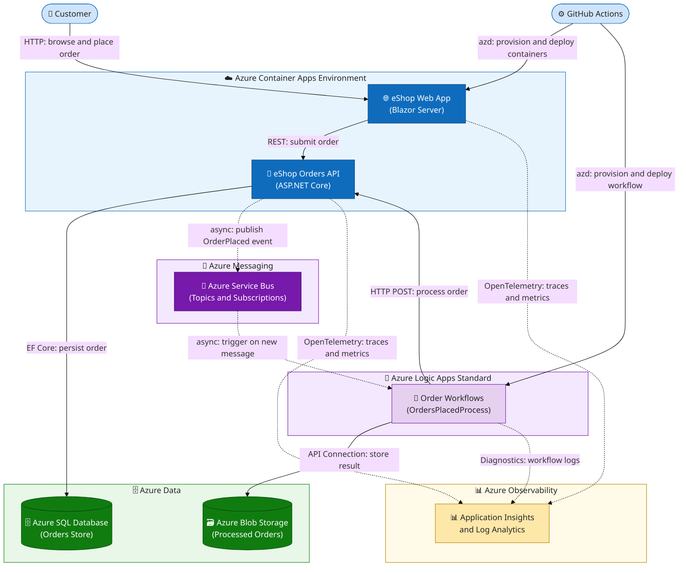

# Azure Logic Apps Monitoring Solution


The **Azure Logic Apps Monitoring Solution** is a cloud-native reference application that demonstrates end-to-end order processing and observability on Azure. It combines a Blazor Server frontend, an ASP.NET Core REST API, Azure Logic Apps Standard workflows, and a full Azure monitoring stack to give operators complete visibility into every step of the order lifecycle.

The solution solves the challenge of monitoring and debugging complex event-driven workflows in production. By integrating Application Insights, Log Analytics, and OpenTelemetry distributed tracing across all components, teams can correlate a customer order from initial placement through Service Bus messaging, Logic Apps orchestration, and final persistence — without needing to inspect raw logs across disconnected services.

The technology stack is built entirely on **.NET 10** with .NET Aspire orchestration, Azure Service Bus for asynchronous messaging, Entity Framework Core against Azure SQL Database for durable order storage, and Bicep-based Infrastructure as Code deployed through the Azure Developer CLI. GitHub Actions provides the CI/CD pipeline with OIDC-based authentication, eliminating long-lived credentials.

> [!NOTE]
> This solution targets .NET SDK `10.0.100` and requires Azure Developer CLI `>= 1.11.0`. See [Quick Start](#quick-start) for the complete prerequisite list.

---

## Table of Contents

- [Features](#features)
- [Architecture](#architecture)
- [Technologies Used](#technologies-used)
- [Quick Start](#quick-start)
- [Configuration](#configuration)
- [Deployment](#deployment)
- [Usage](#usage)
- [Contributing](#contributing)
- [License](#license)

---

## Features

| Feature                         | Description                                                                                                                                                                                               |
| ------------------------------- | --------------------------------------------------------------------------------------------------------------------------------------------------------------------------------------------------------- |
| 📦 **Order REST API**           | ASP.NET Core Web API (`eShop.Orders.API`) with full CRUD support, EF Core migrations, Azure SQL persistence, and OpenAPI / Swagger documentation.                                                         |
| 🌐 **Blazor Web UI**            | Blazor Server frontend (`eShop.Web.App`) styled with Microsoft Fluent UI React v9 components for an accessible, modern order management experience.                                                       |
| 🔄 **Logic Apps Workflows**     | Logic Apps Standard hosts two workflows — `OrdersPlacedProcess` (routes new orders through the API and archives results to Blob Storage) and `OrdersPlacedCompleteProcess` (handles completion outcomes). |
| 📨 **Event-Driven Messaging**   | Azure Service Bus Topics and Subscriptions decouple order placement from downstream processing, enabling reliable async communication and at-least-once delivery guarantees.                              |
| 📊 **Full-Stack Observability** | OpenTelemetry traces, metrics, and structured logs flow from every service into Application Insights and Log Analytics, enabling distributed trace correlation across the entire order lifecycle.         |
| 🔒 **Managed Identity Auth**    | All service-to-service authentication uses User Assigned Managed Identity — no passwords, connection string secrets, or stored credentials anywhere in the solution.                                      |
| 🏗️ **Infrastructure as Code**   | Bicep templates under `infra/` provision every Azure resource declaratively, including VNet integration, private endpoints, Container Apps, Container Registry, Logic Apps, and Azure SQL.                |
| ⚙️ **CI/CD with OIDC**          | GitHub Actions workflows provide build, test, CodeQL security scanning, infrastructure provisioning, and zero-secret deployment using federated OpenID Connect credentials.                               |
| 🧪 **Test Projects**            | Solution includes test projects for `app.AppHost`, `app.ServiceDefaults`, `eShop.Orders.API`, and `eShop.Web.App`, executed on Ubuntu, Windows, and macOS runners in CI.                                  |
| 📝 **Order Data Generator**     | `hooks/Generate-Orders.ps1` produces up to 10,000 randomized orders for load testing and Logic Apps workflow demonstration scenarios.                                                                     |

---

## Architecture

The diagram below illustrates the primary actors, components, and interactions in the system. Solid arrows represent synchronous calls; dashed arrows represent asynchronous or event-driven flows.


```mermaid
---
config:
  description: "High-level architecture diagram showing actors, primary flows, and major components."
  theme: base
  align: center
  fontFamily: "Segoe UI, Verdana, sans-serif"
  fontSize: 16
  textColor: "#242424"
  primaryColor: "#f5f5f5"
  primaryTextColor: "#FFFFFF"
  primaryBorderColor: "#e0e0e0"
  secondaryColor: "#dbdbdb"
  secondaryTextColor: "#242424"
  secondaryBorderColor: "#d6d6d6"
  tertiaryColor: "#d1d1d1"
  tertiaryTextColor: "#424242"
  tertiaryBorderColor: "#b3b3b3"
---
flowchart TB

  %% ── External Actors ────────────────────────────────────────────────────
  Customer(["🧑 Customer"])
  GitHubActions(["⚙️ GitHub Actions"])

  %% ── Azure Container Apps Environment ───────────────────────────────────
  subgraph ACA["☁️ Azure Container Apps Environment"]
    direction TB
    WebApp["🌐 eShop Web App<br/>(Blazor Server)"]
    OrdersAPI["🔧 eShop Orders API<br/>(ASP.NET Core)"]
  end

  %% ── Azure Messaging ─────────────────────────────────────────────────────
  subgraph Messaging["📨 Azure Messaging"]
    ServiceBus["📨 Azure Service Bus<br/>(Topics and Subscriptions)"]
  end

  %% ── Azure Logic Apps Workflows ──────────────────────────────────────────
  subgraph Workflows["🔄 Azure Logic Apps Standard"]
    LogicApp["🔄 Order Workflows<br/>(OrdersPlacedProcess)"]
  end

  %% ── Azure Data Layer ────────────────────────────────────────────────────
  subgraph DataLayer["🗄️ Azure Data"]
    SQLDb[("🗄️ Azure SQL Database<br/>(Orders Store)")]
    BlobStorage[("🗃️ Azure Blob Storage<br/>(Processed Orders)")]
  end

  %% ── Azure Observability ─────────────────────────────────────────────────
  subgraph ObsLayer["📊 Azure Observability"]
    AppInsights["📊 Application Insights<br/>and Log Analytics"]
  end

  %% ── Primary Order Flow ──────────────────────────────────────────────────
  Customer -->|"HTTP: browse and place order"| WebApp
  WebApp -->|"REST: submit order"| OrdersAPI
  OrdersAPI -->|"EF Core: persist order"| SQLDb
  OrdersAPI -.->|"async: publish OrderPlaced event"| ServiceBus
  ServiceBus -.->|"async: trigger on new message"| LogicApp
  LogicApp -->|"HTTP POST: process order"| OrdersAPI
  LogicApp -->|"API Connection: store result"| BlobStorage

  %% ── CI/CD Flow ──────────────────────────────────────────────────────────
  GitHubActions -->|"azd: provision and deploy containers"| WebApp
  GitHubActions -->|"azd: provision and deploy workflow"| LogicApp

  %% ── Observability Flow ──────────────────────────────────────────────────
  OrdersAPI -.->|"OpenTelemetry: traces and metrics"| AppInsights
  WebApp -.->|"OpenTelemetry: traces and metrics"| AppInsights
  LogicApp -.->|"Diagnostics: workflow logs"| AppInsights

  %% ── Subgraph Styles ─────────────────────────────────────────────────────
  style ACA fill:#e8f4fd,stroke:#0f6cbd,color:#242424
  style Messaging fill:#f3e8fd,stroke:#7719aa,color:#242424
  style Workflows fill:#f3e8fd,stroke:#7719aa,color:#242424
  style DataLayer fill:#e8f7e8,stroke:#107c10,color:#242424
  style ObsLayer fill:#fffbe8,stroke:#b38600,color:#242424

  %% ── Class Definitions ───────────────────────────────────────────────────
  classDef actor fill:#cfe4fa,stroke:#0f6cbd,color:#242424
  classDef service fill:#0f6cbd,stroke:#094580,color:#ffffff
  classDef messaging fill:#7719aa,stroke:#4a0a75,color:#ffffff
  classDef workflow fill:#e6d0f0,stroke:#7719aa,color:#242424
  classDef datastore fill:#107c10,stroke:#054b05,color:#ffffff
  classDef monitoring fill:#fde7a9,stroke:#b38600,color:#242424

  %% ── Class Assignments ───────────────────────────────────────────────────
  class Customer,GitHubActions actor
  class WebApp,OrdersAPI service
  class ServiceBus messaging
  class LogicApp workflow
  class SQLDb,BlobStorage datastore
  class AppInsights monitoring
```

**Architecture Gate Results**

| Gate                           | Result | Notes                                                                                                                                                                                 |
| ------------------------------ | ------ | ------------------------------------------------------------------------------------------------------------------------------------------------------------------------------------- |
| Gate 0 — Architecture Intent   | PASSED | Human actor (Customer) present; primary flow traces order placement to outcome; diagram shows runtime topology, not build/deploy view.                                                |
| Gate 1 — Constraint Compliance | PASSED | All 18 positive constraints satisfied; no negative constraints violated.                                                                                                              |
| Gate 2 — Evaluation Criteria   | PASSED | All 8 criteria pass: actor presence, goal traceability, component coverage, interaction labeling, shape/style compliance, color accessibility, syntax validity, node limit (9 nodes). |
| Gate 3 — Styling Compliance    | PASSED | All config theming variables present; every hex color is traceable to a named Fluent UI React v9 token.                                                                               |

---

## Technologies Used

| Technology                    | Type           | Purpose                                                                 |
| ----------------------------- | -------------- | ----------------------------------------------------------------------- |
| **.NET 10.0**                 | Runtime        | Target framework for all C# projects                                    |
| **C#**                        | Language       | Primary implementation language                                         |
| **.NET Aspire 13.x**          | Orchestration  | Service composition, health checks, and local development orchestration |
| **ASP.NET Core**              | Framework      | REST API hosting for `eShop.Orders.API`                                 |
| **Blazor Server**             | Framework      | Interactive server-side UI for `eShop.Web.App`                          |
| **Microsoft Fluent UI 4.14**  | UI Library     | Accessible component library for the Blazor frontend                    |
| **Entity Framework Core**     | ORM            | Database access and migrations against Azure SQL                        |
| **Azure SQL Database**        | Datastore      | Durable relational order storage                                        |
| **Azure Service Bus**         | Messaging      | Async event-driven order placement topic and subscriptions              |
| **Azure Blob Storage**        | Datastore      | Archive storage for processed order payloads                            |
| **Azure Logic Apps Standard** | Workflow       | Low-code order processing and routing workflows                         |
| **Azure Container Apps**      | Hosting        | Serverless container hosting for the API and Web App                    |
| **Azure Container Registry**  | Registry       | Private container image repository                                      |
| **Application Insights**      | Monitoring     | Distributed tracing, metrics, and telemetry aggregation                 |
| **Log Analytics Workspace**   | Monitoring     | Centralized log storage and KQL query engine                            |
| **OpenTelemetry**             | Observability  | Vendor-neutral traces, metrics, and logs instrumentation                |
| **Bicep**                     | IaC            | Declarative Azure resource provisioning templates                       |
| **Azure Developer CLI (azd)** | Tooling        | End-to-end provision-and-deploy workflow                                |
| **Azure CLI**                 | Tooling        | Azure resource management and authentication                            |
| **GitHub Actions**            | CI/CD          | Build, test, security scan, and deploy pipeline                         |
| **OpenID Connect (OIDC)**     | Authentication | Federated credential CI/CD auth with no stored secrets                  |
| **Swashbuckle / OpenAPI**     | Documentation  | Swagger UI and OpenAPI spec generation for the API                      |

---

## Quick Start

### Prerequisites

| Prerequisite                    | Minimum Version | Install                                                                                         |
| ------------------------------- | --------------- | ----------------------------------------------------------------------------------------------- |
| **.NET SDK**                    | 10.0.100        | [Download](https://dotnet.microsoft.com/download)                                               |
| **Azure Developer CLI** (`azd`) | 1.11.0          | [Install guide](https://learn.microsoft.com/azure/developer/azure-developer-cli/install-azd)    |
| **Azure CLI** (`az`)            | 2.60.0          | [Install guide](https://learn.microsoft.com/cli/azure/install-azure-cli)                        |
| **Docker Desktop**              | Latest stable   | [Download](https://www.docker.com/products/docker-desktop/)                                     |
| **PowerShell**                  | 7.0             | [Install guide](https://learn.microsoft.com/powershell/scripting/install/installing-powershell) |
| **Azure Subscription**          | —               | [Free account](https://azure.microsoft.com/free/)                                               |

> [!IMPORTANT]
> Run `.\hooks\check-dev-workstation.ps1` after cloning to validate all prerequisites are installed and meet the minimum version requirements.

### Installation Steps

1. Clone the repository:

   ```bash
   git clone https://github.com/Evilazaro/Azure-LogicApps-Monitoring.git
   cd Azure-LogicApps-Monitoring
   ```

2. Authenticate with Azure:

   ```bash
   azd auth login
   az login
   ```

3. Create a new environment:

   ```bash
   azd env new dev
   ```

4. Set the deployment location:

   ```bash
   azd env set AZURE_LOCATION eastus2
   ```

5. Provision infrastructure and deploy all services:

   ```bash
   azd up
   ```

### Minimal Working Example — Run Locally with .NET Aspire

After `azd up` completes, start the local development stack with:

```bash
dotnet run --project app.AppHost
```

The .NET Aspire dashboard opens automatically. Navigate to the dashboard URL printed in the console to inspect service health, traces, and logs.

> [!TIP]
> Use `hooks/Generate-Orders.ps1` to generate sample order payloads for testing the end-to-end workflow:
>
> ```powershell
> .\hooks\Generate-Orders.ps1 -OrderCount 50
> ```

---

## Configuration

All runtime configuration is supplied through .NET user secrets (local development) or Azure Container Apps environment variables (production). Run `.\hooks\postprovision.ps1` after provisioning to populate user secrets automatically.

| Option                                 | Default | Description                                                                                     |
| -------------------------------------- | ------- | ----------------------------------------------------------------------------------------------- |
| `Azure:TenantId`                       | —       | Azure Active Directory tenant ID for local development authentication.                          |
| `Azure:ClientId`                       | —       | Service Principal or Managed Identity client ID for local development.                          |
| `Azure:ResourceGroup`                  | —       | Name of the existing Azure resource group. Required when connecting to Azure resources locally. |
| `Azure:AllowResourceGroupCreation`     | `false` | Set to `true` to allow `azd` to create the resource group during provisioning.                  |
| `Azure:ApplicationInsights:Name`       | —       | Application Insights resource name. Enables telemetry collection when set.                      |
| `ApplicationInsights:ConnectionString` | —       | Application Insights connection string. Injected automatically in Container Apps.               |
| `ConnectionStrings:OrderDb`            | —       | Azure SQL connection string for `eShop.Orders.API`. Uses Entra ID auth in production.           |
| `MESSAGING_HOST`                       | —       | Azure Service Bus namespace hostname (e.g., `mynamespace.servicebus.windows.net`).              |
| `DEPLOY_HEALTH_MODEL`                  | `true`  | Toggle Azure Monitor Health Model deployment during `azd provision`.                            |
| `DEPLOYER_PRINCIPAL_TYPE`              | `User`  | Set to `ServicePrincipal` when deploying from a CI/CD pipeline.                                 |

### Example: Override for Local Development

Store secrets with the .NET user secrets manager. The `postprovision.ps1` hook does this automatically, but you can set them manually:

```bash
dotnet user-secrets set "Azure:TenantId" "<your-tenant-id>" --project app.AppHost
dotnet user-secrets set "Azure:ClientId" "<your-client-id>" --project app.AppHost
dotnet user-secrets set "Azure:ResourceGroup" "<your-resource-group>" --project app.AppHost
dotnet user-secrets set "ApplicationInsights:ConnectionString" "<your-conn-string>" \
  --project src/eShop.Orders.API
```

> [!WARNING]
> Never commit user secrets or connection strings to source control. The repository `.gitignore` excludes `appsettings.Development.json` overrides and `secrets.json` files.

---

## Deployment

Production deployment uses the **Azure Developer CLI** (`azd`) with GitHub Actions for automated CI/CD. Follow these steps for a first-time deployment.

> [!IMPORTANT]
> Configure federated credentials before running the GitHub Actions pipeline. Run `.\hooks\configure-federated-credential.ps1` to create the OIDC trust relationship between your Azure app registration and this repository.

1. **Verify prerequisites** — Run the workstation check script:

   ```powershell
   .\hooks\check-dev-workstation.ps1
   ```

2. **Configure federated credentials** — Set up OIDC trust for the pipeline:

   ```powershell
   .\hooks\configure-federated-credential.ps1
   ```

3. **Set GitHub repository variables** — Add the following variables in **Settings → Secrets and variables → Actions → Variables**:

   | Variable                | Description                                    |
   | ----------------------- | ---------------------------------------------- |
   | `AZURE_CLIENT_ID`       | Service Principal / App Registration client ID |
   | `AZURE_TENANT_ID`       | Azure Active Directory tenant ID               |
   | `AZURE_SUBSCRIPTION_ID` | Target Azure subscription ID                   |
   | `AZURE_LOCATION`        | Deployment region (e.g., `eastus2`)            |

4. **Provision and deploy** — Push to `main` or trigger `azure-dev.yml` manually via **Actions → Azure Developer CLI → Run workflow**, or run locally:

   ```bash
   azd up
   ```

5. **Verify deployment** — After completion, check the deployment summary in the GitHub Actions run log. The `postprovision.ps1` hook configures SQL Managed Identity access and user secrets automatically.

6. **Clean up resources** — To remove all provisioned Azure resources:

   ```bash
   azd down --purge
   ```

   > [!CAUTION]
   > `azd down --purge` permanently deletes all provisioned Azure resources, including the Azure SQL Database and its data. This action cannot be undone.

---

## Usage

### Place an Order via the Orders API

Send a `POST` request to the `/api/Orders` endpoint to place a new order. The API validates the payload, persists the order to Azure SQL Database, and publishes an `OrderPlaced` event to Azure Service Bus.

```bash
curl -X POST https://<orders-api-url>/api/Orders \
  -H "Content-Type: application/json" \
  -d '{
    "id": "550e8400-e29b-41d4-a716-446655440000",
    "customerName": "Jane Smith",
    "orderDate": "2026-04-28",
    "total": 149.99,
    "products": [
      {
        "productId": "prod-001",
        "name": "Wireless Keyboard",
        "quantity": 1,
        "price": 149.99
      }
    ]
  }'
```

**Expected response (HTTP 201):**

```json
{
  "id": "550e8400-e29b-41d4-a716-446655440000",
  "customerName": "Jane Smith",
  "orderDate": "2026-04-28",
  "total": 149.99,
  "products": [
    {
      "productId": "prod-001",
      "name": "Wireless Keyboard",
      "quantity": 1,
      "price": 149.99
    }
  ]
}
```

After the order is created, the Logic Apps `OrdersPlacedProcess` workflow picks up the Service Bus message, calls `POST /api/Orders/process`, and writes the result to Azure Blob Storage in the `ordersprocessedsuccessfully` container.

### Generate Bulk Test Orders

Use the included generator script to produce a batch of randomized orders and submit them to the running API:

```powershell
.\hooks\Generate-Orders.ps1 -OrderCount 100 -OutputPath ".\test-orders.json"
```

### Run the Test Suite

Execute the full test suite from the repository root:

```bash
dotnet test app.sln --configuration Release --logger "trx;LogFileName=results.trx"
```

### Query Traces in Application Insights

Use the following KQL query in the Log Analytics workspace to find all traces correlated to a specific order:

```kql
traces
| where customDimensions["order.id"] == "550e8400-e29b-41d4-a716-446655440000"
| project timestamp, message, severityLevel, operation_Id
| order by timestamp asc
```

---

## Contributing

Contributions are welcome. To propose a change, open an issue in the [GitHub issue tracker](https://github.com/Evilazaro/Azure-LogicApps-Monitoring/issues) describing the problem or enhancement. For code contributions, follow these steps:

1. **Fork** the repository and create a feature branch:

   ```bash
   git checkout -b feature/your-feature-name
   ```

2. **Implement** your changes, ensuring all existing tests continue to pass:

   ```bash
   dotnet test app.sln --configuration Release
   ```

3. **Commit** with a clear, imperative-mood message (e.g., `Add retry logic for Service Bus publish`).

4. **Push** your branch and open a **Pull Request** targeting `main`. Describe what the change does and reference any related issues.

5. A maintainer reviews the pull request. Address any requested changes and the PR is merged once approved.

> [!NOTE]
> All pull requests trigger the CI pipeline, which includes build verification, unit tests on Ubuntu, Windows, and macOS, and CodeQL security scanning. Ensure the pipeline passes before requesting review.

---

## License

This project is licensed under the **MIT License**. See the [LICENSE](LICENSE) file for the full license text.
