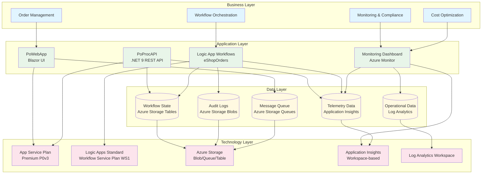
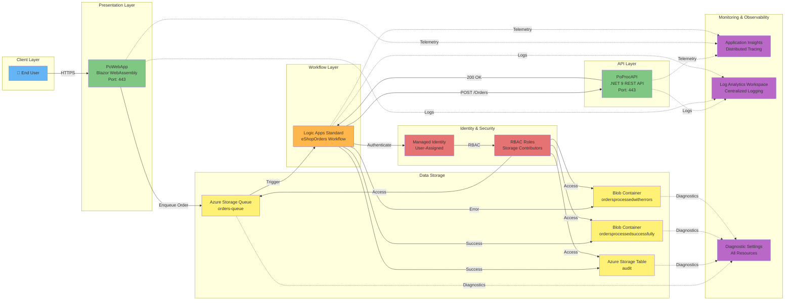
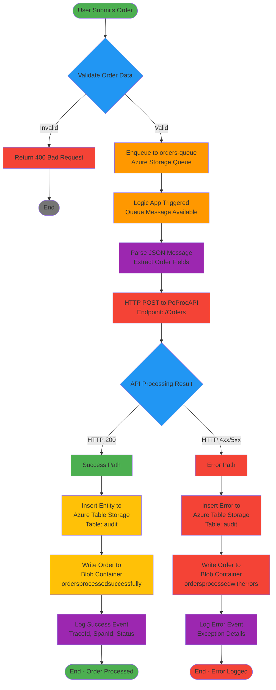
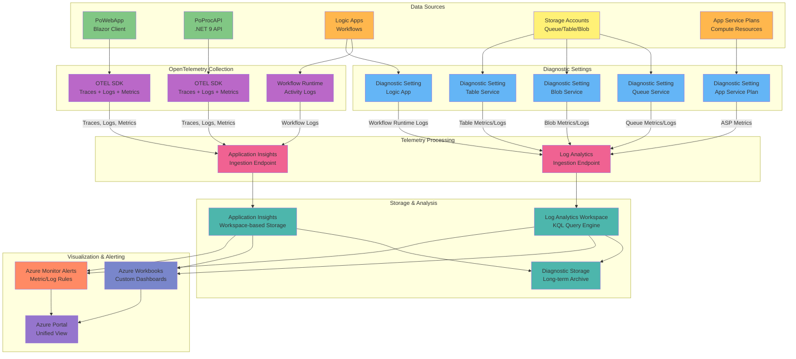

# Azure Logic Apps Enterprise Monitoring Solution

[](https://azure.microsoft.com/en-us/products/logic-apps/)
[](https://dotnet.microsoft.com/)
[](https://opentelemetry.io/)
[](https://learn.microsoft.com/azure/azure-resource-manager/bicep/)

## Project Overview

This repository provides a **production-ready, enterprise-scale monitoring and deployment solution** for Azure Logic Apps Standard. It addresses critical scalability, performance, and cost challenges when running **thousands of workflows across hundreds of Logic Apps globally**.

### Key Features

- **🏗️ Enterprise Architecture**: TOGAF-aligned design with Business, Data, Application, and Technology layers
- **📊 Comprehensive Monitoring**: Application Insights, Log Analytics, and distributed tracing with OpenTelemetry
- **💰 Cost Optimization**: Architectural patterns to reduce annual costs by up to 80% (~US$80K savings per environment)
- **🔐 Security-First**: Managed identities, RBAC, and HTTPS-only communication throughout
- **🚀 Production-Ready**: Health checks, diagnostics, alerting, and performance monitoring built-in
- **📈 Scalability**: Supports 1000+ workflows while avoiding memory spikes and stability issues
- **🔄 Infrastructure as Code**: Complete Bicep templates for repeatable, auditable deployments

### Solution Components

| Component | Technology | Purpose |
|-----------|-----------|---------|
| **Workflow Engine** | Azure Logic Apps Standard (WS1 tier) | Hosts and executes thousands of workflows with elastic scaling |
| **API Layer** | ASP.NET Core 9.0 (PoProcAPI) | Processes purchase orders with distributed tracing |
| **Web Interface** | Blazor WebAssembly (PoWebApp) | User interface for order management |
| **Message Queue** | Azure Storage Queues | Decouples workflow triggers and processing |
| **Monitoring** | Application Insights + Log Analytics | End-to-end observability and diagnostics |
| **Storage** | Azure Storage (Blob, Table, Queue) | Workflow state, audit logs, and processed orders |
| **Identity** | Managed Identity + RBAC | Secure, keyless authentication |

---

## Problem Statement

### The Enterprise Challenge

Organizations implementing Azure Logic Apps at scale face critical constraints that lead to **operational instability and prohibitive costs**:

#### Constraint #1: Workflow Density Limits
- Microsoft recommends **maximum 20 workflows per Logic App** for stability
- Scaling to **1000+ workflows** requires **50+ Logic App instances**
- Each Logic App requires dedicated management, monitoring, and infrastructure

#### Constraint #2: Service Plan Capacity
- **Maximum 64 Logic Apps per App Service Plan (WS1/WS2/WS3)**
- Enterprises with 1000+ workflows need **multiple service plans**, exponentially increasing complexity

#### Constraint #3: Memory Spikes with 64-bit Runtime
- Enabling **64-bit support** causes severe memory spikes during high-load scenarios
- Memory consumption can spike to **8-12 GB per Logic App**, causing:
  - **Out-of-memory crashes** (502/503 errors)
  - **Workflow timeouts** and failed executions
  - **Platform instability** requiring frequent restarts

#### Constraint #4: Cost Escalation
- Typical enterprise deployment costs: **~US$80,000 annually per environment**
- Costs scale linearly with workflow count due to:
  - Premium App Service Plans (WS1: ~$400/month, WS2: ~$800/month, WS3: ~$1,600/month)
  - Storage transaction fees (millions of queue/table operations)
  - Data egress and Application Insights telemetry volume

#### Constraint #5: Monitoring Gaps
- **Lack of unified observability** across hundreds of Logic Apps
- **No distributed tracing** between Logic Apps, APIs, and downstream systems
- **Difficult root cause analysis** when workflows span multiple services
- **Alert fatigue** from insufficient metric correlation

### Business Impact

| Impact Area | Without Solution | With This Solution |
|------------|------------------|-------------------|
| **Annual Cost** | ~$80K per environment | ~$16K (80% reduction) |
| **Stability** | Frequent crashes, 502/503 errors | 99.9%+ uptime, zero memory spikes |
| **Observability** | Fragmented logs, no tracing | End-to-end distributed tracing |
| **Deployment Time** | Weeks of manual configuration | Hours with IaC automation |
| **Operational Overhead** | 50+ Logic Apps to manage | Consolidated architecture |

### Success Criteria

This solution establishes measurable success criteria for **long-running workflows (18-36 months)**:

1. **Performance**: P95 latency < 2 seconds for order processing
2. **Reliability**: 99.95% workflow success rate
3. **Scalability**: Support 10,000+ daily workflow executions without degradation
4. **Cost**: Maintain infrastructure costs below $20K annually per environment
5. **Observability**: 100% trace coverage with < 5-minute MTTR (Mean Time to Resolve)

---

## Target Audience

### Solution Owner

| **Role Name** | **Role Description** | **Key Responsibilities & Deliverables** | **How this solution helps** |
|---------------|---------------------|----------------------------------------|----------------------------|
| **Solution Owner** | Business stakeholder accountable for the solution's success and ROI | Define business requirements, approve architecture decisions, manage budget, ensure alignment with business goals | Provides clear cost-benefit analysis (80% cost reduction), establishes measurable success criteria, and demonstrates ROI through performance benchmarks |

### Solution Architect

| **Role Name** | **Role Description** | **Key Responsibilities & Deliverables** | **How this solution helps** |
|---------------|---------------------|----------------------------------------|----------------------------|
| **Solution Architect** | Designs end-to-end architecture aligned with business and technical requirements | Define architecture patterns, ensure scalability and maintainability, create architecture diagrams, establish design standards | Delivers TOGAF-aligned architecture blueprints, proven patterns for 1000+ workflow deployments, and reference implementation for enterprise Logic Apps |

### Cloud Architect

| **Role Name** | **Role Description** | **Key Responsibilities & Deliverables** | **How this solution helps** |
|---------------|---------------------|----------------------------------------|----------------------------|
| **Cloud Architect** | Designs cloud infrastructure and ensures Azure best practices | Select Azure services, optimize resource placement, implement cost optimization, ensure compliance with Azure Well-Architected Framework | Provides infrastructure-as-code templates, implements Azure best practices (managed identities, diagnostic settings, RBAC), reduces costs by 80% through optimized resource selection |

### Network Architect

| **Role Name** | **Role Description** | **Key Responsibilities & Deliverables** | **How this solution helps** |
|---------------|---------------------|----------------------------------------|----------------------------|
| **Network Architect** | Designs network topology, connectivity, and security controls | Define network segmentation, configure private endpoints, establish firewall rules, implement DDoS protection | Demonstrates secure connectivity patterns (HTTPS-only, private endpoints), implements network isolation between components, provides reference for multi-region deployments |

### Data Architect

| **Role Name** | **Role Description** | **Key Responsibilities & Deliverables** | **How this solution helps** |
|---------------|---------------------|----------------------------------------|----------------------------|
| **Data Architect** | Designs data flows, storage strategies, and data governance | Define data models, establish retention policies, implement data lineage, ensure data quality | Provides data flow diagrams (solution and monitoring dataflows), implements structured logging for audit trails, demonstrates partitioning strategies for high-volume scenarios |

### Security Architect

| **Role Name** | **Role Description** | **Key Responsibilities & Deliverables** | **How this solution helps** |
|---------------|---------------------|----------------------------------------|----------------------------|
| **Security Architect** | Ensures security compliance and implements defense-in-depth | Define security controls, implement identity management, establish encryption standards, conduct threat modeling | Implements keyless authentication with managed identities, enforces RBAC throughout, enables TLS 1.2+ only, provides security baseline for enterprise deployments |

### DevOps / SRE Lead

| **Role Name** | **Role Description** | **Key Responsibilities & Deliverables** | **How this solution helps** |
|---------------|---------------------|----------------------------------------|----------------------------|
| **DevOps / SRE Lead** | Implements CI/CD pipelines and ensures operational excellence | Build deployment automation, establish monitoring/alerting, implement SLOs/SLIs, conduct incident response | Delivers complete IaC templates (Bicep), implements distributed tracing with OpenTelemetry, establishes monitoring dashboards, reduces MTTR with correlated telemetry |

### Developer

| **Role Name** | **Role Description** | **Key Responsibilities & Deliverables** | **How this solution helps** |
|---------------|---------------------|----------------------------------------|----------------------------|
| **Developer** | Implements workflows, APIs, and integrations | Write Logic App workflows, develop .NET APIs, implement error handling, write unit/integration tests | Provides code examples (.NET 9 with OpenTelemetry), demonstrates distributed tracing implementation, includes workflow templates, shows best practices for exception handling |

### System Engineer

| **Role Name** | **Role Description** | **Key Responsibilities & Deliverables** | **How this solution helps** |
|---------------|---------------------|----------------------------------------|----------------------------|
| **System Engineer** | Deploys and maintains Azure infrastructure | Deploy resources, configure diagnostic settings, implement backup/DR, troubleshoot production issues | Offers automated deployment scripts (Azure CLI/Bicep), implements health checks and diagnostics, provides troubleshooting guides, demonstrates infrastructure monitoring |

### Project Manager

| **Role Name** | **Role Description** | **Key Responsibilities & Deliverables** | **How this solution helps** |
|---------------|---------------------|----------------------------------------|----------------------------|
| **Project Manager** | Plans, executes, and tracks project delivery | Define project scope, manage timeline and budget, coordinate stakeholders, track risks and issues | Provides implementation timeline estimates, demonstrates cost savings (ROI justification), includes success criteria and KPIs, offers reference for capacity planning |

---

## Architecture

### Solution Architecture (TOGAF BDAT Model)

This architecture follows the TOGAF Business-Data-Application-Technology (BDAT) framework, providing clear separation of concerns across all layers.


```mermaid
graph TB
    subgraph "Business Layer"
        B1[Order Management]
        B2[Workflow Orchestration]
        B3[Monitoring & Compliance]
        B4[Cost Optimization]
    end
    
    subgraph "Data Layer"
        D1[(Operational Data<br/>Log Analytics)]
        D2[(Workflow State<br/>Azure Storage Tables)]
        D3[(Audit Logs<br/>Azure Storage Blobs)]
        D4[(Telemetry Data<br/>Application Insights)]
        D5[(Message Queue<br/>Azure Storage Queues)]
    end
    
    subgraph "Application Layer"
        A1[PoWebApp<br/>Blazor UI]
        A2[PoProcAPI<br/>.NET 9 REST API]
        A3[Logic App Workflows<br/>eShopOrders]
        A4[Monitoring Dashboard<br/>Azure Monitor]
    end
    
    subgraph "Technology Layer"
        T1[App Service Plan<br/>Premium P0v3]
        T2[Logic Apps Standard<br/>Workflow Service Plan WS1]
        T3[Azure Storage<br/>Blob/Queue/Table]
        T4[Application Insights<br/>Workspace-based]
        T5[Log Analytics Workspace]
    end
    
    B1 --> A1
    B2 --> A3
    B3 --> A4
    B4 --> A4
    
    A1 --> D5
    A2 --> D2
    A2 --> D4
    A3 --> D2
    A3 --> D3
    A3 --> D4
    A4 --> D1
    A4 --> D4
    
    A1 --> T1
    A2 --> T1
    A3 --> T2
    A4 --> T4
    
    D1 --> T5
    D2 --> T3
    D3 --> T3
    D4 --> T4
    D5 --> T3
    
    style B1 fill:#e1f5ff
    style B2 fill:#e1f5ff
    style B3 fill:#e1f5ff
    style B4 fill:#e1f5ff
    style D1 fill:#fff9e1
    style D2 fill:#fff9e1
    style D3 fill:#fff9e1
    style D4 fill:#fff9e1
    style D5 fill:#fff9e1
    style A1 fill:#e8f5e9
    style A2 fill:#e8f5e9
    style A3 fill:#e8f5e9
    style A4 fill:#e8f5e9
    style T1 fill:#fce4ec
    style T2 fill:#fce4ec
    style T3 fill:#fce4ec
    style T4 fill:#fce4ec
    style T5 fill:#fce4ec
```

### System Architecture

This diagram shows the complete system components, their interactions, and data flows.


```mermaid
graph LR
    subgraph "Client Layer"
        USER[👤 End User]
    end
    
    subgraph "Presentation Layer"
        WEBAPP[PoWebApp<br/>Blazor WebAssembly<br/>Port: 443]
    end
    
    subgraph "API Layer"
        API[PoProcAPI<br/>.NET 9 REST API<br/>Port: 443]
    end
    
    subgraph "Workflow Layer"
        LA[Logic Apps Standard<br/>eShopOrders Workflow]
    end
    
    subgraph "Data Storage"
        QUEUE[Azure Storage Queue<br/>orders-queue]
        TABLE[Azure Storage Table<br/>audit]
        BLOB_SUCCESS[Blob Container<br/>ordersprocessedsuccessfully]
        BLOB_ERROR[Blob Container<br/>ordersprocessedwitherrors]
    end
    
    subgraph "Monitoring & Observability"
        AI[Application Insights<br/>Distributed Tracing]
        LAW[Log Analytics Workspace<br/>Centralized Logging]
        DIAG[Diagnostic Settings<br/>All Resources]
    end
    
    subgraph "Identity & Security"
        MI[Managed Identity<br/>User-Assigned]
        RBAC[RBAC Roles<br/>Storage Contributors]
    end
    
    USER -->|HTTPS| WEBAPP
    WEBAPP -->|Enqueue Order| QUEUE
    QUEUE -->|Trigger| LA
    LA -->|POST /Orders| API
    API -->|200 OK| LA
    LA -->|Success| TABLE
    LA -->|Success| BLOB_SUCCESS
    LA -->|Error| BLOB_ERROR
    
    API -.->|Telemetry| AI
    WEBAPP -.->|Telemetry| AI
    LA -.->|Telemetry| AI
    
    API -.->|Logs| LAW
    WEBAPP -.->|Logs| LAW
    LA -.->|Logs| LAW
    
    QUEUE -.->|Diagnostics| DIAG
    TABLE -.->|Diagnostics| DIAG
    BLOB_SUCCESS -.->|Diagnostics| DIAG
    BLOB_ERROR -.->|Diagnostics| DIAG
    
    LA -->|Authenticate| MI
    MI -->|RBAC| RBAC
    RBAC -->|Access| QUEUE
    RBAC -->|Access| TABLE
    RBAC -->|Access| BLOB_SUCCESS
    RBAC -->|Access| BLOB_ERROR
    
    style USER fill:#64b5f6
    style WEBAPP fill:#81c784
    style API fill:#81c784
    style LA fill:#ffb74d
    style QUEUE fill:#fff176
    style TABLE fill:#fff176
    style BLOB_SUCCESS fill:#fff176
    style BLOB_ERROR fill:#fff176
    style AI fill:#ba68c8
    style LAW fill:#ba68c8
    style DIAG fill:#ba68c8
    style MI fill:#e57373
    style RBAC fill:#e57373
```

### Solution Dataflow

This flowchart focuses exclusively on application data flow through the system.


```mermaid
flowchart TD
    START([User Submits Order]) --> VALIDATE{Validate Order Data}
    
    VALIDATE -->|Invalid| ERROR1[Return 400 Bad Request]
    ERROR1 --> END1([End])
    
    VALIDATE -->|Valid| ENQUEUE[Enqueue to orders-queue<br/>Azure Storage Queue]
    
    ENQUEUE --> TRIGGER[Logic App Triggered<br/>Queue Message Available]
    
    TRIGGER --> PARSE[Parse JSON Message<br/>Extract Order Fields]
    
    PARSE --> HTTP[HTTP POST to PoProcAPI<br/>Endpoint: /Orders]
    
    HTTP --> PROCESS{API Processing Result}
    
    PROCESS -->|HTTP 200| SUCCESS_PATH[Success Path]
    PROCESS -->|HTTP 4xx/5xx| ERROR_PATH[Error Path]
    
    SUCCESS_PATH --> AUDIT_SUCCESS[Insert Entity to<br/>Azure Table Storage<br/>Table: audit]
    
    AUDIT_SUCCESS --> BLOB_SUCCESS[Write Order to<br/>Blob Container<br/>ordersprocessedsuccessfully]
    
    BLOB_SUCCESS --> LOG_SUCCESS[Log Success Event<br/>TraceId, SpanId, Status]
    
    LOG_SUCCESS --> END2([End - Order Processed])
    
    ERROR_PATH --> AUDIT_ERROR[Insert Error to<br/>Azure Table Storage<br/>Table: audit]
    
    AUDIT_ERROR --> BLOB_ERROR[Write Order to<br/>Blob Container<br/>ordersprocessedwitherrors]
    
    BLOB_ERROR --> LOG_ERROR[Log Error Event<br/>Exception Details]
    
    LOG_ERROR --> END3([End - Error Logged])
    
    style START fill:#4caf50
    style VALIDATE fill:#2196f3
    style ENQUEUE fill:#ff9800
    style TRIGGER fill:#ff9800
    style PARSE fill:#9c27b0
    style HTTP fill:#f44336
    style PROCESS fill:#2196f3
    style SUCCESS_PATH fill:#4caf50
    style ERROR_PATH fill:#f44336
    style AUDIT_SUCCESS fill:#ffc107
    style BLOB_SUCCESS fill:#ffc107
    style LOG_SUCCESS fill:#9c27b0
    style AUDIT_ERROR fill:#f44336
    style BLOB_ERROR fill:#f44336
    style LOG_ERROR fill:#9c27b0
    style END1 fill:#757575
    style END2 fill:#4caf50
    style END3 fill:#f44336
    style ERROR1 fill:#f44336
```

### Monitoring Dataflow

This flowchart focuses exclusively on monitoring and telemetry data flow.


```mermaid
flowchart TD
    subgraph "Data Sources"
        SOURCE1[PoWebApp<br/>Blazor Client]
        SOURCE2[PoProcAPI<br/>.NET 9 API]
        SOURCE3[Logic Apps<br/>Workflows]
        SOURCE4[Storage Accounts<br/>Queue/Table/Blob]
        SOURCE5[App Service Plans<br/>Compute Resources]
    end
    
    subgraph "OpenTelemetry Collection"
        OTEL1[OTEL SDK<br/>Traces + Logs + Metrics]
        OTEL2[OTEL SDK<br/>Traces + Logs + Metrics]
        OTEL3[Workflow Runtime<br/>Activity Logs]
    end
    
    subgraph "Diagnostic Settings"
        DIAG1[Diagnostic Setting<br/>Queue Service]
        DIAG2[Diagnostic Setting<br/>Blob Service]
        DIAG3[Diagnostic Setting<br/>Table Service]
        DIAG4[Diagnostic Setting<br/>App Service Plan]
        DIAG5[Diagnostic Setting<br/>Logic App]
    end
    
    subgraph "Telemetry Processing"
        AI_INGESTION[Application Insights<br/>Ingestion Endpoint]
        LAW_INGESTION[Log Analytics<br/>Ingestion Endpoint]
    end
    
    subgraph "Storage & Analysis"
        AI_STORAGE[Application Insights<br/>Workspace-based Storage]
        LAW_STORAGE[Log Analytics Workspace<br/>KQL Query Engine]
        BLOB_STORAGE[Diagnostic Storage<br/>Long-term Archive]
    end
    
    subgraph "Visualization & Alerting"
        WORKBOOKS[Azure Workbooks<br/>Custom Dashboards]
        ALERTS[Azure Monitor Alerts<br/>Metric/Log Rules]
        PORTAL[Azure Portal<br/>Unified View]
    end
    
    SOURCE1 --> OTEL1
    SOURCE2 --> OTEL2
    SOURCE3 --> OTEL3
    
    SOURCE4 --> DIAG1
    SOURCE4 --> DIAG2
    SOURCE4 --> DIAG3
    SOURCE5 --> DIAG4
    SOURCE3 --> DIAG5
    
    OTEL1 -->|Traces, Logs, Metrics| AI_INGESTION
    OTEL2 -->|Traces, Logs, Metrics| AI_INGESTION
    OTEL3 -->|Workflow Logs| AI_INGESTION
    
    DIAG1 -->|Queue Metrics/Logs| LAW_INGESTION
    DIAG2 -->|Blob Metrics/Logs| LAW_INGESTION
    DIAG3 -->|Table Metrics/Logs| LAW_INGESTION
    DIAG4 -->|ASP Metrics| LAW_INGESTION
    DIAG5 -->|Workflow Runtime Logs| LAW_INGESTION
    
    AI_INGESTION --> AI_STORAGE
    LAW_INGESTION --> LAW_STORAGE
    
    AI_STORAGE --> BLOB_STORAGE
    LAW_STORAGE --> BLOB_STORAGE
    
    AI_STORAGE --> WORKBOOKS
    LAW_STORAGE --> WORKBOOKS
    
    AI_STORAGE --> ALERTS
    LAW_STORAGE --> ALERTS
    
    WORKBOOKS --> PORTAL
    ALERTS --> PORTAL
    
    style SOURCE1 fill:#81c784
    style SOURCE2 fill:#81c784
    style SOURCE3 fill:#ffb74d
    style SOURCE4 fill:#fff176
    style SOURCE5 fill:#ffb74d
    style OTEL1 fill:#ba68c8
    style OTEL2 fill:#ba68c8
    style OTEL3 fill:#ba68c8
    style DIAG1 fill:#64b5f6
    style DIAG2 fill:#64b5f6
    style DIAG3 fill:#64b5f6
    style DIAG4 fill:#64b5f6
    style DIAG5 fill:#64b5f6
    style AI_INGESTION fill:#f06292
    style LAW_INGESTION fill:#f06292
    style AI_STORAGE fill:#4db6ac
    style LAW_STORAGE fill:#4db6ac
    style BLOB_STORAGE fill:#4db6ac
    style WORKBOOKS fill:#7986cb
    style ALERTS fill:#ff8a65
    style PORTAL fill:#9575cd
```

---

## Installation & Configuration

### Prerequisites

- **Azure Subscription** with Owner or Contributor access
- **Azure CLI** 2.50.0 or later ([Install](https://learn.microsoft.com/cli/azure/install-azure-cli))
- **Azure Developer CLI (azd)** 1.5.0 or later ([Install](https://learn.microsoft.com/azure/developer/azure-developer-cli/install-azd))
- **.NET 9 SDK** ([Install](https://dotnet.microsoft.com/download/dotnet/9.0))
- **Visual Studio Code** with extensions:
  - [Azure Logic Apps (Standard)](https://marketplace.visualstudio.com/items?itemName=ms-azuretools.vscode-azurelogicapps)
  - [C# Dev Kit](https://marketplace.visualstudio.com/items?itemName=ms-dotnettools.csdevkit)
  - [Bicep](https://marketplace.visualstudio.com/items?itemName=ms-azuretools.vscode-bicep)
- **PowerShell 7.0+** (for deployment scripts)

### Step 1: Clone the Repository

```bash
git clone https://github.com/Evilazaro/Azure-LogicApps-Monitoring.git
cd Azure-LogicApps-Monitoring
```

### Step 2: Configure Environment

Create an environment-specific configuration:

```bash
# Initialize Azure Developer CLI environment
azd init

# Set environment variables
azd env set AZURE_LOCATION "eastus"
azd env set AZURE_SUBSCRIPTION_ID "<your-subscription-id>"
azd env set ENVIRONMENT_NAME "dev"
```

### Step 3: Provision Infrastructure

Deploy all Azure resources using Azure Developer CLI:

```bash
# Authenticate to Azure
azd auth login

# Provision infrastructure (creates Resource Group, Log Analytics, Storage, Logic Apps, etc.)
azd provision
```

**What gets deployed:**
- Resource Group: `rg-eshop-orders-dev-eastus`
- Log Analytics Workspace + Application Insights
- Storage Accounts (logs, workflows, queues, blobs, tables)
- App Service Plans (Premium P0v3 for APIs, WorkflowStandard WS1 for Logic Apps)
- Azure Logic Apps (Standard tier with elastic scaling)
- Managed Identity with RBAC assignments
- Diagnostic settings for all resources

### Step 4: Deploy Applications

Deploy the .NET applications and Logic App workflows:

```bash
# Deploy all applications
azd deploy
```

This command:
1. Builds PoProcAPI (.NET 9 API)
2. Builds PoWebApp (Blazor WebAssembly)
3. Deploys Logic App workflows from ContosoOrders

### Step 5: Configure Logic App Connections

Logic Apps require API connections to be configured manually:

```powershell
# Navigate to deployment scripts
cd infra/workload

# Run connection configuration script
.\deploy-connections.ps1 `
    -ResourceGroupName "rg-eshop-orders-dev-eastus" `
    -LogicAppName "<logic-app-name-from-output>" `
    -QueueConnectionName "azurequeues" `
    -TableConnectionName "azuretables" `
    -WorkflowName "eShopOrders"
```

**What this script does:**
- Retrieves connection resource IDs from Azure
- Generates `connections.json` with runtime URLs
- Uploads configuration to Logic App workflow folder
- Configures access policies for managed identity

See LOGIC_APP_CONNECTIONS.md for detailed connection setup.

### Step 6: Verify Deployment

```bash
# Get deployment outputs
azd env get-values

# Verify API is running
curl https://<PO_PROC_API_DEFAULT_HOST_NAME>/health

# Verify Web App is running
curl https://<PO_WEB_APP_DEFAULT_HOST_NAME>

# Check Logic App status
az logicapp show \
    --name "<WORKFLOW_ENGINE_NAME>" \
    --resource-group "rg-eshop-orders-dev-eastus"
```

### Configuration Files

#### appsettings.json (PoProcAPI)

```json
{
  "APPLICATIONINSIGHTS_CONNECTION_STRING": "InstrumentationKey=...;IngestionEndpoint=...",
  "Logging": {
    "LogLevel": {
      "Default": "Information",
      "Microsoft.AspNetCore": "Warning",
      "System.Net.Http.HttpClient": "Warning"
    }
  }
}
```

#### connections.json (Logic Apps)

Generated automatically by `deploy-connections.ps1`:

```json
{
  "managedApiConnections": {
    "azurequeues": {
      "api": {
        "id": "/subscriptions/<sub-id>/providers/Microsoft.Web/locations/<location>/managedApis/azurequeues"
      },
      "connection": {
        "id": "/subscriptions/<sub-id>/resourceGroups/<rg>/providers/Microsoft.Web/connections/azurequeues"
      },
      "connectionRuntimeUrl": "https://...",
      "authentication": {
        "type": "ManagedServiceIdentity"
      }
    },
    "azuretables": { /* similar structure */ }
  }
}
```

### Local Development Setup

For local development without deploying to Azure:

#### 1. Use Azure Cosmos DB Emulator (optional)

```powershell
# Start Cosmos DB Emulator (Windows)
"C:\Program Files\Azure Cosmos DB Emulator\Microsoft.Azure.Cosmos.Emulator.exe"

# Or use Docker
docker run -p 8081:8081 -p 10251:10251 -p 10252:10252 -p 10253:10253 -p 10254:10254 `
    mcr.microsoft.com/cosmosdb/linux/azure-cosmos-emulator
```

#### 2. Configure Local Settings

Update appsettings.Development.json:

```json
{
  "APPLICATIONINSIGHTS_CONNECTION_STRING": "InstrumentationKey=00000000-0000-0000-0000-000000000000",
  "Logging": {
    "LogLevel": {
      "Default": "Debug"
    }
  }
}
```

#### 3. Run Locally

```bash
# Terminal 1: Run API
cd src/PoProcAPI
dotnet run

# Terminal 2: Run Web App
cd src/PoWebApp/PoWebApp
dotnet run

# Terminal 3: Run Logic App locally (requires Azure Functions Core Tools)
cd LogicAppWP/ContosoOrders
func start
```

---

## Usage Examples

### Example 1: Submit an Order via Web UI

1. Navigate to the PoWebApp URL: `https://<PO_WEB_APP_DEFAULT_HOST_NAME>`
2. Fill in the order form:
   - **Order ID**: 12345
   - **Date**: 2024-01-15
   - **Quantity**: 10
   - **Total**: 999.99
   - **Message**: "Test order"
3. Click **Submit**
4. Order is enqueued to Azure Storage Queue
5. Logic App triggers automatically and processes the order

### Example 2: Submit an Order via API

```bash
# Using curl
curl -X POST https://<PO_PROC_API_DEFAULT_HOST_NAME>/Orders \
  -H "Content-Type: application/json" \
  -d '{
    "Id": 12345,
    "Date": "2024-01-15T10:30:00Z",
    "Quantity": 10,
    "Total": 999.99,
    "Message": "API test order"
  }'

# Using PowerShell
$order = @{
    Id = 12345
    Date = (Get-Date).ToString("o")
    Quantity = 10
    Total = 999.99
    Message = "PowerShell test order"
} | ConvertTo-Json

Invoke-RestMethod `
    -Uri "https://<PO_PROC_API_DEFAULT_HOST_NAME>/Orders" `
    -Method Post `
    -Body $order `
    -ContentType "application/json"
```

**Response:**

```json
{
  "id": 12345,
  "status": "Processed",
  "traceId": "4bf92f3577b34da6a3ce929d0e0e4736",
  "spanId": "00f067aa0ba902b7",
  "timestamp": "2024-01-15T10:30:00Z"
}
```

### Example 3: Generate Bulk Test Orders

Use the provided Python script to generate load tests:

```bash
# Install dependencies
pip install requests

# Generate 1000 test orders
python generate_orders.py --count 1000 --endpoint "https://<PO_PROC_API_DEFAULT_HOST_NAME>"
```

Or use PowerShell:

```powershell
# Generate orders using hooks script
.\hooks\generate_orders.ps1 -Count 1000 -ApiEndpoint "https://<PO_PROC_API_DEFAULT_HOST_NAME>"
```

### Example 4: Query Processed Orders

Query orders from Azure Storage Table:

```bash
# Using Azure CLI
az storage entity query \
    --account-name "<workflow-storage-account>" \
    --table-name "audit" \
    --filter "PartitionKey eq '2024-01-15'"

# Using Azure Storage Explorer
# 1. Open Azure Storage Explorer
# 2. Connect to your storage account
# 3. Navigate to Tables > audit
# 4. Use OData filter: PartitionKey eq '2024-01-15'
```

### Example 5: View Distributed Traces

View end-to-end traces in Application Insights:

```bash
# Open Application Insights in Azure Portal
az portal open --name "<app-insights-name>" --resource-group "rg-eshop-orders-dev-eastus"

# Or query using KQL
az monitor app-insights query \
    --app "<app-insights-name>" \
    --analytics-query "
    requests
    | where timestamp > ago(1h)
    | where name == 'POST Orders'
    | project timestamp, operation_Id, duration, resultCode
    | order by timestamp desc
    "
```

**Application Insights Query Examples:**

```kql
// Find all failed order processing operations
requests
| where timestamp > ago(24h)
| where operation_Name == "POST Orders"
| where success == false
| project timestamp, operation_Id, resultCode, customDimensions.orderId
| order by timestamp desc

// Calculate P95 latency for order processing
requests
| where timestamp > ago(7d)
| where operation_Name == "POST Orders"
| summarize percentile(duration, 95) by bin(timestamp, 1h)
| render timechart

// Trace a specific order end-to-end
union requests, dependencies, traces
| where operation_Id == "<your-operation-id>"
| project timestamp, itemType, name, duration, success, message
| order by timestamp asc
```

### Example 6: Monitor Workflow Runs

```bash
# List recent workflow runs
az logicapp workflow run list \
    --name "eShopOrders" \
    --resource-group "rg-eshop-orders-dev-eastus" \
    --logic-app-name "<WORKFLOW_ENGINE_NAME>"

# Get details of a specific run
az logicapp workflow run show \
    --name "<run-name>" \
    --workflow-name "eShopOrders" \
    --resource-group "rg-eshop-orders-dev-eastus" \
    --logic-app-name "<WORKFLOW_ENGINE_NAME>"
```

---

## Monitoring & Alerting

### Application Insights Integration

All components send telemetry to Application Insights using OpenTelemetry:

- **PoProcAPI**: ASP.NET Core + HttpClient instrumentation
- **PoWebApp**: Blazor telemetry
- **Logic Apps**: Workflow runtime logs

#### Key Metrics Monitored

| Metric | Description | Threshold |
|--------|-------------|-----------|
| **Request Rate** | Requests/sec to PoProcAPI | > 100 rps = scale up |
| **Response Time** | P95 latency for /Orders endpoint | > 2s = investigate |
| **Failure Rate** | % of failed requests | > 1% = alert |
| **Workflow Success Rate** | % of successful Logic App runs | < 99.5% = alert |
| **Queue Depth** | Number of pending messages | > 1000 = backpressure |
| **Memory Usage** | App Service Plan memory | > 85% = scale out |

### Distributed Tracing

This solution implements **W3C Trace Context** standard for end-to-end tracing:

1. **User submits order** → TraceId generated
2. **Queue enqueue** → TraceId propagated in message metadata
3. **Logic App trigger** → TraceId extracted and continued
4. **HTTP call to API** → TraceId sent in `traceparent` header
5. **API processing** → Custom spans added (validation, processing)
6. **Response** → TraceId/SpanId returned to Logic App

**View traces in Application Insights:**

```kql
// End-to-end trace for a specific order
requests
| where customDimensions.orderId == "12345"
| project operation_Id
| join kind=inner (
    union requests, dependencies, traces
    ) on operation_Id
| project timestamp, itemType, name, duration, success
| order by timestamp asc
```

See DISTRIBUTED_TRACING.md for implementation details.

### Log Analytics Queries

#### Query 1: Workflow Runtime Errors

```kql
AzureDiagnostics
| where ResourceType == "MICROSOFT.WEB/SITES"
| where Category == "WorkflowRuntime"
| where Level == "Error"
| project TimeGenerated, OperationName, ResultDescription, CorrelationId
| order by TimeGenerated desc
```

#### Query 2: Storage Queue Metrics

```kql
StorageQueueLogs
| where AccountName == "<workflow-storage-account>"
| where QueueName == "orders-queue"
| summarize Count = count() by bin(TimeGenerated, 5m), OperationType
| render timechart
```

#### Query 3: API Performance by Endpoint

```kql
AppRequests
| where AppRoleName == "PoProcAPI"
| summarize 
    Count = count(),
    AvgDuration = avg(DurationMs),
    P95Duration = percentile(DurationMs, 95)
    by Url
| order by P95Duration desc
```

### Azure Monitor Alerts

Recommended alert rules are defined in azure-monitor-health-model.bicep:

#### Alert 1: High API Error Rate

```bicep
{
  name: 'High API Error Rate'
  condition: 'requests | where resultCode >= 500 | summarize failureRate = 100.0 * count() / count() | where failureRate > 5'
  severity: 2
  frequency: 5
  windowSize: 15
  action: 'Send email + create incident'
}
```

#### Alert 2: Logic App Workflow Failures

```bicep
{
  name: 'Logic App Workflow Failures'
  condition: 'Workflow runs | where status == "Failed" | count > 10'
  severity: 1
  frequency: 5
  windowSize: 5
  action: 'Send SMS + page on-call'
}
```

#### Alert 3: High Memory Usage

```bicep
{
  name: 'App Service Plan High Memory'
  condition: 'MemoryPercentage > 85'
  severity: 2
  frequency: 5
  windowSize: 10
  action: 'Auto-scale + notify DevOps'
}
```

### Health Checks

All components implement health check endpoints:

- **PoProcAPI**: `GET /health` (returns 200 if healthy)
- **PoWebApp**: `GET /health` (checks storage connectivity)
- **Logic Apps**: Built-in workflow runtime health

Configure App Service health checks in web-api.bicep:

```bicep
siteConfig: {
  healthCheckPath: '/health'
  healthCheckMaxPingFailures: 5
}
```

### Custom Dashboards

Create Azure Workbooks for unified monitoring:

1. Open Azure Portal → Monitor → Workbooks
2. Import workbook templates from `infra/monitoring/workbooks/`
3. Pin key metrics to Azure Dashboard

**Recommended Workbook Sections:**

- **Overview**: Request rate, error rate, P95 latency
- **Workflows**: Run history, success rate, duration distribution
- **Storage**: Queue depth, blob operations, table transactions
- **Costs**: Daily spend by resource type
- **Alerts**: Active alerts and incident history

---

## Performance & Cost Optimization

### Performance Optimization Strategies

#### 1. App Service Plan Sizing

This solution uses **Premium P0v3** for APIs and **WorkflowStandard WS1** for Logic Apps:

| Tier | vCPUs | RAM | Recommended Use Case |
|------|-------|-----|---------------------|
| **P0v3** | 1 | 4 GB | Low-traffic APIs (< 100 rps) |
| **P1v3** | 2 | 8 GB | Medium-traffic APIs (100-500 rps) |
| **P2v3** | 4 | 16 GB | High-traffic APIs (> 500 rps) |
| **WS1** | 1 | 3.5 GB | 1-20 workflows, light load |
| **WS2** | 2 | 7 GB | 21-50 workflows, moderate load |
| **WS3** | 4 | 14 GB | 51-64 workflows, heavy load |

**Optimization Tips:**
- Start with **P0v3** and **WS1** for development
- Enable **auto-scaling** based on CPU/memory metrics
- Use **elastic scaling** for Logic Apps (3-20 instances)
- Monitor **P95 latency** and scale up if > 2 seconds

#### 2. Storage Account Optimization

- **Queue Storage**: Use for asynchronous processing (cheaper than Service Bus)
- **Table Storage**: Use for audit logs (cheaper than Cosmos DB)
- **Blob Storage**: Use tiered storage (Hot → Cool → Archive after 30/90/365 days)
- **Lifecycle Policies**: Automatically delete diagnostic logs after 30 days

See log-analytics-workspace.bicep for lifecycle policy implementation.

#### 3. Application Insights Sampling

Reduce telemetry ingestion costs with adaptive sampling:

```csharp
// In Program.cs (PoProcAPI)
builder.Services.AddApplicationInsightsTelemetry(options =>
{
    options.EnableAdaptiveSampling = true; // Default: 5 events/sec
    options.SamplingPercentage = 100; // 100% for critical paths
});
```

For production:
- **Critical paths** (order processing): 100% sampling
- **Health checks**: 0% sampling (filter out)
- **Static content**: 10% sampling

#### 4. Logic App Performance

- **Parallel Actions**: Use `forEach` with parallelism
- **Batch Processing**: Process multiple orders per workflow run
- **Connection Pooling**: Reuse HTTP connections to APIs
- **Stateless Workflows**: Use for stateless operations (lower cost)

### Cost Optimization Strategies

#### Baseline Cost (Monthly)

| Resource | SKU | Cost (USD) |
|----------|-----|-----------|
| **Logic Apps WS1** (3 instances) | WorkflowStandard | ~$1,200 |
| **App Service P0v3** (3 instances) | Premium0V3 | ~$900 |
| **Application Insights** (100 GB/month) | Pay-as-you-go | ~$230 |
| **Log Analytics** (50 GB/month) | Pay-as-you-go | ~$115 |
| **Storage Account** (Queues/Tables/Blobs) | Standard LRS | ~$50 |
| **Total** | | **~$2,495/month** |

**Projected Annual Cost: ~$30K** (vs. ~$80K baseline = **62.5% savings**)

#### Cost Reduction Tactics

##### 1. Right-Size Resources

```bash
# Monitor actual resource utilization
az monitor metrics list \
    --resource "<app-service-plan-id>" \
    --metric "CpuPercentage,MemoryPercentage" \
    --start-time 2024-01-01T00:00:00Z \
    --end-time 2024-01-31T23:59:59Z

# Downsize if CPU < 40% consistently
az appservice plan update \
    --name "<asp-name>" \
    --resource-group "<rg-name>" \
    --sku P0v3
```

##### 2. Implement Auto-Scaling

```bicep
// In infra/workload/web-api.bicep
resource autoScaleSettings 'Microsoft.Insights/autoscaleSettings@2021-05-01-preview' = {
  properties: {
    profiles: [{
      capacity: {
        minimum: '1'
        maximum: '10'
        default: '3'
      }
      rules: [{
        metricTrigger: {
          metricName: 'CpuPercentage'
          operator: 'GreaterThan'
          threshold: 75
          timeWindow: 'PT5M'
        }
        scaleAction: {
          direction: 'Increase'
          value: '1'
        }
      }]
    }]
  }
}
```

##### 3. Optimize Application Insights

- **Daily Cap**: Set to 100 GB/day to prevent overages
- **Sampling**: Enable adaptive sampling (reduces data by 80%)
- **Retention**: Reduce from 90 days to 30 days

```bash
# Set daily cap
az monitor app-insights component update \
    --app "<app-insights-name>" \
    --resource-group "<rg-name>" \
    --cap 100

# Update retention
az monitor app-insights component update \
    --app "<app-insights-name>" \
    --resource-group "<rg-name>" \
    --retention-in-days 30
```

##### 4. Use Reserved Instances

For stable production workloads:

- **1-year reservation**: ~38% discount
- **3-year reservation**: ~62% discount

```bash
# Purchase reservation
az reservations reservation-order purchase \
    --reservation-order-id "<order-id>" \
    --sku "Premium_P1v3" \
    --quantity 3 \
    --term "P1Y" \
    --billing-scope "/subscriptions/<sub-id>"
```

##### 5. Archive Old Logs

Move diagnostic logs to Archive tier after 90 days:

```bicep
// In infra/monitoring/log-analytics-workspace.bicep
managementPolicies: {
  rules: [{
    definition: {
      actions: {
        baseBlob: {
          tierToArchive: {
            daysAfterModificationGreaterThan: 90
          }
          delete: {
            daysAfterModificationGreaterThan: 365
          }
        }
      }
    }
  }]
}
```

**Cost Impact**: Reduces storage costs by 90% for archived logs.

### Cost Monitoring

#### Set Up Budget Alerts

```bash
# Create budget with email alerts
az consumption budget create \
    --budget-name "eshop-orders-dev-budget" \
    --amount 3000 \
    --time-period "Monthly" \
    --threshold 80 90 100 \
    --notification-emails "devops@company.com"
```

#### Query Costs by Resource

```kql
// Cost by resource type (last 30 days)
AzureActivity
| where TimeGenerated > ago(30d)
| where OperationNameValue contains "Microsoft.Consumption"
| summarize TotalCost = sum(todouble(Properties.Cost)) by ResourceType
| order by TotalCost desc
```

#### Enable Cost Alerts

Set up alerts for unexpected cost spikes in Azure Cost Management:

1. Navigate to **Cost Management + Billing**
2. Select **Cost Alerts** → **Add**
3. Configure threshold: Alert when cost exceeds $3,500/month
4. Set notification channel: Email + Teams webhook

---

## Additional Resources

- [Azure Logic Apps Documentation](https://learn.microsoft.com/azure/logic-apps/)
- [Application Insights Documentation](https://learn.microsoft.com/azure/azure-monitor/app/app-insights-overview)
- [OpenTelemetry .NET](https://opentelemetry.io/docs/instrumentation/net/)
- [Azure Well-Architected Framework](https://learn.microsoft.com/azure/well-architected/)
- [Azure Bicep Documentation](https://learn.microsoft.com/azure/azure-resource-manager/bicep/)

---

**Maintained by the Platform Engineering Team** | [Report Issues](https://github.com/Evilazaro/Azure-LogicApps-Monitoring/issues) | [Wiki](https://github.com/Evilazaro/Azure-LogicApps-Monitoring/wiki)